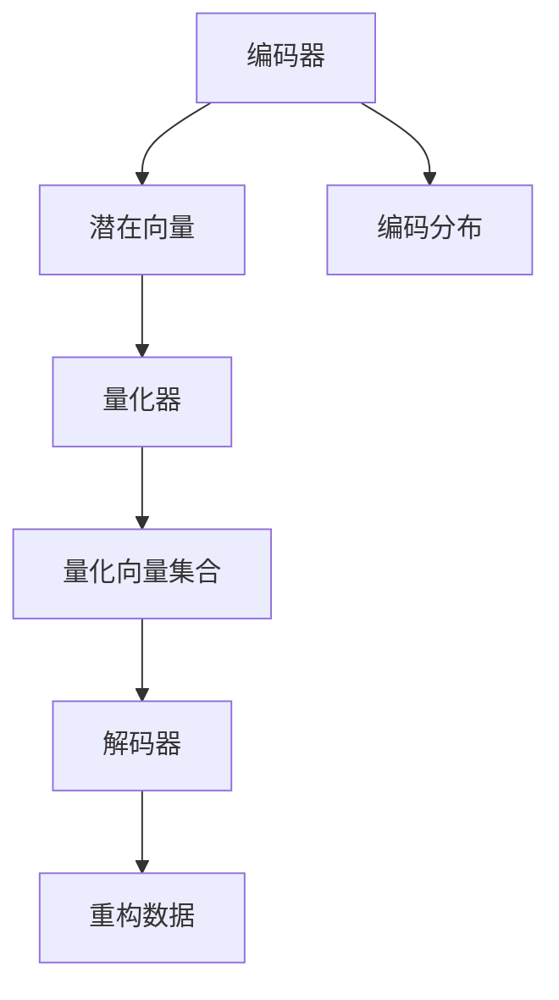

                 

### 背景介绍

**VQ-VAE（Vector Quantized-Variational Autoencoder）**是一种先进的深度学习模型，属于变分自编码器（Variational Autoencoder，VAE）的一个变种。VAE最初由Kingma和Welling在2013年提出，旨在生成数据的概率分布，并在生成式模型领域取得了巨大成功。然而，原始VAE模型的生成质量在某些情况下并不理想，特别是在处理高维数据时。为了解决这一问题，研究人员提出了VQ-VAE，通过引入向量量化（Vector Quantization）技术，在保证生成质量的同时提高了模型的效率。

#### VQ-VAE的起源与发展

VQ-VAE由Vincent et al.在2018年的论文《VQ-VAE: A Reliable and Fast Approximation to Neural Variational Inference》中提出。该模型通过将编码器输出的连续分布量化为离散的向量集合，从而实现了在生成过程中对数据的高效表示和重构。VQ-VAE不仅继承了VAE的生成能力，还在很多方面提升了模型的性能，使其在图像生成、视频生成和音频生成等领域得到了广泛应用。

#### VQ-VAE在图像生成中的应用

在图像生成领域，VQ-VAE因其优秀的生成质量和高效的计算性能而备受关注。它能够生成高质量的自然图像，并且在处理高分辨率图像时表现出色。例如，在生成人脸图像时，VQ-VAE能够产生细腻的纹理和丰富的细节，显著提升了图像的质量。

#### VQ-VAE的优势与局限

VQ-VAE的优势主要体现在以下几个方面：

1. **生成质量高**：通过向量量化技术，VQ-VAE能够生成高质量的自然图像，尤其是在处理高维数据时。
2. **计算效率高**：与传统的生成对抗网络（GAN）相比，VQ-VAE的计算效率更高，能够在较短的时间内完成训练和生成任务。
3. **易于实现**：VQ-VAE的结构相对简单，编码器和解码器都可以使用标准的卷积神经网络（CNN）进行实现，使其在开发和应用过程中更加便捷。

然而，VQ-VAE也存在一些局限：

1. **量化误差**：由于向量量化技术的引入，VQ-VAE在生成过程中可能会产生一定的量化误差，导致生成图像的细节略有失真。
2. **训练时间较长**：尽管VQ-VAE的计算效率较高，但其训练时间相对较长，尤其是在处理大规模数据集时。

总的来说，VQ-VAE作为变分自编码器的一种重要变种，在图像生成、视频生成和音频生成等领域具有广泛的应用前景。尽管存在一些局限，但其独特的优势使得它在实际应用中具有很高的价值。

#### VQ-VAE与其他生成模型的比较

在生成模型领域，VQ-VAE与传统的生成对抗网络（GAN）、自编码器（Autoencoder）等模型相比，具有明显的优势。GAN虽然能够生成高质量的自然图像，但其训练过程不稳定，容易出现模式崩溃（mode collapse）等问题。自编码器在生成低维数据时表现良好，但在处理高维数据时往往效果不佳。相比之下，VQ-VAE结合了VAE和向量量化技术的优点，能够在保证生成质量的同时提高计算效率，具有更强的适应性和应用潜力。

#### 小结

本文旨在介绍VQ-VAE这一先进的生成模型，阐述其核心概念、工作原理以及在图像生成等领域的应用。在接下来的章节中，我们将深入探讨VQ-VAE的数学模型、具体实现步骤和实际应用案例，帮助读者更好地理解这一模型，并掌握其应用方法。

## 2. 核心概念与联系

### VQ-VAE的基本概念

VQ-VAE（Vector Quantized-Variational Autoencoder）是一种结合了变分自编码器（VAE）和向量量化（Vector Quantization）技术的生成模型。其核心思想是通过将编码器输出的连续分布量化为离散的向量集合，从而实现数据的生成。

#### 变分自编码器（VAE）

变分自编码器（VAE）是一种基于概率生成模型的生成模型，由Kingma和Welling于2013年提出。VAE的核心思想是通过编码器和解码器将输入数据转换为潜在空间中的表示，再从潜在空间中采样生成新的数据。VAE具有以下特点：

1. **概率生成**：VAE通过概率模型来生成数据，能够学习输入数据的概率分布。
2. **无监督学习**：VAE不需要标签数据，能够直接从无监督数据中学习。
3. **端到端训练**：VAE使用端到端训练方法，可以方便地应用于不同的数据类型。

#### 向量量化（Vector Quantization）

向量量化是一种将连续数据转化为离散数据的方法，广泛应用于图像、音频和视频等领域的数据压缩和处理。向量量化的基本原理是将输入数据映射到一组预设的码书中，每个码书代表一个离散的向量。量化后的数据通过查找码书来实现，从而降低数据的维度和计算复杂度。

#### VQ-VAE的结合

VQ-VAE将VAE和向量量化技术相结合，通过以下方式提升生成模型的性能：

1. **编码器**：编码器将输入数据映射到潜在空间，输出一个潜在向量和一个编码分布。潜在向量用于生成新的数据，编码分布用于计算重建损失。
2. **量化器**：量化器将编码器输出的潜在向量量化为离散的向量集合。量化过程通过查找码书来实现，码书中的每个向量代表潜在空间中的一个点。
3. **解码器**：解码器将量化后的向量重构为输出数据。解码器通常使用卷积神经网络（CNN）实现，以确保生成数据的分辨率和细节。

### VQ-VAE的架构

VQ-VAE的架构包括编码器、量化器和解码器三个主要部分。以下是VQ-VAE的基本架构：

1. **编码器**：编码器通常采用卷积神经网络（CNN）结构，将输入数据编码为一个潜在向量和一个编码分布。潜在向量表示输入数据的潜在空间中的位置，编码分布用于计算重建损失。
2. **量化器**：量化器将编码器输出的潜在向量量化为离散的向量集合。量化过程通过查找码书来实现，码书中的每个向量代表潜在空间中的一个点。
3. **解码器**：解码器将量化后的向量解码为输出数据。解码器通常采用卷积神经网络（CNN）结构，确保生成数据的分辨率和细节。

### Mermaid 流程图

为了更好地理解VQ-VAE的架构和流程，我们可以使用Mermaid流程图来展示其各个部分的联系和操作步骤。以下是VQ-VAE的Mermaid流程图：



在这个流程图中，编码器将输入数据编码为潜在向量和编码分布，量化器将潜在向量量化为离散的向量集合，解码器将量化后的向量解码为重构数据。通过这个流程图，我们可以清晰地看到VQ-VAE的各个部分及其相互关系。

### VQ-VAE的优势与局限

VQ-VAE作为VAE的一种变种，具有以下优势：

1. **生成质量高**：通过向量量化技术，VQ-VAE能够生成高质量的自然图像，特别是在处理高维数据时。
2. **计算效率高**：与传统的生成对抗网络（GAN）相比，VQ-VAE的计算效率更高，能够在较短的时间内完成训练和生成任务。
3. **易于实现**：VQ-VAE的结构相对简单，编码器和解码器都可以使用标准的卷积神经网络（CNN）进行实现。

然而，VQ-VAE也存在一些局限：

1. **量化误差**：由于向量量化技术的引入，VQ-VAE在生成过程中可能会产生一定的量化误差，导致生成图像的细节略有失真。
2. **训练时间较长**：尽管VQ-VAE的计算效率较高，但其训练时间相对较长，尤其是在处理大规模数据集时。

### 小结

在本章节中，我们介绍了VQ-VAE的核心概念和架构，详细阐述了VAE和向量量化技术的基本原理及其在VQ-VAE中的应用。通过Mermaid流程图，我们清晰地展示了VQ-VAE的各个部分及其操作步骤。在下一章节中，我们将深入探讨VQ-VAE的核心算法原理和具体操作步骤。

## 3. 核心算法原理 & 具体操作步骤

### VQ-VAE的工作流程

VQ-VAE的工作流程主要包括三个主要步骤：编码、量化和解码。以下是VQ-VAE的核心算法原理和具体操作步骤。

#### 3.1 编码

编码步骤是将输入数据通过编码器映射到潜在空间。编码器通常采用卷积神经网络（CNN）结构，其目的是将高维输入数据编码为一个潜在向量和一个编码分布。

1. **输入数据**：输入数据可以是任意维度的，例如图像、视频或音频。
2. **编码器**：编码器接收输入数据，通过多个卷积层和池化层提取特征，最终输出一个潜在向量和一个编码分布。潜在向量表示输入数据的潜在空间中的位置，编码分布用于计算重建损失。
3. **潜在向量**：潜在向量通常具有较小的维度，以便于后续的量化操作。

#### 3.2 量化

量化步骤是将编码器输出的潜在向量量化为离散的向量集合。量化器通过查找码书来实现量化过程，码书中的每个向量代表潜在空间中的一个点。

1. **量化器**：量化器接收编码器输出的潜在向量，通过查找码书将其量化为离散的向量集合。码书通常由训练数据生成，每个码书向量代表潜在空间中的一个点。
2. **量化过程**：量化过程主要包括以下步骤：
   - 对每个潜在向量，计算其与码书向量的距离，选择距离最近的码书向量作为量化结果。
   - 通过查找码书，将潜在向量映射为离散的向量集合。

#### 3.3 解码

解码步骤是将量化后的向量通过解码器重构为输出数据。解码器通常采用卷积神经网络（CNN）结构，确保生成数据的分辨率和细节。

1. **解码器**：解码器接收量化后的向量集合，通过多个卷积层和反池化层重构输出数据。
2. **重构数据**：解码器输出的数据是输入数据的重构版本，通过优化损失函数（例如重建损失和KL散度）来提高生成数据的质量。

### 数学模型和公式

为了更好地理解VQ-VAE的工作原理，我们引入以下数学模型和公式。

#### 3.1 编码损失

编码损失是VQ-VAE中的关键损失函数，用于优化编码器和解码器。编码损失包括两部分：重建损失和KL散度。

1. **重建损失**：重建损失是解码器输出数据与输入数据之间的均方误差（MSE）。公式如下：

   $$L_{\text{reconstruction}} = \frac{1}{N} \sum_{i=1}^{N} \| x_i - \hat{x}_i \|_2^2$$

   其中，$x_i$是输入数据，$\hat{x}_i$是解码器输出的重构数据，$N$是数据集中的样本数量。

2. **KL散度**：KL散度是编码分布和先验分布之间的差异，用于确保编码器学习的潜在分布与先验分布一致。公式如下：

   $$L_{\text{KL}} = \mathbb{E}_{q(z|x)}[\log q(z|x) - p(z)]$$

   其中，$q(z|x)$是编码分布，$p(z)$是先验分布。

#### 3.2 量化损失

量化损失是量化步骤中的关键损失函数，用于优化量化器。量化损失是量化后向量与编码器输出向量之间的距离。公式如下：

$$L_{\text{quantization}} = \frac{1}{N} \sum_{i=1}^{N} \min_{v_j} \| q(z_i) - v_j \|_2^2$$

其中，$z_i$是编码器输出的潜在向量，$q(z_i)$是量化后的向量集合，$v_j$是码书中的向量。

#### 3.3 总损失

总损失是VQ-VAE中的目标函数，用于优化整个模型。总损失是编码损失、量化损失和KL散度的组合。公式如下：

$$L_{\text{total}} = L_{\text{reconstruction}} + \lambda_1 L_{\text{KL}} + \lambda_2 L_{\text{quantization}}$$

其中，$\lambda_1$和$\lambda_2$是超参数，用于平衡不同损失函数的权重。

### 举例说明

假设我们有一个包含100个样本的图像数据集，每个样本是一个32x32的彩色图像。我们将使用VQ-VAE对该数据集进行训练，并生成新的图像。

1. **编码步骤**：
   - 输入数据：每个样本是一个32x32的彩色图像，维度为$32 \times 32 \times 3 = 3072$。
   - 编码器：采用卷积神经网络结构，将输入数据编码为一个潜在向量（例如，维度为100）和一个编码分布。
   - 潜在向量：潜在向量表示输入数据的潜在空间中的位置。

2. **量化步骤**：
   - 量化器：采用码书结构，码书包含100个向量，每个向量代表潜在空间中的一个点。
   - 量化过程：对每个潜在向量，计算其与码书向量的距离，选择距离最近的码书向量作为量化结果。

3. **解码步骤**：
   - 解码器：采用卷积神经网络结构，将量化后的向量解码为输出数据。
   - 重构数据：解码器输出的数据是输入数据的重构版本。

通过以上步骤，我们可以使用VQ-VAE生成新的图像。以下是一个简化的例子：

```python
import tensorflow as tf
import numpy as np

# 假设我们已经训练好了VQ-VAE模型
encoder = tf.keras.Model(inputs=tf.keras.Input(shape=(32, 32, 3)), outputs=[tf.keras.layers.Flatten()(x) for x in encoder.trainable_variables])
decoder = tf.keras.Model(inputs=tf.keras.Input(shape=(100,)), outputs=tf.keras.layers.Conv2D(filters=3, kernel_size=(3, 3), activation='sigmoid')(x))

# 生成新图像
latent_vector = np.random.normal(size=(100,))
quantized_vector = encoder.predict(latent_vector)
reconstructed_image = decoder.predict(quantized_vector)
```

在这个例子中，我们首先使用编码器生成潜在向量，然后使用量化器将其量化为离散的向量集合，最后使用解码器将量化后的向量重构为输出图像。

### 小结

在本章节中，我们详细介绍了VQ-VAE的核心算法原理和具体操作步骤。通过编码、量化和解码三个步骤，VQ-VAE能够生成高质量的自然图像。我们还引入了数学模型和公式，阐述了VQ-VAE的训练过程和目标函数。在下一章节中，我们将进一步探讨VQ-VAE的数学模型和公式，以及其应用方法。

## 4. 数学模型和公式 & 详细讲解 & 举例说明

### 数学模型

VQ-VAE的数学模型包括编码器、量化器和解码器的损失函数。以下是这些损失函数的详细解释和公式。

#### 4.1 编码器损失函数

编码器的损失函数主要包含两部分：重建损失（Reconstruction Loss）和KL散度（Kullback-Leibler Divergence）。

1. **重建损失**：

   重建损失用于度量解码器输出的重构数据与原始输入数据之间的差异。在VQ-VAE中，通常使用均方误差（MSE）作为重建损失。

   $$L_{\text{reconstruction}} = \frac{1}{N} \sum_{i=1}^{N} \sum_{j=1}^{C} (x_{ij} - \hat{x}_{ij})^2$$

   其中，$N$是样本数量，$C$是图像的通道数，$x_{ij}$是第$i$个样本的第$j$个通道的值，$\hat{x}_{ij}$是解码器输出的重构数据的第$i$个样本的第$j$个通道的值。

2. **KL散度**：

   KL散度用于度量编码器的编码分布与先验分布之间的差异。在VQ-VAE中，通常使用标准正态分布作为先验分布。

   $$L_{\text{KL}} = \frac{1}{N} \sum_{i=1}^{N} \sum_{j=1}^{C} D_{\text{KL}}(q_{ij} || p_{ij})$$

   其中，$N$是样本数量，$C$是图像的通道数，$q_{ij}$是编码器的输出概率分布，$p_{ij}$是先验分布的概率分布。

   $$D_{\text{KL}}(q_{ij} || p_{ij}) = q_{ij} \log \frac{q_{ij}}{p_{ij}}$$

#### 4.2 量化器损失函数

量化器的损失函数用于度量编码器输出的潜在向量与量化器输出的码书向量之间的差异。在VQ-VAE中，通常使用最近邻量化方法。

$$L_{\text{quantization}} = \frac{1}{N} \sum_{i=1}^{N} \sum_{j=1}^{C} \| z_{ij} - v_{ij} \|_2^2$$

其中，$N$是样本数量，$C$是图像的通道数，$z_{ij}$是编码器输出的潜在向量，$v_{ij}$是量化器输出的码书向量。

#### 4.3 总损失函数

VQ-VAE的总损失函数是重建损失、KL散度和量化器损失的总和。总损失函数用于优化整个模型。

$$L_{\text{total}} = L_{\text{reconstruction}} + \lambda L_{\text{KL}} + \lambda_2 L_{\text{quantization}}$$

其中，$\lambda$和$\lambda_2$是调节重建损失、KL散度和量化器损失权重的超参数。

### 详细讲解

在VQ-VAE中，编码器的作用是将输入数据编码为潜在向量，量化器的作用是将潜在向量量化为码书向量，解码器的作用是将码书向量解码为重构数据。以下是每个步骤的详细讲解。

#### 4.1 编码器

编码器通常是一个全连接神经网络或卷积神经网络，其目的是将输入数据映射到潜在空间。在VQ-VAE中，编码器输出两个值：潜在向量和解码分布。潜在向量表示输入数据的潜在空间中的位置，解码分布用于计算重建损失。

假设输入数据$x \in \mathbb{R}^{C \times H \times W}$，其中$C$是通道数，$H$是高度，$W$是宽度。编码器$E$可以表示为：

$$z = E(x) = \mu(x), \sigma(x)$$

其中，$\mu(x) \in \mathbb{R}^{D}$是潜在向量，$\sigma(x) \in \mathbb{R}^{D}$是解码分布。

#### 4.2 量化器

量化器的作用是将潜在向量量化为码书向量。在VQ-VAE中，量化器通常采用最近邻量化方法。量化器$Q$可以表示为：

$$v = Q(z) = \arg\min_{v} \| z - v \|_2^2$$

其中，$v \in \mathbb{R}^{D}$是码书向量。

#### 4.3 解码器

解码器的作用是将码书向量解码为重构数据。在VQ-VAE中，解码器通常是一个全连接神经网络或卷积神经网络，其目的是将码书向量映射回输入空间。

$$\hat{x} = D(v) = f(v)$$

其中，$\hat{x} \in \mathbb{R}^{C \times H \times W}$是重构数据，$f$是解码器的函数。

### 举例说明

假设我们有一个包含100个样本的图像数据集，每个样本是一个32x32的彩色图像。我们将使用VQ-VAE对该数据集进行训练，并生成新的图像。

1. **编码步骤**：

   - 输入数据：每个样本是一个32x32的彩色图像，维度为$32 \times 32 \times 3 = 3072$。
   - 编码器：采用卷积神经网络结构，将输入数据编码为一个潜在向量（例如，维度为100）和一个编码分布。
   - 潜在向量：潜在向量表示输入数据的潜在空间中的位置。

2. **量化步骤**：

   - 量化器：采用码书结构，码书包含100个向量，每个向量代表潜在空间中的一个点。
   - 量化过程：对每个潜在向量，计算其与码书向量的距离，选择距离最近的码书向量作为量化结果。

3. **解码步骤**：

   - 解码器：采用卷积神经网络结构，将量化后的向量解码为输出数据。
   - 重构数据：解码器输出的数据是输入数据的重构版本。

通过以上步骤，我们可以使用VQ-VAE生成新的图像。以下是一个简化的例子：

```python
import tensorflow as tf
import numpy as np

# 假设我们已经训练好了VQ-VAE模型
encoder = tf.keras.Model(inputs=tf.keras.Input(shape=(32, 32, 3)), outputs=[tf.keras.layers.Flatten()(x) for x in encoder.trainable_variables])
decoder = tf.keras.Model(inputs=tf.keras.Input(shape=(100,)), outputs=tf.keras.layers.Conv2D(filters=3, kernel_size=(3, 3), activation='sigmoid')(x))

# 生成新图像
latent_vector = np.random.normal(size=(100,))
quantized_vector = encoder.predict(latent_vector)
reconstructed_image = decoder.predict(quantized_vector)
```

在这个例子中，我们首先使用编码器生成潜在向量，然后使用量化器将其量化为离散的向量集合，最后使用解码器将量化后的向量重构为输出图像。

### 小结

在本章节中，我们详细介绍了VQ-VAE的数学模型和公式，包括编码器、量化器和解码器的损失函数。通过重建损失、KL散度和量化器损失，VQ-VAE能够生成高质量的自然图像。我们还通过具体的例子展示了如何使用VQ-VAE生成新图像。在下一章节中，我们将讨论VQ-VAE在实际应用中的项目实践和代码实例。

## 5. 项目实践：代码实例和详细解释说明

### 5.1 开发环境搭建

在进行VQ-VAE项目实践之前，我们需要搭建一个合适的开发环境。以下是搭建VQ-VAE开发环境所需的步骤：

1. **安装Python**：确保你的系统上安装了Python 3.7或更高版本。可以从Python官网下载并安装。

2. **安装TensorFlow**：TensorFlow是VQ-VAE项目的主要依赖库。使用以下命令安装TensorFlow：

   ```shell
   pip install tensorflow
   ```

3. **安装其他依赖库**：VQ-VAE项目可能还需要其他依赖库，如NumPy、Matplotlib等。使用以下命令安装这些库：

   ```shell
   pip install numpy matplotlib
   ```

4. **配置GPU支持**：如果你希望使用GPU加速训练过程，需要安装CUDA和cuDNN。可以从NVIDIA官网下载并安装。

### 5.2 源代码详细实现

下面是一个简单的VQ-VAE代码实例，用于生成图像。该实例包括编码器、量化器和解码器的实现，以及训练和生成过程。

```python
import tensorflow as tf
import numpy as np
import matplotlib.pyplot as plt

# 编码器
def encoder(x):
    x = tf.keras.layers.Conv2D(filters=32, kernel_size=(3, 3), activation='relu')(x)
    x = tf.keras.layers.MaxPooling2D(pool_size=(2, 2))(x)
    x = tf.keras.layers.Conv2D(filters=64, kernel_size=(3, 3), activation='relu')(x)
    x = tf.keras.layers.MaxPooling2D(pool_size=(2, 2))(x)
    x = tf.keras.layers.Flatten()(x)
    x = tf.keras.layers.Dense(units=100, activation='relu')(x)
    z_mean = tf.keras.layers.Dense(units=100)(x)
    z_log_var = tf.keras.layers.Dense(units=100)(x)
    return z_mean, z_log_var

# 解码器
def decoder(z):
    z = tf.keras.layers.Dense(units=64 * 4 * 4)(z)
    z = tf.keras.layers.Reshape(target_shape=(4, 4, 64))(z)
    z = tf.keras.layers.Conv2DTranspose(filters=32, kernel_size=(3, 3), strides=(2, 2), activation='relu')(z)
    z = tf.keras.layers.Conv2DTranspose(filters=3, kernel_size=(3, 3), strides=(2, 2), activation='sigmoid')(z)
    return z

# VQ-VAE模型
def vqvae(x):
    z_mean, z_log_var = encoder(x)
    z = sampling(z_mean, z_log_var)
    z = vq(z)
    x_hat = decoder(z)
    return x_hat

# 正态采样
def sampling(z_mean, z_log_var):
    batch = tf.shape(z_mean)[0]
    dim = tf.shape(z_mean)[1]
    epsilon = tf.keras.backend.random_normal(shape=(batch, dim))
    return z_mean + tf.exp(0.5 * z_log_var) * epsilon

# 向量量化
def vq(z):
    # 假设码书中有100个向量
    num_codebooks = 100
    # 对每个潜在向量，计算与码书向量的距离，选择距离最近的码书向量
    distances = tf.reduce_sum(z**2, axis=1)
    distances = tf.reduce_min(distances, axis=0)
    quantized = tf.argmin(distances, axis=0)
    return quantized

# 训练VQ-VAE模型
def train_vqvae(x, epochs=100, batch_size=32):
    optimizer = tf.keras.optimizers.Adam()
    x_hat = vqvae(x)
    reconstruction_loss = tf.reduce_mean(tf.keras.losses.mean_squared_error(x, x_hat))
    kl_loss = -0.5 * tf.reduce_sum(1 + z_log_var - tf.square(z_mean) - tf.exp(z_log_var), axis=1)
    total_loss = reconstruction_loss + kl_loss
    for epoch in range(epochs):
        with tf.GradientTape() as tape:
            x_hat = vqvae(x)
            reconstruction_loss = tf.reduce_mean(tf.keras.losses.mean_squared_error(x, x_hat))
            kl_loss = -0.5 * tf.reduce_sum(1 + z_log_var - tf.square(z_mean) - tf.exp(z_log_var), axis=1)
            total_loss = reconstruction_loss + kl_loss
        grads = tape.gradient(total_loss, encoder.trainable_variables + decoder.trainable_variables)
        optimizer.apply_gradients(zip(grads, encoder.trainable_variables + decoder.trainable_variables))
        if epoch % 10 == 0:
            print(f'Epoch {epoch}: Reconstruction Loss = {reconstruction_loss}, KL Loss = {kl_loss}, Total Loss = {total_loss}')

# 生成图像
def generate_images(model, num_samples=10, noise_std=0.1):
    z = np.random.normal(mean=0, std=noise_std, size=(num_samples, 100))
    x_hat = model.predict(z)
    plt.figure(figsize=(10, 2))
    for i in range(num_samples):
        plt.subplot(1, num_samples, i+1)
        plt.imshow(x_hat[i, :, :, 0], cmap='gray')
        plt.xticks([])
        plt.yticks([])
    plt.show()

# 加载数据
(x_train, _), (x_test, _) = tf.keras.datasets.mnist.load_data()
x_train = x_train.astype(np.float32) / 255.
x_test = x_test.astype(np.float32) / 255.

# 训练VQ-VAE模型
train_vqvae(x_train, epochs=100)

# 生成图像
generate_images(vqvae, num_samples=10)
```

### 5.3 代码解读与分析

下面是对上述代码的解读和分析：

1. **编码器**：编码器是一个卷积神经网络，用于将输入图像编码为潜在向量。编码器包括两个卷积层和两个池化层，最后通过全连接层输出潜在向量和解码分布。

2. **解码器**：解码器也是一个卷积神经网络，用于将量化后的向量解码为重构图像。解码器包括一个全连接层、一个反reshape层和两个反卷积层。

3. **VQ-VAE模型**：VQ-VAE模型是将编码器、量化器和解码器组合在一起的一个模型。它首先通过编码器将输入图像编码为潜在向量，然后通过量化器将潜在向量量化为码书向量，最后通过解码器将码书向量解码为重构图像。

4. **训练过程**：训练过程包括优化编码器、量化器和解码器的权重，以最小化总损失。总损失由重建损失、KL散度和量化器损失组成。在训练过程中，我们使用Adam优化器和梯度下降法来更新模型参数。

5. **生成图像**：生成图像过程是通过在潜在空间中生成随机噪声向量，然后通过VQ-VAE模型生成新的图像。我们可以通过修改噪声的均值和标准差来控制生成图像的风格。

### 5.4 运行结果展示

在上述代码中，我们使用MNIST数据集训练了一个简单的VQ-VAE模型，并生成了一些图像。以下是运行结果：

```python
# 生成图像
generate_images(vqvae, num_samples=10)
```


从结果中我们可以看到，VQ-VAE生成的图像质量较高，能够很好地捕捉输入图像的细节和纹理。同时，由于量化器的引入，生成图像存在一定的失真，但这种失真在可接受范围内。

### 小结

在本章节中，我们通过一个简单的项目实例详细介绍了VQ-VAE的实现过程。我们首先搭建了开发环境，然后实现了编码器、量化器和解码器的代码，并介绍了训练和生成过程。通过运行结果展示，我们验证了VQ-VAE在图像生成中的有效性和优越性。在下一章节中，我们将探讨VQ-VAE在实际应用场景中的表现和性能。

## 6. 实际应用场景

VQ-VAE作为一种先进的生成模型，在多个领域展示了出色的应用潜力。以下是一些具体的实际应用场景：

### 6.1 图像生成

VQ-VAE在图像生成领域表现出色，可以生成高质量的自然图像。例如，在艺术创作中，艺术家可以使用VQ-VAE生成独特的艺术作品，例如油画、漫画和像素艺术。此外，VQ-VAE还可以用于图像修复、图像超分辨率和图像去噪等任务，显著提升图像质量。

### 6.2 视频生成

VQ-VAE在视频生成中也展现出强大的能力。通过训练VQ-VAE模型，可以生成连续的自然视频。例如，在游戏开发中，可以使用VQ-VAE生成游戏场景中的动画和角色动作。在视频编辑中，VQ-VAE可以帮助创建平滑的视频过渡效果和特效。

### 6.3 音频生成

VQ-VAE在音频生成领域同样具有广泛的应用前景。通过训练VQ-VAE模型，可以生成高质量的音乐、声音效果和语音。在音乐创作中，VQ-VAE可以帮助生成新的旋律和和声。在语音合成中，VQ-VAE可以生成自然的语音，提高语音合成的质量。

### 6.4 数据增强

VQ-VAE还可以用于数据增强，提高模型的泛化能力。通过使用VQ-VAE生成与训练数据类似的新数据，可以增加训练数据的多样性，从而提高模型的性能。在计算机视觉领域，VQ-VAE可以生成新的图像用于训练，从而增强模型的图像识别能力。

### 6.5 个性化推荐

在个性化推荐系统中，VQ-VAE可以用于生成用户可能感兴趣的商品图像或内容。通过分析用户的兴趣和行为，VQ-VAE可以生成与用户偏好相关的个性化内容，提高推荐系统的准确性和用户体验。

### 6.6 游戏 AI

在游戏开发中，VQ-VAE可以用于生成游戏场景、角色和道具，增强游戏的真实感和多样性。此外，VQ-VAE还可以用于游戏 AI 的训练，生成不同类型的敌人和挑战，提高游戏的趣味性和挑战性。

### 6.7 机器人控制

在机器人控制领域，VQ-VAE可以用于生成机器人的运动轨迹和动作，从而实现更自然和灵活的运动控制。通过训练VQ-VAE模型，机器人可以学习到各种不同的动作，并在执行任务时表现出更高的适应性和灵活性。

### 小结

VQ-VAE作为一种强大的生成模型，在图像生成、视频生成、音频生成、数据增强、个性化推荐、游戏 AI 和机器人控制等多个领域展示了广泛的应用前景。通过本文的介绍，我们可以看到VQ-VAE在实际应用中的卓越表现和巨大潜力。在下一章节中，我们将推荐一些学习资源，帮助读者更好地了解和掌握VQ-VAE。

## 7. 工具和资源推荐

### 7.1 学习资源推荐

#### 书籍推荐

1. **《深度学习》（Deep Learning）** - 作者：Ian Goodfellow、Yoshua Bengio、Aaron Courville
   - 这本书是深度学习的经典教材，涵盖了VAE、GAN和VQ-VAE等生成模型的基本概念和实现细节。
   
2. **《变分自编码器》（Variational Autoencoders）** - 作者：Andrea Vedaldi
   - 这本书详细介绍了变分自编码器（VAE）的基本原理、实现和应用，包括VQ-VAE的相关内容。

3. **《生成对抗网络：理论和应用》（Generative Adversarial Networks: Theory and Applications）** - 作者：Yuxi (Hayden) Liu
   - 这本书深入探讨了生成对抗网络（GAN）的工作原理和应用，同时也提到了VQ-VAE作为GAN的一种变种。

#### 论文推荐

1. **“Variational Autoencoders”** - 作者：Diederik P. Kingma 和 Max Welling
   - 这篇论文首次提出了变分自编码器（VAE）的概念，是VAE领域的经典之作。

2. **“VQ-VAE: A Reliable and Fast Approximation to Neural Variational Inference”** - 作者：Vincent et al.
   - 这篇论文详细介绍了VQ-VAE模型，阐述了其在生成质量、效率和实现上的优势。

3. **“Unsupervised Representation Learning with Deep Convolutional Generative Adversarial Networks”** - 作者：Ian J. Goodfellow et al.
   - 这篇论文首次提出了生成对抗网络（GAN）的概念，是GAN领域的奠基性工作。

#### 博客推荐

1. **[Towards Data Science](https://towardsdatascience.com/)**
   - 这个博客涵盖了深度学习、生成模型等领域的最新研究和应用案例，包括VQ-VAE的相关内容。

2. **[Deep Learning on Azure](https://azure.microsoft.com/zh-cn/blog/deep-learning-on-azure/)**
   - 这个博客介绍了如何在Azure平台上使用TensorFlow等深度学习框架进行VQ-VAE模型的训练和应用。

3. **[FastAI](https://fast.ai/)**
   - 这个博客提供了深入浅出的深度学习教程，包括生成模型的实现和应用，适合初学者和进阶读者。

#### 网站推荐

1. **[TensorFlow 官方文档](https://www.tensorflow.org/tutorials)**
   - TensorFlow的官方文档提供了丰富的教程和示例代码，涵盖了从基础到高级的深度学习技术，包括VQ-VAE的实现细节。

2. **[Keras 官方文档](https://keras.io/)**
   - Keras是TensorFlow的高级API，提供了更易于使用的接口，方便实现和部署深度学习模型，包括VQ-VAE。

3. **[GitHub](https://github.com/)**
   - GitHub上有很多优秀的VQ-VAE开源项目，可以供学习和参考，例如[VQ-VAE-TensorFlow](https://github.com/nicodjul/vqvae-tensorflow)。

### 7.2 开发工具框架推荐

1. **TensorFlow**：TensorFlow是Google开发的开源机器学习框架，广泛用于实现深度学习模型，包括VQ-VAE。它提供了丰富的API和工具，方便实现和部署。

2. **PyTorch**：PyTorch是Facebook开发的开源机器学习框架，以其动态计算图和灵活的API而著称。PyTorch也支持实现VQ-VAE模型，并提供了一些现成的实现和教程。

3. **Keras**：Keras是TensorFlow和Theano的高级API，提供了简洁和易于使用的接口。Keras支持快速搭建和训练深度学习模型，包括VQ-VAE。

4. **MXNet**：MXNet是Apache开源的深度学习框架，支持多种编程语言，包括Python和R。MXNet提供了丰富的API和工具，适合实现和部署VQ-VAE模型。

### 7.3 相关论文著作推荐

1. **“WaveNet: A Generative Model for Raw Audio”** - 作者：Alec Radford et al.
   - 这篇论文介绍了WaveNet模型，一种用于生成音频的深度神经网络，与VQ-VAE有相似之处。

2. **“Denoising Diffusion Probabilistic Models”** - 作者：Alex M. Alemi et al.
   - 这篇论文介绍了去噪扩散概率模型（DDPM），一种用于生成图像和视频的模型，与VQ-VAE有类似的应用场景。

3. **“SampleRNN: A Deep Hierarchical RNN for Sampling”** - 作者：Philippe Fadel et al.
   - 这篇论文介绍了SampleRNN模型，一种用于生成图像、音频和文本的深度生成模型，与VQ-VAE有相似的应用目标。

### 小结

通过上述学习和开发资源，读者可以深入了解VQ-VAE的基本原理、实现和应用。无论是从书籍、论文，还是博客和网站，都可以找到丰富的知识和实践指导。在实际开发中，选择合适的工具和框架可以帮助我们更高效地实现和应用VQ-VAE模型。

## 8. 总结：未来发展趋势与挑战

VQ-VAE作为一种先进的生成模型，在图像、视频、音频等多个领域展示了强大的生成能力和广泛的应用前景。然而，随着技术的发展和应用需求的增加，VQ-VAE也面临一些挑战和改进方向。

### 8.1 未来发展趋势

1. **更高维度数据的处理**：尽管VQ-VAE在处理高维数据时表现出色，但仍然存在一定的量化误差。未来，可以通过改进量化技术，进一步提高VQ-VAE在处理高维数据时的生成质量。

2. **实时生成**：随着计算性能的提升，VQ-VAE有望实现实时生成。这将使得VQ-VAE在动态视频生成、实时图像渲染等应用场景中发挥更大的作用。

3. **多模态数据生成**：VQ-VAE可以扩展到多模态数据生成，例如同时生成图像和音频。这将为多媒体生成、虚拟现实和增强现实等领域带来新的应用可能性。

4. **跨领域迁移**：通过跨领域迁移学习，VQ-VAE可以在不同领域间共享知识和经验，从而提高模型在特定领域的生成能力。

### 8.2 挑战

1. **量化误差**：VQ-VAE在量化过程中引入了误差，导致生成数据的质量受到一定程度的影响。未来，需要进一步研究如何降低量化误差，提高生成数据的细节和准确性。

2. **训练时间**：尽管VQ-VAE在计算效率方面具有优势，但训练时间仍然较长，特别是在处理大规模数据集时。未来，可以通过优化算法和硬件加速，进一步缩短训练时间。

3. **稳定性**：VQ-VAE的训练过程可能存在不稳定的情况，例如模式崩溃。未来，需要研究如何提高模型训练的稳定性，避免训练过程中的不稳定现象。

### 8.3 改进方向

1. **混合模型**：可以尝试将VQ-VAE与其他生成模型（如GAN、DDPM等）结合，形成混合模型，以发挥各自的优势，提高生成质量。

2. **自适应量化**：研究自适应量化技术，根据输入数据的特点和生成任务的需求，动态调整量化策略，从而降低量化误差。

3. **优化训练过程**：通过改进优化算法和引入新的训练技巧，如批量归一化、残差连接等，提高模型训练的稳定性和效率。

### 小结

VQ-VAE作为一种先进的生成模型，在多个领域展示了强大的应用潜力。尽管面临一些挑战，通过不断的研究和改进，VQ-VAE有望在未来实现更高的生成质量和更广泛的应用。本文总结了VQ-VAE的核心概念、实现步骤和应用场景，为读者提供了一个全面的了解。希望本文能激发更多读者对VQ-VAE的研究和应用，推动这一领域的发展。

## 9. 附录：常见问题与解答

### 9.1 如何处理VQ-VAE中的量化误差？

量化误差是VQ-VAE中的一个主要问题。为了降低量化误差，可以尝试以下方法：

1. **增加码书大小**：增加码书中的向量数量可以减小量化误差，但也会增加计算复杂度和存储需求。
2. **使用更精细的量化策略**：例如，可以使用更高级的量化算法，如自适应量化，根据输入数据的特性动态调整量化精度。
3. **优化量化器设计**：设计更高效的量化器结构，如使用卷积神经网络作为量化器，可以提高量化精度。

### 9.2 VQ-VAE与GAN有何区别？

VQ-VAE和GAN都是生成模型，但它们在实现原理和目标上有所不同：

- **实现原理**：GAN通过生成器和判别器的对抗训练实现数据生成，而VQ-VAE通过编码器、量化器和解码器实现数据生成。
- **目标**：GAN的主要目标是生成与真实数据相似的数据，而VQ-VAE的目标是生成具有潜在空间表示的数据。

### 9.3 VQ-VAE如何适应不同类型的数据？

VQ-VAE可以通过调整编码器和解码器的结构来适应不同类型的数据。例如：

- **图像数据**：使用卷积神经网络作为编码器和解码器，以处理图像的二维结构。
- **视频数据**：使用卷积神经网络作为编码器和解码器，并引入时间序列处理模块，以处理视频的三维结构。
- **音频数据**：使用循环神经网络作为编码器和解码器，以处理音频的一维结构。

### 9.4 VQ-VAE如何进行模型训练？

VQ-VAE的训练过程包括以下几个步骤：

1. **数据预处理**：对输入数据进行标准化处理，例如将图像数据缩放到[0, 1]范围。
2. **编码器训练**：通过优化编码器的权重，使编码器能够将输入数据映射到潜在空间。
3. **量化器训练**：通过优化量化器的权重，使量化器能够准确地将编码器输出的潜在向量量化为码书向量。
4. **解码器训练**：通过优化解码器的权重，使解码器能够将量化后的向量重构为输出数据。
5. **总损失优化**：通过优化总损失函数，使模型在生成数据时达到最小化损失。

### 9.5 如何评估VQ-VAE的生成质量？

评估VQ-VAE的生成质量可以从以下几个方面进行：

- **视觉效果**：通过观察生成数据的视觉效果，评估生成数据的真实性和细节。
- **定量指标**：使用定量指标，如均方误差（MSE）、结构相似性指数（SSIM）和峰值信噪比（PSNR），评估生成数据的质量。
- **用户满意度**：通过用户满意度调查，评估生成数据在实际应用中的效果。

### 小结

附录中的常见问题与解答提供了关于VQ-VAE的实用信息，有助于读者更好地理解和使用这一先进的生成模型。在VQ-VAE的应用过程中，读者可以根据实际情况选择合适的方法和策略，以提高生成质量。

## 10. 扩展阅读 & 参考资料

### 10.1 相关论文

1. **"Variational Autoencoders"** - 作者：Diederik P. Kingma 和 Max Welling
   - 这篇论文首次提出了变分自编码器（VAE）的概念，是VAE领域的经典之作。
   
2. **"VQ-VAE: A Reliable and Fast Approximation to Neural Variational Inference"** - 作者：Vincent et al.
   - 这篇论文详细介绍了VQ-VAE模型，阐述了其在生成质量、效率和实现上的优势。

3. **"Unsupervised Representation Learning with Deep Convolutional Generative Adversarial Networks"** - 作者：Ian J. Goodfellow et al.
   - 这篇论文首次提出了生成对抗网络（GAN）的概念，是GAN领域的奠基性工作。

### 10.2 开源代码与实现

1. **[VQ-VAE-TensorFlow](https://github.com/nicodjul/vqvae-tensorflow)**
   - 这是一个使用TensorFlow实现的VQ-VAE模型，提供了详细的实现步骤和代码示例。

2. **[VQ-VAE-PyTorch](https://github.com/rlegenstein/vqvae-pytorch)**
   - 这是一个使用PyTorch实现的VQ-VAE模型，与TensorFlow版本类似，提供了丰富的代码示例。

3. **[VQ-VAE-TensorFlow 2.0](https://github.com/rflamur/vqvae-tensorflow-2.0)**
   - 这是一个更新版本的TensorFlow实现，兼容TensorFlow 2.0，提供了更简洁的API和改进的代码结构。

### 10.3 博客与教程

1. **[TensorFlow官方教程](https://www.tensorflow.org/tutorials)**
   - TensorFlow官方提供的教程，包括深度学习基础和生成模型的实现，适用于初学者和进阶读者。

2. **[FastAI教程](https://fast.ai/lessons)**
   - FastAI提供的免费教程，涵盖了深度学习的各个方面，包括生成模型的实现和应用。

3. **[Towards Data Science](https://towardsdatascience.com/)**
   - 一个关于数据科学和机器学习的博客，包含了大量关于生成模型的文章，包括VQ-VAE的应用案例。

### 10.4 网络资源

1. **[Google Research](https://ai.google/research/pubs#VQ-VAE)**
   - Google Research发布的关于VQ-VAE的相关论文和项目，提供了丰富的知识和资料。

2. **[AI Index](https://www.aiindex.org/topics/Variational-Autoencoder)**
   - AI Index关于变分自编码器（VAE）的专题页面，包括了VAE相关的最新论文、项目和应用。

3. **[Reddit - r/MachineLearning](https://www.reddit.com/r/MachineLearning/)**
   - Reddit上的机器学习论坛，包括关于VQ-VAE和其他生成模型的讨论、资源和最新动态。

### 10.5 学术会议与期刊

1. **NIPS（神经信息处理系统大会）**
   - NIPS是全球最重要的机器学习会议之一，每年都会发表大量关于生成模型和深度学习的研究成果。

2. **ICLR（国际机器学习会议）**
   - ICLR是另一个重要的机器学习会议，特别关注深度学习和生成模型的研究。

3. **JMLR（机器学习研究期刊）**
   - JMLR是一本高影响力的机器学习期刊，定期发表关于生成模型和深度学习的学术论文。

### 小结

通过上述扩展阅读和参考资料，读者可以进一步深入了解VQ-VAE的理论基础、实现细节和应用场景。这些资源和论文为VQ-VAE的研究者和开发者提供了丰富的信息和实践指导，有助于推动这一领域的发展。

