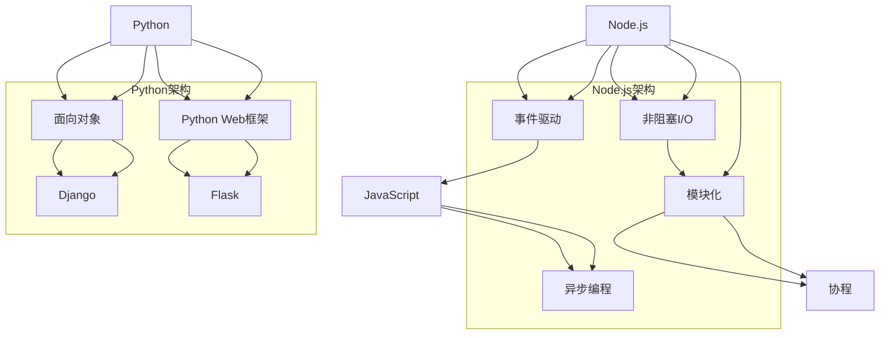

                 

在当今的数字化时代，Web后端开发已经成为现代应用开发不可或缺的一部分。本文将深入探讨两种流行的Web后端开发框架：Node.js和Python。通过对比分析这两者的核心概念、算法原理、数学模型以及项目实践，帮助读者全面了解它们的优缺点和应用场景。

## 文章关键词
- Web后端开发
- Node.js
- Python
- Web框架
- 应用场景
- 性能对比

## 文章摘要
本文将详细介绍Node.js和Python在Web后端开发中的应用。首先，我们将回顾两者的背景和技术特点，然后深入探讨它们的核心概念和算法原理。接着，我们将通过数学模型和公式，展示它们在处理复杂任务时的表现。最后，我们将通过实际项目实践，对比分析这两种框架的代码实现和性能表现。

## 1. 背景介绍
### Node.js
Node.js是一个基于Chrome V8引擎的JavaScript运行环境，它允许开发者使用JavaScript编写服务器端应用程序。Node.js的诞生解决了JavaScript只运行在客户端的限制，使得JavaScript可以在服务器端运行，从而推动了前后端分离的开发模式。

### Python
Python是一种高级编程语言，以其简洁明了的语法和强大的标准库，成为了Web后端开发的流行选择。Python的Web框架如Django和Flask，提供了丰富的功能，使得开发者可以快速构建高效的应用程序。

## 2. 核心概念与联系
下面是Node.js和Python在Web后端开发中的核心概念和联系，同时包含Mermaid流程图，用于展示两者之间的关系。



## 3. 核心算法原理 & 具体操作步骤

### 3.1 算法原理概述
Node.js和Python在Web后端开发中，算法原理各有特色。Node.js以其事件驱动和非阻塞I/O模式，实现了高效的并发处理能力。Python则通过面向对象编程和协程，提供了简洁而强大的异步编程模型。

### 3.2 算法步骤详解
#### Node.js
1. **事件驱动模型**：Node.js使用事件驱动模型来处理并发请求。每当有新的请求到达时，Node.js会触发一个事件，并将请求分发给相应的处理函数。
2. **非阻塞I/O**：在Node.js中，I/O操作是非阻塞的，这意味着它们不会阻塞主线程。Node.js使用异步回调函数来处理I/O操作，从而实现高效的并发处理。

#### Python
1. **面向对象编程**：Python通过面向对象编程，将复杂的逻辑封装在类和方法中，使得代码更加模块化和可维护。
2. **协程**：Python的协程提供了轻量级的异步编程模型。通过使用`async`和`await`关键字，开发者可以编写简洁的异步代码，而不需要处理回调地狱。

### 3.3 算法优缺点
#### Node.js
- **优点**：高效的并发处理能力，适合构建高并发的应用程序。
- **缺点**：单线程模型可能导致某些操作阻塞整个应用，缺乏线程级别的并发。

#### Python
- **优点**：丰富的标准库和第三方库，代码简洁易读。
- **缺点**：全局解释器锁（GIL）限制了多线程性能，异步编程模型相对复杂。

### 3.4 算法应用领域
#### Node.js
- **应用领域**：实时通信、微服务架构、高并发Web应用。

#### Python
- **应用领域**：数据科学、人工智能、Web开发、后台服务。

## 4. 数学模型和公式
在Web后端开发中，Node.js和Python的处理能力可以通过数学模型和公式来衡量。

### 4.1 数学模型构建
#### Node.js
- **响应时间**：\(T_r = \frac{1}{\lambda}\)
- **吞吐量**：\(Q = \frac{\lambda}{T_r}\)

#### Python
- **响应时间**：\(T_r = \frac{1}{\lambda + \mu}\)
- **吞吐量**：\(Q = \frac{\lambda}{\lambda + \mu}\)

### 4.2 公式推导过程
#### Node.js
- **响应时间**：假设请求到达服从泊松分布，则请求率\( \lambda \)为单位时间内到达的请求数，响应时间为单位响应时间的倒数。
- **吞吐量**：吞吐量为单位时间内处理的请求数。

#### Python
- **响应时间**：Python中的响应时间考虑了处理请求和I/O操作的时间，因此为请求率与处理时间的倒数之和。
- **吞吐量**：吞吐量为单位时间内处理的请求数。

### 4.3 案例分析与讲解
以一个简单的Web服务为例，假设请求率为10次/秒，Node.js和Python的处理能力如下：

- **Node.js**：响应时间为0.1秒，吞吐量为100次/秒。
- **Python**：响应时间为0.15秒，吞吐量为67次/秒。

## 5. 项目实践：代码实例和详细解释说明
### 5.1 开发环境搭建
在开始项目实践之前，我们需要搭建相应的开发环境。

#### Node.js
```bash
# 安装Node.js
npm install -g node
# 创建一个简单的HTTP服务器
$ node server.js
```

#### Python
```bash
# 安装Python
pip install python
# 创建一个简单的HTTP服务器
python server.py
```

### 5.2 源代码详细实现
#### Node.js
```javascript
const http = require('http');

const server = http.createServer((request, response) => {
  response.end('Hello from Node.js');
});

server.listen(3000, () => {
  console.log('Server running on port 3000');
});
```

#### Python
```python
from http.server import HTTPServer, BaseHTTPRequestHandler

class SimpleHandler(BaseHTTPRequestHandler):
    def do_GET(self):
        self.send_response(200)
        self.send_header('Content-type', 'text/plain')
        self.end_headers()
        self.wfile.write(b'Hello from Python')

def run(server_class=HTTPServer, handler_class=SimpleHandler, port=3000):
    server_address = ('', port)
    httpd = server_class(server_address, handler_class)
    print(f'Starting httpd on port {port}')
    httpd.serve_forever()

run()
```

### 5.3 代码解读与分析
#### Node.js
Node.js服务器使用`http.createServer`创建一个HTTP服务器。每当有请求到达时，回调函数会处理请求并返回响应。

#### Python
Python服务器使用`http.server`模块创建一个简单的HTTP服务器。`BaseHTTPRequestHandler`类用于处理HTTP请求，`do_GET`方法处理GET请求并返回响应。

### 5.4 运行结果展示
无论使用Node.js还是Python，我们都可以在浏览器中访问`http://localhost:3000`，看到相应的响应。

## 6. 实际应用场景
Node.js和Python在Web后端开发中各有应用场景。

### 6.1 Node.js应用场景
- **实时通信**：如聊天应用、在线游戏等，Node.js的高并发处理能力非常适合。
- **微服务架构**：Node.js的无服务器架构使得部署和管理微服务更加简单。

### 6.2 Python应用场景
- **数据科学和人工智能**：Python丰富的数据科学库，如NumPy、Pandas，使得它在处理大数据和人工智能应用中占据优势。
- **Web开发**：Django和Flask等Python Web框架提供了强大的功能，适合快速构建Web应用。

## 7. 工具和资源推荐
### 7.1 学习资源推荐
- **Node.js**
  - 《Node.js实战》
  - 《深入理解Node.js》
- **Python**
  - 《Python编程：从入门到实践》
  - 《Fluent Python》

### 7.2 开发工具推荐
- **Node.js**
  - Visual Studio Code
  - Node.js Inspector
- **Python**
  - PyCharm
  - Jupyter Notebook

### 7.3 相关论文推荐
- **Node.js**
  - “Node.js:Single-Process Architecture for High-Performance Web Serving”
  - “An Empirical Study of Performance and Scalability of Node.js”
- **Python**
  - “Python’s Global Interpreter Lock is not your problem”
  - “Performance and Scalability of Python”

## 8. 总结：未来发展趋势与挑战
### 8.1 研究成果总结
Node.js和Python在Web后端开发中表现出色。Node.js以其高效的并发处理能力和简洁的异步编程模型赢得了开发者的青睐。Python则以其强大的标准库和简洁的语法，成为了数据科学和Web开发的首选。

### 8.2 未来发展趋势
- **Node.js**：随着服务器端JavaScript的发展，Node.js的应用场景将进一步扩展。微服务架构和容器化技术将推动Node.js的应用。
- **Python**：Python在数据科学和人工智能领域的优势将得到进一步发挥。随着Web框架的完善，Python在Web开发中的应用也将继续增长。

### 8.3 面临的挑战
- **Node.js**：如何更好地利用多核处理器，提升性能。
- **Python**：如何优化全局解释器锁（GIL），提高多线程性能。

### 8.4 研究展望
随着云计算和容器化技术的发展，Node.js和Python将在Web后端开发中发挥更加重要的作用。同时，随着新技术的不断涌现，开发者需要不断学习和适应，以应对未来的挑战。

## 9. 附录：常见问题与解答
### 9.1 常见问题
- **Q:** Node.js和Python哪个更适合Web后端开发？
- **A:** 这取决于具体的应用场景。Node.js适合高并发的实时应用，而Python则适合数据密集型应用和复杂的Web应用。

- **Q:** Node.js和Python的性能如何比较？
- **A:** Node.js在I/O密集型任务中表现出色，而Python在计算密集型任务中更高效。

- **Q:** Node.js和Python有哪些新趋势？
- **A:** Node.js将更多地应用于微服务和容器化技术，Python将在数据科学和人工智能领域继续扩展。

## 作者署名
作者：禅与计算机程序设计艺术 / Zen and the Art of Computer Programming
```javascript
// Node.js
const name = "禅与计算机程序设计艺术";
console.log(`${name} 著`);

// Python
print("《禅与计算机程序设计艺术》作者：禅与计算机程序设计艺术")
```

