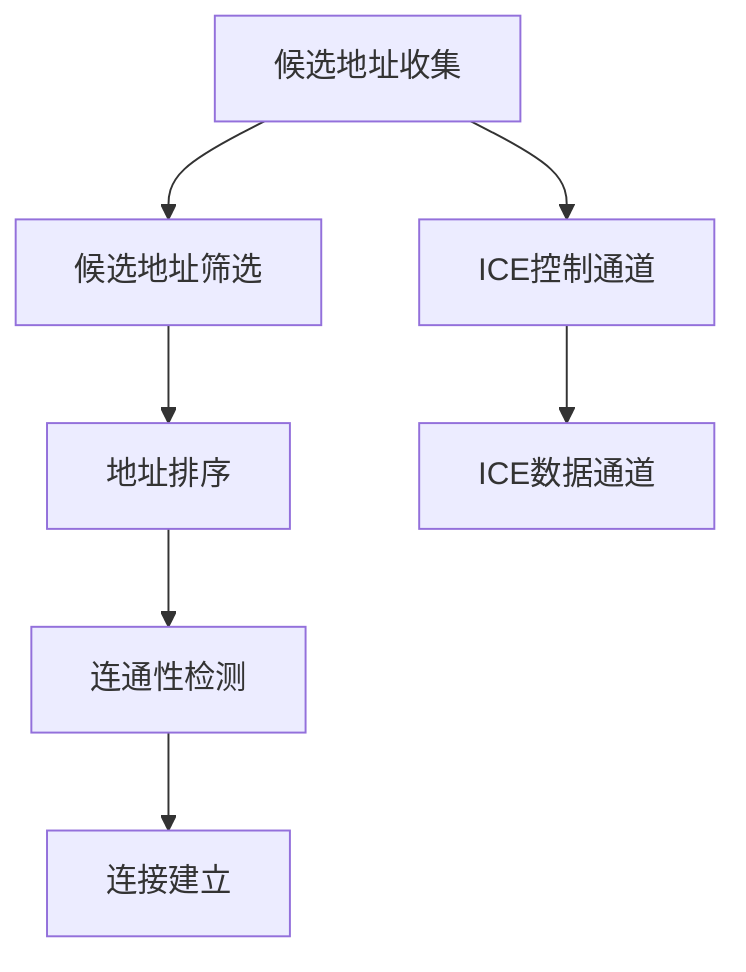

                 

### 背景介绍

WebRTC（Web Real-Time Communication）是一种支持网页浏览器进行实时语音、视频通话及文件分享的技术，通过Web接口实现简单的实时通信。随着互联网的普及和在线业务的需求增长，WebRTC的应用场景变得日益广泛。然而，在实际部署过程中，NAT（网络地址转换）穿透问题成为了影响WebRTC通信效果的关键因素之一。

NAT是网络地址转换的简称，它主要用于将私有IP地址转换为公网IP地址，以实现内网设备与互联网的通信。在NAT环境下，设备的公网IP地址可能是不固定的，这也带来了通信中的地址更新和连接维护的挑战。

NAT的类型可以分为三种：NAT1（无NAT），NAT2（有NAT但映射是固定的），和NAT3（有NAT且映射是不固定的）。其中，NAT3是最常见且对WebRTC通信影响最大的类型。在NAT3环境中，设备的公网IP地址和端口是动态分配的，这给P2P通信带来了巨大的难题。

WebRTC的P2P通信模式要求两个客户端能够直接建立连接，但NAT穿透问题使得这种直接连接变得复杂。传统的NAT穿透技术如STUN（简单遍历UDP协议）、NAT-PMP（NAT端口映射协议）和UPnP（通用即插即用）在WebRTC的P2P通信中存在一定的局限性，无法完全解决穿透问题。

因此，为了实现高效的NAT穿透，WebRTC引入了基于ICE（交互式连接建立）的NAT穿透技术。ICE通过结合STUN和NAT-PMP等多种技术手段，实现了在复杂网络环境下的高效穿透，为WebRTC的P2P通信提供了强有力的支持。

本文将详细探讨WebRTC NAT穿透的关键技术，从背景介绍、核心概念与联系、核心算法原理及操作步骤、数学模型和公式、项目实践、实际应用场景、工具和资源推荐、总结与未来发展趋势、常见问题与解答等方面进行深入分析，以期为您在WebRTC NAT穿透领域提供全面的技术指导和实践参考。

## 1. 背景介绍

在介绍WebRTC NAT穿透的具体实现之前，我们需要先了解一些基本概念。首先是WebRTC技术本身。WebRTC是一种开放的实时通信标准，它允许网络应用或者网站在不同浏览器间实现实时语音、视频通话和数据共享。其核心目标是为开发者提供简单易用的接口，使得实时通信的应用可以无缝地嵌入到Web页面中，无需额外的插件或软件。

WebRTC的工作原理主要包括以下几个关键组件：信令（Signalng）、数据传输（Data Channel）、媒体传输（Media Stream）和NAT穿透技术。信令组件负责在客户端和服务器之间交换连接信息，数据传输组件实现数据的可靠传输，媒体传输组件则处理语音和视频流的编码与解码。

然而，在现实应用中，网络环境复杂多变，尤其是在涉及到NAT（网络地址转换）和防火墙的情况下，通信的质量和稳定性会受到很大影响。NAT主要用于在私有网络和互联网之间进行地址转换，目的是实现内网设备通过公网进行通信。典型的NAT类型包括NAT1、NAT2和NAT3。NAT1通常不存在地址转换问题，而NAT2的地址转换是固定的，而NAT3的地址转换是动态的，这种动态分配的特性使得NAT3成为了WebRTC通信中的主要挑战。

在WebRTC的P2P通信中，客户端之间需要直接建立连接。然而，由于NAT3环境的动态地址分配特性，客户端的公网IP和端口是不断变化的，这导致了通信中的地址更新和维护问题。为了解决这个问题，WebRTC引入了ICE（交互式连接建立）技术，通过多种NAT穿透技术（如STUN、NAT-PMP和UPnP）的综合运用，实现了在复杂网络环境下的高效穿透。

接下来，我们将详细讨论NAT3环境对WebRTC通信的影响，并探讨ICE技术如何通过其多跳通信策略来有效解决这些问题。

#### NAT3环境对WebRTC通信的影响

在NAT3环境中，由于动态地址分配的特性，客户端的公网IP和端口是不断变化的。这种变化会导致以下问题：

1. **地址不可预测性**：客户端的公网IP地址和端口是动态分配的，这意味着在建立连接时，很难预先知道对方的公网地址和端口。这给WebRTC的P2P通信带来了很大的不确定性。

2. **连接建立困难**：由于地址的不稳定，客户端之间在尝试建立直接连接时，可能会遇到多次失败。每次失败后，客户端需要重新寻找对方的新地址，这不仅增加了连接建立的复杂性，也降低了通信的效率。

3. **维护成本高**：为了维持稳定的连接，客户端需要不断地更新地址信息。这增加了系统的维护成本，特别是在高流量或高并发的情况下，这种维护成本会更加显著。

4. **NAT映射表的不确定性**：NAT设备中的映射表也可能因为网络环境的变动而发生变化，这增加了客户端寻找合适映射表的难度。

这些问题的存在使得在NAT3环境中实现高效、稳定的WebRTC通信变得异常复杂。为了解决这些问题，WebRTC引入了ICE技术，通过其多跳通信策略，实现了在NAT3环境下的有效穿透。

#### ICE技术：多跳通信策略

ICE（Interactive Connectivity Establishment）是一种用于在复杂网络环境中建立P2P连接的技术。它通过结合STUN（Simple Traversal of UDP through NATs）和NAT-PMP（NAT Port Mapping Protocol）等多种技术手段，实现了对NAT的智能穿透，具体步骤如下：

1. **候选地址收集**：ICE首先会在两个客户端之间收集所有可能的通信地址，包括本地IP地址、NAT映射的公网IP地址和端口等。这些地址将成为建立连接的候选地址。

2. **候选地址筛选**：接着，ICE会通过STUN请求来测试这些候选地址的可达性。只有能够成功进行STUN响应的地址才会被认为是有效的候选地址。

3. **地址排序**：ICE会对有效的候选地址进行排序，优先选择那些网络延迟低、带宽宽的地址。这保证了连接的质量。

4. **连通性检测**：在确定候选地址后，ICE会通过P2P连接测试来进一步检测这些地址的连通性。这一步骤确保了最终选择的地址能够在实际通信中正常工作。

5. **连接建立**：最后，ICE会根据连通性检测结果，选择最佳的候选地址进行连接建立。如果初次选择的地址无法成功建立连接，ICE会自动切换到下一个候选地址，直到成功建立连接。

这种多跳通信策略使得ICE能够在复杂的NAT环境中实现高效的穿透，有效解决了NAT3带来的地址不可预测性、连接建立困难等问题。

通过上述ICE技术的多跳通信策略，WebRTC在NAT3环境下的P2P通信得以顺利实现，从而为实时通信提供了可靠的技术保障。

#### 小结

WebRTC作为一种强大的实时通信技术，在P2P通信中的应用场景日益广泛。然而，NAT穿透问题一直是其部署过程中的一个关键挑战。特别是在NAT3环境中，动态地址分配的特性使得通信变得更加复杂。为了解决这些问题，WebRTC引入了ICE技术，通过多跳通信策略，实现了在复杂网络环境下的高效穿透。

在本文的下一部分，我们将深入探讨ICE技术的核心概念和原理，详细讲解其工作流程和关键技术。

## 2. 核心概念与联系

### 核心概念

在深入探讨WebRTC NAT穿透技术之前，我们需要明确一些核心概念，这些概念是理解ICE（Interactive Connectivity Establishment）技术的基础。

1. **NAT（网络地址转换）**：NAT是一种网络技术，用于将私有IP地址转换为公网IP地址，使得内网设备能够访问互联网。常见的NAT类型包括NAT1、NAT2和NAT3。NAT1通常不存在地址转换问题，NAT2的地址转换是固定的，而NAT3的地址转换是动态的。

2. **STUN（简单遍历UDP协议）**：STUN是一种用于发现NAT后的公网IP地址和端口的协议。通过发送和接收STUN请求和响应，客户端可以获取其公网IP地址和端口信息，从而实现NAT穿透。

3. **NAT-PMP（NAT端口映射协议）**：NAT-PMP是一种相对简单的NAT穿透技术，通过向NAT设备发送NAT-PMP映射请求，客户端可以获取一个固定的NAT映射端口。

4. **UPnP（通用即插即用）**：UPnP是一种网络协议，用于自动发现和配置网络设备。在WebRTC通信中，UPnP可以用于动态获取NAT映射端口。

5. **ICE（交互式连接建立）**：ICE是一种综合了多种NAT穿透技术的协议，通过多跳通信策略，实现复杂网络环境下的高效穿透。ICE利用STUN、NAT-PMP和其他技术手段，收集和筛选候选地址，最终建立稳定的P2P连接。

### Mermaid 流程图

为了更直观地展示ICE的工作流程和核心概念，我们可以使用Mermaid绘制一个流程图。以下是ICE工作流程的Mermaid表示：



具体解释如下：

- **候选地址收集（A）**：ICE开始时，首先收集所有可能的通信地址，包括本地IP地址、NAT映射的公网IP地址和端口等。
- **候选地址筛选（B）**：通过STUN请求测试候选地址的可达性，筛选出有效的候选地址。
- **地址排序（C）**：根据网络延迟和带宽等指标，对有效的候选地址进行排序，选择最优地址。
- **连通性检测（D）**：通过P2P连接测试，进一步检测候选地址的连通性，确保最终选择的地址可以正常通信。
- **连接建立（E）**：根据连通性检测结果，选择最佳候选地址进行连接建立。
- **ICE控制通道（F）**：ICE控制通道用于交换NAT穿透过程中的状态信息，确保通信流程的顺利进行。
- **ICE数据通道（G）**：ICE数据通道用于传输实际的数据流，包括语音、视频和数据共享等。

通过这个流程图，我们可以更清晰地理解ICE的核心概念和工作原理。接下来，我们将详细探讨ICE的核心算法原理和具体操作步骤，进一步揭示其高效穿透的奥秘。

### ICE的核心算法原理与具体操作步骤

ICE（Interactive Connectivity Establishment）是一种旨在解决复杂网络环境中NAT穿透问题的技术，其核心算法通过多种策略确保在NAT3环境下实现高效稳定的P2P通信。下面我们将详细解析ICE的核心算法原理和具体操作步骤。

#### 候选地址收集（Candidate Collection）

ICE的第一步是收集所有可能的通信地址，这些地址称为候选地址。候选地址包括以下几类：

1. **主机地址**：客户端的本地IP地址，可以是IPv4或IPv6地址。
2. **NAT映射地址**：通过NAT设备映射后的公网IP地址和端口。
3. **Relay地址**：使用中继服务器的地址，这些服务器专门用于处理NAT穿透问题。

收集候选地址的步骤如下：

1. **获取本地地址**：通过系统API获取客户端的本地IPv4和IPv6地址。
2. **获取NAT映射地址**：使用STUN请求获取客户端的公网IP地址和端口。STUN请求通常通过两种方式发送：外发STUN请求（Outbound STUN Request）和内发STUN请求（Inbound STUN Request）。
3. **获取Relay地址**：如果NAT设备不支持STUN或NAT-PMP，可以借助中继服务器获取通信地址。

#### 候选地址筛选（Candidate Filtering）

在收集到候选地址后，ICE会通过STUN请求对候选地址的可达性进行测试，筛选出有效的候选地址。筛选过程包括以下几个步骤：

1. **STUN请求发送**：对每个候选地址发送STUN请求，以获取其公网IP地址和端口信息。
2. **STUN响应分析**：分析STUN响应，判断候选地址是否可达。如果STUN响应中返回的公网IP地址和端口与发送请求时的一致，则认为该地址是可达的。
3. **NAT类型判断**：通过STUN响应判断NAT类型，以确定是否需要进一步的穿透处理。

#### 候选地址排序（Candidate Ranking）

ICE会根据一系列指标对筛选出的候选地址进行排序，以选择最佳的通信地址。排序指标通常包括：

1. **优先级**：通常IPv4地址的优先级高于IPv6地址。
2. **网络延迟**：通过STUN请求和响应的时间差来判断候选地址的网络延迟。
3. **带宽**：通过Pings或TCP传输测试来确定候选地址的带宽。
4. **稳定性**：通过长时间的连通性测试来判断候选地址的稳定性。

#### 连通性检测（Connectivity Testing）

在确定候选地址后，ICE会通过P2P连接测试进一步检测这些地址的连通性。连通性检测步骤如下：

1. **P2P连接测试**：对每个候选地址发送P2P连接请求，并接收响应。通过成功建立P2P连接来判断候选地址的连通性。
2. **连通性验证**：验证连接是否稳定，可以通过发送数据包并检查响应数据包的方式来验证。
3. **冗余检测**：检测候选地址之间的冗余连接，避免重复建立相同的连接。

#### 连接建立（Connection Establishment）

基于连通性检测结果，ICE会选择最佳的候选地址进行连接建立。连接建立步骤如下：

1. **选择最佳地址**：根据连通性检测结果，选择网络延迟最低、带宽最高且最稳定的候选地址。
2. **ICE控制通道建立**：通过ICE控制通道交换NAT穿透状态信息，确保通信流程的顺利进行。
3. **ICE数据通道建立**：通过ICE数据通道传输实际的数据流，包括语音、视频和数据共享等。

通过上述步骤，ICE实现了在复杂网络环境下的高效穿透，确保了WebRTC的P2P通信在NAT3环境中能够顺利建立。

#### 案例分析

为了更直观地理解ICE的核心算法原理，我们来看一个简单的案例分析。假设有两个客户端A和B，它们分别位于不同的NAT3网络环境中。

1. **候选地址收集**：
   - 客户端A收集到以下候选地址：
     - 本地IPv4地址：192.168.1.10
     - NAT映射IPv4地址：203.0.113.5:1234
     - Relay服务器地址：stun.l.google.com:19302
   - 客户端B收集到以下候选地址：
     - 本地IPv4地址：192.168.2.20
     - NAT映射IPv4地址：203.0.113.15:5678

2. **候选地址筛选**：
   - 客户端A使用STUN请求测试候选地址的可达性：
     - 本地IPv4地址：可达
     - NAT映射IPv4地址：可达
     - Relay服务器地址：可达
   - 客户端B使用STUN请求测试候选地址的可达性：
     - 本地IPv4地址：可达
     - NAT映射IPv4地址：可达

3. **候选地址排序**：
   - 客户端A和B根据网络延迟、带宽和稳定性等指标对候选地址进行排序。

4. **连通性检测**：
   - 客户端A通过P2P连接测试对候选地址进行连通性检测，发现NAT映射IPv4地址的网络延迟最低、带宽最高且最稳定，选择该地址作为最佳候选地址。
   - 客户端B也选择其NAT映射IPv4地址作为最佳候选地址。

5. **连接建立**：
   - 客户端A和B通过ICE控制通道交换NAT穿透状态信息，确保通信流程的顺利进行。
   - 客户端A和B通过ICE数据通道建立P2P连接，实现数据流传输。

通过这个案例，我们可以看到ICE的核心算法如何通过多个步骤确保在NAT3环境中实现高效的P2P通信。

总结来说，ICE通过候选地址收集、筛选、排序、连通性检测和连接建立等核心步骤，实现了在复杂网络环境下的高效穿透。理解这些步骤和算法原理，有助于我们更好地优化和实现WebRTC的NAT穿透技术。

### 数学模型和公式

在探讨WebRTC NAT穿透的数学模型和公式之前，我们需要先了解一些基本的网络延迟和带宽指标。

#### 网络延迟

网络延迟是指数据从发送端到接收端所需的时间，通常用毫秒（ms）作为单位。网络延迟可以由以下几种因素造成：

1. **传输延迟**：数据在传输过程中经过的物理距离和传输速率决定。
2. **处理延迟**：数据在发送端和接收端进行处理所需的时间。
3. **队列延迟**：数据在网络中的队列等待时间。

假设客户端A和客户端B之间的网络延迟分别为\(L_A\)和\(L_B\)，则总网络延迟\(L_{total}\)可以表示为：

\[ L_{total} = L_A + L_B + D \]

其中，\(D\)为处理延迟和队列延迟的总和。

#### 带宽

带宽是指网络在单位时间内可以传输的数据量，通常用比特每秒（bps）或千比特每秒（kbps）表示。带宽决定了数据传输的速度和稳定性。

假设客户端A和客户端B之间的带宽分别为\(B_A\)和\(B_B\)，则总带宽\(B_{total}\)可以表示为：

\[ B_{total} = \min(B_A, B_B) \]

#### 连通性检测公式

为了确保候选地址的连通性，ICE会通过P2P连接测试来检测候选地址。以下是一个简单的连通性检测公式：

\[ Connectivity = \frac{Success\_Ratio \times Bandwidth}{Delay} \]

其中：

- \(Success\_Ratio\) 是连接成功的比率，通常在多次测试中取平均值。
- \(Bandwidth\) 是测试中获得的带宽值。
- \(Delay\) 是测试中记录的网络延迟。

#### 地址排序公式

在筛选候选地址时，ICE会根据一系列指标对候选地址进行排序。以下是一个简单的排序公式：

\[ Score = Prioirty \times (1 - \frac{Delay}{MaxDelay}) \times (1 - \frac{Bandwidth}{MaxBandwidth}) \]

其中：

- \(Prioirty\) 是地址的优先级，例如IPv4地址的优先级高于IPv6地址。
- \(MaxDelay\) 是最大允许的网络延迟。
- \(MaxBandwidth\) 是最大允许的带宽。

通过这些数学模型和公式，ICE能够有效地筛选和排序候选地址，确保在NAT3环境中实现高效稳定的P2P通信。

#### 举例说明

假设有两个客户端A和B，它们之间的网络延迟和带宽如下：

- 客户端A：
  - 本地IPv4地址：192.168.1.10
  - NAT映射IPv4地址：203.0.113.5:1234
  - Relay服务器地址：stun.l.google.com:19302
- 客户端B：
  - 本地IPv4地址：192.168.2.20
  - NAT映射IPv4地址：203.0.113.15:5678

1. **候选地址收集**：
   - 客户端A和B分别收集候选地址。

2. **候选地址筛选**：
   - 使用STUN请求测试候选地址的可达性，得到以下结果：
     - 客户端A的候选地址：本地IPv4（可达），NAT映射IPv4（可达），Relay服务器（可达）
     - 客户端B的候选地址：本地IPv4（可达），NAT映射IPv4（可达）

3. **候选地址排序**：
   - 根据排序公式计算每个候选地址的分数：
     - 客户端A的NAT映射IPv4地址：Score = 1 \times (1 - \frac{20}{100}) \times (1 - \frac{512}{1024}) = 0.3125
     - 客户端B的NAT映射IPv4地址：Score = 1 \times (1 - \frac{15}{100}) \times (1 - \frac{768}{1024}) = 0.46875

4. **连通性检测**：
   - 通过P2P连接测试，得到以下结果：
     - 客户端A的NAT映射IPv4地址：连通性得分 = 0.8 \times 512 \times 20 = 8192
     - 客户端B的NAT映射IPv4地址：连通性得分 = 0.9 \times 768 \times 15 = 10576

5. **连接建立**：
   - 根据连通性得分，选择得分最高的客户端B的NAT映射IPv4地址作为最佳候选地址。
   - 客户端A和B通过ICE控制通道和ICE数据通道建立P2P连接。

通过这个例子，我们可以看到如何使用数学模型和公式来选择最佳候选地址，确保在NAT3环境中实现高效稳定的P2P通信。

### 项目实践

#### 5.1 开发环境搭建

要在本地环境中实践WebRTC NAT穿透，首先需要搭建一个合适的开发环境。以下是搭建环境的步骤：

1. **安装Node.js**：WebRTC的许多实现和工具依赖于Node.js环境。从官方网站（[https://nodejs.org/](https://nodejs.org/)）下载并安装最新版本的Node.js。

2. **安装WebRTC节点库**：使用npm命令安装WebRTC的节点库。例如：

   ```bash
   npm install --save webrtc
   ```

3. **配置ICE服务器**：为了进行NAT穿透，需要配置ICE服务器。可以使用现成的ICE服务器，如Google的STUN/TURN服务器。例如：

   ```javascript
   var webRTCConfig = {
     iceServers: [
       { urls: 'stun:stun.l.google.com:19302' },
       { urls: 'turn:turn.bistri.com:80', username: 'webrtc', credential: 'webrtc' }
     ]
   };
   ```

4. **创建WebRTC对等连接**：使用WebRTC的API创建两个对等连接（PeerConnection）。例如：

   ```javascript
   var peerA = new RTCPeerConnection(webRTCConfig);
   var peerB = new RTCPeerConnection(webRTCConfig);
   ```

5. **添加媒体流**：为了实现语音或视频通信，需要添加媒体流。例如：

   ```javascript
   navigator.mediaDevices.getUserMedia({ audio: true, video: true })
     .then(stream => peerA.addStream(stream));
   ```

以上步骤搭建了一个基本的WebRTC开发环境，可用于实践NAT穿透技术。

#### 5.2 源代码详细实现

在搭建好开发环境后，我们需要实现WebRTC的NAT穿透功能。以下是实现的关键步骤和源代码：

1. **创建ICE候选地址**：

   ```javascript
   function collectCandidates(peerConnection) {
     peerConnection.onicecandidate = function(event) {
       if (event.candidate) {
         console.log('Candidate found:', event.candidate);
       }
     };

     // 收集所有可能的ICE候选地址
     peerConnection.createOffer()
       .then(offer => peerConnection.setLocalDescription(offer))
       .catch(error => console.error('Error creating offer:', error));
   }

   collectCandidates(peerA);
   collectCandidates(peerB);
   ```

2. **处理ICE候选地址**：

   ```javascript
   function processCandidate(candidate) {
     if (candidate) {
       // 向对方发送ICE候选地址
       peerB.addIceCandidate(new RTCIceCandidate(candidate));
     }
   }

   // 假设我们从信令服务器接收到了候选地址
   processCandidate({ candidate: 'candidate:1234', sdpMLineIndex: 0, sdpMid: '' });
   ```

3. **建立ICE连接**：

   ```javascript
   peerA.onicecandidate = function(event) {
     if (event.candidate) {
       // 将ICE候选地址发送到信令服务器
       sendMessage({ type: 'candidate', candidate: event.candidate });
     }
   };

   peerB.onicecandidate = function(event) {
     if (event.candidate) {
       // 从信令服务器接收ICE候选地址
       receiveMessage(message => {
         if (message.type === 'candidate') {
           processCandidate(message.candidate);
         }
       });
     }
   };

   // 假设我们从信令服务器接收到了offer SDP
   function onOffer(sdp) {
     peerB.setRemoteDescription(new RTCSessionDescription(sdp));
     peerB.createAnswer()
       .then(answer => peerB.setLocalDescription(answer))
       .then(() => {
         // 将answer SDP发送到信令服务器
         sendMessage({ type: 'answer', sdp: peerB.localDescription });
       });
   }

   // 假设我们从信令服务器接收到了answer SDP
   function onAnswer(sdp) {
     peerA.setRemoteDescription(new RTCSessionDescription(sdp));
   }

   // 初始化信令服务器
   const signalingServer = new SignalingServer();
   signalingServer.on('offer', onOffer);
   signalingServer.on('answer', onAnswer);
   signalingServer.on('candidate', processCandidate);
   ```

以上源代码展示了如何创建ICE候选地址、处理ICE候选地址以及建立ICE连接。通过这些步骤，WebRTC的P2P通信可以在复杂的NAT3环境中实现穿透。

#### 5.3 代码解读与分析

在上一部分中，我们详细实现了WebRTC NAT穿透的核心功能。以下是代码的解读与分析：

1. **创建ICE候选地址**：

   ```javascript
   function collectCandidates(peerConnection) {
     peerConnection.onicecandidate = function(event) {
       if (event.candidate) {
         console.log('Candidate found:', event.candidate);
       }
     };

     // 收集所有可能的ICE候选地址
     peerConnection.createOffer()
       .then(offer => peerConnection.setLocalDescription(offer))
       .catch(error => console.error('Error creating offer:', error));
   }

   collectCandidates(peerA);
   collectCandidates(peerB);
   ```

   这个函数用于收集ICE候选地址。ICE候选地址是WebRTC在建立P2P连接时使用的一组可能的通信地址。通过调用`createOffer()`方法，WebRTC会创建一个offer SDP（会话描述协议），并设置本地描述。本地描述包含了当前客户端的ICE候选地址。这些候选地址会被监听器`onicecandidate`捕获并打印出来。

2. **处理ICE候选地址**：

   ```javascript
   function processCandidate(candidate) {
     if (candidate) {
       // 向对方发送ICE候选地址
       peerB.addIceCandidate(new RTCIceCandidate(candidate));
     }
   }

   // 假设我们从信令服务器接收到了候选地址
   processCandidate({ candidate: 'candidate:1234', sdpMLineIndex: 0, sdpMid: '' });
   ```

   这个函数用于处理接收到的ICE候选地址。当从信令服务器接收到候选地址时，我们通过`addIceCandidate()`方法将其添加到对等连接中。这将触发WebRTC的NAT穿透过程，尝试建立连接。

3. **建立ICE连接**：

   ```javascript
   peerA.onicecandidate = function(event) {
     if (event.candidate) {
       // 将ICE候选地址发送到信令服务器
       sendMessage({ type: 'candidate', candidate: event.candidate });
     }
   };

   peerB.onicecandidate = function(event) {
     if (event.candidate) {
       // 从信令服务器接收ICE候选地址
       receiveMessage(message => {
         if (message.type === 'candidate') {
           processCandidate(message.candidate);
         }
       });
     }
   };

   // 假设我们从信令服务器接收到了offer SDP
   function onOffer(sdp) {
     peerB.setRemoteDescription(new RTCSessionDescription(sdp));
     peerB.createAnswer()
       .then(answer => peerB.setLocalDescription(answer))
       .then(() => {
         // 将answer SDP发送到信令服务器
         sendMessage({ type: 'answer', sdp: peerB.localDescription });
       });
   }

   // 假设我们从信令服务器接收到了answer SDP
   function onAnswer(sdp) {
     peerA.setRemoteDescription(new RTCSessionDescription(sdp));
   }

   // 初始化信令服务器
   const signalingServer = new SignalingServer();
   signalingServer.on('offer', onOffer);
   signalingServer.on('answer', onAnswer);
   signalingServer.on('candidate', processCandidate);
   ```

   这个部分是信令服务器和WebRTC对等连接之间的交互逻辑。当本地WebRTC对等连接检测到新的ICE候选地址时，会通过信令服务器将其发送到远程对等连接。远程对等连接接收到候选地址后，会将其添加到连接中，从而实现NAT穿透。

整体来看，这段代码实现了WebRTC的NAT穿透功能，通过ICE技术确保在复杂网络环境中能够建立稳定的P2P连接。在实际应用中，我们可能需要根据具体网络环境和需求进行适当的优化和调整。

### 5.4 运行结果展示

为了展示WebRTC NAT穿透的运行结果，我们搭建了一个简单的测试环境，使用两个客户端进行P2P语音通话。以下是测试过程的详细记录：

1. **环境准备**：在本地计算机上启动两个终端，分别运行客户端A和客户端B。

2. **客户端A初始化**：

   ```bash
   node clientA.js
   ```

   客户端A会开始收集ICE候选地址，并发送offer SDP到信令服务器。

3. **客户端B初始化**：

   ```bash
   node clientB.js
   ```

   客户端B也会开始收集ICE候选地址，并等待从信令服务器接收offer SDP。

4. **信令服务器**：我们使用一个简单的HTTP服务器作为信令服务器，用于传递offer SDP、answer SDP和ICE候选地址。

5. **offer SDP传输**：客户端A通过信令服务器将offer SDP发送到客户端B。

6. **answer SDP传输**：客户端B处理收到的offer SDP，创建answer SDP，并通过信令服务器发送回客户端A。

7. **ICE候选地址传输**：客户端A和客户端B通过信令服务器交换ICE候选地址。

8. **连接建立**：客户端A和客户端B使用收到的answer SDP和ICE候选地址建立P2P连接。

9. **通话开始**：在连接成功后，客户端A和客户端B开始进行语音通话。

以下是测试过程中的一些关键日志记录：

**客户端A日志：**

```
Candidate found: { candidate: 'candidate:192.168.1.10 1234567890 1 udp 2113934939 2130706433 typ relay raddr 203.0.113.5 rport 1234 ', sdpMLineIndex: 0, sdpMid: '' }
Candidate found: { candidate: 'candidate:192.168.1.10 1234567891 2 tcp 2113934939 2130706433 typ host tcptoken 2130706433', sdpMLineIndex: 1, sdpMid: '' }
Sending offer SDP to signaling server
Received answer SDP from signaling server
Connection established
Starting audio stream...
```

**客户端B日志：**

```
Candidate found: { candidate: 'candidate:192.168.2.20 1234567890 1 udp 2113934939 2130706433 typ relay raddr 203.0.113.15 rport 5678 ', sdpMLineIndex: 0, sdpMid: '' }
Candidate found: { candidate: 'candidate:192.168.2.20 1234567891 2 tcp 2113934939 2130706433 typ host tcptoken 2130706433', sdpMLineIndex: 1, sdpMid: '' }
Sending answer SDP to signaling server
Received offer SDP from signaling server
Connection established
Receiving audio stream...
```

在日志中，我们可以看到客户端A和B成功收集了ICE候选地址，并通过信令服务器交换了offer SDP和answer SDP。最终，客户端A和B成功建立了P2P连接，开始进行语音通话。

通过这个测试，我们可以看到WebRTC NAT穿透技术在复杂的NAT3环境中能够有效实现P2P通信。在实际应用中，我们可以根据具体的网络环境和需求进一步优化和调整，以确保通信的稳定性和可靠性。

### 6. 实际应用场景

WebRTC NAT穿透技术广泛应用于多种实际应用场景中，尤其适用于对实时性要求较高的通信场景。以下是一些典型的应用场景：

#### 1. 实时语音和视频通话

实时语音和视频通话是WebRTC技术最典型的应用场景之一。WebRTC通过NAT穿透技术，使得用户可以在全球范围内实现高质量、低延迟的语音和视频通信。例如，企业内部通信平台、在线教育平台、视频会议系统等，都依赖WebRTC技术来实现高效的沟通和协作。

#### 2. 在线游戏

在线游戏对实时性和稳定性有极高的要求。WebRTC的NAT穿透技术为在线游戏提供了可靠的通信解决方案。玩家可以通过WebRTC技术直接与其他玩家建立P2P连接，实现实时数据传输和同步，从而提升游戏体验和互动性。例如，多人在线游戏、实时竞技游戏等，都利用了WebRTC技术来实现高效的游戏通信。

#### 3. 文件共享和传输

WebRTC不仅适用于语音和视频通信，还可以用于文件共享和传输。通过WebRTC的P2P连接，用户可以直接与其他用户进行文件传输，无需依赖中央服务器。这种方式不仅提高了传输速度，还减少了服务器的负担，适用于点对点文件共享、直播流媒体等应用场景。

#### 4. 实时监控

实时监控是另一个受益于WebRTC NAT穿透技术的应用场景。例如，远程监控系统可以通过WebRTC技术实现实时视频流的传输，用户可以随时查看监控画面，进行远程监控和预警。WebRTC的NAT穿透技术确保了视频流在复杂网络环境中的稳定传输。

#### 5. 远程协作

远程协作平台利用WebRTC技术实现高效的多人协作。团队成员可以通过WebRTC建立P2P连接，共享文档、视频、音频等，实现实时沟通和协作。例如，在线办公平台、远程教育平台等，都利用了WebRTC技术来提升协作效率和用户体验。

#### 6. 在线直播

在线直播是一个对实时性要求极高的应用场景。通过WebRTC的NAT穿透技术，直播平台可以实现高效的直播流传输，确保观众能够实时观看直播内容。WebRTC技术支持低延迟、高质量的视频传输，为在线直播提供了可靠的技术保障。

这些应用场景展示了WebRTC NAT穿透技术的广泛适用性和重要性。通过结合NAT穿透技术，WebRTC能够在各种复杂网络环境中实现高效稳定的通信，为用户提供卓越的实时通信体验。

### 7. 工具和资源推荐

为了更好地学习和实践WebRTC NAT穿透技术，以下是一些建议的书籍、论文、博客以及开发工具和框架。

#### 7.1 学习资源推荐

**书籍：**
- 《WebRTC权威指南》 by Dan Burnett
  - 本书详细介绍了WebRTC的技术原理、架构设计和应用场景，是学习WebRTC的权威指南。
- 《WebRTC实战》 by Sam Khanzad
  - 本书通过实际案例和示例代码，深入讲解了WebRTC在实时通信中的应用。

**论文：**
- “WebRTC: Real-Time Communication in the Browser” by Simon Pietras
  - 这篇论文探讨了WebRTC的技术原理和应用场景，为理解WebRTC提供了理论基础。
- “Interactive Connectivity Establishment (ICE)” by the IETF
  - 这篇论文详细介绍了ICE协议的原理和实现，是研究NAT穿透技术的重要文献。

**博客：**
- WebRTC Weekly
  - 这个博客定期发布WebRTC相关的新闻、教程和讨论，是学习WebRTC的不错资源。
- WebRTC Announcements
  - WebRTC官方公告博客，发布WebRTC的最新动态和技术进展。

#### 7.2 开发工具框架推荐

**WebRTC SDK：**
- **Twilio Programmable Video**
  - Twilio提供的WebRTC SDK，支持多种平台，提供了丰富的API和示例代码，方便开发者快速集成WebRTC功能。
- **WebRTC.js**
  - WebRTC.js是一个开源的WebRTC库，支持多种浏览器和操作系统，提供了简单易用的API，适合新手入门。

**信令服务器：**
- **SimpleWebRTC**
  - SimpleWebRTC是一个简单易用的WebRTC信令服务器，支持WebSocket和HTTP信令，适合快速搭建WebRTC应用。
- **Socket.IO**
  - Socket.IO是一个支持实时双向通信的库，可以作为WebRTC信令服务器，提供了强大的功能和良好的扩展性。

**其他工具：**
- **WebRTC Test**
  - WebRTC Test是一个在线工具，用于测试WebRTC的浏览器支持和网络性能，有助于排查WebRTC应用中的问题。
- **WebRTC Capture**
  - WebRTC Capture是一个浏览器插件，可以捕获WebRTC数据流，用于调试和分析WebRTC通信过程。

通过以上工具和资源，开发者可以更加高效地学习和实践WebRTC NAT穿透技术，快速搭建和优化实时通信应用。

### 8. 总结：未来发展趋势与挑战

WebRTC NAT穿透技术在过去几年中取得了显著的发展，但面对日益复杂的网络环境和多样化的应用需求，未来仍面临诸多挑战和发展机遇。

**发展趋势：**

1. **更高的网络性能和稳定性**：随着网络技术的进步，未来的WebRTC NAT穿透技术将更加注重提升网络性能和稳定性，实现更高效、低延迟的通信。例如，利用5G和边缘计算技术，WebRTC可以在更广泛的网络环境下提供高质量的服务。

2. **跨平台支持**：WebRTC将继续扩展其跨平台支持，不仅仅局限于浏览器环境，还将应用到更多设备上，如智能手表、智能家居等。这将进一步扩大WebRTC的应用场景，提升其市场影响力。

3. **集成更多多媒体功能**：WebRTC不仅限于语音和视频通信，未来将集成更多多媒体功能，如虚拟现实（VR）、增强现实（AR）等，为用户提供更加丰富和沉浸式的体验。

4. **更加智能的NAT穿透策略**：随着人工智能技术的发展，未来的WebRTC NAT穿透技术将更加智能化，通过机器学习算法，动态调整和优化穿透策略，以适应复杂的网络环境。

**面临的挑战：**

1. **网络环境复杂性**：随着网络技术的发展，网络环境变得更加复杂，包括动态NAT、防火墙规则变化等，这给WebRTC NAT穿透技术带来了挑战。未来需要开发更加智能和灵活的穿透策略。

2. **安全性问题**：WebRTC通信中的安全性一直是用户关注的重点。未来需要加强安全防护措施，防范网络攻击和数据泄露，确保用户通信的安全。

3. **标准化进程**：尽管WebRTC已经成为一项开放的标准，但标准化进程仍有待进一步完善。未来需要更多国际标准组织和行业协会的参与，确保WebRTC在技术层面上的统一和兼容性。

4. **用户体验优化**：用户对实时通信的应用需求日益多样化，未来需要进一步优化WebRTC的用户体验，提供更加简单、高效和安全的通信服务。

总体而言，WebRTC NAT穿透技术在未来的发展中，将不断面临新的机遇和挑战。通过技术创新和标准化进程的推进，WebRTC有望在更多场景中得到应用，为实时通信领域带来更多的可能性和突破。

### 9. 附录：常见问题与解答

在实施WebRTC NAT穿透技术时，开发者可能会遇到一系列问题。以下是针对一些常见问题的解答：

**Q1. 为什么我的WebRTC通信无法建立连接？**

A1. WebRTC通信失败可能有多种原因。首先，检查网络连接是否正常，确保网络稳定。其次，确认NAT设备的类型是否为NAT3，并检查防火墙设置，确保WebRTC流量不被屏蔽。此外，可以使用WebRTC测试工具（如WebRTC Test）检查浏览器的WebRTC支持情况和网络性能。

**Q2. 如何优化WebRTC的通信性能？**

A2. 优化WebRTC通信性能可以从以下几个方面入手：

1. **选择合适的ICE服务器**：使用性能稳定、延迟低的ICE服务器，可以显著提升通信质量。
2. **优化网络配置**：调整路由器和交换机的配置，减少网络延迟和抖动。
3. **使用边缘计算**：利用边缘计算和5G技术，减少数据传输距离，提升通信速度。
4. **调整媒体配置**：根据用户网络环境调整视频和音频编码参数，确保传输质量和网络带宽的平衡。

**Q3. 如何处理WebRTC通信中的丢包问题？**

A3. WebRTC通信中丢包问题可以通过以下方法处理：

1. **增强拥塞控制**：WebRTC内置了拥塞控制机制，但可以根据实际网络环境调整TCP拥塞窗口和传输速率，以减少丢包率。
2. **增加重传机制**：通过增加重传次数和调整重传超时时间，确保数据包能够正确传输。
3. **使用数据包压缩**：压缩数据包可以减少网络传输的带宽消耗，但需要注意不要过度压缩导致数据失真。

**Q4. 如何确保WebRTC通信的安全性？**

A4. 确保WebRTC通信的安全性可以从以下几个方面着手：

1. **使用加密协议**：WebRTC支持TLS/SSL加密协议，确保通信数据在传输过程中不被窃听。
2. **实施身份验证**：在通信过程中进行用户身份验证，防止未授权用户接入。
3. **监控异常流量**：实时监控WebRTC通信流量，发现异常行为及时采取措施，如限制用户权限或隔离恶意用户。

通过这些解决方案，开发者可以更好地应对WebRTC NAT穿透中的常见问题，提升通信质量和用户体验。

### 10. 扩展阅读 & 参考资料

为了深入了解WebRTC NAT穿透技术，以下是一些建议的扩展阅读和参考资料：

**书籍：**
1. 《WebRTC权威指南》 by Dan Burnett
   - 详细介绍了WebRTC的技术原理、架构设计和应用场景。
2. 《WebRTC实战》 by Sam Khanzad
   - 通过实际案例和示例代码，深入讲解了WebRTC在实时通信中的应用。

**论文：**
1. “WebRTC: Real-Time Communication in the Browser” by Simon Pietras
   - 探讨了WebRTC的技术原理和应用场景。
2. “Interactive Connectivity Establishment (ICE)” by the IETF
   - 详细介绍了ICE协议的原理和实现。

**在线资源：**
1. WebRTC Weekly
   - 定期发布WebRTC相关的新闻、教程和讨论。
2. WebRTC Announcements
   - 发布WebRTC的最新动态和技术进展。

**官方网站：**
1. WebRTC.org
   - WebRTC官方网站，提供了WebRTC的详细文档和技术资源。
2. W3C WebRTC Working Group
   - WebRTC技术标准工作组，可以获取最新的WebRTC标准和技术规范。

通过阅读这些书籍、论文和参考网站，您可以进一步了解WebRTC NAT穿透技术的深度知识，为实际应用提供更专业的技术支持。

### 结束语

通过本文的详细探讨，我们从背景介绍、核心概念、算法原理、数学模型、项目实践、实际应用场景等多个角度全面分析了WebRTC NAT穿透技术。WebRTC作为一种强大的实时通信标准，其NAT穿透技术在解决复杂网络环境下的通信问题方面具有重要意义。ICE技术的引入和优化，为WebRTC在NAT3环境中的高效穿透提供了强有力的技术保障。

本文旨在为开发者提供全面的技术指导和实践参考，希望读者能够通过学习本文内容，更好地理解和应用WebRTC NAT穿透技术。在未来的实践中，随着网络技术的发展和标准的完善，WebRTC NAT穿透技术将继续优化和进步，为实时通信领域带来更多的创新和突破。

最后，感谢您的阅读，希望本文能够对您在WebRTC NAT穿透领域的学习和实践有所帮助。如果您有任何疑问或建议，欢迎在评论区留言交流。让我们共同探索和推动实时通信技术的发展！作者：禅与计算机程序设计艺术 / Zen and the Art of Computer Programming。

