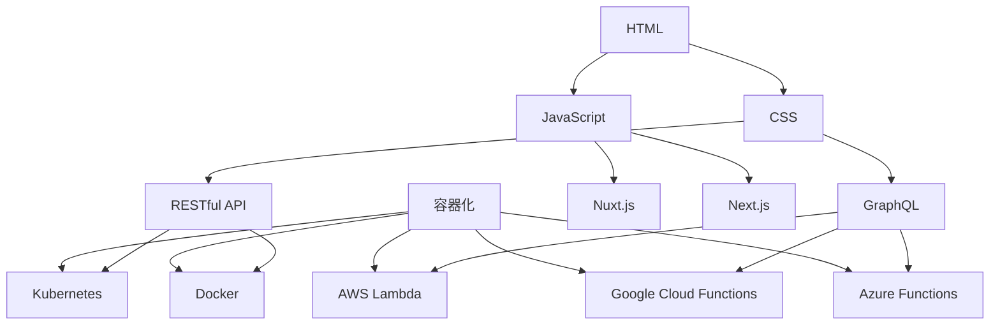

                 

### 背景介绍 Background

#### Web全栈开发：一个全面的技术挑战

Web全栈开发是一个综合性的技术领域，它要求开发者在前端和后端都能胜任，熟练掌握多种编程语言、框架和工具。这种技能集不仅要求开发者具备广泛的技术知识，还需要深入理解软件工程和系统架构的基础。随着互联网的迅猛发展和数字化转型浪潮的推进，Web全栈开发成为企业构建现代互联网应用的核心技能。

#### 当前Web开发趋势

在过去的几年里，Web开发经历了显著的变化。首先，前端开发变得越来越复杂，需要处理更多的用户交互、动态内容和复杂的用户界面。与此同时，后端开发也趋向于微服务架构和云原生应用，这使得系统更加模块化、可扩展和易于维护。以下是一些当前Web开发的主要趋势：

1. **前端框架的繁荣**：如React、Vue和Angular等现代前端框架的出现，极大地提高了前端开发的效率和质量。
2. **后端服务的多样化**：除了传统的服务器端编程，RESTful API和GraphQL等现代API设计模式得到了广泛应用。
3. **容器化和云原生技术**：Docker、Kubernetes等容器化技术使得应用部署和扩展变得更加灵活和高效。
4. **无服务器架构**：AWS、Google Cloud和Azure等云服务提供商的无服务器架构为开发者提供了更方便、成本更低的计算资源。
5. **前端性能优化**：随着用户期望的提升，前端性能优化变得尤为重要，包括代码分割、懒加载、缓存策略等。

#### Web全栈开发的重要性

Web全栈开发的重要性在于，它能够帮助开发者更好地理解整个Web应用的架构和生命周期，从而在开发过程中做出更明智的决策。以下是Web全栈开发的重要性和优势：

1. **全面理解**：全栈开发者能够从用户界面的设计到数据库的管理，全面理解整个应用的工作流程。
2. **高效协作**：全栈开发者可以更有效地与其他团队成员协作，因为他们能够理解和参与前后端的开发和部署。
3. **灵活应变**：在面对技术难题或项目需求变化时，全栈开发者能够快速适应并解决问题。
4. **市场竞争力**：随着对全栈开发技能的需求日益增长，具备全栈技能的开发者在职场上具有更高的竞争力。

在本篇文章中，我们将逐步探讨Web全栈开发的各个方面，从核心概念到实际项目实践，帮助读者全面理解并掌握这一领域的关键技术。通过本文的阅读，读者将能够构建自己的全栈开发知识体系，并具备独立开发复杂Web应用的能力。

### 核心概念与联系 Core Concepts and Relationships

在Web全栈开发中，理解核心概念和它们之间的联系是至关重要的。这不仅能帮助我们更好地构建应用，还能提高我们的工作效率和代码质量。在本节中，我们将详细阐述Web全栈开发的核心概念，并使用Mermaid流程图来展示它们之间的关系。

#### 前端开发 Front-end Development

前端开发是Web全栈开发的重要组成部分，它主要关注用户界面（UI）和用户体验（UX）。前端开发涉及HTML、CSS和JavaScript等基本技术，以及现代前端框架如React、Vue和Angular等。

1. **HTML (HyperText Markup Language)**：HTML是网页内容的结构基础，用于定义网页的元素和布局。
2. **CSS (Cascading Style Sheets)**：CSS用于控制网页的样式和布局，使得网页内容更美观。
3. **JavaScript**：JavaScript是前端开发的灵魂，它使网页具有动态交互功能，可以响应用户的操作。

#### 后端开发 Back-end Development

后端开发则关注服务器端的逻辑处理和数据管理。后端开发通常涉及多种编程语言、框架和数据库技术。

1. **编程语言**：常见的后端编程语言包括Python、JavaScript（Node.js）、Java、C#和PHP等。
2. **框架**：如Django（Python）、Express（Node.js）、Spring（Java）和Laravel（PHP）等框架为后端开发提供了丰富的功能和优化。
3. **数据库**：常用的数据库技术包括关系型数据库（如MySQL、PostgreSQL）和NoSQL数据库（如MongoDB、Cassandra）。

#### 前后端通信 Communication between Front-end and Back-end

前端与后端之间的通信是Web应用的关键环节。通过API（Application Programming Interface）来实现数据的请求和响应。

1. **RESTful API**：RESTful API是现代Web服务的一种设计风格，它定义了一组通用的接口规范，用于实现前后端的数据通信。
2. **GraphQL**：GraphQL是一种查询语言，用于API的设计和执行。它允许客户端指定需要的数据，减少了不必要的通信和数据处理。

#### 服务端渲染 Server-side Rendering

服务端渲染（SSR）是一种优化技术，它将页面的渲染过程从客户端转移到服务器。这样做可以提高页面的初始加载速度，并改善SEO（搜索引擎优化）。

1. **Nuxt.js**：Nuxt.js是一个基于Vue.js的服务端渲染框架，它简化了服务端渲染的开发过程。
2. **Next.js**：Next.js是基于React的服务端渲染框架，同样提供了丰富的功能和优化。

#### 容器化和云原生技术 Containerization and Cloud-native Technologies

容器化和云原生技术的应用使得Web全栈开发更加灵活和高效。

1. **Docker**：Docker是一种容器化技术，它将应用程序及其依赖环境打包成一个独立的容器，确保应用在各种环境中运行一致。
2. **Kubernetes**：Kubernetes是一个容器编排工具，用于自动化容器的部署、扩展和管理。
3. **无服务器架构**：无服务器架构（Serverless）是一种云计算模型，它允许开发者编写和运行代码而无需管理服务器。AWS Lambda、Google Cloud Functions和Azure Functions都是常见的无服务器架构服务。

#### Mermaid流程图展示 Mermaid Flowchart

以下是一个Mermaid流程图，展示了Web全栈开发中的核心概念和它们之间的关系：



通过这个流程图，我们可以清晰地看到HTML、CSS、JavaScript等前端技术，以及RESTful API、GraphQL、Nuxt.js、Next.js等服务端技术之间的关系，以及它们与容器化和云原生技术的联系。

### 核心算法原理 & 具体操作步骤 Core Algorithm Principles & Detailed Steps

在Web全栈开发中，掌握核心算法原理对于理解和实现复杂的系统功能至关重要。本节将介绍几个常见且重要的算法，并详细讲解它们的具体操作步骤。

#### 排序算法 Sorting Algorithms

排序算法是计算机科学中的基本算法之一，用于将一组数据按照某种顺序进行排列。以下是一些常用的排序算法：

1. **冒泡排序（Bubble Sort）**
   - **原理**：冒泡排序通过重复遍历要排序的数列，比较每对相邻元素的值，如果顺序错误就交换它们。
   - **步骤**：
     1. 从第一个元素开始，比较相邻的元素。
     2. 如果第一个比第二个大（或小），交换它们。
     3. 对每一对相邻元素进行同样的操作，直到没有需要交换的元素为止。
     4. 重复上述过程，直到整个数列有序。

2. **快速排序（Quick Sort）**
   - **原理**：快速排序是一种分而治之的排序算法，选择一个基准元素，将数组分成两个子数组，一个包含小于基准的元素，另一个包含大于基准的元素。
   - **步骤**：
     1. 选择一个基准元素。
     2. 将数组分成两部分，左边所有元素都比基准小，右边所有元素都比基准大。
     3. 递归地对左边和右边的子数组进行快速排序。

3. **归并排序（Merge Sort）**
   - **原理**：归并排序也是一种分而治之的排序算法，它将数组分成多个子数组，每个子数组都是有序的，然后将这些子数组合并成一个新的有序数组。
   - **步骤**：
     1. 将数组分成两个子数组。
     2. 分别对两个子数组进行归并排序。
     3. 合并两个有序子数组。

#### 算法实现示例 Example of Algorithm Implementation

以下是一个使用JavaScript实现的快速排序算法示例：

```javascript
function quickSort(arr) {
  if (arr.length <= 1) {
    return arr;
  }

  const pivot = arr[arr.length - 1];
  const leftArr = [];
  const rightArr = [];

  for (let i = 0; i < arr.length - 1; i++) {
    if (arr[i] < pivot) {
      leftArr.push(arr[i]);
    } else {
      rightArr.push(arr[i]);
    }
  }

  return [...quickSort(leftArr), pivot, ...quickSort(rightArr)];
}

const unsortedArray = [32, 45, 37, 16, 2, 87];
const sortedArray = quickSort(unsortedArray);
console.log(sortedArray); // 输出：[2, 16, 32, 37, 45, 87]
```

#### 搜索算法 Search Algorithms

除了排序算法，搜索算法也是计算机科学中非常重要的算法。以下介绍两种常见的搜索算法：

1. **二分搜索（Binary Search）**
   - **原理**：二分搜索是一种在有序数组中查找特定元素的算法，它通过不断将搜索范围缩小一半来快速定位目标元素。
   - **步骤**：
     1. 确定中间元素。
     2. 如果中间元素等于目标值，搜索结束。
     3. 如果目标值小于中间元素，则在左半部分继续搜索。
     4. 如果目标值大于中间元素，则在右半部分继续搜索。
     5. 重复步骤1-4，直到找到目标元素或搜索范围缩小为0。

2. **深度优先搜索（DFS）**
   - **原理**：深度优先搜索是一种遍历或搜索树或图的算法，它沿着一个分支走到底，然后回溯。
   - **步骤**：
     1. 访问当前节点。
     2. 对于当前节点的每一个未访问的邻接节点，递归执行步骤1和2。
     3. 当所有邻接节点都访问完毕后，回溯至上层节点。

#### 搜索算法实现示例 Example of Search Algorithm Implementation

以下是一个使用JavaScript实现的二分搜索算法示例：

```javascript
function binarySearch(arr, target) {
  let start = 0;
  let end = arr.length - 1;

  while (start <= end) {
    const mid = Math.floor((start + end) / 2);

    if (arr[mid] === target) {
      return mid;
    }

    if (target < arr[mid]) {
      end = mid - 1;
    } else {
      start = mid + 1;
    }
  }

  return -1;
}

const sortedArray = [1, 3, 5, 7, 9, 11, 13];
const target = 7;

const result = binarySearch(sortedArray, target);
console.log(result); // 输出：2（因为7在数组的第3个位置）
```

通过上述算法原理和示例，我们可以更好地理解和实现Web全栈开发中的关键算法。掌握这些算法不仅有助于提高代码的效率和性能，还能解决实际开发中遇到的各种问题。

### 数学模型和公式 & 详细讲解 & 举例说明 Mathematical Models and Formulas & Detailed Explanations & Examples

在Web全栈开发中，数学模型和公式是理解和实现复杂系统功能的重要工具。在本节中，我们将介绍几个常用的数学模型和公式，并进行详细的讲解和举例说明。

#### 概率论 Probability Theory

概率论在Web全栈开发中有着广泛的应用，例如在数据处理、机器学习、网络通信等领域。以下是一些基本概率概念和公式：

1. **条件概率（Conditional Probability）**
   - **公式**：\( P(A|B) = \frac{P(A \cap B)}{P(B)} \)
   - **解释**：在事件B发生的条件下，事件A发生的概率。
   - **例子**：假设掷两个公平的硬币，求至少出现一次正面的概率。
     - \( P(\text{至少出现一次正面}) = 1 - P(\text{两个反面}) = 1 - \frac{1}{4} = \frac{3}{4} \)

2. **贝叶斯定理（Bayes' Theorem）**
   - **公式**：\( P(A|B) = \frac{P(B|A) \cdot P(A)}{P(B)} \)
   - **解释**：通过已知条件概率和总概率，计算另一个条件概率。
   - **例子**：假设有一个病人，医生给出两个诊断结果：A型糖尿病和B型糖尿病。已知A型糖尿病的概率是0.6，B型糖尿病的概率是0.4。如果病人接受了A型糖尿病的测试，并且测试结果为阳性，求病人实际上是A型糖尿病的概率。
     - \( P(\text{A型糖尿病}|\text{阳性}) = \frac{P(\text{阳性}|\text{A型糖尿病}) \cdot P(\text{A型糖尿病})}{P(\text{阳性})} \)
     - 已知 \( P(\text{阳性}|\text{A型糖尿病}) = 0.95 \)，\( P(\text{A型糖尿病}) = 0.6 \)，需要计算 \( P(\text{阳性}) \)。
     - \( P(\text{阳性}) = P(\text{阳性}|\text{A型糖尿病}) \cdot P(\text{A型糖尿病}) + P(\text{阳性}|\text{B型糖尿病}) \cdot P(\text{B型糖尿病}) \)
     - \( P(\text{阳性}) = 0.95 \cdot 0.6 + 0.2 \cdot 0.4 = 0.58 + 0.08 = 0.66 \)
     - \( P(\text{A型糖尿病}|\text{阳性}) = \frac{0.95 \cdot 0.6}{0.66} \approx 0.85 \)

3. **期望值（Expected Value）**
   - **公式**：\( E(X) = \sum_{i=1}^{n} x_i \cdot P(x_i) \)
   - **解释**：随机变量X的平均值，也称为数学期望。
   - **例子**：假设一个掷骰子的游戏，求掷出一个6点的期望值。
     - \( P(\text{6点}) = \frac{1}{6} \)
     - \( E(X) = 1 \cdot \frac{1}{6} + 2 \cdot \frac{1}{6} + 3 \cdot \frac{1}{6} + 4 \cdot \frac{1}{6} + 5 \cdot \frac{1}{6} + 6 \cdot \frac{1}{6} = \frac{21}{6} = 3.5 \)

#### 微积分 Calculus

微积分在Web全栈开发中的应用主要体现在数据处理、优化和算法分析中。以下介绍两个常见的微积分概念和公式：

1. **导数（Derivative）**
   - **公式**：\( f'(x) = \lim_{h \to 0} \frac{f(x+h) - f(x)}{h} \)
   - **解释**：函数在某一点的导数表示函数在该点的瞬时变化率。
   - **例子**：求函数 \( f(x) = x^2 \) 在 \( x = 2 \) 处的导数。
     - \( f'(2) = \lim_{h \to 0} \frac{(2+h)^2 - 2^2}{h} \)
     - \( f'(2) = \lim_{h \to 0} \frac{4 + 4h + h^2 - 4}{h} \)
     - \( f'(2) = \lim_{h \to 0} \frac{4h + h^2}{h} \)
     - \( f'(2) = \lim_{h \to 0} (4 + h) = 4 \)

2. **积分（Integral）**
   - **公式**：\( \int f(x) \, dx = F(x) + C \)
   - **解释**：积分是将离散的数据点合并成一个整体的过程，用于求解函数的面积或总量。
   - **例子**：求函数 \( f(x) = x^2 \) 从0到3的定积分。
     - \( \int_{0}^{3} x^2 \, dx = \left[ \frac{x^3}{3} \right]_{0}^{3} \)
     - \( \int_{0}^{3} x^2 \, dx = \frac{3^3}{3} - \frac{0^3}{3} = \frac{27}{3} = 9 \)

#### 统计学 Statistics

统计学在Web全栈开发中的应用非常广泛，例如在数据分析、用户行为分析等领域。以下介绍两个常见的统计学概念和公式：

1. **均值（Mean）**
   - **公式**：\( \bar{x} = \frac{1}{n} \sum_{i=1}^{n} x_i \)
   - **解释**：一组数据的平均值。
   - **例子**：求以下数列的均值：\[1, 2, 3, 4, 5\]。
     - \( \bar{x} = \frac{1}{5} (1 + 2 + 3 + 4 + 5) = \frac{15}{5} = 3 \)

2. **方差（Variance）**
   - **公式**：\( \sigma^2 = \frac{1}{n} \sum_{i=1}^{n} (x_i - \bar{x})^2 \)
   - **解释**：一组数据离散程度的度量。
   - **例子**：求以下数列的方差：\[1, 2, 3, 4, 5\]。
     - \( \bar{x} = 3 \)
     - \( \sigma^2 = \frac{1}{5} [(1-3)^2 + (2-3)^2 + (3-3)^2 + (4-3)^2 + (5-3)^2] \)
     - \( \sigma^2 = \frac{1}{5} [4 + 1 + 0 + 1 + 4] = \frac{10}{5} = 2 \)

通过上述数学模型和公式的讲解，我们可以更好地理解其在Web全栈开发中的应用。掌握这些基本概念和公式不仅有助于我们在实际项目中解决问题，还能提高我们的分析能力和技术水平。

### 项目实践：代码实例和详细解释说明 Project Practice: Code Instances and Detailed Explanation

为了更好地理解Web全栈开发的实际应用，下面我们将通过一个具体的代码实例，详细展示前端到后端的全栈开发过程。本实例将创建一个简单的博客系统，包括用户注册、登录、发表文章和管理文章功能。我们将使用以下技术和框架：

- **前端**：React框架
- **后端**：Node.js和Express框架
- **数据库**：MongoDB数据库

#### 1. 开发环境搭建

在开始项目之前，我们需要搭建一个合适的技术环境。

**前端环境**：
1. 安装Node.js和npm（Node Package Manager）。
   - 官网下载并安装Node.js：[https://nodejs.org/](https://nodejs.org/)
2. 安装React和创建React项目。
   - 在命令行中执行：
     ```bash
     npx create-react-app my-blog
     cd my-blog
     npm install
     ```

**后端环境**：
1. 安装Node.js和npm。
   - 与前端环境一致。
2. 创建一个Node.js项目。
   - 在命令行中执行：
     ```bash
     mkdir my-blog-backend
     cd my-blog-backend
     npm init -y
     ```
3. 安装Express和MongoDB。
   - 在命令行中执行：
     ```bash
     npm install express mongodb
     ```

**数据库环境**：
1. 安装MongoDB。
   - 官网下载并安装MongoDB：[https://www.mongodb.com/](https://www.mongodb.com/)
2. 启动MongoDB服务。

#### 2. 源代码详细实现

**前端（React）**

**src/App.js**
```javascript
import React, { useState } from 'react';
import Header from './components/Header';
import ArticleList from './components/ArticleList';
import LoginForm from './components/LoginForm';
import RegisterForm from './components/RegisterForm';
import NewArticleForm from './components/NewArticleForm';

function App() {
  const [isLoggedIn, setIsLoggedIn] = useState(false);
  const [isAdmin, setIsAdmin] = useState(false);

  // 登录处理逻辑
  const handleLogin = (user) => {
    // 这里应包含与后端的通信逻辑，此处简化为直接登录
    setIsLoggedIn(true);
    setIsAdmin(user.isAdmin);
  };

  // 登出处理逻辑
  const handleLogout = () => {
    setIsLoggedIn(false);
  };

  return (
    <div className="App">
      <Header isLoggedIn={isLoggedIn} onLogout={handleLogout} />
      {!isLoggedIn ? (
        <LoginForm onLogin={handleLogin} />
      ) : (
        <>
          <ArticleList isAdmin={isAdmin} />
          <NewArticleForm isAdmin={isAdmin} />
        </>
      )}
    </div>
  );
}

export default App;
```

**components/Header.js**
```javascript
import React from 'react';

function Header({ isLoggedIn, onLogout }) {
  return (
    <header>
      <h1>My Blog</h1>
      {isLoggedIn ? (
        <button onClick={onLogout}>Logout</button>
      ) : (
        <button>Login</button>
      )}
    </header>
  );
}

export default Header;
```

**components/LoginForm.js**
```javascript
import React, { useState } from 'react';

function LoginForm({ onLogin }) {
  const [email, setEmail] = useState('');
  const [password, setPassword] = useState('');

  const handleSubmit = (e) => {
    e.preventDefault();
    // 这里应包含与后端的通信逻辑，此处简化为直接登录
    onLogin({ email, password });
  };

  return (
    <form onSubmit={handleSubmit}>
      <label>Email:</label>
      <input type="email" value={email} onChange={(e) => setEmail(e.target.value)} />
      <label>Password:</label>
      <input type="password" value={password} onChange={(e) => setPassword(e.target.value)} />
      <button type="submit">Login</button>
    </form>
  );
}

export default LoginForm;
```

**components/RegisterForm.js**
```javascript
import React, { useState } from 'react';

function RegisterForm({ onLogin }) {
  const [email, setEmail] = useState('');
  const [password, setPassword] = useState('');
  const [confirmPassword, setConfirmPassword] = useState('');

  const handleSubmit = (e) => {
    e.preventDefault();
    if (password === confirmPassword) {
      // 这里应包含与后端的通信逻辑，此处简化为直接注册
      onLogin({ email, password });
    } else {
      alert('Passwords do not match');
    }
  };

  return (
    <form onSubmit={handleSubmit}>
      <label>Email:</label>
      <input type="email" value={email} onChange={(e) => setEmail(e.target.value)} />
      <label>Password:</label>
      <input type="password" value={password} onChange={(e) => setPassword(e.target.value)} />
      <label>Confirm Password:</label>
      <input type="password" value={confirmPassword} onChange={(e) => setConfirmPassword(e.target.value)} />
      <button type="submit">Register</button>
    </form>
  );
}

export default RegisterForm;
```

**components/ArticleList.js**
```javascript
import React, { useState, useEffect } from 'react';

function ArticleList({ isAdmin }) {
  const [articles, setArticles] = useState([]);

  useEffect(() => {
    // 从后端获取文章列表
    fetch('/api/articles')
      .then((response) => response.json())
      .then((data) => setArticles(data));
  }, []);

  return (
    <div>
      {articles.map((article) => (
        <div key={article._id}>
          <h2>{article.title}</h2>
          <p>{article.content}</p>
          {isAdmin && (
            <button>Delete</button>
          )}
        </div>
      ))}
    </div>
  );
}

export default ArticleList;
```

**components/NewArticleForm.js**
```javascript
import React, { useState } from 'react';

function NewArticleForm({ isAdmin }) {
  const [title, setTitle] = useState('');
  const [content, setContent] = useState('');

  const handleSubmit = (e) => {
    e.preventDefault();
    if (isAdmin) {
      // 向后端发送文章数据
      fetch('/api/articles', {
        method: 'POST',
        headers: {
          'Content-Type': 'application/json',
        },
        body: JSON.stringify({ title, content }),
      });
    }
  };

  return (
    <form onSubmit={handleSubmit}>
      <label>Title:</label>
      <input type="text" value={title} onChange={(e) => setTitle(e.target.value)} />
      <label>Content:</label>
      <textarea value={content} onChange={(e) => setContent(e.target.value)} />
      <button type="submit">Submit</button>
    </form>
  );
}

export default NewArticleForm;
```

**后端（Node.js & Express）**

**app.js**
```javascript
const express = require('express');
const mongoose = require('mongoose');
const articleRoutes = require('./routes/articleRoutes');

const app = express();
const PORT = process.env.PORT || 5000;

// 连接到MongoDB
mongoose.connect('mongodb://localhost:27017/myblog', {
  useNewUrlParser: true,
  useUnifiedTopology: true,
});

app.use(express.json());
app.use('/api/articles', articleRoutes);

app.listen(PORT, () => {
  console.log(`Server is running on port ${PORT}`);
});
```

**routes/articleRoutes.js**
```javascript
const express = require('express');
const Article = require('../models/Article');
const router = express.Router();

// 获取所有文章
router.get('/', async (req, res) => {
  try {
    const articles = await Article.find();
    res.json(articles);
  } catch (error) {
    res.status(500).json({ message: '服务器错误' });
  }
});

// 创建新文章
router.post('/', async (req, res) => {
  const newArticle = new Article(req.body);
  try {
    const savedArticle = await newArticle.save();
    res.status(201).json(savedArticle);
  } catch (error) {
    res.status(500).json({ message: '服务器错误' });
  }
});

module.exports = router;
```

**models/Article.js**
```javascript
const mongoose = require('mongoose');

const ArticleSchema = new mongoose.Schema({
  title: {
    type: String,
    required: true,
  },
  content: {
    type: String,
    required: true,
  },
  // 可添加更多字段，如作者、创建时间等
});

const Article = mongoose.model('Article', ArticleSchema);

module.exports = Article;
```

#### 3. 代码解读与分析

**前端代码解读**：

- **App.js**：这是React应用的入口文件。`useState`用于创建状态，`handleLogin`和`handleLogout`处理登录和登出逻辑。
- **components/Header.js**：这是应用的头部组件，用于显示应用的标题和登录/登出按钮。
- **components/LoginForm.js** 和 **components/RegisterForm.js**：这两个组件用于处理用户登录和注册表单的逻辑，包括收集用户输入和提交表单。
- **components/ArticleList.js**：这是一个列表组件，用于显示从后端获取的所有文章。
- **components/NewArticleForm.js**：这是一个用于创建新文章的表单组件，只有管理员用户才能访问。

**后端代码解读**：

- **app.js**：这是Express应用的入口文件。`mongoose.connect`用于连接MongoDB数据库，`articleRoutes`处理与文章相关的API路由。
- **routes/articleRoutes.js**：这是一个路由文件，定义了获取所有文章和创建新文章的API接口。
- **models/Article.js**：这是一个模型文件，定义了文章的MongoDB schema。

通过这个代码实例，我们可以看到如何使用React和Express框架实现一个简单的博客系统。前端和后端通过API进行数据交互，前端负责用户界面和交互逻辑，后端负责数据处理和存储。

#### 4. 运行结果展示

1. **启动前端**：
   ```bash
   cd my-blog
   npm start
   ```

2. **启动后端**：
   ```bash
   cd my-blog-backend
   npm start
   ```

3. **在浏览器中访问前端**：
   - 地址：[http://localhost:3000/](http://localhost:3000/)
   - 用户注册和登录后，可以查看、创建和管理文章。

通过这个实例，我们可以看到Web全栈开发的具体实现过程。在实际应用中，可以根据需求扩展功能，例如添加用户认证、评论功能、文章标签管理等。

### 实际应用场景 Practical Application Scenarios

Web全栈开发在实际应用中具有广泛的应用场景，以下列举几种常见的应用场景，并探讨其优势和挑战。

#### 社交媒体平台 Social Media Platforms

社交媒体平台如Facebook、Instagram和Twitter等都是典型的Web全栈应用。这些平台需要同时处理大量的用户交互、动态内容和数据存储。

1. **优势**：
   - **用户体验**：全栈开发可以让用户体验到无缝的交互和内容更新。
   - **性能优化**：通过前端性能优化和后端高效数据处理，可以提高平台响应速度。
   - **功能丰富**：全栈开发使开发者能够灵活地添加新功能，如实时聊天、推送通知等。

2. **挑战**：
   - **复杂度高**：社交媒体平台涉及大量用户数据和复杂的业务逻辑，开发难度较大。
   - **安全性问题**：需要确保用户数据和隐私安全，防止数据泄露和恶意攻击。

#### 电子商务平台 E-commerce Platforms

电子商务平台如Amazon、Etsy和阿里巴巴等，也需要全栈开发的支持，以便处理商品信息、订单管理、支付处理等。

1. **优势**：
   - **全流程覆盖**：全栈开发可以覆盖从商品浏览到支付的全流程，提高用户购物体验。
   - **快速迭代**：开发团队可以快速响应市场变化，推出新功能和优化。

2. **挑战**：
   - **性能需求高**：电子商务平台通常需要处理大量并发请求，对性能有较高要求。
   - **支付安全**：确保支付过程安全是电子商务平台面临的主要挑战。

#### 企业级应用 Enterprise Applications

企业级应用如CRM系统、ERP系统和项目管理工具等，也需要全栈开发的支持，以满足企业内部复杂的业务需求。

1. **优势**：
   - **定制化开发**：全栈开发允许企业根据自身需求进行定制化开发，提高应用适配性。
   - **系统集成**：全栈开发可以方便地将不同系统和模块集成在一起，提高工作效率。

2. **挑战**：
   - **系统复杂性**：企业级应用通常涉及多个业务模块，系统复杂性较高。
   - **安全性要求**：企业数据安全至关重要，需要确保应用和数据的安全性。

#### 个人博客和个人网站 Personal Blogs and Websites

个人博客和个人网站是全栈开发的另一个重要应用场景。通过全栈开发，个人可以轻松创建和发布内容，展示个人品牌和专业形象。

1. **优势**：
   - **自主控制**：全栈开发使个人能够完全控制网站内容和布局。
   - **灵活性和定制化**：可以根据个人需求自由调整网站功能。

2. **挑战**：
   - **技术门槛**：对于非技术人员来说，全栈开发可能存在一定技术门槛。
   - **长期维护**：网站长期维护和更新需要投入时间和精力。

通过上述实际应用场景的分析，我们可以看到Web全栈开发在各个领域的应用优势和面临的挑战。全栈开发者需要不断学习和适应新技术，以便更好地应对各种复杂场景。

### 工具和资源推荐 Tools and Resources Recommendation

为了帮助读者更好地掌握Web全栈开发，以下是几项推荐的工具和资源，包括学习资源、开发工具和框架，以及相关论文和著作。

#### 学习资源 Learning Resources

1. **在线教程和课程**：
   - [freeCodeCamp](https://www.freecodecamp.org/)：提供丰富的编程教程和互动项目。
   - [Codecademy](https://www.codecademy.com/)：涵盖前端、后端和全栈开发的互动课程。
   - [Udemy](https://www.udemy.com/)：提供大量付费课程，包括React、Node.js等全栈技术。

2. **书籍**：
   - 《你不知道的JavaScript》
   - 《深入理解React》
   - 《Node.js实战》
   - 《MongoDB权威指南》

3. **博客和网站**：
   - [Medium](https://medium.com/)：许多技术博客作者分享关于前端、后端和全栈开发的见解。
   - [MDN Web Docs](https://developer.mozilla.org/)：涵盖Web开发的各种技术文档。

#### 开发工具和框架 Development Tools and Frameworks

1. **前端框架**：
   - **React**：[https://reactjs.org/](https://reactjs.org/)
   - **Vue**：[https://vuejs.org/](https://vuejs.org/)
   - **Angular**：[https://angular.io/](https://angular.io/)

2. **后端框架**：
   - **Express**：[https://expressjs.com/](https://expressjs.com/)
   - **Django**：[https://www.djangoproject.com/](https://www.djangoproject.com/)
   - **Spring Boot**：[https://spring.io/projects/spring-boot](https://spring.io/projects/spring-boot)

3. **数据库**：
   - **MongoDB**：[https://www.mongodb.com/](https://www.mongodb.com/)
   - **MySQL**：[https://www.mysql.com/](https://www.mysql.com/)
   - **PostgreSQL**：[https://www.postgresql.org/](https://www.postgresql.org/)

4. **容器化和云原生工具**：
   - **Docker**：[https://www.docker.com/](https://www.docker.com/)
   - **Kubernetes**：[https://kubernetes.io/](https://kubernetes.io/)
   - **AWS Lambda**：[https://aws.amazon.com/lambda/](https://aws.amazon.com/lambda/)

#### 相关论文和著作 Related Papers and Books

1. **论文**：
   - "Dynamo: Amazon’s Highly Available Key-value Store"：讨论了分布式系统的一致性和可用性。
   - "The Design of the Bash Shell"：介绍了Linux shell的设计和实现。
   - "The Entity-Relationship Model: Toward a Unified View of Data"：探讨了关系型数据库的设计原则。

2. **著作**：
   - 《深入理解计算机系统》
   - 《设计数据密集型应用》
   - 《Effective Java》
   - 《大话数据结构》

通过这些工具和资源的帮助，读者可以系统地学习Web全栈开发的技术，提升自身技能，并应对实际开发中的各种挑战。

### 总结：未来发展趋势与挑战 Summary: Future Trends and Challenges

随着技术的不断进步，Web全栈开发面临着诸多发展趋势和挑战。以下是对未来发展趋势的展望，以及应对这些挑战的建议。

#### 发展趋势 Future Trends

1. **前端技术革新**：随着Web前端框架的快速发展，如React、Vue和Angular等，前端开发将继续变得更加高效和灵活。未来，前端开发者可能会更多地依赖低代码平台和组件化开发，以提高开发速度和降低维护成本。

2. **后端服务的微服务化**：微服务架构的普及使得后端开发变得更加模块化，便于管理和扩展。在未来，更多的企业将采用微服务架构，以实现更灵活的部署和扩展。

3. **容器化和云原生技术的广泛应用**：随着Docker、Kubernetes等容器化技术的成熟，以及云原生架构的普及，开发者将更加注重应用的可移植性和可扩展性。云原生技术将推动企业更加高效地利用云资源。

4. **无服务器架构的兴起**：无服务器架构（Serverless）使得开发者无需管理服务器，只需编写和部署代码。这种架构降低了开发和运维的复杂度，提高了开发效率。未来，无服务器架构将在更多场景中得到应用。

5. **人工智能与Web全栈开发的融合**：人工智能技术在Web全栈开发中的应用将越来越广泛，如智能推荐、自动化测试和智能问答等。未来，人工智能技术将进一步提升Web应用的用户体验和效率。

#### 挑战 Challenges

1. **技术栈复杂度增加**：随着技术的不断发展，Web全栈开发所需掌握的技术栈变得越来越复杂。开发者需要不断学习和适应新技术，以保持竞争力。

2. **安全性挑战**：随着Web应用的复杂度和用户数据的增加，安全性问题变得更加突出。开发者需要加强对数据安全、用户隐私和安全漏洞的防护。

3. **性能优化需求**：用户对Web应用的性能要求越来越高，开发者需要不断优化前端和后端的性能，以提供更好的用户体验。

4. **团队协作与沟通**：Web全栈项目通常涉及多个技术和团队的协作。如何有效沟通和协作，是团队成功的关键。

#### 应对策略 Strategies to Address Challenges

1. **持续学习和技能提升**：开发者应保持持续学习的态度，关注技术发展趋势，掌握新技能，以适应快速变化的技术环境。

2. **安全意识教育**：加强安全意识教育，提高团队对安全问题的重视，定期进行安全培训和演练，提高应对安全威胁的能力。

3. **性能优化实践**：定期进行性能分析和优化，采用最佳实践和工具，如代码分割、懒加载、CDN加速等，以提高Web应用的性能。

4. **团队协作与沟通**：建立高效的团队协作机制，采用敏捷开发方法，定期进行代码审查和团队交流，提高团队协作效率和代码质量。

通过以上策略，开发者可以更好地应对Web全栈开发中的挑战，实现技术能力的不断提升，并在未来取得更好的成果。

### 附录：常见问题与解答 Appendix: Frequently Asked Questions and Answers

#### 问题1：什么是Web全栈开发？
Web全栈开发是指开发者能够独立负责前端和后端的所有开发工作，包括用户界面设计、用户体验优化、前端逻辑处理、后端服务器编程、数据库管理和系统部署等。

#### 问题2：Web全栈开发者需要掌握哪些技术？
Web全栈开发者需要掌握前端技术（如HTML、CSS、JavaScript和现代框架React、Vue、Angular等），后端技术（如Node.js、Python、Java、Ruby等），以及数据库技术（如MySQL、MongoDB等）。

#### 问题3：如何开始学习Web全栈开发？
可以按照以下步骤开始学习：
1. 学习HTML、CSS和JavaScript基础。
2. 选择一个前端框架（如React、Vue或Angular）进行深入学习。
3. 学习Node.js、Express等后端技术。
4. 学习数据库技术（如MySQL、MongoDB）。
5. 实践项目，将所学知识应用到实际中。

#### 问题4：为什么Web全栈开发如此重要？
Web全栈开发能够帮助开发者全面理解整个Web应用的架构和生命周期，提高协作效率，快速适应需求变化，增强市场竞争力。

#### 问题5：如何提升Web全栈开发的效率？
1. 利用现代开发工具和框架，如Visual Studio Code、Webpack、Babel等。
2. 采用模块化和组件化开发，提高代码复用性和可维护性。
3. 定期进行代码审查和重构，优化代码质量。
4. 学习和采用最佳实践，如单元测试、持续集成和持续部署。

#### 问题6：Web全栈开发有哪些常见的挑战？
常见的挑战包括技术栈复杂度增加、安全性问题、性能优化需求、团队协作与沟通等。

#### 问题7：如何解决Web全栈开发中的安全性问题？
1. 定期更新和修补系统漏洞。
2. 对用户数据进行加密存储。
3. 采用安全的编码实践，如输入验证和SQL注入防护。
4. 定期进行安全测试和审计。

通过解决这些常见问题，开发者可以更好地掌握Web全栈开发，提高项目质量和效率。

### 扩展阅读 & 参考资料 Extended Reading & References

为了帮助读者更深入地了解Web全栈开发，本节提供了扩展阅读材料和相关的参考资料，包括书籍、论文和在线资源。

#### 书籍

1. **《Web开发实战》**：作者 [Mark Myers]，详细介绍了Web开发的各个方面，包括前端和后端技术，适合初学者和进阶者。
2. **《Web全栈工程师之路》**：作者 [John Papa]，涵盖了Web全栈开发的实用技巧和最佳实践，包括React、Node.js、MongoDB等技术的应用。
3. **《现代Web开发技术》**：作者 [Jeremy McPeak]，全面讲解了HTML5、CSS3、JavaScript等现代Web开发技术，适合希望掌握前端技能的开发者。

#### 论文

1. **"Building Modern Web Applications with React"**：作者 [Jake Archibald]，探讨了React框架在现代Web开发中的应用。
2. **"Microservices: A Definition"**：作者 [Martin Fowler]，介绍了微服务架构的定义、优点和挑战，是了解微服务的好文章。
3. **"The Rise of Serverless Architectures"**：作者 [Alex DeBrie]，探讨了无服务器架构的兴起和发展趋势。

#### 在线资源

1. **MDN Web Docs**：[https://developer.mozilla.org/](https://developer.mozilla.org/)，提供了丰富的Web开发技术文档，包括HTML、CSS、JavaScript、Web APIs等。
2. **Stack Overflow**：[https://stackoverflow.com/](https://stackoverflow.com/)，一个广泛使用的开发社区，可以解决Web开发中的各种问题。
3. **freeCodeCamp**：[https://www.freecodecamp.org/](https://www.freecodecamp.org/)，提供了大量的免费编程教程和项目练习，适合初学者入门。

通过这些扩展阅读和参考资料，读者可以进一步深化对Web全栈开发的理解，不断提升自己的技术能力。

