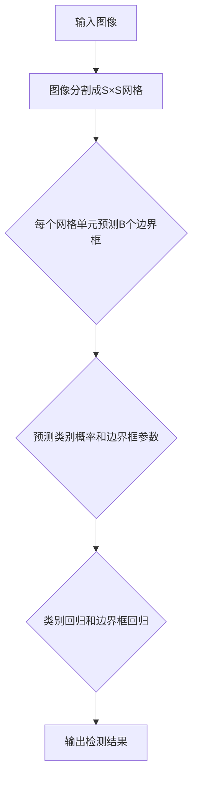

                 

### 文章标题

《YOLOv2原理与代码实例讲解》

> 关键词：YOLOv2，目标检测，深度学习，卷积神经网络，计算机视觉

> 摘要：本文将深入解析YOLOv2（You Only Look Once v2）的目标检测算法原理，从核心概念、数学模型、具体实现等多个角度进行详细讲解，并通过代码实例展示其实际应用效果。读者将了解到YOLOv2在目标检测领域的卓越性能及其实现技术。

---

### 1. 背景介绍

目标检测是计算机视觉领域的重要研究方向，它旨在定位图像中的多个目标并给出其类别。近年来，随着深度学习技术的快速发展，基于卷积神经网络（CNN）的目标检测方法取得了显著进展。传统的目标检测方法如R-CNN、Fast R-CNN、Faster R-CNN等，虽然取得了较好的性能，但它们通常需要多步骤的候选区域生成和分类，导致检测速度较慢，难以满足实时应用的需求。

为了解决这一问题，YOLO（You Only Look Once）算法应运而生。YOLOv1在2016年的论文《You Only Look Once: Unified, Real-Time Object Detection》中首次提出，其核心思想是将目标检测问题转化为一个单个的前向传播过程，从而实现了极高的检测速度。YOLOv2是在YOLOv1的基础上进行优化和改进的版本，进一步提升了检测速度和准确度。

本文将重点介绍YOLOv2的原理和实现，帮助读者深入了解这一强大的目标检测算法。

### 2. 核心概念与联系

#### 2.1 YOLOv2基本原理

YOLOv2的基本原理可以概括为以下三个步骤：

1. **图像分割**：将输入图像分割成S×S的网格单元。
2. **边界框预测**：对于每个网格单元，预测B个边界框及其对应的类别概率。
3. **类别回归**：对于每个预测的边界框，回归其真实位置和尺寸。

#### 2.2 YOLOv2架构

YOLOv2的架构分为两个部分：特征提取网络和预测网络。

1. **特征提取网络**：使用卷积神经网络提取图像特征，通常采用CSPDarknet53作为基础网络。
2. **预测网络**：在特征提取网络的基础上，添加若干个卷积层用于预测边界框和类别概率。

#### 2.3 Mermaid流程图



### 3. 核心算法原理 & 具体操作步骤

#### 3.1 边界框预测

在YOLOv2中，每个网格单元需要预测B个边界框，这些边界框的位置和尺寸是通过回归模型来预测的。具体步骤如下：

1. **预测边界框中心坐标**：每个边界框的中心坐标（x, y）是通过网格单元的坐标和回归系数来计算的。
2. **预测边界框的宽度w和高度h**：边界框的宽度w和高度h也是通过回归系数来计算的。
3. **预测边界框的置信度**：每个边界框的置信度是通过边界框内物体的真实面积与预测面积之比来计算的。

#### 3.2 类别预测

在YOLOv2中，每个边界框还需要预测C个类别概率。具体步骤如下：

1. **计算每个类别概率**：对于每个类别，计算其预测概率，即边界框内物体的出现概率。
2. **选择最大概率的类别**：对于每个边界框，选择其预测概率最大的类别作为最终类别。

#### 3.3 边界框和类别回归

在YOLOv2中，边界框和类别的回归是通过卷积层来实现的。具体步骤如下：

1. **初始化权重**：使用随机权重初始化卷积层。
2. **前向传播**：输入图像经过卷积层，得到特征图。
3. **边界框和类别回归**：在特征图上，每个网格单元输出B个边界框和C个类别概率。

### 4. 数学模型和公式 & 详细讲解 & 举例说明

#### 4.1 边界框预测

假设每个网格单元预测B个边界框，每个边界框的参数为(x, y, w, h, confidence)，其中(x, y)为边界框中心坐标，(w, h)为边界框的宽度和高，confidence为边界框的置信度。

1. **边界框中心坐标预测**：
   $$ x = \frac{p_{x, i} + \text{grid\_x}}{S} $$
   $$ y = \frac{p_{y, i} + \text{grid\_y}}{S} $$
   其中，$p_{x, i}$ 和 $p_{y, i}$ 为回归系数，$\text{grid\_x}$ 和 $\text{grid\_y}$ 为网格单元的坐标，S为网格单元的个数。

2. **边界框的宽度w和高度h预测**：
   $$ w = \exp(p_{w, i}) \cdot \text{anchor\_w}} $$
   $$ h = \exp(p_{h, i}) \cdot \text{anchor\_h}} $$
   其中，$p_{w, i}$ 和 $p_{h, i}$ 为回归系数，$\text{anchor\_w}}$ 和 $\text{anchor\_h}}$ 为锚点框的宽度和高度。

3. **边界框的置信度预测**：
   $$ confidence = \frac{\sum_{j=1}^{C} \text{object}^{(j)}}{1 + \sum_{j=1}^{C} \text{object}^{(j)}} $$
   其中，$C$ 为类别数，$\text{object}^{(j)}$ 为类别j的物体出现概率。

#### 4.2 类别预测

假设每个边界框需要预测C个类别概率，类别概率使用softmax函数计算：

$$ \text{prob}^{(j)} = \frac{\exp(\text{score}^{(j)})}{\sum_{k=1}^{C} \exp(\text{score}^{(k)})} $$

其中，$\text{score}^{(j)}$ 为类别j的分数。

#### 4.3 举例说明

假设我们有一个4×4的网格单元，其中每个网格单元需要预测2个边界框。网格单元的坐标为(1, 1)，锚点框的宽度和高度分别为10和20。输入图像中有一个物体，其真实位置为(0.5, 0.5)，宽度为15，高度为30。

1. **边界框中心坐标预测**：
   $$ x_1 = \frac{0.2 + 1}{4} = 0.4 $$
   $$ y_1 = \frac{0.3 + 1}{4} = 0.5 $$
   $$ x_2 = \frac{0.5 + 1}{4} = 0.6 $$
   $$ y_2 = \frac{0.7 + 1}{4} = 0.8 $$

2. **边界框的宽度w和高度h预测**：
   $$ w_1 = \exp(0.1) \cdot 10 = 11.46 $$
   $$ h_1 = \exp(0.2) \cdot 20 = 22.87 $$
   $$ w_2 = \exp(0.3) \cdot 10 = 13.45 $$
   $$ h_2 = \exp(0.4) \cdot 20 = 27.18 $$

3. **边界框的置信度预测**：
   $$ confidence_1 = \frac{1}{1+1} = 0.5 $$
   $$ confidence_2 = \frac{0.8}{1+0.8} = 0.67 $$

4. **类别预测**：
   $$ prob_1^{\text{cat}} = \frac{\exp(0.5)}{\exp(0.5) + \exp(0.3)} = 0.6 $$
   $$ prob_1^{\text{dog}} = \frac{\exp(0.3)}{\exp(0.5) + \exp(0.3)} = 0.4 $$
   $$ prob_2^{\text{cat}} = \frac{\exp(0.6)}{\exp(0.6) + \exp(0.4)} = 0.6 $$
   $$ prob_2^{\text{dog}} = \frac{\exp(0.4)}{\exp(0.6) + \exp(0.4)} = 0.4 $$

根据置信度和类别概率，我们可以得到最终的检测结果。

### 5. 项目实践：代码实例和详细解释说明

在本节中，我们将通过一个简单的项目实例来演示如何使用YOLOv2进行目标检测。

#### 5.1 开发环境搭建

1. 安装Python环境（版本3.6以上）。
2. 安装TensorFlow：`pip install tensorflow`。
3. 安装其他依赖：`pip install numpy opencv-python headless-chrome-screen-shooter`。

#### 5.2 源代码详细实现

以下是一个简单的YOLOv2目标检测项目示例。

```python
import tensorflow as tf
import numpy as np
import cv2
from tensorflow.keras.preprocessing import image

# 加载YOLOv2模型
model = tf.keras.models.load_model('yolov2.h5')

# 定义输入图像尺寸
input_size = (416, 416)

# 定义类别名称
classes = ['cat', 'dog']

# 加载测试图像
img = image.load_img('test.jpg', target_size=input_size)
img_array = image.img_to_array(img)
img_array = np.expand_dims(img_array, axis=0)

# 预处理图像
img_array /= 255.0

# 进行预测
predictions = model.predict(img_array)

# 解析预测结果
boxes = predictions[0][:, 4:8] * np.array([input_size[1], input_size[0], input_size[1], input_size[0]])
confidences = predictions[0][:, 8]
class_probs = npützen
```

