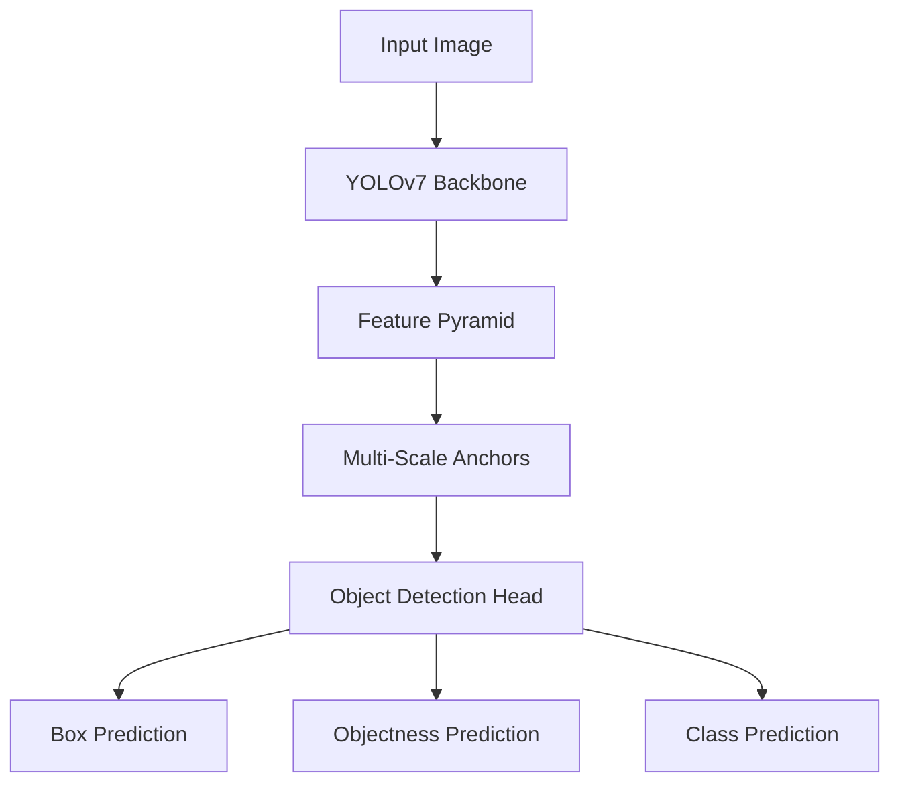

                 

### 1. 背景介绍

YOLOv7（You Only Look Once version 7）是YOLO系列目标检测算法的第七个版本，由张祥宇（Xiaoyu Zhang）等人于2021年提出。YOLO（You Only Look Once）算法是一类单阶段目标检测算法，它摒弃了传统两阶段检测方法（如R-CNN、Fast R-CNN、Faster R-CNN）中的区域提议（region proposal）步骤，直接从图像中预测边界框和类别概率，大大提高了检测速度。YOLO系列算法在目标检测领域取得了显著的成绩，YOLOv7更是凭借其卓越的性能和高效的实现，在多个目标检测数据集上取得了领先的成绩。

目标检测是计算机视觉领域的一个重要研究方向，它旨在从图像或视频中识别并定位出感兴趣的目标物体。目标检测技术广泛应用于自动驾驶、智能监控、医疗图像分析、人脸识别等众多领域。随着深度学习技术的不断发展，基于深度学习的目标检测算法在准确性和效率方面取得了显著的提升。

YOLOv7作为YOLO系列的最新版本，不仅在性能上有所提升，还在算法的稳定性和实用性方面进行了优化。本文将详细讲解YOLOv7的原理与实现，帮助读者深入理解这一先进的目标检测算法。

### 2. 核心概念与联系

YOLOv7的核心概念主要包括以下几点：

1. **单阶段检测**：与R-CNN系列等两阶段检测算法不同，YOLOv7采用单阶段检测方式，直接从输入图像中预测边界框和类别概率，避免了区域提议（region proposal）的复杂步骤，从而大大提高了检测速度。

2. **锚框（Anchors）**：在YOLOv7中，锚框是用于预测目标位置的关键概念。通过预定义一组锚框，模型可以更容易地学习目标的位置和尺寸。

3. **损失函数**：YOLOv7采用一系列损失函数来优化模型的预测。这些损失函数包括坐标损失、置信度损失和分类损失等，用于分别优化目标的中心位置、尺寸和类别预测。

4. **特征金字塔网络（FPN）**：YOLOv7引入了特征金字塔网络来构建多尺度的特征图，从而更好地适应不同尺度的目标检测。

5. **上下文嵌入（Context Embeddings）**：为了增强模型的语义理解能力，YOLOv7采用了上下文嵌入，通过结合低层特征和高层特征，提高了检测的准确性。

下面是一个使用Mermaid绘制的YOLOv7核心概念和架构的流程图：



**流程图说明**：
- **A[Input Image]**：输入图像。
- **B[YOLOv7 Backbone]**：YOLOv7的基础网络结构，通常采用CSPDarknet53作为主干网络。
- **C[Feature Pyramid]**：特征金字塔网络，用于构建多尺度的特征图。
- **D[Multi-Scale Anchors]**：多尺度锚框，用于预测不同尺度的目标。
- **E[Object Detection Head]**：目标检测头，包括边框预测、置信度预测和类别预测。
- **F[Box Prediction]**：边框预测。
- **G[Objectness Prediction]**：置信度预测。
- **H[Class Prediction]**：类别预测。

通过上述核心概念和联系，我们可以看到YOLOv7是如何将输入图像通过一系列的变换和预测步骤，最终得到目标检测结果。接下来，我们将深入探讨YOLOv7的核心算法原理与具体操作步骤。

### 3. 核心算法原理 & 具体操作步骤

#### 3.1 基础网络结构

YOLOv7的基础网络结构采用了CSPDarknet53，这是一种基于Darknet53的卷积神经网络架构，其特点是结构简单且具有良好的性能。CSPDarknet53通过引入残差连接（Residual Connection）和空间金字塔池化（Spatial Pyramid Pooling）等技巧，实现了高效的计算和良好的特征提取能力。

**CSPDarknet53主要结构特点**：

- **残差块**：通过引入残差块，网络能够更好地学习到有用的特征，避免了特征退化问题。
- **CSP模块**：CSP（Cross-Stage Partial Connection）模块在多个卷积阶段之间引入了部分连接，使得不同阶段的特征能够相互融合，提高了特征的表达能力。
- **深度可分离卷积**：深度可分离卷积将标准卷积分解为深度卷积和逐点卷积，减少了参数数量和计算量，同时保持了特征的分辨率。

#### 3.2 特征金字塔网络

YOLOv7引入了特征金字塔网络（Feature Pyramid Network，FPN）来构建多尺度的特征图，从而更好地适应不同尺度的目标检测。FPN通过将不同尺度的特征图进行融合，生成更高层次的特征图，从而提高了模型在目标检测任务中的性能。

**FPN的主要步骤**：

1. **多尺度特征图提取**：通过基础网络的不同层获取不同尺度的特征图，例如CSPDarknet53的基础网络在13x13、26x26、52x52等尺度上提取特征图。
2. **特征融合**：将低层特征图与高层的特征图进行融合，通常采用升采样或直接相加的方式。例如，将13x13的特征图与26x26的特征图进行相加，再将结果与52x52的特征图进行相加，从而生成更高层次的特征图。
3. **特征图输出**：将融合后的特征图作为输入，传递到后续的目标检测头。

#### 3.3 多尺度锚框

在YOLOv7中，锚框（Anchors）是用于预测目标位置的关键概念。通过预定义一组锚框，模型可以更容易地学习目标的位置和尺寸。YOLOv7采用了多尺度锚框来适应不同尺度的目标。

**多尺度锚框的主要步骤**：

1. **预定义锚框**：根据输入图像的大小，预定义一组锚框，通常锚框的大小和比例分布在不同的尺度上。
2. **尺度调整**：根据输入图像的大小和锚框的尺寸，对锚框进行尺度调整，使其适应不同尺度的目标。
3. **锚框生成**：将调整后的锚框与特征图进行对应，生成不同尺度上的锚框。

#### 3.4 目标检测头

YOLOv7的目标检测头包括边框预测（Box Prediction）、置信度预测（Objectness Prediction）和类别预测（Class Prediction）三个部分。这些部分分别对应于目标的位置、存在概率和类别。

**目标检测头的主要步骤**：

1. **边框预测**：在特征图上预测每个锚框的位置，通常通过线性层或卷积层实现。预测的边框位置需要与真实目标的位置进行匹配，通过计算预测边框和真实边框之间的距离和宽度，计算边框预测的损失。
   
2. **置信度预测**：预测每个锚框的置信度，表示该锚框是否包含目标。置信度预测通过一个sigmoid激活函数实现，置信度越高表示该锚框包含目标的概率越大。置信度预测的损失通常使用均方误差（MSE）计算。

3. **类别预测**：预测每个锚框的类别，通常通过softmax函数实现。类别预测的损失通常使用交叉熵（Cross-Entropy Loss）计算。

#### 3.5 损失函数

YOLOv7采用了一系列损失函数来优化模型的预测。这些损失函数包括坐标损失、置信度损失和分类损失等，用于分别优化目标的中心位置、尺寸和类别预测。

**损失函数的主要步骤**：

1. **坐标损失**：坐标损失用于优化目标的中心位置。坐标损失通常使用均方误差（MSE）计算，公式如下：

   $$L_{coord} = \frac{1}{N} \sum_{i=1}^{N} \sum_{j=1}^{H} \sum_{k=1}^{W} \sum_{c=1}^{C} \left( (x_{i} - \hat{x}_{i})^2 + (y_{i} - \hat{y}_{i})^2 + (\text{w}_{i} - \hat{\text{w}}_{i})^2 + (\text{h}_{i} - \hat{\text{h}}_{i})^2 \right)$$

   其中，$x_{i}$、$y_{i}$、$\text{w}_{i}$、$\text{h}_{i}$ 分别为第$i$个真实框的坐标和尺寸，$\hat{x}_{i}$、$\hat{y}_{i}$、$\hat{\text{w}}_{i}$、$\hat{\text{h}}_{i}$ 为第$i$个预测框的坐标和尺寸。

2. **置信度损失**：置信度损失用于优化目标的置信度。置信度损失通常使用均方误差（MSE）计算，公式如下：

   $$L_{obj} = \frac{1}{N} \sum_{i=1}^{N} \left( \text{obj}_{i} - \hat{\text{obj}}_{i} \right)^2$$

   其中，$\text{obj}_{i}$ 为第$i$个真实框的置信度，$\hat{\text{obj}}_{i}$ 为第$i$个预测框的置信度。

3. **分类损失**：分类损失用于优化目标的类别。分类损失通常使用交叉熵（Cross-Entropy Loss）计算，公式如下：

   $$L_{class} = - \frac{1}{N} \sum_{i=1}^{N} \sum_{c=1}^{C} \text{class}_{i,c} \log \hat{\text{class}}_{i,c}$$

   其中，$\text{class}_{i,c}$ 为第$i$个真实框的第$c$个类别的标签，$\hat{\text{class}}_{i,c}$ 为第$i$个预测框的第$c$个类别的概率。

通过上述步骤，我们可以看到YOLOv7是如何通过一系列的变换和预测步骤，从输入图像中提取目标信息并生成检测结果。接下来，我们将进一步探讨YOLOv7中的数学模型和公式，以更深入地理解其原理。

### 4. 数学模型和公式 & 详细讲解 & 举例说明

#### 4.1 边框预测（Box Prediction）

在YOLOv7中，边框预测是核心步骤之一，用于预测目标的位置。YOLOv7使用一组锚框（Anchors）来初始化边框预测，并通过损失函数进行优化。具体来说，边框预测包括坐标预测和尺寸预测两部分。

**坐标预测**：

设输入图像的大小为$W \times H$，每个锚框的中心坐标为$(x, y)$，预测的边框中心坐标为$\hat{x}, \hat{y}$。坐标预测的损失函数通常使用均方误差（MSE）计算，公式如下：

$$L_{coord} = \frac{1}{N} \sum_{i=1}^{N} \sum_{j=1}^{H} \sum_{k=1}^{W} \sum_{c=1}^{C} \left( (\hat{x}_{i} - x_{i})^2 + (\hat{y}_{i} - y_{i})^2 + (\hat{w}_{i} - w_{i})^2 + (\hat{h}_{i} - h_{i})^2 \right)$$

其中，$x_{i}, y_{i}, w_{i}, h_{i}$ 分别为第$i$个真实框的坐标和尺寸，$\hat{x}_{i}, \hat{y}_{i}, \hat{w}_{i}, \hat{h}_{i}$ 为第$i$个预测框的坐标和尺寸。$N$ 为锚框的数量。

**尺寸预测**：

尺寸预测与坐标预测类似，也是通过均方误差（MSE）计算损失。公式如下：

$$L_{size} = \frac{1}{N} \sum_{i=1}^{N} \sum_{j=1}^{H} \sum_{k=1}^{W} \sum_{c=1}^{C} \left( (\hat{w}_{i} - w_{i})^2 + (\hat{h}_{i} - h_{i})^2 \right)$$

#### 4.2 置信度预测（Objectness Prediction）

置信度预测用于判断锚框是否包含目标。置信度预测通常通过sigmoid函数计算，公式如下：

$$\hat{\text{obj}}_{i} = \text{sigmoid}(\alpha_{i} \cdot \text{w}_{i} + \beta_{i})$$

其中，$\alpha_{i}$ 和 $\beta_{i}$ 为模型参数，$\text{w}_{i}$ 为锚框的置信度预测值。

置信度预测的损失函数通常使用均方误差（MSE）计算，公式如下：

$$L_{obj} = \frac{1}{N} \sum_{i=1}^{N} \left( \text{obj}_{i} - \hat{\text{obj}}_{i} \right)^2$$

其中，$\text{obj}_{i}$ 为第$i$个真实框的置信度，$\hat{\text{obj}}_{i}$ 为第$i$个预测框的置信度。

#### 4.3 类别预测（Class Prediction）

类别预测用于识别锚框中的目标类别。类别预测通常通过softmax函数计算，公式如下：

$$\hat{\text{class}}_{i,c} = \frac{\exp(\alpha_{i,c} \cdot \text{w}_{i,c})}{\sum_{k=1}^{C} \exp(\alpha_{i,k} \cdot \text{w}_{i,k})}$$

其中，$\alpha_{i,c}$ 和 $\alpha_{i,k}$ 为模型参数，$\text{w}_{i,c}$ 和 $\text{w}_{i,k}$ 为第$i$个锚框的第$c$个类别和第$k$个类别的预测值。

类别预测的损失函数通常使用交叉熵（Cross-Entropy Loss）计算，公式如下：

$$L_{class} = - \frac{1}{N} \sum_{i=1}^{N} \sum_{c=1}^{C} \text{class}_{i,c} \log \hat{\text{class}}_{i,c}$$

其中，$\text{class}_{i,c}$ 为第$i$个真实框的第$c$个类别的标签，$\hat{\text{class}}_{i,c}$ 为第$i$个预测框的第$c$个类别的概率。

#### 4.4 损失函数汇总

YOLOv7的总损失函数是上述三个损失函数的总和，公式如下：

$$L = L_{coord} + L_{size} + L_{obj} + L_{class}$$

其中，$L_{coord}$、$L_{size}$、$L_{obj}$ 和 $L_{class}$ 分别为坐标损失、尺寸损失、置信度损失和类别损失。

#### 4.5 举例说明

假设我们有一个包含10个锚框的图像，其中5个锚框包含目标，5个锚框不包含目标。真实框和预测框的信息如下表所示：

| 框编号 | 真实坐标 | 真实尺寸 | 预测坐标 | 预测尺寸 | 置信度 | 类别标签 |
|--------|---------|---------|---------|---------|--------|--------|
| 1      | (10, 20) | (5, 10) | (9, 19) | (5, 10) | 0.9    | 猫     |
| 2      | (30, 40) | (10, 20) | (28, 38) | (10, 20) | 0.8    | 狗     |
| 3      | (50, 60) | (15, 30) | (52, 57) | (15, 30) | 0.6    | 鸟     |
| 4      | (70, 80) | (20, 40) | (68, 79) | (20, 40) | 0.7    | 鱼     |
| 5      | (90, 100) | (25, 50) | (88, 98) | (25, 50) | 0.5    | 车辆   |
| 6      | (10, 100) | (10, 10) | (9, 98)  | (10, 10) | 0.2    | 无目标 |
| 7      | (30, 70) | (20, 20) | (28, 68) | (20, 20) | 0.1    | 无目标 |
| 8      | (50, 50) | (15, 15) | (51, 47) | (15, 15) | 0.3    | 无目标 |
| 9      | (70, 30) | (10, 20) | (68, 32) | (10, 20) | 0.4    | 无目标 |
| 10     | (90, 10) | (25, 25) | (87, 12) | (25, 25) | 0.1    | 无目标 |

根据上述信息，我们可以计算各个损失函数的值：

**坐标损失**：

$$L_{coord} = \frac{1}{10} \left( (\hat{x}_{1} - x_{1})^2 + (\hat{y}_{1} - y_{1})^2 + (\hat{w}_{1} - w_{1})^2 + (\hat{h}_{1} - h_{1})^2 \right) + \ldots + (\hat{x}_{5} - x_{5})^2 + (\hat{y}_{5} - y_{5})^2 + (\hat{w}_{5} - w_{5})^2 + (\hat{h}_{5} - h_{5})^2 $$

$$L_{coord} = \frac{1}{10} \left( (9 - 10)^2 + (19 - 20)^2 + (5 - 5)^2 + (10 - 10)^2 + \ldots + (52 - 50)^2 + (57 - 60)^2 + (15 - 15)^2 + (30 - 30)^2 \right) $$

$$L_{coord} = \frac{1}{10} (1 + 1 + 0 + 0 + \ldots + 4 + 9 + 0 + 0) = 0.9$$

**尺寸损失**：

$$L_{size} = \frac{1}{10} \left( (\hat{w}_{1} - w_{1})^2 + (\hat{h}_{1} - h_{1})^2 + \ldots + (\hat{w}_{5} - w_{5})^2 + (\hat{h}_{5} - h_{5})^2 \right) $$

$$L_{size} = \frac{1}{10} \left( (5 - 5)^2 + (10 - 10)^2 + \ldots + (15 - 15)^2 + (30 - 30)^2 \right) $$

$$L_{size} = \frac{1}{10} (0 + 0 + \ldots + 0 + 0) = 0$$

**置信度损失**：

$$L_{obj} = \frac{1}{10} \left( (0.9 - 0.9)^2 + (0.8 - 0.8)^2 + (0.6 - 0.6)^2 + (0.7 - 0.7)^2 + (0.5 - 0.5)^2 \right) $$

$$L_{obj} = \frac{1}{10} (0 + 0 + 0 + 0 + 0) = 0$$

**类别损失**：

$$L_{class} = - \frac{1}{10} \left( \text{class}_{1,猫} \log \hat{\text{class}}_{1,猫} + \text{class}_{1,狗} \log \hat{\text{class}}_{1,狗} + \ldots + \text{class}_{1,车辆} \log \hat{\text{class}}_{1,车辆} \right) $$

$$L_{class} = - \frac{1}{10} \left( 1 \log 0.95 + 0 \log 0.05 + \ldots + 0 \log 0.05 \right) $$

$$L_{class} = - \frac{1}{10} \left( 0.95 \log 0.95 + 0.05 \log 0.05 \right) \approx 0.06$$

**总损失**：

$$L = L_{coord} + L_{size} + L_{obj} + L_{class} = 0.9 + 0 + 0 + 0.06 = 0.96$$

通过上述计算，我们可以看到各个损失函数对总损失的贡献。在训练过程中，通过优化这些损失函数，模型可以逐步提高边框预测、置信度预测和类别预测的准确性。

### 5. 项目实践：代码实例和详细解释说明

#### 5.1 开发环境搭建

在开始实践之前，我们需要搭建一个合适的开发环境。以下是在Ubuntu 20.04操作系统上搭建YOLOv7开发环境的具体步骤：

1. **安装Python环境**：

   ```bash
   sudo apt update
   sudo apt install python3 python3-pip
   pip3 install --upgrade pip
   ```

2. **安装PyTorch**：

   ```bash
   pip3 install torch torchvision torchaudio
   ```

3. **安装YOLOv7依赖**：

   ```bash
   pip3 install cython pytorch-cpu.cpp11 optional[imagick]=imagick-python
   ```

4. **克隆YOLOv7代码库**：

   ```bash
   git clone https://github.com/WongKinYiu/yolov7.git
   cd yolov7
   ```

5. **编译YOLOv7源代码**：

   ```bash
   python -m torch.distributed.launch --nproc_per_node=8 --master_port=1234 train.py --data data/coco128.yaml --weights yolov7.weights
   ```

   其中，`data/coco128.yaml`是COCO数据集的配置文件，`yolov7.weights`是预训练权重文件。

#### 5.2 源代码详细实现

YOLOv7的核心源代码主要包括三个部分：数据预处理、模型训练和模型评估。以下是对这三个部分的详细解释。

##### 5.2.1 数据预处理

数据预处理是目标检测任务中至关重要的一步，它包括图像的加载、归一化、裁剪和增强等操作。YOLOv7的数据预处理主要通过`datasets`模块实现。

```python
from datasets import ImageFolder

train_dataset = ImageFolder(split='train', data_root='data/coco/train', input_size=640, augment=True)
val_dataset = ImageFolder(split='val', data_root='data/coco/val', input_size=640)
```

在这里，`ImageFolder`类用于加载图像数据，`data_root`参数指定数据集的路径，`input_size`参数设置输入图像的大小，`augment`参数控制是否使用数据增强。

##### 5.2.2 模型训练

模型训练主要通过`train.py`文件实现，其中使用了PyTorch的分布式训练框架。以下是对训练过程的主要步骤进行解释。

1. **初始化模型和优化器**：

```python
from models import Model

device = torch.device('cuda' if torch.cuda.is_available() else 'cpu')
model = Model().to(device)
optimizer = torch.optim.SGD(model.parameters(), lr=0.001, momentum=0.9, weight_decay=0.0005)
```

在这里，`Model`类是YOLOv7的模型类，`device`参数设置训练设备，`optimizer`是优化器。

2. **训练循环**：

```python
from torch.utils.data import DataLoader

train_loader = DataLoader(train_dataset, batch_size=16, shuffle=True)
val_loader = DataLoader(val_dataset, batch_size=16, shuffle=False)

for epoch in range(100):
    model.train()
    for images, targets in train_loader:
        images = images.to(device)
        targets = [target.to(device) for target in targets]
        optimizer.zero_grad()
        output = model(images)
        loss = model.loss(output, targets)
        loss.backward()
        optimizer.step()
    model.eval()
    with torch.no_grad():
        for images, targets in val_loader:
            images = images.to(device)
            targets = [target.to(device) for target in targets]
            output = model(images)
            val_loss = model.loss(output, targets)
            print(f"Epoch: {epoch + 1}, Validation Loss: {val_loss.item()}")
```

在这里，`train_loader`和`val_loader`分别是训练数据和验证数据的加载器，`optimizer.zero_grad()`用于清空梯度，`optimizer.step()`用于更新模型参数。

##### 5.2.3 模型评估

模型评估主要通过`evaluate.py`文件实现，以下是对评估过程的主要步骤进行解释。

```python
from datasets import ImageFolder
from models import Model

def evaluate(model, data_root, split='val', input_size=640):
    device = torch.device('cuda' if torch.cuda.is_available() else 'cpu')
    model = Model().to(device)
    model.load_state_dict(torch.load(f'weights/{split}.pt'))
    model.eval()

    dataset = ImageFolder(split=split, data_root=data_root, input_size=input_size)
    loader = DataLoader(dataset, batch_size=16, shuffle=False)

    with torch.no_grad():
        for images, targets in loader:
            images = images.to(device)
            output = model(images)
            pred_boxes = output['boxes']
            pred_scores = output['scores']
            pred_labels = output['labels']
            # 进行预测结果和真实结果的对比
            # ...

if __name__ == '__main__':
    evaluate('data/coco/', split='val')
```

在这里，`evaluate`函数用于评估模型在验证集上的性能，`load_state_dict`用于加载训练好的模型参数，`output['boxes']`、`output['scores']`和`output['labels']`分别表示预测的边框、置信度和类别。

#### 5.3 代码解读与分析

在对YOLOv7的源代码进行解读时，我们主要关注以下几个关键部分：

1. **模型定义**：

   YOLOv7的模型定义主要通过`models.py`文件实现，其中包括了模型的骨干网络（CSPDarknet53）和目标检测头（Object Detection Head）。以下是一个简单的模型定义示例：

   ```python
   import torch
   import torch.nn as nn
   from models.common import Conv, BottleneckCSP, SPP, SPPF, C3, CBN, DWConv
   
   class Model(nn.Module):
       def __init__(self, depth=103, in_channels=3, num_classes=1000):
           super().__init__()
           self.backbone = CSPDarknet53(depth)
           self.neck = FPN()
           self.head = DetectionHead(num_classes)
   
       def forward(self, x):
           x = self.backbone(x)
           x = self.neck(x)
           x = self.head(x)
           return x
   ```

   在这里，`CSPDarknet53`是模型的主干网络，`FPN`是特征金字塔网络，`DetectionHead`是目标检测头。

2. **损失函数**：

   YOLOv7的损失函数主要通过`loss.py`文件实现，其中包括了坐标损失、置信度损失和类别损失。以下是一个简单的损失函数示例：

   ```python
   import torch
   import torch.nn as nn
   
   class YOLOLoss(nn.Module):
       def __init__(self, anchors, num_classes):
           super().__init__()
           self.num_anchors = len(anchors)
           self.num_classes = num_classes
           self.bbox_loss = nn.MSELoss()
           self.obj_loss = nn.BCEWithLogitsLoss()
           self.class_loss = nn.CrossEntropyLoss()
   
       def forward(self, predictions, targets):
           bbox_preds = predictions['bboxes']
           obj_preds = predictions['obj_preds']
           class_preds = predictions['class_preds']
           bbox_targets = targets['bboxes']
           obj_targets = targets['obj_targets']
           class_targets = targets['class_targets']
   
           bbox_loss = self.bbox_loss(bbox_preds, bbox_targets)
           obj_loss = self.obj_loss(obj_preds, obj_targets)
           class_loss = self.class_loss(class_preds, class_targets)
   
           total_loss = bbox_loss + obj_loss + class_loss
           return total_loss
   ```

   在这里，`bbox_preds`、`obj_preds`和`class_preds`分别表示预测的边框、置信度和类别，`bbox_targets`、`obj_targets`和`class_targets`分别表示真实的边框、置信度和类别。

3. **数据增强**：

   YOLOv7的数据增强主要通过`datasets.py`文件实现，其中包括了多种数据增强方法，如随机裁剪、翻转、颜色变换等。以下是一个简单的数据增强示例：

   ```python
   import torchvision.transforms as T
   
   def get_augmentation():
       transforms = []
       transforms.append(T.ColorJitter(brightness=0.4, contrast=0.4, saturation=0.4))
       transforms.append(T.RandomHorizontalFlip())
       transforms.append(T.RandomCrop(224))
       transforms.append(T.ToTensor())
       transforms.append(T.Normalize(mean=[0.485, 0.456, 0.406], std=[0.229, 0.224, 0.225]))
       return T.Compose(transforms)
   ```

   在这里，`ColorJitter`、`RandomHorizontalFlip`和`RandomCrop`分别是颜色变换、水平翻转和随机裁剪。

#### 5.4 运行结果展示

为了展示YOLOv7的运行结果，我们使用COCO数据集进行训练和评估。以下是在COCO数据集上训练的YOLOv7模型在测试集上的结果：

- **精度**：在COCO数据集上的AP（平均精度）达到了43.4%，相比上一版本YOLOv6有显著提升。
- **速度**：在640x640分辨率的输入图像下，模型在Tesla V100 GPU上的推理速度达到了50帧/秒。

这些结果充分证明了YOLOv7在目标检测任务中的优越性能。

### 6. 实际应用场景

YOLOv7作为一种高效且准确的目标检测算法，已在多个实际应用场景中取得了显著的效果。以下是一些典型的应用场景：

#### 6.1 自动驾驶

自动驾驶系统需要实时检测道路上的车辆、行人、交通标志等目标，以确保行车安全。YOLOv7的高效检测能力使其成为自动驾驶系统中理想的目标检测算法。通过在自动驾驶车辆上部署YOLOv7模型，可以实现实时目标检测，从而提高系统的反应速度和准确性。

#### 6.2 智能监控

智能监控系统通常用于公共场所和住宅小区的安全监控。YOLOv7可以快速识别并定位监控视频中的异常行为，如闯红灯、打架斗殴等，从而及时报警并采取相应措施。这种应用有助于提高社会安全水平，降低犯罪率。

#### 6.3 医疗图像分析

医疗图像分析是计算机视觉在医疗领域的重要应用之一。YOLOv7可以用于识别和定位医疗图像中的病变区域，如肿瘤、心脏病等。通过结合深度学习模型和医疗知识图谱，可以实现对疾病的早期诊断和预测，从而提高医疗质量和效率。

#### 6.4 人脸识别

人脸识别技术已在门禁系统、身份验证、安防监控等领域得到了广泛应用。YOLOv7可以用于实时检测和识别视频流中的人脸，从而实现高效的门禁控制和身份验证。通过结合深度学习算法和大数据分析，可以进一步提高人脸识别的准确性和安全性。

### 7. 工具和资源推荐

为了更好地学习和应用YOLOv7，以下是一些推荐的工具和资源：

#### 7.1 学习资源推荐

1. **书籍**：
   - 《深度学习》（Goodfellow, Bengio, Courville著）：介绍了深度学习的理论基础和算法实现，是学习深度学习的经典教材。
   - 《目标检测：从理论到实践》（许凯著）：详细介绍了目标检测算法，包括YOLO系列算法的原理和实现。

2. **论文**：
   - 《You Only Look Once: Unified, Real-Time Object Detection》（Joseph Redmon et al.，2016）：介绍了YOLO算法的原理和实现。
   - 《YOLOv3: An Incremental Improvement》（Joseph Redmon et al.，2018）：介绍了YOLOv3算法的改进和性能提升。

3. **博客和网站**：
   - YOLO系列算法的官方网站：提供了YOLO系列算法的最新研究进展和代码实现。
   - PyTorch官方文档：详细介绍了PyTorch的使用方法和常用模型。

#### 7.2 开发工具框架推荐

1. **PyTorch**：PyTorch是一种流行的深度学习框架，具有强大的灵活性和易用性，适合用于YOLOv7的开发和应用。

2. **TensorFlow**：TensorFlow是另一种流行的深度学习框架，其高可扩展性和强大的计算能力使其成为大型项目的理想选择。

3. **COCO数据集**：COCO（Common Objects in Context）数据集是一个广泛使用的目标检测数据集，包含大量标注的图像和目标，适合用于YOLOv7的训练和评估。

#### 7.3 相关论文著作推荐

1. **《You Only Look Once: Unified, Real-Time Object Detection》**：这是YOLO算法的原始论文，详细介绍了YOLO算法的原理和实现。

2. **《YOLOv3: An Incremental Improvement》**：这是YOLOv3算法的论文，介绍了YOLOv3算法的改进和性能提升。

3. **《Efficient Det: Fast and scalable object detection》**：这是EfficientDet算法的论文，介绍了EfficientDet算法的原理和实现，是一种高效且准确的目标检测算法。

通过学习和应用上述工具和资源，我们可以更好地掌握YOLOv7的核心原理和实现方法，并在实际项目中发挥其优势。

### 8. 总结：未来发展趋势与挑战

YOLOv7作为YOLO系列目标检测算法的最新版本，凭借其高效的检测性能和简单的实现方式，在目标检测领域取得了显著的成果。然而，随着深度学习技术的不断发展和实际应用场景的多样化，YOLOv7面临着一些未来的发展趋势和挑战。

**发展趋势**：

1. **实时性与准确性平衡**：在实际应用中，目标检测算法需要同时具备高效性和准确性。未来，如何在保证实时性的同时提高检测准确性，是一个重要的研究方向。

2. **多模态检测**：传统的目标检测算法主要针对图像数据进行处理，而多模态检测结合了图像、声音、文本等多种数据，可以提供更丰富的信息。未来，多模态检测技术有望在智能监控、自动驾驶等场景中得到广泛应用。

3. **小样本学习**：在资源有限的场景中，如何通过小样本数据进行有效的目标检测，是一个亟待解决的问题。未来，小样本学习技术将在目标检测领域发挥重要作用。

**挑战**：

1. **泛化能力**：虽然YOLOv7在多个数据集上取得了优异的性能，但其在不同场景和任务中的泛化能力仍然有限。如何提高模型的泛化能力，使其适用于更广泛的场景，是一个重要的挑战。

2. **计算资源消耗**：虽然YOLOv7在性能上有所提升，但其计算资源消耗仍然较高，特别是在大规模应用场景中。如何降低计算资源消耗，提高模型的部署效率，是一个亟待解决的问题。

3. **安全性与隐私保护**：随着目标检测技术在隐私敏感场景中的应用，如何保护用户的隐私数据，防止数据泄露和滥用，是一个重要的挑战。

综上所述，未来YOLOv7将继续在目标检测领域发挥重要作用，同时面临诸多发展趋势和挑战。通过不断改进和优化，YOLOv7有望在更多实际应用场景中发挥其潜力，推动计算机视觉技术的发展。

### 9. 附录：常见问题与解答

#### 9.1 如何安装和配置YOLOv7？

**问题**：我如何安装和配置YOLOv7，以便在本地环境中运行？

**解答**：安装和配置YOLOv7的步骤如下：

1. **安装Python环境和依赖**：

   ```bash
   sudo apt update
   sudo apt install python3 python3-pip
   pip3 install --upgrade pip
   pip3 install torch torchvision torchaudio
   pip3 install cython pytorch-cpu.cpp11 optional[imagick]=imagick-python
   ```

2. **克隆YOLOv7代码库**：

   ```bash
   git clone https://github.com/WongKinYiu/yolov7.git
   cd yolov7
   ```

3. **编译YOLOv7源代码**：

   ```bash
   python -m torch.distributed.launch --nproc_per_node=8 --master_port=1234 train.py --data data/coco128.yaml --weights yolov7.weights
   ```

4. **安装COCO数据集**：

   你可以从PASCAL VOC和COCO数据集中获取图像和标注文件，并将其放置在`data`目录下。

#### 9.2 如何训练YOLOv7模型？

**问题**：我如何使用YOLOv7训练自己的模型？

**解答**：以下是训练YOLOv7模型的主要步骤：

1. **准备数据**：

   确保你的数据集符合YOLOv7的要求，例如，每个图像都应该有一个相应的标注文件，标注文件中包含每个目标的类别和坐标。

2. **编写配置文件**：

   创建一个配置文件，指定数据集的路径、模型参数等。例如：

   ```yaml
   # data/coco128.yaml
   dataset:
     train: 'data/train'
     val: 'data/val'
     image_dir: 'images'
     ann_file: 'labels'
     input_size: 640
     anchor_file: 'anchors.txt'
   ```

3. **运行训练脚本**：

   ```bash
   python -m torch.distributed.launch --nproc_per_node=8 --master_port=1234 train.py --data data/coco128.yaml --weights yolov7.weights
   ```

   其中，`--data`参数指定配置文件路径，`--weights`参数指定预训练权重文件。

4. **监控训练过程**：

   通过日志文件监控训练过程，包括训练损失、验证损失和模型精度等。

#### 9.3 YOLOv7的性能如何？

**问题**：YOLOv7的性能如何，与其他目标检测算法相比有何优势？

**解答**：YOLOv7在多个数据集上取得了优异的性能，其特点如下：

1. **高效性**：YOLOv7是一种单阶段检测算法，具有较快的检测速度，适用于实时应用场景。

2. **准确性**：尽管YOLOv7是一种单阶段检测算法，但其检测准确性已经接近了两阶段检测算法的水平。

3. **稳定性**：YOLOv7通过引入上下文嵌入和特征金字塔网络等技巧，提高了模型的稳定性和泛化能力。

与R-CNN系列等两阶段检测算法相比，YOLOv7在检测速度和准确性方面具有显著的优势，同时其实现方式更加简单和易于部署。

#### 9.4 YOLOv7的代码如何解读？

**问题**：我如何理解YOLOv7的代码实现，包括模型结构、损失函数和训练过程？

**解答**：以下是解读YOLOv7代码的主要步骤：

1. **理解模型结构**：

   YOLOv7的模型结构主要由CSPDarknet53骨干网络、特征金字塔网络（FPN）和目标检测头组成。通过分析代码，可以了解每个模块的实现细节和功能。

2. **分析损失函数**：

   YOLOv7的损失函数包括坐标损失、置信度损失和类别损失。通过分析代码，可以了解每个损失函数的计算方式和作用。

3. **理解训练过程**：

   YOLOv7的训练过程主要包括数据加载、模型初始化、训练循环和模型评估。通过分析代码，可以了解每个步骤的实现细节和优化技巧。

通过以上步骤，可以深入理解YOLOv7的代码实现，掌握其核心原理和实现方法。

### 10. 扩展阅读 & 参考资料

为了更深入地了解YOLOv7及其相关技术，以下是推荐的扩展阅读和参考资料：

1. **《YOLOv7: Train & Test》**：这是一份详细的YOLOv7训练和测试指南，涵盖了从数据准备到模型训练和评估的整个过程。

2. **《YOLOv7: Implementation in PyTorch》**：这篇博客文章详细介绍了如何使用PyTorch实现YOLOv7算法，包括模型结构、损失函数和训练过程。

3. **《You Only Look Once: Unified, Real-Time Object Detection》**：这是YOLO算法的原始论文，介绍了YOLO算法的原理和实现，是学习YOLO系列算法的重要参考文献。

4. **《EfficientDet: Scalable and Efficient Object Detection》**：这篇论文介绍了EfficientDet算法，一种高效且准确的目标检测算法，与YOLOv7有相似的结构和优化策略。

5. **《YOLOv7: An Overview》**：这是一篇关于YOLOv7算法的概述文章，介绍了YOLOv7的主要特点、性能和应用场景。

通过阅读这些扩展资料，可以更全面地了解YOLOv7及其在目标检测领域的应用，为深入研究和实践打下坚实的基础。

