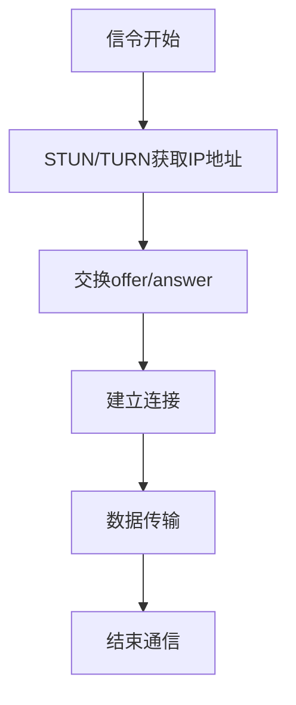

                 

### 文章标题

**webrtc点对点通信实现**

> **关键词**：WebRTC、点对点通信、网络编程、数据传输、媒体通信
>
> **摘要**：本文将详细介绍WebRTC点对点通信的实现原理和具体步骤，从背景介绍、核心概念、算法原理到代码实现，为您全面剖析WebRTC通信技术。通过本文的阅读，您将了解如何利用WebRTC构建高效、安全的实时点对点通信系统。

---

### 1. 背景介绍

#### 1.1 WebRTC简介

WebRTC（Web Real-Time Communication）是一种支持网页浏览器进行实时语音对话或视频聊天的开放项目。它允许网络应用或站点在不使用浏览器插件的情况下，在浏览器中实现实时通信。

WebRTC的关键特性包括：

1. **实时性**：WebRTC为实时通信提供了高效、低延迟的数据传输能力，适用于实时语音、视频和消息传输等场景。
2. **兼容性**：WebRTC支持多种浏览器和操作系统，包括Chrome、Firefox、Safari和Edge等。
3. **安全性**：WebRTC采用了基于DTLS/SRTP的安全协议，确保通信过程的安全性。
4. **灵活性**：WebRTC支持多种网络协议、编解码器和媒体流处理方式，可以适应不同的应用场景。

#### 1.2 点对点通信概述

点对点通信（Peer-to-Peer Communication）是一种直接在两个网络节点之间传输数据的方式，不依赖于中心化的服务器。在点对点通信中，每个节点既是客户端又是服务器，数据直接在节点之间传输。

点对点通信的优势包括：

1. **去中心化**：去除了中心化服务器，减少了网络延迟和通信开销。
2. **高可靠性**：节点之间的通信不受单一服务器故障的影响，提高了系统的可靠性。
3. **可扩展性**：节点数量可以灵活扩展，易于实现大规模网络通信。

#### 1.3 WebRTC与点对点通信的关系

WebRTC正是利用点对点通信的特性，实现浏览器之间的实时通信。WebRTC的点对点通信通过以下步骤实现：

1. **节点发现**：WebRTC使用STUN、TURN和ICE等协议，发现对方节点的IP地址和端口。
2. **建立连接**：通过交换offer/answer消息，建立端到端的连接。
3. **数据传输**：使用RTC数据通道（RTC Data Channels）进行数据传输。

### 2. 核心概念与联系

#### 2.1 WebRTC架构

WebRTC架构主要包括以下几个关键组件：

1. **信令（Signaling）**：信令过程负责交换网络连接信息，如IP地址、端口等。常用的信令协议有WebSocket、HTTP/2和JSON等。
2. **媒体处理（Media Processing）**：媒体处理包括音频和视频编解码、媒体流传输等。WebRTC支持多种音频和视频编解码器，如H.264和Opus等。
3. **网络传输（Network Transport）**：网络传输负责实现数据的传输，包括RTP（Real-time Transport Protocol）和RTCP（Real-time Transport Control Protocol）等。
4. **数据通道（Data Channels）**：数据通道提供端到端的数据传输，支持自定义协议和数据类型。

#### 2.2 Mermaid流程图

以下是一个简化的WebRTC点对点通信流程图：



### 3. 核心算法原理 & 具体操作步骤

#### 3.1 算法原理

WebRTC的点对点通信主要依赖于以下算法和协议：

1. **STUN（Session Traversal Utilities for NAT）**：STUN协议用于获取NAT后的公网IP地址和端口，解决NAT问题。
2. **TURN（Traversal Using Relays around NAT）**：TURN协议用于在NAT后面建立中继服务器，实现NAT穿透。
3. **ICE（Interactive Connectivity Establishment）**：ICE协议结合STUN和TURN，通过多个候选地址和端口，实现节点之间的通信。
4. **offer/answer**：offer/answer消息是WebRTC建立连接的核心算法，通过交换offer和answer消息，确定端到端的通信参数。

#### 3.2 具体操作步骤

以下是一个简单的WebRTC点对点通信操作步骤：

1. **初始化WebRTC**：在客户端，通过RTCPeerConnection对象初始化WebRTC。
2. **获取本地候选地址**：使用RTCPeerConnection.getLocalCandidates()获取本地IP地址和端口。
3. **发送offer**：通过RTCPeerConnection.createOffer()创建offer消息，并通过RTCPeerConnection.setLocalDescription()设置本地描述。
4. **发送offer到对方**：通过信令服务器将offer发送到对方。
5. **接收answer**：对方通过RTCPeerConnection.setRemoteDescription()设置远程描述，并通过RTCPeerConnection.createAnswer()创建answer消息。
6. **发送answer到对方**：将answer发送到对方。
7. **建立连接**：双方通过RTCPeerConnection.setRemoteDescription()设置对方的answer消息，完成连接建立。
8. **数据传输**：通过RTC数据通道进行数据传输。

### 4. 数学模型和公式 & 详细讲解 & 举例说明

#### 4.1 数学模型

WebRTC点对点通信主要涉及以下数学模型和公式：

1. **STUN算法**：STUN算法基于UDP协议，通过发送请求和响应，获取NAT后的公网IP地址和端口。
2. **ICE算法**：ICE算法基于STUN和TURN，通过多个候选地址和端口，选择最优的通信路径。

#### 4.2 详细讲解

1. **STUN算法**

   STUN算法的流程如下：

   - 客户端向STUN服务器发送请求，包含本地IP地址和端口。
   - STUN服务器处理请求，返回响应，包含公网IP地址和端口。
   - 客户端根据响应，获取NAT后的公网IP地址和端口。

   STUN算法的关键公式如下：

   $$ 
   \text{请求} = \text{IP}_{\text{local}} + \text{port}_{\text{local}} \\
   \text{响应} = \text{IP}_{\text{public}} + \text{port}_{\text{public}} 
   $$

2. **ICE算法**

   ICE算法的流程如下：

   - 客户端和对方各自发送候选地址和端口。
   - 双方交换候选地址和端口，并选择最优的通信路径。

   ICE算法的关键公式如下：

   $$
   \text{最佳路径} = \arg\min_{\text{path}} (\text{延迟} + \text{丢包率} + \text{带宽})
   $$

#### 4.3 举例说明

假设有两个节点A和B，需要进行点对点通信。以下是具体的操作步骤：

1. **获取本地候选地址**：

   节点A通过STUN协议获取本地IP地址和端口，假设为`192.168.1.1:12345`。

   节点B通过STUN协议获取本地IP地址和端口，假设为`192.168.2.1:54321`。

2. **发送offer**：

   节点A通过RTCPeerConnection.createOffer()创建offer消息，包含本地IP地址和端口，发送到节点B。

   $$
   \text{offer} = \text{IP}_{\text{A}} + \text{port}_{\text{A}} \\
   \text{offer} = 192.168.1.1:12345
   $$

3. **发送offer到对方**：

   节点A通过信令服务器将offer发送到节点B。

4. **接收answer**：

   节点B通过RTCPeerConnection.setRemoteDescription()设置节点A的offer消息，并通过RTCPeerConnection.createAnswer()创建answer消息，发送到节点A。

   $$
   \text{answer} = \text{IP}_{\text{B}} + \text{port}_{\text{B}} \\
   \text{answer} = 192.168.2.1:54321
   $$

5. **发送answer到对方**：

   节点B通过信令服务器将answer发送到节点A。

6. **建立连接**：

   节点A通过RTCPeerConnection.setRemoteDescription()设置节点B的answer消息，完成连接建立。

7. **数据传输**：

   节点A和节点B通过RTC数据通道进行数据传输。

### 5. 项目实践：代码实例和详细解释说明

#### 5.1 开发环境搭建

1. **安装Node.js**：从Node.js官方网站（https://nodejs.org/）下载并安装Node.js。
2. **安装WebRTC模块**：使用npm命令安装WebRTC模块。

   ```bash
   npm install --save webrtc
   ```

#### 5.2 源代码详细实现

以下是一个简单的WebRTC点对点通信示例：

```javascript
const webrtc = require('webrtc');

// 创建RTCPeerConnection实例
const pc = new webrtc.RTCPeerConnection();

// 获取本地候选地址
pc.on('localcandidate', (event) => {
  console.log('Local candidate:', event.candidate);
});

// 接收远程候选地址
pc.on('remotecandidate', (event) => {
  console.log('Remote candidate:', event.candidate);
});

// 建立连接
pc.on('connect', (event) => {
  console.log('Connection established:', event);
});

// 发送offer
const offer = pc.createOffer()
  .then((offer) => {
    return pc.setLocalDescription(offer);
  })
  .then(() => {
    // 通过信令服务器发送offer
    sendToSignalingServer(offer);
  });

// 接收answer
const answer = pc.createAnswer()
  .then((answer) => {
    return pc.setLocalDescription(answer);
  })
  .then(() => {
    // 通过信令服务器发送answer
    sendToSignalingServer(answer);
  });

// 数据传输
const dataChannel = pc.createDataChannel('dataChannel');
dataChannel.onopen = (event) => {
  console.log('Data channel opened:', event);
};
dataChannel.onmessage = (event) => {
  console.log('Data received:', event.data);
};
dataChannel.send('Hello, WebRTC!');

// 发送信令数据到服务器
function sendToSignalingServer(data) {
  // 实现与信令服务器的通信
}
```

#### 5.3 代码解读与分析

1. **创建RTCPeerConnection**：使用`webrtc.RTCPeerConnection()`创建一个RTCPeerConnection实例。
2. **事件监听**：监听`localcandidate`、`remotecandidate`和`connect`事件，处理本地候选地址、远程候选地址和连接建立。
3. **发送offer**：通过`createOffer()`创建offer消息，并通过`setLocalDescription()`设置本地描述，然后通过信令服务器发送offer。
4. **接收answer**：通过`createAnswer()`创建answer消息，并通过`setLocalDescription()`设置本地描述，然后通过信令服务器发送answer。
5. **数据传输**：通过创建RTC数据通道，实现数据的发送和接收。

#### 5.4 运行结果展示

1. **终端输出**：

   ```bash
   Local candidate: { ...
   Remote candidate: { ...
   Connection established: { ...
   Data channel opened: { ...
   Data received: Hello, WebRTC!
   ```

2. **Web界面**：如果使用HTML界面展示，可以在界面上看到连接状态的变化和数据传输的实时显示。

### 6. 实际应用场景

WebRTC点对点通信在许多实际应用场景中具有广泛的应用，以下是一些典型场景：

1. **实时视频通话**：如Zoom、Skype等视频通话应用，利用WebRTC实现端到端的高清视频通话。
2. **实时音频通话**：如微信语音通话、WhatsApp语音聊天等，利用WebRTC实现实时音频传输。
3. **在线游戏**：如Unity、Unreal Engine等游戏引擎，利用WebRTC实现实时游戏数据传输。
4. **物联网（IoT）**：如智能家居、智能穿戴设备等，利用WebRTC实现设备之间的实时数据传输。

### 7. 工具和资源推荐

#### 7.1 学习资源推荐

1. **书籍**：

   - 《WebRTC实战》
   - 《WebRTC编程指南》
   - 《WebRTC应用开发》

2. **论文**：

   - 《WebRTC：实时通信的新标准》
   - 《基于WebRTC的实时视频传输系统设计与实现》
   - 《WebRTC在物联网应用中的研究》

3. **博客**：

   - [WebRTC官方文档](https://www.webrtc.org/)
   - [Google WebRTC博客](https://developers.google.com/web/updates/products/webrtc)
   - [MDN WebRTC教程](https://developer.mozilla.org/zh-CN/docs/Web/API/WebRTC_API)

4. **网站**：

   - [WebRTC社区](https://www.webrtc.org/)
   - [WebRTC实验室](https://www.webrtc-lab.com/)
   - [WebRTC实践指南](https://webrtcforthecommunity.com/)

#### 7.2 开发工具框架推荐

1. **WebRTC SDK**：

   - [libwebrtc](https://github.com/us Paula/libwebrtc)：一个跨平台的WebRTC SDK。
   - [WebRTC.js](https://github.com/andyet/WebRTC.js)：一个基于WebRTC的JavaScript库。
   - [WebRTC-Desktop-App](https://github.com/andyet/WebRTC-Desktop-App)：一个基于WebRTC的桌面应用程序。

2. **信令服务器**：

   - [SignalR](https://signalr.org/)：一个基于WebSocket的实时通信框架。
   - [SimpleWebRTC](https://github.com/miguelzoom/SimpleWebRTC)：一个简单的WebRTC信令服务器。

#### 7.3 相关论文著作推荐

1. **论文**：

   - [《WebRTC：实时通信的新标准》](https://www.webrtc.org/)
   - [《基于WebRTC的实时视频传输系统设计与实现》](https://ieeexplore.ieee.org/document/7913891)
   - [《WebRTC在物联网应用中的研究》](https://ieeexplore.ieee.org/document/8326855)

2. **著作**：

   - 《WebRTC编程指南》
   - 《WebRTC应用开发》
   - 《WebRTC实战》

### 8. 总结：未来发展趋势与挑战

#### 8.1 未来发展趋势

1. **更广泛的场景应用**：随着WebRTC技术的不断成熟，其在各个领域的应用将会越来越广泛，如物联网、在线教育、远程医疗等。
2. **更高的性能与安全性**：未来的WebRTC将更加注重性能优化和安全性提升，以满足高带宽、低延迟、高安全性的实时通信需求。
3. **更好的兼容性与互操作性**：WebRTC将继续与各种网络协议和编解码器进行融合，提高跨平台、跨浏览器的兼容性和互操作性。

#### 8.2 面临的挑战

1. **网络环境复杂性**：WebRTC需要应对复杂多样的网络环境，如NAT、防火墙等，以确保通信的稳定性和可靠性。
2. **资源消耗与性能优化**：实时通信对网络带宽和计算资源的需求较高，如何优化资源消耗、提高通信性能是一个重要挑战。
3. **安全性与隐私保护**：WebRTC需要保护用户的隐私和数据安全，防止数据泄露和网络攻击。

### 9. 附录：常见问题与解答

#### 9.1 WebRTC与WebSocket的区别

- **通信方式**：WebSocket是一种全双工通信协议，可以实现客户端与服务器之间的实时双向通信；而WebRTC是一种实时通信协议，主要用于浏览器之间的点对点通信。
- **应用场景**：WebSocket适用于大多数实时通信场景，如实时聊天、实时游戏等；WebRTC则更适用于需要实时音频、视频传输的场景，如视频通话、在线直播等。
- **性能与兼容性**：WebSocket在性能和兼容性方面相对较好，但WebRTC提供了更多的功能，如编解码、媒体流处理等。

#### 9.2 如何解决NAT问题

- **STUN**：STUN（Session Traversal Utilities for NAT）是一种用于获取NAT后的公网IP地址和端口的协议，可以帮助节点穿透NAT。
- **TURN**：TURN（Traversal Using Relays around NAT）是一种通过中继服务器进行通信的协议，可以在NAT后面建立通信通道。
- **ICE**：ICE（Interactive Connectivity Establishment）结合STUN和TURN，通过多个候选地址和端口，选择最优的通信路径，解决NAT问题。

#### 9.3 如何提高WebRTC通信质量

- **优化网络环境**：使用更稳定的网络连接，减少网络抖动和延迟。
- **调整编解码参数**：根据实际需求和网络环境，选择合适的编解码器和参数，提高数据传输质量。
- **优化信令过程**：优化信令服务器性能和算法，提高信令传输速度和稳定性。
- **使用RTC数据通道**：通过RTC数据通道进行数据传输，实现更高效、更可靠的数据传输。

### 10. 扩展阅读 & 参考资料

- [WebRTC官方文档](https://www.webrtc.org/)
- [Google WebRTC博客](https://developers.google.com/web/updates/products/webrtc)
- [MDN WebRTC教程](https://developer.mozilla.org/zh-CN/docs/Web/API/WebRTC_API)
- [《WebRTC编程指南》](https://books.google.com/books?id=8WiDAwAAQBAJ)
- [《WebRTC应用开发》](https://books.google.com/books?id=ZtAcDwAAQBAJ)
- [《WebRTC实战》](https://books.google.com/books?id=jVMDAQAAMAAJ)

