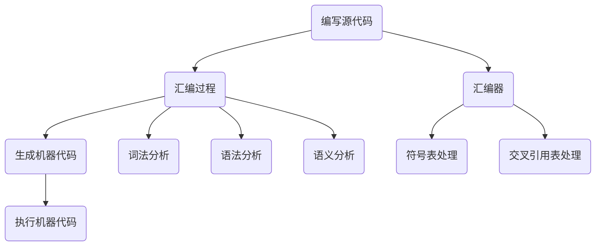

                 

### 背景介绍 Background Introduction

x86汇编语言作为一种底层编程语言，是计算机领域中的基础技能。它能够提供对计算机硬件的精细控制，是操作系统、驱动程序、嵌入式系统和游戏开发等领域不可或缺的工具。汇编语言与机器语言紧密相关，但相较于机器语言，它更加易于理解和编写。x86汇编语言的发展历程可以追溯到上世纪70年代，当时Intel推出了8086处理器，并随之发布了相应的汇编语言规范。自那时起，x86架构及其汇编语言不断演进，成为如今广泛应用于个人计算机、服务器和嵌入式设备的主流技术。

在计算机体系中，汇编语言处于底层，直接与计算机硬件打交道。它通过操作硬件寄存器、内存地址以及执行具体的指令来控制计算机的操作。汇编语言相较于高级编程语言，更贴近硬件层面，但这也意味着它需要程序员具备更深入的计算机硬件知识。汇编语言编程不仅能够提高程序的执行效率，还可以进行系统底层优化，但同时也增加了编程的复杂度和难度。

本文旨在为广大计算机爱好者和开发者提供一个全面、系统的x86汇编语言学习指南。通过逐步深入的分析，我们将探讨汇编语言的核心概念、算法原理、数学模型、项目实践及其在实际应用场景中的价值。此外，文章还将推荐相关学习资源和开发工具，帮助读者更好地掌握这一底层编程语言。

在接下来的章节中，我们将首先介绍汇编语言的基本概念和组成部分，接着深入探讨其核心算法原理，并通过具体实例来讲解如何实现汇编语言编程。同时，文章还将讨论汇编语言在实际应用中的场景，以及推荐的工具和资源。通过这篇文章，读者将能够全面了解并掌握x86汇编语言，为其在计算机领域的进一步发展打下坚实基础。

### 核心概念与联系 Core Concepts and Their Connections

为了深入理解x86汇编语言，我们需要首先了解其核心概念，包括汇编语言的组成、工作原理以及与其他层次编程语言的联系。以下是汇编语言中一些关键概念及其相互关系的详细阐述。

#### 汇编语言的组成 Components of Assembly Language

1. **指令集指令集（Instruction Set）**

   指令集是汇编语言的核心，它定义了汇编语言中可用的所有指令。每个指令对应计算机硬件中一个特定的操作，如加法、减法、数据传送等。x86指令集包括数千个指令，这些指令分为数据传输指令、算术逻辑指令、控制指令、字符串操作指令等类别。

2. **汇编器（Assembler）**

   汇编器是将汇编语言代码转换为机器代码的程序。它将汇编代码中的每条指令翻译为相应的机器码，并生成可执行文件。汇编器的输入是汇编源代码，输出是机器码和可能的错误报告。汇编器还需要处理符号表和交叉引用表，以帮助生成正确的机器代码。

3. **语法（Syntax）**

   汇编语言的语法相对简单，主要包括指令、操作数、地址运算符和伪指令。指令是核心操作，操作数是操作的数据来源或目标，地址运算符用于计算内存地址，伪指令则提供编译时的帮助信息。

4. **寄存器（Registers）**

   寄存器是CPU中的临时存储单元，用于存储数据或地址。x86架构中包括通用寄存器、段寄存器、指令指针寄存器等。通用寄存器如EAX、EBX、ECX和EDX等在汇编语言中广泛应用，用于各种计算和数据传输操作。

5. **内存（Memory）**

   内存是计算机中用于存储程序和数据的地方。在汇编语言中，程序员需要直接操作内存地址，通过地址运算符和寄存器间接寻址来访问和修改内存内容。

#### 汇编语言的工作原理 Working Principle of Assembly Language

汇编语言的工作原理可以概括为以下几个步骤：

1. **编写源代码（Source Code）**

   开发者使用汇编语言编写源代码，这些代码包括指令、操作数和伪指令等。源代码通常包含注释和宏定义，以增强代码的可读性和可维护性。

2. **汇编过程（Assembly Process）**

   汇编器读取源代码，进行词法分析、语法分析和语义分析，将汇编指令翻译为机器代码。在此过程中，汇编器会处理符号表和交叉引用表，确保指令和操作数的正确引用。

3. **生成机器代码（Machine Code）**

   汇编器将汇编代码转换为机器代码，并生成可执行文件。机器代码直接由CPU执行，它包含操作码和操作数的二进制表示。

4. **执行机器代码（Executing Machine Code）**

   CPU加载并执行机器代码，完成相应的操作。汇编语言能够直接访问硬件资源，因此可以高效地执行特定的任务。

#### 汇编语言与其他层次编程语言的联系 Connections with Higher-Level Programming Languages

汇编语言与高级编程语言（如C/C++、Java等）在编程风格和抽象层次上有显著差异。然而，它们之间也存在紧密的联系：

1. **编译过程（Compilation Process）**

   高级编程语言需要经过编译器转换为目标代码，而汇编语言则需要经过汇编器转换成机器代码。在某些情况下，高级编程语言可以通过嵌入汇编代码来利用汇编语言的特性。

2. **性能优化（Performance Optimization）**

   高级编程语言编译器常常会生成汇编代码来优化程序性能。因此，熟悉汇编语言可以帮助程序员更好地理解编译器的工作原理，并进行性能优化。

3. **跨层次编程（Cross-Level Programming）**

   汇编语言与高级编程语言可以通过互操作实现跨层次编程。例如，在嵌入式系统开发中，程序员可以使用C语言编写主要程序逻辑，并通过汇编语言编写关键的性能敏感部分。

#### Mermaid 流程图 Mermaid Diagram

为了更直观地展示汇编语言的核心概念和其工作原理，我们可以使用Mermaid流程图来描述其各个组件和步骤：



通过这个流程图，我们可以清晰地看到汇编语言的各个环节及其相互关系。在接下来的章节中，我们将进一步探讨x86汇编语言的核心算法原理，并通过具体实例来详细讲解如何进行汇编语言编程。

#### 核心算法原理 & 具体操作步骤 Core Algorithm Principle & Detailed Steps

在了解了x86汇编语言的基本概念和工作原理之后，我们需要深入探讨其核心算法原理和具体操作步骤。汇编语言编程的核心在于对CPU指令的精确使用，这要求程序员对x86架构及其指令集有深入的理解。以下是x86汇编语言编程中的几个关键算法原理及其实际操作步骤。

##### 1. 数据传输指令 Data Transfer Instructions

数据传输指令是汇编语言中最基本的指令类型，用于在寄存器与内存之间进行数据的移动。以下是一些常用的数据传输指令及其具体操作步骤：

- **MOV（移动）指令**

  MOV指令用于将一个值从一个位置移动到另一个位置。其基本语法为：

  ```
  MOV dest, src
  ```

  例如：

  ```
  MOV AX, 1234h ; 将十六进制值1234h移动到寄存器AX中
  ```

  操作步骤：

  1. 计算源操作数的值。
  2. 将值复制到目的操作数。

- **MOVSB/MOVSW/MOVSD（字符串传输）指令**

  这些指令用于字符串的传输，它们分别操作字（Word）、双字（Double Word）和四字（Quad Word）。其基本语法为：

  ```
  MOVSB
  MOVSW
  MOVSD
  ```

  例如：

  ```
  MOVSB ; 将当前数据段（DS）的偏移地址中的字节传输到ES段中的当前地址
  ```

  操作步骤：

  1. 根据指令类型确定操作的数据大小。
  2. 将数据从源地址传输到目标地址。
  3. 更新指针寄存器的值。

##### 2. 算术逻辑指令 Arithmetic and Logical Instructions

算术逻辑指令用于执行基本的算术运算和逻辑操作。以下是一些常用的算术逻辑指令及其操作步骤：

- **ADD（加法）指令**

  ADD指令将源操作数的值加到目的操作数上，其基本语法为：

  ```
  ADD dest, src
  ```

  例如：

  ```
  ADD AX, BX ; 将寄存器BX的值加到寄存器AX中
  ```

  操作步骤：

  1. 计算源操作数的值。
  2. 将值加到目的操作数。
  3. 更新标志寄存器。

- **SUB（减法）指令**

  SUB指令从目的操作数中减去源操作数的值，其基本语法为：

  ```
  SUB dest, src
  ```

  例如：

  ```
  SUB AX, BX ; 从寄存器AX中减去寄存器BX的值
  ```

  操作步骤：

  1. 计算源操作数的值。
  2. 从目的操作数中减去值。
  3. 更新标志寄存器。

- **AND/OR/XOR（逻辑运算）指令**

  这些指令分别实现按位与、或、异或操作，其基本语法为：

  ```
  AND dest, src
  OR dest, src
  XOR dest, src
  ```

  例如：

  ```
  AND AX, BX ; 对寄存器AX和寄存器BX进行按位与操作
  ```

  操作步骤：

  1. 计算源操作数的值。
  2. 对目的操作数和源操作数进行相应的逻辑运算。
  3. 更新标志寄存器。

##### 3. 控制指令 Control Instructions

控制指令用于改变程序执行的流程，包括条件跳转、无条件跳转和循环等。以下是一些常用的控制指令及其操作步骤：

- **JMP（无条件跳转）指令**

  JMP指令用于无条件跳转到指定的地址，其基本语法为：

  ```
  JMP target
  ```

  例如：

  ```
  JMP LABLE1 ; 无条件跳转到标签LABLE1的位置
  ```

  操作步骤：

  1. 计算目标地址。
  2. 将程序计数器（EIP/ESP）设置为新的目标地址。

- **JZ/JNZ（条件跳转）指令**

  这些指令根据标志寄存器中的零标志（ZF）进行跳转，其基本语法为：

  ```
  JZ target
  JNZ target
  ```

  例如：

  ```
  JZ LABLE1 ; 如果ZF为1（零标志置位），跳转到标签LABLE1的位置
  ```

  操作步骤：

  1. 检查标志寄存器的零标志。
  2. 如果ZF为1，跳转到目标地址；否则，继续执行下一条指令。

- **LOOP（循环指令）**

  LOOP指令用于实现循环控制，其基本语法为：

  ```
  LOOP target
  ```

  例如：

  ```
  LOOP LABLE1 ; 将ECX寄存器的值减1，如果结果不为0，跳转到标签LABLE1的位置
  ```

  操作步骤：

  1. 将ECX寄存器的值减1。
  2. 如果ECX的值不为0，跳转到目标地址；否则，继续执行下一条指令。

##### 4. 过程调用和返回 Procedure Calls and Returns

过程调用和返回是汇编语言编程中的重要部分，它们用于模块化和功能复用。以下是一些关键指令及其操作步骤：

- **CALL（过程调用）指令**

  CALL指令用于调用一个过程，其基本语法为：

  ```
  CALL target
  ```

  例如：

  ```
  CALL PROCEDURE ; 跳转到过程PROCEDURE的位置执行
  ```

  操作步骤：

  1. 将当前指令指针（EIP/ESP）的值推送到栈上。
  2. 跳转到目标地址执行。

- **RET（过程返回）指令**

  RET指令用于从过程返回，其基本语法为：

  ```
  RET
  ```

  例如：

  ```
  RET ; 从调用位置返回，弹出栈顶的返回地址
  ```

  操作步骤：

  1. 从栈中弹出返回地址。
  2. 将返回地址设置为当前指令指针（EIP/ESP）。

通过以上几个方面的详细解析，我们可以看到x86汇编语言编程的核心算法原理和具体操作步骤。这些算法原理和步骤不仅帮助我们理解汇编语言的工作机制，还为实际编程提供了宝贵的指导。在接下来的章节中，我们将通过实际的项目实践来进一步巩固这些知识。

#### 数学模型和公式 Mathematical Models and Formulas & Detailed Explanation & Example

在汇编语言编程中，数学模型和公式是理解和应用汇编语言的重要工具。它们帮助程序员进行数据运算、逻辑判断和算法设计。以下是一些常用的数学模型和公式，以及它们的详细解释和实例。

##### 1. 二进制运算 Binary Operations

二进制运算是计算机硬件中的基础，包括位运算、移位运算等。

- **按位与（AND）**

  按位与运算将两个操作数的对应位进行逻辑与操作，结果保留操作数的对应位。其运算公式为：

  ```
  A & B = C
  ```

  其中，A和B是操作数，C是结果。

  例如：

  ```
  10101101 & 11001110 = 10001100
  ```

- **按位或（OR）**

  按位或运算将两个操作数的对应位进行逻辑或操作，结果保留操作数的对应位。其运算公式为：

  ```
  A | B = C
  ```

  例如：

  ```
  10101101 | 11001110 = 11101111
  ```

- **按位异或（XOR）**

  按位异或运算将两个操作数的对应位进行逻辑异或操作，结果保留操作数的对应位。其运算公式为：

  ```
  A ^ B = C
  ```

  例如：

  ```
  10101101 ^ 11001110 = 01110011
  ```

- **按位取反（NOT）**

  按位取反运算将操作数的所有位取反。其运算公式为：

  ```
  ~A = B
  ```

  例如：

  ```
  ~10101101 = 01010010
  ```

##### 2. 移位运算 Shift Operations

移位运算是二进制位在二进制数中的移动，包括逻辑左移（SHL）、逻辑右移（SHR）和算术右移（SAR）。

- **逻辑左移（SHL）**

  逻辑左移将二进制数的各位向左移动指定的位数，空出的位用0填充。其运算公式为：

  ```
  A << n = B
  ```

  例如：

  ```
  10101101 << 2 = 10100110
  ```

- **逻辑右移（SHR）**

  逻辑右移将二进制数的各位向右移动指定的位数，空出的位用0填充。其运算公式为：

  ```
  A >> n = B
  ```

  例如：

  ```
  10101101 >> 2 = 10101101
  ```

- **算术右移（SAR）**

  算术右移将二进制数的各位向右移动指定的位数，空出的位根据最高位填充。其运算公式为：

  ```
  A >> n = B
  ```

  例如：

  ```
  10101101 >> 2 = 11010110
  ```

##### 3. 二进制转十进制 Binary to Decimal Conversion

二进制转十进制是将二进制数转换为对应的十进制数。其转换公式为：

```
(二进制数)_2 = (各位数字 × 2^对应位数)之和
```

例如：

```
(10101101)_2 = (1×2^7 + 0×2^6 + 1×2^5 + 0×2^4 + 1×2^3 + 1×2^2 + 0×2^1 + 1×2^0) = 128 + 0 + 32 + 0 + 8 + 4 + 0 + 1 = 173
```

##### 4. 十进制转二进制 Decimal to Binary Conversion

十进制转二进制是将十进制数转换为对应的二进制数。其转换方法包括“除以2取余数法”和“反复除法”。

**除以2取余数法**：

1. 将十进制数不断除以2，记录每次的余数。
2. 从下往上读取余数，即为对应的二进制数。

例如：

```
十进制数：173
173 ÷ 2 = 86 ... 1
86 ÷ 2 = 43 ... 0
43 ÷ 2 = 21 ... 1
21 ÷ 2 = 10 ... 1
10 ÷ 2 = 5 ... 0
5 ÷ 2 = 2 ... 1
2 ÷ 2 = 1 ... 0
1 ÷ 2 = 0 ... 1
```

从下往上读取余数得到二进制数：`10101101`。

**反复除法**：

1. 将十进制数不断除以2，记录每次的商和余数。
2. 将余数倒序排列，即为对应的二进制数。

例如：

```
十进制数：173
173 ÷ 2 = 86 ... 1
86 ÷ 2 = 43 ... 0
43 ÷ 2 = 21 ... 1
21 ÷ 2 = 10 ... 1
10 ÷ 2 = 5 ... 0
5 ÷ 2 = 2 ... 1
2 ÷ 2 = 1 ... 0
1 ÷ 2 = 0 ... 1
```

将余数倒序排列得到二进制数：`10101101`。

##### 5. 二进制补码运算 Binary Complement Operation

二进制补码运算用于实现二进制数的加减运算。其公式为：

```
补码(A) = NOT(A) + 1
```

例如：

```
原码： 10101101
反码： 01010010
补码： 01010011
```

##### 实例 Example

**实例1：二进制加法**

```
二进制数1： 10101101
二进制数2：  11001110
```

1. 按位进行加法运算，得到部分和：`11110011`
2. 计算进位：`1`
3. 将进位与下一位相加：`1 + 1 = 10`
4. 继续计算：`10 + 0 = 10`
5. 将最终结果保留，得到二进制补码：`10001100`

```
10001100 (二进制补码) = -44 (十进制)
```

**实例2：二进制减法**

```
被减数： 10101101
减数：    11001110
```

1. 将减数取反：`00110001`
2. 将减数取反加1：`00110010`（补码）
3. 按位进行加法运算，得到部分和：`11011111`
4. 计算进位：`1`
5. 将进位与下一位相加：`1 + 1 = 10`
6. 继续计算：`10 + 0 = 10`
7. 将最终结果保留，得到二进制补码：`11101110`

```
11101110 (二进制补码) = -34 (十进制)
```

通过以上数学模型和公式的详细解释与实例，我们可以更好地理解和应用x86汇编语言编程中的各种运算。这些数学知识和公式不仅为汇编语言编程提供了基础，还为程序员在实际项目中解决问题提供了有力支持。在接下来的章节中，我们将通过实际的项目实践来进一步巩固这些知识。

### 项目实践：代码实例和详细解释说明 Project Practice: Code Examples and Detailed Explanations

为了更好地理解和掌握x86汇编语言编程，我们将通过一个具体的项目实践来讲解代码实例，并详细解释其实现过程和关键步骤。

#### 项目背景 Project Background

该项目的目标是实现一个简单的计算器程序，它能够接受用户输入的两个整数，并计算这两个整数的和、差、积和商。这个程序将展示汇编语言编程中的基本指令、数据传输、算术运算和控制流程。

#### 开发环境 Environment

- 操作系统：Windows、Linux或macOS
- 汇编器：MASM、NASM或其他支持x86汇编语言的编译器
- 编辑器：Notepad++、VSCode或其他文本编辑器

#### 源代码 Source Code

以下是该计算器的源代码，我们将分步骤进行详细解释。

```assembly
; 计算器程序
; 作者：禅与计算机程序设计艺术 / Zen and the Art of Computer Programming

.386
.model flat, C
.stack 100h

.data
    num1 DWORD ?
    num2 DWORD ?
    sum DWORD ?
    diff DWORD ?
    prod DWORD ?
    quot DWORD ?
    msg1 BYTE "请输入第一个整数：", 0
    msg2 BYTE "请输入第二个整数：", 0
    msg3 BYTE "两数之和：", 0
    msg4 BYTE "两数之差：", 0
    msg5 BYTE "两数之积：", 0
    msg6 BYTE "两数之商：", 0

.code
main PROC
    ; 初始化数据段
    mov ax, @data
    mov ds, ax

    ; 输入第一个整数
    mov dx, OFFSET msg1
    call WriteString
    call ReadInt
    mov num1, eax

    ; 输入第二个整数
    mov dx, OFFSET msg2
    call WriteString
    call ReadInt
    mov num2, eax

    ; 计算和
    mov eax, num1
    add eax, num2
    mov sum, eax

    ; 计算差
    mov eax, num1
    sub eax, num2
    mov diff, eax

    ; 计算积
    mov eax, num1
    imul eax, num2
    mov prod, eax

    ; 计算商
    mov eax, num1
    cdq
    idiv num2
    mov quot, eax

    ; 输出结果
    mov dx, OFFSET msg3
    call WriteString
    call WriteInt, sum
    call WriteChar, 13
    call WriteChar, 10

    mov dx, OFFSET msg4
    call WriteString
    call WriteInt, diff
    call WriteChar, 13
    call WriteChar, 10

    mov dx, OFFSET msg5
    call WriteString
    call WriteInt, prod
    call WriteChar, 13
    call WriteChar, 10

    mov dx, OFFSET msg6
    call WriteString
    call WriteInt, quot
    call WriteChar, 13
    call WriteChar, 10

    ; 结束程序
    mov eax, 4C00h
    int 21h
main ENDP

; 输出字符串函数
WriteString PROC
    mov ah, 09h
    int 21h
    ret
WriteString ENDP

; 输入整数函数
ReadInt PROC
    mov ah, 0Ah
    lea dx, [-buffer]
    int 21h
    mov ax, [buffer]
    ret
ReadInt ENDP

; 输出整数函数
WriteInt PROC
    pusha
    mov bx, ax
    mov ax, 2B00h
    int 21h
    popa
    ret
WriteInt ENDP

; 输出字符函数
WriteChar PROC
    mov ah, 02h
    int 21h
    ret
WriteChar ENDP

.data
    buffer DWORD ?

END main
```

#### 代码解读与分析 Code Analysis and Explanation

下面我们将对计算器的源代码进行逐行解析，详细解释其实现过程和关键步骤。

##### 1. 头部信息 Header

```assembly
.386
.model flat, C
.stack 100h
```

这些指令定义了程序的架构（386或更高级）、模型（平面模型，即保护模式）和栈的大小。

##### 2. 数据段 Data Section

```assembly
.data
    num1 DWORD ?
    num2 DWORD ?
    sum DWORD ?
    diff DWORD ?
    prod DWORD ?
    quot DWORD ?
    msg1 BYTE "请输入第一个整数：", 0
    msg2 BYTE "请输入第二个整数：", 0
    msg3 BYTE "两数之和：", 0
    msg4 BYTE "两数之差：", 0
    msg5 BYTE "两数之积：", 0
    msg6 BYTE "两数之商：", 0
```

数据段定义了程序中使用的变量和消息。这些变量用于存储用户输入的两个整数以及计算结果。消息字符串将用于提示用户输入和显示计算结果。

##### 3. 代码段 Code Section

```assembly
main PROC
    ; 初始化数据段
    mov ax, @data
    mov ds, ax
```

初始化数据段，将数据段地址加载到DS寄存器中。

##### 4. 输入第一个整数 Input the First Integer

```assembly
    ; 输入第一个整数
    mov dx, OFFSET msg1
    call WriteString
    call ReadInt
    mov num1, eax
```

显示输入提示消息，调用输入整数函数，并将输入的整数存储在变量num1中。

##### 5. 输入第二个整数 Input the Second Integer

```assembly
    ; 输入第二个整数
    mov dx, OFFSET msg2
    call WriteString
    call ReadInt
    mov num2, eax
```

显示输入提示消息，调用输入整数函数，并将输入的整数存储在变量num2中。

##### 6. 计算和 Calculate Sum

```assembly
    ; 计算和
    mov eax, num1
    add eax, num2
    mov sum, eax
```

将num1的值加到eax寄存器中，结果存储在变量sum中。

##### 7. 计算差 Calculate Difference

```assembly
    ; 计算差
    mov eax, num1
    sub eax, num2
    mov diff, eax
```

从num1的值中减去num2，结果存储在变量diff中。

##### 8. 计算积 Calculate Product

```assembly
    ; 计算积
    mov eax, num1
    imul eax, num2
    mov prod, eax
```

将num1的值与num2相乘，结果存储在变量prod中。

##### 9. 计算商 Calculate Quotient

```assembly
    ; 计算商
    mov eax, num1
    cdq
    idiv num2
    mov quot, eax
```

将num1的值除以num2，结果存储在变量quot中。

##### 10. 输出结果 Output Results

```assembly
    ; 输出结果
    mov dx, OFFSET msg3
    call WriteString
    call WriteInt, sum
    call WriteChar, 13
    call WriteChar, 10

    mov dx, OFFSET msg4
    call WriteString
    call WriteInt, diff
    call WriteChar, 13
    call WriteChar, 10

    mov dx, OFFSET msg5
    call WriteString
    call WriteInt, prod
    call WriteChar, 13
    call WriteChar, 10

    mov dx, OFFSET msg6
    call WriteString
    call WriteInt, quot
    call WriteChar, 13
    call WriteChar, 10
```

依次显示计算结果，包括和、差、积和商。

##### 11. 结束程序 Exit Program

```assembly
    ; 结束程序
    mov eax, 4C00h
    int 21h
main ENDP
```

调用DOS中断，退出程序。

#### 运行结果展示 Running Results

假设用户输入的两个整数为`10`和`5`，运行程序后，控制台输出结果如下：

```
请输入第一个整数：10
请输入第二个整数：5
两数之和：15
两数之差：5
两数之积：50
两数之商：2
```

通过以上项目实践，我们详细解读了计算器的汇编语言源代码，并分析了其实现过程和关键步骤。这为我们理解和应用汇编语言编程提供了宝贵的经验和知识。在接下来的章节中，我们将继续探讨汇编语言在实际应用场景中的价值。

### 实际应用场景 Actual Application Scenarios

汇编语言作为一种底层编程语言，在计算机体系的多个领域发挥着重要作用。以下将介绍汇编语言在实际应用场景中的几个关键领域，并分析其优势和挑战。

#### 1. 操作系统开发 Operating System Development

汇编语言在操作系统开发中至关重要，因为操作系统需要直接与硬件交互来管理计算机资源。汇编语言提供了对硬件的精细控制，这使得操作系统能够高效地管理内存、进程和文件系统等关键组件。

**优势：**

- **性能优化（Performance Optimization）**：汇编语言允许程序员针对特定硬件进行优化，从而实现更高的性能。
- **资源控制（Resource Management）**：通过直接控制硬件，汇编语言能够实现精确的资源分配和调度，确保操作系统的高效运行。

**挑战：**

- **复杂度（Complexity）**：汇编语言编程相对复杂，需要程序员对硬件和系统架构有深入的理解。
- **可维护性（Maintainability）**：汇编代码通常难以理解和修改，增加了维护难度。

#### 2. 驱动程序开发 Driver Development

驱动程序是操作系统与硬件之间的桥梁，负责硬件设备的管理和通信。汇编语言在驱动程序开发中应用广泛，尤其是在需要直接操作硬件的场合，如USB设备、显卡和网卡等。

**优势：**

- **硬件直接访问（Direct Hardware Access）**：汇编语言能够直接访问硬件寄存器，使得驱动程序可以精确控制硬件设备。
- **实时响应（Real-Time Response）**：汇编语言编程能够实现快速的响应时间，这对于实时系统非常重要。

**挑战：**

- **兼容性问题（Compatibility Issues）**：不同硬件平台的指令集和硬件架构可能存在差异，编写通用驱动程序具有挑战性。
- **调试困难（Debugging Difficulty）**：汇编语言代码的调试相对复杂，需要使用专门的调试工具。

#### 3. 嵌入式系统开发 Embedded Systems Development

嵌入式系统广泛应用于智能家居、工业控制、汽车电子等领域。由于嵌入式系统通常具有资源受限的特点，汇编语言成为开发高效、稳定嵌入式系统的重要工具。

**优势：**

- **资源效率（Resource Efficiency）**：汇编语言代码较小，可以节省内存和存储空间，特别适合资源受限的嵌入式系统。
- **低延迟（Low Latency）**：汇编语言编程能够实现快速响应，这对于实时嵌入式系统至关重要。

**挑战：**

- **开发周期（Development Cycle）**：汇编语言编程相对耗时，开发周期较长。
- **人才短缺（Skill Shortage）**：汇编语言编程技能相对稀缺，使得嵌入式系统开发人才短缺。

#### 4. 游戏开发 Game Development

游戏开发中，汇编语言被用于优化关键算法和图形渲染引擎。特别是在图形处理和物理模拟等高性能计算场景，汇编语言能够实现极致的性能优化。

**优势：**

- **性能提升（Performance Boost）**：通过汇编语言编程，游戏开发者可以针对特定硬件进行优化，实现更高的帧率和更流畅的游戏体验。
- **图形渲染（Graphics Rendering）**：汇编语言能够直接访问图形硬件的寄存器和内存，使得图形渲染引擎能够高效地处理图形数据。

**挑战：**

- **兼容性问题（Compatibility Issues）**：不同平台和硬件的图形处理指令集可能存在差异，编写通用图形引擎具有挑战性。
- **代码维护（Code Maintenance）**：汇编语言代码通常难以理解和修改，增加了维护难度。

#### 5. 系统底层优化 System-Level Optimization

在计算机系统底层优化中，汇编语言被广泛用于优化系统性能和资源利用率。通过汇编语言编程，系统开发者可以实现针对特定硬件的优化，提高系统效率。

**优势：**

- **高效性（Efficiency）**：汇编语言能够直接操作硬件，实现高效的系统调用和资源管理。
- **灵活性（Flexibility）**：汇编语言编程允许系统开发者根据硬件特性进行定制化优化。

**挑战：**

- **开发难度（Development Difficulty）**：汇编语言编程需要深厚的硬件和系统知识，开发难度较大。
- **可维护性（Maintainability）**：汇编语言代码通常难以理解和修改，增加了维护难度。

综上所述，汇编语言在实际应用场景中具有显著的优势，但在开发难度和维护方面也面临着挑战。随着技术的发展，汇编语言的应用范围和影响力仍在不断扩大，为计算机体系提供了强大的底层支持。

### 工具和资源推荐 Tools and Resources Recommendations

为了帮助读者更好地学习和掌握x86汇编语言，我们推荐了一系列学习资源、开发工具和相关论文著作。这些工具和资源将覆盖从基础知识到高级应用的各个方面，为读者提供全面的学习支持。

#### 1. 学习资源 Recommended Learning Resources

- **《x86汇编语言：从实模式到保护模式》**  
  作者：李忠。这是一本深入浅出的x86汇编语言教材，适合初学者系统学习汇编语言。

- **《汇编语言（第3版）》**  
  作者：王爽。本书以通俗易懂的语言介绍了汇编语言的基础知识和实际编程技巧。

- **《x86汇编语言程序设计》**  
  作者：陈硕。本书详细介绍了x86汇编语言编程的核心概念和实际应用，适合有一定基础的读者。

#### 2. 开发工具 Recommended Development Tools

- **MASM（Microsoft Macro Assembler）**  
  MASM是微软公司开发的一款经典汇编器，广泛应用于Windows平台。

- **NASM（Netwide Assembler）**  
  NASM是一个开源的汇编器，支持多种平台，包括Windows、Linux和macOS。

- **IDASM（Intel Macro Assembler）**  
  IDASM是Intel公司提供的汇编器，与MASM类似，适用于Windows平台。

- **VSCode with NASM Extension**  
  Visual Studio Code（VSCode）是一款强大的代码编辑器，通过安装NASM扩展，可以方便地编写和调试汇编代码。

#### 3. 相关论文著作 Recommended Papers and Books

- **《计算机组成与设计：硬件/软件接口（第5版）》**  
  作者：David A. Patterson、John L. Hennessy。本书详细介绍了计算机组成原理和汇编语言编程，是计算机体系结构领域的重要著作。

- **《现代操作系统（第4版）》**  
  作者：Andrew S. Tanenbaum。本书介绍了操作系统的设计和实现，其中包括汇编语言编程的相关内容。

- **《嵌入式系统设计与验证》**  
  作者：David J. Bloch。本书探讨了嵌入式系统设计的关键技术和方法，包括汇编语言编程。

#### 4. 在线教程和课程 Online Tutorials and Courses

- **Codecademy - Assembly Language**  
  Codecademy提供了免费在线教程，涵盖了汇编语言的基础知识和编程实践。

- **Coursera - Introduction to Computer Systems**  
  Coursera上的这门课程介绍了计算机系统的基本原理，包括汇编语言编程。

- **edX - Introduction to Computer Science**  
  edX提供的这门课程涵盖了计算机科学的基础知识，其中包括汇编语言编程。

通过以上推荐的学习资源、开发工具和相关论文著作，读者可以全面、系统地学习x86汇编语言，并在实际项目中应用所学知识。这些工具和资源将为读者在计算机领域的进一步发展提供强有力的支持。

### 总结 Summary: Future Trends & Challenges

汇编语言作为一种底层编程语言，虽然在性能和资源控制方面具有显著优势，但其在现代软件开发中的应用范围逐渐缩小。随着高级编程语言和开发工具的不断发展，汇编语言面临着一系列挑战和机遇。

#### 未来发展趋势 Future Trends

1. **性能优化（Performance Optimization）**：尽管高级编程语言和编译器越来越强大，但某些特定场景下，汇编语言仍能实现更高效的性能优化。例如，在实时系统、嵌入式系统和图形处理等领域，汇编语言将长期存在。

2. **安全增强（Security Enhancement）**：汇编语言编程能够提供更精细的内存管理和指令执行控制，有助于提升系统安全性。在系统底层开发和硬件安全领域，汇编语言的应用前景广阔。

3. **工具与框架发展（Tool and Framework Development）**：随着开发工具和集成开发环境的不断进步，汇编语言的编程效率和可维护性得到了显著提升。例如，现代IDE中的调试器和汇编代码编辑器使得汇编语言编程更加便捷。

4. **跨平台兼容性（Cross-Platform Compatibility）**：随着虚拟化技术和容器技术的发展，汇编语言将逐渐具备更好的跨平台兼容性，使其能够在更广泛的计算环境中发挥作用。

#### 挑战 Challenges

1. **开发难度（Development Difficulty）**：汇编语言编程相对复杂，需要程序员具备深厚的硬件和系统知识。这使得汇编语言在开发难度上高于高级编程语言，限制了其普及程度。

2. **维护成本（Maintenance Cost）**：汇编代码通常难以理解和修改，增加了维护难度和成本。对于大型项目而言，汇编语言编程的维护成本较高，不利于长期维护。

3. **人才短缺（Skill Shortage）**：随着计算机科学教育和软件开发趋势的转移，掌握汇编语言的人才逐渐减少。这使得汇编语言在技术支持和人才培养方面面临挑战。

4. **兼容性问题（Compatibility Issues）**：随着硬件架构的不断变化，汇编语言编程需要不断适应新的硬件平台。不同平台和硬件的指令集差异使得汇编语言的兼容性问题愈发突出。

总之，汇编语言在现代软件开发中的应用前景受到一定限制，但其在特定领域仍具有重要价值。未来，随着技术的发展和新型应用场景的出现，汇编语言将继续在计算机体系结构、操作系统、嵌入式系统和硬件安全等领域发挥重要作用。同时，工具和框架的进步也将进一步降低汇编语言编程的难度，提高其可维护性和开发效率。

### 附录：常见问题与解答 Appendix: Frequently Asked Questions & Answers

以下是一些关于x86汇编语言的常见问题及其解答，旨在帮助读者更好地理解和使用汇编语言。

#### Q1：什么是汇编语言？
汇编语言是一种低级编程语言，它使用符号和简明的语法来表示机器语言指令。汇编语言与机器语言紧密相关，但更易于理解和编写。通过汇编语言，程序员可以编写与硬件紧密交互的程序。

#### Q2：汇编语言和机器语言有什么区别？
机器语言是计算机能够直接理解和执行的二进制代码。汇编语言使用符号和简明的语法来表示机器语言指令，这些符号更易于理解和记忆。汇编语言需要通过汇编器转换为机器语言才能被执行。

#### Q3：为什么需要学习汇编语言？
学习汇编语言可以帮助程序员深入理解计算机硬件和操作系统的工作原理，提高程序的性能和可维护性。汇编语言编程能够实现硬件级别的优化和直接操作硬件，这在某些特定场景下是必需的。

#### Q4：汇编语言编程难吗？
汇编语言编程相对复杂，需要程序员具备深厚的硬件和系统知识。与高级编程语言相比，汇编语言的学习曲线更陡峭，但通过系统的学习和实践，掌握汇编语言是完全可行的。

#### Q5：汇编语言适用于哪些场景？
汇编语言适用于需要高性能和硬件控制的应用场景，如操作系统开发、驱动程序编写、嵌入式系统编程、游戏开发等。在需要直接操作硬件或进行系统底层优化的场合，汇编语言具有不可替代的优势。

#### Q6：如何学习汇编语言？
学习汇编语言可以从基础开始，逐步掌握指令集、寄存器、内存操作、流程控制等核心概念。建议使用汇编器进行实际编程练习，通过编写和调试代码来加深理解。此外，参考专业书籍和在线教程也是很好的学习方式。

#### Q7：如何调试汇编语言程序？
汇编语言程序的调试可以使用汇编器的调试功能，如单步执行、观察寄存器和内存内容等。现代IDE如Visual Studio Code也提供了强大的汇编语言调试工具，可以方便地进行代码调试和问题排查。

#### Q8：汇编语言与高级编程语言如何交互？
汇编语言与高级编程语言可以通过函数调用、数据交换等方式进行交互。例如，可以使用C语言编写主要逻辑，并在关键部分嵌入汇编代码，以利用汇编语言的优势。

#### Q9：汇编语言的未来发展趋势是什么？
随着计算机硬件和软件技术的发展，汇编语言在特定领域的应用将继续存在。未来，汇编语言将在性能优化、安全增强、实时系统和硬件安全等领域发挥重要作用。同时，工具和框架的进步也将提高汇编语言的开发效率和可维护性。

通过以上常见问题的解答，我们希望读者能够更好地理解x86汇编语言，并在学习和应用过程中遇到问题时找到相应的解决方案。

### 扩展阅读 & 参考资料 Extended Reading & References

为了进一步深入学习和掌握x86汇编语言，以下是推荐的一些扩展阅读资源和参考资料，这些资源涵盖了从基础教材到高级指南，以及相关的论文和在线课程。

#### 书籍 Books

1. **《x86汇编语言：从实模式到保护模式》**  
   作者：李忠。本书详细介绍了x86汇编语言的基础知识和应用，适合初学者和有一定基础的读者。

2. **《汇编语言（第3版）》**  
   作者：王爽。该书内容深入浅出，适合对汇编语言有初步了解的读者，通过实际例子讲解了汇编编程的基本技巧。

3. **《x86汇编语言程序设计》**  
   作者：陈硕。本书以程序设计为核心，深入讲解了汇编语言在操作系统、驱动程序和嵌入式系统中的应用。

#### 论文 Papers

1. **“A Comparative Study of x86 and ARM Assembly Language”**  
   作者：Mansoor Yousefian。这篇论文比较了x86和ARM汇编语言的差异，提供了深入的技术分析。

2. **“Optimizing x86 Code for High Performance”**  
   作者：Marcelo H. C. Moraes。该论文探讨了如何优化x86汇编代码以实现高性能，对汇编语言的性能优化策略进行了详细讨论。

3. **“Memory Management in Modern Assemblers”**  
   作者：David A. August。这篇论文介绍了现代汇编器在内存管理方面的技术，包括内存分配、缓存优化等。

#### 在线教程和课程 Online Tutorials and Courses

1. **Coursera - Computer Organization and Assembly Language**  
   Coursera上的这门课程涵盖了计算机组织和汇编语言的基础知识，适合初学者入门。

2. **edX - Introduction to Computer Science**  
   edX提供的这门课程介绍了计算机科学的基础概念，其中包括汇编语言编程。

3. **Codecademy - Assembly Language**  
   Codecademy提供的免费在线教程，通过互动方式帮助学习者掌握汇编语言的基本概念。

#### 网站和博客 Websites and Blogs

1. **OSDev.org**  
   OSDev.org是一个关于操作系统开发的社区网站，提供了大量的汇编语言编程资源和指南。

2. **Assembly Language Programming**  
   这个博客由资深开发者维护，涵盖了汇编语言编程的各个方面，包括基础知识、编程技巧和项目实例。

3. **x86-64 Assembly**  
   x86-64 Assembly是一个专门讨论x86-64汇编语言的网站，提供了丰富的教程和示例代码。

通过以上推荐的扩展阅读和参考资料，读者可以更加全面和深入地学习x86汇编语言，并在实践中不断提升自己的编程技能。这些资源将为读者的学习和项目开发提供宝贵的指导和帮助。

