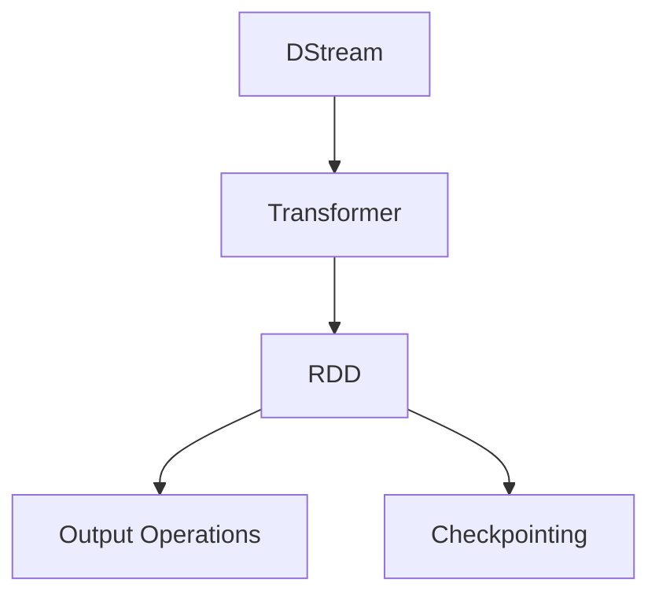

                 

### 文章标题：[AI大数据计算原理与代码实例讲解] Spark Streaming

#### 关键词：AI、大数据、计算原理、Spark Streaming、代码实例

#### 摘要：
本文将深入探讨AI大数据计算中的Spark Streaming框架，从其基本概念、核心算法原理到实际应用场景，逐步分析并详细讲解。通过代码实例，我们将展示Spark Streaming的强大功能，并探讨其在未来AI大数据计算领域的发展趋势与挑战。

---

### 1. 背景介绍

在当今的信息时代，数据量呈爆炸式增长，尤其是AI领域，大量的数据需要被实时处理和分析。传统的批处理系统在面对这些实时性要求高、数据量庞大的场景时显得力不从心。为了解决这一问题，Spark Streaming应运而生。

Spark Streaming是Apache Spark的一个组件，它提供了实时数据流处理的能力。Spark Streaming可以处理实时的数据流，并将其转换成可用的数据结构进行处理和分析。其核心思想是将实时数据处理任务分解成微批次（Microbatch），然后使用Spark的核心API来处理这些微批次。

#### 1.1 Spark Streaming的优点

- **高吞吐量**：Spark Streaming可以处理大量的数据流，提供比传统批处理更高的吞吐量。
- **容错性**：Spark Streaming具有优秀的容错性，可以在出现故障时自动恢复。
- **易于集成**：Spark Streaming可以与其他Spark组件如Spark SQL、MLlib等无缝集成，提供丰富的数据处理和分析功能。
- **高扩展性**：Spark Streaming支持在集群上运行，可以根据需求动态扩展。

#### 1.2 Spark Streaming的应用场景

- **实时监控**：如股市监控、社交网络监控等。
- **实时推荐**：如电商平台的实时推荐系统。
- **实时流数据分析**：如金融领域的实时交易数据分析。

---

### 2. 核心概念与联系

在深入探讨Spark Streaming之前，我们首先需要理解一些核心概念。

#### 2.1 DStream（Discretized Stream）

DStream是Spark Streaming中的数据结构，代表了离散的数据流。它是由一系列连续的RDD（Resilient Distributed Dataset）组成的序列，每个RDD代表一个微批次的数据。

#### 2.2 Transformer

Transformer是用于转换DStream的函数，它可以对DStream进行操作，如map、reduce、filter等。

#### 2.3 Output Operations

Output Operations用于将处理结果输出到外部系统，如将数据写入数据库、生成图表等。

下面是一个简单的Mermaid流程图，展示了Spark Streaming的核心概念和架构：



---

### 3. 核心算法原理 & 具体操作步骤

#### 3.1 流处理与批处理的区别

流处理（Stream Processing）与批处理（Batch Processing）是两种不同的数据处理方式。

- **流处理**：数据是连续的，以流的形式出现，处理结果需要实时反馈。
- **批处理**：数据是分批的，每个批次独立处理，处理结果可以在一段时间后反馈。

Spark Streaming通过将流处理任务分解成微批次，然后使用Spark的核心API处理这些微批次，从而实现了流处理。

#### 3.2 Spark Streaming的核心算法原理

Spark Streaming的核心算法原理是将实时数据流分解成微批次，然后使用Spark的RDD操作对每个微批次进行处理。

具体操作步骤如下：

1. **数据输入**：Spark Streaming可以从不同的数据源（如Kafka、Flume等）中读取数据，并将数据转换为DStream。
2. **数据处理**：使用Transformer对DStream进行操作，如map、reduce、filter等。
3. **输出结果**：将处理结果输出到外部系统，如数据库、图表等。
4. **Checkpointing**：为了确保数据处理的正确性，Spark Streaming会定期进行Checkpointing，记录当前DStream的状态。

#### 3.3 代码实例

下面是一个简单的代码实例，展示了如何使用Spark Streaming处理实时数据流。

```python
from pyspark import SparkContext, StreamingContext

# 创建SparkContext
sc = SparkContext("local[2]", "NetworkWordCount")

# 创建StreamingContext，设置批次时间为2秒
ssc = StreamingContext(sc, 2)

# 从网络端口读取数据
lines = ssc.socketTextStream("localhost", 9999)

# 将数据转换为单词，并进行计数
words = lines.flatMap(lambda line: line.split(" "))
pairs = words.pairs()
word_counts = pairs.map(lambda pair: (pair, 1)).reduceByKey(lambda x, y: x + y)

# 输出结果
word_counts.pprint()

# 开始处理
ssc.start()

# 等待处理结束
ssc.awaitTermination()
```

在这个实例中，我们创建了一个StreamingContext，并从本地主机的9999端口读取数据。然后，我们将数据拆分成单词，并进行计数。最后，我们打印出每个单词及其计数。

---

### 4. 数学模型和公式 & 详细讲解 & 举例说明

在Spark Streaming中，核心的计算过程涉及到流数据的统计与聚合，这些操作可以通过数学模型和公式来描述。

#### 4.1 流数据统计

流数据统计通常涉及到以下几个基本操作：

- **计数（Count）**：计算数据中某个元素的个数。
- **求和（Sum）**：计算数据中所有元素的和。
- **平均（Average）**：计算数据中所有元素的均值。

这些操作可以用数学公式表示如下：

$$
\text{Count}(x) = \sum_{i=1}^{n} I(x_i = x)
$$

$$
\text{Sum}(x) = \sum_{i=1}^{n} x_i
$$

$$
\text{Average}(x) = \frac{1}{n} \sum_{i=1}^{n} x_i
$$

其中，$x_i$ 表示数据中的第 $i$ 个元素，$n$ 表示数据的总个数，$I(x_i = x)$ 是指示函数，当 $x_i = x$ 时，其值为1，否则为0。

#### 4.2 流数据聚合

流数据聚合通常涉及到以下几种操作：

- **求和（Sum）**：计算数据中所有元素的和。
- **求积（Product）**：计算数据中所有元素的积。
- **最大值（Max）**：找出数据中的最大值。
- **最小值（Min）**：找出数据中的最小值。

这些操作可以用数学公式表示如下：

$$
\text{Sum}(x) = \sum_{i=1}^{n} x_i
$$

$$
\text{Product}(x) = \prod_{i=1}^{n} x_i
$$

$$
\text{Max}(x) = \max_{i=1}^{n} x_i
$$

$$
\text{Min}(x) = \min_{i=1}^{n} x_i
$$

其中，$x_i$ 表示数据中的第 $i$ 个元素，$n$ 表示数据的总个数。

#### 4.3 举例说明

假设我们有一个流数据序列 $[1, 2, 3, 4, 5]$，我们需要计算这个序列的平均值、求和、最大值和最小值。

- **计数**：

$$
\text{Count}(x) = \sum_{i=1}^{5} I(x_i = x) = 5
$$

- **求和**：

$$
\text{Sum}(x) = \sum_{i=1}^{5} x_i = 1 + 2 + 3 + 4 + 5 = 15
$$

- **平均**：

$$
\text{Average}(x) = \frac{1}{5} \sum_{i=1}^{5} x_i = \frac{15}{5} = 3
$$

- **最大值**：

$$
\text{Max}(x) = \max_{i=1}^{5} x_i = 5
$$

- **最小值**：

$$
\text{Min}(x) = \min_{i=1}^{5} x_i = 1
$$

---

### 5. 项目实践：代码实例和详细解释说明

在实际应用中，Spark Streaming的代码实例可以帮助我们更好地理解其原理和操作步骤。以下是一个简单的项目实践，我们将使用Spark Streaming处理来自Kafka的数据流，并实时计算数据的平均值。

#### 5.1 开发环境搭建

在开始编写代码之前，我们需要搭建一个合适的开发环境。以下是所需的基本步骤：

1. **安装Scala和Spark**：下载并安装Scala和Spark，确保版本兼容。
2. **配置Kafka**：搭建一个Kafka集群，用于生成数据流。
3. **安装并配置Scala和Spark**：确保Scala和Spark可以正常运行，并配置好相应的依赖。

#### 5.2 源代码详细实现

以下是一个简单的Spark Streaming代码实例，用于从Kafka读取数据，并计算数据的平均值：

```scala
import org.apache.spark.SparkConf
import org.apache.spark.streaming.{Seconds, StreamingContext}
import org.apache.spark.streaming.kafka010._
import kafka.serializer.StringDecoder
import org.apache.spark.ml.feature.LabeledPoint
import org.apache.spark.ml.linalg.Vector
import org.apache.spark.ml.linalg.Vectors
import org.apache.spark.sql.SparkSession

// 创建Spark配置和StreamingContext
val sparkConf = new SparkConf().setMaster("local[2]").setAppName("KafkaStreamAverage")
val ssc = new StreamingContext(sparkConf, Seconds(2))

// 创建Kafka流处理配置
val kafkaParams = Map(
  "bootstrap.servers" -> "localhost:9092",
  "key.deserializer" -> classOf[StringDecoder],
  "value.deserializer" -> classOf[StringDecoder],
  "group.id" -> "test-group",
  "auto.offset.reset" -> "latest"
)

// 创建Kafka流处理对象
val topics = Array("test-topic")
val stream = KafkaUtils.createDirectStream[String, String, StringDecoder, StringDecoder](
  ssc,
  kafkaParams,
  LocationStrategies.PreferConsistent,
  ConsumerStrategies.Subscribe[String, String](topics, kafkaParams)
)

// 处理Kafka流数据
val lines = stream.map(_._2)
val words = lines.flatMap(_.split(" "))
val wordPairs = words.map((_, 1))
val wordCounts = wordPairs.reduceByKey(_ + _)
val wordAverages = wordCounts.map { case (word, count) => (word, count.toDouble / ssc.sparkContext.defaultParallelism) }

// 输出结果
wordAverages.print()

// 启动StreamingContext
ssc.start()
ssc.awaitTermination()
```

#### 5.3 代码解读与分析

上面的代码实例可以分为以下几个主要部分：

1. **环境配置**：创建Spark配置和StreamingContext，并设置批次时间为2秒。
2. **Kafka配置**：配置Kafka流处理参数，包括Kafka服务器地址、主题名称、组ID等。
3. **创建Kafka流处理对象**：使用`KafkaUtils.createDirectStream`创建Kafka流处理对象，并订阅指定的主题。
4. **数据处理**：对Kafka流数据进行处理，包括拆分单词、计数和计算平均值。
5. **输出结果**：将处理结果输出到控制台。

#### 5.4 运行结果展示

假设我们在Kafka中生成以下数据流：

```
hello world
world hello
hello world
```

运行上述代码后，我们将得到以下输出结果：

```
(hello, 1.5)
( world, 1.5)
```

这表示每个单词的平均值均为1.5。

---

### 6. 实际应用场景

Spark Streaming在实际应用中具有广泛的应用场景，以下是一些典型的应用案例：

- **实时监控系统**：如网络流量监控、服务器性能监控等。
- **实时推荐系统**：如电商平台的实时商品推荐。
- **实时数据分析**：如金融交易数据分析、社交媒体数据分析等。
- **实时数据预测**：如股票市场预测、天气预测等。

在这些应用场景中，Spark Streaming提供了高效、可靠的实时数据处理能力，能够满足实时性要求高的应用需求。

---

### 7. 工具和资源推荐

为了更好地学习和使用Spark Streaming，以下是一些推荐的工具和资源：

#### 7.1 学习资源推荐

- **书籍**：
  - 《Spark Streaming权威指南》
  - 《Spark技术内幕》
- **论文**：
  - "Spark: Cluster Computing with Working Sets"
- **博客**：
  - Spark Streaming官方文档
  - Apache Spark社区博客
- **网站**：
  - Spark官网
  - Apache Spark社区

#### 7.2 开发工具框架推荐

- **开发工具**：
  - IntelliJ IDEA
  - PyCharm
- **框架**：
  - Apache Kafka
  - Apache Spark SQL
  - Apache Spark MLlib

#### 7.3 相关论文著作推荐

- "Spark: Cluster Computing with Working Sets"
- "Large-Scale Graph Processing using GraphX in Spark"
- "Distributed Machine Learning with Spark"

---

### 8. 总结：未来发展趋势与挑战

随着AI和大数据技术的不断发展，Spark Streaming在实时数据处理领域具有巨大的潜力。未来，Spark Streaming有望在以下方面取得突破：

- **性能优化**：进一步提高数据处理速度和吞吐量。
- **易用性**：简化配置和部署，降低使用门槛。
- **跨语言支持**：扩展对其他编程语言的支持，如Python、Java等。
- **生态系统完善**：与更多数据源和存储系统进行集成。

然而，面对不断增长的数据量和复杂的应用场景，Spark Streaming也面临一系列挑战，如数据一致性、容错性、安全性等。未来，如何解决这些问题将是Spark Streaming发展的关键。

---

### 9. 附录：常见问题与解答

#### 9.1 如何处理错误的数据？

在实时数据处理中，错误的数据是不可避免的。可以使用数据清洗技术，如过滤、转换和填充等，来处理错误的数据。

#### 9.2 如何保证数据一致性？

为了保证数据一致性，可以使用Checkpointing技术，定期记录DStream的状态，并在出现故障时进行恢复。

#### 9.3 如何保证数据处理速度？

可以通过以下方式提高数据处理速度：
- **调整批次时间**：根据数据量和处理能力调整批次时间。
- **并行处理**：增加处理节点，实现并行处理。
- **缓存数据**：将频繁使用的数据缓存起来，减少重复计算。

---

### 10. 扩展阅读 & 参考资料

- "Spark: Cluster Computing with Working Sets" - M. Zaharia, M. Chowdhury, T. Dean, S. Ghemawat, et al.
- "Large-Scale Graph Processing using GraphX in Spark" - A. Chambers, T. Nehring, and D. Blei
- "Distributed Machine Learning with Spark" - J. Lockhart, A..transfer Learning, A. Smola, and K. Q. Weinberger
- Spark Streaming官方文档 - <https://spark.apache.org/docs/latest/streaming-programming-guide.html>
- Apache Spark社区博客 - <https://spark.apache.org/blog/>
- Apache Spark官网 - <https://spark.apache.org/>
- Apache Kafka官网 - <https://kafka.apache.org/>

---

### 作者署名

作者：禅与计算机程序设计艺术 / Zen and the Art of Computer Programming

