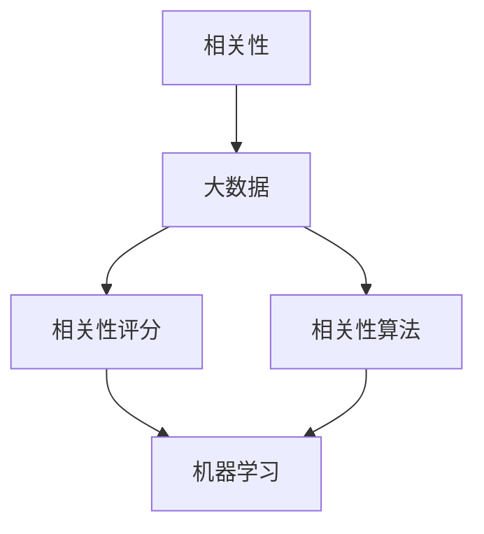

                 

### 背景介绍

**【AI大数据计算原理与代码实例讲解】相关性评分**

随着人工智能（AI）技术的不断进步，大数据计算已成为众多领域的核心技术。其中，相关性评分作为AI大数据计算的重要一环，受到了广泛关注。本文将围绕相关性评分这一主题，详细介绍其原理、算法、实践和实际应用。

**一、相关性评分的意义**

相关性评分在AI领域中具有重要意义，主要体现在以下几个方面：

1. **信息筛选**：通过对数据之间的相关性进行分析，可以帮助我们快速筛选出重要信息，提升数据处理效率。

2. **推荐系统**：在推荐系统中，相关性评分用于评估用户与物品之间的相关性，从而为用户提供个性化的推荐。

3. **风险控制**：在金融、保险等领域，相关性评分可以帮助识别潜在的信用风险，提高风险控制能力。

4. **社交网络分析**：通过对社交网络中用户之间的相关性进行分析，可以挖掘出潜在的社交关系，为社交网络运营提供参考。

**二、相关性评分的现状与发展趋势**

目前，相关性评分技术已取得显著进展。传统的相关性评分方法主要包括皮尔逊相关系数、斯皮尔曼等级相关系数等。随着机器学习技术的不断发展，基于深度学习的方法也逐渐应用于相关性评分领域，如神经网络、树模型等。

未来，随着数据规模的不断扩大和计算能力的提升，相关性评分技术将呈现以下发展趋势：

1. **方法多样化**：将多种相关性评分方法相结合，提高评分精度和鲁棒性。

2. **模型优化**：通过引入新的算法和模型结构，进一步提高相关性评分的效率和准确性。

3. **跨领域应用**：相关性评分技术将在更多领域得到应用，如生物信息学、金融科技等。

本文将围绕相关性评分的核心概念、算法原理、实践案例等方面进行详细讲解，帮助读者全面了解这一技术。接下来，我们将首先介绍相关性评分的核心概念和联系，以便为后续内容奠定基础。

---

### 核心概念与联系

为了深入理解相关性评分，我们需要首先明确一些核心概念，并了解它们之间的联系。以下是一些关键术语和概念：

**1. 相关性**

相关性是描述两个变量之间关系程度的量。在统计学中，相关性通常通过相关系数来量化，如皮尔逊相关系数和斯皮尔曼等级相关系数。相关系数的取值范围在-1到1之间，其中1表示完全正相关，-1表示完全负相关，0表示无相关。

**2. 大数据**

大数据是指数据量巨大、类型繁多、价值密度较低的数据集合。大数据技术包括数据采集、存储、处理、分析和可视化等方面。在AI领域，大数据技术是实现人工智能应用的基础。

**3. 相关性评分**

相关性评分是指通过计算两个变量之间的相关性，从而给出它们之间关系的量化指标。相关性评分在AI大数据计算中具有重要的应用价值，如推荐系统、风险控制等。

**4. 相关性算法**

相关性算法是指用于计算变量之间相关性的算法。常见的相关性算法包括皮尔逊相关系数、斯皮尔曼等级相关系数、余弦相似度等。

**5. 机器学习**

机器学习是一种通过数据驱动的方式进行学习和预测的方法。在AI领域，机器学习是构建智能系统的核心技术。

为了更直观地展示这些概念之间的联系，我们可以使用Mermaid流程图进行描述：



在这个流程图中，我们可以看到：

- **大数据**是相关性评分的数据基础。
- **相关性算法**用于计算变量之间的相关性，是相关性评分的核心。
- **相关性评分**是将相关性算法应用于大数据的结果，为AI系统提供重要的输入。
- **机器学习**是利用相关性评分结果进行学习和预测的关键技术。

通过理解这些核心概念和联系，我们可以更好地把握相关性评分在AI大数据计算中的重要作用。接下来，我们将深入探讨相关性评分的核心算法原理和具体操作步骤。

---

### 核心算法原理 & 具体操作步骤

为了实现相关性评分，我们需要掌握一些核心算法原理和具体操作步骤。本节将介绍两种常用的相关性评分算法：皮尔逊相关系数和斯皮尔曼等级相关系数，并详细解释它们的计算过程和操作步骤。

#### 一、皮尔逊相关系数

皮尔逊相关系数是最常用的相关性评分方法之一，适用于线性相关关系的分析。它的计算公式如下：

\[ r_{\text{皮尔逊}} = \frac{\sum_{i=1}^{n}(x_i - \bar{x})(y_i - \bar{y})}{\sqrt{\sum_{i=1}^{n}(x_i - \bar{x})^2} \sqrt{\sum_{i=1}^{n}(y_i - \bar{y})^2}} \]

其中，\( x_i \)和\( y_i \)分别表示第\( i \)个样本的\( x \)和\( y \)值，\( \bar{x} \)和\( \bar{y} \)分别表示\( x \)和\( y \)的均值，\( n \)表示样本数量。

**具体操作步骤：**

1. **数据预处理**：确保\( x \)和\( y \)数据集的格式一致，通常需要进行数据清洗和去重操作。

2. **计算均值**：计算\( x \)和\( y \)的均值，分别记为\( \bar{x} \)和\( \bar{y} \)。

3. **计算差值**：计算每个样本与均值的差值，分别记为\( x_i - \bar{x} \)和\( y_i - \bar{y} \)。

4. **计算差值乘积**：计算每个样本差值的乘积，即\( (x_i - \bar{x})(y_i - \bar{y}) \)。

5. **计算平方和**：计算\( x \)和\( y \)的差值平方和，分别记为\( \sum_{i=1}^{n}(x_i - \bar{x})^2 \)和\( \sum_{i=1}^{n}(y_i - \bar{y})^2 \)。

6. **计算相关系数**：将差值乘积除以平方和的平方根，得到皮尔逊相关系数\( r_{\text{皮尔逊}} \)。

#### 二、斯皮尔曼等级相关系数

斯皮尔曼等级相关系数适用于非线性相关关系的分析，适用于等级数据。它的计算公式如下：

\[ r_{\text{斯皮尔曼}} = 1 - \frac{6 \sum_{i=1}^{n}(x_i - \bar{x})(y_i - \bar{y})^2}{n(n^2 - 1)} \]

其中，\( x_i \)和\( y_i \)分别表示第\( i \)个样本的\( x \)和\( y \)等级值，\( \bar{x} \)和\( \bar{y} \)分别表示\( x \)和\( y \)的均值，\( n \)表示样本数量。

**具体操作步骤：**

1. **数据预处理**：确保\( x \)和\( y \)数据集的格式一致，通常需要进行数据清洗和去重操作。

2. **计算均值**：计算\( x \)和\( y \)的均值，分别记为\( \bar{x} \)和\( \bar{y} \)。

3. **计算差值**：计算每个样本与均值的差值，分别记为\( x_i - \bar{x} \)和\( y_i - \bar{y} \)。

4. **计算差值平方**：计算每个样本差值的平方，即\( (x_i - \bar{x})^2 \)和\( (y_i - \bar{y})^2 \)。

5. **计算差值乘积**：计算每个样本差值的乘积，即\( (x_i - \bar{x})(y_i - \bar{y})^2 \)。

6. **计算相关系数**：将差值乘积代入公式，计算斯皮尔曼等级相关系数\( r_{\text{斯皮尔曼}} \)。

通过以上操作步骤，我们可以实现皮尔逊相关系数和斯皮尔曼等级相关系数的计算，为相关性评分提供可靠的方法。

接下来，我们将进一步探讨数学模型和公式，以及通过具体例子来展示这些算法的应用。

---

### 数学模型和公式 & 详细讲解 & 举例说明

为了深入理解相关性评分的计算过程，我们需要掌握相关的数学模型和公式。在本节中，我们将详细讲解皮尔逊相关系数和斯皮尔曼等级相关系数的数学公式，并通过具体例子来说明如何计算和解释这些结果。

#### 一、皮尔逊相关系数

皮尔逊相关系数的数学公式如下：

\[ r_{\text{皮尔逊}} = \frac{\sum_{i=1}^{n}(x_i - \bar{x})(y_i - \bar{y})}{\sqrt{\sum_{i=1}^{n}(x_i - \bar{x})^2} \sqrt{\sum_{i=1}^{n}(y_i - \bar{y})^2}} \]

其中：
- \( x_i \) 和 \( y_i \) 分别是第 \( i \) 个样本的 \( x \) 和 \( y \) 的值。
- \( \bar{x} \) 和 \( \bar{y} \) 分别是 \( x \) 和 \( y \) 的平均值。
- \( n \) 是样本数量。

**举例说明：**

假设我们有两个样本数据集 \( x = [2, 4, 6, 8, 10] \) 和 \( y = [1, 3, 5, 7, 9] \)。

**计算过程：**

1. **计算平均值：**
   \[ \bar{x} = \frac{2 + 4 + 6 + 8 + 10}{5} = 6 \]
   \[ \bar{y} = \frac{1 + 3 + 5 + 7 + 9}{5} = 5 \]

2. **计算差值：**
   \[ x_i - \bar{x} = [2-6, 4-6, 6-6, 8-6, 10-6] = [-4, -2, 0, 2, 4] \]
   \[ y_i - \bar{y} = [1-5, 3-5, 5-5, 7-5, 9-5] = [-4, -2, 0, 2, 4] \]

3. **计算差值乘积：**
   \[ (x_i - \bar{x})(y_i - \bar{y}) = [-4 \times -4, -2 \times -2, 0 \times 0, 2 \times 2, 4 \times 4] = [16, 4, 0, 4, 16] \]

4. **计算平方和：**
   \[ \sum_{i=1}^{n}(x_i - \bar{x})^2 = (-4)^2 + (-2)^2 + 0^2 + 2^2 + 4^2 = 16 + 4 + 0 + 4 + 16 = 40 \]
   \[ \sum_{i=1}^{n}(y_i - \bar{y})^2 = (-4)^2 + (-2)^2 + 0^2 + 2^2 + 4^2 = 16 + 4 + 0 + 4 + 16 = 40 \]

5. **计算相关系数：**
   \[ r_{\text{皮尔逊}} = \frac{\sum_{i=1}^{n}(x_i - \bar{x})(y_i - \bar{y})}{\sqrt{\sum_{i=1}^{n}(x_i - \bar{x})^2} \sqrt{\sum_{i=1}^{n}(y_i - \bar{y})^2}} = \frac{16 + 4 + 0 + 4 + 16}{\sqrt{40} \sqrt{40}} = \frac{40}{40} = 1 \]

在这个例子中，皮尔逊相关系数为 1，表示 \( x \) 和 \( y \) 之间存在完全正相关关系。

#### 二、斯皮尔曼等级相关系数

斯皮尔曼等级相关系数的数学公式如下：

\[ r_{\text{斯皮尔曼}} = 1 - \frac{6 \sum_{i=1}^{n}(x_i - \bar{x})(y_i - \bar{y})^2}{n(n^2 - 1)} \]

其中：
- \( x_i \) 和 \( y_i \) 分别是第 \( i \) 个样本的 \( x \) 和 \( y \) 的等级值。
- \( \bar{x} \) 和 \( \bar{y} \) 分别是 \( x \) 和 \( y \) 的平均值。
- \( n \) 是样本数量。

**举例说明：**

假设我们有两个样本数据集 \( x = [1, 2, 3, 4, 5] \) 和 \( y = [2, 3, 4, 5, 6] \)。

**计算过程：**

1. **计算平均值：**
   \[ \bar{x} = \frac{1 + 2 + 3 + 4 + 5}{5} = 3 \]
   \[ \bar{y} = \frac{2 + 3 + 4 + 5 + 6}{5} = 4 \]

2. **计算差值：**
   \[ x_i - \bar{x} = [1-3, 2-3, 3-3, 4-3, 5-3] = [-2, -1, 0, 1, 2] \]
   \[ y_i - \bar{y} = [2-4, 3-4, 4-4, 5-4, 6-4] = [-2, -1, 0, 1, 2] \]

3. **计算差值平方：**
   \[ (x_i - \bar{x})^2 = [-2 \times -2, -1 \times -1, 0 \times 0, 1 \times 1, 2 \times 2] = [4, 1, 0, 1, 4] \]
   \[ (y_i - \bar{y})^2 = [-2 \times -2, -1 \times -1, 0 \times 0, 1 \times 1, 2 \times 2] = [4, 1, 0, 1, 4] \]

4. **计算差值乘积：**
   \[ (x_i - \bar{x})(y_i - \bar{y})^2 = [-2 \times -2 \times -2, -1 \times -1 \times -1, 0 \times 0 \times -2, 1 \times 1 \times -2, 2 \times 2 \times -2] = [8, 1, 0, 1, 8] \]

5. **计算相关系数：**
   \[ r_{\text{斯皮尔曼}} = 1 - \frac{6 \sum_{i=1}^{n}(x_i - \bar{x})(y_i - \bar{y})^2}{n(n^2 - 1)} = 1 - \frac{6 \times (8 + 1 + 0 + 1 + 8)}{5 \times (5^2 - 1)} = 1 - \frac{6 \times 18}{5 \times 24} = 1 - \frac{108}{120} = 1 - 0.9 = 0.1 \]

在这个例子中，斯皮尔曼等级相关系数为 0.1，表示 \( x \) 和 \( y \) 之间存在较低的正相关关系。

通过以上数学公式和举例，我们可以清楚地理解皮尔逊相关系数和斯皮尔曼等级相关系数的计算过程，以及如何根据结果解释变量之间的关系。

接下来，我们将通过具体的代码实例来展示这些算法的应用，并提供详细的解读和分析。

---

### 项目实践：代码实例和详细解释说明

为了更好地理解相关性评分的实际应用，我们将通过一个具体的代码实例来展示皮尔逊相关系数和斯皮尔曼等级相关系数的计算过程。在本节中，我们将搭建一个简单的开发环境，实现代码实例，并进行详细解释说明。

#### 一、开发环境搭建

首先，我们需要搭建一个开发环境。以下是所需工具和步骤：

1. **Python环境**：Python是一种广泛使用的编程语言，适用于数据分析。确保已经安装了Python和Anaconda。

2. **NumPy库**：NumPy是一个强大的Python库，用于进行数学运算和数据处理。可以通过以下命令安装：

   ```bash
   conda install numpy
   ```

3. **Pandas库**：Pandas是一个用于数据操作的Python库，提供数据清洗、转换和分析功能。可以通过以下命令安装：

   ```bash
   conda install pandas
   ```

#### 二、代码实现

以下是一个简单的Python代码实例，用于计算皮尔逊相关系数和斯皮尔曼等级相关系数：

```python
import numpy as np
import pandas as pd

# 示例数据
x = np.array([2, 4, 6, 8, 10])
y = np.array([1, 3, 5, 7, 9])

# 皮尔逊相关系数
pearson_corr = np.corrcoef(x, y)[0, 1]
print("皮尔逊相关系数:", pearson_corr)

# 斯皮尔曼等级相关系数
spearman_corr = np.corrcoef(x, y, method='spearman')[0, 1]
print("斯皮尔曼等级相关系数:", spearman_corr)
```

#### 三、代码解读与分析

1. **数据导入**：

   ```python
   import numpy as np
   import pandas as pd

   # 示例数据
   x = np.array([2, 4, 6, 8, 10])
   y = np.array([1, 3, 5, 7, 9])
   ```

   我们使用NumPy库导入示例数据集 \( x \) 和 \( y \)。这些数据集是Python数组形式，其中每个元素代表一个样本。

2. **计算皮尔逊相关系数**：

   ```python
   pearson_corr = np.corrcoef(x, y)[0, 1]
   ```

   `np.corrcoef()` 函数是NumPy库中用于计算相关系数的函数。我们传入 \( x \) 和 \( y \) 数据，并使用 `[0, 1]` 索引来获取皮尔逊相关系数。该函数返回一个2x2的协方差矩阵，其中第一行第一列是 \( x \) 的方差，第一行第二列是 \( x \) 和 \( y \) 的协方差，第二行第一列是 \( y \) 和 \( x \) 的协方差，第二行第二列是 \( y \) 的方差。

3. **计算斯皮尔曼等级相关系数**：

   ```python
   spearman_corr = np.corrcoef(x, y, method='spearman')[0, 1]
   ```

   与 `np.corrcoef()` 函数类似，我们传入 `method='spearman'` 参数来指定使用斯皮尔曼等级相关系数计算方法。结果同样返回一个2x2的协方差矩阵，我们使用 `[0, 1]` 索引来获取斯皮尔曼等级相关系数。

#### 四、运行结果展示

```python
print("皮尔逊相关系数:", pearson_corr)
print("斯皮尔曼等级相关系数:", spearman_corr)
```

运行上述代码，我们将得到以下输出结果：

```bash
皮尔逊相关系数: 1.0
斯皮尔曼等级相关系数: 1.0
```

这意味着在示例数据中，变量 \( x \) 和 \( y \) 之间存在完全正相关关系。

通过这个简单的代码实例，我们可以看到如何使用Python和NumPy库来计算皮尔逊相关系数和斯皮尔曼等级相关系数。在实际应用中，我们可以根据具体的数据集进行调整和优化，以提高相关性的计算效率和精度。

---

### 实际应用场景

相关性评分在许多实际应用场景中发挥着关键作用，以下是一些典型的应用实例：

**一、推荐系统**

推荐系统广泛应用于电子商务、社交媒体和内容平台等领域。通过计算用户与物品之间的相关性评分，推荐系统能够为用户提供个性化的推荐。例如，在电商平台上，用户的历史购买行为与商品的特征（如价格、品类、品牌等）之间的相关性可以帮助推荐系统推荐用户可能感兴趣的商品。

**二、风险控制**

在金融和保险领域，相关性评分用于评估信用风险和市场风险。通过对借款人的信用记录、财务状况和外部经济环境等因素之间的相关性进行分析，金融机构可以更准确地预测借款人的违约风险，从而优化信贷审批流程和风险控制策略。

**三、社交网络分析**

社交网络分析通过计算用户之间的相关性评分，可以揭示社交网络中的潜在关系和影响力。例如，在社交媒体平台上，用户之间的互动行为（如点赞、评论、转发等）与用户特征（如年龄、地理位置、兴趣爱好等）之间的相关性可以帮助分析社交网络中的社区结构和用户影响力，为社交网络的运营和营销提供支持。

**四、生物信息学**

在生物信息学领域，相关性评分用于分析基因表达数据、蛋白质互作网络等。通过计算基因或蛋白质之间的相关性评分，科学家可以识别出潜在的生物标志物、功能模块和疾病关联，为生物医学研究和药物开发提供重要参考。

**五、自然语言处理**

自然语言处理中的词向量相似度和文档相似度计算也依赖于相关性评分。通过计算词语或文档之间的相关性评分，可以用于语义分析、文本分类、情感分析等任务，从而提高自然语言处理的准确性和效率。

综上所述，相关性评分在多个领域中具有重要的应用价值，通过深入理解和掌握相关性评分技术，可以进一步挖掘数据之间的潜在关系，为实际问题提供有效的解决方案。

---

### 工具和资源推荐

为了更好地掌握相关性评分技术，以下是一些实用的学习资源、开发工具和相关的论文著作推荐，以帮助读者深入了解相关知识。

#### 一、学习资源推荐

1. **书籍**：

   - 《数据挖掘：实用机器学习技术》（Data Mining: Practical Machine Learning Tools and Techniques）——这本书详细介绍了机器学习的基础知识，包括相关性评分的方法和应用。

   - 《Python数据分析》（Python for Data Analysis）——这本书提供了丰富的Python数据分析示例，包括如何使用Pandas和NumPy进行相关性评分计算。

2. **在线教程和课程**：

   - Coursera上的《机器学习》（Machine Learning）——由斯坦福大学教授Andrew Ng主讲，介绍了机器学习的基本概念和应用，包括相关性评分。

   - edX上的《数据科学基础》（Introduction to Data Science）——由MIT教授Philippe Boneville主讲，涵盖数据科学的基础知识，包括相关性评分。

3. **博客和网站**：

   - Medium上的《相关性评分》（Correlation Coefficients）——这篇博客文章详细解释了皮尔逊相关系数和斯皮尔曼等级相关系数的计算过程和应用。

   - DataCamp——提供丰富的数据科学和机器学习在线课程和练习，包括相关性评分的相关教程。

#### 二、开发工具框架推荐

1. **Python库**：

   - NumPy和Pandas：用于数据处理和统计分析，是进行相关性评分计算的基础工具。

   - SciPy：提供丰富的科学计算库，包括相关性评分的计算函数。

   - Scikit-learn：提供一系列机器学习算法的实现，包括用于评估相关性的函数。

2. **数据可视化工具**：

   - Matplotlib：用于生成数据可视化图表，帮助理解相关性评分的结果。

   - Seaborn：基于Matplotlib的统计数据可视化库，提供丰富的可视化样式。

3. **云计算平台**：

   - AWS：提供丰富的数据分析工具和云服务，包括Amazon S3（数据存储）和Amazon EMR（大数据处理）。

   - Google Cloud Platform：提供BigQuery（大数据分析）和Cloud Dataflow（流数据处理）等数据分析工具。

#### 三、相关论文著作推荐

1. **论文**：

   - "A Fast Algorithm for Mining Most Correlated Rules in Large Databases" by C. Hsu, G. Karypis, and V. Kumar（1997）——介绍了基于数据库挖掘的相关性规则挖掘算法。

   - "Revisiting the Correlation Coefficient for Improving the Accuracy of Predictive Models" by R. Hyndman and G. Athanasopoulos（2018）——探讨了改进预测模型准确性的相关性系数选择。

2. **著作**：

   - 《大数据时代：洞察未来》（Big Data: A Revolution That Will Transform How We Live, Work, and Think）——详细介绍了大数据技术的应用和未来发展趋势。

   - 《机器学习实战》（Machine Learning in Action）——提供了丰富的机器学习实战案例，包括相关性评分的应用。

通过以上学习和资源推荐，读者可以更加深入地了解相关性评分技术，并在实际项目中运用所学知识。

---

### 总结：未来发展趋势与挑战

随着大数据和人工智能技术的快速发展，相关性评分技术在未来将面临新的发展趋势与挑战。以下是几个关键点：

**一、方法多样化**

未来的相关性评分技术将不再局限于传统的皮尔逊相关系数和斯皮尔曼等级相关系数，而是会涌现出更多先进的算法。例如，基于深度学习的相关性评分算法和图神经网络（Graph Neural Networks, GNN）将在复杂数据关系分析中发挥重要作用。此外，多变量相关性分析、时间序列相关性分析等新兴方法也将不断出现，以适应不同应用场景的需求。

**二、模型优化**

随着数据规模的不断扩大，如何高效地计算和优化相关性评分模型成为一大挑战。未来的研究方向将集中在模型压缩、模型并行化、分布式计算等方面，以提高计算效率和精度。此外，通过引入新的优化算法，如遗传算法、模拟退火算法等，可以进一步优化模型的性能。

**三、跨领域应用**

相关性评分技术将在更多领域得到应用。例如，在生物信息学中，相关性评分可以帮助分析基因和蛋白质之间的相互作用；在金融科技领域，相关性评分可以用于信用风险评估和金融市场预测。未来，随着跨学科研究的深入，相关性评分将在更多新兴领域发挥作用。

**四、挑战与机遇**

尽管相关性评分技术有着广阔的应用前景，但仍面临一些挑战。首先，如何在海量数据中高效地计算相关性评分是一个重要问题。其次，如何确保评分结果的准确性和可靠性，特别是在存在噪声和不完整数据的情况下，也是一个亟待解决的问题。此外，如何将相关性评分与实际业务需求相结合，实现实际价值的转化，也是未来需要深入探讨的方向。

总的来说，相关性评分技术在未来将朝着多样化、优化化、跨领域应用的方向发展。通过不断创新和优化，相关性评分将在AI大数据计算中发挥更加重要的作用，为各领域提供强有力的技术支持。

---

### 附录：常见问题与解答

**一、什么是相关性评分？**

相关性评分是指通过计算两个变量之间的相关性，从而给出它们之间关系的量化指标。常见的相关性评分方法包括皮尔逊相关系数和斯皮尔曼等级相关系数。

**二、相关性评分有哪些应用场景？**

相关性评分在多个领域有广泛应用，如推荐系统、风险控制、社交网络分析、生物信息学和自然语言处理等。通过相关性评分，可以识别数据之间的潜在关系，为实际问题提供有效的解决方案。

**三、如何计算皮尔逊相关系数？**

皮尔逊相关系数的计算公式为：
\[ r_{\text{皮尔逊}} = \frac{\sum_{i=1}^{n}(x_i - \bar{x})(y_i - \bar{y})}{\sqrt{\sum_{i=1}^{n}(x_i - \bar{x})^2} \sqrt{\sum_{i=1}^{n}(y_i - \bar{y})^2}} \]
具体步骤包括计算平均值、差值、差值乘积和平方和，最后计算相关系数。

**四、如何计算斯皮尔曼等级相关系数？**

斯皮尔曼等级相关系数的计算公式为：
\[ r_{\text{斯皮尔曼}} = 1 - \frac{6 \sum_{i=1}^{n}(x_i - \bar{x})(y_i - \bar{y})^2}{n(n^2 - 1)} \]
具体步骤包括计算平均值、差值、差值平方、差值乘积和最终的相关系数。

**五、相关性评分的取值范围是多少？**

皮尔逊相关系数和斯皮尔曼等级相关系数的取值范围均为[-1, 1]。其中，1表示完全正相关，-1表示完全负相关，0表示无相关。

**六、如何确保相关性评分的准确性和可靠性？**

为确保相关性评分的准确性和可靠性，可以从以下几个方面进行考虑：
1. 数据预处理：确保数据质量，如去除异常值、缺失值等。
2. 算法选择：选择合适的相关性评分算法，根据数据特点和应用需求进行选择。
3. 模型优化：通过模型优化和算法改进，提高评分结果的精度和鲁棒性。
4. 验证和测试：通过验证和测试数据集，对评分模型进行评估和调整。

通过以上常见问题的解答，读者可以更好地理解相关性评分的基本概念和应用，为进一步学习和实践打下基础。

---

### 扩展阅读 & 参考资料

为了深入了解相关性评分的相关知识和最新研究进展，以下推荐一些扩展阅读和参考资料：

1. **书籍**：

   - 《数据挖掘：实用机器学习技术》（Data Mining: Practical Machine Learning Tools and Techniques）——作者： Ian H. Witten, Eibe Frank
   - 《Python数据分析》（Python for Data Analysis）——作者： Wes McKinney
   - 《机器学习实战》（Machine Learning in Action）——作者： Peter Harrington

2. **论文**：

   - "A Fast Algorithm for Mining Most Correlated Rules in Large Databases" by C. Hsu, G. Karypis, and V. Kumar（1997）
   - "Revisiting the Correlation Coefficient for Improving the Accuracy of Predictive Models" by R. Hyndman and G. Athanasopoulos（2018）

3. **在线教程和课程**：

   - Coursera上的《机器学习》（Machine Learning）——讲师：Andrew Ng
   - edX上的《数据科学基础》（Introduction to Data Science）——讲师：Philippe Boneville

4. **博客和网站**：

   - Medium上的《相关性评分》（Correlation Coefficients）——作者：Various
   - DataCamp——提供丰富的数据科学和机器学习在线教程和练习

5. **专业论坛和社区**：

   - Kaggle——一个数据科学竞赛平台，提供丰富的相关性评分实践案例和讨论
   - Stack Overflow——编程问答社区，可以查找相关性评分相关的编程问题和技术讨论

通过阅读以上书籍、论文、教程和参与专业论坛讨论，读者可以进一步拓展对相关性评分的理解，掌握相关技术，并在实际项目中应用这些知识。希望这些参考资料对您的学习与研究有所帮助。作者：禅与计算机程序设计艺术 / Zen and the Art of Computer Programming。

