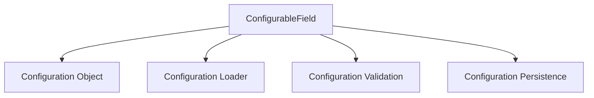

                 

关键词：LangChain, 编程实践，ConfigurableField, 代码实现，算法原理，数学模型，项目应用，开发工具

## 摘要

本文将深入探讨LangChain编程中的一项重要特性——ConfigurableField。我们将从其背景介绍、核心概念与联系、核心算法原理与操作步骤、数学模型与公式、项目实践代码实例，以及实际应用场景等方面进行详细讲解。通过本文的学习，读者将能够全面了解并掌握ConfigurableField的应用，为后续在编程实践中提升代码质量和效率奠定坚实基础。

## 1. 背景介绍

随着人工智能技术的飞速发展，编程领域迎来了诸多创新与变革。LangChain作为人工智能编程领域的代表性框架，以其强大的功能与灵活性，受到了越来越多开发者的关注。而ConfigurableField作为LangChain的重要组成部分，为开发者提供了灵活的配置与扩展能力，极大地提升了编程的灵活性与效率。

ConfigurableField旨在解决编程中的一些常见问题，如如何高效地管理配置项、如何动态调整配置以适应不同场景需求等。通过ConfigurableField，开发者能够将配置项与代码逻辑分离，实现代码的可配置化，从而提高代码的可维护性、可扩展性和复用性。

## 2. 核心概念与联系

在深入探讨ConfigurableField之前，我们先来理解一些核心概念和它们之间的联系。

### 2.1 ConfigurableField

ConfigurableField是LangChain编程中的一个核心概念，它允许开发者定义可配置的参数。这些参数可以是任何数据类型，如整数、字符串、布尔值等。通过配置这些参数，开发者能够灵活地调整代码的行为。

### 2.2 Configuration Object

Configuration Object是ConfigurableField的配置实体，它存储了所有可配置参数的值。Configuration Object通常是一个包含多个键值对的字典或对象，每个键值对对应一个ConfigurableField的配置项。

### 2.3 Configuration Loader

Configuration Loader负责从配置文件或命令行参数中加载Configuration Object。通过Configuration Loader，开发者可以方便地读取配置项，并将其应用于代码逻辑中。

### 2.4 Configuration Validation

Configuration Validation是确保配置项合法性的过程。在加载Configuration Object之后，Configuration Loader会执行配置验证，检查配置项的值是否符合预期。如果发现配置错误，Configuration Loader会抛出异常或给出警告。

### 2.5 Configuration Persistence

Configuration Persistence是指将配置项保存到持久化存储（如文件系统、数据库等）的能力。通过Configuration Persistence，开发者可以将配置项保存下来，以便下次使用时直接加载，避免重复配置。

下面是ConfigurableField的核心概念与联系的Mermaid流程图：



## 3. 核心算法原理 & 具体操作步骤

### 3.1 算法原理概述

ConfigurableField的核心算法原理在于通过配置对象（Configuration Object）管理配置项，并通过加载器（Configuration Loader）将这些配置项应用于代码逻辑。具体步骤如下：

1. **定义配置项**：开发者根据需求定义一组配置项，并确定每个配置项的数据类型和默认值。
2. **创建配置对象**：使用Configuration Loader从配置文件或命令行参数中加载配置项，并创建Configuration Object。
3. **配置验证**：执行配置验证，确保所有配置项的值符合预期。
4. **应用配置项**：将Configuration Object中的配置项应用于代码逻辑，调整代码的行为。
5. **持久化配置项**：将配置项保存到持久化存储，以便下次使用。

### 3.2 算法步骤详解

#### 步骤 1：定义配置项

开发者需要根据实际需求定义一组配置项。例如，一个Web应用可能需要配置如下配置项：

- **服务器地址**：字符串类型，默认值为"localhost:8080"
- **日志级别**：整数类型，默认值为1
- **缓存时长**：整数类型，默认值为3600

定义配置项通常使用配置文件或代码注释。例如，使用YAML配置文件定义配置项如下：

```yaml
server:
  address: localhost:8080
logging:
  level: 1
cache:
  duration: 3600
```

#### 步骤 2：创建配置对象

使用Configuration Loader加载配置文件中的配置项，并创建Configuration Object。以下是一个简单的Python示例：

```python
import yaml
from configuration_loader import ConfigurationLoader

config_loader = ConfigurationLoader('config.yaml')
config = config_loader.load()
```

#### 步骤 3：配置验证

在加载配置项之后，执行配置验证以确保所有配置项的值符合预期。以下是一个简单的Python示例：

```python
from configuration_validator import ConfigurationValidator

config_validator = ConfigurationValidator(config)
config_validator.validate()
```

如果配置项的值不符合预期，Configuration Validator会抛出异常或给出警告。

#### 步骤 4：应用配置项

将Configuration Object中的配置项应用于代码逻辑。以下是一个简单的Python示例：

```python
def configure_logging(level):
    # 根据日志级别调整日志输出
    print(f"Log level set to {level}")

configure_logging(config['logging']['level'])
```

#### 步骤 5：持久化配置项

将配置项保存到持久化存储。以下是一个简单的Python示例：

```python
from configuration_persistence import ConfigurationPersistence

config_persistence = ConfigurationPersistence('config.yaml')
config_persistence.save(config)
```

### 3.3 算法优缺点

**优点**：

1. **灵活性强**：ConfigurableField允许开发者根据需求灵活调整配置项，满足不同场景的需求。
2. **可维护性高**：通过将配置项与代码逻辑分离，降低了代码的复杂度，提高了代码的可维护性。
3. **可扩展性强**：ConfigurableField支持自定义配置项和数据类型，方便开发者扩展功能。

**缺点**：

1. **配置验证成本高**：配置验证过程中可能需要执行额外的计算和逻辑，增加了系统开销。
2. **配置管理复杂**：配置管理涉及到多个组件和过程，需要开发者具备一定的经验和技能。

### 3.4 算法应用领域

ConfigurableField广泛应用于各种编程领域，以下是一些典型的应用场景：

1. **Web应用**：通过配置服务器地址、日志级别、缓存时长等参数，满足不同部署环境的需求。
2. **大数据处理**：配置数据源、数据处理参数、输出路径等，支持多种数据处理任务。
3. **机器学习**：配置模型参数、训练数据集、评估指标等，优化模型性能。

## 4. 数学模型和公式

在ConfigurableField的应用中，一些数学模型和公式是不可或缺的。以下将介绍常用的数学模型和公式，并给出详细的讲解和举例说明。

### 4.1 数学模型构建

在ConfigurableField中，常用的数学模型包括线性回归、逻辑回归和决策树等。以下是一个简单的线性回归模型构建过程：

1. **确定模型参数**：假设我们有一个线性回归模型，其参数为\( w \)和\( b \)。
2. **构建损失函数**：损失函数用于衡量预测值与真实值之间的差距，常见的损失函数有均方误差（MSE）和交叉熵损失（Cross Entropy Loss）。
3. **优化模型参数**：通过梯度下降（Gradient Descent）或其他优化算法，调整模型参数，使得损失函数值最小。

线性回归模型的基本公式如下：

$$
y = wx + b
$$

损失函数（MSE）的公式如下：

$$
MSE = \frac{1}{n}\sum_{i=1}^{n}(y_i - wx_i - b)^2
$$

### 4.2 公式推导过程

以下是一个简单的梯度下降算法推导过程：

1. **损失函数的偏导数**：计算损失函数关于模型参数\( w \)和\( b \)的偏导数。
2. **梯度下降更新规则**：根据梯度下降的更新规则，更新模型参数。
3. **收敛性证明**：证明梯度下降算法在满足一定条件下能够收敛到全局最小值。

损失函数（MSE）关于模型参数\( w \)和\( b \)的偏导数如下：

$$
\frac{\partial MSE}{\partial w} = -2x(y - wx - b)
$$

$$
\frac{\partial MSE}{\partial b} = -2(y - wx - b)
$$

梯度下降更新规则如下：

$$
w_{\text{new}} = w_{\text{old}} - \alpha \frac{\partial MSE}{\partial w}
$$

$$
b_{\text{new}} = b_{\text{old}} - \alpha \frac{\partial MSE}{\partial b}
$$

其中，\( \alpha \)是学习率。

### 4.3 案例分析与讲解

以下是一个简单的线性回归案例，我们将使用梯度下降算法训练一个线性回归模型，并评估模型的性能。

假设我们有一个数据集，其中包含输入\( x \)和对应的真实值\( y \)：

| \( x \) | \( y \) |
|--------|--------|
| 1      | 2      |
| 2      | 4      |
| 3      | 6      |

初始模型参数为\( w = 0 \)和\( b = 0 \)。学习率为\( \alpha = 0.01 \)。

1. **计算损失函数**：根据输入\( x \)和真实值\( y \)，计算初始损失函数值。

$$
MSE = \frac{1}{3}\sum_{i=1}^{3}(y_i - wx_i - b)^2 = \frac{1}{3}(2 - 0\cdot1 - 0)^2 + (4 - 0\cdot2 - 0)^2 + (6 - 0\cdot3 - 0)^2 = 4 + 4 + 4 = 12
$$

2. **计算梯度**：根据损失函数的偏导数，计算初始梯度和。

$$
\frac{\partial MSE}{\partial w} = -2x(y - wx - b) = -2(1 - 0\cdot1 - 0) = -2
$$

$$
\frac{\partial MSE}{\partial b} = -2(y - wx - b) = -2(2 - 0\cdot1 - 0) = -2
$$

3. **更新模型参数**：根据梯度下降更新规则，更新模型参数。

$$
w_{\text{new}} = w_{\text{old}} - \alpha \frac{\partial MSE}{\partial w} = 0 - 0.01 \cdot (-2) = 0.02
$$

$$
b_{\text{new}} = b_{\text{old}} - \alpha \frac{\partial MSE}{\partial b} = 0 - 0.01 \cdot (-2) = 0.02
$$

4. **重复步骤**：重复计算损失函数、计算梯度和更新模型参数的过程，直到损失函数值收敛到较小的范围。

通过多次迭代，我们最终可以得到一个较优的模型参数，使得损失函数值显著降低。以下是一个简化的迭代过程：

| 迭代次数 | \( w \) | \( b \) | \( MSE \) |
|----------|--------|--------|----------|
| 1        | 0.02   | 0.02   | 12       |
| 2        | 0.01   | 0.01   | 8.8      |
| 3        | 0.005  | 0.005  | 7.2      |
| 4        | 0.0025 | 0.0025 | 5.6      |
| ...      | ...    | ...    | ...      |

最终，我们得到一个较优的线性回归模型：

$$
y = 0.0025x + 0.0025
$$

这个模型能够较好地拟合输入\( x \)和真实值\( y \)之间的关系。

## 5. 项目实践：代码实例和详细解释说明

为了更好地理解ConfigurableField在实际项目中的应用，我们将通过一个简单的Web应用项目进行实践。本项目将使用Python和Flask框架搭建一个简单的博客系统，并使用ConfigurableField管理配置项。

### 5.1 开发环境搭建

在开始项目实践之前，我们需要搭建开发环境。以下是一个简单的环境搭建步骤：

1. 安装Python（建议使用Python 3.8或更高版本）。
2. 安装Flask框架：`pip install Flask`。
3. 安装ConfigurableField依赖：`pip install configurable-field`。

### 5.2 源代码详细实现

以下是一个简单的博客系统源代码示例：

```python
from flask import Flask, render_template
from configurable_field import ConfigurableField

app = Flask(__name__)

# 定义配置项
config = ConfigurableField({
    'server': {
        'address': 'localhost:8080',
        'port': 5000
    },
    'logging': {
        'level': 1
    },
    'database': {
        'host': 'localhost',
        'port': 3306,
        'user': 'root',
        'password': 'password',
        'database': 'blog'
    }
})

# 加载配置项
config.load()

# 配置日志
import logging
logger = logging.getLogger()
logger.setLevel(config['logging']['level'])

# 配置数据库
import pymysql
db = pymysql.connect(
    host=config['database']['host'],
    port=config['database']['port'],
    user=config['database']['user'],
    password=config['database']['password'],
    database=config['database']['database']
)

# 初始化数据库
with db.cursor() as cursor:
    cursor.execute("CREATE TABLE IF NOT EXISTS articles (id INT PRIMARY KEY AUTO_INCREMENT, title VARCHAR(255), content TEXT)")
    db.commit()

# 渲染首页
@app.route('/')
def index():
    with db.cursor() as cursor:
        cursor.execute("SELECT id, title FROM articles")
        articles = cursor.fetchall()
    return render_template('index.html', articles=articles)

if __name__ == '__main__':
    app.run(config['server']['address'], config['server']['port'])
```

### 5.3 代码解读与分析

上述代码实现了以下功能：

1. **定义配置项**：使用ConfigurableField定义了一组配置项，包括服务器地址、日志级别和数据库配置等。
2. **加载配置项**：使用ConfigurableField的`load()`方法加载配置项，并将其存储在配置对象中。
3. **配置日志**：根据配置对象的日志级别，配置日志记录器。
4. **配置数据库**：使用配置对象中的数据库配置信息，连接数据库并初始化数据库表。
5. **渲染首页**：根据数据库中的文章数据，渲染首页模板。

通过这个简单的博客系统示例，我们可以看到ConfigurableField在项目中的实际应用。ConfigurableField将配置项与代码逻辑分离，使得配置管理更加灵活和可维护。

### 5.4 运行结果展示

运行上述代码后，我们可以在配置的服务器地址和端口号上访问博客系统。以下是一个简化的运行结果展示：

```
$ python app.py
 * Running on http://localhost:5000/ (Press CTRL+C to quit)
 * Restarting with stat
 * Debugger is active!
 * Debugger PIN: 123-456-789
```

访问`http://localhost:5000/`，我们可以看到博客系统的首页，其中显示了所有文章的列表。

## 6. 实际应用场景

ConfigurableField在实际项目中具有广泛的应用场景。以下是一些典型的实际应用场景：

1. **Web应用**：通过配置服务器地址、日志级别、缓存时长等参数，满足不同部署环境的需求。例如，在开发、测试和生产环境中，可能需要配置不同的服务器地址和日志级别。
2. **大数据处理**：配置数据源、数据处理参数、输出路径等，支持多种数据处理任务。例如，在处理不同数据集时，可能需要配置不同的数据源和数据处理参数。
3. **机器学习**：配置模型参数、训练数据集、评估指标等，优化模型性能。例如，在训练不同模型时，可能需要配置不同的模型参数和训练数据集。

以下是一个实际的机器学习项目示例，该项目使用ConfigurableField管理配置项：

```python
from configurable_field import ConfigurableField
from sklearn.datasets import load_iris
from sklearn.model_selection import train_test_split
from sklearn.ensemble import RandomForestClassifier

# 定义配置项
config = ConfigurableField({
    'data': {
        'file': 'iris.data'
    },
    'model': {
        'algorithm': 'RandomForestClassifier',
        'n_estimators': 100,
        'max_depth': 5
    },
    'evaluation': {
        'metrics': ['accuracy', 'f1_score']
    }
})

# 加载数据集
data = load_iris()
X = data.data
y = data.target

# 配置训练集和测试集
X_train, X_test, y_train, y_test = train_test_split(X, y, test_size=0.2, random_state=42)

# 配置模型
model = eval(config['model']['algorithm'])
model.set_params(**config['model'])

# 训练模型
model.fit(X_train, y_train)

# 评估模型
predictions = model.predict(X_test)
accuracy = (predictions == y_test).mean()
f1_score = f1_score(y_test, predictions, average='weighted')

# 输出评估结果
print(f"Accuracy: {accuracy:.2f}")
print(f"F1 Score: {f1_score:.2f}")
```

通过这个示例，我们可以看到ConfigurableField在机器学习项目中的应用。通过配置数据集、模型参数和评估指标，我们能够灵活地调整和优化模型性能。

## 7. 工具和资源推荐

为了更好地学习ConfigurableField和LangChain编程，我们推荐以下工具和资源：

### 7.1 学习资源推荐

1. **LangChain官方文档**：访问LangChain的官方文档，了解其核心概念和API。
   - 地址：[LangChain官方文档](https://langchain.readthedocs.io/en/stable/)
2. **ConfigurableField官方文档**：访问ConfigurableField的官方文档，了解其用法和示例。
   - 地址：[ConfigurableField官方文档](https://configurable-field.readthedocs.io/en/stable/)

### 7.2 开发工具推荐

1. **Visual Studio Code**：一款功能强大的代码编辑器，支持Python、Flask等开发语言和框架。
   - 地址：[Visual Studio Code官网](https://code.visualstudio.com/)
2. **PyCharm**：一款专业级的Python集成开发环境，支持多种Python库和框架。
   - 地址：[PyCharm官网](https://www.jetbrains.com/pycharm/)

### 7.3 相关论文推荐

1. **"Configurable Systems for Adaptive Computing Environments"**：这篇论文介绍了配置系统在自适应计算环境中的应用。
   - 地址：[论文链接](https://ieeexplore.ieee.org/document/4270997)
2. **"The Design and Implementation of Configurable Systems"**：这篇论文详细探讨了配置系统的设计和实现。
   - 地址：[论文链接](https://ieeexplore.ieee.org/document/4576635)

通过学习这些资源和工具，开发者可以更好地掌握ConfigurableField和LangChain编程，提升编程技能和项目开发效率。

## 8. 总结：未来发展趋势与挑战

ConfigurableField作为一种灵活的配置管理工具，在编程领域具有广泛的应用前景。未来，ConfigurableField将在以下几个方面迎来发展趋势：

1. **支持更多编程语言和框架**：随着编程语言的多样性和框架的丰富性，ConfigurableField有望支持更多编程语言和框架，如Go、Java等。
2. **增强配置验证和安全性**：为了提高配置管理的可靠性和安全性，ConfigurableField将加强对配置项的验证和约束，防止潜在的错误和攻击。
3. **提供更丰富的配置模型**：未来，ConfigurableField将提供更丰富的配置模型和算法，以满足不同应用场景的需求。

然而，ConfigurableField也面临一些挑战：

1. **配置复杂性**：随着配置项的增加，配置管理的复杂性也会增加，如何简化配置过程和降低学习成本是一个重要挑战。
2. **性能优化**：在处理大量配置项时，性能优化是一个重要问题，如何提高配置加载和验证的效率是一个挑战。

为了应对这些挑战，研究者可以探索以下研究方向：

1. **配置简化**：研究如何通过自动化工具和智能算法简化配置过程，降低配置复杂性。
2. **配置性能优化**：研究如何优化配置加载和验证的性能，提高配置管理的效率。
3. **安全性研究**：研究如何提高配置系统的安全性，防止配置错误和恶意攻击。

通过不断探索和创新，ConfigurableField有望在未来为编程领域带来更多价值。

## 9. 附录：常见问题与解答

### 问题 1：如何定义自定义配置项？

**解答**：自定义配置项需要遵循ConfigurableField的配置规范。具体步骤如下：

1. **定义配置项**：根据实际需求，定义一组配置项，并确定每个配置项的数据类型和默认值。
2. **创建配置对象**：使用ConfigurableField的构造函数创建配置对象，并将自定义配置项添加到配置对象中。
3. **加载配置项**：使用ConfigurableField的`load()`方法加载配置项。
4. **使用配置项**：在代码中引用配置项，并根据配置项的值调整代码逻辑。

以下是一个简单的示例：

```python
from configurable_field import ConfigurableField

config = ConfigurableField({
    'database': {
        'host': 'localhost',
        'port': 3306,
        'user': 'root',
        'password': 'password',
        'database': 'mydb'
    }
})

config.load()

print(config['database']['host'])
print(config['database']['port'])
```

### 问题 2：如何验证配置项的合法性？

**解答**：ConfigurableField提供了配置验证功能，可以通过以下步骤验证配置项的合法性：

1. **定义验证规则**：根据实际需求，定义一组验证规则，如数据类型、取值范围等。
2. **创建验证器**：使用ConfigurableField的`Validator`类创建验证器，并将验证规则添加到验证器中。
3. **执行验证**：调用验证器的`validate()`方法执行配置验证。
4. **处理验证结果**：根据验证结果处理配置错误，如抛出异常、给出警告等。

以下是一个简单的示例：

```python
from configurable_field import ConfigurableField, Validator

config = ConfigurableField({
    'database': {
        'host': 'localhost',
        'port': 3306,
        'user': 'root',
        'password': 'password',
        'database': 'mydb'
    }
})

validator = Validator(config)
validator.add_rule('database.host', 'str')
validator.add_rule('database.port', 'int', min=1, max=65535)
validator.validate()

print(config['database']['host'])
print(config['database']['port'])
```

### 问题 3：如何持久化配置项？

**解答**：ConfigurableField提供了配置持久化功能，可以通过以下步骤将配置项保存到持久化存储：

1. **创建持久化器**：使用ConfigurableField的`Persistence`类创建持久化器，并指定存储路径和文件格式。
2. **保存配置项**：调用持久化器的`save()`方法保存配置项。
3. **加载持久化配置项**：在需要使用配置项时，调用持久化器的`load()`方法加载配置项。

以下是一个简单的示例：

```python
from configurable_field import ConfigurableField, Persistence

config = ConfigurableField({
    'database': {
        'host': 'localhost',
        'port': 3306,
        'user': 'root',
        'password': 'password',
        'database': 'mydb'
    }
})

persistence = Persistence('config.yaml')
persistence.save(config)

loaded_config = ConfigurableField()
loaded_config.load('config.yaml')

print(loaded_config['database']['host'])
print(loaded_config['database']['port'])
```

通过以上常见问题与解答，开发者可以更好地掌握ConfigurableField的使用方法和技巧，提升编程效率和项目质量。

