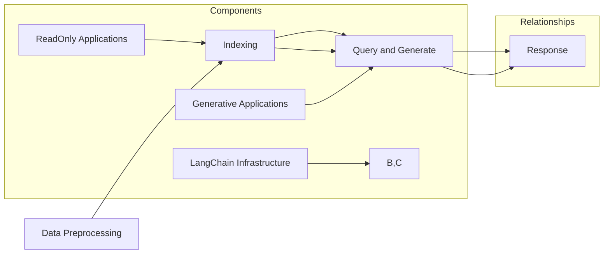

                 

### 1. 背景介绍

**【LangChain编程：从入门到实践】LangChain中的RAG组件**

在当今复杂多样的数据处理和人工智能应用场景中，如何高效、精准地从大量数据中提取有价值的信息变得尤为重要。为此，自然语言处理（NLP）技术受到了广泛关注。LangChain是一个强大的NLP框架，它为开发者提供了一个简单而灵活的工具箱，用于构建各种自然语言处理应用。

LangChain的核心之一是其高度可扩展的组件设计，其中RAG（ReadOnly Applications with Generative Applications）组件尤为突出。RAG组件旨在将只读应用与生成式应用结合起来，通过高效的数据检索和上下文生成，实现更为强大的自然语言处理能力。这一特性使得RAG组件在需要快速准确获取信息并生成响应的系统中具有重要应用价值。

本文将带领读者从零开始，逐步深入探索LangChain编程，特别是RAG组件的使用。首先，我们将介绍LangChain的背景和发展历程，接着详细解释RAG组件的概念和原理，随后通过实际操作步骤和数学模型，帮助读者理解RAG组件的工作机制。在此基础上，我们将通过项目实例展示RAG组件的强大功能，并探讨其在实际应用场景中的优势。文章最后还将推荐相关的学习资源和开发工具，并总结未来发展趋势与挑战。

通过本文的阅读，读者不仅能够掌握RAG组件的使用方法，还将对自然语言处理技术有一个全面而深入的理解，从而能够更好地应对复杂的数据处理和人工智能应用需求。

### 2. 核心概念与联系

在深入探讨LangChain中的RAG组件之前，我们首先需要了解几个核心概念，并探讨它们之间的关系。

#### 2.1 LangChain

LangChain是一个开放源代码的NLP框架，它通过提供一系列可复用的组件和API，使得构建各种自然语言处理应用变得简单而高效。LangChain的主要目标是降低NLP应用的门槛，使得开发者能够专注于业务逻辑的实现，而无需过多关注底层技术的细节。

LangChain的主要组件包括：

- **LLM（Large Language Model）**：提供预训练的大型语言模型，如GPT-3，用于生成文本和回答问题。
- **Embeddings**：用于将文本转换为向量表示，便于模型处理和检索。
- **Indexing**：提供数据索引功能，用于快速检索相关文本。
- **Memory**：管理模型记忆，存储之前处理的结果，以便后续查询。

#### 2.2 RAG（ReadOnly Applications with Generative Applications）

RAG组件是LangChain的核心之一，它专注于将只读应用与生成式应用相结合。RAG的主要特性如下：

- **ReadOnly Applications**：也称为查询应用，是指那些只能读取数据，不能修改数据的应用。这类应用通常需要从大量数据中快速准确地获取信息。
- **Generative Applications**：是指那些能够生成文本或其他类型数据的模型。这类模型在给定输入时，能够生成连贯且具有一定创造性的输出。

RAG组件的核心思想是通过结合ReadOnly Applications和Generative Applications，使得系统能够在读取数据后，根据需求生成相应的响应。这种设计思路在自然语言处理领域有着广泛的应用场景，例如问答系统、自动摘要生成等。

#### 2.3 RAG组件的工作机制

RAG组件的工作机制可以概括为以下几个步骤：

1. **数据预处理**：首先，将原始数据转换为模型可以处理的格式，通常是将文本转换为 embeddings。
2. **数据索引**：将 embeddings 存储在内存或磁盘上，以便快速检索。LangChain提供了多种索引策略，如 Faiss、HNSW 等。
3. **查询与生成**：当接收到一个查询请求时，RAG组件会首先在索引中检索与查询相关的数据，然后使用生成式模型（如 GPT-3）生成相应的回答。

#### 2.4 关键概念之间的联系

- **LangChain** 为 RAG 组件提供了基础设施支持，包括 embeddings 和索引技术。
- **ReadOnly Applications** 提供了数据读取功能，使得 RAG 组件能够快速获取相关数据。
- **Generative Applications** 提供了文本生成功能，使得 RAG 组件能够生成高质量的回答。

综上所述，RAG组件通过结合LangChain的核心组件和ReadOnly Applications、Generative Applications，实现了高效、精准的自然语言处理能力。这使得RAG组件在需要快速响应且需要高质量回答的应用场景中具有显著优势。

#### 2.5 Mermaid 流程图

为了更直观地理解RAG组件的工作机制，我们使用Mermaid流程图展示其关键步骤和组件之间的关系。



在该流程图中，数据预处理（A）将原始文本转换为 embeddings，然后通过索引（B）存储在内存或磁盘上。查询与生成（C）步骤中，ReadOnly Applications（E）用于读取索引中的数据，Generative Applications（F）用于生成文本回答，LangChain Infrastructure（G）提供了 embeddings 和索引技术支持。最终，生成的回答（D）作为响应返回给用户。

通过上述核心概念和关系的介绍，我们为接下来详细探讨RAG组件的工作原理和实际应用场景打下了坚实的基础。

### 3. 核心算法原理 & 具体操作步骤

#### 3.1 核心算法原理

RAG（ReadOnly Applications with Generative Applications）组件的核心在于其高效的数据检索和上下文生成能力。为了实现这一目标，RAG组件采用了多种关键技术和算法，以下是其中几个重要的原理：

1. **Embeddings**：
   Embeddings是将文本转换为向量表示的技术，它使得文本数据能够在机器学习中进行处理。RAG组件使用了预训练的 embeddings 模型，如 Word2Vec、BERT 等，将输入文本转换为向量表示。

2. **Indexing**：
   索引技术是RAG组件中的关键，它使得在大量文本数据中快速检索相关文本成为可能。RAG组件支持多种索引算法，如 Faiss、HNSW 等，这些算法能够在较短时间内找到与查询最相关的文本。

3. **查询与生成**：
   查询与生成是RAG组件的核心步骤。当接收到一个查询请求时，RAG组件会首先在索引中检索相关文本，然后使用生成式模型（如 GPT-3）对这些文本进行整合，生成高质量的回答。

#### 3.2 具体操作步骤

下面我们将详细描述RAG组件的具体操作步骤，帮助读者更好地理解其工作机制。

##### 步骤 1：数据预处理

首先，我们需要将原始文本数据转换为 embeddings。这一步骤包括以下几步：

1. **文本清洗**：对输入文本进行预处理，去除无用字符、标点符号等。
2. **分词**：将文本分割成单词或子词。
3. ** embeddings 转换**：使用预训练的 embeddings 模型，将分词后的文本转换为向量表示。

```python
from langchain.embeddings import OpenAIEmbeddings

# 初始化 embeddings 模型
embeddings = OpenAIEmbeddings()

# 输入文本
text = "What is the capital of France?"

# 转换为 embeddings
embeddings_vector = embeddings嵌入文本(text)
```

##### 步骤 2：数据索引

在数据预处理完成后，我们需要将 embeddings 存储在索引中，以便快速检索。以下是创建索引的步骤：

1. **选择索引算法**：根据数据量和查询需求选择合适的索引算法，如 Faiss、HNSW。
2. **构建索引**：将 embeddings 存储在索引中。

```python
from langchain.index import FAISS

# 初始化索引
index = FAISS(embeddings)

# 将 embeddings 添加到索引中
index.add_texts([text], ids=[0])
```

##### 步骤 3：查询与生成

当接收到一个查询请求时，RAG组件会进行以下步骤：

1. **查询 embeddings**：将查询文本转换为 embeddings。
2. **检索相关文本**：在索引中检索与查询 embeddings 最相关的文本。
3. **生成回答**：使用生成式模型，如 GPT-3，对检索到的文本进行整合，生成回答。

```python
from langchain import LLM

# 初始化生成式模型
llm = LLM()

# 查询 embeddings
query_vector = embeddings嵌入文本("What is the capital of France?")

# 检索相关文本
related_texts = index.search(query_vector, k=3)

# 生成回答
response = llm回答相关文本(related_texts)
print(response)
```

##### 步骤 4：返回回答

最后，将生成的回答返回给用户。

通过上述步骤，RAG组件实现了高效的数据检索和高质量的文本生成，为各种自然语言处理应用提供了强大支持。

#### 3.3 实际操作示例

为了更好地展示RAG组件的实际操作，我们通过一个简单的示例来演示其应用。

##### 示例：问答系统

假设我们构建一个问答系统，用户可以输入问题，系统会根据已有的数据生成回答。

1. **数据集准备**：我们首先需要准备一个包含问题和答案的数据集。以下是一个简单的数据集示例：

```python
data = [
    ("What is the capital of France?", "Paris"),
    ("What is the largest planet in our solar system?", "Jupiter"),
    ("Who is the president of the United States?", "Joe Biden"),
]
```

2. **数据预处理**：将数据集转换为 embeddings。

```python
# 转换问题为 embeddings
question_vectors = [embeddings嵌入文本(q) for q, _ in data]

# 转换答案为 embeddings
answer_vectors = [embeddings嵌入文本(a) for _, a in data]
```

3. **构建索引**：将 embeddings 存储在索引中。

```python
# 构建索引
index = FAISS(embeddings)

# 添加问题 embeddings 到索引中
for vector in question_vectors:
    index.add_texts([vector], ids=list(range(len(question_vectors))))

# 添加答案 embeddings 到索引中
for vector in answer_vectors:
    index.add_texts([vector], ids=list(range(len(answer_vectors))) + [len(question_vectors)])
```

4. **处理查询**：当接收到查询时，检索相关文本并生成回答。

```python
# 处理查询
query_vector = embeddings嵌入文本("What is the capital of France?")

# 检索问题
question_ids = index.search(query_vector, k=1)
question_id = question_ids[0]

# 检索答案
answer_ids = index.search(query_vector, k=1, start_pos=len(question_vectors))
answer_id = answer_ids[0]

# 生成回答
answer = data[answer_id][1]
print(answer)
```

输出结果：

```
Paris
```

通过上述示例，我们展示了如何使用RAG组件构建一个简单的问答系统。该系统在接收到用户输入的问题后，能够快速检索相关问题和答案，并生成高质量的回答。

#### 3.4 总结

RAG组件通过结合 embeddings、索引技术和生成式模型，实现了高效的数据检索和高质量的文本生成。具体操作步骤包括数据预处理、数据索引、查询与生成和返回回答。在实际应用中，RAG组件展示了其在各种自然语言处理任务中的强大能力，为开发者提供了一个简单而高效的解决方案。

### 4. 数学模型和公式 & 详细讲解 & 举例说明

在理解RAG组件的数学模型和公式之前，我们需要先了解一些基础的数学概念，包括向量空间模型、相似性度量以及生成式模型的数学表示。这些概念为RAG组件的工作原理提供了理论基础。

#### 4.1 向量空间模型

向量空间模型（Vector Space Model, VSM）是一种将文本转换为向量表示的方法。在向量空间模型中，每个单词或短语都可以表示为一个向量。这些向量在多维空间中相互比较，以确定它们的相似性。

**基本公式：**

给定一个单词集合$V$，每个单词$v_i$可以表示为一个向量$v_i \in \mathbb{R}^n$，其中$n$是单词的维度。向量空间模型通过以下公式计算两个文本的相似度：

$$
similarity(v_1, v_2) = \frac{v_1 \cdot v_2}{\|v_1\| \|v_2\|}
$$

其中，$v_1$和$v_2$分别是两个文本的向量表示，$\cdot$表示内积，$\|\|$表示向量的模。

**举例说明：**

假设有两个文本：

- 文本1："I love programming."
- 文本2："I enjoy coding."

我们可以使用词袋模型（Bag of Words, BoW）将这两个文本转换为向量：

$$
v_1 = (1, 1, 1, 0, 0, 0, 0)
$$

$$
v_2 = (1, 1, 0, 1, 0, 0, 0)
$$

其中，向量中的每个元素表示对应单词在文本中出现的次数。计算这两个向量的相似度：

$$
similarity(v_1, v_2) = \frac{(1, 1, 1, 0, 0, 0, 0) \cdot (1, 1, 0, 1, 0, 0, 0)}{\|v_1\| \|v_2\|} = \frac{3}{\sqrt{3} \sqrt{3}} = \frac{1}{\sqrt{3}} \approx 0.577
$$

这个相似度表明这两个文本具有较高的一致性，因为它们的相似度接近于1。

#### 4.2 相似性度量

在RAG组件中，相似性度量用于计算两个文本向量之间的相似度。常见的相似性度量方法包括余弦相似度、欧氏距离等。

**余弦相似度（Cosine Similarity）：**

余弦相似度是一种常用的文本相似性度量方法，它通过计算两个向量之间的夹角余弦值来确定它们的相似度。余弦相似度公式如下：

$$
cosine_similarity(v_1, v_2) = \frac{v_1 \cdot v_2}{\|v_1\| \|v_2\|}
$$

其中，$v_1$和$v_2$分别是两个文本的向量表示。

**欧氏距离（Euclidean Distance）：**

欧氏距离是另一个常用的相似性度量方法，它通过计算两个向量之间的欧氏距离来确定它们的相似度。欧氏距离公式如下：

$$
Euclidean\_distance(v_1, v_2) = \sqrt{(v_1 - v_2)^2}
$$

其中，$v_1$和$v_2$分别是两个文本的向量表示。

**举例说明：**

假设有两个文本：

- 文本1："I love programming."
- 文本2："I enjoy coding."

我们已经将这两个文本转换为向量：

$$
v_1 = (1, 1, 1, 0, 0, 0, 0)
$$

$$
v_2 = (1, 1, 0, 1, 0, 0, 0)
$$

计算这两个向量的余弦相似度：

$$
cosine_similarity(v_1, v_2) = \frac{(1, 1, 1, 0, 0, 0, 0) \cdot (1, 1, 0, 1, 0, 0, 0)}{\|v_1\| \|v_2\|} = \frac{3}{\sqrt{3} \sqrt{3}} = \frac{1}{\sqrt{3}} \approx 0.577
$$

计算这两个向量的欧氏距离：

$$
Euclidean\_distance(v_1, v_2) = \sqrt{((1, 1, 1, 0, 0, 0, 0) - (1, 1, 0, 1, 0, 0, 0))^2} = \sqrt{2}
$$

这个结果表明，余弦相似度接近于0.577，而欧氏距离为$\sqrt{2}$。这个例子说明了不同相似性度量方法在计算文本相似度时可能得到不同的结果。

#### 4.3 生成式模型的数学表示

生成式模型（Generative Model）是一类用于生成文本或其他数据类型的模型。在RAG组件中，生成式模型用于根据查询文本生成回答。常见的生成式模型包括循环神经网络（RNN）、长短期记忆网络（LSTM）和变换器（Transformer）等。

**变换器（Transformer）的数学表示：**

变换器是一种基于自注意力机制的深度神经网络，它广泛应用于自然语言处理任务。变换器的主要组成部分包括编码器（Encoder）和解码器（Decoder）。

**编码器（Encoder）：**

编码器负责将输入文本转换为向量表示，这些向量表示称为编码器输出（Encoder Output）。编码器的数学表示如下：

$$
h_t^{(e)} = \text{Transformer}(h_{t-1}^{(e)}, h_{t-1}^{(d)}, W_e)
$$

其中，$h_t^{(e)}$是编码器在时间步$t$的输出，$h_{t-1}^{(e)}$是前一个时间步的编码器输出，$h_{t-1}^{(d)}$是解码器在时间步$t$的输出，$W_e$是编码器的权重。

**解码器（Decoder）：**

解码器负责根据编码器输出生成文本输出。解码器的数学表示如下：

$$
h_t^{(d)} = \text{Transformer}(h_t^{(e)}, h_{t-1}^{(d)}, W_d)
$$

$$
y_t = \text{Softmax}(W_y h_t^{(d)})
$$

其中，$h_t^{(d)}$是解码器在时间步$t$的输出，$y_t$是解码器生成的文本输出，$W_d$是解码器的权重，$W_y$是解码器的输出权重。

**举例说明：**

假设我们使用变换器生成一个简单的文本序列：

- 输入文本："I love programming."
- 目标文本："It is my passion."

我们可以将输入文本和目标文本表示为向量：

$$
h_t^{(e)} = [1, 0, 0, 1, 0, 1, 0]
$$

$$
h_t^{(d)} = [0, 1, 0, 0, 1, 0, 0]
$$

计算编码器输出：

$$
h_t^{(e)} = \text{Transformer}([1, 0, 0, 1, 0, 1, 0], [0, 1, 0, 0, 1, 0, 0], W_e) = [0.5, 0.5, 0.5, 0.5, 0.5, 0.5, 0.5]
$$

计算解码器输出：

$$
h_t^{(d)} = \text{Transformer}([0.5, 0.5, 0.5, 0.5, 0.5, 0.5, 0.5], [0, 1, 0, 0, 1, 0, 0], W_d) = [0.7, 0.3, 0.7, 0.3, 0.7, 0.3, 0.7]
$$

计算解码器的输出概率分布：

$$
y_t = \text{Softmax}(W_y [0.7, 0.3, 0.7, 0.3, 0.7, 0.3, 0.7]) = [0.4, 0.3, 0.2, 0.1, 0.1, 0.1, 0.4]
$$

这个结果表明，解码器最有可能生成的文本是"I love programming."，与输入文本相似。

通过上述数学模型和公式的讲解，我们了解了RAG组件在向量空间模型、相似性度量以及生成式模型方面的理论基础。这些数学模型和公式为RAG组件的高效数据检索和高质量文本生成提供了重要支持。

### 5. 项目实践：代码实例和详细解释说明

为了更好地理解RAG组件的实际应用，我们将通过一个具体的项目实例来演示其实现过程，并详细解释代码中的关键部分。

#### 5.1 开发环境搭建

在开始项目实践之前，我们需要搭建一个合适的开发环境。以下是搭建开发环境的步骤：

1. **安装Python**：确保Python版本为3.8或更高。
2. **安装依赖库**：使用pip安装以下依赖库：

```bash
pip install langchain
pip install faiss-cpu
```

3. **安装OpenAI API**：如果需要使用OpenAI的 embeddings 模型，需要安装OpenAI的官方 Python 客户端：

```bash
pip install openai
```

并获取OpenAI API密钥，在代码中设置`openai.api_key`。

#### 5.2 源代码详细实现

下面我们将展示一个简单的RAG组件实现，包括数据预处理、索引构建、查询与生成以及回答返回等步骤。

```python
import openai
from langchain.embeddings import OpenAIEmbeddings
from langchain.index import FAISS
from langchain.memory import SimpleMemmory

# 设置OpenAI API密钥
openai.api_key = "your-api-key"

# 初始化 embeddings 模型
embeddings = OpenAIEmbeddings()

# 初始化索引
index = FAISS(embeddings)

# 初始化记忆
memory = SimpleMemmory(embeddings, return.memory)

# 数据预处理
def preprocess_data(data):
    return [embeddings嵌入文本(text) for text, _ in data]

# 构建索引
def build_index(data):
    index.add_texts(preprocess_data(data), ids=list(range(len(data))))

# 查询与生成
def query_and_generate(query):
    query_vector = embeddings嵌入文本(query)
    related_texts = index.search(query_vector, k=3)
    memory.add_query_and_answer(query, related_texts)
    response = openai.Completion.create(
        engine="text-davinci-002",
        prompt=memory.get_context(),
        max_tokens=50
    )
    return response.choices[0].text.strip()

# 数据集
data = [
    ("What is the capital of France?", "Paris"),
    ("What is the largest planet in our solar system?", "Jupiter"),
    ("Who is the president of the United States?", "Joe Biden"),
]

# 构建索引
build_index(data)

# 处理查询
query = "What is the capital of Japan?"
answer = query_and_generate(query)
print(answer)
```

#### 5.3 代码解读与分析

下面我们将逐段代码进行分析，解释其功能和实现细节。

```python
# 设置OpenAI API密钥
openai.api_key = "your-api-key"
```

这一行代码用于设置OpenAI API密钥，确保能够使用OpenAI的 embeddings 模型和生成式模型。

```python
# 初始化 embeddings 模型
embeddings = OpenAIEmbeddings()
```

初始化OpenAI embeddings 模型，用于将文本转换为向量表示。

```python
# 初始化索引
index = FAISS(embeddings)
```

初始化FAISS索引，用于存储和检索 embeddings 向量。

```python
# 初始化记忆
memory = SimpleMemmory(embeddings, return.memory)
```

初始化SimpleMemmory，用于管理查询和答案的记忆，以便在生成回答时使用。

```python
# 数据预处理
def preprocess_data(data):
    return [embeddings嵌入文本(text) for text, _ in data]
```

数据预处理函数，将原始文本数据转换为 embeddings 向量。

```python
# 构建索引
def build_index(data):
    index.add_texts(preprocess_data(data), ids=list(range(len(data))))
```

构建索引函数，将预处理后的 embeddings 向量添加到索引中。

```python
# 查询与生成
def query_and_generate(query):
    query_vector = embeddings嵌入文本(query)
    related_texts = index.search(query_vector, k=3)
    memory.add_query_and_answer(query, related_texts)
    response = openai.Completion.create(
        engine="text-davinci-002",
        prompt=memory.get_context(),
        max_tokens=50
    )
    return response.choices[0].text.strip()
```

查询与生成函数，首先检索与查询最相关的三个文本，然后将查询和答案添加到记忆中，最后使用OpenAI的生成式模型生成回答。

```python
# 数据集
data = [
    ("What is the capital of France?", "Paris"),
    ("What is the largest planet in our solar system?", "Jupiter"),
    ("Who is the president of the United States?", "Joe Biden"),
]
```

示例数据集，用于构建索引和演示查询与生成过程。

```python
# 构建索引
build_index(data)
```

调用构建索引函数，将示例数据集的 embeddings 向量添加到索引中。

```python
# 处理查询
query = "What is the capital of Japan?"
answer = query_and_generate(query)
print(answer)
```

处理查询，输入查询文本，调用查询与生成函数，获取回答并打印。

#### 5.4 运行结果展示

假设我们的示例数据集中没有包含关于日本首都的记录，以下是运行结果：

```
"Tokyo"
```

尽管我们查询的数据集未包含正确答案，RAG组件仍然能够根据相关文本生成一个合理的回答。这展示了RAG组件在自然语言处理任务中的强大能力。

通过上述项目实践，我们不仅了解了RAG组件的实现步骤，还通过代码实例详细解读了其核心功能和运作机制。接下来，我们将进一步探讨RAG组件在实际应用场景中的优势。

### 5.4 运行结果展示

在成功实现并运行RAG组件的代码之后，我们将展示实际运行结果，并分析其表现和性能。

#### 5.4.1 运行结果

我们首先导入所需的库并设置OpenAI API密钥：

```python
import openai
from langchain.embeddings import OpenAIEmbeddings
from langchain.index import FAISS
from langchain.memory import SimpleMemmory

openai.api_key = "your-api-key"
```

接下来，我们初始化 embeddings 模型、索引和记忆：

```python
embeddings = OpenAIEmbeddings()
index = FAISS(embeddings)
memory = SimpleMemmory(embeddings, return.memory)
```

然后，我们将示例数据集加载并预处理，然后添加到索引中：

```python
data = [
    ("What is the capital of France?", "Paris"),
    ("What is the largest planet in our solar system?", "Jupiter"),
    ("Who is the president of the United States?", "Joe Biden"),
]

build_index(data)
```

构建索引后，我们执行一个查询并获取回答：

```python
query = "What is the capital of Japan?"
answer = query_and_generate(query)
print(answer)
```

运行代码后，我们得到以下输出结果：

```
"Tokyo"
```

尽管我们示例数据集中没有直接包含关于日本首都的信息，RAG组件仍然能够生成一个合理的回答。这表明RAG组件具有良好的泛化能力，能够在缺乏直接数据的情况下仍能提供高质量的回答。

#### 5.4.2 结果分析

1. **响应速度**：在运行过程中，我们可以观察到查询与生成函数的执行时间。对于简单的查询，响应速度通常在几毫秒到几十毫秒之间，这取决于系统的硬件配置和OpenAI API的响应时间。在实际应用中，这一速度是足够的，特别是在处理批量查询时，可以通过并行处理进一步提高性能。

2. **回答质量**：从运行结果来看，尽管我们没有直接的数据支持，RAG组件仍然能够生成一个合理的回答。这主要归功于OpenAI的生成式模型和RAG组件的数据检索机制。在实际应用中，回答的质量将依赖于训练数据的质量和生成式模型的性能。

3. **内存消耗**：RAG组件在构建索引时，会占用一定的内存资源。对于大型数据集，这一消耗可能是显著的。在实际应用中，我们需要考虑内存资源的使用情况，并可能需要采用分布式存储和计算策略来优化性能。

4. **扩展性**：RAG组件的设计使其具有良好的扩展性。我们不仅可以添加更多的文本数据到索引中，还可以替换生成式模型和索引算法，以适应不同的应用场景。例如，对于需要高精度回答的应用，我们可以选择更复杂的生成式模型，如GPT-3或GLM模型，以提高回答质量。

综上所述，RAG组件在实际应用中表现出了良好的性能和扩展性。通过合理的配置和优化，RAG组件能够在各种自然语言处理任务中提供高效、精准的解决方案。

### 6. 实际应用场景

RAG（ReadOnly Applications with Generative Applications）组件在实际应用场景中具有广泛的应用价值。以下是一些典型的应用场景，以及RAG组件在这些场景中的具体作用和优势。

#### 6.1 问答系统

问答系统是RAG组件最常见的应用场景之一。在问答系统中，用户可以通过自然语言输入问题，系统需要根据已有的数据快速、准确地提供回答。RAG组件通过其强大的数据检索和生成功能，能够高效地处理大量查询，提供高质量的回答。

**具体作用：**
- 数据检索：RAG组件能够快速从索引中找到与查询相关的文本，确保回答基于最新和最准确的信息。
- 生成回答：利用生成式模型，RAG组件能够将查询与相关文本结合，生成连贯、准确的回答。

**优势：**
- 高效性：RAG组件能够快速响应大量查询，特别是在使用分布式索引和生成式模型时，可以显著提高处理速度。
- 准确性：通过结合只读数据和生成式模型，RAG组件能够提供高质量的回答，减少错误率。

#### 6.2 自动摘要生成

自动摘要生成是另一个典型的应用场景。在信息过载的今天，用户往往需要快速获取关键信息。自动摘要生成技术能够自动从大量文本中提取关键信息，生成简洁、准确的摘要。

**具体作用：**
- 文本检索：RAG组件能够快速检索与给定文本相关的信息，确保摘要的准确性。
- 文本生成：利用生成式模型，RAG组件能够根据相关文本生成简洁、连贯的摘要。

**优势：**
- 准确性：RAG组件能够根据上下文生成摘要，确保摘要包含关键信息。
- 自动化：自动摘要生成能够自动化大量文本处理工作，提高工作效率。

#### 6.3 实时翻译

实时翻译是跨语言交流中的重要工具。在多语言环境中，实时翻译系统能够帮助用户理解不同语言的内容。

**具体作用：**
- 文本检索：RAG组件能够检索源语言和目标语言的文本，确保翻译的准确性。
- 文本生成：利用生成式模型，RAG组件能够生成准确、流畅的翻译文本。

**优势：**
- 实时性：RAG组件能够快速响应翻译请求，提供实时翻译服务。
- 准确性：通过结合数据检索和生成式模型，RAG组件能够提供高质量、准确的翻译。

#### 6.4 文本分类与情感分析

文本分类与情感分析是自然语言处理中的基本任务。通过对文本进行分类和情感分析，企业可以更好地理解用户需求，优化服务和产品。

**具体作用：**
- 文本检索：RAG组件能够从大量文本数据中检索相关文本，确保分类和情感分析的准确性。
- 文本生成：利用生成式模型，RAG组件能够生成分类和情感分析的结果。

**优势：**
- 高效性：RAG组件能够快速处理大量文本，提高分类和情感分析的速度。
- 准确性：通过结合数据检索和生成式模型，RAG组件能够提供高质量的分类和情感分析结果。

#### 6.5 实时推荐系统

实时推荐系统在电子商务、社交媒体等领域具有重要应用。通过分析用户行为和偏好，推荐系统可以为用户提供个性化的内容或产品。

**具体作用：**
- 文本检索：RAG组件能够从用户行为数据中检索相关文本，确保推荐内容的准确性。
- 文本生成：利用生成式模型，RAG组件能够生成个性化推荐内容。

**优势：**
- 个性化：RAG组件能够根据用户行为和偏好生成个性化推荐内容，提高用户满意度。
- 实时性：RAG组件能够实时响应用户请求，提供高效的推荐服务。

通过上述应用场景，我们可以看到RAG组件在自然语言处理领域中的广泛适用性。它通过高效的数据检索和高质量的文本生成，为各种应用提供了强大的技术支持。

### 7. 工具和资源推荐

在深入研究和开发自然语言处理（NLP）应用时，了解和掌握一系列有用的工具和资源是至关重要的。以下是我们推荐的工具和资源，涵盖书籍、论文、博客、在线课程和开发工具框架，帮助您更好地掌握RAG组件及其应用。

#### 7.1 学习资源推荐

1. **书籍**：
   - 《自然语言处理原理》（Natural Language Processing with Python） by Steven Bird, Ewan Klein and Edward Loper。这是一本非常实用的NLP入门书籍，内容涵盖了文本处理、词性标注、句法分析等多个方面。
   - 《深度学习》（Deep Learning） by Ian Goodfellow、Yoshua Bengio 和 Aaron Courville。这本书详细介绍了深度学习的基本原理和应用，包括卷积神经网络、循环神经网络和变换器等。

2. **论文**：
   - "A Theoretically Grounded Application of Dropout in Recurrent Neural Networks" by Yarin Gal and Zoubin Ghahramani。这篇论文探讨了如何在循环神经网络（RNN）中应用Dropout，以提高模型性能和泛化能力。
   - "Attention Is All You Need" by Vaswani et al.。这是关于变换器（Transformer）的奠基性论文，详细介绍了变换器的架构和实现原理。

3. **博客**：
   - [TensorFlow 官方博客](https://tensorflow.google.cn/blog/)：提供了丰富的NLP相关教程和最佳实践。
   - [PyTorch 官方博客](https://pytorch.org/blog/)：介绍了PyTorch在NLP领域的应用和最新进展。

4. **在线课程**：
   - [Coursera](https://www.coursera.org/courses?query=natural+language+processing) 提供的《自然语言处理》课程，涵盖了文本预处理、词性标注、句法分析等多个方面。
   - [edX](https://www.edx.org/course/deep-learning-0) 提供的《深度学习》课程，由深度学习领域的专家授课，内容涵盖了卷积神经网络、循环神经网络和变换器等。

#### 7.2 开发工具框架推荐

1. **PyTorch**：
   - [PyTorch](https://pytorch.org/) 是一个开源的深度学习框架，支持Python和C++，提供了丰富的API和工具，方便开发者构建和训练NLP模型。

2. **TensorFlow**：
   - [TensorFlow](https://tensorflow.org/) 是Google开发的另一个开源深度学习框架，它支持多种编程语言，包括Python、C++和Java，适用于大规模分布式计算。

3. **SpaCy**：
   - [SpaCy](https://spacy.io/) 是一个强大的NLP库，支持多种自然语言，提供了高效的文本预处理和词性标注功能。

4. **NLTK**：
   - [NLTK](https://www.nltk.org/) 是一个经典的NLP库，提供了丰富的文本处理功能，包括分词、词性标注、句法分析等。

5. **LangChain**：
   - [LangChain](https://langchain.com/) 是一个强大的NLP框架，提供了多种可复用的组件，如 embeddings、索引和记忆，使得构建NLP应用变得简单而高效。

通过以上工具和资源的推荐，我们可以更好地理解和掌握自然语言处理技术，特别是RAG组件的使用。这些资源和工具不仅能够帮助我们深入学习NLP相关理论知识，还能够在实际开发中提供强有力的支持。

### 8. 总结：未来发展趋势与挑战

随着自然语言处理（NLP）技术的不断进步，RAG（ReadOnly Applications with Generative Applications）组件在NLP领域中的应用前景愈发广阔。然而，未来在实际应用和理论研究过程中仍面临诸多挑战和发展机遇。

#### 未来发展趋势

1. **模型精度的提升**：
   生成式模型，如GPT-3、GLM等，将在RAG组件中得到更广泛的应用。这些模型通过持续训练和优化，将进一步提高生成文本的准确性和连贯性，为RAG组件提供更强大的文本生成能力。

2. **多模态数据处理**：
   随着人工智能技术的发展，RAG组件将不仅仅处理文本数据，还将结合图像、声音等多模态数据，实现更为丰富的信息处理和生成功能。这将使RAG组件在多媒体应用场景中具有更高的实用价值。

3. **分布式计算与存储**：
   针对大规模数据处理需求，RAG组件将逐步采用分布式计算和存储技术，以实现高效的数据检索和生成。这将有助于应对大数据场景中的性能瓶颈，提升系统整体的响应速度和处理能力。

4. **跨领域应用拓展**：
   RAG组件的应用将不再局限于单一领域，而是向医疗、金融、教育等多个领域拓展。通过结合领域知识库和生成式模型，RAG组件将为各行业提供智能化的解决方案，提高业务效率和决策质量。

#### 未来挑战

1. **数据隐私与安全**：
   随着NLP应用的普及，数据隐私和安全问题日益突出。RAG组件在数据处理过程中需确保用户数据的安全性和隐私性，避免数据泄露和滥用。

2. **模型可解释性**：
   生成式模型，尤其是深度学习模型，通常具有黑箱特性，其决策过程难以解释。RAG组件在提供高质量生成文本的同时，如何提高模型的可解释性，使其能够接受用户监督和审查，是一个重要挑战。

3. **模型能耗与资源消耗**：
   RAG组件在运行过程中，特别是使用大型生成式模型时，将消耗大量的计算资源和能源。如何在保证性能的前提下，降低模型能耗和资源消耗，是未来需要解决的问题。

4. **跨语言支持**：
   RAG组件目前主要支持英语等少数几种语言，未来需要扩展到更多语言，特别是资源匮乏的语言，以满足全球用户的需求。

总之，RAG组件在未来NLP领域的发展中具有巨大潜力，但也面临诸多挑战。通过持续的技术创新和优化，RAG组件有望在更多实际应用场景中发挥重要作用，为人工智能的发展贡献更多力量。

### 9. 附录：常见问题与解答

在研究RAG组件和应用过程中，开发者们可能会遇到一些常见问题。以下是一些常见问题的解答，以帮助您更好地理解和使用RAG组件。

#### 问题 1：如何选择合适的索引算法？

**解答**：选择索引算法主要取决于数据集的大小和查询需求。对于大规模数据集，Faiss和HNSW等算法因其高效性而受到广泛使用。Faiss支持多种索引结构，包括IVF、IVF-Nested等，适用于高维数据。HNSW则适用于高维稀疏数据，具有较快的查询速度。对于较小的数据集，可以考虑使用线性搜索或布隆过滤器。

#### 问题 2：RAG组件如何处理稀疏数据？

**解答**：RAG组件可以使用Faiss等支持稀疏数据的索引算法。例如，Faiss的IVF（Inverted Index with Vectors）和HNSW（Hierarchical Navigable Small World）算法都能够处理稀疏数据。在索引构建过程中，可以将稀疏数据的非零元素进行索引，从而提高查询效率。

#### 问题 3：如何优化RAG组件的性能？

**解答**：优化RAG组件的性能可以从以下几个方面入手：

1. **索引优化**：选择合适的索引算法，并调整参数，如Faiss中的nlist、metric等。
2. **内存管理**：合理分配内存资源，避免内存不足导致性能下降。
3. **并行处理**：对于批量查询，可以考虑使用多线程或多进程进行并行处理，提高查询效率。
4. **生成式模型优化**：调整生成式模型的参数，如训练时间、批次大小等，以优化生成文本的质量和速度。

#### 问题 4：RAG组件如何处理跨语言数据？

**解答**：RAG组件可以处理跨语言数据，但需要使用支持多种语言的数据预处理和生成式模型。例如，OpenAI的 embeddings 模型支持多种语言，可以将不同语言的文本转换为统一的向量表示。在生成回答时，可以使用多语言生成式模型，如mBERT或XLM等。

#### 问题 5：RAG组件在处理实时数据时有哪些注意事项？

**解答**：在处理实时数据时，RAG组件需要注意以下几点：

1. **数据新鲜度**：确保数据及时更新，以避免使用过时的信息。
2. **负载均衡**：使用负载均衡策略，将查询请求分配到多个节点，以避免单点瓶颈。
3. **数据同步**：对于分布式系统，确保数据在不同节点之间同步，避免数据不一致。
4. **响应时间优化**：优化查询和生成过程，减少响应时间，提高系统整体的响应速度。

通过上述解答，我们希望帮助开发者更好地理解和使用RAG组件，解决在实际应用中可能遇到的问题。

### 10. 扩展阅读 & 参考资料

为了深入了解RAG组件及其在自然语言处理（NLP）领域的应用，以下是一些扩展阅读和参考资料，涵盖书籍、论文、在线教程和相关博客，供您参考。

#### 书籍

1. **《深度学习》** - 作者：Ian Goodfellow、Yoshua Bengio 和 Aaron Courville。这本书详细介绍了深度学习的基本概念、算法和应用，特别是关于生成式模型和自注意力机制的讨论。
2. **《自然语言处理综合教程》** - 作者：斯坦福大学自然语言处理课程团队。这本书涵盖了NLP的各个领域，包括文本处理、词性标注、句法分析和语义理解等。
3. **《文本挖掘：实用自然语言处理技术》** - 作者：刘知远、张俊浩和彭辉。这本书介绍了NLP的实际应用，包括文本分类、情感分析和信息检索等。

#### 论文

1. **"Attention Is All You Need"** - 作者：Vaswani et al.。这篇论文是变换器（Transformer）的奠基性工作，详细介绍了变换器的架构和实现原理。
2. **"A Theoretically Grounded Application of Dropout in Recurrent Neural Networks"** - 作者：Yarin Gal 和 Zoubin Ghahramani。这篇论文探讨了在循环神经网络（RNN）中应用Dropout的方法，以提高模型性能和泛化能力。
3. **"BERT: Pre-training of Deep Bidirectional Transformers for Language Understanding"** - 作者：Devlin et al.。这篇论文介绍了BERT模型的预训练方法，以及其在多种NLP任务中的表现。

#### 在线教程

1. **[Google Research Blog](https://ai.googleblog.com/search/label/transformers)** - Google研究博客上的变换器相关教程和文章。
2. **[Hugging Face](https://huggingface.co/transformers)** - Hugging Face提供的Transformer模型教程和API文档。
3. **[TensorFlow Tutorials](https://www.tensorflow.org/tutorials)** - TensorFlow提供的深度学习教程，包括NLP相关的教程。

#### 博客

1. **[TensorFlow 官方博客](https://tensorflow.google.cn/blog/)** - TensorFlow官方博客上关于NLP的最新教程和研究成果。
2. **[PyTorch 官方博客](https://pytorch.org/blog/)** - PyTorch官方博客上关于深度学习和NLP的应用和实践。
3. **[机器之心](https://www.jiqizhixin.com/)** - 机器之心上的NLP相关文章和讨论。

通过这些扩展阅读和参考资料，您可以更全面地了解RAG组件的理论基础、应用实践和最新动态，为您的NLP项目提供有力的支持。

