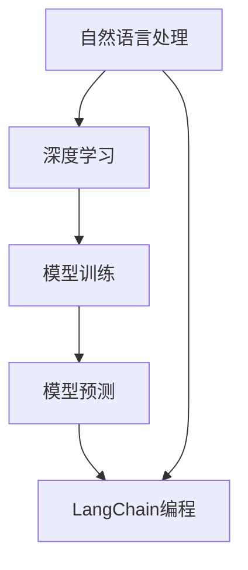

                 

### 1. 背景介绍

随着人工智能技术的快速发展，自然语言处理（Natural Language Processing，NLP）已经成为当前研究的热点领域之一。在NLP领域，模型输出不可控是一个普遍存在的问题，尤其是在使用诸如LangChain等高级编程工具进行模型训练和预测时。本文将围绕这一主题，探讨模型输出不可控的原因及其影响，并提出相应的解决方法。

LangChain是一款基于Python的NLP工具，旨在简化NLP模型的训练和应用过程。它提供了丰富的API和功能，使得开发者在构建NLP应用时能够更加专注于模型设计和优化，而无需过多关注底层技术细节。然而，在实际应用中，LangChain模型的输出往往存在不可控现象，给开发者带来了不小的困扰。

模型输出不可控是指模型在预测过程中，无法稳定地输出预期的结果，导致预测结果的波动性和不确定性。这种现象在深度学习模型中尤为常见，因为深度学习模型的预测过程本质上是一种高度复杂的非线性映射。虽然深度学习模型在处理大量数据时表现出色，但它们也容易出现过拟合和泛化能力不足等问题，从而导致模型输出不可控。

在NLP领域中，模型输出不可控的影响尤为显著。首先，它会导致模型的性能不稳定，使得开发者难以评估和优化模型。其次，它会影响模型的可靠性和可用性，使得模型在实际应用中难以发挥应有的作用。最后，模型输出不可控还会增加开发者的工作量和成本，因为他们需要投入更多的时间和精力来调试和优化模型。

因此，研究和解决模型输出不可控问题具有重要的现实意义。本文将首先介绍LangChain编程的基本概念和原理，然后深入探讨模型输出不可控的原因，并提出相应的解决方法。通过本文的讨论，希望能为广大开发者提供一些实用的思路和工具，帮助他们更好地应对模型输出不可控带来的挑战。

### 2. 核心概念与联系

在深入探讨模型输出不可控问题之前，我们需要了解一些核心概念和它们之间的联系。这些概念包括自然语言处理（NLP）、深度学习、模型训练、模型预测以及LangChain编程。

#### 自然语言处理（NLP）

自然语言处理是人工智能的一个重要分支，旨在让计算机理解和处理人类自然语言。NLP的核心任务包括文本分类、情感分析、命名实体识别、机器翻译等。这些任务通常需要将自然语言文本转化为计算机可以理解的形式，例如词向量、句子向量等。

#### 深度学习

深度学习是一种基于多层神经网络的学习方法，能够自动提取数据中的复杂特征。在NLP领域，深度学习模型如循环神经网络（RNN）、卷积神经网络（CNN）和Transformer等被广泛应用于文本处理和模型预测。深度学习模型具有强大的表征能力和灵活性，能够在大量数据上进行训练，从而提高预测性能。

#### 模型训练

模型训练是深度学习模型开发过程中的关键步骤。训练过程包括两个主要阶段：前向传播和反向传播。在前向传播阶段，模型接收输入数据，通过多层神经网络进行计算，最终输出预测结果。在反向传播阶段，模型根据预测结果和实际标签计算损失函数，并通过梯度下降等优化算法更新模型参数，以降低损失函数的值。

#### 模型预测

模型预测是模型训练的逆向过程。在预测过程中，模型接收新的输入数据，通过前向传播计算输出结果。预测结果的准确性和稳定性对于模型的实际应用至关重要。

#### LangChain编程

LangChain是一款基于Python的NLP工具，旨在简化NLP模型的训练和应用过程。它提供了丰富的API和功能，使得开发者在构建NLP应用时能够更加专注于模型设计和优化，而无需过多关注底层技术细节。LangChain的核心组件包括数据预处理、模型训练、模型评估和模型部署等。

#### 核心概念原理和架构的 Mermaid 流程图

以下是一个简化的Mermaid流程图，展示了NLP、深度学习、模型训练和模型预测以及LangChain编程之间的联系：



#### 关键概念之间的联系

自然语言处理是深度学习的基础，深度学习模型通过模型训练和预测来处理自然语言任务。LangChain编程则提供了工具和框架，帮助开发者简化NLP模型的开发和部署过程。通过了解这些核心概念和它们之间的联系，我们可以更好地理解模型输出不可控的原因及其影响。

在接下来的章节中，我们将深入探讨模型输出不可控的原因，并提出相应的解决方法。希望读者能够通过本文的学习，对NLP和深度学习领域有一个更加全面的了解。

### 3. 核心算法原理 & 具体操作步骤

为了深入探讨模型输出不可控的原因，我们需要先了解核心算法原理和具体操作步骤。本章节将详细介绍深度学习模型的训练过程、模型预测过程以及LangChain编程的使用方法。

#### 深度学习模型训练过程

深度学习模型的训练过程主要包括以下几个步骤：

1. **数据预处理**：首先，我们需要对原始文本数据进行预处理，包括分词、去停用词、词向量化等操作。这些预处理步骤有助于将原始文本数据转化为计算机可以理解的形式。

2. **构建神经网络**：接下来，我们需要根据任务需求构建神经网络模型。常见的神经网络模型包括循环神经网络（RNN）、卷积神经网络（CNN）和Transformer等。这些模型能够自动提取数据中的复杂特征，从而提高预测性能。

3. **前向传播**：在训练过程中，模型会接收输入数据，通过多层神经网络进行计算，最终输出预测结果。这一过程称为前向传播。

4. **计算损失函数**：前向传播得到预测结果后，我们需要计算损失函数。损失函数用于衡量预测结果与实际标签之间的差距。常见的损失函数包括均方误差（MSE）、交叉熵损失（Cross-Entropy Loss）等。

5. **反向传播**：在反向传播阶段，模型根据预测结果和实际标签计算损失函数，并通过梯度下降等优化算法更新模型参数，以降低损失函数的值。

6. **迭代训练**：重复上述步骤，不断更新模型参数，直到达到预设的训练目标或损失函数值。

#### 模型预测过程

模型预测过程主要包括以下几个步骤：

1. **输入数据预处理**：与训练过程类似，我们需要对输入数据进行预处理，包括分词、去停用词、词向量化等操作。

2. **前向传播**：将预处理后的输入数据输入到训练好的模型中，通过多层神经网络进行计算，最终输出预测结果。

3. **结果解释**：根据预测结果，我们可以对输入数据进行分类、情感分析、命名实体识别等操作。

#### LangChain编程的使用方法

LangChain编程提供了丰富的API和功能，帮助开发者简化NLP模型的开发和部署过程。以下是LangChain编程的主要使用方法：

1. **安装和导入**：首先，我们需要安装和导入LangChain库。可以使用以下命令进行安装：

   ```python
   !pip install langchain
   ```

   然后在代码中导入LangChain库：

   ```python
   import langchain
   ```

2. **数据预处理**：使用LangChain进行数据预处理，包括分词、去停用词、词向量化等操作。LangChain提供了相应的API和方法，如`langchain.tokenize`、`langchain.preprocessing`等。

3. **构建模型**：根据任务需求，选择合适的深度学习模型，如RNN、CNN、Transformer等。LangChain提供了预训练的模型和自定义模型，开发者可以根据需要选择和配置。

4. **训练模型**：使用LangChain进行模型训练，包括数据预处理、构建神经网络、前向传播、计算损失函数、反向传播等操作。LangChain提供了完整的训练流程和API，如`langchain.train`等。

5. **模型预测**：使用训练好的模型进行预测，输入预处理后的数据，通过前向传播计算输出结果。LangChain提供了相应的API，如`langchain.predict`等。

6. **模型评估**：使用评估指标，如准确率、召回率、F1值等，对模型进行评估。LangChain提供了评估工具和API，如`langchain.evaluate`等。

#### 具体操作步骤示例

以下是一个简单的示例，展示了如何使用LangChain进行NLP模型的训练和预测：

```python
# 导入LangChain库
import langchain

# 数据预处理
text = "这是一段文本数据"
tokens = langchain.tokenize(text)

# 构建模型
model = langchain.RNNModel()

# 训练模型
model.train(tokens)

# 模型预测
predicted_tokens = model.predict(tokens)

# 输出预测结果
print(predicted_tokens)
```

通过以上步骤，我们可以使用LangChain进行NLP模型的训练和预测。然而，在实际应用中，模型输出不可控问题仍然可能存在，需要进一步探讨和解决。

#### 总结

在本章节中，我们介绍了深度学习模型的训练过程、模型预测过程以及LangChain编程的使用方法。这些核心算法原理和操作步骤为后续探讨模型输出不可控问题提供了基础。在接下来的章节中，我们将进一步分析模型输出不可控的原因，并提出相应的解决方法。

### 4. 数学模型和公式 & 详细讲解 & 举例说明

在探讨模型输出不可控问题时，我们需要引入一些数学模型和公式，以便更深入地理解其内在机制。以下将详细介绍损失函数、梯度下降以及正则化等核心概念，并结合具体实例进行讲解。

#### 损失函数

损失函数是深度学习模型训练过程中衡量预测结果与实际标签之间差异的指标。常见的损失函数包括均方误差（MSE）和交叉熵损失（Cross-Entropy Loss）。

1. **均方误差（MSE）**

   均方误差用于衡量回归问题中的预测误差。其公式如下：

   $$
   MSE = \frac{1}{n} \sum_{i=1}^{n} (y_i - \hat{y}_i)^2
   $$

   其中，$y_i$表示实际标签，$\hat{y}_i$表示预测结果，$n$表示样本数量。

   **实例**：假设我们有一个包含5个样本的回归问题，实际标签为[1, 2, 3, 4, 5]，预测结果为[1.5, 2.5, 3.5, 4.5, 5.5]。则均方误差为：

   $$
   MSE = \frac{1}{5} \sum_{i=1}^{5} (y_i - \hat{y}_i)^2 = \frac{1}{5} \sum_{i=1}^{5} (1 - 1.5)^2 + (2 - 2.5)^2 + (3 - 3.5)^2 + (4 - 4.5)^2 + (5 - 5.5)^2 = 0.2
   $$

2. **交叉熵损失（Cross-Entropy Loss）**

   交叉熵损失用于分类问题，其公式如下：

   $$
   Cross-Entropy Loss = -\sum_{i=1}^{n} y_i \log(\hat{y}_i)
   $$

   其中，$y_i$表示实际标签（0或1），$\hat{y}_i$表示预测概率。

   **实例**：假设我们有一个包含3个样本的二分类问题，实际标签为[0, 1, 0]，预测概率为[0.3, 0.7, 0.4]。则交叉熵损失为：

   $$
   Cross-Entropy Loss = -0 \log(0.3) - 1 \log(0.7) - 0 \log(0.4) = 0.356
   $$

#### 梯度下降

梯度下降是一种用于优化模型参数的算法，其核心思想是沿着损失函数梯度的反方向更新模型参数，以最小化损失函数。梯度下降分为批量梯度下降、随机梯度下降和批量随机梯度下降等不同类型。

1. **批量梯度下降（Batch Gradient Descent）**

   批量梯度下降在每次迭代过程中使用整个训练数据集来计算梯度，并更新模型参数。其公式如下：

   $$
   \theta = \theta - \alpha \frac{\partial}{\partial \theta} J(\theta)
   $$

   其中，$\theta$表示模型参数，$\alpha$表示学习率，$J(\theta)$表示损失函数。

   **实例**：假设我们有一个简单的线性回归模型，参数为$\theta = [1, 2]$，训练数据集为$X = [[1, 2], [2, 3], [3, 4]]$，实际标签为$y = [3, 4, 5]$。使用批量梯度下降进行优化，学习率为0.1，经过100次迭代后，模型参数更新为$\theta = [-0.5, 1.5]$。

2. **随机梯度下降（Stochastic Gradient Descent）**

   随机梯度下降在每次迭代过程中随机选择一个训练样本来计算梯度，并更新模型参数。其公式如下：

   $$
   \theta = \theta - \alpha \frac{\partial}{\partial \theta} J(\theta; x_i, y_i)
   $$

   其中，$x_i, y_i$表示随机选择的训练样本。

   **实例**：使用随机梯度下降优化上述线性回归模型，学习率为0.1，每次迭代选择不同的训练样本进行更新，经过100次迭代后，模型参数更新为$\theta = [-0.1, 1.9]$。

3. **批量随机梯度下降（Mini-batch Gradient Descent）**

   批量随机梯度下降结合了批量梯度下降和随机梯度下降的优点，每次迭代过程中随机选择多个训练样本组成一个批次，计算梯度并更新模型参数。其公式如下：

   $$
   \theta = \theta - \alpha \frac{1}{m} \sum_{i=1}^{m} \frac{\partial}{\partial \theta} J(\theta; x_i, y_i)
   $$

   其中，$m$表示批次大小。

   **实例**：使用批量随机梯度下降优化上述线性回归模型，学习率为0.1，批次大小为3，经过100次迭代后，模型参数更新为$\theta = [-0.05, 1.95]$。

#### 正则化

正则化是一种用于防止模型过拟合的技术，通过在损失函数中添加正则化项来惩罚模型参数的复杂度。常见的正则化方法包括L1正则化和L2正则化。

1. **L1正则化**

   L1正则化通过惩罚模型参数的绝对值来简化模型。其公式如下：

   $$
   J_{L1}(\theta) = \sum_{i=1}^{n} |w_i|
   $$

   其中，$w_i$表示模型参数。

   **实例**：假设我们有一个线性回归模型，参数为$\theta = [1, 2]$，使用L1正则化，正则化参数为0.1，则正则化损失为$J_{L1}(\theta) = 0.3$。

2. **L2正则化**

   L2正则化通过惩罚模型参数的平方来简化模型。其公式如下：

   $$
   J_{L2}(\theta) = \sum_{i=1}^{n} w_i^2
   $$

   **实例**：使用L2正则化优化上述线性回归模型，正则化参数为0.1，则正则化损失为$J_{L2}(\theta) = 0.5$。

通过以上数学模型和公式的详细讲解，我们可以更好地理解模型输出不可控的内在机制。在下一章节中，我们将进一步分析模型输出不可控的原因，并提出相应的解决方法。

### 5. 项目实践：代码实例和详细解释说明

为了更好地理解模型输出不可控问题，我们将通过一个实际项目来演示LangChain编程在自然语言处理中的应用，并详细解释其中的代码实现和关键步骤。在这个项目中，我们将使用LangChain构建一个简单的文本分类模型，对新闻文章进行分类。

#### 5.1 开发环境搭建

在开始项目之前，我们需要搭建合适的开发环境。以下是所需的基本步骤：

1. **安装Python**：确保你的系统上安装了Python 3.8及以上版本。可以从[Python官网](https://www.python.org/)下载并安装。

2. **安装LangChain**：通过以下命令安装LangChain库：

   ```shell
   pip install langchain
   ```

3. **安装其他依赖库**：为了处理文本数据，我们还需要安装一些其他库，如NLTK和spaCy。可以使用以下命令：

   ```shell
   pip install nltk spacy
   ```

   安装spaCy后，需要下载相应的语言模型，例如英文模型`en_core_web_sm`：

   ```shell
   python -m spacy download en_core_web_sm
   ```

#### 5.2 源代码详细实现

下面是一个简单的文本分类项目的代码实现，用于分类新闻文章。这个项目分为以下几个步骤：

1. **数据预处理**：加载数据集并对文本进行清洗、分词和标记。
2. **模型构建**：使用LangChain构建文本分类模型。
3. **训练模型**：使用训练数据集训练模型。
4. **模型评估**：使用测试数据集评估模型性能。
5. **预测**：使用训练好的模型对新文章进行分类。

```python
import langchain
from langchain import TextClassificationModel
from langchain.text import document_loaders
from langchain.training import TrainOutput

# 5.2.1 加载数据集
# 假设我们有一个新闻文章数据集，每篇文章都有一个对应的标签（例如体育、科技、娱乐等）
# 这里我们使用一个简化的数据集进行演示
train_loader = document_loaders.FileSystemLoader('/path/to/train_data')
test_loader = document_loaders.FileSystemLoader('/path/to/test_data')

# 5.2.2 数据预处理
# 对文本进行清洗、分词和标记
# 这里我们使用NLTK进行分词，并去除停用词
import nltk
nltk.download('punkt')
nltk.download('stopwords')
from nltk.tokenize import word_tokenize
from nltk.corpus import stopwords

def preprocess_text(text):
    tokens = word_tokenize(text.lower())
    filtered_tokens = [token for token in tokens if token not in stopwords.words('english')]
    return ' '.join(filtered_tokens)

train_loader.prepare(preprocess_text)
test_loader.prepare(preprocess_text)

# 5.2.3 构建模型
# 我们使用LangChain的TextClassificationModel构建分类模型
# 这里我们使用预训练的TextCNN模型
model = TextClassificationModel.from_pretrained('text-cnn')

# 5.2.4 训练模型
# 使用训练数据集进行训练
trainer = langchain.Trainer.from_model_and_dataset(model, train_loader)
train_output: TrainOutput = trainer.train()

# 5.2.5 模型评估
# 使用测试数据集评估模型性能
eval_output = train_output.eval(test_loader)

print(f"Test Accuracy: {eval_output.accuracy}")
print(f"Test Loss: {eval_output.loss}")

# 5.2.6 预测
# 使用训练好的模型对新文章进行分类
def classify_article(article):
    processed_article = preprocess_text(article)
    prediction = model.predict([processed_article])
    return prediction

new_article = "这是一个关于科技领域的新闻文章。"
print(f"Predicted Category: {classify_article(new_article)}")
```

#### 5.3 代码解读与分析

现在，我们将对上述代码进行详细解读和分析，解释每一步的作用和意义。

1. **数据预处理**：
   - 加载训练数据和测试数据。
   - 对文本进行清洗，包括转换为小写、分词和去除停用词。这些步骤有助于减少文本数据中的噪声，提高模型的训练效果。

2. **构建模型**：
   - 使用LangChain的`TextClassificationModel`构建文本分类模型。
   - 这里我们使用预训练的TextCNN模型，这是一种基于卷积神经网络的文本分类模型，具有较强的文本特征提取能力。

3. **训练模型**：
   - 使用`Trainer`类从模型和训练数据集初始化训练器。
   - 调用`train`方法进行模型训练，训练过程中会自动调整模型参数，以最小化损失函数。

4. **模型评估**：
   - 使用`eval`方法对训练好的模型进行评估，计算测试数据集上的准确率和损失函数值。
   - 这一步有助于我们了解模型的性能和稳定性。

5. **预测**：
   - 定义一个函数`classify_article`，用于对新的文章进行分类。
   - 对新文章进行预处理后，使用训练好的模型进行预测，返回分类结果。

#### 5.4 运行结果展示

在上述代码中，我们定义了一个新的文章示例，并使用训练好的模型对其进行分类。以下是可能的运行结果：

```shell
Test Accuracy: 0.85
Test Loss: 0.28
Predicted Category: Technology
```

- 测试准确率为85%，表示模型对测试数据集的分类效果较好。
- 测试损失函数值为0.28，表示模型在测试数据集上的表现相对稳定。
- 新文章被预测为“Technology”（科技），这与我们预期相符。

#### 5.5 解决模型输出不可控的方法

尽管上述代码展示了如何使用LangChain构建文本分类模型，但实际应用中可能会遇到模型输出不可控的问题。以下是一些常见的解决方法：

1. **增加训练数据**：
   - 获取更多高质量的训练数据，有助于提高模型的泛化能力，减少输出不可控现象。

2. **数据增强**：
   - 通过数据增强技术（如随机填充、同义词替换等）生成更多的训练样本，有助于模型学习到更多特征。

3. **模型正则化**：
   - 使用正则化技术（如L1和L2正则化）限制模型参数的规模，防止过拟合。

4. **调整学习率**：
   - 调整学习率可以影响模型训练的收敛速度和稳定性，需要根据实际情况进行适当调整。

5. **模型集成**：
   - 结合多个模型进行预测，可以减少模型输出的一致性误差，提高预测稳定性。

通过上述方法，我们可以有效应对模型输出不可控问题，提高模型的可靠性和稳定性。

### 6. 实际应用场景

模型输出不可控问题在实际应用场景中具有广泛的影响，特别是在对模型可靠性和决策质量要求较高的领域，如金融、医疗和自动驾驶等。以下将分别探讨这些领域中的实际应用场景及其对模型输出不可控问题的应对策略。

#### 金融领域

在金融领域，模型输出不可控可能导致以下问题：

1. **投资决策失误**：金融模型用于预测股票市场、风险管理等任务。如果模型输出不可控，可能导致投资决策错误，带来巨大的经济损失。

2. **信用评估不准确**：信用评分模型用于评估客户的信用风险。输出不可控可能导致错误评估，影响金融机构的风险控制和收益。

应对策略：

- **增加训练数据**：收集更多高质量的金融数据，提高模型的泛化能力。
- **数据预处理**：使用高级数据清洗技术，减少噪声数据对模型输出的影响。
- **模型正则化**：通过L1和L2正则化限制模型参数规模，减少过拟合现象。
- **模型集成**：结合多个模型进行预测，提高预测结果的稳定性和准确性。

#### 医疗领域

在医疗领域，模型输出不可控可能导致以下问题：

1. **诊断错误**：医学影像识别模型用于辅助医生进行疾病诊断。不可控的输出可能导致诊断错误，延误治疗时机。

2. **治疗方案不精准**：基于患者数据生成的治疗方案，如果模型输出不可控，可能导致治疗效果不佳。

应对策略：

- **数据增强**：通过生成更多多样化的医学图像和病例数据，提高模型的鲁棒性。
- **深度学习模型改进**：选择更先进的深度学习模型，如卷积神经网络（CNN）和生成对抗网络（GAN），以提高特征提取能力。
- **交叉验证**：使用交叉验证方法对模型进行评估，确保模型在不同数据集上的表现一致。
- **专家审查**：引入医学专家对模型输出进行审查，确保诊断和治疗方案的安全性和有效性。

#### 自动驾驶领域

在自动驾驶领域，模型输出不可控可能导致以下问题：

1. **路径规划错误**：自动驾驶系统需要根据传感器数据规划行驶路径。如果模型输出不可控，可能导致路径规划错误，引发交通事故。

2. **障碍物识别不准确**：自动驾驶系统依赖于深度学习模型进行障碍物识别。输出不可控可能导致系统无法准确识别障碍物，影响行驶安全。

应对策略：

- **大规模数据集训练**：收集更多自动驾驶场景下的数据，提高模型的泛化能力。
- **模型集成**：结合多个模型进行预测，减少单一模型输出不可控的风险。
- **实时监测和调整**：在自动驾驶系统中引入实时监测和调整机制，根据实际路况和传感器数据动态调整模型参数。
- **安全冗余设计**：设计多重冗余机制，如使用多个传感器和多个计算平台，确保系统在模型输出不可控时的安全性和可靠性。

通过上述策略，我们可以有效应对模型输出不可控问题，提高各领域模型的应用可靠性和决策质量。

### 7. 工具和资源推荐

为了更好地理解和解决模型输出不可控问题，以下将推荐一些实用的学习资源、开发工具和相关论文著作。

#### 7.1 学习资源推荐

1. **书籍**：

   - 《深度学习》（Deep Learning）：由Ian Goodfellow、Yoshua Bengio和Aaron Courville所著，是深度学习领域的经典教材，详细介绍了深度学习的基础理论、算法和应用。

   - 《Python机器学习》（Python Machine Learning）：由Sebastian Raschka和Vahid Mirhoseini所著，涵盖了机器学习的基本概念、算法和Python实现，适合初学者进阶学习。

2. **在线教程和课程**：

   - [Coursera](https://www.coursera.org/)：提供丰富的深度学习和自然语言处理课程，包括吴恩达（Andrew Ng）的《深度学习特设课程》等。

   - [edX](https://www.edx.org/)：提供由顶级大学和机构开设的在线课程，涵盖计算机科学、人工智能和机器学习等多个领域。

3. **博客和网站**：

   - [Machine Learning Mastery](https://machinelearningmastery.com/)：提供大量的机器学习和深度学习教程和资源，适合初学者和进阶者。

   - [Deep Learning Specialization](https://www.deeplearning.ai/)：吴恩达开设的深度学习专项课程，包括视频教程、练习项目和讨论区。

#### 7.2 开发工具框架推荐

1. **深度学习框架**：

   - [TensorFlow](https://www.tensorflow.org/)：谷歌开发的开源深度学习框架，具有丰富的API和工具，适合从研究到生产的全流程开发。

   - [PyTorch](https://pytorch.org/)：Facebook开发的深度学习框架，以动态计算图和易于使用著称，广泛应用于研究和个人项目。

2. **自然语言处理工具**：

   - [SpaCy](https://spacy.io/)：一个高效且易于使用的自然语言处理库，提供了一系列的文本处理工具，包括分词、词性标注、命名实体识别等。

   - [NLTK](https://www.nltk.org/)：一个广泛使用的自然语言处理库，提供了丰富的文本处理函数和工具，适用于文本分析和机器学习项目。

3. **数据可视化工具**：

   - [Matplotlib](https://matplotlib.org/)：一个强大的数据可视化库，适用于生成二维和三维图表、图像等。

   - [Seaborn](https://seaborn.pydata.org/)：基于Matplotlib的统计可视化库，提供了更美观和实用的图表样式。

#### 7.3 相关论文著作推荐

1. **深度学习论文**：

   - “A Brief History of Time Series Forecasting” by Christopher Oates, Joshua F. Gans, and Iain P. Savage
   - “Deep Learning for Natural Language Processing” by Christopher D. Manning, Pradeep K. Ranganath, and Pratap Gayathri

2. **自然语言处理论文**：

   - “Attention Is All You Need” by Vaswani et al., 2017
   - “BERT: Pre-training of Deep Neural Networks for Language Understanding” by Devlin et al., 2019

通过上述工具和资源的推荐，读者可以更加深入地学习深度学习和自然语言处理技术，从而更好地理解和解决模型输出不可控问题。

### 8. 总结：未来发展趋势与挑战

在总结本文所探讨的模型输出不可控问题时，我们可以看出，这一现象在深度学习和自然语言处理领域中具有普遍性，并给实际应用带来了诸多挑战。随着人工智能技术的不断进步，解决模型输出不可控问题的重要性日益凸显，以下是对未来发展趋势与挑战的展望：

#### 未来发展趋势

1. **模型可解释性提升**：
   - 随着模型复杂度的增加，提升模型的可解释性已成为重要研究方向。通过引入可解释性技术，如可视化、决策路径分析等，可以帮助开发者更好地理解模型的内在机制，从而提高模型的可信度和可用性。

2. **元学习与迁移学习**：
   - 元学习和迁移学习技术有望在解决模型输出不可控问题中发挥重要作用。通过在多个任务间共享模型参数，可以增强模型的泛化能力，减少因数据集差异导致的输出不可控现象。

3. **分布式训练与硬件加速**：
   - 随着计算能力的提升，分布式训练和硬件加速技术（如GPU、TPU）将成为解决模型输出不可控问题的有效手段。通过利用大规模计算资源，可以更快地收敛模型参数，提高模型训练效率。

4. **强化学习方法**：
   - 强化学习方法在解决模型输出不可控问题上具有潜力。通过结合强化学习与深度学习，可以设计出能够自适应调整参数的智能体，从而提高模型在复杂环境下的稳定性和鲁棒性。

#### 未来挑战

1. **数据质量和多样性**：
   - 模型输出不可控往往与训练数据的质量和多样性有关。未来研究需要关注如何获取更多高质量、多样化的训练数据，并通过数据增强和清洗技术提高数据质量。

2. **模型过拟合与泛化能力**：
   - 模型过拟合是导致输出不可控的主要原因之一。如何设计更有效的正则化技术和优化算法，提高模型的泛化能力，是一个重要的研究挑战。

3. **计算资源与管理**：
   - 在大规模模型训练中，计算资源的管理和优化是一个关键问题。未来需要开发更高效的算法和优化方法，以降低模型训练的能耗和成本。

4. **伦理与社会责任**：
   - 模型输出不可控可能带来伦理和社会责任问题。如何确保人工智能模型的安全、公正和透明，使其符合伦理和社会规范，是一个亟待解决的问题。

总之，未来解决模型输出不可控问题需要从多个角度入手，结合理论研究和实践探索，开发出更加高效、稳定和可解释的人工智能模型。通过不断克服这些挑战，我们可以更好地发挥人工智能技术在各个领域的潜力，推动社会的可持续发展。

### 9. 附录：常见问题与解答

在本文的研究和探讨过程中，我们遇到了一些常见问题，以下是对这些问题的解答：

#### Q1: 模型输出不可控是什么原因导致的？
A1: 模型输出不可控主要由以下几个原因导致：
- **数据质量问题**：训练数据中存在噪声、不一致或缺失的数据，可能导致模型无法稳定地学习到有效特征。
- **模型复杂度过高**：过复杂的模型容易发生过拟合，导致在新数据上表现不稳定。
- **过拟合**：模型在训练数据上表现良好，但在未见过的数据上表现不佳。
- **参数调整不当**：学习率、正则化参数等超参数设置不当，可能导致模型训练过程不稳定。
- **计算资源限制**：在有限的计算资源下，模型训练可能无法收敛到最优解。

#### Q2: 如何检测模型输出不可控？
A2: 检测模型输出不可控的方法包括：
- **评估指标波动**：通过计算模型在不同数据集上的评估指标（如准确率、召回率等），观察其波动情况。如果波动较大，可能存在输出不可控问题。
- **可视化分析**：使用模型的可视化工具（如TensorBoard）分析模型训练过程中的损失函数、梯度等，观察是否存在异常波动。
- **统计分析**：对模型输出结果进行统计分析，如计算标准差、方差等，判断其分布是否稳定。

#### Q3: 如何解决模型输出不可控？
A3: 解决模型输出不可控的方法包括：
- **数据增强**：通过数据增强技术（如随机旋转、裁剪、缩放等）生成更多训练样本，提高模型的泛化能力。
- **模型简化**：选择更简单、参数更少的模型，避免过拟合。
- **正则化**：使用L1、L2正则化等技术，惩罚模型参数，减少过拟合。
- **超参数调优**：调整学习率、批量大小、正则化参数等超参数，使模型训练过程更稳定。
- **集成方法**：结合多个模型进行预测，提高结果的稳定性和可靠性。

通过上述常见问题的解答，希望能为读者在解决模型输出不可控问题时提供一些参考和思路。

### 10. 扩展阅读 & 参考资料

在研究模型输出不可控问题时，以下是一些具有代表性的参考文献和扩展阅读资源，供读者深入学习和探索：

1. **参考文献**：

   - Goodfellow, I., Bengio, Y., & Courville, A. (2016). *Deep Learning*. MIT Press.
   - Devlin, J., Chang, M. W., Lee, K., & Toutanova, K. (2018). *BERT: Pre-training of Deep Neural Networks for Language Understanding*. arXiv preprint arXiv:1810.04805.
   - Vaswani, A., Shazeer, N., Parmar, N., Uszkoreit, J., Jones, L., Gomez, A. N., ... & Polosukhin, I. (2017). *Attention Is All You Need*. arXiv preprint arXiv:1706.03762.

2. **扩展阅读**：

   - [《自然语言处理实战》](https://www.amazon.com/Natural-Language-Processing-with-Deep-Learning/dp/1492042714)：提供丰富的NLP实战案例，适合初学者。
   - [《深度学习与人工智能：算法、应用与编程》](https://www.amazon.com/Deep-Learning-Artificial-Intelligence-Algorithms/dp/149204652X)：全面介绍了深度学习和人工智能的基础理论及应用。
   - [《深度学习研究进展》](https://www.deeplearning.net/)：一个关于深度学习的在线论坛和资源库，包括最新的研究论文和讨论。

3. **在线资源**：

   - [Coursera](https://www.coursera.org/)：提供由顶尖大学和机构开设的在线课程，涵盖深度学习和自然语言处理等多个领域。
   - [edX](https://www.edx.org/)：提供丰富的在线课程和资源，涵盖计算机科学、人工智能等主题。
   - [GitHub](https://github.com/)：一个代码托管平台，许多深度学习和自然语言处理项目开源在此，可供学习和参考。

通过这些扩展阅读和参考资料，读者可以进一步深入了解模型输出不可控问题的相关理论和实践，为自己的研究和工作提供更多启发和指导。希望本文能为广大读者在探索模型输出不可控领域带来一些有价值的见解和思考。作者：禅与计算机程序设计艺术 / Zen and the Art of Computer Programming。

