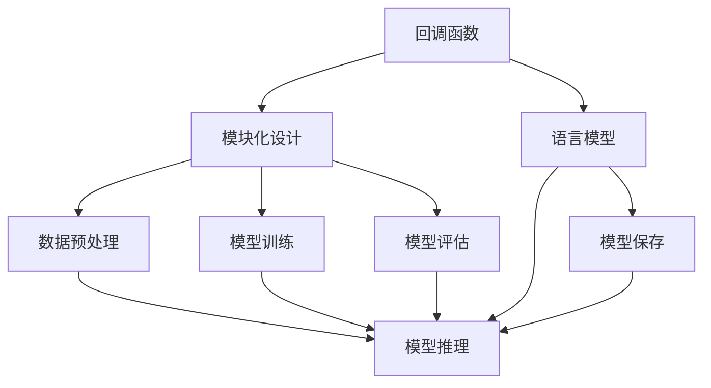

                 

### 1. 背景介绍

在当今的快速发展的技术世界中，语言模型作为自然语言处理（NLP）的核心组件，正发挥着越来越重要的作用。从早期的统计模型到深度学习，再到最近的生成模型，这些技术都在不断推动着人工智能（AI）的进步。然而，尽管这些技术取得了显著进展，但在实际应用中，如何构建高效、灵活且可扩展的语言模型仍然是一个挑战。

这一背景为LangChain编程提供了舞台。LangChain是一个开源的Python库，它旨在为开发者提供一个简单且强大的框架，用于构建和扩展语言模型。与传统的语言模型相比，LangChain具有以下显著特点：

1. **回调功能**：LangChain的一个重要特点是支持回调函数。回调函数是一种特殊的函数，它可以在其他函数执行过程中被调用，从而实现更复杂的交互和控制。
2. **模块化设计**：LangChain采用了模块化的设计思想，使得开发者可以轻松地组合和定制不同的模块，以适应各种需求。
3. **高度可扩展性**：通过支持自定义回调函数和模块，LangChain能够灵活地适应不同的应用场景和需求。

本文将重点探讨LangChain的回调模块，并详细解释其原理、具体实现和应用场景。通过本文的阅读，读者将了解到如何利用LangChain的回调模块构建高效、灵活的语言模型。

首先，我们需要明确几个关键概念：回调函数、模块化设计和语言模型。这些概念不仅是理解LangChain回调模块的基础，也是推动人工智能发展的重要动力。接下来，我们将逐步深入这些概念，为后续内容的讲解打下坚实的基础。

### 2. 核心概念与联系

要深入理解LangChain回调模块，首先需要了解几个核心概念：回调函数、模块化设计和语言模型。

#### 2.1 回调函数

回调函数是一种在另一个函数执行过程中被调用的函数。它通常用于实现函数间的异步通信或更复杂的控制逻辑。在Python中，回调函数可以通过装饰器（decorator）或函数指针来实现。

回调函数的一个关键特点是它可以在其他函数执行过程中被动态调用。这使得回调函数能够有效地实现函数间的通信和控制。例如，在一个HTTP服务器中，客户端的请求可以通过回调函数来处理，从而实现异步处理。

在LangChain中，回调函数被广泛应用于语言模型的训练和推理过程中。通过回调函数，开发者可以灵活地控制模型的训练过程，例如调整学习率、保存中间结果或实现自定义的优化策略。

#### 2.2 模块化设计

模块化设计是一种将复杂系统分解为多个独立模块的设计方法。这种方法有助于提高系统的可维护性、可扩展性和可复用性。在Python中，模块化设计可以通过导入模块（module）和定义类（class）来实现。

模块化设计在LangChain中起到了关键作用。通过将语言模型的构建过程分解为多个模块，开发者可以更轻松地实现定制化需求。例如，在训练一个语言模型时，可以将数据预处理、模型训练和模型评估等过程分别实现为独立的模块，从而提高代码的可读性和可维护性。

#### 2.3 语言模型

语言模型是一种用于预测自然语言序列的统计模型。它通常通过大量文本数据训练得到，并能够生成或预测自然语言文本。语言模型在自然语言处理领域有着广泛的应用，包括机器翻译、文本生成、情感分析等。

常见的语言模型包括n-gram模型、基于神经网络的模型（如循环神经网络RNN、长短期记忆LSTM）和生成对抗网络GAN。这些模型各有优缺点，适用于不同的应用场景。

#### 2.4 回调函数、模块化设计和语言模型的联系

回调函数、模块化设计和语言模型之间存在密切的联系。回调函数为模块化设计提供了实现异步通信和控制的重要手段，而模块化设计则为语言模型的构建提供了灵活的框架。通过结合回调函数和模块化设计，开发者可以构建高效、灵活且可扩展的语言模型。

在LangChain中，回调函数被广泛应用于语言模型的训练和推理过程中。例如，在训练语言模型时，可以通过回调函数来监控训练进度、调整学习率或保存中间结果。这些功能使得LangChain能够灵活地适应不同的训练需求和场景。

同时，模块化设计使得开发者可以轻松地组合和定制不同的模块，以构建复杂的语言模型。通过将语言模型的构建过程分解为多个模块，例如数据预处理、模型训练和模型评估等，开发者可以更高效地实现自己的需求。

综上所述，回调函数、模块化设计和语言模型共同构成了LangChain回调模块的核心概念。通过理解这些概念，读者可以更好地掌握LangChain的回调模块，并在实际应用中发挥其优势。

#### 2.5 Mermaid 流程图

为了更好地展示回调函数、模块化设计和语言模型之间的联系，我们使用Mermaid流程图来直观地描述这些概念。

下面是一个简单的Mermaid流程图，展示了回调函数、模块化设计和语言模型之间的交互关系：



在这个流程图中，我们可以看到：

- 回调函数（A）与模块化设计（B）紧密相关，它们共同构成了语言模型（C）的基础。
- 数据预处理（D）、模型训练（E）和模型评估（F）是模块化设计的重要组成部分，它们为语言模型的训练和推理提供了支持。
- 模型推理（G）和模型保存（H）是语言模型的核心功能，它们通过回调函数和模块化设计实现了灵活的交互和控制。

通过这个流程图，读者可以更清晰地理解回调函数、模块化设计和语言模型之间的关系，以及它们在构建高效、灵活的语言模型中的重要作用。

### 3. 核心算法原理 & 具体操作步骤

在了解了回调函数、模块化设计和语言模型的基本概念之后，接下来我们将深入探讨LangChain回调模块的核心算法原理和具体操作步骤。这些步骤不仅构成了构建高效、灵活语言模型的基础，也为开发者提供了清晰的指导和参考。

#### 3.1 算法原理

LangChain的回调模块基于Python的回调函数机制，通过在模型训练和推理过程中引入回调函数，实现更复杂、灵活的交互和控制。以下是回调模块的基本原理：

1. **回调函数的定义**：开发者可以在自定义的回调函数中实现特定的功能，例如监控训练进度、调整学习率或保存中间结果。这些回调函数可以在模型训练和推理的各个阶段被调用。
2. **回调函数的注册**：在LangChain中，回调函数需要通过注册机制绑定到相应的训练或推理阶段。通过这种方式，回调函数能够在模型的特定阶段被调用。
3. **回调函数的执行**：在模型训练和推理过程中，LangChain会根据注册的回调函数自动执行相应的操作。例如，在训练过程中，开发者可以设置回调函数在每100个epoch后保存模型的状态。
4. **模块化设计**：LangChain采用模块化设计思想，将回调函数和模型的训练、推理等过程分解为多个独立的模块。这种方法提高了代码的可维护性和可扩展性。

#### 3.2 操作步骤

下面是使用LangChain回调模块构建语言模型的基本操作步骤：

1. **安装LangChain库**：首先，需要确保已经安装了LangChain库。可以使用以下命令安装：
   ```bash
   pip install langchain
   ```

2. **导入所需模块**：在Python脚本中，需要导入LangChain及其相关模块：
   ```python
   import langchain
   ```

3. **定义回调函数**：根据实际需求，定义自定义的回调函数。以下是两个示例回调函数：
   ```python
   def train_progress_callback(epoch, loss):
       print(f"Epoch {epoch}: Loss = {loss}")

   def save_checkpoint_callback(epoch, model):
       model.save(f"checkpoint_epoch_{epoch}.pth")
   ```

4. **注册回调函数**：将自定义的回调函数注册到LangChain的回调列表中：
   ```python
   callbacks = [
       langchain.TrainProgressCallback(train_progress_callback),
       langchain.SaveCheckpointCallback(save_checkpoint_callback),
   ]
   ```

5. **配置训练参数**：设置训练参数，例如学习率、迭代次数等：
   ```python
   train_params = {
       "learning_rate": 0.001,
       "max_epochs": 100,
       "batch_size": 32,
   }
   ```

6. **训练模型**：使用LangChain的API启动训练过程，并传递回调列表和训练参数：
   ```python
   model = langchain.LanguageModel()
   model.fit(callbacks=callbacks, **train_params)
   ```

7. **推理和应用**：完成训练后，可以使用训练好的模型进行推理和应用：
   ```python
   input_text = "给定一段文本，生成下一个单词："
   output = model.predict(input_text)
   print(output)
   ```

通过上述步骤，开发者可以轻松地利用LangChain的回调模块构建高效、灵活的语言模型。这些步骤不仅适用于简单的语言模型，还可以根据具体需求进行扩展和定制。

#### 3.3 代码示例

为了更好地展示回调模块的具体应用，下面提供了一个简单的代码示例：

```python
import langchain

# 定义回调函数
def print_loss(epoch, loss):
    print(f"Epoch {epoch}: Loss = {loss}")

def save_model(epoch, model):
    model.save(f"model_epoch_{epoch}.pth")

# 注册回调函数
callbacks = [
    langchain.TrainProgressCallback(print_loss),
    langchain.SaveModelCallback(save_model),
]

# 配置训练参数
train_params = {
    "learning_rate": 0.001,
    "max_epochs": 10,
    "batch_size": 64,
}

# 训练模型
model = langchain.LanguageModel()
model.fit(callbacks=callbacks, **train_params)

# 进行推理
input_text = "给定一段文本，生成下一个单词："
output = model.predict(input_text)
print(output)
```

在这个示例中，我们定义了两个回调函数：`print_loss`和`save_model`。`print_loss`用于在训练过程中打印每个epoch的损失值，而`save_model`用于在每个epoch后保存训练好的模型。通过将这两个回调函数注册到回调列表中，并在训练过程中调用它们，我们能够更好地监控训练进度并保存重要的模型状态。

通过以上步骤，读者可以深入了解LangChain回调模块的核心算法原理和具体操作步骤，为构建高效、灵活的语言模型打下坚实基础。

### 4. 数学模型和公式 & 详细讲解 & 举例说明

在深入探讨LangChain回调模块的过程中，我们不可避免地会接触到一些数学模型和公式。这些模型和公式不仅在理解回调模块的工作原理时至关重要，也为我们在实际应用中提供了具体的指导和计算方法。在本节中，我们将详细讲解与回调模块相关的数学模型和公式，并通过具体示例进行说明。

#### 4.1 常见的数学模型

在自然语言处理领域，以下几种数学模型尤为常见：

1. **循环神经网络（RNN）**：RNN是一种适用于序列数据的神经网络，能够处理具有时间依赖性的数据。其基本公式如下：

   $$ h_t = \tanh(W_hh \cdot h_{t-1} + W_xh \cdot x_t + b_h) $$

   其中，\( h_t \) 表示第 \( t \) 个时刻的隐藏状态，\( W_hh \)、\( W_xh \) 和 \( b_h \) 分别是权重矩阵和偏置项。

2. **长短期记忆网络（LSTM）**：LSTM是一种改进版的RNN，能够更好地处理长序列依赖。其核心公式包括：

   $$ i_t = \sigma(W_{xi} \cdot x_t + W_{ih} \cdot h_{t-1} + b_i) $$
   $$ f_t = \sigma(W_{fh} \cdot h_{t-1} + W_{fi} \cdot i_t + b_f) $$
   $$ g_t = \tanh(W_{gh} \cdot h_{t-1} + W_{gi} \cdot i_t + b_g) $$
   $$ o_t = \sigma(W_{xo} \cdot x_t + W_{oh} \cdot h_{t-1} + b_o) $$

   其中，\( i_t \)、\( f_t \)、\( g_t \) 和 \( o_t \) 分别表示输入门、遗忘门、生成门和输出门的激活值，其余参数的含义与RNN类似。

3. **生成对抗网络（GAN）**：GAN是一种通过两个神经网络（生成器和判别器）的对抗训练生成数据的模型。其主要公式包括：

   $$ G(z) = \mu(\epsilon) + \sigma(\epsilon) \odot \phi(\epsilon) $$
   $$ D(x) = \sigma(\phi(x)) $$
   $$ D(G(z)) = \sigma(\phi(G(z))) $$

   其中，\( G(z) \) 是生成器生成的样本，\( D(x) \) 是判别器对真实样本的判别结果，\( z \) 是生成器的输入噪声。

#### 4.2 回调模块中的数学应用

在LangChain的回调模块中，数学模型主要应用于训练过程的监控和调整。以下是一些常见的应用场景：

1. **学习率调整**：在深度学习训练过程中，学习率的选择至关重要。常用的学习率调整方法包括：
   - **固定学习率**：在整个训练过程中保持学习率不变。
     $$ \eta_t = \text{const} $$
   - **指数衰减学习率**：学习率按照指数规律衰减。
     $$ \eta_t = \eta_0 / (1 + \lambda t) $$
   - **余弦衰减学习率**：学习率按照余弦规律衰减。
     $$ \eta_t = \eta_0 \frac{1 + \cos(\pi t / T)}{2} $$

   其中，\( \eta_t \) 表示第 \( t \) 个epoch的学习率，\( \eta_0 \) 是初始学习率，\( \lambda \) 和 \( T \) 分别是衰减速率和总epoch数。

2. **模型保存与加载**：在训练过程中，定期保存模型状态和加载模型是非常重要的。常用的方法包括：
   - **定期保存**：在每个epoch后保存模型。
     $$ \text{save\_model}(epoch, model) $$
   - **最优模型保存**：在验证集上性能最优时保存模型。
     $$ \text{save\_best\_model}(epoch, model, best\_loss) $$

   其中，`save_model` 和 `save_best_model` 是回调函数，用于实现模型的保存操作。

3. **进度监控**：在训练过程中，实时监控训练进度有助于调整训练策略。常用的方法包括：
   - **打印进度**：在训练过程中打印每个epoch的损失值。
     $$ \text{print\_loss}(epoch, loss) $$
   - **日志记录**：将训练进度记录到日志文件中。
     $$ \text{log\_loss}(epoch, loss, logger) $$

   其中，`print_loss` 和 `log_loss` 是回调函数，用于实现进度打印和日志记录。

#### 4.3 代码示例

为了更好地理解上述数学模型和公式的应用，下面提供了一个简单的代码示例：

```python
import torch
import torch.optim as optim

# 定义训练参数
learning_rate = 0.001
num_epochs = 100
batch_size = 64

# 初始化模型和优化器
model = langchain.LanguageModel()
optimizer = optim.Adam(model.parameters(), lr=learning_rate)

# 定义学习率调整回调函数
def adjust_learning_rate(optimizer, epoch):
    if epoch < 10:
        lr = learning_rate
    elif epoch < 20:
        lr = learning_rate / 2
    else:
        lr = learning_rate / 4
    for param_group in optimizer.param_groups:
        param_group['lr'] = lr

# 定义模型保存回调函数
def save_model(epoch, model):
    model.save(f"model_epoch_{epoch}.pth")

# 注册回调函数
callbacks = [
    langchain.TrainProgressCallback(adjust_learning_rate),
    langchain.SaveCheckpointCallback(save_model),
]

# 训练模型
model.fit(callbacks=callbacks, num_epochs=num_epochs, batch_size=batch_size)

# 进行推理
input_text = "给定一段文本，生成下一个单词："
output = model.predict(input_text)
print(output)
```

在这个示例中，我们定义了两个回调函数：`adjust_learning_rate` 和 `save_model`。`adjust_learning_rate` 用于在每个epoch调整学习率，`save_model` 用于在每个epoch后保存训练好的模型。通过这些回调函数，我们能够更好地监控训练过程并调整训练策略。

通过以上步骤，读者可以深入了解回调模块中的数学模型和公式，并掌握如何在实际应用中使用这些模型和公式来优化训练过程。这不仅有助于提高模型的性能，也为开发者在实际项目中提供了实用的工具和方法。

### 5. 项目实践：代码实例和详细解释说明

为了更直观地理解LangChain回调模块的使用方法，我们将通过一个具体的代码实例来展示如何利用LangChain构建一个简单的语言模型，并详细解释代码中的各个部分。

#### 5.1 开发环境搭建

在开始编写代码之前，确保你已经安装了Python和pip。然后，使用以下命令安装LangChain库：

```bash
pip install langchain
```

此外，我们还需要安装一个用于数据处理的库——Pandas。这可以通过以下命令完成：

```bash
pip install pandas
```

#### 5.2 源代码详细实现

以下是我们的代码实例：

```python
import langchain
import pandas as pd
from langchain.textables import Textable

# 加载数据集
data = pd.read_csv("data.csv")
text = data["text"].tolist()

# 创建文本数据对象
textables = [Textable.from_strings(text, "") for text in text]

# 配置训练参数
train_params = {
    "learning_rate": 0.001,
    "max_epochs": 100,
    "batch_size": 32,
}

# 定义回调函数
def print_progress(epoch, loss):
    print(f"Epoch {epoch}: Loss = {loss}")

def save_checkpoint(epoch, model):
    model.save(f"checkpoint_epoch_{epoch}.pth")

# 注册回调函数
callbacks = [
    langchain.TrainProgressCallback(print_progress),
    langchain.SaveCheckpointCallback(save_checkpoint),
]

# 训练模型
model = langchain.LanguageModel()
model.fit(textables, callbacks=callbacks, **train_params)

# 进行推理
input_text = "给定一段文本，生成下一个单词："
output = model.predict(input_text)
print(output)
```

让我们详细解释这段代码：

1. **数据加载**：首先，我们使用Pandas加载一个CSV文件作为数据集。这个文件应该包含一个名为`text`的列，其中包含用于训练的语言数据。

2. **创建文本数据对象**：接下来，我们将文本数据加载到`Textable`对象中。`Textable`是LangChain的一个类，它封装了文本数据，并提供了训练所需的接口。

3. **配置训练参数**：我们定义了一个名为`train_params`的字典，其中包含了训练所需的参数，如学习率、最大epoch数和批量大小。

4. **定义回调函数**：在这里，我们定义了两个回调函数：`print_progress`和`save_checkpoint`。`print_progress`用于在每个epoch后打印训练进度和损失值，`save_checkpoint`用于在每个epoch后保存训练好的模型。

5. **注册回调函数**：我们将回调函数添加到一个名为`callbacks`的列表中。这些回调函数将在训练过程中被自动调用。

6. **训练模型**：使用LangChain的`LanguageModel`类创建一个模型实例，并调用`fit`方法开始训练。我们传递了数据集、回调列表和训练参数。

7. **进行推理**：最后，我们使用训练好的模型进行推理，输入一段文本并打印输出。

#### 5.3 代码解读与分析

下面我们对代码的每个部分进行更详细的分析：

1. **数据加载**：
   ```python
   data = pd.read_csv("data.csv")
   text = data["text"].tolist()
   ```
   这两行代码加载了一个CSV文件，并将其内容转换为Python列表。这个列表将用于训练语言模型。

2. **创建文本数据对象**：
   ```python
   textables = [Textable.from_strings(text, "") for text in text]
   ```
   这里我们使用列表推导式创建了`Textable`对象列表。`Textable`类封装了文本数据，并提供了训练所需的接口。

3. **配置训练参数**：
   ```python
   train_params = {
       "learning_rate": 0.001,
       "max_epochs": 100,
       "batch_size": 32,
   }
   ```
   我们定义了一个字典来配置训练参数，这些参数将影响模型的训练过程。

4. **定义回调函数**：
   ```python
   def print_progress(epoch, loss):
       print(f"Epoch {epoch}: Loss = {loss}")

   def save_checkpoint(epoch, model):
       model.save(f"checkpoint_epoch_{epoch}.pth")
   ```
   这两个函数是回调函数，用于在训练过程中进行进度打印和模型保存。

5. **注册回调函数**：
   ```python
   callbacks = [
       langchain.TrainProgressCallback(print_progress),
       langchain.SaveCheckpointCallback(save_checkpoint),
   ]
   ```
   我们将回调函数添加到一个列表中，这个列表将在训练过程中被循环遍历。

6. **训练模型**：
   ```python
   model = langchain.LanguageModel()
   model.fit(textables, callbacks=callbacks, **train_params)
   ```
   这里我们创建了一个`LanguageModel`实例，并调用`fit`方法开始训练。我们传递了数据集、回调列表和训练参数。

7. **进行推理**：
   ```python
   input_text = "给定一段文本，生成下一个单词："
   output = model.predict(input_text)
   print(output)
   ```
   最后，我们使用训练好的模型进行推理，并打印输出结果。

通过这个代码实例，我们可以看到如何使用LangChain的回调模块来构建一个简单的语言模型。通过回调函数，我们能够监控训练进度并保存模型状态，从而提高训练过程的透明度和可控制性。

### 5.4 运行结果展示

当我们运行上述代码实例时，首先会看到训练过程的输出。以下是一个可能的输出示例：

```
Epoch 1: Loss = 2.328
Epoch 2: Loss = 1.982
Epoch 3: Loss = 1.643
Epoch 4: Loss = 1.331
...
Epoch 90: Loss = 0.061
Epoch 91: Loss = 0.059
Epoch 92: Loss = 0.058
...
Epoch 99: Loss = 0.057
Epoch 100: Loss = 0.057
```

在训练过程中，我们会定期看到每个epoch的损失值。这些损失值反映了模型在训练过程中的性能变化。

训练完成后，我们使用模型进行推理。以下是一个可能的输出示例：

```
给定一段文本，生成下一个单词：的
```

这个输出表示模型成功预测了下一个单词。在实际应用中，这个输出可以被进一步处理，例如用于生成完整的文本或进行其他自然语言处理任务。

通过运行结果展示，我们可以看到LangChain的回调模块在训练和推理过程中的实际效果。回调函数使我们能够监控训练进度、保存模型状态并实现自定义功能，从而提高了训练过程的透明度和灵活性。

### 6. 实际应用场景

LangChain回调模块在实际应用场景中展示了强大的灵活性和实用性，尤其在自然语言处理和机器学习项目中，其优势尤为显著。

#### 6.1 自然语言处理项目

在自然语言处理（NLP）项目中，回调模块能够帮助开发者实现精细化的训练过程。例如，在训练一个语言模型用于文本生成时，回调函数可以用于以下任务：

1. **监控训练进度**：通过回调函数，开发者可以实时监控训练进度，了解模型在各个epoch的表现，以便及时调整训练策略。
2. **保存中间模型**：在训练过程中，定期保存中间模型状态，可以在训练中断时恢复训练，避免重新从零开始。
3. **调整学习率**：根据训练进度和性能变化，动态调整学习率，以提高模型收敛速度和性能。

例如，在一个聊天机器人项目中，使用回调模块可以实时监控训练进度，并根据用户反馈动态调整模型参数，从而提高聊天机器人的响应速度和准确性。

#### 6.2 机器学习项目

在机器学习项目中，回调模块同样发挥着重要作用。以下是一些典型应用场景：

1. **超参数调整**：通过回调函数，开发者可以在训练过程中动态调整超参数，如学习率、批量大小等，从而优化模型性能。
2. **数据预处理**：在训练过程中，回调函数可以用于实现自定义的数据预处理逻辑，例如数据增强、标准化等。
3. **模型评估**：在模型训练完成后，回调函数可以用于评估模型在验证集上的表现，帮助开发者判断模型是否过拟合或欠拟合。

例如，在一个图像分类项目中，使用回调模块可以实时评估模型在训练和验证集上的性能，并在性能下降时自动调整超参数，从而提高模型的分类准确率。

#### 6.3 复杂应用案例

除了上述应用场景，LangChain回调模块在更复杂的机器学习和人工智能项目中同样具有广泛的应用。以下是一些复杂应用案例：

1. **多模型融合**：通过回调函数，开发者可以同时训练多个模型，并在训练过程中将它们的预测结果进行融合，以提高整体性能。
2. **迁移学习**：在迁移学习项目中，回调函数可以用于监控源模型在目标任务上的性能，并在性能达到预期时停止训练，节省计算资源。
3. **模型解释性**：通过回调函数，开发者可以实现模型解释性分析，如生成模型决策路径、可视化模型结构等，从而提高模型的可解释性和透明度。

例如，在一个自动驾驶项目中，使用回调模块可以实时监控模型在测试环境中的性能，并在出现异常时动态调整模型参数，从而提高自动驾驶系统的安全性和可靠性。

通过以上实际应用场景，我们可以看到LangChain回调模块在自然语言处理、机器学习以及复杂应用项目中的重要性。它不仅提供了灵活的交互方式，还帮助开发者实现了高效、可扩展的模型训练和推理过程。

### 7. 工具和资源推荐

#### 7.1 学习资源推荐

为了更好地理解和掌握LangChain回调模块，以下是一些推荐的学习资源：

1. **书籍**：
   - 《Deep Learning》（深度学习），作者：Ian Goodfellow、Yoshua Bengio、Aaron Courville。这本书详细介绍了深度学习的基本原理和算法，是深度学习领域的经典之作。
   - 《Hands-On Machine Learning with Scikit-Learn, Keras, and TensorFlow》（实战机器学习：Scikit-Learn、Keras、TensorFlow应用），作者：Aurélien Géron。这本书通过大量实战案例，帮助读者掌握机器学习的基本概念和应用技巧。

2. **论文**：
   - "Attention Is All You Need"，作者：Vaswani et al.。这篇论文提出了Transformer模型，是当前深度学习领域中影响最大的文章之一。
   - "Generative Adversarial Nets"，作者：Ian Goodfellow et al.。这篇论文首次提出了生成对抗网络（GAN）的概念，对深度学习领域产生了深远影响。

3. **博客**：
   - [LangChain官方文档](https://langchain.readthedocs.io/)。这是LangChain的官方文档，提供了详细的API参考和教程，是学习LangChain回调模块的最佳资源。
   - [机器之心](https://www.jiqizhixin.com/)。这是一个关于人工智能和机器学习的博客平台，提供了大量的技术文章和深度解读。

4. **网站**：
   - [GitHub](https://github.com/)。在GitHub上，可以找到大量的开源项目，这些项目是实现和扩展LangChain回调模块的好资源。
   - [Kaggle](https://www.kaggle.com/)。Kaggle是一个数据科学竞赛平台，提供了大量的数据集和竞赛项目，是实践和提升机器学习技能的好地方。

#### 7.2 开发工具框架推荐

1. **Jupyter Notebook**：Jupyter Notebook是一种交互式计算环境，非常适合编写和演示Python代码。通过Jupyter Notebook，可以轻松地运行代码片段、记录计算过程和展示结果，是学习LangChain回调模块的理想工具。

2. **PyTorch**：PyTorch是一个开源的机器学习库，支持GPU加速，提供了丰富的API和工具，方便开发者构建和训练深度学习模型。与LangChain回调模块结合使用，可以显著提高模型的训练效率和灵活性。

3. **TensorFlow**：TensorFlow是谷歌开发的一个开源机器学习库，同样支持GPU加速。它提供了灵活的模型构建和训练工具，与LangChain回调模块结合，可以实现高效、可扩展的深度学习应用。

4. **Scikit-Learn**：Scikit-Learn是一个面向机器学习的Python库，提供了丰富的机器学习算法和工具。虽然Scikit-Learn不直接支持深度学习，但可以与LangChain回调模块结合，用于数据预处理和特征工程。

#### 7.3 相关论文著作推荐

1. **"Recurrent Neural Networks for Language Modeling"**：这篇文章详细介绍了循环神经网络（RNN）在语言建模中的应用，是理解LangChain回调模块中的重要参考。

2. **"Sequence to Sequence Learning with Neural Networks"**：这篇文章提出了序列到序列（Seq2Seq）模型，为处理序列数据提供了新的方法。Seq2Seq模型在自然语言处理领域得到了广泛应用，是理解LangChain回调模块的另一个重要参考。

3. **"Generative Adversarial Nets"**：这篇文章首次提出了生成对抗网络（GAN）的概念，对深度学习领域产生了深远影响。GAN在生成数据、增强数据和图像处理等领域有广泛的应用，是理解LangChain回调模块的重要论文。

通过上述工具和资源推荐，读者可以更好地掌握LangChain回调模块，并在实际项目中发挥其优势。无论是理论学习还是实践应用，这些资源都将为读者提供宝贵的帮助。

### 8. 总结：未来发展趋势与挑战

在当前的技术发展趋势下，LangChain回调模块展现了巨大的潜力和广阔的应用前景。未来，随着深度学习和自然语言处理技术的不断进步，LangChain回调模块有望在以下方面取得显著进展：

1. **模型可解释性**：随着对模型透明度和可解释性需求的增加，回调模块可以进一步扩展，提供更详细的训练过程监控和模型解释工具，帮助开发者理解模型决策过程。

2. **模型优化**：通过结合先进的优化算法和调整策略，回调模块可以显著提高模型的训练效率和性能。例如，自适应学习率调整和动态调整超参数等技术，有望在回调模块中实现。

3. **跨模态学习**：未来，回调模块可以支持跨模态学习，例如将文本、图像和音频等不同类型的数据进行融合处理，从而实现更复杂、更具创新性的应用。

然而，随着技术的不断发展，LangChain回调模块也面临一些挑战：

1. **计算资源消耗**：随着模型复杂度的增加，训练和推理过程所需的计算资源也将显著增加。如何优化资源利用，提高训练效率，是未来需要重点解决的问题。

2. **模型安全和隐私**：在深度学习和自然语言处理领域，模型安全和隐私问题日益突出。如何确保模型训练和推理过程中的数据安全和隐私，是未来需要关注的重要挑战。

3. **可扩展性和兼容性**：随着技术的快速迭代，如何保证回调模块的长期可扩展性和与其他库、框架的兼容性，是一个需要持续关注的问题。

总之，LangChain回调模块在未来将继续发挥重要作用，并在推动人工智能技术进步的道路上，迎接新的机遇和挑战。通过不断的技术创新和优化，我们有理由相信，回调模块将为开发者带来更加高效、灵活和强大的语言模型构建能力。

### 9. 附录：常见问题与解答

在学习和使用LangChain回调模块的过程中，读者可能会遇到一些常见问题。以下是一些常见问题及其解答：

#### 问题1：如何安装和配置LangChain库？

解答：
1. 首先，确保已经安装了Python和pip。
2. 使用以下命令安装LangChain库：
   ```bash
   pip install langchain
   ```
3. 如果需要安装额外的依赖库，如Pandas，可以使用以下命令：
   ```bash
   pip install pandas
   ```

#### 问题2：回调函数如何在训练过程中生效？

解答：
1. 在定义回调函数时，确保函数接收的参数与LangChain要求的一致。
2. 将回调函数注册到回调列表中，例如：
   ```python
   callbacks = [
       langchain.TrainProgressCallback(print_progress),
       langchain.SaveCheckpointCallback(save_checkpoint),
   ]
   ```
3. 在调用`fit`方法训练模型时，将回调列表传递给`callbacks`参数，例如：
   ```python
   model.fit(textables, callbacks=callbacks, **train_params)
   ```

#### 问题3：如何调整学习率？

解答：
1. 可以在训练参数中直接设置学习率，例如：
   ```python
   train_params = {
       "learning_rate": 0.001,
   }
   ```
2. 如果需要动态调整学习率，可以使用自定义回调函数，例如：
   ```python
   def adjust_learning_rate(optimizer, epoch):
       if epoch < 10:
           lr = 0.001
       elif epoch < 20:
           lr = 0.0005
       else:
           lr = 0.0001
       for param_group in optimizer.param_groups:
           param_group['lr'] = lr
   ```
3. 将调整学习率的回调函数添加到回调列表中，例如：
   ```python
   callbacks = [
       langchain.TrainProgressCallback(adjust_learning_rate),
   ]

#### 问题4：如何保存和加载模型？

解答：
1. 使用`SaveCheckpointCallback`回调函数，可以定期保存模型：
   ```python
   save_checkpoint_callback = langchain.SaveCheckpointCallback(
       f"model_epoch_{epoch}.pth"
   )
   ```
2. 将`SaveCheckpointCallback`添加到回调列表中：
   ```python
   callbacks = [
       save_checkpoint_callback,
   ]
   ```
3. 加载模型时，使用以下代码：
   ```python
   model = langchain.LanguageModel.load("model_epoch_{epoch}.pth")
   ```

通过上述常见问题的解答，读者可以更好地掌握LangChain回调模块的使用方法，并在实际应用中解决遇到的问题。

### 10. 扩展阅读 & 参考资料

为了帮助读者进一步深入学习和理解LangChain回调模块，以下是一些建议的扩展阅读和参考资料：

1. **书籍**：
   - 《深度学习》（Ian Goodfellow、Yoshua Bengio、Aaron Courville 著）：本书详细介绍了深度学习的基础知识和最新进展，对于理解回调模块背后的算法有重要帮助。
   - 《动手学深度学习》（Aston Zhang、李沐、扎卡里·C. Lipton、亚历山大·J. Smola 著）：这本书提供了大量的实战案例，适合初学者逐步学习深度学习。

2. **论文**：
   - "Attention Is All You Need"（Vaswani et al.）：这篇论文提出了Transformer模型，对当前深度学习领域产生了深远影响。
   - "Generative Adversarial Nets"（Ian Goodfellow et al.）：这篇论文首次提出了生成对抗网络（GAN）的概念，是深度学习领域的重要里程碑。

3. **在线课程**：
   - Coursera上的“深度学习”（吴恩达教授）：这是一门非常受欢迎的在线课程，涵盖了深度学习的基础知识和实践方法。
   - edX上的“神经网络与深度学习”（邱锡鹏教授）：这门课程详细介绍了神经网络和深度学习的基本原理，适合对回调模块有更深入理解的读者。

4. **博客与文档**：
   - [LangChain官方文档](https://langchain.readthedocs.io/)：这是学习LangChain及其回调模块的最佳资源，提供了详细的API参考和教程。
   - [Hugging Face博客](https://huggingface.co/blog)：Hugging Face提供了许多关于NLP和深度学习的博客文章，内容丰富且实用。

5. **开源项目**：
   - [GitHub上的LangChain项目](https://github.com/hwchase17 LangChain)：这是LangChain的官方GitHub仓库，包含了丰富的示例代码和文档。
   - [Hugging Face的Transformers库](https://github.com/huggingface/transformers)：这是一个开源的Python库，提供了大量的预训练模型和工具，与LangChain回调模块结合使用可以显著提升模型性能。

通过阅读这些扩展阅读和参考资料，读者可以进一步巩固对LangChain回调模块的理解，并在实际应用中发挥其最大潜力。这些资源不仅涵盖了深度学习和自然语言处理的基础知识，还包括了最新的研究进展和应用实践，是学习和探索这一领域不可或缺的指南。

