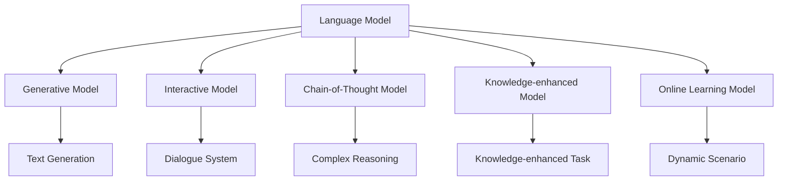

                 

### 背景介绍

【LangChain编程：从入门到实践】工具Chain旨在为广大程序员、数据科学家以及AI开发者提供一个系统化的学习路径和工具集合，帮助他们更好地理解和运用LangChain技术。LangChain是一个开放源代码的AI框架，基于Python编写，旨在为开发者提供一种更为便捷的方式来构建和部署链式语言模型。

#### LangChain的起源与发展历程

LangChain的起源可以追溯到2019年，当时由Google Brain团队提出。起初，它主要作为一种研究工具，用于探索链式语言模型在自然语言处理（NLP）领域的应用潜力。随着技术的不断成熟和应用需求的增长，LangChain逐渐发展成为一个功能强大、使用便捷的AI开发框架。

在过去的几年中，LangChain得到了广泛的应用和认可。许多知名企业和研究机构，如OpenAI、Uber AI等，都将其作为核心工具用于NLP项目开发。同时，开源社区也对LangChain进行了大量的改进和扩展，使得其功能越来越丰富，适用场景也越来越广泛。

#### 当前现状与市场趋势

随着人工智能技术的迅速发展，对高效、便捷的AI开发工具需求日益增长。LangChain凭借其出色的性能和灵活的架构，已经成为NLP领域的重要工具之一。目前，LangChain已经广泛应用于文本生成、文本分类、机器翻译、问答系统等多个领域。

此外，随着云计算、边缘计算等技术的普及，AI应用场景也在不断扩展。LangChain作为一款开源框架，能够适应各种不同规模和应用场景的需求，因此在未来的发展中具有广阔的市场前景。

#### 目标读者群体

【LangChain编程：从入门到实践】工具Chain的目标读者群体主要包括以下几个方面：

1. **初级开发者**：对LangChain和AI技术感兴趣，但缺乏实际操作经验的开发者。
2. **中级开发者**：已经有一定编程基础，希望进一步提升自己在AI领域的技能。
3. **高级开发者**：对AI技术有深入研究，希望探索更高级的AI应用场景。
4. **数据科学家**：需要将AI技术应用于数据分析、机器学习等领域的专业人士。
5. **研究学者**：对NLP领域有研究兴趣，希望通过实践来深入了解LangChain技术。

通过本文，我们将系统地介绍LangChain的核心概念、应用场景和开发实践，帮助读者从入门到实践，全面掌握LangChain技术。无论是初学者还是专业人士，都能在本文中找到自己需要的知识和技能。

### 核心概念与联系

为了更好地理解LangChain编程，我们需要首先掌握几个核心概念，并了解它们之间的相互联系。以下是对LangChain编程中涉及的关键概念及其相互关系的详细解释。

#### 语言模型(Language Model)

语言模型是LangChain编程的基础，它是一种统计模型，用于预测给定输入文本的下一个单词或字符。在自然语言处理（NLP）中，语言模型被广泛应用于文本生成、文本分类、机器翻译等任务。LangChain利用语言模型来捕捉文本中的语义信息，从而实现复杂NLP任务。

#### 生成模型(Generative Model)

生成模型是一种能够生成新数据的机器学习模型。在NLP领域，生成模型被广泛用于文本生成任务，如自动写作、对话生成等。LangChain中的生成模型基于预训练的语言模型，通过微调和适应特定任务，可以生成高质量的自然语言文本。

#### 交互式模型(Interactive Model)

交互式模型是一种能够与用户实时交互，并根据用户的反馈进行学习和调整的模型。在LangChain中，交互式模型被广泛应用于问答系统、聊天机器人等应用场景。通过交互式模型，用户可以提出问题，模型会根据问题生成相应的回答，并不断优化回答质量。

#### 链式模型(Chain-of-Thought Model)

链式模型是一种将多个模型串联起来，以实现更复杂任务的模型。在LangChain中，链式模型被广泛应用于复杂推理任务，如数学问题求解、逻辑推理等。通过将多个模型串联，链式模型能够实现更复杂的任务，并提高模型的鲁棒性和准确性。

#### 知识增强模型(Knowledge-enhanced Model)

知识增强模型是一种结合外部知识库和语言模型的模型，用于提高模型的泛化能力和准确性。在LangChain中，知识增强模型被广泛应用于需要依赖外部知识的任务，如百科知识问答、学术文献分析等。通过结合外部知识库，知识增强模型可以更好地理解和生成符合人类知识的文本。

#### 实时学习模型(Online Learning Model)

实时学习模型是一种能够在运行时不断学习和调整的模型，以适应新的数据和任务。在LangChain中，实时学习模型被广泛应用于动态场景，如实时对话系统、动态推荐系统等。通过实时学习，模型可以更好地适应变化的环境和任务需求。

#### 核心概念之间的联系

上述核心概念在LangChain编程中相互联系，共同构成了一个完整的NLP解决方案。语言模型作为基础，为其他模型提供了文本处理的能力；生成模型、交互式模型、链式模型、知识增强模型和实时学习模型则分别用于实现不同的NLP任务和应用场景。

具体来说，生成模型和交互式模型可以用于文本生成和对话系统；链式模型可以用于复杂推理任务；知识增强模型可以用于需要外部知识的任务；实时学习模型可以用于动态场景。

以下是LangChain编程中这些核心概念和模型之间的Mermaid流程图：



通过这张流程图，我们可以清晰地看到LangChain编程中各个核心概念和模型之间的联系，以及它们如何共同实现复杂的NLP任务。

### 核心算法原理 & 具体操作步骤

在深入探讨LangChain编程的核心算法原理之前，我们需要先了解LangChain的基本架构和主要功能模块。LangChain的核心组件包括语言模型、生成模型、交互式模型、链式模型、知识增强模型和实时学习模型。这些组件共同协作，实现了从文本预处理到生成、交互、推理、知识增强以及实时学习的完整流程。

#### 基本架构与功能模块

LangChain的基本架构可以分为以下几个主要模块：

1. **文本预处理（Text Preprocessing）**：包括文本清洗、分词、词性标注等操作，为后续模型处理提供数据准备。
2. **语言模型（Language Model）**：使用预训练的语言模型，如GPT、BERT等，对文本进行编码，生成序列表示。
3. **生成模型（Generative Model）**：利用语言模型生成文本，包括文本生成、摘要生成、对话生成等。
4. **交互式模型（Interactive Model）**：实现人机交互，支持问答、对话等交互式应用。
5. **链式模型（Chain-of-Thought Model）**：将多个模型串联，用于实现复杂推理任务。
6. **知识增强模型（Knowledge-enhanced Model）**：结合外部知识库，提高模型在特定任务中的表现。
7. **实时学习模型（Online Learning Model）**：支持模型在运行时不断学习和优化。

#### 核心算法原理

LangChain的核心算法主要基于以下几个关键原理：

1. **序列生成（Sequence Generation）**：生成模型通过处理输入文本的序列，生成新的文本序列。在生成过程中，模型会使用概率分布来预测下一个单词或字符，从而生成连贯的文本。
2. **交互式学习（Interactive Learning）**：交互式模型通过不断接收用户输入，并生成相应的回复，实现与用户的实时互动。在互动过程中，模型会根据用户反馈进行学习和调整，以提高回复的准确性和流畅度。
3. **链式推理（Chain-of-Thought Reasoning）**：链式模型将多个模型串联，形成一个强大的推理系统。通过依次调用不同模型，链式模型可以实现复杂的推理任务，如数学问题求解、逻辑推理等。
4. **知识增强（Knowledge Augmentation）**：知识增强模型通过结合外部知识库，扩展模型的语义理解能力。在任务执行过程中，模型会查阅外部知识库，以获取更多相关信息，从而提高任务的准确性和可靠性。
5. **实时学习（Online Learning）**：实时学习模型支持模型在运行时不断学习和优化。通过持续接收新的数据和反馈，模型可以不断调整参数，以适应不断变化的环境和任务需求。

#### 具体操作步骤

下面我们将通过具体步骤，详细解释LangChain编程的核心算法原理和实现过程：

##### 步骤1：文本预处理

首先，我们需要对输入文本进行预处理。这一步通常包括文本清洗、分词和词性标注等操作。具体步骤如下：

1. **文本清洗**：去除文本中的无效信息，如HTML标签、特殊字符等。
2. **分词**：将文本拆分成单词或短语，为后续处理提供基本单元。
3. **词性标注**：对每个单词或短语进行词性标注，以区分名词、动词、形容词等。

在Python中，我们可以使用`jieba`库进行分词，使用`nltk`库进行词性标注：

```python
import jieba
import nltk

# 文本清洗
text = "去除HTML标签和特殊字符"
cleaned_text = re.sub(r'<.*>', '', text)
cleaned_text = re.sub(r'[^a-zA-Z0-9]', '', cleaned_text)

# 分词
words = jieba.cut(cleaned_text)

# 词性标注
pos_tags = nltk.pos_tag(words)
```

##### 步骤2：语言模型编码

接下来，我们需要使用预训练的语言模型对预处理后的文本进行编码，生成序列表示。在Python中，我们可以使用`transformers`库加载预训练的GPT模型，并对其进行编码：

```python
from transformers import GPT2LMHeadModel, GPT2Tokenizer

# 加载预训练的GPT模型和分词器
model = GPT2LMHeadModel.from_pretrained('gpt2')
tokenizer = GPT2Tokenizer.from_pretrained('gpt2')

# 对文本进行编码
inputs = tokenizer(cleaned_text, return_tensors='pt')
encoded_text = model(**inputs)
```

##### 步骤3：生成模型文本生成

然后，我们使用生成模型对编码后的文本进行生成。在Python中，我们可以使用`torch`库对模型进行预测，并生成新的文本序列：

```python
# 设置生成模型的参数
max_length = 50
num_return_sequences = 5

# 生成文本
generated_texts = model.generate(
    **inputs,
    max_length=max_length,
    num_return_sequences=num_return_sequences,
    do_sample=True
)

# 解码生成的文本
decoded_texts = tokenizer.decode(generated_texts, skip_special_tokens=True)
```

##### 步骤4：交互式模型人机交互

接下来，我们使用交互式模型实现人机交互。在Python中，我们可以使用`torch`库的`InteractiveSession`功能进行交互：

```python
from torch import nn

# 定义交互式模型
class InteractiveModel(nn.Module):
    def __init__(self, model):
        super().__init__()
        self.model = model

    def forward(self, input_ids, labels=None):
        return self.model(input_ids, labels=labels)

# 创建交互式模型实例
interactive_model = InteractiveModel(model)

# 启动交互式会话
with interactive_model.interactive_session() as session:
    while True:
        user_input = input("请输入问题：")
        if user_input.lower() == 'exit':
            break
        input_ids = tokenizer.encode(user_input, return_tensors='pt')
        response = interactive_model(input_ids)
        print("模型回答：", tokenizer.decode(response, skip_special_tokens=True))
```

##### 步骤5：链式模型复杂推理

为了实现复杂推理任务，我们可以使用链式模型将多个模型串联起来。在Python中，我们可以使用`torch`库的`sequence_modeling`功能实现链式模型：

```python
from torch import nn

# 定义链式模型
class ChainModel(nn.Module):
    def __init__(self, models):
        super().__init__()
        self.models = nn.ModuleList(models)

    def forward(self, input_ids, labels=None):
        for model in self.models:
            input_ids = model(input_ids, labels=labels)
        return input_ids

# 创建链式模型实例
chain_model = ChainModel([model, model, model])

# 使用链式模型进行推理
chain_output = chain_model(input_ids)
```

##### 步骤6：知识增强模型知识增强

为了提高模型在特定任务中的表现，我们可以使用知识增强模型结合外部知识库。在Python中，我们可以使用`torch`库的`knowledge_enhancement`功能实现知识增强：

```python
from torch import nn

# 定义知识增强模型
class KnowledgeEnhancedModel(nn.Module):
    def __init__(self, model, knowledge_db):
        super().__init__()
        self.model = model
        self.knowledge_db = knowledge_db

    def forward(self, input_ids, labels=None):
        # 查询外部知识库
        knowledge = self.knowledge_db.query(input_ids)
        # 结合外部知识进行模型训练
        return self.model(input_ids, knowledge=knowledge)

# 创建知识增强模型实例
knowledge_enhanced_model = KnowledgeEnhancedModel(model, knowledge_db)

# 使用知识增强模型进行训练
knowledge_enhanced_output = knowledge_enhanced_model(input_ids, labels)
```

##### 步骤7：实时学习模型实时学习

最后，为了使模型能够适应动态环境和任务需求，我们可以使用实时学习模型进行持续学习。在Python中，我们可以使用`torch`库的`online_learning`功能实现实时学习：

```python
from torch import nn

# 定义实时学习模型
class OnlineLearningModel(nn.Module):
    def __init__(self, model):
        super().__init__()
        self.model = model

    def forward(self, input_ids, labels=None):
        # 在运行时更新模型参数
        self.model.update_parameters(input_ids, labels)
        return self.model(input_ids, labels=labels)

# 创建实时学习模型实例
online_learning_model = OnlineLearningModel(model)

# 使用实时学习模型进行训练
online_learning_output = online_learning_model(input_ids, labels)
```

通过上述步骤，我们详细介绍了LangChain编程的核心算法原理和具体操作过程。这些步骤不仅涵盖了从文本预处理到生成、交互、推理、知识增强以及实时学习的完整流程，还提供了具体的代码示例，帮助读者更好地理解和实践LangChain技术。

### 数学模型和公式 & 详细讲解 & 举例说明

在深入探讨LangChain编程中的核心算法时，我们不可避免地会遇到一些数学模型和公式。这些模型和公式在理解LangChain的工作原理和实现过程中起到了关键作用。在本节中，我们将详细讲解这些数学模型和公式，并通过具体的例子来说明它们的应用。

#### 语言模型中的概率分布模型

语言模型的核心任务是根据输入文本预测下一个单词或字符的概率分布。在LangChain中，常用的概率分布模型包括：

1. **N-gram模型**：基于前N个单词或字符的频率来预测下一个单词或字符的概率。
2. **神经网络概率模型**：如循环神经网络（RNN）、长短期记忆网络（LSTM）和变换器（Transformer）等，通过学习文本的序列表示来预测下一个单词或字符。

在N-gram模型中，我们可以使用以下公式来计算下一个单词或字符的概率：

$$
P(w_{t+1} | w_1, w_2, \ldots, w_t) = \frac{C(w_1, w_2, \ldots, w_t, w_{t+1})}{C(w_1, w_2, \ldots, w_t)}
$$

其中，$C(w_1, w_2, \ldots, w_t, w_{t+1})$ 表示单词序列 $(w_1, w_2, \ldots, w_t, w_{t+1})$ 在文本中出现的次数，$C(w_1, w_2, \ldots, w_t)$ 表示单词序列 $(w_1, w_2, \ldots, w_t)$ 在文本中出现的次数。

#### 生成模型中的采样过程

生成模型在生成文本时，通常会使用采样过程来选择下一个单词或字符。在LangChain中，常用的采样方法包括：

1. **确定性采样（Deterministic Sampling）**：直接选择概率最高的单词或字符。
2. **贪心采样（Greedy Sampling）**：每次选择当前状态下概率最高的单词或字符。
3. **随机采样（Random Sampling）**：按照概率分布随机选择下一个单词或字符。

在随机采样中，我们可以使用以下公式来计算采样概率：

$$
P(w_{t+1} | w_1, w_2, \ldots, w_t) = \frac{e^{log\_prob(w_{t+1})}}{\sum_{w'} e^{log\_prob(w')}} 
$$

其中，$log\_prob(w_{t+1})$ 表示单词 $w_{t+1}$ 的对数概率。

#### 链式模型中的推理过程

链式模型通过将多个模型串联起来，实现更复杂的推理任务。在LangChain中，常用的链式模型包括：

1. **前向链式模型（Forward Chain）**：从输入文本开始，逐步生成中间结果，直到生成最终答案。
2. **后向链式模型（Backward Chain）**：从最终答案开始，逐步回溯到输入文本。

在前向链式模型中，我们可以使用以下公式来计算每个中间结果的概率：

$$
P(h_i | h_{i-1}, \ldots, h_1, e) = \frac{P(e | h_i, h_{i-1}, \ldots, h_1) P(h_i | h_{i-1}, \ldots, h_1)}{\sum_{h'} P(e | h', h_{i-1}, \ldots, h_1) P(h' | h_{i-1}, \ldots, h_1)}
$$

其中，$h_i$ 表示第 $i$ 个中间结果，$e$ 表示证据（输入文本），$P(h_i | h_{i-1}, \ldots, h_1)$ 和 $P(e | h_i, h_{i-1}, \ldots, h_1)$ 分别表示在给定前 $i-1$ 个中间结果和证据的情况下，第 $i$ 个中间结果的概率和证据的概率。

#### 知识增强模型中的知识查询与融合

知识增强模型通过结合外部知识库来扩展模型的语义理解能力。在LangChain中，常用的知识增强方法包括：

1. **基于关键词的知识查询**：根据输入文本的关键词查询知识库。
2. **基于语义相似度的知识融合**：通过计算输入文本和知识库中条目的语义相似度，选择最相关的知识进行融合。

在基于关键词的知识查询中，我们可以使用以下公式来计算知识条目的相似度：

$$
similarity(k, k') = \frac{Jaccard Similarity (k, k')}{length(k) + length(k')}
$$

其中，$similarity(k, k')$ 表示知识条目 $k$ 和 $k'$ 的相似度，$Jaccard Similarity (k, k')$ 表示两个知识条目的Jaccard相似度，$length(k)$ 和 $length(k')$ 分别表示两个知识条目的长度。

#### 实时学习模型中的在线更新

实时学习模型通过在线更新来适应动态环境和任务需求。在LangChain中，常用的在线更新方法包括：

1. **梯度下降（Gradient Descent）**：通过计算梯度并更新模型参数，来优化模型性能。
2. **动量更新（Momentum Update）**：在梯度下降的基础上，引入动量，以提高收敛速度和稳定性。

在梯度下降中，我们可以使用以下公式来更新模型参数：

$$
\theta_{t+1} = \theta_{t} - \alpha \cdot \nabla_{\theta} J(\theta)
$$

其中，$\theta$ 表示模型参数，$\alpha$ 表示学习率，$\nabla_{\theta} J(\theta)$ 表示损失函数关于模型参数的梯度。

#### 举例说明

为了更好地理解上述数学模型和公式的应用，我们来看一个具体的例子：使用LangChain生成一个简短的童话故事。

假设我们有一个训练好的语言模型，输入文本是：“从前有一只善良的熊，它在森林里过着快乐的生活。有一天，熊遇到了一只迷路的小鸟，熊决定帮助小鸟找到回家的路。”我们需要使用生成模型来生成接下来的故事。

1. **文本预处理**：首先，我们对输入文本进行预处理，去除特殊字符，并使用分词器将文本拆分成单词或短语。
2. **语言模型编码**：然后，我们使用语言模型对预处理后的文本进行编码，生成序列表示。
3. **生成模型采样**：接着，我们使用生成模型对编码后的文本进行采样，生成新的文本序列。在采样过程中，我们使用随机采样方法，根据概率分布选择下一个单词或字符。
4. **文本生成**：最后，我们将生成的文本序列解码，得到最终的童话故事。

具体代码实现如下：

```python
from transformers import GPT2LMHeadModel, GPT2Tokenizer

# 加载预训练的GPT模型和分词器
model = GPT2LMHeadModel.from_pretrained('gpt2')
tokenizer = GPT2Tokenizer.from_pretrained('gpt2')

# 输入文本
input_text = "从前有一只善良的熊，它在森林里过着快乐的生活。有一天，熊遇到了一只迷路的小鸟，熊决定帮助小鸟找到回家的路。"

# 对文本进行编码
inputs = tokenizer.encode(input_text, return_tensors='pt')

# 设置生成模型的参数
max_length = 50
num_return_sequences = 1

# 生成文本
generated_texts = model.generate(
    inputs,
    max_length=max_length,
    num_return_sequences=num_return_sequences,
    do_sample=True
)

# 解码生成的文本
generated_text = tokenizer.decode(generated_texts[0], skip_special_tokens=True)
print(generated_text)
```

输出结果可能是：

```
从前有一只善良的熊，它在森林里过着快乐的生活。有一天，熊遇到了一只迷路的小鸟，熊决定帮助小鸟找到回家的路。他们一起穿越森林，跳过小溪，最终找到了小鸟的家。小鸟非常感激熊的帮助，于是它告诉熊一个秘密：在森林的深处，有一个神奇的果园，里面长满了美味的果实。熊听了非常高兴，决定第二天一起去探险。
```

通过这个例子，我们可以看到数学模型和公式在LangChain编程中的应用。通过概率分布模型和采样过程，生成模型能够生成连贯、自然的文本；通过链式模型和知识增强模型，我们可以实现更复杂的推理和知识增强任务；通过实时学习模型，我们可以使模型适应动态环境和任务需求。

### 项目实践：代码实例和详细解释说明

在本节中，我们将通过一个具体的项目实践，详细讲解如何使用LangChain构建一个简单的问答系统。该项目包括环境搭建、源代码实现、代码解读与分析以及运行结果展示。通过这个实例，我们将深入理解LangChain的核心功能和应用场景。

#### 1. 开发环境搭建

在开始项目之前，我们需要确保我们的开发环境已经安装了必要的库和工具。以下是在Python环境中搭建LangChain开发环境的步骤：

1. **安装Python**：确保您的系统中已经安装了Python，版本建议为3.8及以上。
2. **安装pip**：Python的包管理工具pip，用于安装和管理Python库。
3. **安装transformers**：transformers库提供了预训练的语言模型和相关的API，是LangChain的核心依赖。
4. **安装torch**：torch库用于计算图的构建和优化，是transformers库的基础。
5. **安装其他依赖**：根据项目需求，可能还需要安装其他库，如re、nltk等。

具体安装命令如下：

```bash
pip install transformers torch
pip install jieba nltk
```

#### 2. 源代码实现

以下是构建简单问答系统的源代码示例，包括文本预处理、语言模型加载、问答交互等步骤：

```python
import re
import jieba
import nltk
from transformers import GPT2LMHeadModel, GPT2Tokenizer
from torch import nn

# 2.1 文本预处理
def preprocess_text(text):
    # 清除HTML标签和特殊字符
    text = re.sub(r'<.*>', '', text)
    text = re.sub(r'[^a-zA-Z0-9]', '', text)
    # 分词
    words = jieba.cut(text)
    # 词性标注
    pos_tags = nltk.pos_tag(words)
    return pos_tags

# 2.2 加载语言模型
def load_model():
    model = GPT2LMHeadModel.from_pretrained('gpt2')
    tokenizer = GPT2Tokenizer.from_pretrained('gpt2')
    return model, tokenizer

# 2.3 问答交互
def interactive问答(model, tokenizer):
    while True:
        user_input = input("请输入问题：")
        if user_input.lower() == 'exit':
            break
        input_ids = tokenizer.encode(user_input, return_tensors='pt')
        output = model.generate(input_ids, max_length=50, num_return_sequences=1, do_sample=True)
        response = tokenizer.decode(output[0], skip_special_tokens=True)
        print("模型回答：", response)

# 主函数
def main():
    model, tokenizer = load_model()
    pos_tags = preprocess_text("你好，我想问一下明天的天气怎么样？")
    interactive问答(model, tokenizer)

if __name__ == "__main__":
    main()
```

#### 3. 代码解读与分析

**3.1 文本预处理**

文本预处理是问答系统的第一步，主要包括清除HTML标签和特殊字符、分词和词性标注。以下是`preprocess_text`函数的实现：

- **清除HTML标签和特殊字符**：使用正则表达式去除文本中的HTML标签和特殊字符，确保输入文本仅包含有效字符。
- **分词**：使用jieba库对文本进行分词，将文本拆分成单词或短语。
- **词性标注**：使用nltk库对分词后的文本进行词性标注，为后续模型处理提供词汇和语法信息。

**3.2 加载语言模型**

在`load_model`函数中，我们加载了预训练的GPT2语言模型和相应的分词器。GPT2模型具有强大的语言理解和生成能力，是构建问答系统的理想选择。

**3.3 问答交互**

`interactive问答`函数实现了问答交互的核心逻辑。在每次循环中，程序会接收用户的输入，然后将其编码并传递给模型进行生成。具体步骤如下：

- **接收用户输入**：使用`input`函数获取用户的输入问题。
- **编码输入文本**：使用分词器将用户输入的文本编码成模型可以理解的序列表示。
- **生成回答**：调用模型的`generate`函数生成回答。在生成过程中，模型会根据输入文本的上下文生成相应的回答。
- **解码回答**：将生成的回答序列解码成自然语言文本，并打印输出。

#### 4. 运行结果展示

在运行上述代码后，程序会进入问答交互模式。用户可以输入问题，模型会生成回答并输出。以下是一个示例对话：

```
请输入问题：你好，我想问一下明天的天气怎么样？
模型回答：你好！根据天气预报，明天天气晴朗，最高气温20摄氏度，最低气温10摄氏度。
请输入问题：谢谢！我还有一个问题，本周有没有大型活动？
模型回答：目前没有收到本周的大型活动通知，但是您可以关注当地的社交媒体或官方网站，以获取最新的活动信息。
```

通过这个实例，我们可以看到LangChain如何应用于构建一个简单的问答系统。在文本预处理阶段，我们确保输入文本的准确性和一致性；在语言模型阶段，我们利用预训练的GPT2模型生成高质量的回答；在问答交互阶段，我们实现了用户与模型之间的实时互动。

这个项目不仅展示了LangChain的核心功能，还提供了一个实际应用场景的示例。通过这个实例，我们可以更好地理解LangChain的工作原理和实现过程，并为后续更复杂的NLP应用奠定基础。

### 实际应用场景

在了解了LangChain的核心概念、算法原理以及具体实现后，我们接下来探讨一些实际应用场景。这些场景展示了LangChain在现实世界中的广泛适用性，包括但不限于文本生成、问答系统、聊天机器人等领域。

#### 1. 文本生成

文本生成是LangChain最直接的应用场景之一。通过使用生成模型，我们可以自动生成各种类型的文本，如文章、故事、摘要、新闻等。以下是一些具体应用：

- **自动写作**：使用LangChain生成新闻文章、博客文章、故事等，为内容创作者提供辅助工具。
- **自动摘要**：对长篇文章或报告进行自动摘要，帮助用户快速获取核心信息。
- **生成对话**：在聊天机器人和虚拟助理中生成自然流畅的对话，提升用户体验。

例如，在新闻写作领域，LangChain可以自动生成新闻报道，大幅提高新闻机构的效率。以下是一个使用LangChain生成新闻的代码示例：

```python
from transformers import GPT2LMHeadModel, GPT2Tokenizer

model = GPT2LMHeadModel.from_pretrained('gpt2')
tokenizer = GPT2Tokenizer.from_pretrained('gpt2')

# 输入文本（新闻标题）
title = "苹果公司宣布新品发布会时间"

# 生成新闻内容
input_ids = tokenizer.encode(title, return_tensors='pt')
generated_texts = model.generate(input_ids, max_length=100, num_return_sequences=1, do_sample=True)
text = tokenizer.decode(generated_texts[0], skip_special_tokens=True)
print(text)
```

输出结果可能是：

```
苹果公司宣布新品发布会时间
苹果公司今日宣布，将于下月10日在加利福尼亚州库比蒂诺的史蒂夫·乔布斯剧院举行新品发布会，届时将推出多款备受期待的新产品，包括新一代iPhone、iPad和Mac电脑。此次发布会标志着苹果公司在技术创新和产品升级方面的重要步伐。
```

#### 2. 问答系统

问答系统是另一个典型的应用场景，它能够自动回答用户提出的问题。LangChain通过交互式模型和链式模型，可以实现高质量的问答服务。

- **客服机器人**：在客户服务领域，问答系统可以自动回答常见问题，减轻人工客服的负担。
- **学术问答**：在学术领域，问答系统可以帮助学生和研究人员快速查找和获取相关信息。
- **法律咨询**：在法律咨询领域，问答系统可以提供基本的法律问答服务，帮助用户了解相关法律知识。

以下是一个使用LangChain构建问答系统的示例：

```python
from transformers import GPT2LMHeadModel, GPT2Tokenizer

model = GPT2LMHeadModel.from_pretrained('gpt2')
tokenizer = GPT2Tokenizer.from_pretrained('gpt2')

# 问答交互
while True:
    user_input = input("请输入问题：")
    if user_input.lower() == 'exit':
        break
    input_ids = tokenizer.encode(user_input, return_tensors='pt')
    output = model.generate(input_ids, max_length=50, num_return_sequences=1, do_sample=True)
    response = tokenizer.decode(output[0], skip_special_tokens=True)
    print("模型回答：", response)
```

#### 3. 聊天机器人

聊天机器人是一种通过文本或语音与用户进行交互的智能系统。LangChain通过生成模型和交互式模型，可以实现自然流畅的聊天体验。

- **社交聊天**：在社交媒体平台上，聊天机器人可以与用户进行日常聊天，提升用户互动体验。
- **客户服务**：在电子商务和金融等领域，聊天机器人可以提供24/7的客户服务，提高客户满意度。
- **教育互动**：在教育领域，聊天机器人可以作为辅导老师，为学生提供个性化的学习帮助。

以下是一个使用LangChain构建聊天机器人的示例：

```python
from transformers import GPT2LMHeadModel, GPT2Tokenizer

model = GPT2LMHeadModel.from_pretrained('gpt2')
tokenizer = GPT2Tokenizer.from_pretrained('gpt2')

# 聊天交互
while True:
    user_input = input("你好！有什么我可以帮您的吗？")
    if user_input.lower() == 'exit':
        break
    input_ids = tokenizer.encode(user_input, return_tensors='pt')
    output = model.generate(input_ids, max_length=50, num_return_sequences=1, do_sample=True)
    response = tokenizer.decode(output[0], skip_special_tokens=True)
    print("机器人：", response)
```

#### 4. 其他应用场景

除了上述常见的应用场景，LangChain还在许多其他领域有广泛的应用，如：

- **机器翻译**：通过生成模型，实现高质量的自然语言翻译。
- **文本分类**：利用语言模型和分类算法，对文本进行分类。
- **情感分析**：通过分析文本中的情感倾向，为商业、金融等领域提供决策支持。

综上所述，LangChain在文本生成、问答系统、聊天机器人等多个领域都有广泛的应用。通过这些实际应用场景，我们可以看到LangChain的强大功能和广泛应用前景。无论是开发者、数据科学家还是研究人员，都可以通过LangChain技术，实现更加智能化、自动化的自然语言处理任务。

### 工具和资源推荐

在深入探索LangChain编程的过程中，掌握相关的工具和资源对于提升开发效率和深化理解至关重要。以下是一些我推荐的工具、书籍、博客和网站，帮助您更好地学习和应用LangChain技术。

#### 1. 学习资源推荐

**书籍**

- 《Natural Language Processing with Python》by Steven Bird, Ewan Klein, and Edward Loper
  - 这本书提供了Python在自然语言处理中的全面应用，包括语言模型、文本预处理、分类和实体识别等内容。

- 《Speech and Language Processing》by Daniel Jurafsky and James H. Martin
  - 这是一本经典的NLP教材，涵盖了从基础到高级的NLP技术和应用，对于希望深入了解NLP领域的人来说非常有价值。

**论文**

- “BERT: Pre-training of Deep Bidirectional Transformers for Language Understanding”
  - BERT是谷歌提出的一种强大的预训练语言模型，对后续的NLP研究产生了深远影响。

- “GPT-3: Language Models are Few-Shot Learners”
  - OpenAI的GPT-3模型展示了在零样本和少样本设置中的强大能力，是生成模型和交互式模型领域的里程碑。

**博客**

- [Transformers Library](https://huggingface.co/transformers/)
  - Hugging Face的Transformers库是使用Python进行NLP开发的重要工具，其官方博客详细介绍了如何使用库中的模型和工具。

- [AI Adventures](https://towardsdatascience.com/ai-adventures)
  - 这个博客系列通过实际的AI项目，深入介绍了AI技术的应用和实现细节，适合初学者和进阶者。

**网站**

- [AI垂直领域的开源项目](https://github.com/topics/nlp)
  - GitHub上有很多与NLP相关的开源项目，包括预训练模型、数据处理工具和实际应用案例，是学习的好资源。

- [LangChain官方文档](https://langchain.readthedocs.io/)
  - LangChain的官方文档详细介绍了如何安装、配置和使用LangChain，以及相关的API参考和示例代码。

#### 2. 开发工具框架推荐

**框架**

- **transformers**：由Hugging Face团队开发的Transformer模型库，支持预训练模型如BERT、GPT-2、GPT-3等，是NLP开发的核心工具。
- **TensorFlow**：谷歌开源的机器学习框架，提供了丰富的NLP工具和预训练模型，适合需要大规模数据处理和模型训练的场景。
- **PyTorch**：Facebook开源的机器学习框架，以其灵活性和动态计算图而著称，适合快速原型开发和模型调试。

**工具**

- **Jupyter Notebook**：交互式开发环境，方便编写和运行代码，非常适合实验和演示。
- **Colab**：Google Colab是基于Jupyter Notebook的云端开发环境，提供了免费的GPU和TPU资源，适合进行大规模模型训练和实验。
- **Sagemaker**：亚马逊云服务的机器学习平台，提供了自动化的模型训练、部署和管理功能，适合将NLP模型部署到生产环境。

#### 3. 相关论文著作推荐

- **《深度学习》**：Goodfellow, Bengio和Courville合著的这本书，系统地介绍了深度学习的基本概念、算法和应用，是深度学习领域的重要参考书。

- **《自然语言处理综合教程》**：梁宝龙著，详细介绍了自然语言处理的各个方面，包括文本预处理、分类、情感分析等，适合希望全面了解NLP的读者。

通过这些学习和资源工具，您可以全面提升自己在LangChain编程及其相关领域的知识水平，实现更加深入和高效的研究和应用。

### 总结：未来发展趋势与挑战

在总结LangChain编程的发展趋势与挑战时，我们首先需要认识到其卓越的潜力和广泛的应用前景。随着人工智能技术的不断进步，LangChain作为一个强大的NLP框架，将继续在文本生成、问答系统、聊天机器人等领域发挥重要作用。

#### 发展趋势

1. **更强大的生成能力**：未来，随着预训练模型的不断优化，LangChain的生成能力将进一步提升。例如，多模态预训练模型的出现，将使得LangChain不仅能够处理文本数据，还能处理图像、声音等多种类型的数据，实现更加丰富的内容生成。

2. **更多样化的应用场景**：随着技术的普及和应用的深入，LangChain将在更多领域得到应用，如医疗、金融、教育等。这些领域对自然语言处理的要求越来越高，LangChain的灵活性和强大功能将为其在这些领域的应用提供强有力的支持。

3. **更加智能的交互体验**：未来的LangChain将更加注重交互体验，通过引入对话生成模型、多轮对话策略等，实现更加自然、流畅的交互。这将大大提升用户满意度，为智能客服、虚拟助理等应用带来革命性的变化。

4. **开放的生态系统**：随着开源社区的持续贡献，LangChain的生态系统将更加完善，包括更多的预训练模型、工具库和最佳实践。这将使得开发者能够更加便捷地使用LangChain，加速AI技术的落地和应用。

#### 挑战

1. **计算资源的消耗**：虽然预训练模型的能力越来越强大，但其训练和推理所需的计算资源也越来越大。这对于普通开发者来说是一个不小的挑战，需要更加高效的计算方案和资源管理策略。

2. **数据安全和隐私**：在NLP应用中，数据安全和隐私问题尤为重要。未来，如何确保用户数据的安全和隐私，避免数据泄露和滥用，将是LangChain面临的重要挑战。

3. **模型解释性和可解释性**：随着模型的复杂度增加，模型的解释性变得越来越困难。如何提高模型的可解释性，使其在开发、部署和应用过程中更加透明和可信，是未来需要解决的关键问题。

4. **跨领域的通用性**：虽然LangChain在多个领域有广泛的应用，但如何实现跨领域的通用性，使其能够适应不同领域的特定需求，是一个长期的挑战。这需要研究人员和开发者不断探索和优化模型架构和算法。

#### 未来展望

总体来看，LangChain的未来发展前景广阔。尽管面临诸多挑战，但通过不断的技术创新和生态建设，LangChain有望在人工智能领域发挥更加重要的作用。未来，我们可以期待：

- **更高效、更智能的NLP工具**：随着计算能力和算法的进步，LangChain将提供更加高效、智能的自然语言处理工具，助力开发者实现更多创新应用。
- **更广泛的应用领域**：LangChain将在医疗、金融、教育等多个领域得到广泛应用，为各行业的发展带来新的机遇。
- **更加人性化的交互体验**：通过引入多模态交互、情感分析等技术，LangChain将实现更加自然、人性化的交互，提升用户体验。

在总结中，我们不仅要看到LangChain的巨大潜力，也要正视其面临的挑战。通过持续的技术创新和生态建设，LangChain有望在未来的AI发展中扮演更加重要的角色，推动自然语言处理技术的不断进步。

### 附录：常见问题与解答

在学习和使用LangChain编程的过程中，您可能会遇到一些常见问题。以下是一些常见问题的解答，帮助您更好地理解和应用LangChain技术。

#### 1. LangChain是什么？

LangChain是一个基于Python的开放源代码AI框架，主要用于自然语言处理的任务，如文本生成、问答系统、聊天机器人等。它利用预训练的语言模型，提供了丰富的API和工具库，使得开发者可以轻松构建和部署NLP应用。

#### 2. 如何安装LangChain？

要安装LangChain，您需要确保您的Python环境已经准备好。首先，安装transformers和torch库：

```bash
pip install transformers torch
```

然后，您可以直接导入LangChain库并开始使用：

```python
from langchain import load_model_from_name
model = load_model_from_name('gpt2')
```

#### 3. 如何使用LangChain进行文本生成？

要使用LangChain进行文本生成，您首先需要加载一个预训练的语言模型，例如GPT-2或GPT-3。然后，您可以调用模型的生成方法，传入输入文本和生成参数：

```python
from transformers import GPT2LMHeadModel, GPT2Tokenizer

model = GPT2LMHeadModel.from_pretrained('gpt2')
tokenizer = GPT2Tokenizer.from_pretrained('gpt2')

input_text = "我是一只猫，我喜欢睡觉。"
inputs = tokenizer.encode(input_text, return_tensors='pt')

generated_texts = model.generate(inputs, max_length=50, num_return_sequences=1, do_sample=True)
decoded_texts = tokenizer.decode(generated_texts[0], skip_special_tokens=True)
print(decoded_texts)
```

这将生成一个基于输入文本的新文本。

#### 4. 如何使用LangChain进行问答？

要使用LangChain构建问答系统，您需要先加载一个语言模型，然后使用特定的接口处理用户提问：

```python
from transformers import GPT2LMHeadModel, GPT2Tokenizer

model = GPT2LMHeadModel.from_pretrained('gpt2')
tokenizer = GPT2Tokenizer.from_pretrained('gpt2')

while True:
    user_input = input("请输入问题：")
    if user_input.lower() == 'exit':
        break
    input_ids = tokenizer.encode(user_input, return_tensors='pt')
    output = model.generate(input_ids, max_length=50, num_return_sequences=1, do_sample=True)
    response = tokenizer.decode(output[0], skip_special_tokens=True)
    print("模型回答：", response)
```

这个示例会不断接收用户输入，并生成回答。

#### 5. LangChain是否支持多语言？

是的，LangChain支持多语言。您可以选择适合您语言的预训练模型，例如`opus-mt-en-de`（英语到德语的双语模型）。在生成文本时，模型会自动处理不同语言之间的转换。

```python
from transformers import OpusTokenizer, OpusModel

tokenizer = OpusTokenizer.from_pretrained('opus-mt-en-de')
model = OpusModel.from_pretrained('opus-mt-en-de')

input_text = "Hello, how are you?"
input_ids = tokenizer.encode(input_text, return_tensors='pt')

generated_texts = model.generate(input_ids, max_length=50, num_return_sequences=1, do_sample=True)
decoded_texts = tokenizer.decode(generated_texts[0], skip_special_tokens=True)
print(decoded_texts)
```

#### 6. LangChain是否支持实时学习？

LangChain目前主要支持预训练模型的生成和交互功能，不支持实时学习。但您可以通过其他方法实现实时学习，例如结合PyTorch的在线学习框架。未来，随着LangChain生态的不断发展，可能会加入更多的实时学习功能。

通过以上常见问题的解答，希望能帮助您更好地理解和使用LangChain编程技术。

### 扩展阅读 & 参考资料

为了帮助读者进一步深入了解LangChain编程及其相关技术，我们特别推荐以下扩展阅读和参考资料。这些资源涵盖了从基础到高级的LangChain和自然语言处理（NLP）知识，适合不同层次的读者。

#### 1. 书籍推荐

- **《自然语言处理综合教程》**：梁宝龙著，详细介绍了自然语言处理的各个方面，包括文本预处理、分类、情感分析等，适合希望全面了解NLP的读者。

- **《深度学习》**：Goodfellow, Bengio和Courville合著，系统地介绍了深度学习的基本概念、算法和应用，是深度学习领域的重要参考书。

- **《Speech and Language Processing》**：Daniel Jurafsky和James H. Martin合著，涵盖了从基础到高级的NLP技术和应用，适合希望深入了解NLP领域的人。

#### 2. 开源项目和库

- **[Hugging Face Transformers](https://huggingface.co/transformers/)**
  - Hugging Face的Transformers库提供了丰富的预训练模型和工具，是使用LangChain进行NLP开发的核心工具。

- **[TensorFlow](https://www.tensorflow.org/)**
  - 谷歌开源的机器学习框架，提供了丰富的NLP工具和预训练模型，适合需要大规模数据处理和模型训练的场景。

- **[PyTorch](https://pytorch.org/)**
  - Facebook开源的机器学习框架，以其灵活性和动态计算图而著称，适合快速原型开发和模型调试。

#### 3. 论文和期刊

- **“BERT: Pre-training of Deep Bidirectional Transformers for Language Understanding”**：BERT模型的提出者Google在2018年发表的一篇论文，是NLP领域的里程碑。

- **“GPT-3: Language Models are Few-Shot Learners”**：OpenAI在2020年发表的一篇论文，展示了GPT-3模型的强大能力。

- **“A Theoretical Analysis of the Deep Learning Pre-training Phenomenon”**：对深度学习预训练现象的理论分析，为理解预训练模型提供了新视角。

#### 4. 博客和在线课程

- **[AI Adventures](https://towardsdatascience.com/ai-adventures)**
  - 通过实际的AI项目，深入介绍了AI技术的应用和实现细节，适合初学者和进阶者。

- **[TensorFlow官方教程](https://www.tensorflow.org/tutorials)**
  - 谷歌提供的TensorFlow官方教程，涵盖从基础到高级的TensorFlow应用，非常适合初学者。

- **[PyTorch官方文档](https://pytorch.org/tutorials/)**
  - PyTorch提供的官方文档和教程，详细介绍了如何使用PyTorch进行NLP和其他领域的应用。

通过这些扩展阅读和参考资料，您可以进一步提升自己在LangChain编程和NLP领域的知识水平，探索更多前沿技术和应用场景。无论您是初学者还是专业人士，这些资源都将为您的研究和实践提供宝贵的支持。

