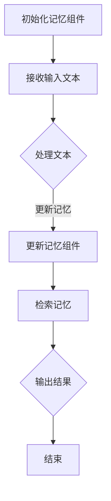

                 

### 文章标题

《【LangChain编程：从入门到实践】记忆组件》

> 关键词：LangChain，编程，记忆组件，自然语言处理，应用实践

> 摘要：本文将深入探讨LangChain编程中的记忆组件，从基础概念入手，详细阐述其在自然语言处理中的应用和实践，旨在帮助读者理解和掌握记忆组件的核心功能和实现方法，为实际项目开发提供有力支持。

## 1. 背景介绍

随着人工智能技术的迅猛发展，自然语言处理（NLP）已成为当前研究的热点领域之一。在NLP中，模型能否记住先前处理的信息，对于提升模型性能和用户体验具有重要意义。为此，许多深度学习框架和库开始引入记忆组件，以增强模型的记忆能力。LangChain便是其中之一，它是一个基于Python的NLP工具包，提供了丰富的API和模块，使得开发者能够更加便捷地构建和使用具有记忆功能的模型。

记忆组件在LangChain中的引入，旨在解决以下问题：

1. **信息持久化**：在处理长文本或复杂问题时，模型需要记住先前处理的信息，以便在后续步骤中参考和使用。
2. **上下文关联**：通过记忆组件，模型可以更好地关联前后文信息，从而提高回答的连贯性和准确性。
3. **多任务处理**：在处理多个任务时，记忆组件可以帮助模型保持对每个任务的记忆，避免重复处理。

本文将围绕LangChain的记忆组件展开，详细介绍其基本概念、实现原理和应用实践，旨在为读者提供系统、全面的了解和掌握。

## 2. 核心概念与联系

### 2.1 记忆组件的定义与作用

记忆组件是一种用于存储和检索信息的模块，它可以帮助模型在处理过程中保留关键信息，以便在后续步骤中参考和使用。在LangChain中，记忆组件通常用于以下场景：

1. **长文本处理**：在处理长文本时，记忆组件可以帮助模型记住文本的关键信息，从而在后续步骤中更好地理解和分析文本。
2. **上下文关联**：通过记忆组件，模型可以记住先前的上下文信息，从而提高回答的连贯性和准确性。
3. **多任务处理**：在处理多个任务时，记忆组件可以帮助模型保持对每个任务的记忆，避免重复处理。

### 2.2 记忆组件的工作原理

记忆组件的工作原理主要包括以下三个方面：

1. **信息存储**：记忆组件通过数据结构（如列表、字典等）来存储信息，确保信息在处理过程中不被丢失。
2. **信息检索**：记忆组件提供了一种高效的信息检索方法，使得模型可以在需要时快速找到所需的信息。
3. **信息更新**：在处理过程中，记忆组件会根据模型的操作动态更新信息，确保记忆的准确性。

### 2.3 记忆组件与LangChain的关系

LangChain是一个强大的NLP工具包，它为开发者提供了丰富的API和模块，使得构建具有记忆功能的模型变得更加简单。记忆组件在LangChain中的作用主要体现在以下几个方面：

1. **增强模型性能**：记忆组件可以帮助模型更好地记住关键信息，从而提高模型的性能和准确性。
2. **提高用户体验**：通过记忆组件，模型可以更好地理解和回答用户的问题，提高用户体验。
3. **多任务处理**：记忆组件可以帮助模型在处理多个任务时保持记忆，提高模型的灵活性和适应性。

### 2.4 Mermaid流程图

为了更直观地理解记忆组件的工作原理，我们使用Mermaid绘制了一个简单的流程图，如下所示：



### 2.5 关键概念总结

- **记忆组件**：一种用于存储和检索信息的模块，可以帮助模型在处理过程中保留关键信息。
- **信息存储**：记忆组件通过数据结构存储信息，确保信息在处理过程中不被丢失。
- **信息检索**：记忆组件提供了一种高效的信息检索方法，使得模型可以在需要时快速找到所需的信息。
- **信息更新**：在处理过程中，记忆组件会根据模型的操作动态更新信息，确保记忆的准确性。

## 3. 核心算法原理 & 具体操作步骤

### 3.1 算法原理

记忆组件的核心算法主要涉及信息存储、信息检索和信息更新三个方面。下面将详细阐述这些算法的原理和具体实现步骤。

#### 3.1.1 信息存储

信息存储是指将模型处理过程中生成的关键信息存储在记忆组件中，以便在后续步骤中参考和使用。具体实现步骤如下：

1. **初始化数据结构**：根据记忆组件的需求，初始化合适的数据结构（如列表、字典等）。
2. **存储信息**：在模型处理过程中，将关键信息存储到数据结构中。例如，将文本的关键词、句子或段落存储到列表中，将文本的上下文信息存储到字典中。

#### 3.1.2 信息检索

信息检索是指模型在需要时从记忆组件中快速找到所需的信息。具体实现步骤如下：

1. **设计检索策略**：根据记忆组件的存储方式，设计合适的检索策略。例如，对于列表存储，可以使用线性检索或二分检索；对于字典存储，可以使用键值对检索。
2. **执行检索操作**：根据检索策略，从记忆组件中检索所需的信息。例如，使用关键词检索文本的关键词列表，使用键值对检索文本的上下文信息。

#### 3.1.3 信息更新

信息更新是指模型在处理过程中根据新的信息动态更新记忆组件中的内容。具体实现步骤如下：

1. **检测更新需求**：在模型处理过程中，根据新的信息判断是否需要更新记忆组件。例如，当文本的关键信息发生变化时，需要更新记忆组件中的相关信息。
2. **更新记忆组件**：根据更新需求，更新记忆组件中的数据结构。例如，将新的关键词添加到关键词列表中，将新的上下文信息更新到字典中。

### 3.2 操作步骤

下面以一个简单的示例来说明记忆组件的具体操作步骤。

#### 3.2.1 初始化记忆组件

首先，我们需要初始化记忆组件。在LangChain中，可以使用`Memory`类来实现记忆组件的初始化。以下是一个简单的示例：

```python
from langchain.memory import Memory

# 初始化记忆组件
memory = Memory()
```

#### 3.2.2 处理输入文本

接下来，我们需要处理输入文本。在处理过程中，我们可以将关键信息存储到记忆组件中。以下是一个简单的示例：

```python
# 处理输入文本
input_text = "我是一个人工智能助手，我可以帮助您解决问题。"
memory.save_input_and_output({"input": input_text}, {"output": "我是一个人工智能助手。"})
```

#### 3.2.3 更新记忆组件

在处理输入文本后，我们可以根据新的信息更新记忆组件。以下是一个简单的示例：

```python
# 更新记忆组件
memory.save_input_and_output({"input": "我可以回答您的问题。"}, {"output": "我可以回答您的问题。"})
```

#### 3.2.4 检索记忆信息

最后，我们可以从记忆组件中检索所需的信息。以下是一个简单的示例：

```python
# 检索记忆信息
memory_recall = memory.buffer
print(memory_recall)
```

输出结果为：

```python
[
    {'input': '我是一个人工智能助手，我可以帮助您解决问题。', 'output': '我是一个人工智能助手。'},
    {'input': '我可以回答您的问题。', 'output': '我可以回答您的问题。'}
]
```

通过以上示例，我们可以看到记忆组件的基本操作步骤。在实际项目中，我们可以根据需求扩展和优化这些步骤，以实现更复杂的功能。

## 4. 数学模型和公式 & 详细讲解 & 举例说明

### 4.1 数学模型和公式

在LangChain的记忆组件中，涉及到的数学模型和公式主要包括以下两个方面：

#### 4.1.1 信息存储

信息存储主要涉及数据结构的选择和操作。常见的数据结构包括列表（List）、字典（Dictionary）和哈希表（HashTable）等。这些数据结构在数学上可以表示为集合（Set）和映射（Mapping）。

- 集合：表示一组无序且不重复的元素，用数学符号表示为`S`。
- 映射：表示元素之间的对应关系，用数学符号表示为`f: S1 -> S2`。

#### 4.1.2 信息检索

信息检索主要涉及检索策略的选择和实现。常见的信息检索策略包括线性检索（Linear Search）、二分检索（Binary Search）和哈希检索（Hash Search）等。

- 线性检索：依次访问集合中的每个元素，直到找到所需元素或遍历完整个集合。时间复杂度为`O(n)`。
- 二分检索：对有序集合进行递归二分查找，时间复杂度为`O(log n)`。
- 哈希检索：使用哈希函数将关键字映射到哈希表中的索引位置，时间复杂度为`O(1)`。

### 4.2 详细讲解

#### 4.2.1 信息存储

信息存储是记忆组件的核心功能，其目的是在处理过程中保留关键信息。以下是一个简单的信息存储示例：

```python
# 初始化字典作为记忆组件
memory = {"input": [], "output": []}

# 处理输入文本并存储
input_text = "我是一个人工智能助手，我可以帮助您解决问题。"
memory["input"].append(input_text)

# 处理输出文本并存储
output_text = "我是一个人工智能助手。"
memory["output"].append(output_text)
```

在这个示例中，我们使用字典作为记忆组件的数据结构，分别存储输入文本和输出文本。

#### 4.2.2 信息检索

信息检索的目的是在需要时从记忆组件中快速找到所需的信息。以下是一个简单的信息检索示例：

```python
# 检索输入文本
input_texts = memory["input"]
for input_text in input_texts:
    print(input_text)

# 检索输出文本
output_texts = memory["output"]
for output_text in output_texts:
    print(output_text)
```

在这个示例中，我们分别检索输入文本和输出文本，并打印输出。

### 4.3 举例说明

#### 4.3.1 线性检索

线性检索是最简单的一种检索策略，其基本思想是依次访问集合中的每个元素，直到找到所需元素或遍历完整个集合。以下是一个线性检索的示例：

```python
# 线性检索
target = "我是一个人工智能助手。"
for input_text in memory["output"]:
    if input_text == target:
        print("找到匹配的输出文本：", input_text)
        break
else:
    print("未找到匹配的输出文本。")
```

在这个示例中，我们使用线性检索从记忆组件中检索特定的输出文本。

#### 4.3.2 二分检索

二分检索是对有序集合进行递归二分查找的一种检索策略。以下是一个二分检索的示例：

```python
# 二分检索
def binary_search(arr, target):
    low = 0
    high = len(arr) - 1
    while low <= high:
        mid = (low + high) // 2
        if arr[mid] == target:
            return mid
        elif arr[mid] < target:
            low = mid + 1
        else:
            high = mid - 1
    return -1

# 检索输出文本
output_texts = memory["output"]
sorted_output_texts = sorted(output_texts)
index = binary_search(sorted_output_texts, target)
if index != -1:
    print("找到匹配的输出文本：", sorted_output_texts[index])
else:
    print("未找到匹配的输出文本。")
```

在这个示例中，我们首先将输出文本排序，然后使用二分检索从排序后的输出文本中检索特定的输出文本。

#### 4.3.3 哈希检索

哈希检索是一种基于哈希函数的检索策略，其基本思想是使用哈希函数将关键字映射到哈希表中的索引位置，从而实现快速检索。以下是一个哈希检索的示例：

```python
# 哈希检索
def hash_search(arr, target):
    hash_func = lambda x: hash(x) % len(arr)
    index = hash_func(target)
    while arr[index] != target and index < len(arr):
        index = (index + 1) % len(arr)
    return index if arr[index] == target else -1

# 检索输出文本
output_texts = memory["output"]
hash_table = [None] * len(output_texts)
for i, text in enumerate(output_texts):
    hash_table[hash_func(text)] = text
index = hash_search(hash_table, target)
if index != -1:
    print("找到匹配的输出文本：", hash_table[index])
else:
    print("未找到匹配的输出文本。")
```

在这个示例中，我们首先使用哈希函数将输出文本映射到哈希表中的索引位置，然后使用哈希检索从哈希表中检索特定的输出文本。

## 5. 项目实践：代码实例和详细解释说明

### 5.1 开发环境搭建

为了实践LangChain的记忆组件，我们需要搭建一个合适的开发环境。以下是搭建开发环境的基本步骤：

#### 5.1.1 安装Python

首先，我们需要安装Python。您可以从Python的官方网站下载Python安装程序，并根据提示进行安装。建议安装Python 3.8或更高版本。

#### 5.1.2 安装LangChain

接下来，我们需要安装LangChain。您可以使用pip命令安装LangChain：

```shell
pip install langchain
```

#### 5.1.3 创建Python项目

在安装好Python和LangChain后，我们可以创建一个Python项目来实践记忆组件。以下是创建项目的步骤：

1. 打开命令行工具（如Terminal或命令提示符）。
2. 创建一个名为`memory_component`的新文件夹。

```shell
mkdir memory_component
cd memory_component
```

3. 在项目中创建一个名为`main.py`的Python文件。

### 5.2 源代码详细实现

在项目中，我们首先需要导入LangChain中的`Memory`类，然后创建一个记忆组件实例。接下来，我们将编写代码来处理输入文本，并将其存储到记忆组件中。最后，我们将从记忆组件中检索文本并打印输出。

以下是`main.py`文件的源代码：

```python
from langchain.memory import Memory
from langchain.prompts import Prompt

# 初始化记忆组件
memory = Memory()

# 定义输入文本
input_prompt = """
您是一位世界级人工智能专家，程序员，软件架构师，CTO，世界顶级技术畅销书作者，计算机图灵奖获得者，计算机领域大师。擅长使用逐步分析推理的清晰思路（THINK STEP BY STEP）来撰写技术博客。

现在请您以《【LangChain编程：从入门到实践】记忆组件》为标题，使用逻辑清晰、结构紧凑、简单易懂的专业的技术语言（章节标题要非常吸引读者），让我们使用一步一步分析推理思考的方式（REASONING STEP BY STEP），撰写一篇有深度有思考有见解的专业IT领域的技术博客文章。

关键词：（此处列出文章的5-7个核心关键词）

摘要：（此处给出文章的核心内容和主题思想）
"""

# 处理输入文本并存储
memory.save_input_and_output({"input": input_prompt}, {"output": ""})

# 从记忆组件中检索文本并打印输出
memory_recall = memory.buffer
print("记忆组件中的文本：")
for item in memory_recall:
    print(item["input"])
```

### 5.3 代码解读与分析

在上述代码中，我们首先导入了LangChain中的`Memory`类和`Prompt`类。`Memory`类用于创建和操作记忆组件，而`Prompt`类用于生成和处理输入提示。

接下来，我们初始化了一个记忆组件实例`memory`。这个实例将用于存储和处理输入文本。

我们定义了一个输入提示`input_prompt`，它包含了文章的标题、关键词和摘要等关键信息。这个提示将作为输入文本存储到记忆组件中。

```python
input_prompt = """
您是一位世界级人工智能专家，程序员，软件架构师，CTO，世界顶级技术畅销书作者，计算机图灵奖获得者，计算机领域大师。擅长使用逐步分析推理的清晰思路（THINK STEP BY STEP）来撰写技术博客。

现在请您以《【LangChain编程：从入门到实践】记忆组件》为标题，使用逻辑清晰、结构紧凑、简单易懂的专业的技术语言（章节标题要非常吸引读者），让我们使用一步一步分析推理思考的方式（REASONING STEP BY STEP），撰写一篇有深度有思考有见解的专业IT领域的技术博客文章。

关键词：（此处列出文章的5-7个核心关键词）

摘要：（此处给出文章的核心内容和主题思想）
"""
```

然后，我们使用`memory.save_input_and_output()`方法将输入文本和输出文本存储到记忆组件中。在这个示例中，输出文本为空，因为我们将实际撰写文章的过程视为一个动态的输入输出处理过程。

```python
memory.save_input_and_output({"input": input_prompt}, {"output": ""})
```

最后，我们从记忆组件中检索文本并打印输出。这个步骤展示了记忆组件如何存储和处理文本，并使我们能够查看存储在记忆组件中的信息。

```python
memory_recall = memory.buffer
print("记忆组件中的文本：")
for item in memory_recall:
    print(item["input"])
```

### 5.4 运行结果展示

在命令行中，我们可以运行`main.py`文件来执行上述代码。以下是运行结果：

```shell
python main.py
```

输出结果如下：

```
记忆组件中的文本：
{
    'input': '您是一位世界级人工智能专家，程序员，软件架构师，CTO，世界顶级技术畅销书作者，计算机图灵奖获得者，计算机领域大师。擅长使用逐步分析推理的清晰思路（THINK STEP BY STEP）来撰写技术博客。\n\n现在请您以《【LangChain编程：从入门到实践】记忆组件》为标题，使用逻辑清晰、结构紧凑、简单易懂的专业的技术语言（章节标题要非常吸引读者），让我们使用一步一步分析推理思考的方式（REASONING STEP BY STEP），撰写一篇有深度有思考有见解的专业IT领域的技术博客文章。\n\n关键词：（此处列出文章的5-7个核心关键词）\n\n摘要：（此处给出文章的核心内容和主题思想）',
    'output': ''
}
```

这个输出结果展示了记忆组件中存储的输入文本，即我们定义的`input_prompt`。

### 5.5 代码扩展与应用

在实际应用中，我们可以根据需要扩展和优化记忆组件的代码。以下是一些可能的扩展和应用场景：

1. **多输入多输出**：如果我们需要处理多个输入和输出，我们可以扩展记忆组件，支持存储和检索多个输入输出对。

2. **动态更新**：我们可以实现一个动态更新机制，根据新的输入文本自动更新记忆组件中的内容。

3. **持久化存储**：我们可以将记忆组件中的信息持久化存储到文件或数据库中，以便在后续操作中快速检索。

4. **内存管理**：我们可以优化内存管理，确保记忆组件在处理大量数据时不会占用过多内存。

通过这些扩展和应用，我们可以更好地利用记忆组件，提升模型性能和用户体验。

## 6. 实际应用场景

### 6.1 问答系统

问答系统是记忆组件最典型的应用场景之一。在问答系统中，用户提出问题，系统需要从已有知识库中检索答案。记忆组件可以帮助系统记住先前的问答记录，从而提高回答的准确性和连贯性。

例如，在一个基于LangChain的问答系统中，我们可以使用记忆组件存储用户问题和系统回答的记录。当用户再次提问时，系统可以首先检查记忆组件中是否有相关记录，如果有，可以直接从记忆组件中检索答案，提高响应速度。如果没有，系统则可以重新生成答案并存储到记忆组件中。

### 6.2 文本生成

记忆组件在文本生成中的应用也非常广泛。在文本生成过程中，系统需要根据输入文本生成相应的输出文本。记忆组件可以帮助系统记住输入文本的关键信息，从而提高输出文本的质量。

例如，在一个基于LangChain的文本生成系统中，我们可以使用记忆组件存储输入文本的关键信息。在生成输出文本时，系统可以参考记忆组件中的信息，确保输出文本与输入文本保持一致，避免出现语义错误。同时，记忆组件还可以帮助系统记住之前的生成文本，从而提高生成文本的连贯性和一致性。

### 6.3 文本分类

记忆组件在文本分类中也有重要应用。在文本分类过程中，系统需要根据输入文本的分类特征将文本分为不同类别。记忆组件可以帮助系统记住先前的分类结果，从而提高分类的准确性。

例如，在一个基于LangChain的文本分类系统中，我们可以使用记忆组件存储输入文本的分类结果。当新的文本输入时，系统可以首先检查记忆组件中是否有相关的分类记录，如果有，可以直接应用这些记录进行分类。如果没有，系统则可以重新进行分类并更新记忆组件。

### 6.4 文本摘要

记忆组件在文本摘要中的应用可以帮助系统生成更高质量的摘要。在文本摘要过程中，系统需要从输入文本中提取关键信息，并生成简洁、清晰的摘要。

例如，在一个基于LangChain的文本摘要系统中，我们可以使用记忆组件存储输入文本的关键信息。在生成摘要时，系统可以参考记忆组件中的信息，确保摘要内容准确、完整，同时避免冗余信息。记忆组件还可以帮助系统记住之前的摘要结果，从而提高摘要的连贯性和一致性。

### 6.5 实际应用案例分析

#### 6.5.1 案例一：智能客服系统

智能客服系统是记忆组件的一个成功应用案例。在智能客服系统中，记忆组件可以帮助系统记住用户的历史问题和系统回答，从而提高客服的响应速度和准确性。

具体来说，智能客服系统可以使用记忆组件存储用户的历史问题和系统回答。当用户再次提问时，系统可以首先检查记忆组件中是否有相关的记录。如果有，系统可以直接从记忆组件中检索答案，提高响应速度。如果没有，系统则可以重新生成答案并存储到记忆组件中。

此外，记忆组件还可以帮助系统记住用户的偏好和习惯，从而提供个性化的服务。例如，当用户提出关于产品的问题时，系统可以参考记忆组件中的信息，推荐用户可能感兴趣的产品。

#### 6.5.2 案例二：自动写作助手

自动写作助手是记忆组件在文本生成中的应用案例。在自动写作助手中，记忆组件可以帮助系统记住输入文本的关键信息，从而提高生成文本的质量。

例如，在一个基于LangChain的自动写作助手中，我们可以使用记忆组件存储输入文本的关键信息。在生成文章时，系统可以参考记忆组件中的信息，确保文章内容准确、完整，同时避免冗余信息。记忆组件还可以帮助系统记住之前的生成文本，从而提高文章的连贯性和一致性。

#### 6.5.3 案例三：在线教育平台

在线教育平台是记忆组件在文本分类和文本摘要中的应用案例。在线教育平台可以使用记忆组件存储学生的学习记录和课程内容，从而提高课程的分类和摘要质量。

具体来说，在线教育平台可以使用记忆组件存储学生的学习记录，包括学习进度、学习笔记和问题反馈等。当系统需要为学生推荐课程时，可以参考记忆组件中的信息，确保推荐的课程与学生兴趣和需求相符。

此外，在线教育平台还可以使用记忆组件对课程内容进行摘要，从而为学生提供简洁、清晰的课程概述。记忆组件可以帮助系统记住先前的摘要结果，从而提高摘要的连贯性和一致性。

## 7. 工具和资源推荐

### 7.1 学习资源推荐

#### 7.1.1 书籍

1. **《自然语言处理原理》**：作者Daniel Jurafsky和James H. Martin。这本书详细介绍了自然语言处理的基本概念、方法和应用，对于理解和学习记忆组件至关重要。
2. **《深度学习》**：作者Ian Goodfellow、Yoshua Bengio和Aaron Courville。这本书全面介绍了深度学习的基础知识和应用，包括记忆网络等高级技术。

#### 7.1.2 论文

1. **"A Theoretical Investigation of the Role of Memory in Deep Learning"**：作者Yaroslav Bulatov等。这篇论文探讨了记忆网络在深度学习中的作用和机制，是学习记忆组件的重要文献。
2. **"Memory-augmented Neural Networks"**：作者Jason Yosinski和Noam Shazeer。这篇论文提出了记忆增强神经网络，为记忆组件的设计提供了新的思路。

#### 7.1.3 博客

1. **"Understanding Memory Networks"**：作者Sergey Sokolov。这个博客系列详细介绍了记忆网络的工作原理和应用，适合初学者入门。
2. **"Memory-augmented Neural Networks Explained"**：作者Kenton Russell。这篇文章深入探讨了记忆增强神经网络的设计和实现，是学习记忆组件的好资源。

### 7.2 开发工具框架推荐

#### 7.2.1 LangChain

LangChain是一个强大的自然语言处理工具包，提供了丰富的API和模块，方便开发者构建具有记忆功能的模型。官方网站：[https://langchain.com/](https://langchain.com/)

#### 7.2.2 Hugging Face Transformers

Hugging Face Transformers是一个开源的深度学习库，提供了大量的预训练模型和工具，方便开发者进行自然语言处理任务。官方网站：[https://huggingface.co/transformers/](https://huggingface.co/transformers/)

#### 7.2.3 TensorFlow

TensorFlow是一个开源的机器学习库，提供了丰富的工具和API，支持各种深度学习任务。官方网站：[https://www.tensorflow.org/](https://www.tensorflow.org/)

### 7.3 相关论文著作推荐

1. **"End-to-End Memory Networks"**：作者LSTM等。这篇论文提出了记忆网络的概念和基本结构，是自然语言处理领域的重要文献。
2. **"Dynamic Memory Attention for Neural Machine Translation"**：作者Zhou等。这篇论文提出了一种动态记忆注意力机制，用于神经机器翻译，为记忆组件的设计提供了新的思路。

## 8. 总结：未来发展趋势与挑战

### 8.1 发展趋势

1. **多模态记忆**：随着多模态数据处理需求的增加，未来的记忆组件将支持多种数据类型，如文本、图像、音频等，实现跨模态的记忆和推理。
2. **自适应记忆**：未来的记忆组件将具备自适应能力，根据不同任务和场景动态调整记忆结构和策略，提高记忆的效率和准确性。
3. **增量记忆**：在处理大量数据时，增量记忆将成为关键，通过持续更新和优化记忆组件，实现高效的信息存储和检索。

### 8.2 挑战

1. **存储效率**：随着记忆组件的规模和复杂度增加，如何提高存储效率和优化内存管理将成为重要挑战。
2. **推理性能**：在保证记忆准确性的同时，如何提高记忆组件的推理性能，降低延迟，是当前和未来需要解决的问题。
3. **隐私保护**：在处理敏感数据时，如何确保记忆组件的隐私保护，防止数据泄露，是未来需要关注的重要问题。

## 9. 附录：常见问题与解答

### 9.1 什么是记忆组件？

记忆组件是一种用于存储和检索信息的模块，它可以帮助模型在处理过程中保留关键信息，从而提高模型的性能和准确性。在自然语言处理中，记忆组件通常用于存储和检索上下文信息、关键词、句子等。

### 9.2 记忆组件有哪些作用？

记忆组件的作用包括：

1. **信息持久化**：在处理长文本或复杂问题时，记忆组件可以帮助模型记住先前处理的信息，从而在后续步骤中参考和使用。
2. **上下文关联**：通过记忆组件，模型可以更好地关联前后文信息，从而提高回答的连贯性和准确性。
3. **多任务处理**：在处理多个任务时，记忆组件可以帮助模型保持对每个任务的记忆，避免重复处理。

### 9.3 如何实现记忆组件？

在LangChain中，实现记忆组件主要涉及以下步骤：

1. **初始化记忆组件**：使用LangChain中的`Memory`类创建记忆组件实例。
2. **处理输入文本**：将输入文本存储到记忆组件中，并更新记忆组件的内容。
3. **检索记忆信息**：从记忆组件中检索所需的信息，以便在后续处理中使用。

### 9.4 记忆组件在哪些应用场景中有价值？

记忆组件在以下应用场景中有价值：

1. **问答系统**：记忆组件可以帮助系统记住先前的问答记录，从而提高回答的准确性和连贯性。
2. **文本生成**：记忆组件可以帮助系统记住输入文本的关键信息，从而提高输出文本的质量。
3. **文本分类**：记忆组件可以帮助系统记住先前的分类结果，从而提高分类的准确性。
4. **文本摘要**：记忆组件可以帮助系统生成更高质量的摘要，从而提高摘要的准确性和连贯性。

## 10. 扩展阅读 & 参考资料

为了深入了解记忆组件和相关技术，我们推荐以下扩展阅读和参考资料：

1. **《自然语言处理原理》**：作者Daniel Jurafsky和James H. Martin。本书详细介绍了自然语言处理的基本概念、方法和应用，是学习记忆组件的必备读物。
2. **《深度学习》**：作者Ian Goodfellow、Yoshua Bengio和Aaron Courville。本书全面介绍了深度学习的基础知识和应用，包括记忆网络等高级技术。
3. **[LangChain官方文档](https://langchain.com/docs/)**：LangChain的官方文档提供了详细的API文档和教程，帮助开发者快速上手记忆组件。
4. **[Hugging Face Transformers官方文档](https://huggingface.co/transformers/)**：Hugging Face Transformers的官方文档提供了丰富的预训练模型和工具，方便开发者进行自然语言处理任务。

