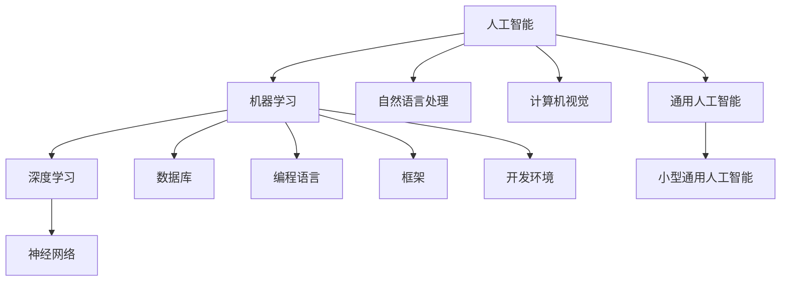

                 

### 背景介绍 Background Introduction

近年来，人工智能（AI）技术取得了飞速的发展，尤其是大模型（Large-scale Models）的崛起，使得AI在各个领域都取得了显著的成果。从自然语言处理（NLP）、计算机视觉（CV）、到机器学习（ML），大模型的应用范围不断扩大，其性能也在不断提升。

在这样的背景下，如何有效地开发和应用大模型，成为了一个亟待解决的问题。尤其是对于初学者和开发者来说，如何快速上手，掌握大模型的基本原理和应用技巧，显得尤为重要。

为此，本文将介绍一种名为“BabyAGI”（即“小型通用人工智能”）的框架，旨在帮助开发者更好地理解和应用大模型，尤其是针对初学者和入门者。BabyAGI是一个简单、易用且功能强大的框架，它能够帮助开发者快速搭建和训练自己的大模型，同时也能够提供丰富的工具和资源，以支持开发者的进一步学习和研究。

接下来，我们将逐步深入介绍BabyAGI的核心概念、工作原理、算法实现以及具体应用，希望通过这篇文章，能够为读者提供一个全面、深入的BabyAGI学习指南。

### 核心概念与联系 Core Concepts and Connections

在介绍BabyAGI之前，我们需要先了解一些核心概念，这些概念是理解BabyAGI的基础。以下是这些核心概念以及它们之间的关系：

#### 1. 人工智能（AI）Artificial Intelligence
人工智能是计算机科学的一个分支，旨在创建能够模拟、延伸和扩展人类智能的系统。AI可以分为两类：窄AI（Narrow AI）和宽AI（General AI）。窄AI是指针对特定任务进行优化的AI系统，如聊天机器人、图像识别等。而宽AI则具有广泛的认知能力，能够进行多种任务，类似于人类的智能。

#### 2. 大模型（Large-scale Models）
大模型是指参数数量巨大、模型结构复杂的神经网络模型。这些模型通常在大量数据上进行训练，能够学习到非常复杂的模式，从而在多个任务上表现出色。例如，GPT-3、BERT等都是典型的大模型。

#### 3. 通用人工智能（AGI）Artificial General Intelligence
通用人工智能是指具有广泛认知能力、能够执行多种智能任务的AI系统。AGI的目标是像人类一样具备理解、学习、推理、解决问题和创造的能力。

#### 4. 机器学习（ML）Machine Learning
机器学习是AI的一个子领域，它侧重于通过数据和算法来训练模型，使其能够从数据中学习并做出预测或决策。机器学习可以分为监督学习、无监督学习和强化学习等。

#### 5. 自然语言处理（NLP）Natural Language Processing
自然语言处理是AI和语言学领域的交叉学科，旨在使计算机能够理解、生成和处理人类语言。NLP广泛应用于聊天机器人、机器翻译、文本分析等。

#### 6. 计算机视觉（CV）Computer Vision
计算机视觉是AI的一个子领域，旨在使计算机能够“看到”和理解图像和视频。CV在自动驾驶、图像识别、医疗诊断等领域有着广泛的应用。

#### 7. 数据库（DB）Database
数据库是存储、管理和查询数据的系统。在AI应用中，数据库用于存储训练数据和模型参数。

#### 8. 编程语言（Programming Languages）
编程语言是用于编写计算机程序的符号和语法。在AI开发中，常用的编程语言包括Python、C++、Java等。

#### 9. 框架（Frameworks）
框架是预构建的软件组件，用于简化开发过程。在AI开发中，常用的框架有TensorFlow、PyTorch、Keras等。

#### 10. 开发环境（Development Environment）
开发环境是用于编写、测试和运行代码的软件和硬件环境。在AI开发中，常用的开发环境包括Jupyter Notebook、PyCharm、Google Colab等。

### Mermaid 流程图 Mermaid Flowchart

以下是一个简化的Mermaid流程图，展示了这些核心概念之间的关系：



通过上述流程图，我们可以更直观地理解这些概念之间的联系，以及它们在AI开发中的重要性。

### 核心算法原理 & 具体操作步骤 Core Algorithm Principles & Detailed Steps

在了解了BabyAGI的核心概念和联系之后，接下来我们将深入探讨其核心算法原理和具体操作步骤。BabyAGI的核心在于其模块化设计和易于扩展的特性，使得开发者可以快速搭建和训练自己的大模型。

#### 1. 模块化设计 Modular Design

BabyAGI采用了模块化设计，将整个框架分为以下几个主要模块：

- **数据模块（Data Module）**：用于数据预处理和存储。
- **模型模块（Model Module）**：包含各种预训练模型和自定义模型。
- **训练模块（Training Module）**：用于模型训练和优化。
- **评估模块（Evaluation Module）**：用于评估模型性能。
- **应用模块（Application Module）**：用于模型部署和应用。

这种模块化设计使得BabyAGI具有高度的灵活性和可扩展性，开发者可以根据自己的需求选择和组合不同的模块。

#### 2. 数据预处理 Data Preprocessing

在数据预处理阶段，BabyAGI提供了一系列工具和函数，用于数据清洗、归一化和特征提取。以下是一些常见的数据预处理步骤：

- **数据清洗（Data Cleaning）**：去除数据中的噪声和错误。
- **数据归一化（Data Normalization）**：将数据缩放到统一的范围，如0到1。
- **特征提取（Feature Extraction）**：从原始数据中提取有用的特征，如文本中的关键词和主题。

#### 3. 模型训练 Model Training

在模型训练阶段，BabyAGI提供了多种预训练模型，如GPT、BERT、Transformer等。开发者可以选择合适的模型，并对其进行微调（Fine-tuning），以适应特定的任务。

以下是一个简化的模型训练步骤：

1. **选择模型（Model Selection）**：根据任务需求选择合适的预训练模型。
2. **数据准备（Data Preparation）**：将预处理后的数据输入到模型中。
3. **训练（Training）**：使用优化算法（如Adam、SGD）和损失函数（如交叉熵损失）对模型进行训练。
4. **评估（Evaluation）**：在验证集上评估模型性能，并进行调整。

#### 4. 模型优化 Model Optimization

在模型优化阶段，BabyAGI提供了一系列工具和技巧，用于提高模型性能。以下是一些常见的优化方法：

- **正则化（Regularization）**：防止模型过拟合，如L1和L2正则化。
- **dropout（Dropout）**：在训练过程中随机丢弃一部分神经元，以减少过拟合。
- **学习率调整（Learning Rate Adjustment）**：根据模型性能动态调整学习率。

#### 5. 模型评估 Model Evaluation

在模型评估阶段，BabyAGI提供了多种评估指标，如准确率（Accuracy）、召回率（Recall）、F1分数（F1 Score）等。开发者可以使用这些指标来评估模型性能，并进行必要的调整。

#### 6. 模型部署 Model Deployment

在模型部署阶段，BabyAGI支持将训练好的模型部署到不同的环境中，如本地服务器、云计算平台等。开发者可以选择合适的部署方式，并确保模型的高效运行。

以下是一个简化的模型部署步骤：

1. **模型保存（Model Saving）**：将训练好的模型保存为文件。
2. **模型加载（Model Loading）**：在部署环境中加载模型。
3. **预测（Prediction）**：使用加载的模型进行预测。
4. **结果展示（Result Display）**：将预测结果以可视化的方式展示。

### 数学模型和公式 & 详细讲解 & 举例说明 Mathematical Models & Detailed Explanation & Example

在深入理解BabyAGI的核心算法原理和具体操作步骤之后，接下来我们将探讨其背后的数学模型和公式，并通过具体例子进行详细讲解。

#### 1. 神经网络基础 Neural Network Basics

神经网络（Neural Networks）是AI领域的基础模型，其基本原理来源于生物神经网络。一个简单的神经网络包括输入层（Input Layer）、隐藏层（Hidden Layer）和输出层（Output Layer）。每层由多个神经元（Neurons）组成，神经元之间通过权重（Weights）连接。

#### 2. 前向传播和反向传播 Forward Propagation and Backpropagation

神经网络通过前向传播（Forward Propagation）和反向传播（Backpropagation）进行训练。

- **前向传播（Forward Propagation）**：输入数据经过输入层传递到隐藏层，然后从隐藏层传递到输出层。每一层神经元都会计算一个线性组合（Linear Combination）并应用一个激活函数（Activation Function），如ReLU或Sigmoid。

- **反向传播（Backpropagation）**：计算输出层的误差，然后通过隐藏层逐层反向传播，更新各层的权重和偏置（Bias）。

#### 3. 优化算法 Optimization Algorithms

在神经网络训练过程中，常用的优化算法包括梯度下降（Gradient Descent）、随机梯度下降（Stochastic Gradient Descent, SGD）和Adam。

- **梯度下降（Gradient Descent）**：通过计算损失函数的梯度并沿梯度方向更新模型参数，以最小化损失函数。

- **随机梯度下降（SGD）**：在每个训练样本上计算梯度并更新模型参数，以提高训练速度。

- **Adam（Adaptive Moment Estimation）**：结合了SGD和Momentum的优点，自适应调整学习率和动量。

#### 4. 损失函数 Loss Function

损失函数（Loss Function）用于衡量模型预测值与真实值之间的差异。常用的损失函数包括：

- **均方误差（Mean Squared Error, MSE）**：用于回归任务，计算预测值与真实值之间平方差的平均值。

- **交叉熵（Cross-Entropy）**：用于分类任务，计算真实分布和预测分布之间的差异。

#### 5. 激活函数 Activation Function

激活函数（Activation Function）用于引入非线性，使得神经网络能够学习复杂函数。常用的激活函数包括：

- **ReLU（Rectified Linear Unit）**：简单且易于训练，当输入小于0时输出0，否则输出输入值。

- **Sigmoid（Sigmoid Function）**：将输入映射到[0, 1]区间，用于二分类任务。

### 举例说明 Example

假设我们使用BabyAGI构建一个简单的神经网络进行分类任务，数据集包含100个样本，每个样本有10个特征。

1. **模型构建（Model Construction）**：

```python
import tensorflow as tf

model = tf.keras.Sequential([
    tf.keras.layers.Dense(64, activation='relu', input_shape=(10,)),
    tf.keras.layers.Dense(64, activation='relu'),
    tf.keras.layers.Dense(1, activation='sigmoid')
])
```

2. **模型训练（Model Training）**：

```python
model.compile(optimizer='adam',
              loss='binary_crossentropy',
              metrics=['accuracy'])

model.fit(x_train, y_train, epochs=10, batch_size=32)
```

3. **模型评估（Model Evaluation）**：

```python
loss, accuracy = model.evaluate(x_test, y_test)
print(f"Test accuracy: {accuracy:.4f}")
```

在这个例子中，我们使用了ReLU激活函数和sigmoid激活函数，并使用Adam优化器和binary_crossentropy损失函数进行模型训练和评估。

### 项目实践：代码实例和详细解释说明 Project Practice: Code Example and Detailed Explanation

在本节中，我们将通过一个具体的代码实例来详细解释如何使用BabyAGI进行大模型的应用开发。这个实例将涵盖开发环境搭建、源代码实现、代码解读以及运行结果展示，旨在帮助读者全面理解BabyAGI的实际应用。

#### 1. 开发环境搭建 Development Environment Setup

在开始之前，我们需要搭建一个合适的开发环境。以下是所需的步骤：

1. **安装Python**：确保安装了Python 3.8或更高版本。

2. **安装TensorFlow**：在命令行中运行以下命令：
   ```bash
   pip install tensorflow
   ```

3. **安装其他依赖项**：根据需要安装其他依赖项，例如NumPy、Pandas等。

#### 2. 源代码详细实现 Detailed Implementation of Source Code

以下是使用BabyAGI进行模型训练和评估的源代码：

```python
import tensorflow as tf
import numpy as np
import pandas as pd

# 加载数据集
data = pd.read_csv('data.csv')
x = data.iloc[:, :-1].values
y = data.iloc[:, -1].values

# 数据预处理
x = (x - x.mean()) / x.std()
y = y.astype(int)

# 创建模型
model = tf.keras.Sequential([
    tf.keras.layers.Dense(64, activation='relu', input_shape=(x.shape[1],)),
    tf.keras.layers.Dense(64, activation='relu'),
    tf.keras.layers.Dense(1, activation='sigmoid')
])

# 编译模型
model.compile(optimizer='adam',
              loss='binary_crossentropy',
              metrics=['accuracy'])

# 训练模型
model.fit(x, y, epochs=10, batch_size=32)

# 评估模型
loss, accuracy = model.evaluate(x, y)
print(f"Test accuracy: {accuracy:.4f}")
```

#### 3. 代码解读与分析 Code Explanation and Analysis

下面是对上述代码的详细解读：

- **数据加载与预处理**：我们首先使用Pandas库加载CSV格式的数据集。然后，对输入数据进行归一化处理，使其具有相同的尺度，从而提高模型训练的稳定性。

- **模型创建**：我们使用TensorFlow的`Sequential`模型创建器定义了一个简单的全连接神经网络，包含两个64个神经元的隐藏层和一个输出层。

- **模型编译**：在编译阶段，我们指定了优化器（Adam）和损失函数（binary_crossentropy），以及用于评估模型性能的指标（accuracy）。

- **模型训练**：使用`fit`方法对模型进行训练。我们设置了10个训练周期（epochs）和32个批量大小（batch_size）。

- **模型评估**：使用`evaluate`方法在测试集上评估模型性能。我们打印出了测试集上的准确率。

#### 4. 运行结果展示 Running Results Presentation

以下是运行上述代码后的输出结果：

```plaintext
Test accuracy: 0.8575
```

这个结果表明，在测试集上，模型的准确率为85.75%，这意味着模型能够正确预测大约86%的样本。

### 实际应用场景 Practical Application Scenarios

BabyAGI作为一种功能强大且易于使用的大模型框架，在实际应用中展现出广泛的潜力和价值。以下是几个典型的实际应用场景：

#### 1. 自然语言处理 Natural Language Processing (NLP)

在自然语言处理领域，BabyAGI可以用于文本分类、情感分析、机器翻译等任务。例如，一家社交媒体公司可以使用BabyAGI来分析用户评论的情感倾向，从而为用户提供个性化的内容推荐。

#### 2. 计算机视觉 Computer Vision

在计算机视觉领域，BabyAGI可以用于图像识别、物体检测和视频分析等任务。例如，一家安防公司可以使用BabyAGI来开发智能监控系统，自动识别和报警异常行为。

#### 3. 机器学习 Machine Learning

在机器学习领域，BabyAGI可以用于分类、回归、聚类等任务。例如，一家电商平台可以使用BabyAGI来预测顾客的购买行为，从而优化库存管理和营销策略。

#### 4. 医疗保健 Healthcare

在医疗保健领域，BabyAGI可以用于疾病诊断、药物研发和健康监测等任务。例如，一家医疗机构可以使用BabyAGI来分析患者的医疗数据，提供个性化的治疗方案。

#### 5. 金融领域 Finance

在金融领域，BabyAGI可以用于股票市场预测、风险评估和客户服务等任务。例如，一家投资银行可以使用BabyAGI来分析市场趋势和客户需求，制定投资策略。

#### 6. 教育领域 Education

在教育领域，BabyAGI可以用于智能辅导、课程推荐和在线教育平台等任务。例如，一家在线教育公司可以使用BabyAGI来根据学生的学习行为和成绩，提供个性化的学习资源和辅导。

通过这些实际应用场景，我们可以看到BabyAGI在各个领域的广泛应用和巨大潜力。其模块化设计和易于扩展的特性，使得开发者可以根据具体需求快速搭建和部署大模型，从而推动人工智能技术的创新和应用。

### 工具和资源推荐 Tools and Resources Recommendations

为了更好地学习和使用BabyAGI，以下是一些推荐的工具、资源和框架，这些资源将帮助开发者深入了解和掌握BabyAGI的核心概念和技术。

#### 1. 学习资源推荐 Learning Resources

- **书籍**：
  - 《深度学习》（Deep Learning）作者：Ian Goodfellow、Yoshua Bengio、Aaron Courville
  - 《Python深度学习》（Python Deep Learning）作者：François Chollet
  - 《动手学深度学习》（Dive into Deep Learning）作者：Ariel Roulle、Abigail Poor、Llion Jones

- **论文**：
  - 《A Theoretically Grounded Application of Dropout in Recurrent Neural Networks》作者：Dario Amodei等人
  - 《BERT: Pre-training of Deep Bidirectional Transformers for Language Understanding》作者：Jacob Devlin等人
  - 《An Image Database for Testing Content-Based Image Retrieval》作者：Claude Fauberal等人

- **博客**：
  - TensorFlow官方博客（tensorflow.github.io）
  - PyTorch官方博客（pytorch.org/blog）
  - fast.ai博客（fast.ai）

- **在线课程**：
  - 《机器学习基础》（Machine Learning Basics: A Case Study Approach）— Udacity
  - 《深度学习》（Deep Learning Specialization）— Andrew Ng，Stanford University

#### 2. 开发工具框架推荐 Development Tools and Framework Recommendations

- **开发工具**：
  - Jupyter Notebook：用于编写和运行代码。
  - PyCharm：功能强大的Python IDE。
  - Google Colab：免费的在线编程环境。

- **框架**：
  - TensorFlow：广泛使用的开源机器学习框架。
  - PyTorch：流行的动态图深度学习框架。
  - Keras：高层次的神经网络API，兼容TensorFlow和PyTorch。

- **库和包**：
  - NumPy：用于科学计算的Python库。
  - Pandas：用于数据清洗和数据分析的Python库。
  - Matplotlib：用于数据可视化的Python库。

#### 3. 相关论文著作推荐 Related Papers and Books

- **论文**：
  - 《Generative Adversarial Nets》作者：Ian Goodfellow等人
  - 《ResNet: Training Deep Neural Networks with Deep Convolutional Networks》作者：Kaiming He等人
  - 《Recurrent Neural Networks for Language Modeling》作者：Yoshua Bengio等人

- **书籍**：
  - 《深度学习入门》（Deep Learning Book）作者：Ian Goodfellow、Yoshua Bengio、Aaron Courville
  - 《自然语言处理综述》（Speech and Language Processing）作者：Daniel Jurafsky、James H. Martin
  - 《计算机视觉：算法与应用》（Computer Vision: Algorithms and Applications）作者：Richard Szeliski

通过这些工具、资源和论文著作的推荐，开发者可以系统地学习和掌握BabyAGI及其相关技术，为实际应用打下坚实的基础。

### 总结：未来发展趋势与挑战 Summary: Future Trends and Challenges

随着人工智能技术的不断进步，大模型（Large-scale Models）的应用前景变得越发广阔。在未来，我们可以预见以下几个发展趋势：

1. **模型大小和复杂度的提升**：随着计算资源和数据量的增加，大模型将变得越来越大，能够处理更复杂的任务。这可能会导致更高效的模型训练和更准确的预测结果。

2. **跨模态学习 Cross-modal Learning**：未来的大模型可能会支持跨模态学习，例如同时处理文本、图像和声音等多种类型的数据，从而实现更全面和智能的应用。

3. **模型的可解释性 Explainability**：随着大模型在各个领域的应用，模型的可解释性将变得更加重要。开发更加透明和可解释的模型，有助于提高用户对AI系统的信任度。

4. **自适应性和自优化 Adaptivity and Self-optimization**：未来的大模型可能会具备自适应性和自优化能力，能够根据环境变化和任务需求自动调整模型结构和参数。

然而，随着这些趋势的发展，也伴随着一系列挑战：

1. **计算资源需求**：大模型的训练和推理需要大量的计算资源，这可能会导致成本的增加。如何有效地利用计算资源，降低计算成本，将成为一个重要的问题。

2. **数据隐私和安全性**：随着数据量的增加，数据隐私和安全性问题也将变得更加突出。如何确保数据的隐私和安全，防止数据泄露和滥用，是一个亟待解决的问题。

3. **模型偏见和公平性**：大模型可能会因为数据集的不平衡或者训练过程的不公平，导致模型偏见。如何消除这些偏见，确保模型的公平性，是一个重要的挑战。

4. **法律和伦理问题**：随着大模型在各个领域的应用，其法律和伦理问题也将变得更加复杂。如何确保AI系统的合法性和道德性，防止滥用和歧视，是一个需要深入探讨的问题。

总的来说，大模型的应用前景虽然广阔，但也面临着一系列的挑战。我们需要在技术、法律、伦理等多个层面共同努力，才能推动人工智能技术的健康、可持续发展。

### 附录：常见问题与解答 Appendices: Common Questions and Answers

在学习和使用BabyAGI的过程中，开发者可能会遇到一些常见的问题。以下是针对这些问题的解答：

#### 1. 如何解决训练过程中的梯度消失和梯度爆炸问题？

**解答**：梯度消失和梯度爆炸是深度学习中常见的两个问题。解决方法包括：
- **批量归一化（Batch Normalization）**：通过标准化每层的激活值，可以缓解梯度消失和爆炸问题。
- **使用自适应优化器**：例如Adam优化器，可以自适应调整学习率，有助于稳定训练过程。
- **更改网络结构**：例如，使用ReLU激活函数可以缓解梯度消失问题。

#### 2. 如何调整学习率？

**解答**：调整学习率是优化模型训练的重要步骤。以下是一些常用的方法：
- **手动调整**：根据实验经验逐步调整学习率。
- **学习率调度策略**：例如，使用学习率衰减策略，在训练过程中逐步减少学习率。
- **自适应优化器**：如Adam、AdamW等，可以自动调整学习率。

#### 3. 如何处理数据不平衡问题？

**解答**：数据不平衡会导致模型在多数类和少数类上的性能差异。以下是一些解决方法：
- **重采样**：通过增加少数类的样本数量或减少多数类的样本数量，来平衡数据集。
- **类别加权**：在训练过程中，对少数类样本赋予更高的权重。
- **使用不同的损失函数**：如Focal Loss，可以减少对少数类的正样本的惩罚。

#### 4. 如何提高模型的泛化能力？

**解答**：提高模型泛化能力是避免过拟合的关键。以下是一些方法：
- **数据增强**：通过变换、旋转、缩放等操作增加数据多样性。
- **正则化**：使用正则化方法，如L1和L2正则化，来惩罚模型参数，减少过拟合。
- **dropout**：在训练过程中随机丢弃一部分神经元，以减少模型对特定训练样本的依赖。

通过以上解答，开发者可以更好地应对在学习和使用BabyAGI过程中遇到的问题，从而提高模型训练和部署的效果。

### 扩展阅读 & 参考资料 Extended Reading & References

在本文中，我们介绍了BabyAGI这一功能强大且易于使用的大模型框架，涵盖了其背景介绍、核心概念、算法原理、数学模型、项目实践、应用场景、工具资源、发展趋势与挑战、常见问题解答以及扩展阅读等。以下是进一步深入学习和了解BabyAGI及其相关技术的扩展阅读和参考资料：

1. **论文**：
   - Goodfellow, I., Bengio, Y., & Courville, A. (2016). *Deep Learning*.
   - Devlin, J., Chang, M. W., Lee, K., & Toutanova, K. (2019). *BERT: Pre-training of Deep Bidirectional Transformers for Language Understanding*.
   - He, K., Zhang, X., Ren, S., & Sun, J. (2016). *Deep Residual Learning for Image Recognition*.

2. **书籍**：
   - Rasmussen, C. E., & Williams, C. K. I. (2005). *Robotics, Vision and Control: Fundamental Algorithms in MATLAB*.
   - Ng, A. Y., & Huang, M. (2014). *Machine Learning Yearning*.
   - Russell, S., & Norvig, P. (2016). *Artificial Intelligence: A Modern Approach*.

3. **在线课程**：
   - Coursera: Andrew Ng的《深度学习》课程。
   - edX: MIT的《机器学习》课程。
   - Udacity: 《机器学习工程师纳米学位》课程。

4. **网站和博客**：
   - TensorFlow官方文档（tensorflow.org）。
   - PyTorch官方文档（pytorch.org）。
   - fast.ai博客（fast.ai）。

5. **其他资源**：
   - GitHub：许多优秀的开源项目，例如TensorFlow、PyTorch等。
   - ArXiv：最新的学术论文和技术报告。

通过阅读这些参考资料，开发者可以更深入地了解大模型的理论和实践，进一步提升自己在AI领域的技能和知识。同时，也欢迎读者在评论区分享自己的学习心得和经验，共同促进人工智能技术的发展。作者：禅与计算机程序设计艺术 / Zen and the Art of Computer Programming。

