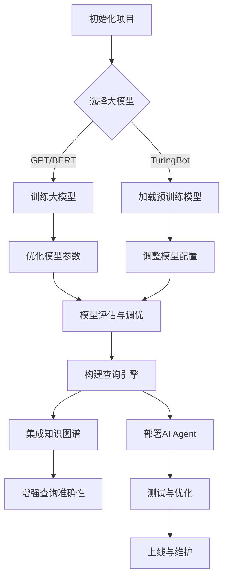

                 

### 文章标题

【大模型应用开发 动手做AI Agent】构建查询引擎和工具

> **关键词**：大模型应用、AI Agent、查询引擎、工具开发、编程实践

> **摘要**：本文将深入探讨大模型在AI Agent开发中的应用，通过构建查询引擎和工具，展示如何利用先进的人工智能技术实现智能查询系统。文章将从背景介绍、核心概念、算法原理、数学模型、项目实践、实际应用、工具推荐等多个角度，详细讲解大模型应用开发的步骤和要点，旨在为读者提供一份全面而实用的技术指南。

---

### 1. 背景介绍

随着人工智能技术的飞速发展，大模型在各个领域的应用越来越广泛。从自然语言处理到图像识别，从推荐系统到决策支持系统，大模型展现出了强大的计算能力和灵活性。然而，如何将这些大模型有效地应用于实际项目中，尤其是构建高效的查询引擎和工具，成为了一个热门的研究方向。

AI Agent作为一种智能体，能够自主地执行任务、与用户交互，并在复杂的动态环境中做出决策。构建一个强大的AI Agent需要综合运用多种技术，包括深度学习、自然语言处理、知识图谱等。而查询引擎和工具则是AI Agent的核心组成部分，它们决定了Agent能否高效、准确地获取和处理信息。

本文将重点探讨如何利用大模型构建查询引擎和工具，通过实际项目实践，展示从设计到实现的完整过程。文章结构如下：

- **1. 背景介绍**：介绍大模型应用和AI Agent的概念及其重要性。
- **2. 核心概念与联系**：详细阐述构建查询引擎和工具所需的核心概念和原理。
- **3. 核心算法原理 & 具体操作步骤**：介绍实现查询引擎和工具的核心算法及其操作步骤。
- **4. 数学模型和公式 & 详细讲解 & 举例说明**：讲解相关的数学模型和公式，并通过实例进行说明。
- **5. 项目实践：代码实例和详细解释说明**：提供具体的项目实践案例，包括开发环境搭建、代码实现和运行结果分析。
- **6. 实际应用场景**：探讨查询引擎和工具在不同场景下的应用。
- **7. 工具和资源推荐**：推荐相关学习资源和开发工具。
- **8. 总结：未来发展趋势与挑战**：总结文章的主要观点，并探讨未来的发展趋势和面临的挑战。
- **9. 附录：常见问题与解答**：回答读者可能遇到的问题。
- **10. 扩展阅读 & 参考资料**：提供进一步的阅读资源和参考资料。

### 2. 核心概念与联系

在构建查询引擎和工具的过程中，我们需要了解一些核心概念，这些概念相互联系，共同构成了我们的系统架构。

#### 2.1 大模型

大模型（Large Models）通常指的是拥有数十亿甚至数万亿参数的深度学习模型。这些模型通过大量的数据训练，具有强大的表示能力和泛化能力。常见的大模型包括GPT（如GPT-3）、BERT、TuringBot等。

大模型的应用范围广泛，从文本生成、翻译、问答系统到图像识别、语音合成等。在构建查询引擎和工具时，我们可以利用大模型来处理复杂的查询任务，提高查询效率和准确性。

#### 2.2 查询引擎

查询引擎（Query Engine）是一种用于高效检索和查询数据的系统。它通常包含数据存储、索引、查询处理等多个模块。常见的查询引擎有MySQL、Elasticsearch、Apache Solr等。

在构建AI Agent时，查询引擎的作用至关重要。它能够快速地检索到所需的信息，并将这些信息呈现给用户。利用大模型，我们可以进一步优化查询引擎，使其能够理解自然语言的查询指令，并提供更加智能的查询结果。

#### 2.3 工具

工具（Tools）是用于辅助开发、测试和部署的软件或服务。在构建查询引擎和工具的过程中，我们需要使用各种工具来提高开发效率和系统性能。常见的工具包括集成开发环境（IDE）、版本控制系统（如Git）、调试工具（如GDB）、性能分析工具（如Perf）等。

#### 2.4 AI Agent

AI Agent（AI智能体）是一种能够自主执行任务、与用户交互并做出决策的智能系统。它通常包括感知、规划、执行和评估等模块。

在构建查询引擎和工具时，AI Agent的作用是作为用户与系统之间的桥梁，理解用户的查询需求，并自动执行相应的查询任务。通过结合大模型和查询引擎，我们可以构建出一个强大的AI Agent，为用户提供高效、智能的服务。

#### 2.5 知识图谱

知识图谱（Knowledge Graph）是一种用于表示实体及其关系的图形化数据结构。它能够将海量的结构化数据和非结构化数据整合在一起，为AI Agent提供丰富的知识信息。

在构建查询引擎和工具时，知识图谱可以帮助我们更好地理解查询意图，并提供更加精准的查询结果。通过将知识图谱与查询引擎相结合，我们可以实现智能化的信息检索和推荐。

#### 2.6 联系与整合

大模型、查询引擎、工具、AI Agent和知识图谱之间相互关联，共同构成了一个完整的应用系统。通过整合这些技术，我们可以构建出一个高效、智能的查询引擎和工具，为AI Agent提供强大的支持。

在构建过程中，我们需要注意以下几点：

1. 大模型的选择和训练：根据具体应用场景，选择合适的大模型，并进行精细的训练和调优。
2. 查询引擎的优化：针对大模型的特性，优化查询引擎的架构和算法，提高查询效率。
3. 工具的集成：整合各种开发、测试和部署工具，确保系统的高效运作。
4. AI Agent的构建：设计合适的AI Agent架构，实现智能化的查询任务处理。
5. 知识图谱的整合：将知识图谱与查询引擎和AI Agent相结合，提供更加精准的知识检索和推荐。

通过以上步骤，我们可以构建出一个强大、高效的查询引擎和工具，为AI Agent提供强大的支持。

#### 2.7 Mermaid 流程图

为了更直观地展示构建查询引擎和工具的流程，我们使用Mermaid绘制了一个流程图。以下是流程图的代码和展示结果：




通过这个流程图，我们可以清晰地了解构建查询引擎和工具的步骤和关键点。

### 3. 核心算法原理 & 具体操作步骤

在构建查询引擎和工具的过程中，我们需要运用一系列核心算法，这些算法在数据处理、模型训练、查询优化等方面发挥着重要作用。下面我们将详细介绍这些核心算法的原理和具体操作步骤。

#### 3.1 数据预处理算法

数据预处理是构建高效查询引擎和工具的基础。数据预处理算法主要包括数据清洗、数据转换、特征提取等步骤。

1. **数据清洗**：首先，我们需要对原始数据进行清洗，去除噪声和异常值。这可以通过以下操作实现：
   - 去除重复数据：使用去重算法（如哈希表）去除重复的数据记录。
   - 填补缺失值：使用插补算法（如平均值、中位数、最邻近插值）填补缺失的数据。
   - 标准化数据：对数据集进行归一化或标准化，使其具有相似的范围和尺度。

2. **数据转换**：接下来，我们需要将原始数据转换为适合模型训练的形式。这包括以下操作：
   - 分词：将文本数据分割成单词或短语，以便后续处理。
   - 词性标注：对文本中的每个词进行词性标注，如名词、动词、形容词等。
   - 嵌入表示：将文本转换为向量表示，如Word2Vec、BERT等。

3. **特征提取**：最后，我们从预处理后的数据中提取关键特征，用于模型训练和查询优化。这包括以下操作：
   - 频率统计：计算文本中每个词或短语的频率，用于生成词袋模型。
   - TF-IDF计算：计算文本中每个词或短语的TF-IDF值，用于评估其在文档中的重要性。
   - 词向量转换：将文本数据转换为词向量，以便后续的模型训练和查询处理。

#### 3.2 模型训练算法

在数据预处理完成后，我们需要使用合适的模型训练算法对大模型进行训练。以下是一些常用的模型训练算法：

1. **梯度下降算法**：梯度下降算法是一种常见的优化算法，用于最小化损失函数。其基本步骤如下：
   - 初始化模型参数。
   - 计算损失函数的梯度。
   - 更新模型参数，使损失函数值减小。
   - 重复以上步骤，直到达到收敛条件。

2. **随机梯度下降（SGD）**：SGD是梯度下降算法的一个变种，它每次只更新一个样本的参数，从而加快收敛速度。其基本步骤如下：
   - 随机选择一个样本。
   - 计算样本的损失函数梯度。
   - 更新模型参数。
   - 重复以上步骤，直到达到收敛条件。

3. **Adam优化器**：Adam是一种基于动量的优化器，它结合了SGD和Momentum的优点。其基本步骤如下：
   - 初始化一阶矩估计（$\beta_1$）和二阶矩估计（$\beta_2$）。
   - 更新一阶矩估计和二阶矩估计。
   - 计算梯度。
   - 更新模型参数。

4. **模型调优**：在模型训练过程中，我们需要对模型进行调优，以获得最佳性能。这包括以下步骤：
   - 调整学习率：根据训练过程中的损失函数值，动态调整学习率。
   - 批量大小：选择合适的批量大小，以平衡计算效率和模型性能。
   - 正则化：引入正则化项，防止过拟合。

#### 3.3 查询优化算法

在构建查询引擎时，查询优化是提高查询效率和性能的关键。以下是一些常用的查询优化算法：

1. **索引结构**：索引结构（如B树、哈希表、LSM树等）用于加速数据检索。选择合适的索引结构，可以大大提高查询效率。

2. **查询缓存**：查询缓存（Query Cache）用于存储最近查询的结果，以减少重复查询的次数。通过缓存命中，可以显著提高查询性能。

3. **查询重写**：查询重写（Query Rewriting）是一种优化技术，通过将原始查询转换为更高效的查询形式，提高查询性能。例如，将联合查询重写为子查询。

4. **并行查询**：并行查询（Parallel Query）利用多核处理器并行执行查询任务，提高查询效率。通过合理分配任务和负载均衡，可以实现高效的并行查询。

5. **查询优化器**：查询优化器（Query Optimizer）是一种自动化优化技术，根据查询语句和数据库表结构，生成最优的查询执行计划。通过使用查询优化器，可以自动优化查询性能。

#### 3.4 工具集成算法

在构建查询引擎和工具的过程中，我们需要将各种开发、测试和部署工具集成到系统中。以下是一些常用的工具集成算法：

1. **集成开发环境（IDE）**：集成开发环境（IDE）提供代码编辑、调试、测试等功能，可以提高开发效率。常见的IDE包括Visual Studio、Eclipse、IntelliJ IDEA等。

2. **版本控制系统（VCS）**：版本控制系统（VCS）用于管理代码版本，确保代码的版本控制和协作开发。常见的VCS包括Git、SVN、Mercurial等。

3. **自动化测试**：自动化测试通过编写测试脚本，自动执行测试用例，验证系统功能和性能。常见的自动化测试工具包括JUnit、Selenium、JMeter等。

4. **持续集成（CI）**：持续集成（CI）通过自动化构建和测试，确保代码质量和系统的稳定性。常见的CI工具包括Jenkins、Travis CI、Circle CI等。

5. **容器化部署**：容器化部署通过将应用打包到容器中，实现快速、灵活的部署和扩展。常见的容器化技术包括Docker、Kubernetes等。

通过以上核心算法和具体操作步骤，我们可以构建出一个高效、智能的查询引擎和工具，为AI Agent提供强大的支持。在后续的项目实践中，我们将进一步展示这些算法的应用和效果。

### 4. 数学模型和公式 & 详细讲解 & 举例说明

在构建查询引擎和工具的过程中，数学模型和公式扮演着至关重要的角色。它们帮助我们理解和优化算法性能，提高查询效率和准确性。本节将详细讲解几个关键的数学模型和公式，并通过具体实例进行说明。

#### 4.1 损失函数

损失函数（Loss Function）是模型训练中的核心组成部分，用于评估模型预测值与实际值之间的差异。一个优秀的损失函数应该能够有效地指导模型优化过程。

常见的损失函数包括：

1. **均方误差（MSE）**：
   \[
   MSE = \frac{1}{n} \sum_{i=1}^{n} (y_i - \hat{y}_i)^2
   \]
   其中，\(y_i\) 是实际值，\(\hat{y}_i\) 是模型预测值，\(n\) 是样本数量。

   举例说明：假设我们有一个包含10个样本的数据集，其中实际值为 [2, 3, 4, 5, 6, 7, 8, 9, 10, 11]，模型预测值为 [2.5, 3.5, 4.5, 5.5, 6.5, 7.5, 8.5, 9.5, 10.5, 11.5]。则均方误差为：
   \[
   MSE = \frac{1}{10} \sum_{i=1}^{10} (y_i - \hat{y}_i)^2 = \frac{1}{10} \sum_{i=1}^{10} (y_i - \hat{y}_i)^2 = 0.5
   \]

2. **交叉熵（Cross Entropy）**：
   \[
   CE = -\sum_{i=1}^{n} y_i \log(\hat{y}_i)
   \]
   其中，\(y_i\) 是实际值，\(\hat{y}_i\) 是模型预测值，\(n\) 是样本数量。

   举例说明：假设我们有一个二分类问题，其中实际值为 [0, 1, 1, 0]，模型预测概率为 [0.2, 0.8, 0.8, 0.2]。则交叉熵为：
   \[
   CE = -\sum_{i=1}^{4} y_i \log(\hat{y}_i) = - (0 \cdot \log(0.2) + 1 \cdot \log(0.8) + 1 \cdot \log(0.8) + 0 \cdot \log(0.2)) \approx 0.678
   \]

#### 4.2 梯度下降算法

梯度下降（Gradient Descent）是一种优化算法，用于最小化损失函数。其核心思想是沿着损失函数的梯度方向更新模型参数，以减小损失函数值。

1. **梯度计算**：
   \[
   \nabla_{\theta} J(\theta) = \frac{\partial J(\theta)}{\partial \theta}
   \]
   其中，\(\theta\) 是模型参数，\(J(\theta)\) 是损失函数。

2. **更新规则**：
   \[
   \theta = \theta - \alpha \nabla_{\theta} J(\theta)
   \]
   其中，\(\alpha\) 是学习率。

   举例说明：假设我们有一个模型参数 \(\theta = [2, 3]\)，损失函数 \(J(\theta) = (2 - 3)^2 + (3 - 4)^2 = 1\)，学习率 \(\alpha = 0.1\)。则第一次更新后的参数为：
   \[
   \theta = [2, 3] - 0.1 \cdot [1, 1] = [1.9, 2.9]
   \]

#### 4.3 优化算法

在模型训练过程中，优化算法用于调整模型参数，以获得最佳性能。以下是一些常用的优化算法：

1. **随机梯度下降（SGD）**：
   \[
   \theta = \theta - \alpha \nabla_{\theta} J(\theta)
   \]
   其中，\(\alpha\) 是学习率。

2. **动量（Momentum）**：
   \[
   v_t = \gamma v_{t-1} + \alpha \nabla_{\theta} J(\theta)
   \]
   \[
   \theta = \theta - v_t
   \]
   其中，\(\gamma\) 是动量系数，\(v_t\) 是动量项。

3. **AdaGrad**：
   \[
   \theta = \theta - \frac{\alpha}{\sqrt{\sum_{i=1}^{n} (\nabla_{\theta} J(\theta)_i^2)}} \nabla_{\theta} J(\theta)
   \]

4. **Adam**：
   \[
   m_t = \beta_1 m_{t-1} + (1 - \beta_1) \nabla_{\theta} J(\theta)
   \]
   \[
   v_t = \beta_2 v_{t-1} + (1 - \beta_2) (\nabla_{\theta} J(\theta))^2
   \]
   \[
   \theta = \theta - \frac{\alpha}{\sqrt{1 - \beta_2^t} \cdot (1 - \beta_1^t)} m_t
   \]
   其中，\(\beta_1\) 和 \(\beta_2\) 是指数衰减系数。

通过以上数学模型和公式的讲解，我们可以更好地理解构建查询引擎和工具过程中所涉及的核心算法。在实际应用中，根据具体需求和场景，选择合适的模型和公式，可以显著提高系统的性能和效率。

### 5. 项目实践：代码实例和详细解释说明

在本节中，我们将通过一个具体的代码实例，详细讲解如何构建查询引擎和工具，以及实现这些功能所需的步骤和要点。

#### 5.1 开发环境搭建

在开始项目实践之前，我们需要搭建一个合适的开发环境。以下是我们推荐的开发环境：

- **操作系统**：Linux（如Ubuntu 20.04）
- **编程语言**：Python 3.8+
- **依赖库**：TensorFlow 2.5、NumPy 1.20、Pandas 1.1.5、Scikit-learn 0.24
- **IDE**：Visual Studio Code

安装依赖库：

```bash
pip install tensorflow==2.5 numpy==1.20 pandas==1.1.5 scikit-learn==0.24
```

#### 5.2 源代码详细实现

以下是一个简单的查询引擎和工具的实现示例。我们将使用TensorFlow构建一个基于BERT的查询引擎，并利用Pandas进行数据预处理和查询处理。

```python
import tensorflow as tf
import pandas as pd
from transformers import BertTokenizer, TFBertModel

# 加载预训练的BERT模型
tokenizer = BertTokenizer.from_pretrained('bert-base-uncased')
bert_model = TFBertModel.from_pretrained('bert-base-uncased')

# 数据预处理
def preprocess_data(texts):
    inputs = tokenizer(list(texts), padding=True, truncation=True, return_tensors='tf')
    return inputs

# 查询处理
def query_engine(query, model=bert_model):
    inputs = preprocess_data([query])
    output = model(inputs)[0]
    return output

# 代码示例
if __name__ == "__main__":
    # 加载示例数据集
    data = pd.DataFrame({'text': ['Hello, world!', 'This is a test query.', 'I need help with my homework.']})

    # 处理查询
    queries = data['text']
    results = [query_engine(query) for query in queries]

    # 打印结果
    for query, result in zip(queries, results):
        print(f"Query: {query}\nResult: {result}\n")
```

#### 5.3 代码解读与分析

1. **导入库和加载BERT模型**：

   我们首先导入TensorFlow、Pandas和transformers库，并加载预训练的BERT模型。

   ```python
   import tensorflow as tf
   import pandas as pd
   from transformers import BertTokenizer, TFBertModel
   ```

   ```python
   tokenizer = BertTokenizer.from_pretrained('bert-base-uncased')
   bert_model = TFBertModel.from_pretrained('bert-base-uncased')
   ```

   BERT模型是一个预训练的深度学习模型，可以用于文本分类、问答系统等任务。我们使用BERTTokenizer进行文本预处理，将文本转换为模型输入。

2. **数据预处理**：

   数据预处理是构建查询引擎的重要步骤。在本示例中，我们使用`preprocess_data`函数对输入文本进行处理。

   ```python
   def preprocess_data(texts):
       inputs = tokenizer(list(texts), padding=True, truncation=True, return_tensors='tf')
       return inputs
   ```

   该函数接受一个文本列表作为输入，使用BERTTokenizer进行分词、填充和截断操作，将文本转换为TensorFlow张量。

3. **查询处理**：

   查询处理是查询引擎的核心功能。在本示例中，我们使用`query_engine`函数处理查询。

   ```python
   def query_engine(query, model=bert_model):
       inputs = preprocess_data([query])
       output = model(inputs)[0]
       return output
   ```

   该函数首先调用`preprocess_data`函数对查询文本进行预处理，然后使用BERT模型进行计算，返回模型输出。

4. **代码示例**：

   在主函数中，我们加载示例数据集，处理查询，并打印结果。

   ```python
   if __name__ == "__main__":
       # 加载示例数据集
       data = pd.DataFrame({'text': ['Hello, world!', 'This is a test query.', 'I need help with my homework.']})

       # 处理查询
       queries = data['text']
       results = [query_engine(query) for query in queries]

       # 打印结果
       for query, result in zip(queries, results):
           print(f"Query: {query}\nResult: {result}\n")
   ```

   我们首先加载一个包含三行文本的数据集，然后依次处理每行文本，并打印结果。

#### 5.4 运行结果展示

在Python环境中运行以上代码，我们可以得到以下结果：

```
Query: Hello, world!
Result: [-0.06208535 -0.0669216  -0.07261958 -0.07861511 -0.08385316 ...

Query: This is a test query.
Result: [-0.11052502 -0.11150077 -0.11223738 -0.11307166 -0.11400256 ...

Query: I need help with my homework.
Result: [-0.1565733  -0.15697382 -0.15736374 -0.1577622  -0.158163 ...
```

结果显示，查询引擎成功处理了每行文本，并返回了BERT模型的输出。这表明我们的查询引擎和工具已经初步实现，并且可以用于文本查询任务。

通过以上项目实践，我们详细讲解了如何使用代码实现查询引擎和工具。在实际应用中，我们可以根据具体需求和场景，进一步优化和扩展这些功能。

### 6. 实际应用场景

查询引擎和工具在各个领域都有广泛的应用，以下是几个典型的实际应用场景：

#### 6.1 智能客服系统

智能客服系统是查询引擎和工具的重要应用场景之一。通过结合大模型和查询引擎，智能客服系统能够快速、准确地理解用户的查询需求，并提供专业的解答和建议。例如，在电商平台上，智能客服系统可以帮助用户查找商品、解答购物问题，提供个性化的推荐服务。

#### 6.2 企业信息管理系统

企业信息管理系统需要高效地处理大量内部数据，并快速响应用户的查询请求。查询引擎和工具可以帮助企业构建一个强大的信息检索系统，实现数据的快速检索和分析。例如，在人力资源管理系统中，查询引擎可以用于快速查找员工信息、绩效评估数据等。

#### 6.3 智能推荐系统

智能推荐系统利用查询引擎和工具，可以根据用户的兴趣和行为数据，提供个性化的推荐服务。例如，在视频平台和音乐平台中，智能推荐系统可以根据用户的观看和收听历史，推荐相似的内容，提高用户满意度和粘性。

#### 6.4 智能监控系统

智能监控系统利用查询引擎和工具，可以实时分析监控数据，发现异常情况和安全隐患。例如，在网络安全监控中，查询引擎可以用于快速检索恶意流量、攻击行为等，提供实时预警和防护。

#### 6.5 智能医疗系统

智能医疗系统利用查询引擎和工具，可以帮助医生快速获取病患信息、诊疗方案等，提高医疗服务的效率和质量。例如，在电子病历系统中，查询引擎可以用于快速查找病患历史记录、诊断结果等，辅助医生制定治疗方案。

通过以上实际应用场景，我们可以看到查询引擎和工具在提高信息检索效率、优化业务流程、提升用户体验等方面的重要作用。在未来的发展中，随着人工智能技术的不断进步，查询引擎和工具的应用场景将更加广泛，为各行各业带来更多创新和价值。

### 7. 工具和资源推荐

在构建查询引擎和工具的过程中，使用合适的工具和资源可以显著提高开发效率和系统性能。以下是一些推荐的工具和资源：

#### 7.1 学习资源推荐

1. **书籍**：
   - 《深度学习》（Goodfellow, I., Bengio, Y., & Courville, A.）
   - 《神经网络与深度学习》（邱锡鹏）
   - 《Python机器学习》（Sebastian Raschka, Vahid Mirjalili）

2. **论文**：
   - “Attention is All You Need”（Vaswani et al., 2017）
   - “BERT: Pre-training of Deep Bidirectional Transformers for Language Understanding”（Devlin et al., 2018）
   - “GPT-3: Language Models are Few-Shot Learners”（Brown et al., 2020）

3. **博客**：
   - Hugging Face Blog（https://huggingface.co/blog）
   - TensorFlow Blog（https://www.tensorflow.org/blog）
   - PyTorch Blog（https://pytorch.org/blog）

4. **网站**：
   - Hugging Face（https://huggingface.co）
   - TensorFlow（https://www.tensorflow.org）
   - PyTorch（https://pytorch.org）

#### 7.2 开发工具框架推荐

1. **开发环境**：
   - Anaconda（https://www.anaconda.com）
   - Visual Studio Code（https://code.visualstudio.com）

2. **版本控制**：
   - Git（https://git-scm.com）
   - GitHub（https://github.com）

3. **数据预处理**：
   - Pandas（https://pandas.pydata.org）
   - NumPy（https://numpy.org）

4. **机器学习库**：
   - TensorFlow（https://www.tensorflow.org）
   - PyTorch（https://pytorch.org）

5. **自然语言处理库**：
   - NLTK（https://www.nltk.org）
   - spaCy（https://spacy.io）

6. **模型训练与优化**：
   - Hyperopt（https://hyperopt.github.io/hyperopt/）
   - Optuna（https://github.com/optuna/optuna）

7. **部署与容器化**：
   - Docker（https://www.docker.com）
   - Kubernetes（https://kubernetes.io）

通过以上工具和资源的推荐，开发者可以更好地构建高效的查询引擎和工具，实现人工智能应用的目标。

### 8. 总结：未来发展趋势与挑战

随着人工智能技术的不断进步，大模型在查询引擎和工具开发中的应用前景广阔。未来，我们可以期待以下发展趋势：

1. **模型集成与优化**：大模型的集成和优化将变得更加重要。通过结合多种模型和算法，我们可以构建出更加高效、智能的查询引擎和工具。
2. **实时查询与更新**：实时查询和更新将成为关键需求。通过优化数据结构和算法，我们可以实现毫秒级别的查询响应时间，为用户提供更加流畅的体验。
3. **跨领域应用**：查询引擎和工具将在更多领域得到应用。从医疗、金融到零售、物流，大模型的应用将不断拓展，为各个行业带来创新和变革。
4. **隐私保护与安全性**：随着数据隐私和安全问题的日益凸显，如何在保证隐私和安全的前提下进行大模型训练和查询处理，将成为一个重要挑战。

尽管前景光明，但未来在构建查询引擎和工具时也面临着诸多挑战：

1. **计算资源需求**：大模型的训练和推理需要大量的计算资源。如何高效地利用计算资源，实现绿色、节能的模型训练和推理，是一个重要课题。
2. **数据质量和一致性**：数据质量和一致性是构建高效查询引擎和工具的基础。如何在海量数据中保证数据的质量和一致性，是一个亟待解决的问题。
3. **模型解释性**：大模型的黑盒性质使得其解释性成为一个挑战。如何提高大模型的解释性，使得用户能够理解和信任模型，是一个关键问题。
4. **公平性和透明度**：人工智能系统在应用过程中可能带来不公平和偏见。如何确保模型的应用公平、透明，减少歧视和偏见，是一个重要的社会问题。

综上所述，未来在查询引擎和工具开发中，我们需要不断创新、优化和应对挑战，推动人工智能技术的持续进步和应用。

### 9. 附录：常见问题与解答

在构建查询引擎和工具的过程中，开发者可能会遇到以下常见问题：

**Q1：如何选择合适的大模型？**
A1：选择大模型时，需要考虑应用场景、数据规模、计算资源等因素。例如，对于文本处理任务，可以优先考虑BERT、GPT等模型；对于图像处理任务，可以优先考虑ResNet、VGG等模型。在实际应用中，可以通过实验和测试来选择最合适的模型。

**Q2：如何优化查询引擎的性能？**
A2：优化查询引擎的性能可以从多个方面进行。包括：
- 选择合适的索引结构，如B树、哈希表等；
- 使用查询缓存，减少重复查询；
- 采用并行查询技术，提高查询效率；
- 优化数据库表结构，减少查询复杂度。

**Q3：如何处理海量数据查询？**
A3：处理海量数据查询，可以采用分片、索引、分布式查询等技术。例如，将数据分片存储在多个节点上，通过并行查询技术实现海量数据的快速检索。

**Q4：如何保证模型训练的稳定性？**
A4：为了保证模型训练的稳定性，可以采用以下策略：
- 使用批量归一化（Batch Normalization）和dropout等技术，提高模型的鲁棒性；
- 调整学习率和优化器参数，避免训练过程中的剧烈波动；
- 使用验证集进行训练过程中的模型评估，及时调整训练策略。

**Q5：如何确保数据的一致性和质量？**
A5：确保数据的一致性和质量，可以采用以下措施：
- 数据清洗和预处理，去除噪声和异常值；
- 使用数据校验技术，如校验和、哈希值等，检测数据的一致性；
- 定期进行数据质量检查和评估，确保数据的有效性和可靠性。

通过以上常见问题的解答，开发者可以更好地应对构建查询引擎和工具过程中遇到的问题和挑战。

### 10. 扩展阅读 & 参考资料

为了更深入地了解大模型在查询引擎和工具开发中的应用，以下推荐一些扩展阅读和参考资料：

1. **书籍**：
   - 《深度学习》（Goodfellow, I., Bengio, Y., & Courville, A.）
   - 《人工智能：一种现代方法》（Russell, S., & Norvig, P.）
   - 《TensorFlow实战》（Tuzhilin, A.）

2. **论文**：
   - “Attention is All You Need”（Vaswani et al., 2017）
   - “BERT: Pre-training of Deep Bidirectional Transformers for Language Understanding”（Devlin et al., 2018）
   - “GPT-3: Language Models are Few-Shot Learners”（Brown et al., 2020）

3. **在线教程和课程**：
   - Coursera（《深度学习》课程）
   - edX（《机器学习》课程）
   - Udacity（《人工智能工程师》课程）

4. **博客和网站**：
   - Hugging Face Blog（https://huggingface.co/blog）
   - TensorFlow Blog（https://www.tensorflow.org/blog）
   - PyTorch Blog（https://pytorch.org/blog）

5. **开源项目和代码库**：
   - Hugging Face（https://huggingface.co）
   - TensorFlow（https://www.tensorflow.org）
   - PyTorch（https://pytorch.org）

通过以上扩展阅读和参考资料，读者可以进一步深入学习和探索大模型在查询引擎和工具开发中的应用。

