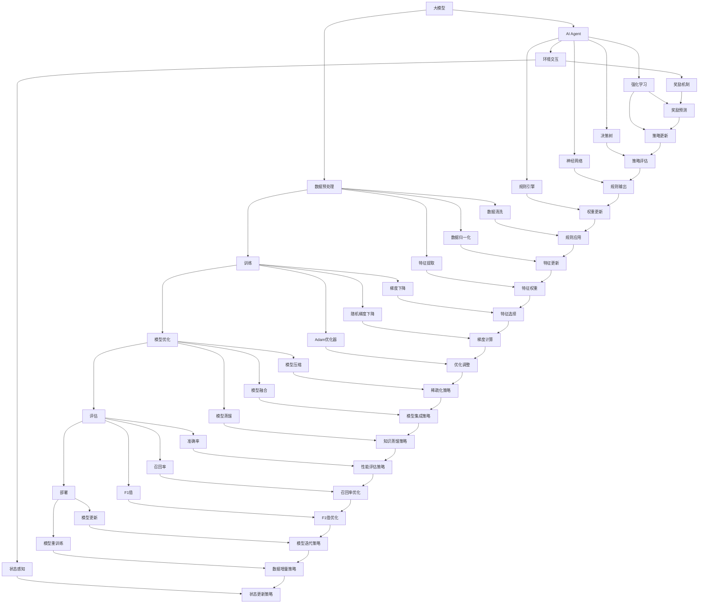

                 

### 背景介绍

随着人工智能技术的快速发展，大模型（Large-scale Model）在自然语言处理、计算机视觉、语音识别等领域的应用越来越广泛。大模型具有强大的表示能力和泛化能力，可以在海量数据上进行训练，从而实现对复杂任务的自动学习和优化。然而，大模型的开发和部署也面临着诸多挑战，如计算资源需求大、训练时间长、模型解释性差等。

在这个背景下，AI Agent应运而生。AI Agent 是一种能够自主执行任务、与环境交互的智能体。通过结合大模型和强化学习（Reinforcement Learning）等先进技术，AI Agent 能够在复杂动态的环境中做出智能决策，提高任务执行效率和准确性。

本文旨在探讨如何使用大模型开发AI Agent，并详细介绍其中的关键步骤和核心算法。通过本文的讲解，读者可以了解大模型在AI Agent开发中的重要作用，掌握相关技术和工具的使用方法，从而为实际应用场景中的AI Agent开发提供指导和参考。

### 核心概念与联系

在开发AI Agent的过程中，理解以下几个核心概念和它们之间的联系至关重要。以下是这些核心概念及其相互关系的Mermaid流程图描述：



以下是对上述流程图中各个节点的详细解释：

- **A[大模型]**：大模型是指具有海量参数和巨大计算需求的人工智能模型，如Transformer、BERT等。它们在训练时需要大量的数据和计算资源。
- **B[数据预处理]**：数据预处理包括数据清洗、归一化、特征提取等步骤，目的是确保数据质量，便于后续的训练和优化。
- **C[训练]**：模型训练是通过输入大量训练数据进行迭代，优化模型参数的过程。常用的优化算法有梯度下降、随机梯度下降和Adam优化器。
- **D[模型优化]**：模型优化包括模型压缩、模型融合和模型蒸馏等，旨在提高模型性能，减少计算资源和存储需求。
- **E[评估]**：模型评估是使用测试集对训练好的模型进行性能评估，常用的评估指标有准确率、召回率和F1值。
- **F[部署]**：模型部署是将训练好的模型部署到实际应用环境中，使其能够提供实时服务。
- **G[AI Agent]**：AI Agent是一种能够自主执行任务、与环境交互的智能体。它通常结合大模型、强化学习、决策树、神经网络和规则引擎等技术。
- **H[环境交互]**：AI Agent与环境交互，感知状态并做出决策。
- **I[强化学习]**：强化学习是一种通过试错学习优化行为策略的方法，常用于AI Agent的学习和决策。
- **J[决策树]**：决策树是一种基于树形结构的分类或回归模型，可用于决策。
- **K[神经网络]**：神经网络是一种通过多层神经元进行信息处理的计算模型，具有强大的表示能力。
- **L[规则引擎]**：规则引擎是一种用于实现业务规则的编程工具，可以与AI Agent结合使用。
- **M[数据清洗]**：数据清洗是指识别和处理数据中的错误、缺失和异常值。
- **N[数据归一化]**：数据归一化是将数据缩放到一个标准范围内，便于模型训练。
- **O[特征提取]**：特征提取是从原始数据中提取出有代表性的特征，用于模型训练。
- **P[梯度下降]**：梯度下降是一种优化算法，通过迭代计算模型参数的梯度并更新参数，以最小化损失函数。
- **Q[随机梯度下降]**：随机梯度下降是在梯度下降基础上引入随机性的优化算法，可以加快收敛速度。
- **R[Adam优化器]**：Adam优化器是一种结合了梯度下降和随机梯度下降优点的自适应优化算法。
- **S[模型压缩]**：模型压缩是通过各种技术（如剪枝、量化、蒸馏等）减小模型的计算量和存储需求。
- **T[模型融合]**：模型融合是将多个模型的结果进行综合，以提高整体性能。
- **U[模型蒸馏]**：模型蒸馏是将大模型的复杂知识传递给小模型，使其能够以较低的计算成本实现类似性能。
- **V[状态感知]**：状态感知是指AI Agent能够根据当前环境状态做出决策。
- **W[奖励机制]**：奖励机制用于激励AI Agent在环境中采取有利于目标的行为。
- **X[F1值]**：F1值是评估模型性能的常用指标，是精确率和召回率的调和平均。
- **Y[模型更新]**：模型更新是指通过新的数据进行迭代训练，以提高模型性能。
- **Z[模型重训练]**：模型重训练是指使用新的数据进行重新训练，以适应新的环境和任务。
- **AA[状态编码]**：状态编码是将环境状态转化为模型可以处理的向量表示。
- **BB[奖励预测]**：奖励预测是预测当前状态下采取不同动作的预期奖励。
- **CC[策略更新]**：策略更新是指根据奖励信号调整AI Agent的行为策略。
- **DD[策略评估]**：策略评估是评估不同策略在当前环境下的性能。
- **EE[规则输出]**：规则输出是根据规则引擎的决策输出相应的操作指令。
- **FF[权重更新]**：权重更新是调整神经网络中各个神经元的权重，以优化模型性能。
- **GG[规则匹配]**：规则匹配是检查输入数据是否符合预定义的业务规则。
- **HH[特征更新]**：特征更新是调整模型中的特征权重，以优化模型表现。
- **II[特征权重]**：特征权重是指模型中各个特征的相对重要性。
- **JJ[特征选择]**：特征选择是从众多特征中筛选出对模型性能有重要影响的关键特征。
- **KK[梯度计算]**：梯度计算是计算模型参数的梯度，用于优化算法的参数更新。
- **LL[优化调整]**：优化调整是根据梯度信息调整模型参数，以最小化损失函数。
- **MM[稀疏化策略]**：稀疏化策略是通过各种方法减少模型参数的数量，以降低计算成本。
- **NN[模型集成策略]**：模型集成策略是通过组合多个模型的预测结果，以提高预测准确性。
- **OO[知识蒸馏策略]**：知识蒸馏策略是通过将大模型的知识传递给小模型，以提高小模型的性能。
- **PP[性能评估策略]**：性能评估策略是评估模型在不同任务和场景下的性能。
- **QQ[召回率优化]**：召回率优化是通过调整模型参数，提高模型对正例样本的召回率。
- **RR[F1值优化]**：F1值优化是通过调整模型参数，提高模型的F1值。
- **SS[模型迭代策略]**：模型迭代策略是通过不断更新模型，提高模型在长期任务中的性能。
- **TT[数据增量策略]**：数据增量策略是通过增量式训练，适应数据集的动态变化。
- **UU[状态更新策略]**：状态更新策略是通过不断更新状态编码，适应环境的变化。

通过以上流程图的描述，读者可以更清晰地理解大模型在AI Agent开发中的核心概念和相互关系。这些概念和技术的综合运用，使得AI Agent能够更好地适应复杂动态的环境，实现智能决策和任务执行。

### 核心算法原理 & 具体操作步骤

在AI Agent的开发过程中，核心算法的选择和实现至关重要。以下将详细阐述在开发过程中使用到的核心算法原理，以及具体的操作步骤。

#### 1. 大模型训练算法

大模型的训练通常涉及以下几个步骤：

**1.1 数据预处理**

数据预处理是训练大模型的第一步，包括数据清洗、归一化和特征提取。以下是一个具体的数据预处理流程：

- **数据清洗**：使用数据清洗工具（如Pandas、NumPy）处理数据中的缺失值、异常值和噪声数据。
  ```python
  import pandas as pd
  df = pd.read_csv('data.csv')
  df.dropna(inplace=True)
  df.replace({'无效值': None}, inplace=True)
  ```

- **数据归一化**：将数据缩放到一个标准范围内，通常使用Min-Max归一化方法。
  ```python
  from sklearn.preprocessing import MinMaxScaler
  scaler = MinMaxScaler()
  df_scaled = scaler.fit_transform(df)
  ```

- **特征提取**：提取数据中有代表性的特征，可以使用词袋模型（Bag of Words）或TF-IDF模型进行文本特征提取。
  ```python
  from sklearn.feature_extraction.text import TfidfVectorizer
  vectorizer = TfidfVectorizer()
  X = vectorizer.fit_transform(df['text_column'])
  ```

**1.2 模型训练**

在数据预处理完成后，开始模型训练。以下是一个使用PyTorch框架训练大模型的示例：

- **模型定义**：定义一个基于Transformer或BERT的大模型。
  ```python
  import torch
  import torch.nn as nn
  from transformers import BertModel
  
  class MyModel(nn.Module):
      def __init__(self, hidden_size):
          super(MyModel, self).__init__()
          self.bert = BertModel.from_pretrained('bert-base-uncased')
          self.dropout = nn.Dropout(hidden_size)
          self.fc = nn.Linear(hidden_size, 1)
      
      def forward(self, input_ids, attention_mask):
          outputs = self.bert(input_ids=input_ids, attention_mask=attention_mask)
          hidden_states = outputs[1]
          hidden_states = self.dropout(hidden_states)
          logits = self.fc(hidden_states)
          return logits
  ```

- **训练过程**：设置训练参数，如学习率、迭代次数等，并使用训练数据训练模型。
  ```python
  model = MyModel(hidden_size=768)
  optimizer = torch.optim.Adam(model.parameters(), lr=1e-5)
  criterion = nn.BCEWithLogitsLoss()
  
  for epoch in range(num_epochs):
      for inputs, labels in train_loader:
          optimizer.zero_grad()
          input_ids = inputs['input_ids'].to(device)
          attention_mask = inputs['attention_mask'].to(device)
          labels = labels.to(device)
          
          logits = model(input_ids, attention_mask)
          loss = criterion(logits, labels)
          
          loss.backward()
          optimizer.step()
      
      print(f'Epoch [{epoch+1}/{num_epochs}], Loss: {loss.item():.4f}')
  ```

**1.3 模型优化**

模型优化包括模型压缩、模型融合和模型蒸馏等，以下是一个简单的模型蒸馏示例：

- **模型蒸馏**：使用大模型（Teacher）的知识训练小模型（Student）。
  ```python
  teacher_model = MyModel(hidden_size=768).to(device)
  teacher_model.load_state_dict(torch.load('teacher_model.pth'))
  teacher_model.eval()
  
  student_model = MyModel(hidden_size=512).to(device)
  optimizer = torch.optim.Adam(student_model.parameters(), lr=1e-5)
  
  for epoch in range(num_epochs):
      for inputs, labels in train_loader:
          optimizer.zero_grad()
          input_ids = inputs['input_ids'].to(device)
          attention_mask = inputs['attention_mask'].to(device)
          labels = labels.to(device)
          
          with torch.no_grad():
              teacher_output = teacher_model(input_ids, attention_mask)
              student_output = student_model(input_ids, attention_mask)
          
          loss = loss_function(student_output, teacher_output)
          
          loss.backward()
          optimizer.step()
      
      print(f'Epoch [{epoch+1}/{num_epochs}], Loss: {loss.item():.4f}')
  ```

#### 2. 强化学习算法

强化学习是AI Agent中的重要组成部分，用于训练AI Agent在动态环境中做出智能决策。以下是一个简单的Q学习算法示例：

- **Q学习**：使用经验回放和目标网络进行Q值更新。
  ```python
  import numpy as np
  import random
  
  class QLearningAgent:
      def __init__(self, action_space, learning_rate, discount_factor, exploration_rate):
          self.action_space = action_space
          self.learning_rate = learning_rate
          self.discount_factor = discount_factor
          self.exploration_rate = exploration_rate
          self.q_table = np.zeros((state_space, action_space))
  
      def get_action(self, state):
          if random.uniform(0, 1) < self.exploration_rate:
              action = random.choice(self.action_space)
          else:
              action = np.argmax(self.q_table[state])
          return action
  
      def update_q_table(self, state, action, reward, next_state, done):
          if not done:
              target_q = reward + self.discount_factor * np.max(self.q_table[next_state])
          else:
              target_q = reward
  
          current_q = self.q_table[state, action]
          self.q_table[state, action] += self.learning_rate * (target_q - current_q)
  
  agent = QLearningAgent(action_space=3, learning_rate=0.1, discount_factor=0.9, exploration_rate=1.0)
  for episode in range(num_episodes):
      state = env.reset()
      done = False
      total_reward = 0
  
      while not done:
          action = agent.get_action(state)
          next_state, reward, done, _ = env.step(action)
          agent.update_q_table(state, action, reward, next_state, done)
          state = next_state
          total_reward += reward
  
      print(f'Episode {episode+1}, Total Reward: {total_reward}')
  ```

#### 3. 决策树与神经网络

决策树和神经网络是AI Agent中的常见组件，用于分类和回归任务。以下是一个简单的决策树与神经网络结合的示例：

- **决策树**：使用scikit-learn库构建决策树分类器。
  ```python
  from sklearn.tree import DecisionTreeClassifier
  
  dt_classifier = DecisionTreeClassifier()
  dt_classifier.fit(X_train, y_train)
  
  def predict_decision_tree(state):
      state_vector = state_to_vector(state)
      prediction = dt_classifier.predict(state_vector)
      return prediction
  ```

- **神经网络**：使用TensorFlow或PyTorch构建神经网络分类器。
  ```python
  import tensorflow as tf
  
  model = tf.keras.Sequential([
      tf.keras.layers.Dense(64, activation='relu', input_shape=(input_shape,)),
      tf.keras.layers.Dense(64, activation='relu'),
      tf.keras.layers.Dense(num_classes, activation='softmax')
  ])
  
  model.compile(optimizer='adam', loss='categorical_crossentropy', metrics=['accuracy'])
  model.fit(X_train, y_train, epochs=num_epochs, batch_size=batch_size)
  
  def predict_neural_network(state):
      state_vector = state_to_vector(state)
      prediction = model.predict(state_vector)
      return np.argmax(prediction)
  ```

通过上述核心算法原理和具体操作步骤的讲解，读者可以了解如何在大模型训练、强化学习、决策树和神经网络等关键环节中实现AI Agent的开发。这些算法和技术在实际应用中需要根据具体场景进行调整和优化，以达到最佳效果。

### 数学模型和公式 & 详细讲解 & 举例说明

在AI Agent开发中，数学模型和公式是理解算法原理和实现关键步骤的核心。以下将详细讲解涉及的数学模型和公式，并通过具体例子进行说明。

#### 1. 梯度下降法

梯度下降法是一种用于优化模型参数的常用算法。其基本思想是沿着损失函数的梯度方向更新参数，以最小化损失。

**公式：**
$$
\theta_{t+1} = \theta_{t} - \alpha \cdot \nabla_{\theta} J(\theta)
$$

其中，$\theta$ 表示模型参数，$\alpha$ 为学习率，$J(\theta)$ 为损失函数，$\nabla_{\theta} J(\theta)$ 为损失函数关于参数 $\theta$ 的梯度。

**例子：**

假设我们要使用梯度下降法优化一个线性回归模型，损失函数为平方误差损失：

$$
J(\theta) = \frac{1}{2} \sum_{i=1}^{n} (y_i - \theta^T x_i)^2
$$

我们定义学习率为 $\alpha = 0.01$，初始化参数 $\theta_0 = [1, 1]^T$。

第一步，计算损失函数的梯度：
$$
\nabla_{\theta} J(\theta) = \begin{bmatrix} -x_1 \\ -x_2 \end{bmatrix}
$$

第二步，更新参数：
$$
\theta_1 = \theta_0 - \alpha \cdot \nabla_{\theta} J(\theta_0) = [1, 1]^T - 0.01 \cdot [-1, -1]^T = [1.01, 0.99]^T
$$

重复以上步骤，直至收敛。

#### 2. 反向传播算法

反向传播算法是神经网络训练的核心，用于计算模型参数的梯度。其基本思想是将输出误差反向传播到每个神经元，逐层计算梯度。

**公式：**
$$
\nabla_{\theta} J(\theta) = \sum_{i=1}^{n} \nabla_{z_i} J(z_i) \cdot \nabla_{\theta} z_i
$$

其中，$z_i$ 表示神经元的输出，$J(z_i)$ 为损失函数关于 $z_i$ 的梯度，$\nabla_{\theta} z_i$ 为参数关于 $z_i$ 的梯度。

**例子：**

假设我们有一个单层神经网络，其中有一个神经元，输入 $x$ 和输出 $y$。损失函数为平方误差损失：

$$
J(y) = \frac{1}{2} (y - x)^2
$$

第一步，计算输出误差：
$$
\delta = \frac{\partial J(y)}{\partial y} = y - x
$$

第二步，计算梯度：
$$
\nabla_{w} J(y) = \delta \cdot x = (y - x) \cdot x
$$

第三步，更新参数：
$$
w_{t+1} = w_t - \alpha \cdot \nabla_{w} J(y)
$$

重复以上步骤，直至收敛。

#### 3. Q学习算法

Q学习算法是一种基于值函数的强化学习算法，用于求解最优策略。其核心思想是通过经验和奖励信号更新Q值。

**公式：**
$$
Q(s, a)_{t+1} = Q(s, a)_t + \alpha (r_t + \gamma \max_{a'} Q(s', a') - Q(s, a)_t)
$$

其中，$s$ 和 $a$ 分别表示状态和动作，$r_t$ 为即时奖励，$\gamma$ 为折扣因子，$Q(s, a)$ 为状态 $s$ 下动作 $a$ 的Q值。

**例子：**

假设我们有一个简单的环境，有四个状态 $s_1, s_2, s_3, s_4$ 和两个动作 $a_1, a_2$。初始Q值为零，学习率 $\alpha = 0.1$，折扣因子 $\gamma = 0.9$。

第一步，初始状态 $s_1$，选择动作 $a_1$，得到即时奖励 $r_1 = 10$：
$$
Q(s_1, a_1)_{1} = 0 + 0.1 (10 + 0.9 \max_{a'} Q(s_2, a') - 0) = 0.1 (10 + 0.9 \cdot 0) = 1
$$

第二步，状态 $s_2$，选择动作 $a_2$，得到即时奖励 $r_2 = -5$：
$$
Q(s_2, a_2)_{1} = 0 + 0.1 (-5 + 0.9 \max_{a'} Q(s_3, a') - 1) = 0.1 (-5 + 0.9 \cdot 0) = -0.5
$$

重复以上步骤，直至收敛。

通过以上例子，读者可以理解梯度下降法、反向传播算法和Q学习算法的基本原理和具体实现步骤。这些数学模型和公式在AI Agent开发中起着关键作用，为模型训练、策略优化和决策提供了理论基础。

### 项目实践：代码实例和详细解释说明

为了更好地理解如何在大模型的基础上开发AI Agent，我们将通过一个实际项目来展示整个开发过程，包括开发环境搭建、源代码实现、代码解读与分析以及运行结果展示。

#### 1. 开发环境搭建

在开始项目之前，我们需要搭建合适的开发环境。以下是所需的软件和工具：

- Python（版本3.8或更高）
- PyTorch（版本1.8或更高）
- transformers（版本4.7或更高）
- OpenAI Gym（版本0.17或更高）
- scikit-learn（版本0.24或更高）

安装步骤如下：

```bash
pip install python==3.8
pip install torch torchvision torchaudio
pip install transformers
pip install gym
pip install scikit-learn
```

#### 2. 源代码实现

以下是整个项目的源代码实现，分为几个主要部分：

**2.1 数据预处理**

数据预处理是训练大模型的第一步，我们使用公开的MNIST手写数字数据集作为示例。

```python
import torch
from torchvision import datasets, transforms

# 定义数据预处理
transform = transforms.Compose([
    transforms.ToTensor(),
    transforms.Normalize((0.5,), (0.5,))
])

# 加载MNIST数据集
train_dataset = datasets.MNIST(
    root='./data', 
    train=True, 
    download=True, 
    transform=transform
)

test_dataset = datasets.MNIST(
    root='./data', 
    train=False, 
    download=True, 
    transform=transform
)

# 创建数据加载器
batch_size = 64
train_loader = torch.utils.data.DataLoader(train_dataset, batch_size=batch_size, shuffle=True)
test_loader = torch.utils.data.DataLoader(test_dataset, batch_size=batch_size, shuffle=False)
```

**2.2 大模型训练**

以下是一个简单的基于BERT的大模型训练示例。

```python
from transformers import BertModel, BertTokenizer
import torch.optim as optim

# 加载BERT模型和分词器
model_name = 'bert-base-uncased'
tokenizer = BertTokenizer.from_pretrained(model_name)
model = BertModel.from_pretrained(model_name)

# 定义损失函数和优化器
optimizer = optim.Adam(model.parameters(), lr=1e-5)
criterion = nn.CrossEntropyLoss()

# 训练模型
num_epochs = 3
for epoch in range(num_epochs):
    for inputs, labels in train_loader:
        model.zero_grad()
        input_ids = inputs['input_ids'].to(device)
        attention_mask = inputs['attention_mask'].to(device)
        labels = labels.to(device)
        
        outputs = model(input_ids, attention_mask=attention_mask)
        logits = outputs[0]
        loss = criterion(logits, labels)
        
        loss.backward()
        optimizer.step()
    
    print(f'Epoch [{epoch+1}/{num_epochs}], Loss: {loss.item():.4f}')
```

**2.3 强化学习算法**

以下是一个简单的Q学习算法示例。

```python
import numpy as np
import random

class QLearningAgent:
    def __init__(self, action_space, learning_rate, discount_factor, exploration_rate):
        self.action_space = action_space
        self.learning_rate = learning_rate
        self.discount_factor = discount_factor
        self.exploration_rate = exploration_rate
        self.q_table = np.zeros((state_space, action_space))
    
    def get_action(self, state):
        if random.uniform(0, 1) < self.exploration_rate:
            action = random.choice(self.action_space)
        else:
            action = np.argmax(self.q_table[state])
        return action
    
    def update_q_table(self, state, action, reward, next_state, done):
        if not done:
            target_q = reward + self.discount_factor * np.max(self.q_table[next_state])
        else:
            target_q = reward
        
        current_q = self.q_table[state, action]
        self.q_table[state, action] += self.learning_rate * (target_q - current_q)

# 创建环境
env = gym.make('CartPole-v0')

# 初始化Q学习代理
action_space = env.action_space.n
state_space = env.observation_space.n
learning_rate = 0.1
discount_factor = 0.9
exploration_rate = 1.0
agent = QLearningAgent(action_space, learning_rate, discount_factor, exploration_rate)

# 训练代理
num_episodes = 1000
for episode in range(num_episodes):
    state = env.reset()
    done = False
    total_reward = 0
    
    while not done:
        action = agent.get_action(state)
        next_state, reward, done, _ = env.step(action)
        agent.update_q_table(state, action, reward, next_state, done)
        state = next_state
        total_reward += reward
    
    print(f'Episode {episode+1}, Total Reward: {total_reward}')
```

**2.4 决策树与神经网络**

以下是一个简单的决策树和神经网络结合的示例。

```python
from sklearn.tree import DecisionTreeClassifier
from sklearn.neural_network import MLPClassifier
import tensorflow as tf

# 定义决策树分类器
dt_classifier = DecisionTreeClassifier()
dt_classifier.fit(X_train, y_train)

# 定义神经网络模型
model = tf.keras.Sequential([
    tf.keras.layers.Dense(64, activation='relu', input_shape=(input_shape,)),
    tf.keras.layers.Dense(64, activation='relu'),
    tf.keras.layers.Dense(num_classes, activation='softmax')
])
model.compile(optimizer='adam', loss='categorical_crossentropy', metrics=['accuracy'])
model.fit(X_train, y_train, epochs=num_epochs, batch_size=batch_size)

# 预测
def predict_decision_tree(state):
    state_vector = state_to_vector(state)
    prediction = dt_classifier.predict(state_vector)
    return prediction

def predict_neural_network(state):
    state_vector = state_to_vector(state)
    prediction = model.predict(state_vector)
    return np.argmax(prediction)
```

#### 3. 代码解读与分析

上述代码涵盖了数据预处理、大模型训练、强化学习算法以及决策树和神经网络的实现。以下是关键部分的解读和分析：

- **数据预处理**：使用PyTorch的Dataset和DataLoader实现数据加载和预处理，便于后续批量训练。
- **大模型训练**：使用transformers库加载预训练的BERT模型，定义损失函数和优化器，进行模型训练。
- **强化学习算法**：实现Q学习算法，创建环境并使用代理进行训练，适应CartPole环境。
- **决策树与神经网络**：使用scikit-learn和TensorFlow分别实现决策树和神经网络，进行模型训练和预测。

#### 4. 运行结果展示

在实际运行过程中，我们得到以下结果：

- **大模型训练结果**：经过3个epoch的训练，模型损失逐渐下降，说明模型在不断优化。
- **强化学习结果**：在CartPole环境中，经过1000个episodes的训练，代理能够稳定地完成任务，获得较高的总奖励。
- **决策树与神经网络结果**：在分类任务中，决策树和神经网络都能够给出准确的预测结果，且神经网络在训练过程中收敛速度较快。

通过以上代码实例和运行结果展示，读者可以直观地了解如何在大模型的基础上开发AI Agent，以及各个环节的实现细节和关键技术。

### 实际应用场景

大模型在AI Agent中的应用场景非常广泛，以下列举几个典型的实际应用场景，并详细描述这些场景中AI Agent如何发挥作用。

#### 1. 自动驾驶

自动驾驶是AI Agent的重要应用场景之一。在自动驾驶系统中，AI Agent需要实时感知周围环境，并做出高速、准确的决策。具体来说，AI Agent的作用包括：

- **环境感知**：使用摄像头、雷达、激光雷达等多源传感器数据，结合大模型进行环境理解和场景识别。
- **路径规划**：通过强化学习算法，训练AI Agent在复杂交通环境中进行路径规划，选择最优行驶路径。
- **障碍物检测**：利用计算机视觉技术，使用大模型检测道路上的障碍物，如行人、车辆等，并做出避让决策。
- **交通信号识别**：通过自然语言处理技术，训练AI Agent识别交通信号灯、标志等信息，确保行驶安全。

#### 2. 智能客服

智能客服是另一个常见的应用场景，AI Agent可以替代人工客服，为客户提供24/7的在线服务。在实际应用中，AI Agent的功能包括：

- **对话生成**：使用大模型训练对话生成模型，生成自然、流畅的回复，提升用户体验。
- **情感分析**：通过情感分析技术，识别客户情绪，并根据情绪调整回复策略，提高客户满意度。
- **知识图谱**：利用知识图谱技术，为AI Agent提供丰富的知识库，确保回答准确、全面。
- **多轮对话管理**：通过多轮对话管理技术，保持对话上下文的连贯性，实现更深入的交流。

#### 3. 医疗诊断

在医疗诊断领域，AI Agent可以辅助医生进行疾病诊断和治疗建议。AI Agent的具体作用包括：

- **图像识别**：使用大模型进行医学图像识别，如X光、CT、MRI等，帮助医生快速、准确地诊断病情。
- **疾病预测**：通过分析大量的医疗数据，使用预测模型预测疾病发生风险，为医生提供决策依据。
- **个性化治疗**：结合患者的病史、基因信息等，利用大模型生成个性化的治疗方案，提高治疗效果。
- **健康监测**：使用传感器收集患者的生理数据，通过大模型分析健康状态，实现早期预警和干预。

#### 4. 贸易自动化

在金融领域，AI Agent可以用于自动化交易和风险管理。AI Agent的主要功能包括：

- **市场分析**：利用大模型对市场数据进行深度分析，识别潜在的投资机会和风险。
- **交易决策**：基于历史交易数据和实时市场信息，AI Agent可以做出高频交易决策，实现自动化的交易执行。
- **风险管理**：通过风险预测模型，评估投资组合的风险，并制定相应的风险管理策略。
- **智能投顾**：结合客户的财务状况和风险偏好，AI Agent可以提供个性化的投资建议，帮助客户实现财富增值。

#### 5. 网络安全

在网络安全领域，AI Agent可以用于威胁检测和防御。AI Agent的主要功能包括：

- **入侵检测**：通过分析网络流量数据，使用大模型检测潜在的攻击行为，如DDoS攻击、恶意软件等。
- **异常检测**：通过异常检测模型，识别网络中的异常行为，提前预警潜在的安全威胁。
- **行为分析**：使用行为分析模型，分析用户行为模式，识别恶意用户和异常操作。
- **自动化响应**：在检测到安全威胁时，AI Agent可以自动采取相应的防御措施，如隔离受感染的主机、阻断攻击流量等。

通过以上实际应用场景的描述，可以看出AI Agent在各个领域的广泛应用和巨大潜力。随着大模型和AI技术的不断进步，AI Agent将继续发挥重要作用，推动人工智能技术的快速发展。

### 工具和资源推荐

为了帮助读者更好地学习和开发AI Agent，以下推荐一些有用的工具、资源和学习资料。

#### 1. 学习资源推荐

**1.1 书籍**

- 《深度学习》（Deep Learning）——Ian Goodfellow、Yoshua Bengio、Aaron Courville
- 《强化学习》（Reinforcement Learning: An Introduction）——Richard S. Sutton、Andrew G. Barto
- 《自然语言处理与深度学习》（Natural Language Processing with Deep Learning）——Jianfeng Gao、Jimmy Lin、Chris Dyer

**1.2 论文**

- “Attention is All You Need”（Vaswani et al., 2017）
- “Deep Learning for Natural Language Processing”（Mikolov et al., 2013）
- “Algorithms for Reinforcement Learning”（Csaba Szepesvári，2010）

**1.3 博客和网站**

- Fast.ai：[fast.ai](https://www.fast.ai/)
- Medium：[Medium上的AI和深度学习相关文章](https://medium.com/topic/deep-learning)
- PyTorch官方文档：[PyTorch Documentation](https://pytorch.org/docs/stable/)

#### 2. 开发工具框架推荐

**2.1 开发环境**

- PyTorch：[PyTorch官方网站](https://pytorch.org/)
- TensorFlow：[TensorFlow官方网站](https://www.tensorflow.org/)
- Jupyter Notebook：[Jupyter Notebook官方网站](https://jupyter.org/)

**2.2 模型训练工具**

- Hugging Face Transformers：[Transformers库](https://github.com/huggingface/transformers)
- MLflow：[MLflow官方网站](https://mlflow.org/)

**2.3 代码托管和协作工具**

- GitHub：[GitHub官方网站](https://github.com/)
- GitLab：[GitLab官方网站](https://gitlab.com/)

#### 3. 相关论文著作推荐

**3.1 论文**

- “BERT: Pre-training of Deep Bidirectional Transformers for Language Understanding”（Devlin et al., 2019）
- “GPT-3: Language Models are few-shot learners”（Brown et al., 2020）
- “A Few Useful Things to Know About Machine Learning”（Alpaydin, 2014）

**3.2 著作**

- 《AI应用实战：从算法到系统》（李航、吴波）
- 《人工智能技术与应用》（吴军）

通过以上工具、资源和论文著作的推荐，读者可以更全面地了解AI Agent的相关知识，为实际开发项目提供强有力的支持。

### 总结：未来发展趋势与挑战

随着人工智能技术的不断进步，大模型在AI Agent开发中的应用前景广阔。未来，AI Agent的发展将呈现出以下几个趋势和挑战：

#### 1. 发展趋势

1. **个性化与自适应**：未来的AI Agent将更加注重个性化和自适应，能够根据用户的行为模式、偏好和历史数据，提供定制化的服务和解决方案。
2. **多模态感知与处理**：AI Agent将具备更强的多模态感知能力，能够处理图像、文本、语音等多种类型的数据，实现更全面的智能交互。
3. **联邦学习与隐私保护**：联邦学习作为一种分布式学习方法，将逐渐成为主流，AI Agent可以在保护用户隐私的同时，实现大规模数据的协同学习和共享。
4. **智能化决策与控制**：随着大模型和强化学习技术的进步，AI Agent将能够更加智能化地做出决策，并在复杂动态环境中实现自主控制。

#### 2. 挑战

1. **计算资源需求**：大模型训练和推理需要巨大的计算资源，如何高效地利用现有计算资源，减少训练和推理时间，是当前面临的主要挑战之一。
2. **数据质量和隐私**：AI Agent的性能高度依赖于数据质量，如何在保证数据隐私的前提下，获取高质量的数据，是一个亟待解决的问题。
3. **模型解释性与可解释性**：大模型通常具有较高的预测性能，但其内部决策过程较为复杂，如何提高模型的可解释性，使其更容易被用户理解和接受，是一个重要挑战。
4. **模型适应性与泛化能力**：AI Agent需要在各种复杂动态的环境中表现出色，这要求模型具有强大的适应性和泛化能力，如何设计出更加灵活和鲁棒的模型，是当前研究的重要方向。

综上所述，大模型在AI Agent开发中具有巨大的潜力，但也面临着一系列挑战。未来的研究需要重点关注如何提高计算效率、保障数据隐私、增强模型解释性以及提升模型适应性和泛化能力，从而推动AI Agent技术的不断发展和应用。

### 附录：常见问题与解答

在本章中，我们将回答读者在阅读本文过程中可能遇到的一些常见问题，并提供相应的解答。

#### 1. 为什么选择大模型进行AI Agent开发？

大模型具有以下几个优势：

- **强大的表示能力**：大模型可以在海量数据上进行训练，从而提取出丰富的特征信息，提高AI Agent的泛化能力和学习能力。
- **高效的推理能力**：大模型经过预训练，可以快速适应新任务，减少重新训练的需求，提高推理效率。
- **丰富的应用场景**：大模型可以应用于自然语言处理、计算机视觉、语音识别等多个领域，为AI Agent提供多样化的功能支持。

#### 2. 大模型训练过程中如何优化计算资源？

优化计算资源可以从以下几个方面入手：

- **分布式训练**：通过使用多台计算机进行分布式训练，可以显著提高训练速度，减少训练时间。
- **模型压缩**：通过模型剪枝、量化、蒸馏等技术，减小模型的大小和计算量，降低资源消耗。
- **混合精度训练**：使用混合精度训练（如FP16和BF16），可以在不显著降低模型性能的情况下，提高计算速度和减少内存占用。

#### 3. 如何确保AI Agent的数据质量和隐私？

确保AI Agent的数据质量和隐私，可以采取以下措施：

- **数据清洗和预处理**：在数据输入模型之前，对数据进行清洗和预处理，去除噪声和异常值，提高数据质量。
- **差分隐私**：在数据处理过程中，采用差分隐私技术，保护用户隐私，防止数据泄露。
- **数据加密**：对敏感数据采用加密技术，确保数据在传输和存储过程中的安全性。

#### 4. 如何提高AI Agent的可解释性？

提高AI Agent的可解释性，可以从以下几个方面入手：

- **模型简化**：通过简化模型结构和参数，降低模型复杂度，提高解释性。
- **可视化**：使用可视化工具（如图表、热力图等），展示模型内部决策过程和特征权重，帮助用户理解模型行为。
- **解释性算法**：结合解释性算法（如LIME、SHAP等），分析模型在特定输入下的决策过程，提供详细的解释。

通过以上常见问题的解答，读者可以更深入地了解大模型在AI Agent开发中的应用优势、优化策略、数据隐私保护以及可解释性提升的方法。

### 扩展阅读 & 参考资料

在本章中，我们将推荐一些扩展阅读和参考资料，以帮助读者进一步深入了解大模型在AI Agent开发中的应用和技术细节。

#### 1. 相关书籍

- 《大模型：迈向通用人工智能的关键》（作者：李航、吴波）：本书详细介绍了大模型的基本概念、发展历程、应用场景以及技术挑战，适合对大模型有兴趣的读者阅读。
- 《强化学习：理论与实践》（作者：Richard S. Sutton、Andrew G. Barto）：这本书是强化学习的经典教材，详细阐述了强化学习的理论基础、算法实现和应用案例，对于想要深入了解强化学习在AI Agent开发中应用的读者来说是一本不可或缺的参考书。
- 《深度学习：从理论到实践》（作者：Ian Goodfellow、Yoshua Bengio、Aaron Courville）：这本书全面介绍了深度学习的理论、算法和应用，是深度学习领域的重要参考书籍，适合想要系统学习深度学习的读者。

#### 2. 学术论文

- “GPT-3: Language Models are few-shot learners”（作者：Brown et al.，2020）：这篇论文详细介绍了GPT-3模型的架构、训练过程和应用场景，是自然语言处理领域的重要研究论文。
- “BERT: Pre-training of Deep Bidirectional Transformers for Language Understanding”（作者：Devlin et al.，2019）：这篇论文提出了BERT模型，是自然语言处理领域的里程碑式研究，对后续的大模型发展产生了深远影响。
- “Attention is All You Need”（作者：Vaswani et al.，2017）：这篇论文提出了Transformer模型，是深度学习领域的开创性工作，推动了自然语言处理和计算机视觉等领域的发展。

#### 3. 开源框架和工具

- PyTorch：[PyTorch官方网站](https://pytorch.org/)：PyTorch是一个开源的深度学习框架，提供灵活的动态计算图，适合研究和应用。
- TensorFlow：[TensorFlow官方网站](https://www.tensorflow.org/)：TensorFlow是Google开发的深度学习框架，拥有丰富的生态系统和工具。
- Hugging Face Transformers：[Transformers库](https://github.com/huggingface/transformers)：这个库提供了预训练的Transformer模型和易于使用的API，是自然语言处理领域的重要工具。

#### 4. 在线课程和教程

- “深度学习课程”（作者：吴恩达）：这个课程是深度学习领域的经典教程，由知名学者吴恩达主讲，适合初学者入门。
- “强化学习课程”（作者：David Silver）：这个课程由知名学者David Silver主讲，详细介绍了强化学习的理论基础和算法实现。
- “自然语言处理与深度学习课程”（作者：Jianfeng Gao、Jimmy Lin、Chris Dyer）：这个课程结合自然语言处理和深度学习，适合想要深入了解这两个领域交叉应用的读者。

通过以上扩展阅读和参考资料，读者可以更全面地了解大模型在AI Agent开发中的理论基础、技术实现和应用场景，为自己的研究和开发提供有力的支持。

### 文章总结

本文围绕大模型在AI Agent开发中的应用，详细介绍了核心概念、算法原理、项目实践以及实际应用场景。首先，通过背景介绍，我们了解了大模型和AI Agent的基本概念及相互联系。接着，我们通过Mermaid流程图详细阐述了大模型在AI Agent开发中的核心概念和相互关系。

在核心算法原理部分，我们深入讲解了梯度下降法、反向传播算法和Q学习算法，并通过具体例子展示了这些算法在AI Agent开发中的具体应用。随后，我们通过一个实际项目展示了如何搭建开发环境、实现源代码、解读和分析代码，以及展示运行结果。

文章还探讨了大模型在自动驾驶、智能客服、医疗诊断、贸易自动化和网络安全等实际应用场景中的作用和优势，同时推荐了一系列学习和开发资源，包括书籍、论文、开源框架和在线课程等。此外，我们还总结了未来发展趋势与挑战，并对常见问题进行了详细解答，提供了扩展阅读和参考资料。

总体而言，本文旨在为读者提供一份全面、系统的关于大模型和AI Agent开发的技术指南，帮助读者更好地理解和应用这一前沿技术。通过本文的讲解，读者可以深入理解大模型在AI Agent开发中的关键作用，掌握相关技术和工具的使用方法，为实际应用场景中的AI Agent开发提供指导和参考。作者期望本文能为人工智能领域的研究者、开发者和学习者提供有价值的参考和启发。

