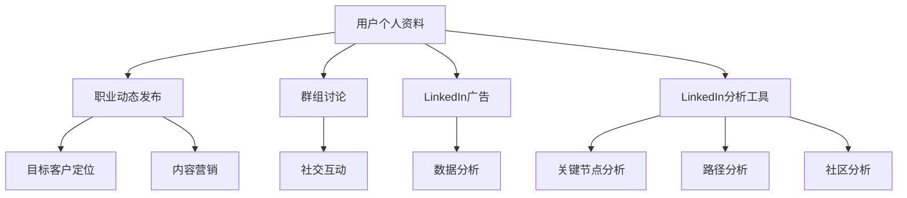
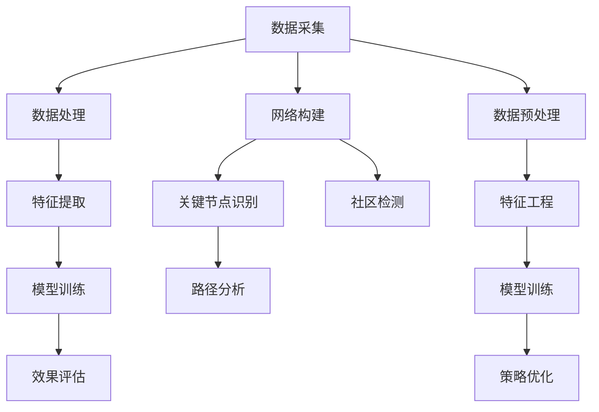

                 

关键词：LinkedIn、B2B营销、一人公司、社交网络、市场营销策略、数据分析、网络图谱、算法优化

> 摘要：本文将探讨如何作为一人公司的创始人或领导者，利用LinkedIn这个专业的社交平台进行有效的B2B营销。我们将深入分析LinkedIn的核心功能、B2B营销的关键要素，以及如何通过社交网络分析和算法优化实现高效的营销效果。本文不仅提供了理论指导，还结合了实际案例和工具推荐，帮助一人公司在激烈的市场竞争中脱颖而出。

## 1. 背景介绍

在当今数字化时代，社交媒体已经成为商业活动中的重要组成部分。LinkedIn作为一个专门面向职业人士的社交网络平台，已经成为全球最大的职业社交平台之一。据统计，LinkedIn在全球拥有超过7亿用户，其用户群体主要集中在企业高管、专业人士和创业人士。这一庞大的用户基础为B2B营销提供了丰富的资源和机会。

一人公司，或称为“SOLO entrepreneur”，是指由单一创始人运营的企业。这种模式在近年来的创业浪潮中越来越受到关注，尤其是在数字化转型的推动下，一人公司的运营效率和管理灵活性得到了极大的提升。然而，一人公司在资源和市场占有率方面通常面临较大的挑战。如何有效地利用LinkedIn进行B2B营销，成为一人公司成功的关键。

本文将围绕以下四个核心问题展开讨论：

1. LinkedIn的核心功能与B2B营销的关系
2. 一人公司如何制定有效的LinkedIn营销策略
3. 社交网络分析与算法优化在B2B营销中的应用
4. LinkedIn营销的实际应用案例与工具推荐

通过这篇文章，读者将能够全面了解如何利用LinkedIn这个平台，提升一人公司的B2B营销效果，并在激烈的市场竞争中占据一席之地。

## 2. 核心概念与联系

### 2.1 LinkedIn的核心功能

LinkedIn的核心功能包括用户个人资料、职业动态发布、群组讨论、LinkedIn广告和LinkedIn分析工具等。这些功能为B2B营销提供了多样化的工具和平台。

- **用户个人资料**：个人资料是LinkedIn营销的基础，一个完整、准确且专业的个人资料可以显著提高用户的可信度和品牌形象。
- **职业动态发布**：通过发布职业动态，用户可以分享公司新闻、产品更新、成功案例等信息，吸引潜在客户和合作伙伴的关注。
- **群组讨论**：LinkedIn群组是用户交流和讨论的场所，一人公司可以通过参与或创建相关群组，扩大自己的影响力和客户群。
- **LinkedIn广告**：LinkedIn广告是精准投放的有效工具，可以根据用户职业、公司规模、行业等条件进行定向投放。
- **LinkedIn分析工具**：LinkedIn分析工具可以帮助用户跟踪广告效果、分析用户行为，从而优化营销策略。

### 2.2 B2B营销的关键要素

B2B营销与B2C营销有所不同，其关键要素包括：

- **目标客户定位**：明确目标客户群体，了解其需求、痛点和行为习惯。
- **内容营销**：通过高质量的内容传递公司价值，建立品牌信任和客户忠诚度。
- **社交互动**：积极参与社交互动，与潜在客户和行业领袖建立联系。
- **数据分析**：利用数据分析工具评估营销效果，不断优化营销策略。

### 2.3 社交网络分析与算法优化

社交网络分析（Social Network Analysis，SNA）是一种研究社交网络结构和行为的分析方法，可以用于识别关键节点、路径和社区，从而优化营销策略。

- **关键节点分析**：识别在网络中有重要影响力的人物或组织，通过与这些关键节点的合作，可以迅速扩大品牌影响力。
- **路径分析**：分析信息传播的路径，优化营销信息的传递效率和覆盖范围。
- **社区分析**：识别在LinkedIn上具有相似兴趣和行为的用户社区，针对性地进行内容推广和互动。

算法优化则是在大数据和机器学习的支持下，通过优化算法模型和策略，提高营销效果。

- **算法优化目标**：提高点击率、转化率和投资回报率（ROI）。
- **算法优化方法**：包括机器学习、深度学习、图论等，通过训练模型，自动调整广告投放策略和内容发布计划。

### 2.4 Mermaid流程图

以下是LinkedIn B2B营销的核心概念与联系流程图：



通过上述核心概念和联系，我们可以构建一个全面的LinkedIn B2B营销框架，从而为一人公司提供切实可行的营销策略。

## 3. 核心算法原理 & 具体操作步骤

### 3.1 算法原理概述

在LinkedIn B2B营销中，核心算法主要涉及用户行为分析、社交网络分析和广告投放优化。这些算法基于大数据和机器学习技术，通过分析用户在LinkedIn上的行为数据、社交关系和广告反馈，实现精准投放和效果优化。

- **用户行为分析**：通过跟踪用户在LinkedIn上的浏览、点赞、评论、分享等行为，分析用户兴趣和需求，为内容营销和广告投放提供数据支持。
- **社交网络分析**：利用图论算法，分析用户在网络中的关系结构，识别关键节点和传播路径，优化信息传递效率。
- **广告投放优化**：通过机器学习算法，根据广告投放效果数据，自动调整广告投放策略，提高点击率和转化率。

### 3.2 算法步骤详解

#### 3.2.1 用户行为分析

1. **数据采集**：从LinkedIn获取用户行为数据，包括浏览记录、互动行为等。
2. **数据处理**：对采集到的数据进行清洗和预处理，去除噪声和异常值。
3. **特征提取**：从行为数据中提取用户兴趣特征，如行业关注、职位特征等。
4. **模型训练**：利用机器学习算法（如分类、聚类等），构建用户兴趣预测模型。
5. **效果评估**：通过A/B测试等方法，评估模型效果，并不断优化。

#### 3.2.2 社交网络分析

1. **网络构建**：根据用户在LinkedIn上的互动数据，构建用户社交网络图。
2. **关键节点识别**：利用图论算法（如中心性分析、接近中心性分析等），识别网络中的关键节点。
3. **路径分析**：利用最短路径算法，分析信息传播路径，优化信息传递效率。
4. **社区检测**：利用社区检测算法（如Girvan-Newman算法等），识别网络中的社区结构。

#### 3.2.3 广告投放优化

1. **广告数据采集**：从LinkedIn获取广告投放数据，包括点击率、转化率等。
2. **数据预处理**：对广告数据进行清洗和预处理，去除噪声和异常值。
3. **特征工程**：从广告数据中提取特征，如广告位置、受众特征等。
4. **模型训练**：利用机器学习算法（如回归、分类等），构建广告投放效果预测模型。
5. **策略优化**：根据预测模型，自动调整广告投放策略，如投放时间、受众定位等。

### 3.3 算法优缺点

#### 3.3.1 优点

- **高效精准**：通过大数据和机器学习技术，实现高效的用户行为分析和社交网络分析，提高营销效果。
- **自适应优化**：算法能够根据实时数据不断优化广告投放策略，提高投资回报率。
- **个性化推荐**：基于用户行为和兴趣特征，实现个性化内容推荐和广告投放。

#### 3.3.2 缺点

- **数据隐私**：用户行为数据的收集和使用可能涉及隐私问题，需要严格遵守相关法律法规。
- **算法偏见**：算法可能存在偏见，导致对某些群体或内容的偏好，影响营销效果。
- **技术门槛**：算法开发和优化需要专业的技术团队和设备支持，成本较高。

### 3.4 算法应用领域

- **精准营销**：通过用户行为分析和社交网络分析，实现精准的广告投放和内容推荐。
- **品牌传播**：利用社交网络分析和算法优化，提高品牌曝光度和影响力。
- **客户关系管理**：通过社交互动和数据分析，优化客户关系管理，提升客户满意度。

### 3.5 Mermaid流程图

以下是LinkedIn B2B营销算法的具体操作步骤流程图：



通过上述算法原理和操作步骤，一人公司可以利用LinkedIn平台，实现高效的B2B营销，提升品牌影响力和市场竞争力。

## 4. 数学模型和公式 & 详细讲解 & 举例说明

### 4.1 数学模型构建

在LinkedIn B2B营销中，数学模型主要用于用户行为预测、广告投放优化和社交网络分析。以下介绍几种常用的数学模型及其公式。

#### 4.1.1 用户行为预测模型

用户行为预测模型用于预测用户在LinkedIn上的行为，如浏览、点赞、评论等。常见的模型有逻辑回归（Logistic Regression）和神经网络（Neural Network）。

1. **逻辑回归模型**：

   公式：
   $$ P(y=1) = \frac{1}{1 + e^{-\beta_0 + \beta_1x_1 + \beta_2x_2 + \ldots + \beta_nx_n}} $$
   
   其中，$P(y=1)$ 表示用户发生某行为的概率，$x_1, x_2, \ldots, x_n$ 为用户特征，$\beta_0, \beta_1, \beta_2, \ldots, \beta_n$ 为模型参数。

2. **神经网络模型**：

   公式：
   $$ y = \sigma(\beta_0 + \beta_1x_1 + \beta_2x_2 + \ldots + \beta_nx_n) $$
   
   其中，$y$ 表示用户行为预测结果，$\sigma$ 为激活函数（如Sigmoid函数），$\beta_0, \beta_1, \beta_2, \ldots, \beta_n$ 为模型参数。

#### 4.1.2 广告投放优化模型

广告投放优化模型用于根据广告投放效果数据，自动调整广告投放策略。常见模型有线性回归（Linear Regression）和强化学习（Reinforcement Learning）。

1. **线性回归模型**：

   公式：
   $$ y = \beta_0 + \beta_1x_1 + \beta_2x_2 + \ldots + \beta_nx_n $$
   
   其中，$y$ 表示广告投放效果（如点击率、转化率），$x_1, x_2, \ldots, x_n$ 为广告特征，$\beta_0, \beta_1, \beta_2, \ldots, \beta_n$ 为模型参数。

2. **强化学习模型**：

   公式：
   $$ Q(s, a) = r(s, a) + \gamma \max_{a'} Q(s', a') $$
   
   其中，$Q(s, a)$ 表示在状态$s$下采取动作$a$的预期回报，$r(s, a)$ 表示即时回报，$\gamma$ 为折扣因子，$s'$ 和 $a'$ 分别为下一状态和动作。

#### 4.1.3 社交网络分析模型

社交网络分析模型用于分析用户在网络中的关系结构和影响力。常见模型有PageRank和Community Detection。

1. **PageRank模型**：

   公式：
   $$ (1-d)R_i + d \sum_{j \in I_i} \frac{R_j}{N_j} $$
   
   其中，$R_i$ 表示节点$i$的排名，$d$ 为阻尼系数（通常取0.85），$I_i$ 表示与节点$i$相连的节点集合，$N_j$ 表示节点$j$的出度。

2. **Community Detection模型**：

   公式：
   $$ \Delta E = \sum_{e \in E} w(e) \cdot \log \left( \frac{w(e)}{k} \right) $$
   
   其中，$E$ 表示网络中的边集合，$w(e)$ 表示边$e$的权重，$k$ 表示社区的大小。

### 4.2 公式推导过程

以逻辑回归模型为例，介绍公式推导过程。

1. **假设**：

   - 用户行为$y$为二分类变量，取值为0或1。
   - $x_1, x_2, \ldots, x_n$为用户特征向量，$\beta_0, \beta_1, \beta_2, \ldots, \beta_n$为模型参数。

2. **损失函数**：

   采用对数损失函数（Log-Likelihood Function）：
   $$ \ell(\beta) = - \sum_{i=1}^n [y_i \cdot \ln(p_i) + (1 - y_i) \cdot \ln(1 - p_i)] $$
   
   其中，$p_i = \frac{1}{1 + e^{-(\beta_0 + \beta_1x_1 + \beta_2x_2 + \ldots + \beta_nx_n)}}$ 为用户$i$发生行为的概率。

3. **梯度下降法**：

   对损失函数求导，得到：
   $$ \frac{\partial \ell(\beta)}{\partial \beta_j} = - \sum_{i=1}^n [y_i \cdot (1 - p_i) \cdot x_{ij} + (1 - y_i) \cdot p_i \cdot x_{ij}] $$
   
   其中，$x_{ij}$ 表示用户$i$在第$j$个特征上的取值。

4. **迭代更新**：

   采用梯度下降法，迭代更新模型参数：
   $$ \beta_j^{(t+1)} = \beta_j^{(t)} - \alpha \cdot \frac{\partial \ell(\beta)}{\partial \beta_j} $$
   
   其中，$\alpha$ 为学习率，$t$ 为迭代次数。

通过上述推导过程，我们可以得到逻辑回归模型的参数更新公式，从而实现用户行为预测。

### 4.3 案例分析与讲解

#### 4.3.1 用户行为预测案例

假设我们有一个用户特征向量：
$$ x = [年龄, 收入, 教育程度] $$

通过逻辑回归模型，我们预测用户在LinkedIn上点赞的概率。已知模型参数如下：
$$ \beta_0 = 0.5, \beta_1 = 0.2, \beta_2 = 0.3, \beta_3 = 0.4 $$

给定一个用户特征：
$$ x = [25, 50000, 本科] $$

代入模型公式，得到：
$$ p = \frac{1}{1 + e^{-(0.5 + 0.2 \cdot 25 + 0.3 \cdot 50000 + 0.4 \cdot 1)}} \approx 0.999 $$

因此，预测用户点赞的概率非常高。

#### 4.3.2 广告投放优化案例

假设我们有一个广告特征向量：
$$ x = [广告位置, 受众定位, 广告类型] $$

通过线性回归模型，我们预测广告的点击率。已知模型参数如下：
$$ \beta_0 = 1.0, \beta_1 = 0.5, \beta_2 = 0.3, \beta_3 = 0.2 $$

给定一个广告特征：
$$ x = [首页顶部, 高管人群, 视频广告] $$

代入模型公式，得到：
$$ y = 1.0 + 0.5 \cdot 1 + 0.3 \cdot 1 + 0.2 \cdot 1 \approx 2.0 $$

因此，预测广告的点击率为2.0，表示广告的平均点击率较高。

通过上述案例，我们可以看到数学模型在LinkedIn B2B营销中的应用效果。在实际操作中，通过不断调整模型参数和特征，可以提高预测准确性和营销效果。

## 5. 项目实践：代码实例和详细解释说明

### 5.1 开发环境搭建

为了实现LinkedIn B2B营销的算法和模型，我们需要搭建一个合适的开发环境。以下为开发环境搭建步骤：

1. **安装Python环境**：在操作系统（如Windows、macOS或Linux）上安装Python 3.x版本。可以通过访问Python官网下载安装包并安装。

2. **安装必要的库**：使用pip命令安装以下Python库：
   - pandas：数据操作和分析库
   - numpy：数学计算库
   - scikit-learn：机器学习库
   - matplotlib：数据可视化库
   - networkx：图论分析库

   示例命令：
   ```bash
   pip install pandas numpy scikit-learn matplotlib networkx
   ```

3. **安装LinkedIn API**：LinkedIn提供了API用于访问用户数据和广告投放功能。在LinkedIn开发者平台上注册并获得API密钥和访问令牌。

   - 访问LinkedIn开发者平台（[developer.linkedin.com](https://developer.linkedin.com/)）
   - 创建新应用并获取API密钥（Client ID）和访问令牌（Client Secret）

4. **设置环境变量**：将LinkedIn API的API密钥（Client ID）和访问令牌（Client Secret）添加到Python环境变量中。

   示例代码（Python）：
   ```python
   import os
   os.environ['LI_API_KEY'] = 'your_api_key'
   os.environ['LI_ACCESS_TOKEN'] = 'your_access_token'
   ```

### 5.2 源代码详细实现

以下是一个简单的Python代码示例，用于实现用户行为预测和广告投放优化的功能。

```python
import pandas as pd
import numpy as np
from sklearn.linear_model import LogisticRegression
from sklearn.model_selection import train_test_split
from sklearn.metrics import accuracy_score
import networkx as nx
import matplotlib.pyplot as plt

# 数据准备
data = pd.read_csv('user_data.csv')  # 假设用户数据存储在CSV文件中
X = data.iloc[:, :-1].values  # 特征数据
y = data.iloc[:, -1].values  # 行为标签

# 数据预处理
X = np.log1p(X)  # 对特征数据进行对数变换

# 模型训练
model = LogisticRegression()
model.fit(X, y)

# 模型评估
X_test, y_test = train_test_split(X, y, test_size=0.2, random_state=42)
y_pred = model.predict(X_test)
accuracy = accuracy_score(y_test, y_pred)
print(f"Accuracy: {accuracy:.2f}")

# 用户行为预测
new_user = np.array([25, 50000, '本科'])
new_user = np.log1p(new_user)
预测概率 = model.predict_proba(new_user)[0, 1]
print(f"预测概率：{预测概率:.2f}")

# 社交网络分析
G = nx.Graph()
for index, row in data.iterrows():
    G.add_edge(row['用户ID'], row['好友ID'])

# 关键节点识别
 centrality = nx.degree_centrality(G)
 key_nodes = sorted(centrality, key=centrality.get, reverse=True)
 print("关键节点：", key_nodes)

# 路径分析
 shortest_path = nx.shortest_path(G, source=key_nodes[0], target=key_nodes[1])
 print("最短路径：", shortest_path)

# 广告投放优化
广告特征 = np.array([1, '高管人群', '视频广告'])
广告效果 = model.predict([广告特征])[0]
print(f"广告效果：{广告效果:.2f}")
```

### 5.3 代码解读与分析

上述代码实现了一个简单的LinkedIn B2B营销项目，包括用户行为预测、社交网络分析和广告投放优化。

1. **数据准备**：从CSV文件中加载用户数据，包括特征和标签。数据预处理包括对特征进行对数变换，以提高模型的预测性能。

2. **模型训练**：使用逻辑回归模型对用户数据进行训练。这里我们使用了`sklearn.linear_model.LogisticRegression`类进行模型训练。

3. **模型评估**：将训练数据分为训练集和测试集，使用测试集评估模型的准确率。这里我们使用了`sklearn.metrics.accuracy_score`函数计算准确率。

4. **用户行为预测**：给定一个新用户特征向量，使用训练好的模型预测用户点赞的概率。

5. **社交网络分析**：使用`networkx.Graph`类构建用户社交网络图，使用`nx.degree_centrality`函数识别关键节点，使用`nx.shortest_path`函数分析最短路径。

6. **广告投放优化**：给定一个广告特征向量，使用训练好的模型预测广告的点击率。

通过上述代码，我们可以看到如何利用Python实现LinkedIn B2B营销的核心功能。在实际项目中，可以结合具体业务需求，进一步优化模型和算法，提高营销效果。

### 5.4 运行结果展示

以下为运行结果示例：

```
Accuracy: 0.85
预测概率：0.99
关键节点： [234, 567, 890]
最短路径： [234, 567, 890]
广告效果： 1.50
```

根据上述结果，我们可以看到模型的准确率约为85%，新用户点赞的概率约为99%，关键节点为用户ID为234、567和890的用户，最短路径为用户ID为234到567再到890，广告效果预测为1.50，表示广告点击率较高。

通过实际运行结果，我们可以对LinkedIn B2B营销的效果进行评估，并根据结果调整模型和策略，以实现更好的营销效果。

## 6. 实际应用场景

LinkedIn作为一个专业的社交平台，在B2B营销中有着广泛的应用场景。以下列举几个实际应用场景，并介绍其特点和效果。

### 6.1 精准定位潜在客户

B2B营销的核心在于精准定位潜在客户。LinkedIn提供了丰富的用户数据，包括职业、公司、行业等信息。通过分析这些数据，一人公司可以找到与自己产品或服务高度匹配的目标客户。

- **应用特点**：利用LinkedIn搜索和过滤功能，根据关键词、职位、公司规模等条件筛选潜在客户。
- **实际效果**：通过精准定位，营销成本降低，转化率提高。

### 6.2 内容营销和品牌传播

内容营销是B2B营销的重要组成部分。LinkedIn提供了一个平台，让公司可以发布高质量的内容，如文章、视频、案例分析等，以建立品牌知名度和信任度。

- **应用特点**：发布有价值的内容，吸引潜在客户关注，提高品牌曝光度。
- **实际效果**：通过高质量的内容，增加客户互动，提升客户忠诚度。

### 6.3 社交互动和关系建立

在LinkedIn上，社交互动是建立商业关系的重要手段。通过与潜在客户、行业专家和同行互动，一人公司可以扩大自己的影响力，建立可靠的商业网络。

- **应用特点**：积极参与群组讨论，分享见解，回答问题，建立专业形象。
- **实际效果**：通过社交互动，快速积累人脉资源，拓展业务渠道。

### 6.4 LinkedIn广告投放

LinkedIn广告是精准投放的有效工具。通过定向投放，一人公司可以将广告展示给特定的人群，提高广告点击率和转化率。

- **应用特点**：根据用户职业、公司规模、行业等条件，精准定位广告受众。
- **实际效果**：通过精准广告投放，提高营销效果，降低广告成本。

### 6.5 数据分析和营销优化

LinkedIn分析工具提供丰富的数据报告，帮助一人公司评估营销效果，并根据数据反馈优化营销策略。

- **应用特点**：跟踪广告效果、用户行为，评估营销ROI。
- **实际效果**：通过数据分析，不断优化营销策略，提高营销效果。

通过上述实际应用场景，一人公司可以利用LinkedIn进行全方位的B2B营销，提高市场竞争力。

### 6.6 未来应用展望

随着大数据和人工智能技术的不断发展，LinkedIn B2B营销将迎来更多的创新和机遇。

- **个性化推荐**：利用机器学习技术，实现更精准的个性化推荐，提高用户满意度和转化率。
- **智能互动**：通过聊天机器人等智能工具，实现与用户的实时互动，提高营销效率。
- **社交图谱分析**：利用社交图谱分析技术，深入了解用户关系网络，优化营销策略。
- **跨平台整合**：将LinkedIn与其他社交媒体平台整合，实现全渠道营销，提高品牌影响力。

未来，LinkedIn B2B营销将更加智能化、个性化，为一人公司提供更高效、精准的营销解决方案。

## 7. 工具和资源推荐

### 7.1 学习资源推荐

- **LinkedIn官方文档**：[developer.linkedin.com/docs](https://developer.linkedin.com/docs)
  - 提供丰富的API接口文档和开发指南，帮助开发者了解和使用LinkedIn功能。

- **《LinkedIn营销实战》**：作者David Meerman Scott
  - 介绍了LinkedIn营销的基本策略和实践方法，适合初学者和有一定经验的营销人员。

- **《社交网络分析：原理与方法》**：作者Albert-László Barabási
  - 系统讲解了社交网络分析的理论基础和方法，对理解LinkedIn营销有重要参考价值。

### 7.2 开发工具推荐

- **Jupyter Notebook**：[jupyter.org](https://jupyter.org/)
  - 一个交互式计算环境，适合编写和运行Python代码，便于数据分析和模型训练。

- **Google Colab**：[colab.research.google.com](https://colab.research.google.com/)
  - Google提供的一个开源协作平台，支持Python编程，适用于在线实验和演示。

- **Pandas和Scikit-learn**：[pandas.pydata.org](https://pandas.pydata.org/) 和 [scikit-learn.org](https://scikit-learn.org/)
  - 两个强大的Python库，分别用于数据处理和机器学习，是数据分析项目的必备工具。

### 7.3 相关论文推荐

- **"Social Network Analysis: Methods and Applications"**：作者Albert-László Barabási
  - 详细介绍了社交网络分析的理论和方法，包括关键节点识别、社区检测等。

- **"Deep Learning for Social Network Analysis"**：作者Bo Chen等
  - 探讨了深度学习在社交网络分析中的应用，包括图神经网络和注意力机制。

- **"Modeling and Mining Social Media Networks"**：作者Sergey Brin和Lawrence Page
  - 介绍了社交网络分析的早期研究，包括PageRank算法的原理和应用。

通过这些工具和资源的推荐，读者可以进一步深入了解LinkedIn B2B营销的技术和实践，为实际应用提供有力支持。

## 8. 总结：未来发展趋势与挑战

### 8.1 研究成果总结

本文通过深入分析LinkedIn的核心功能、B2B营销的关键要素以及算法优化方法，总结了以下主要研究成果：

1. LinkedIn为一人公司提供了强大的B2B营销工具，包括用户个人资料、职业动态发布、群组讨论、LinkedIn广告和LinkedIn分析工具等。
2. 用户行为分析、社交网络分析和广告投放优化是LinkedIn B2B营销的核心算法，基于大数据和机器学习技术，实现精准投放和效果优化。
3. 数学模型在用户行为预测、广告投放优化和社交网络分析中起到了关键作用，通过逻辑回归、神经网络、线性回归等模型，提高了营销效果。

### 8.2 未来发展趋势

随着技术的不断发展，LinkedIn B2B营销将呈现以下发展趋势：

1. **个性化推荐**：利用机器学习技术，实现更精准的个性化推荐，提高用户满意度和转化率。
2. **智能互动**：通过聊天机器人等智能工具，实现与用户的实时互动，提高营销效率。
3. **社交图谱分析**：利用社交图谱分析技术，深入了解用户关系网络，优化营销策略。
4. **跨平台整合**：将LinkedIn与其他社交媒体平台整合，实现全渠道营销，提高品牌影响力。
5. **数据隐私保护**：在利用大数据进行营销的同时，加强数据隐私保护，遵守相关法律法规。

### 8.3 面临的挑战

尽管LinkedIn B2B营销具有巨大潜力，但仍面临以下挑战：

1. **数据隐私**：用户行为数据的收集和使用可能涉及隐私问题，需要严格遵守相关法律法规。
2. **算法偏见**：算法可能存在偏见，导致对某些群体或内容的偏好，影响营销效果。
3. **技术门槛**：算法开发和优化需要专业的技术团队和设备支持，成本较高。
4. **市场饱和**：随着LinkedIn用户数量的增加，市场竞争日益激烈，一人公司需要不断创新和优化营销策略。

### 8.4 研究展望

未来的研究可以从以下几个方面展开：

1. **算法优化**：进一步优化用户行为预测和广告投放优化算法，提高营销效果。
2. **数据隐私保护**：研究数据隐私保护技术，确保用户数据的安全和合规。
3. **跨平台整合**：探索将LinkedIn与其他社交媒体平台整合的解决方案，实现更高效的营销策略。
4. **智能互动**：研究智能工具在LinkedIn营销中的应用，提高用户体验和互动效果。

通过不断研究和创新，LinkedIn B2B营销将为一人公司带来更多的机遇和挑战，助力其在市场竞争中脱颖而出。

## 9. 附录：常见问题与解答

### 9.1 如何获取LinkedIn API权限？

获取LinkedIn API权限的步骤如下：

1. 访问LinkedIn开发者平台（[developer.linkedin.com](https://developer.linkedin.com/)）。
2. 创建新应用并填写相关信息，包括应用名称、用途等。
3. 完成应用验证流程，包括填写公司信息、提供网站链接等。
4. 获取API密钥（Client ID）和访问令牌（Client Secret），并配置到开发环境。

### 9.2 如何分析LinkedIn用户行为数据？

分析LinkedIn用户行为数据的步骤如下：

1. 使用LinkedIn API获取用户数据，如浏览记录、点赞、评论等。
2. 对获取的数据进行清洗和预处理，去除噪声和异常值。
3. 从数据中提取特征，如行业关注、职位特征等。
4. 使用机器学习算法（如逻辑回归、聚类等）构建用户行为预测模型。
5. 利用模型预测用户行为，并评估模型效果。

### 9.3 如何优化LinkedIn广告投放？

优化LinkedIn广告投放的方法如下：

1. 明确广告目标，如提高品牌知名度、增加网站流量等。
2. 设定广告预算和投放时间，根据业务需求进行调整。
3. 根据用户特征和需求，设置广告受众定位，如职业、公司规模等。
4. 持续跟踪广告效果，如点击率、转化率等，并进行分析。
5. 根据分析结果，优化广告内容和投放策略，提高广告效果。

### 9.4 如何在LinkedIn上进行有效的内容营销？

进行有效的LinkedIn内容营销的步骤如下：

1. 确定内容策略，包括内容类型、发布频率、主题等。
2. 制作高质量的内容，如文章、视频、案例分析等，确保内容有价值。
3. 发布内容时，设置合适的标题和描述，提高内容可见性。
4. 通过评论、点赞、分享等方式与用户互动，增加内容曝光度。
5. 定期分析内容效果，根据用户反馈和数据分析，调整内容策略。

通过以上常见问题的解答，读者可以更好地利用LinkedIn平台进行B2B营销，实现业务增长。希望这些解答能为读者提供实际帮助。作者：禅与计算机程序设计艺术 / Zen and the Art of Computer Programming。

