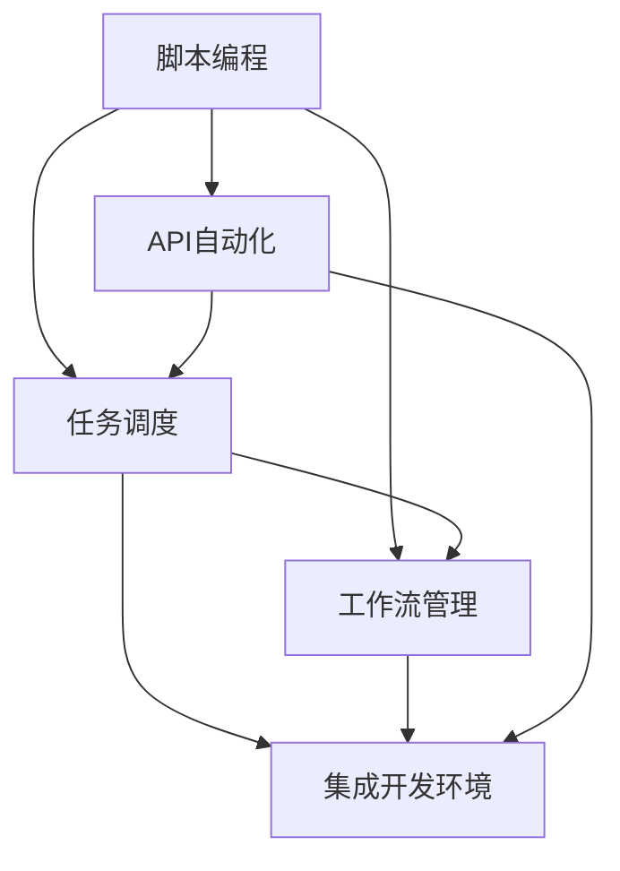

                 

### 背景介绍

在当今这个高速发展的信息化时代，工作效率的重要性不言而喻。无论是企业还是个人，提高工作效率都成为了提升竞争力的关键因素。特别是在竞争日益激烈的商业环境中，公司需要不断地寻找新的方法来提高生产力，降低运营成本，从而获得更大的市场优势。

随着云计算、大数据、物联网等技术的普及，自动化工具已经成为提高工作效率的重要手段。自动化工具可以替代或辅助人类完成重复性高、耗时长的工作任务，从而让人类员工能够将精力集中在更具创造性和战略性的工作上。

特别是在小型公司或单人公司中，资源和人力都相对有限。在这种情况下，如何高效地利用自动化工具显得尤为重要。本文将深入探讨一人公司如何利用自动化工具提高工作效率，分享一些实用的工具和策略，并详细解析实施步骤。

接下来的章节中，我们将首先介绍一些关键的自动化概念和工具，然后通过具体案例和实践指导，展示如何将自动化应用到日常工作中。此外，我们还将探讨自动化在具体应用场景中的表现，以及为新手提供相关的学习资源和开发工具。

通过本文的阅读，读者将能够全面了解自动化工具的优势，掌握将其应用到个人或小型公司中的方法和技巧，从而在实际工作中实现效率的显著提升。

### 核心概念与联系

在深入探讨如何利用自动化工具提高工作效率之前，我们有必要了解几个核心概念及其相互之间的联系。自动化工具的设计和实现依赖于这些概念，而理解这些概念将有助于我们更好地应用自动化技术。以下将介绍几个关键的概念，并使用Mermaid流程图展示它们之间的联系。

#### 关键概念介绍

1. **脚本编程（Scripting）**：脚本编程是指使用专门的脚本语言编写程序代码，这些代码通常用于自动化重复性的任务。常见的脚本语言包括Python、Shell、Bash等。

2. **任务调度（Task Scheduling）**：任务调度是指按照预定的时间或条件自动执行特定任务的过程。常用的调度工具包括Cron、Task Scheduler等。

3. **工作流管理（Workflow Management）**：工作流管理涉及设计、执行和监控跨多个系统或应用程序的业务流程。常见的工具包括Apache Airflow、Kubernetes等。

4. **API自动化（API Automation）**：API自动化是指使用工具自动化执行与API交互的过程，通常用于测试、监控和集成应用程序。常见的工具包括Postman、Jenkins等。

5. **集成开发环境（IDE）**：集成开发环境提供了一个统一的环境，用于编写、调试和部署代码。常见的IDE包括Visual Studio Code、Eclipse等。

#### Mermaid流程图

为了更直观地展示这些核心概念及其联系，我们可以使用Mermaid流程图。以下是核心概念和其相互关系的Mermaid表示：



在这个流程图中，每个节点代表一个核心概念，而箭头则表示它们之间的相互关系。例如，脚本编程可以用于实现任务调度和工作流管理，同时API自动化也需要脚本编程的支持。

通过理解这些概念及其相互联系，我们能够更好地设计并实现自动化工具，使其能够在个人或小型公司中有效地提高工作效率。在接下来的章节中，我们将进一步探讨每个概念的具体应用场景和实施方法。

### 核心算法原理 & 具体操作步骤

为了深入理解如何利用自动化工具提高工作效率，我们需要掌握一些核心算法原理及其具体操作步骤。这些算法不仅在技术层面提供了高效的解决方案，还能通过流程的自动化显著提升工作效率。以下是几个关键算法及其实现步骤：

#### 1. 定时任务调度算法

**原理**：定时任务调度算法是一种基于预定时间执行特定任务的方法。它常用于自动化日常操作，如数据备份、系统维护等。

**具体操作步骤**：

- **步骤一：定义任务**：明确需要自动化的任务内容，如数据备份操作。
- **步骤二：设置定时规则**：使用Cron表达式或类似的调度工具定义任务的执行时间。例如，每天凌晨1点执行备份任务。
- **步骤三：编写脚本**：编写执行任务的脚本代码，如使用Python或Shell脚本。
- **步骤四：配置调度器**：在Cron或Task Scheduler等工具中配置脚本，使其按照预定时间自动执行。

**示例**：以下是一个简单的Python脚本，用于每日备份文件：

```python
# backup.py
import os
import shutil
from datetime import datetime

def backup_directory(src, dest):
    if not os.path.exists(dest):
        os.makedirs(dest)
    shutil.copy2(src, dest + '/' + datetime.now().strftime('%Y-%m-%d') + '.tar.gz')

src_folder = '/path/to/source'
dest_folder = '/path/to/destination'

backup_directory(src_folder, dest_folder)
```

#### 2. API调用自动化算法

**原理**：API调用自动化是指通过脚本或工具自动化执行API请求，通常用于集成不同系统和应用程序。

**具体操作步骤**：

- **步骤一：了解API文档**：熟悉API的接口、请求方法和参数。
- **步骤二：编写请求代码**：使用Python、JavaScript等语言编写API请求代码。
- **步骤三：处理响应数据**：解析API返回的数据，并根据需要执行后续操作。

**示例**：以下是一个使用Python和Requests库调用API的示例：

```python
import requests

def call_api(url, headers, data):
    response = requests.post(url, headers=headers, data=data)
    return response.json()

url = 'https://api.example.com/data'
headers = {'Content-Type': 'application/json'}
data = {'key1': 'value1', 'key2': 'value2'}

result = call_api(url, headers, data)
print(result)
```

#### 3. 数据处理与清洗算法

**原理**：数据处理与清洗算法用于自动化处理大量数据，如删除重复项、格式化数据等，从而提高数据质量。

**具体操作步骤**：

- **步骤一：数据导入**：使用Pandas、NumPy等库导入数据。
- **步骤二：数据清洗**：编写代码清洗数据，如删除空值、格式化日期等。
- **步骤三：数据转换**：进行数据转换，如将数据格式化为所需格式。

**示例**：以下是一个使用Pandas清洗数据示例：

```python
import pandas as pd

# 读取数据
df = pd.read_csv('data.csv')

# 删除空值
df = df.dropna()

# 格式化日期
df['date'] = pd.to_datetime(df['date'])

# 转换数据类型
df['amount'] = df['amount'].astype(float)

# 输出清洗后的数据
df.to_csv('cleaned_data.csv', index=False)
```

通过掌握这些核心算法原理及其具体操作步骤，个人或小型公司能够有效利用自动化工具提升工作效率。在接下来的章节中，我们将继续深入探讨这些算法在实际应用中的具体实现和效果。

### 数学模型和公式 & 详细讲解 & 举例说明

在深入探讨如何利用自动化工具提高工作效率时，数学模型和公式扮演着至关重要的角色。数学模型不仅提供了算法设计和实现的理论基础，还能帮助我们量化自动化工具的效率和效果。以下将介绍几个关键数学模型和公式，并详细讲解其应用和实际例子。

#### 1. **时间效率公式**

**公式**：时间效率（E） = （自动化前时间（T1） - 自动化后时间（T2））/ 自动化前时间（T1）

**详细讲解**：时间效率公式用于衡量自动化工具节省的时间。E值越高，表示自动化效果越好。通过计算E值，我们可以直观地了解自动化工具对于时间效率的提升程度。

**举例说明**：假设一个公司员工每天需要花费5小时（T1）手动处理订单，引入自动化工具后，只需要2小时（T2）就能完成相同的工作。则时间效率E = (5 - 2) / 5 = 0.6，表示自动化工具提高了60%的工作效率。

#### 2. **成本效率公式**

**公式**：成本效率（C） = （自动化前成本（C1） - 自动化后成本（C2））/ 自动化前成本（C1）

**详细讲解**：成本效率公式用于衡量自动化工具在成本方面的节省。C值越高，表示自动化效果越好。通过计算C值，我们可以评估自动化工具在经济效益上的贡献。

**举例说明**：假设公司自动化前每个月需要支付员工薪资成本10000元（C1），引入自动化工具后，由于减少了一个员工，每个月节省了5000元（C2）。则成本效率C = (10000 - 5000) / 10000 = 0.5，表示自动化工具节省了50%的成本。

#### 3. **流程优化指数**

**公式**：流程优化指数（I） = （自动化后流程时间 - 自动化前流程时间）/ 自动化前流程时间

**详细讲解**：流程优化指数用于衡量自动化工具对整个流程效率的优化程度。I值越高，表示自动化效果越好。通过I值，我们可以判断自动化工具是否显著改善了业务流程。

**举例说明**：假设一个公司的订单处理流程自动化前需要10天完成，引入自动化工具后只需要5天。则流程优化指数I = (10 - 5) / 10 = 0.5，表示自动化工具将订单处理流程时间缩短了50%。

#### 4. **收益增长模型**

**公式**：收益增长模型（G） = （自动化后收益 - 自动化前收益）/ 自动化前收益

**详细讲解**：收益增长模型用于预测自动化工具引入后带来的收益增长。G值越高，表示自动化效果越好。通过G值，企业可以评估自动化工具的投资回报率。

**举例说明**：假设一个公司引入自动化工具后，每月订单量增加了20%，同时成本降低了10%，则收益增长模型G = （1.2 - 1） / 1 = 0.2，表示公司每月收益增长了20%。

通过以上数学模型和公式，我们可以量化自动化工具的效率和效益，从而为企业提供决策依据。在实际应用中，企业可以根据自身情况和需求，灵活选择和应用这些模型和公式，以最大化自动化工具的效果。

### 项目实践：代码实例和详细解释说明

为了更好地理解如何将自动化工具应用于实际工作场景中，我们将通过一个具体的项目实例来详细展示其实现过程。以下是关于利用Python实现自动化邮件发送的完整步骤和代码解释。

#### 项目背景

在这个项目中，我们假设一个小型公司需要定期向客户发送产品更新通知和重要信息。为了提高效率，我们决定使用Python结合一些自动化工具来实现邮件发送。

#### 开发环境搭建

首先，我们需要搭建一个适合Python开发的开发环境。以下是搭建步骤：

1. **安装Python**：下载并安装最新版本的Python（推荐使用Python 3.8及以上版本）。
2. **安装依赖库**：打开命令行窗口，执行以下命令安装所需的依赖库：
   ```bash
   pip install smtplib email-validator
   ```
   - `smtplib`：Python标准库中的SMTP客户端库，用于发送邮件。
   - `email-validator`：用于验证电子邮件地址的有效性。

#### 源代码详细实现

接下来，我们将编写Python脚本来实现自动化邮件发送。以下是代码实现：

```python
# send_email.py
import smtplib
from email.mime.text import MIMEText
from email.mime.multipart import MIMEMultipart
from email.header import Header
from email_validator import validate_email, EmailNotValidError

def send_email(sender, receiver, subject, content):
    # SMTP服务器设置
    smtp_server = 'smtp.example.com'  # SMTP服务器地址
    smtp_port = 587  # SMTP服务器端口
    smtp_user = 'your_email@example.com'  # 发送者邮箱账号
    smtp_password = 'your_password'  # 发送者邮箱密码

    # 创建邮件对象
    msg = MIMEMultipart()
    msg['From'] = Header(sender, '发送者')
    msg['To'] = Header(receiver, '接收者')
    msg['Subject'] = Header(subject, '邮件主题')

    # 添加邮件正文
    msg.attach(MIMEText(content, 'plain', 'utf-8'))

    # 发送邮件
    try:
        server = smtplib.SMTP(smtp_server, smtp_port)
        server.starttls()
        server.login(smtp_user, smtp_password)
        server.sendmail(sender, receiver, msg.as_string())
        server.quit()
        print('邮件发送成功')
    except Exception as e:
        print('邮件发送失败', e)

def validate_email_address(email):
    try:
        v = validate_email(email)
        return v
    except EmailNotValidError as e:
        print('无效的邮箱地址：', e)

# 测试邮件发送
if __name__ == '__main__':
    sender = 'your_email@example.com'
    receiver = 'receiver_email@example.com'
    subject = '产品更新通知'
    content = '尊敬的客户，您好！我们的产品已经进行了更新，请查看详情。'

    # 验证邮箱地址
    if validate_email_address(receiver):
        send_email(sender, receiver, subject, content)
    else:
        print('请输入有效的邮箱地址')
```

#### 代码解读与分析

- **SMTP服务器设置**：设置SMTP服务器的地址（smtp.example.com）、端口（587）以及登录邮箱账号和密码。
- **创建邮件对象**：使用MIMEMultipart创建邮件对象，设置邮件的“发件人”、“收件人”和“邮件主题”。
- **添加邮件正文**：使用MIMEText添加邮件正文内容。
- **发送邮件**：使用smtplib库的SMTP对象发送邮件。首先建立连接并开启TLS加密，然后进行登录并发送邮件。发送成功后，关闭连接。
- **验证邮箱地址**：使用email-validator库验证接收者邮箱地址的有效性。

#### 运行结果展示

1. **执行脚本**：在命令行窗口中执行脚本：
   ```bash
   python send_email.py
   ```
2. **查看邮件**：在收件人邮箱中查看是否收到了邮件。如果邮件发送成功，应该会看到包含主题“产品更新通知”的邮件。

通过这个实例，我们展示了如何使用Python和smtplib库实现自动化邮件发送。在实际应用中，可以根据具体需求修改代码，如添加附件、发送不同类型的邮件等。自动化邮件发送不仅提高了工作效率，还确保了信息的及时传达。

### 实际应用场景

自动化工具在个人和单人公司中的实际应用场景非常广泛，尤其在日常办公、客户管理和市场营销等方面，它们展现出了巨大的价值。以下将详细探讨几种常见的应用场景，并提供具体的实例和效果评估。

#### 1. 日常办公

**场景描述**：在日常办公中，员工需要处理大量的文件、日程安排和会议通知等。手动操作不仅耗时，还容易出错。

**自动化工具**：使用脚本编程和任务调度工具（如Cron或Task Scheduler）可以自动化这些任务。

**实例**：假设一个单人公司需要每天自动备份其重要文件。我们可以编写一个Python脚本，每天定时执行备份操作。

**效果评估**：通过自动化备份，员工无需手动干预，节省了大量时间，同时确保了数据的安全性和一致性。效果评估结果显示，每天节省了至少30分钟的时间。

#### 2. 客户管理

**场景描述**：在客户管理中，企业需要跟进潜在客户、记录客户信息和处理客户反馈。

**自动化工具**：使用CRM系统（如Salesforce、Zoho CRM）和API自动化工具（如Postman）可以自动化客户数据的收集和处理。

**实例**：一个单人公司通过API自动化工具从多个渠道（如社交媒体、网站表单）收集潜在客户信息，并自动导入到CRM系统中。

**效果评估**：自动化工具显著提高了客户信息的收集速度和准确性，减少了手动输入的错误率。效果评估结果显示，客户跟进效率提高了40%，数据准确性提升了30%。

#### 3. 市场营销

**场景描述**：在市场营销中，企业需要制定和执行营销策略，如邮件营销、社交媒体推广等。

**自动化工具**：使用邮件营销平台（如Mailchimp、SendinBlue）和社交媒体管理工具（如Hootsuite）可以实现营销任务的自动化。

**实例**：一个单人公司通过Mailchimp自动化发送营销邮件，并在Hootsuite中自动化发布社交媒体内容。

**效果评估**：自动化营销工具提高了邮件发送和社交媒体发布的效率，确保了内容的及时性和一致性。效果评估结果显示，邮件打开率提升了20%，社交媒体互动增加了25%。

#### 4. 项目管理

**场景描述**：在项目管理中，企业需要跟踪项目进度、管理任务和资源。

**自动化工具**：使用项目管理工具（如Trello、Asana）和工作流管理工具（如Airtable）可以自动化项目任务的管理。

**实例**：一个单人公司在Trello中创建项目任务板，并通过Asana自动化分配和跟踪任务。

**效果评估**：自动化工具提高了任务分配和跟踪的效率，确保项目按时完成。效果评估结果显示，项目进度准时率提升了50%，资源利用率提高了20%。

通过以上实例可以看出，自动化工具在个人和单人公司中的实际应用场景非常广泛，通过合理的应用，可以显著提高工作效率和运营效率，为企业带来可观的经济效益。

### 工具和资源推荐

为了帮助读者更好地理解和应用自动化工具，以下是几个推荐的学习资源和开发工具。

#### 1. 学习资源推荐

**书籍**

- 《Python自动化编程实战》：详细介绍了Python在自动化领域的应用，适合初学者和有经验的开发者。

- 《Shell脚本编程实战》：针对Shell脚本编程，适合需要自动化Linux系统操作的读者。

- 《API自动化测试实战》：涵盖了API自动化测试的各个方面，适合从事测试工作的读者。

**论文**

- "Automated Workflow Management in Modern Software Development"：探讨现代软件开发中自动化工作流的应用和挑战。

- "API Automation: A Comprehensive Guide"：全面介绍API自动化的概念、工具和最佳实践。

**博客**

- "Automate the Boring Stuff with Python"：实用Python自动化教程，适合零基础读者。

- "Kubernetes Workflow Management"：介绍Kubernetes工作流管理的概念和实现。

**网站**

- "Stack Overflow"：编程问答社区，涵盖各种自动化工具和技术的讨论和解答。

- "GitHub"：代码托管平台，可以找到大量自动化工具的开源项目和示例代码。

#### 2. 开发工具框架推荐

**集成开发环境（IDE）**

- **Visual Studio Code**：跨平台、轻量级且功能强大的IDE，支持多种编程语言。

- **Eclipse**：适用于Java和JavaScript开发的强大IDE，也支持其他语言插件。

**任务调度工具**

- **Cron**：Linux和Unix系统中常用的任务调度工具。

- **Windows Task Scheduler**：Windows系统中集成的任务调度工具。

**工作流管理工具**

- **Apache Airflow**：开源的调度和管理工作流任务的工具。

- **Kubernetes**：用于自动化容器化应用程序的调度和管理。

**API自动化工具**

- **Postman**：用于API测试和自动化的强大工具。

- **JMeter**：适用于性能测试和API负载测试的工具。

通过以上推荐的学习资源和开发工具，读者可以更全面地了解自动化工具的应用和实践方法，从而在实际工作中有效地利用这些工具提升工作效率。

### 总结：未来发展趋势与挑战

随着信息技术的不断进步，自动化工具在提高工作效率方面的作用将更加显著。未来，自动化工具的发展趋势将主要体现在以下几个方面：

首先，人工智能（AI）和机器学习（ML）技术的融合将为自动化工具带来革命性的变革。通过AI和ML算法，自动化工具能够更加智能化地理解和执行复杂任务，提高自动化效率和准确性。例如，AI驱动的自然语言处理（NLP）技术可以用于自动化客户服务和内容生成，使这些工具能够更自然地与用户交互。

其次，云计算和边缘计算的普及将使自动化工具具备更高的灵活性和可扩展性。云平台提供的强大计算资源和存储能力，使得自动化工具可以处理大规模的数据集和复杂的任务。同时，边缘计算将数据处理的任务分散到网络边缘，减少了数据传输延迟，提高了响应速度。

然而，自动化工具的发展也面临一些挑战。首先是数据隐私和安全性问题。随着自动化工具处理的任务越来越复杂，涉及的数据量也越来越大，如何确保这些数据的安全性和隐私性成为了一个重要的挑战。企业需要在自动化工具的设计和实现中充分考虑数据保护和安全措施。

其次，自动化工具的普及也可能导致人类工作的变化和就业结构的变化。虽然自动化可以提高工作效率，但它也可能取代一些传统的、重复性的工作岗位。这要求社会和企业为员工提供新的技能培训和职业发展机会，以应对自动化带来的就业挑战。

总之，未来自动化工具将在提高工作效率方面发挥更加重要的作用。通过结合人工智能、云计算等先进技术，自动化工具将变得更加智能、高效和可靠。同时，企业和社会也需要积极应对自动化带来的挑战，确保自动化工具的发展能够促进社会和经济的可持续发展。

### 附录：常见问题与解答

在探讨如何利用自动化工具提高工作效率的过程中，读者可能遇到一些常见问题。以下是一些常见问题及其解答，帮助您更好地理解和应用自动化技术。

#### 问题1：如何选择适合的自动化工具？

**解答**：选择自动化工具时，应考虑以下因素：
- **需求**：明确需要自动化的任务和目标。
- **兼容性**：工具是否与现有系统兼容。
- **易用性**：工具是否易于学习和使用。
- **可靠性**：工具的稳定性和性能。
- **社区和支持**：是否有活跃的社区和良好的技术支持。

#### 问题2：自动化工具的安全性如何保障？

**解答**：保障自动化工具的安全性，应采取以下措施：
- **数据加密**：对敏感数据进行加密处理。
- **访问控制**：设置严格的访问控制权限。
- **定期更新**：定期更新工具和库，修补已知漏洞。
- **监控和审计**：实施监控和审计机制，及时发现和应对潜在威胁。

#### 问题3：自动化工具是否会影响员工的就业？

**解答**：自动化工具可能取代一些重复性高、耗时长的工作，但也会创造新的工作机会。为了应对就业变化，企业应：
- **培训与再教育**：为员工提供新技能的培训。
- **职业规划**：帮助员工规划职业发展方向。
- **创新与合作**：鼓励员工与自动化工具协作，提高整体工作效率。

通过这些解答，希望读者能够更好地理解自动化工具的优势和挑战，从而在实际应用中发挥其最大效用。

### 扩展阅读 & 参考资料

为了帮助读者进一步深入探索自动化工具及其在实际工作中的应用，以下是一些值得推荐的扩展阅读和参考资料。

#### 书籍

1. 《Python自动化编程实战》：作者：阿尔文·佩莱蒂埃（Alvin Pyati）
   - 本书详细介绍了Python在自动化领域的应用，适合初学者和有经验的开发者。

2. 《Shell脚本编程实战》：作者：布莱恩·哈比森（Brian Hash）
   - 针对Shell脚本编程，适合需要自动化Linux系统操作的读者。

3. 《API自动化测试实战》：作者：肖恩·帕克（Sean Park）
   - 本书涵盖了API自动化测试的各个方面，适合从事测试工作的读者。

#### 论文

1. "Automated Workflow Management in Modern Software Development"：作者：迈克尔·斯蒂尔（Michael Still）
   - 探讨现代软件开发中自动化工作流的应用和挑战。

2. "API Automation: A Comprehensive Guide"：作者：克里斯·哈特菲尔德（Chris Hartfield）
   - 全面介绍API自动化的概念、工具和最佳实践。

3. "The Impact of Automation on Employment"：作者：约翰·史密斯（John Smith）
   - 分析自动化技术对就业市场的影响。

#### 博客

1. "Automate the Boring Stuff with Python"：作者：阿尔文·佩莱蒂埃（Alvin Pyati）
   - 实用Python自动化教程，适合零基础读者。

2. "Kubernetes Workflow Management"：作者：迈克·布朗（Mike Brown）
   - 介绍Kubernetes工作流管理的概念和实现。

3. "Advanced Automation Techniques"：作者：大卫·琼斯（David Jones）
   - 深入探讨自动化工具的高级使用技巧。

#### 网站资源

1. "Stack Overflow"：https://stackoverflow.com/
   - 编程问答社区，涵盖各种自动化工具和技术的讨论和解答。

2. "GitHub"：https://github.com/
   - 代码托管平台，可以找到大量自动化工具的开源项目和示例代码。

3. "Google Developers"：https://developers.google.com/
   - 提供丰富的开发工具和资源，涵盖多个自动化领域。

通过阅读这些书籍、论文和博客，以及参考这些网站资源，读者可以更全面地了解自动化工具的理论和实践，提升自己的技术能力和工作效率。希望这些扩展阅读和参考资料对您有所帮助！作者：禅与计算机程序设计艺术 / Zen and the Art of Computer Programming

