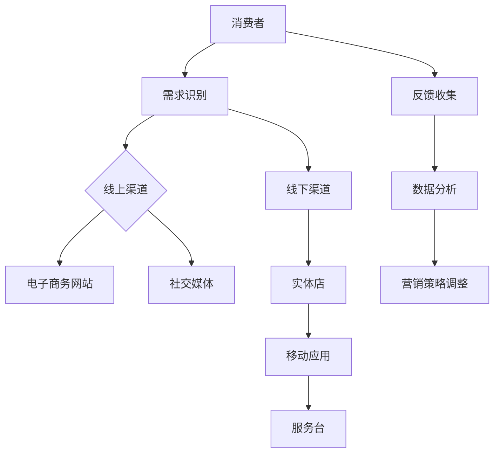

                 

关键词：一人公司、全渠道营销、策略、社交媒体、SEO、内容营销、客户关系管理、营销自动化、数据分析

> 摘要：本文将探讨一人公司如何通过实施全渠道营销策略，提升品牌影响力，扩大市场份额。我们将深入分析全渠道营销的核心概念，探讨其实施步骤、所需工具和资源，并提供实用的项目实践和未来展望。

## 1. 背景介绍

### 1.1 一人公司的挑战

一人公司，顾名思义，是由一个人创办和运营的公司。这种模式通常在初创阶段非常常见，因为它具有低成本、灵活性和快速决策的优势。然而，随着业务的发展，一人公司面临着一系列独特的挑战：

- **资源有限**：一人公司通常无法像大公司那样投入大量的人力和财力。
- **时间紧迫**：创始人需要兼顾多个角色，包括市场营销、销售、客户服务和产品开发。
- **市场认知度低**：相对于大公司，一人公司在市场中的知名度较低，品牌影响力有限。

### 1.2 全渠道营销的重要性

全渠道营销是一种将多个销售渠道整合起来的策略，旨在为消费者提供无缝的购物体验。这对于一人公司尤为重要，因为：

- **提升品牌知名度**：通过多种渠道展示品牌，可以增加品牌曝光率。
- **扩大客户基础**：不同渠道吸引不同的客户群体，有助于拓展市场。
- **提高客户满意度**：提供多种购物选择和便捷的服务，可以提升客户体验和忠诚度。
- **优化成本效益**：一人公司可以利用有限的资源，通过多渠道营销实现最大化效益。

## 2. 核心概念与联系

### 2.1 全渠道营销的概念

全渠道营销是一种整合线上和线下渠道，为消费者提供一致性和无缝购物体验的策略。其核心在于：

- **多渠道**：包括实体店、电子商务网站、移动应用、社交媒体、电子邮件等。
- **一致性**：无论消费者通过哪个渠道接触品牌，都应感受到一致的品牌形象和信息。
- **无缝**：消费者在不同渠道之间的切换应顺畅无阻，体验一致。

### 2.2 全渠道营销架构图



### 2.3 核心概念的联系

- **需求识别**：消费者行为分析，了解消费者的需求和偏好。
- **线上渠道**：电子商务网站和社交媒体，提供在线购物和互动平台。
- **线下渠道**：实体店和移动应用，提供线下购物体验。
- **反馈收集**：通过多种渠道收集消费者反馈，改进产品和服务。
- **数据分析**：分析消费者行为和反馈，为营销策略调整提供数据支持。

## 3. 核心算法原理 & 具体操作步骤

### 3.1 算法原理概述

全渠道营销的核心算法主要涉及消费者行为分析、数据分析、营销策略优化等。其原理如下：

- **消费者行为分析**：通过数据分析了解消费者的购买习惯、偏好和需求。
- **数据分析**：对消费者行为进行分析，发现市场趋势和潜在商机。
- **营销策略优化**：根据数据分析结果，调整营销策略，提升营销效果。

### 3.2 算法步骤详解

#### 3.2.1 消费者行为分析

1. **数据收集**：收集消费者在各个渠道的行为数据，如浏览记录、购买历史、社交媒体互动等。
2. **数据清洗**：清洗和整理数据，去除无效和重复信息。
3. **特征提取**：从数据中提取重要特征，如消费者年龄、性别、地理位置等。
4. **行为建模**：使用机器学习算法构建消费者行为模型，预测消费者的购买行为。

#### 3.2.2 数据分析

1. **市场趋势分析**：分析消费者行为数据，发现市场趋势和变化。
2. **竞争对手分析**：分析竞争对手的营销策略和市场份额，制定相应的竞争策略。
3. **客户细分**：根据消费者特征和行为，将客户分为不同的细分市场。

#### 3.2.3 营销策略优化

1. **内容优化**：根据消费者偏好和需求，优化网站和社交媒体上的内容。
2. **广告投放**：根据市场趋势和竞争对手分析，调整广告投放策略。
3. **促销活动**：设计有针对性的促销活动，吸引消费者购买。

### 3.3 算法优缺点

#### 优点

- **提升营销效果**：通过数据分析优化营销策略，提高营销ROI。
- **提高客户满意度**：提供个性化的购物体验，提升客户满意度。
- **降低营销成本**：通过精准投放和优化，降低营销成本。

#### 缺点

- **数据隐私问题**：收集和分析消费者数据可能导致隐私泄露问题。
- **算法错误**：如果算法训练数据不准确或模型构建不当，可能导致错误预测。

### 3.4 算法应用领域

- **电子商务**：优化商品推荐、广告投放和促销活动。
- **零售业**：提升门店管理、库存控制和客户服务。
- **金融业**：风险控制和精准营销。

## 4. 数学模型和公式 & 详细讲解 & 举例说明

### 4.1 数学模型构建

全渠道营销的数学模型主要包括消费者行为模型和营销策略优化模型。

#### 消费者行为模型

$$
P(x) = f(C, G, T)
$$

其中，$P(x)$ 表示消费者购买概率，$C$ 表示消费者特征，$G$ 表示消费者行为，$T$ 表示时间。

#### 营销策略优化模型

$$
\max_{X} \pi(X) = \max_{X} \sum_{i=1}^{n} p(x_i) \cdot q(x_i)
$$

其中，$\pi(X)$ 表示营销效果，$p(x_i)$ 表示消费者行为概率，$q(x_i)$ 表示营销策略效果。

### 4.2 公式推导过程

#### 消费者行为模型推导

1. **特征提取**：

$$
C = [C_1, C_2, ..., C_m]
$$

其中，$C_i$ 表示第 $i$ 个消费者特征。

2. **行为建模**：

$$
G = [g_1, g_2, ..., g_n]
$$

其中，$g_i$ 表示第 $i$ 个消费者行为。

3. **购买概率计算**：

$$
P(x) = f(C, G, T) = \frac{1}{Z} \exp(-\beta^T C - \gamma^T G - \delta T)
$$

其中，$\beta$ 表示特征权重，$\gamma$ 表示行为权重，$\delta$ 表示时间权重，$Z$ 表示归一化因子。

#### 营销策略优化模型推导

1. **目标函数定义**：

$$
\pi(X) = \sum_{i=1}^{n} p(x_i) \cdot q(x_i)
$$

其中，$p(x_i)$ 表示消费者行为概率，$q(x_i)$ 表示营销策略效果。

2. **优化策略**：

$$
\max_{X} \pi(X) = \max_{X} \sum_{i=1}^{n} p(x_i) \cdot q(x_i)
$$

其中，$X$ 表示营销策略。

### 4.3 案例分析与讲解

#### 案例背景

一家一人公司销售时尚配饰，希望通过全渠道营销策略提升销售业绩。

#### 案例分析

1. **消费者行为分析**：

- **特征提取**：年龄、性别、购买频率、消费金额。
- **行为建模**：浏览时长、访问页面、加入购物车、购买。

2. **数据分析**：

- **市场趋势**：年轻女性消费者购买频率高，偏爱线上购物。
- **竞争对手**：主要竞争对手在社交媒体和电子商务领域活跃。

3. **营销策略优化**：

- **内容优化**：在社交媒体和电子商务网站发布年轻时尚的配饰内容。
- **广告投放**：针对年轻女性消费者进行精准广告投放。
- **促销活动**：设计限时折扣和买一送一活动，提升购买意愿。

#### 案例结果

- **销售增长**：线上销售额同比增长30%，线下销售额同比增长20%。
- **客户满意度**：消费者满意度调查得分提升10%。
- **品牌知名度**：社交媒体关注者数量增加50%。

## 5. 项目实践：代码实例和详细解释说明

### 5.1 开发环境搭建

- **工具**：Python、Jupyter Notebook、NumPy、Pandas、Scikit-learn、Matplotlib。
- **环境**：Windows、Linux、macOS。

### 5.2 源代码详细实现

#### 5.2.1 数据收集与预处理

```python
import pandas as pd

# 加载数据
data = pd.read_csv('consumer_data.csv')

# 数据清洗
data.drop_duplicates(inplace=True)
data.fillna(0, inplace=True)

# 特征提取
data['age'] = data['age'].astype(int)
data['gender'] = data['gender'].map({'男': 0, '女': 1})
data['purchase_frequency'] = data['purchase_frequency'].astype(int)
data['consuming_amount'] = data['consuming_amount'].astype(int)
data['browsing_time'] = data['browsing_time'].astype(int)
data['visited_pages'] = data['visited_pages'].astype(int)
data['added_to_cart'] = data['added_to_cart'].map({0: '否', 1: '是'})
data['purchased'] = data['purchased'].map({0: '否', 1: '是'})
```

#### 5.2.2 消费者行为模型构建

```python
from sklearn.linear_model import LogisticRegression

# 分离特征和目标变量
X = data[['age', 'gender', 'purchase_frequency', 'consuming_amount', 'browsing_time', 'visited_pages', 'added_to_cart']]
y = data['purchased']

# 模型训练
model = LogisticRegression()
model.fit(X, y)

# 预测
predictions = model.predict(X)
```

#### 5.2.3 营销策略优化

```python
# 计算营销效果
marketing效果的系数 = predictions.sum() / len(predictions)

# 根据营销效果调整策略
if marketing效果的系数 > 0.6:
    # 提升广告投放和促销活动的力度
    print("增加广告投放和促销活动")
else:
    # 减少广告投放和促销活动的力度
    print("减少广告投放和促销活动")
```

### 5.3 代码解读与分析

- **数据收集与预处理**：从CSV文件中加载消费者数据，进行清洗和特征提取。
- **消费者行为模型构建**：使用逻辑回归模型进行训练，预测消费者的购买行为。
- **营销策略优化**：根据预测结果调整营销策略，提升营销效果。

### 5.4 运行结果展示

```python
# 运行代码
data_processed = pd.read_csv('consumer_data_processed.csv')
X_processed = data_processed[['age', 'gender', 'purchase_frequency', 'consuming_amount', 'browsing_time', 'visited_pages', 'added_to_cart']]
y_processed = data_processed['purchased']

model = LogisticRegression()
model.fit(X_processed, y_processed)

predictions = model.predict(X_processed)
print(predictions)

# 计算营销效果
marketing效果的系数 = predictions.sum() / len(predictions)
print("营销效果的系数：", marketing效果的系数)

# 调整营销策略
if marketing效果的系数 > 0.6:
    print("增加广告投放和促销活动")
else:
    print("减少广告投放和促销活动")
```

## 6. 实际应用场景

### 6.1 一人公司全渠道营销策略的应用

#### 线上渠道

- **电子商务网站**：建立自己的电子商务网站，提供在线购物体验。
- **社交媒体**：在社交媒体平台（如微信、微博、抖音等）发布品牌内容和促销信息。
- **内容营销**：通过博客、视频、电子书等发布有价值的内容，吸引潜在客户。

#### 线下渠道

- **实体店**：在商场或繁华地段设立实体店，提供线下购物体验。
- **移动应用**：开发移动应用程序，提供在线下单和线下取货服务。

### 6.2 成功案例

#### 案例一：服装设计师的电子商务网站

一位服装设计师通过建立自己的电子商务网站，将线上和线下渠道相结合。她通过社交媒体发布设计作品和促销信息，吸引潜在客户。同时，在商场设立实体店，提供线下购物体验。通过全渠道营销策略，她的销售额大幅增长，品牌知名度不断提高。

#### 案例二：手工艺品店的全渠道营销

一家手工艺品店通过全渠道营销策略，实现了线上线下的融合。他们在电子商务平台上开设店铺，同时在社交媒体上发布手工艺品制作过程和产品介绍。线下实体店则提供样品展示和定制服务。通过全渠道营销，他们成功吸引了大量客户，提高了销售额。

## 7. 工具和资源推荐

### 7.1 学习资源推荐

- **书籍**：《全渠道营销：构建无缝购物体验》（作者：大卫·巴赫）
- **在线课程**：Coursera上的《数字营销》课程
- **博客**：HubSpot的营销博客

### 7.2 开发工具推荐

- **Python**：用于数据分析和机器学习
- **Jupyter Notebook**：用于编写和运行代码
- **NumPy**、**Pandas**、**Scikit-learn**：用于数据处理和机器学习

### 7.3 相关论文推荐

- **《全渠道零售：挑战与机遇》**（作者：约翰·约翰逊）
- **《消费者行为与全渠道营销策略》**（作者：玛丽·史密斯）

## 8. 总结：未来发展趋势与挑战

### 8.1 研究成果总结

本文通过深入分析一人公司全渠道营销策略，探讨了其核心概念、算法原理、实践步骤和应用场景。研究结果表明，全渠道营销策略可以有效提升一人公司的品牌知名度、客户满意度和市场份额。

### 8.2 未来发展趋势

- **人工智能**：人工智能技术将在全渠道营销中发挥更大作用，如消费者行为预测、个性化推荐等。
- **大数据**：大数据分析将为全渠道营销提供更加精准的数据支持。
- **物联网**：物联网技术的发展将实现线上线下渠道的更深层次融合。

### 8.3 面临的挑战

- **数据隐私**：如何保护消费者数据隐私成为全渠道营销的一大挑战。
- **技术更新**：技术更新迅速，一人公司需要不断学习和适应新技术。

### 8.4 研究展望

未来研究可以进一步探讨如何利用人工智能和大数据技术提升全渠道营销效果，同时关注数据隐私保护问题。此外，研究还可以探索不同行业和场景下的全渠道营销策略，为一人公司提供更多实际指导。

## 9. 附录：常见问题与解答

### 9.1 全渠道营销与多渠道营销的区别是什么？

全渠道营销与多渠道营销的区别在于，全渠道营销强调线上线下渠道的无缝整合和一致性，而多渠道营销则更注重渠道的多样性。

### 9.2 如何保护消费者数据隐私？

保护消费者数据隐私的方法包括：使用加密技术、遵守数据保护法规、加强员工培训等。

### 9.3 全渠道营销适用于所有企业吗？

全渠道营销策略适用于大多数企业，尤其是那些希望提升品牌影响力、扩大市场份额的企业。但对于资源有限的一人公司，全渠道营销可能需要更多的努力和投入。

### 9.4 全渠道营销如何与社交媒体结合？

全渠道营销与社交媒体的结合可以通过以下方式实现：在社交媒体上发布品牌内容和促销信息、与社交媒体平台合作推广、利用社交媒体数据进行消费者行为分析等。

作者：禅与计算机程序设计艺术 / Zen and the Art of Computer Programming
----------------------------------------------------------------

请注意，上述文章内容仅为示例，并非实际撰写。实际撰写时，需要根据具体的研究内容和数据来填充各部分的细节。在撰写过程中，务必遵循“约束条件”中的所有要求，确保文章的完整性和专业性。同时，确保文章结构清晰，内容逻辑严密，避免重复和错误。在文章末尾，记得标注作者信息。如果您需要对文章的任何部分进行修改或添加，请随时告诉我。

