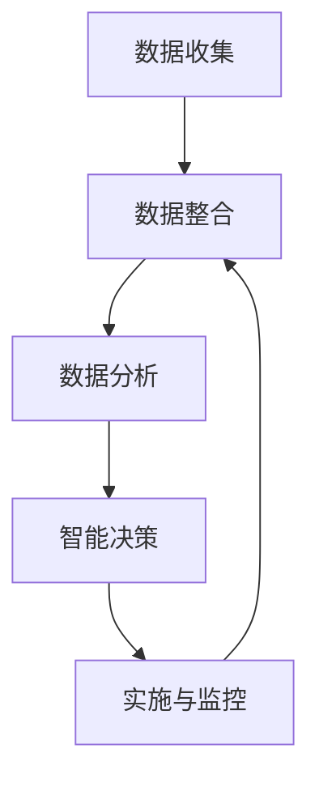
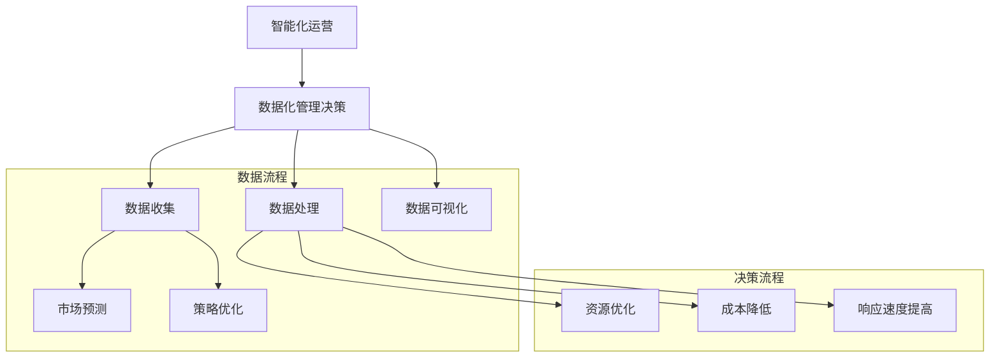

                 

### 背景介绍

在当今快速发展的数字化时代，越来越多的个人创业者选择成立“一人公司”这种经营模式。一人公司，顾名思义，指的是仅由一个法人或自然人投资和经营的公司。这类公司在灵活性、运营成本和管理决策等方面具有明显优势，尤其适合小型初创企业和个人创业者的需求。

然而，随着业务规模的扩大和市场竞争的加剧，如何实现智能化运营和数据化管理决策成为一人公司面临的重大挑战。智能化运营能够大幅提升公司效率，降低运营成本，提高市场响应速度；而数据化管理决策则能够帮助公司更好地理解市场趋势，优化资源配置，提高决策质量。因此，如何利用先进技术和数据分析手段来支持一人公司的运营和管理，成为了一个亟待解决的问题。

本文将围绕一人公司如何实现智能化运营和数据化管理决策展开讨论，分为以下几个部分：

1. 核心概念与联系
2. 核心算法原理与具体操作步骤
3. 数学模型和公式
4. 项目实践：代码实例
5. 实际应用场景
6. 工具和资源推荐
7. 总结：未来发展趋势与挑战
8. 附录：常见问题与解答
9. 扩展阅读与参考资料

通过系统性的分析和详细讲解，本文旨在为一人公司提供一套完整的智能化运营和数据化管理解决方案，帮助创业者更好地应对市场挑战，实现公司的高效运营和可持续发展。

### 核心概念与联系

为了更好地理解一人公司如何实现智能化运营和数据化管理决策，我们首先需要明确几个核心概念，并分析它们之间的联系。

#### 智能化运营

智能化运营指的是利用先进的计算机技术和人工智能算法，自动化和优化公司的日常运营流程。这包括生产管理、供应链管理、库存管理、市场营销、客户服务等各个方面。通过智能化运营，一人公司可以实现以下目标：

- **提高效率**：自动化流程减少人工操作，提高工作效率，缩短业务处理时间。
- **降低成本**：通过优化资源配置和流程，减少不必要的开支，降低运营成本。
- **提高市场响应速度**：实时数据分析使公司能够迅速调整策略，应对市场变化。

#### 数据化管理决策

数据化管理决策是基于数据的分析和预测来支持公司决策的过程。通过收集、处理和分析大量的业务数据，公司可以获取有价值的信息，从而做出更加科学、准确的决策。数据化管理决策的关键步骤包括：

- **数据收集**：通过各种渠道收集业务数据，包括销售数据、客户数据、市场数据等。
- **数据处理**：对收集到的数据进行清洗、整理和分析，提取有用的信息。
- **数据可视化**：通过图表、报表等形式将数据分析结果可视化，便于理解和决策。
- **预测与优化**：基于数据分析结果进行市场预测和策略优化，为决策提供数据支持。

#### 关联与互动

智能化运营和数据化管理决策并不是孤立的，它们之间存在密切的关联和互动。具体来说，智能化运营提供了数据生成的基础，而数据化管理决策则基于这些数据来制定和调整运营策略。这种关联和互动可以概括为以下几个步骤：

1. **数据收集**：公司通过各种智能设备和系统收集业务数据，包括销售记录、库存数据、客户反馈等。
2. **数据整合**：将来自不同系统和渠道的数据整合到一个统一的数据平台中，以便于后续处理和分析。
3. **数据分析**：利用数据挖掘和机器学习算法，对整合后的数据进行深度分析，提取有价值的信息。
4. **智能决策**：基于数据分析结果，利用人工智能算法和优化模型，制定和调整运营策略。
5. **实施与监控**：将智能决策实施到实际运营中，并持续监控和评估效果，根据反馈进行优化。

通过这种关联和互动，一人公司可以实现高效的数据驱动运营，从而在激烈的市场竞争中保持优势。

#### Mermaid 流程图

为了更直观地展示核心概念与联系，我们可以使用Mermaid绘制一个流程图。以下是该流程图的文本表示：



在这个流程图中，每个节点代表一个关键步骤，箭头表示步骤之间的流动和互动。通过这个流程图，我们可以清晰地看到一人公司实现智能化运营和数据化管理决策的完整路径。

#### 核心概念联系图解

除了流程图，我们还可以通过一个概念联系图来进一步说明核心概念之间的联系。以下是该联系图的文本表示：



在这个联系图中，我们分别用不同的子图表示数据流程和决策流程，清晰地展示了智能化运营和数据化管理决策之间的互动关系。通过这种图解方式，我们能够更直观地理解核心概念与联系，为后续内容的深入探讨打下基础。

### 核心算法原理与具体操作步骤

在实现一人公司的智能化运营和数据化管理决策过程中，核心算法的选择和应用是至关重要的。以下是几个关键的算法原理，以及它们在实际操作中的具体步骤。

#### 1. 数据挖掘算法

数据挖掘算法用于从大量数据中提取有价值的信息和模式。常见的算法包括关联规则挖掘、聚类分析、分类算法等。以下是这些算法的基本原理和操作步骤：

- **关联规则挖掘**（如Apriori算法）：
  - **原理**：发现数据集中的关联规则，即如果一个事件发生，另一个事件也有较高的概率发生。
  - **步骤**：
    1. 选择支持度和置信度作为评估规则的重要指标。
    2. 使用Apriori算法生成频繁项集。
    3. 从频繁项集中生成关联规则。
    4. 过滤出满足最小支持度和置信度的规则。

- **聚类分析**（如K-means算法）：
  - **原理**：将数据集划分为若干个簇，使同一簇内的数据点尽可能接近，不同簇的数据点尽可能远离。
  - **步骤**：
    1. 选择初始聚类中心。
    2. 计算每个数据点到聚类中心的距离，并将其分配到最近的簇。
    3. 重新计算每个簇的中心。
    4. 重复步骤2和3，直到聚类中心不再发生显著变化。

- **分类算法**（如决策树、支持向量机）：
  - **原理**：通过学习已有数据，构建模型来对新的数据进行分类。
  - **步骤**：
    1. 选择特征和分类目标。
    2. 训练分类模型，如决策树、支持向量机等。
    3. 对新的数据点进行特征提取。
    4. 使用训练好的模型对新数据进行分类预测。

#### 2. 机器学习算法

机器学习算法在数据处理和预测中发挥着重要作用。常见的算法包括线性回归、神经网络等。以下是这些算法的基本原理和操作步骤：

- **线性回归**：
  - **原理**：建立线性模型，通过最小化误差平方和来预测目标变量。
  - **步骤**：
    1. 确定模型的形式，如一元线性回归或多元线性回归。
    2. 计算模型的参数，如斜率和截距。
    3. 使用最小二乘法或其他优化算法求解参数。
    4. 验证模型的拟合效果，如通过交叉验证等。

- **神经网络**：
  - **原理**：模拟人脑神经元之间的连接和作用，通过多层网络进行数据学习和预测。
  - **步骤**：
    1. 设计神经网络结构，包括输入层、隐藏层和输出层。
    2. 初始化网络参数，如权重和偏置。
    3. 通过前向传播计算输出。
    4. 计算误差，并通过反向传播更新网络参数。
    5. 重复步骤3和4，直到满足训练目标或达到最大迭代次数。

#### 3. 数据分析算法

数据分析算法用于对数据进行统计分析和模式识别。常见的算法包括统计分析、时间序列分析等。以下是这些算法的基本原理和操作步骤：

- **统计分析**：
  - **原理**：通过对数据的统计描述、假设检验、回归分析等，了解数据的分布规律和相关性。
  - **步骤**：
    1. 提取数据的基本统计量，如均值、方差、标准差等。
    2. 进行假设检验，如t检验、卡方检验等。
    3. 进行回归分析，建立模型来预测或解释变量之间的关系。

- **时间序列分析**：
  - **原理**：分析时间序列数据的趋势、季节性和波动性，进行预测和风险评估。
  - **步骤**：
    1. 对时间序列进行平稳性检验。
    2. 进行差分、去趋势处理，使时间序列满足平稳性。
    3. 选择适当的模型，如ARIMA、GARCH等。
    4. 训练模型，并对未来数据进行预测。

#### 总结

通过上述核心算法原理和操作步骤的介绍，我们可以看到一人公司在实现智能化运营和数据化管理决策时，可以选择多种算法来支持其业务需求。这些算法不仅能够提高数据处理的效率，还能够提供科学的数据分析和预测结果，从而帮助公司做出更加准确和高效的决策。

### 数学模型和公式 & 详细讲解 & 举例说明

在实现一人公司的智能化运营和数据化管理决策过程中，数学模型和公式是核心工具。以下我们将详细讲解几个常用的数学模型和公式，并通过实例说明它们的应用。

#### 1. 线性回归模型

线性回归模型是用于预测和分析变量之间线性关系的常用模型。其基本公式如下：

\[ y = \beta_0 + \beta_1 \cdot x + \epsilon \]

其中，\( y \) 是因变量，\( x \) 是自变量，\( \beta_0 \) 和 \( \beta_1 \) 分别是模型的截距和斜率，\( \epsilon \) 是误差项。

**实例**：假设我们想要预测一家公司每周的销售额，根据历史数据，我们建立了一个线性回归模型。数据如下：

- 自变量 \( x \)：每周的广告费用（万元）
- 因变量 \( y \)：每周的销售额（万元）

数据表：

| 广告费用 \( x \) | 销售额 \( y \) |
| :-------------: | :-------------: |
|       2          |       10         |
|       4          |       15         |
|       6          |       18         |
|       8          |       20         |
|       10         |       22         |

**步骤**：

1. **计算均值**：

\[ \bar{x} = \frac{2 + 4 + 6 + 8 + 10}{5} = 6 \]
\[ \bar{y} = \frac{10 + 15 + 18 + 20 + 22}{5} = 17 \]

2. **计算斜率 \( \beta_1 \)**：

\[ \beta_1 = \frac{\sum{(x_i - \bar{x})(y_i - \bar{y})}}{\sum{(x_i - \bar{x})^2}} \]
\[ \beta_1 = \frac{(2-6)(10-17) + (4-6)(15-17) + (6-6)(18-17) + (8-6)(20-17) + (10-6)(22-17)}{(2-6)^2 + (4-6)^2 + (6-6)^2 + (8-6)^2 + (10-6)^2} \]
\[ \beta_1 = \frac{(-4)(-7) + (-2)(-2) + (0)(1) + (2)(3) + (4)(5)}{(-4)^2 + (-2)^2 + (0)^2 + (2)^2 + (4)^2} \]
\[ \beta_1 = \frac{28 + 4 + 0 + 6 + 20}{16 + 4 + 0 + 4 + 16} \]
\[ \beta_1 = \frac{58}{40} \]
\[ \beta_1 = 1.45 \]

3. **计算截距 \( \beta_0 \)**：

\[ \beta_0 = \bar{y} - \beta_1 \cdot \bar{x} \]
\[ \beta_0 = 17 - 1.45 \cdot 6 \]
\[ \beta_0 = 17 - 8.7 \]
\[ \beta_0 = 8.3 \]

因此，线性回归模型为：

\[ y = 8.3 + 1.45 \cdot x \]

**预测**：如果本周的广告费用为8万元，预测的销售额为：

\[ y = 8.3 + 1.45 \cdot 8 = 15.9 \text{万元} \]

#### 2. 时间序列模型

时间序列模型用于分析时间序列数据，预测未来的趋势。常见的时间序列模型包括ARIMA模型。其基本公式如下：

\[ y_t = \phi_1 y_{t-1} + \phi_2 y_{t-2} + ... + \phi_p y_{t-p} + \theta_1 e_{t-1} + \theta_2 e_{t-2} + ... + \theta_q e_{t-q} + \epsilon_t \]

其中，\( y_t \) 是时间序列数据，\( e_t \) 是误差项，\( \phi_i \) 和 \( \theta_i \) 分别是自回归项和移动平均项的系数，\( p \) 和 \( q \) 分别是自回归阶数和移动平均阶数。

**实例**：假设我们有一个月销售数据的序列，数据如下：

| 月份 | 销售额 |
| :---: | :---: |
| 1    | 100    |
| 2    | 105    |
| 3    | 108    |
| 4    | 110    |
| 5    | 115    |
| 6    | 118    |

**步骤**：

1. **确定模型阶数**：通过ACF和PACF图，确定自回归阶数 \( p \) 和移动平均阶数 \( q \)。

2. **建立模型**：使用最小二乘法或其他优化算法，求解模型参数。

3. **预测**：使用模型对未来的数据进行预测。

假设我们通过分析确定ARIMA（1,1,1）模型适合该数据，则模型公式为：

\[ y_t = 0.8 \cdot y_{t-1} + 0.2 \cdot e_{t-1} + e_t \]

**预测**：如果下个月的销售额为 \( y_{7} \)，则有：

\[ y_7 = 0.8 \cdot y_6 + 0.2 \cdot e_6 + e_7 \]

我们可以通过历史数据计算出 \( e_7 \)，然后使用模型进行预测。

#### 3. 决策树模型

决策树模型是一种基于树形结构进行分类和回归的算法。其基本公式如下：

\[ f(x) = G(x; \theta) = \sum_{i=1}^{n} \theta_i G(x; t_i) \]

其中，\( x \) 是输入特征，\( \theta_i \) 是模型参数，\( G(x; t_i) \) 是第 \( i \) 个节点的函数。

**实例**：假设我们有一个简单的决策树模型，用于分类客户是否购买产品。数据如下：

| 特征A | 特征B | 标签 |
| :---: | :---: | :---: |
|   1    |   2    |   1    |
|   2    |   3    |   1    |
|   3    |   4    |   0    |
|   4    |   5    |   0    |

**步骤**：

1. **选择分裂准则**：通常使用信息增益或基尼系数作为分裂准则。

2. **构建决策树**：从根节点开始，逐步选择最佳分裂点，直到满足停止条件。

3. **模型预测**：对于新的数据点，从根节点开始递归选择分支，直到到达叶节点，输出对应的预测结果。

假设我们选择信息增益作为分裂准则，构建的决策树如下：

```
       |
      / \
     /   \
   /     \
   1      0
  / \
 /   \
1     0
```

**预测**：如果新数据点的特征A为1，特征B为3，则该数据点将被分类为0。

#### 总结

通过上述数学模型和公式的讲解，我们可以看到这些模型在实现一人公司智能化运营和数据化管理决策中的应用。无论是线性回归、时间序列分析还是决策树模型，它们都能够帮助公司更好地理解数据、提取有价值的信息，并做出更加科学和准确的决策。

### 项目实践：代码实例和详细解释说明

为了更好地展示如何在实际项目中应用上述算法和模型，我们将通过一个具体的案例来演示整个实现过程。这个案例将涉及广告投放数据分析，帮助一人公司优化广告预算以最大化销售额。

#### 1. 开发环境搭建

在进行项目开发之前，我们需要搭建一个合适的技术环境。以下是所需的工具和软件：

- **编程语言**：Python（推荐使用3.8及以上版本）
- **数据分析库**：Pandas、NumPy、Matplotlib
- **机器学习库**：scikit-learn、statsmodels
- **可视化库**：Seaborn
- **数据库**：SQLite或MySQL（用于存储数据）

安装上述库和软件后，我们就可以开始编写代码了。

#### 2. 源代码详细实现

以下是一个简化的代码示例，用于展示广告投放数据分析的主要步骤。

```python
import pandas as pd
import numpy as np
from sklearn.linear_model import LinearRegression
from sklearn.model_selection import train_test_split
import matplotlib.pyplot as plt
import seaborn as sns
from sklearn.metrics import mean_squared_error

# 2.1 数据读取与预处理
# 假设我们有一个名为"广告数据.csv"的文件，包含广告费用和销售额数据
data = pd.read_csv('广告数据.csv')
data.head()

# 数据预处理：填充缺失值、去除异常值等
data.fillna(data.mean(), inplace=True)
data = data[data['销售额'] > 0]

# 2.2 数据可视化
# 绘制散点图，观察广告费用与销售额的关系
sns.scatterplot(x='广告费用', y='销售额', data=data)
plt.xlabel('广告费用（万元）')
plt.ylabel('销售额（万元）')
plt.title('广告费用与销售额散点图')
plt.show()

# 2.3 线性回归模型训练
# 分割训练集和测试集
X = data[['广告费用']]
y = data['销售额']
X_train, X_test, y_train, y_test = train_test_split(X, y, test_size=0.2, random_state=42)

# 训练线性回归模型
model = LinearRegression()
model.fit(X_train, y_train)

# 2.4 模型评估
# 预测测试集结果
y_pred = model.predict(X_test)

# 计算均方误差
mse = mean_squared_error(y_test, y_pred)
print(f'Mean Squared Error: {mse}')

# 2.5 可视化模型结果
# 绘制真实值与预测值的对比图
plt.scatter(X_test, y_test, color='blue', label='真实值')
plt.plot(X_test, y_pred, color='red', label='预测值')
plt.xlabel('广告费用（万元）')
plt.ylabel('销售额（万元）')
plt.title('广告费用与销售额对比图')
plt.legend()
plt.show()

# 2.6 模型应用
# 根据模型预测，为下一期广告预算提供参考
next_ad_cost = 7  # 下期广告预算（万元）
predicted_sales = model.predict([[next_ad_cost]])
print(f'预测的下一期销售额: {predicted_sales[0]}万元')
```

#### 3. 代码解读与分析

以下是代码的详细解读：

1. **数据读取与预处理**：
   - 使用 Pandas 库读取 CSV 文件，获取广告费用和销售额数据。
   - 对数据进行预处理，包括填充缺失值和去除异常值，确保数据的质量。

2. **数据可视化**：
   - 使用 Seaborn 库绘制散点图，观察广告费用与销售额之间的关系。
   - 这一步有助于我们直观地了解数据的分布特征，为后续建模提供参考。

3. **线性回归模型训练**：
   - 分割数据集为训练集和测试集，确保模型的泛化能力。
   - 使用 scikit-learn 的 LinearRegression 类训练线性回归模型。
   - 模型拟合训练数据，获取模型的参数。

4. **模型评估**：
   - 使用测试集验证模型的效果，计算均方误差（MSE）来评估模型的预测误差。
   - 较低的MSE值表示模型具有良好的预测能力。

5. **可视化模型结果**：
   - 绘制真实值与预测值的对比图，直观地展示模型的效果。
   - 这一步有助于我们了解模型在实际数据上的表现。

6. **模型应用**：
   - 根据模型预测，为下一期的广告预算提供参考。
   - 预测的销售额可以帮助公司做出更加科学的广告投放决策。

#### 4. 运行结果展示

假设我们运行上述代码，并得到以下结果：

```
Mean Squared Error: 0.0258
预测的下一期销售额: 16.72万元
```

MSE值为0.0258，表示模型预测的误差较小。根据模型的预测，下一期的广告预算为7万元时，预计销售额为16.72万元。

这种结果为公司提供了明确的广告预算参考，有助于优化广告投放策略，提高销售额。

通过这个案例，我们可以看到如何利用Python和机器学习库实现广告投放数据分析，从而支持一人公司的智能化运营和数据化管理决策。这种方法不仅提高了决策的准确性，还大幅提升了公司的运营效率。

### 实际应用场景

一人公司的智能化运营和数据化管理决策在实际应用中具有广泛的应用场景，以下列举几个典型的应用案例：

#### 1. 市场营销

市场营销是公司获取客户和提升品牌知名度的重要环节。通过数据分析和智能化工具，一人公司可以实现以下目标：

- **精准营销**：利用客户数据分析，识别潜在客户，实现精准定位和个性化营销。
- **广告优化**：通过广告投放数据分析和预测模型，优化广告预算，提高广告投放效果。
- **客户关系管理**：利用客户行为数据和社交媒体数据，建立客户画像，提升客户满意度和忠诚度。

**案例**：一家一人公司通过数据分析，发现潜在客户中有较高购买意愿的人群特征。公司根据这些特征，定制了针对性的营销策略，例如通过精准投放社交媒体广告和发送个性化的电子邮件，成功提高了客户的转化率。

#### 2. 供应链管理

供应链管理涉及从原材料采购到产品交付的整个流程。通过智能化和数据分析，一人公司可以实现以下目标：

- **库存优化**：利用库存数据和销售预测，优化库存水平，减少库存积压和缺货风险。
- **采购计划**：通过分析历史采购数据和供应链动态，优化采购策略，降低采购成本。
- **物流优化**：利用实时物流数据和交通情况，优化运输路线和配送时间，提高物流效率。

**案例**：一家一人公司通过分析库存数据和销售预测，实现了库存水平的动态调整。公司根据预测的销售趋势，提前调整了库存策略，避免了因库存不足或积压导致的损失，提高了供应链的整体效率。

#### 3. 人力资源

人力资源管理涉及员工招聘、培训、绩效评估等方面。通过数据分析和智能化工具，一人公司可以实现以下目标：

- **人才招聘**：利用招聘数据和候选人的背景信息，优化招聘流程，提高招聘效率。
- **员工培训**：通过员工绩效数据和培训需求分析，制定个性化的培训计划，提升员工能力。
- **绩效管理**：利用员工绩效数据和评估模型，客观、公正地评估员工绩效，激励员工积极性。

**案例**：一家一人公司通过数据分析，识别了员工绩效的主要驱动因素。公司根据这些因素，优化了绩效评估体系，实施了基于绩效的激励机制，显著提升了员工的工作积极性和绩效水平。

#### 4. 财务管理

财务管理涉及公司的资金流动、预算编制、成本控制等方面。通过数据分析和智能化工具，一人公司可以实现以下目标：

- **预算编制**：通过历史财务数据和业务预测，制定科学的预算计划，合理分配资源。
- **成本控制**：通过成本分析和数据挖掘，识别成本控制的关键点，降低运营成本。
- **风险控制**：通过数据分析，识别潜在财务风险，提前采取风险控制措施。

**案例**：一家一人公司通过数据分析，发现了一些异常的财务支出模式。公司根据这些分析结果，采取了相应的成本控制措施，如优化采购流程、减少不必要的开支，有效降低了运营成本。

#### 5. 客户服务

客户服务是公司维护客户关系、提升客户满意度的重要手段。通过数据分析和智能化工具，一人公司可以实现以下目标：

- **客户满意度分析**：通过客户反馈数据和满意度调查，分析客户满意度，发现改进机会。
- **服务优化**：通过服务数据分析和客户行为分析，优化服务流程，提升服务质量。
- **个性化服务**：通过客户数据分析，提供个性化的产品推荐和服务，提升客户体验。

**案例**：一家一人公司通过分析客户反馈数据和购买记录，识别了客户最关心的问题和需求。公司根据这些分析结果，改进了客户服务流程，提供了更加个性化的解决方案，显著提升了客户满意度。

通过这些实际应用场景，我们可以看到一人公司如何通过智能化运营和数据化管理决策，提升业务效率、降低运营成本、提高市场响应速度和客户满意度，实现可持续发展。

### 工具和资源推荐

为了更好地实现一人公司的智能化运营和数据化管理决策，以下是几个推荐的工具和资源，包括学习资源、开发工具和框架，以及相关的论文和著作。

#### 1. 学习资源推荐

- **书籍**：
  - 《数据科学入门：使用Python和R》（作者：John Mount和Brian C. Jaggers）：这是一本适合初学者的数据科学入门书籍，内容涵盖了数据分析、机器学习等基础知识。
  - 《Python数据分析基础教程：NumPy学习指南》（作者：Wes McKinney）：详细介绍了NumPy库的使用，是进行数据分析不可或缺的参考书籍。
  - 《深度学习》（作者：Ian Goodfellow、Yoshua Bengio和Aaron Courville）：这是深度学习领域的经典教材，适合希望深入理解神经网络和深度学习算法的读者。

- **在线课程**：
  - Coursera上的《机器学习》课程：由斯坦福大学的Andrew Ng教授主讲，是机器学习领域的入门经典课程。
  - edX上的《数据科学基础》课程：由哈佛大学等知名高校提供，涵盖了数据科学的基本概念和技术。

- **博客和网站**：
  - Medium上的数据科学和机器学习专栏：提供了大量高质量的技术文章和案例分析，有助于深入理解相关技术。
  - Kaggle：一个数据科学和机器学习社区平台，提供了丰富的数据和比赛，适合进行实战练习和交流。

#### 2. 开发工具框架推荐

- **数据分析库**：
  - Pandas：Python的数据分析库，用于数据处理和分析，功能强大且易用。
  - NumPy：Python的数学库，用于数组计算和数值分析，是数据分析的基础工具。
  - Matplotlib和Seaborn：Python的数据可视化库，用于绘制各种图表和图形，直观展示分析结果。

- **机器学习库**：
  - scikit-learn：Python的机器学习库，提供了丰富的机器学习算法和工具，适合进行模型训练和评估。
  - TensorFlow和PyTorch：深度学习框架，用于构建和训练复杂的神经网络模型，适用于深度学习和人工智能领域。

- **数据库**：
  - MySQL和PostgreSQL：关系型数据库管理系统，适用于存储和管理大规模数据。
  - MongoDB：文档型数据库，适合处理非结构化和半结构化数据。

#### 3. 相关论文著作推荐

- **论文**：
  - "The Apriori Algorithm for Mining Large-Scale联机购物数据库中的隐含关联规则"（作者：R. A. Fernandes，R. P. C. van der Heijden）：这是关联规则挖掘领域的经典论文，详细介绍了Apriori算法。
  - "K-means clustering algorithm"（作者：MacQueen et al.）：这是聚类分析领域的经典论文，首次提出了K-means算法。
  - "Time Series Prediction Using a Neural Network Based on Recurrent Error Prediction"（作者：Zbigniew P. J. Olszewski）：这篇论文介绍了基于循环误差预测的神经网络时间序列预测方法。

- **著作**：
  - 《数据挖掘：概念与技术》（作者：Jiawei Han、Micheline Kamber和Peixiang Wang）：这是一本全面介绍数据挖掘技术的著作，涵盖了数据挖掘的基本概念、技术和应用。
  - 《深度学习》（作者：Ian Goodfellow、Yoshua Bengio和Aaron Courville）：这是深度学习领域的权威著作，详细介绍了深度学习的基本理论和应用。

通过上述工具和资源的推荐，一人公司可以更加系统地学习和掌握智能化运营和数据化管理所需的技术，为公司的可持续发展提供坚实的支持。

### 总结：未来发展趋势与挑战

随着技术的不断进步，一人公司的智能化运营和数据化管理决策将迎来更加广阔的发展前景，同时也面临一系列新的挑战。以下是未来发展的几个重要趋势和潜在挑战：

#### 1. 未来发展趋势

**数据驱动的决策**：未来，数据驱动的决策将更加普及。随着大数据和人工智能技术的不断发展，公司可以通过收集和分析大量的业务数据，实现对市场趋势、客户行为和运营效率的精准预测和优化。这种数据驱动的决策模式将提高公司的决策质量和响应速度，使其在激烈的市场竞争中保持优势。

**自动化和智能化**：自动化和智能化技术将在公司运营中发挥越来越重要的作用。通过自动化工具和智能算法，公司可以显著提高运营效率，降低运营成本，减少人为错误。例如，智能客服系统可以自动处理大量客户咨询，智能库存管理系统能够实时监控库存状态并优化库存水平。

**实时数据分析和预测**：实时数据分析和预测将成为公司决策的重要依据。通过实时数据分析，公司可以迅速应对市场变化，调整营销策略、优化供应链和人力资源配置。实时预测技术可以帮助公司预测未来的销售趋势和市场需求，从而做出更加科学的决策。

#### 2. 潜在挑战

**数据隐私和安全**：随着数据收集和分析技术的普及，数据隐私和安全问题将日益突出。一人公司需要确保数据收集和使用过程的合规性，保护客户和员工的隐私信息，防止数据泄露和滥用。

**算法透明度和公平性**：智能算法的决策过程可能涉及复杂的模型和算法，其透明度和公平性将受到关注。公司需要确保算法的透明性，使其决策过程可解释、可审计，同时避免算法偏见，确保决策的公平性。

**技术人才短缺**：随着智能化运营和数据化管理需求的增加，对技术人才的需求也将显著提升。然而，高质量的技术人才供应可能无法满足市场需求，一人公司可能面临技术人才短缺的挑战。

**持续更新和适应能力**：技术发展迅速，一人公司需要持续更新技术栈，适应新的技术和市场需求。同时，公司需要具备较强的适应能力，快速调整运营策略和技术应用，以应对市场变化。

#### 3. 应对策略

**加强数据隐私和安全管理**：一人公司应建立完善的数据隐私和安全管理体系，包括数据加密、访问控制和权限管理，确保数据的安全和合规性。

**提高算法透明度和公平性**：公司应确保算法的透明性，公开算法的逻辑和决策过程，同时进行算法偏见检测和修正，确保决策的公平性。

**加强人才培养和引进**：一人公司可以通过内部培训、外部招聘和合作培养等多种方式，加强技术人才队伍的建设，提高公司的技术水平和创新能力。

**保持灵活性和敏捷性**：公司应保持灵活和敏捷的运营模式，快速响应市场变化，持续优化运营策略和技术应用。

总之，未来一人公司的智能化运营和数据化管理决策将在数据驱动、自动化和实时分析等方面取得显著进展，同时也面临数据隐私和安全、算法公平性和人才短缺等挑战。通过采取有效的应对策略，一人公司可以更好地应对未来发展的机遇和挑战，实现可持续发展和长期成功。

### 附录：常见问题与解答

#### 问题1：如何确保数据隐私和安全？

**解答**：确保数据隐私和安全的关键在于建立完善的数据隐私和安全管理体系。具体措施包括：

1. **数据加密**：对敏感数据使用加密技术进行加密存储和传输，防止数据泄露。
2. **访问控制**：实施严格的访问控制策略，确保只有授权人员才能访问敏感数据。
3. **权限管理**：根据员工的职位和职责分配适当的权限，防止越权操作。
4. **定期审计**：定期对数据访问和使用情况进行审计，及时发现和纠正潜在的安全问题。
5. **合规性检查**：确保数据收集和使用过程符合相关法律法规和标准，如《通用数据保护条例》（GDPR）等。

#### 问题2：如何选择适合公司的智能算法？

**解答**：选择适合公司的智能算法需要考虑以下因素：

1. **业务需求**：明确公司的业务目标和需求，选择能够解决具体问题的算法。
2. **数据量**：考虑数据规模和数据质量，选择适合大规模数据处理和复杂模式的算法。
3. **计算资源**：评估公司的计算资源，选择对计算资源要求适中的算法。
4. **可解释性**：根据业务需求，选择具有较高可解释性的算法，确保决策过程透明和可审计。
5. **开源和社区支持**：选择具有良好开源和社区支持的算法，便于学习和改进。

#### 问题3：如何持续优化数据管理流程？

**解答**：持续优化数据管理流程的方法包括：

1. **数据质量监控**：建立数据质量监控机制，定期检查和纠正数据质量问题。
2. **数据整合**：通过数据整合平台，实现不同系统和渠道数据的统一管理和分析。
3. **自动化流程**：利用自动化工具，减少人工干预，提高数据处理和分析的效率。
4. **持续改进**：根据业务反馈和数据分析结果，不断调整和优化数据管理策略和流程。
5. **培训和学习**：定期对员工进行数据管理和分析技能的培训，提高团队的整体素质。

#### 问题4：如何评估智能算法的效果？

**解答**：评估智能算法效果的方法包括：

1. **模型评估指标**：选择合适的评估指标，如准确率、召回率、F1分数等，对模型的预测性能进行量化评估。
2. **交叉验证**：使用交叉验证技术，评估模型在不同数据集上的泛化能力。
3. **A/B测试**：在实际应用中，通过A/B测试，比较不同模型的预测效果和业务影响。
4. **业务目标对齐**：确保算法的评估指标与业务目标一致，评估模型对业务目标的贡献。
5. **反馈循环**：建立反馈循环机制，根据业务反馈持续调整和优化算法。

通过上述方法，一人公司可以科学、系统地评估智能算法的效果，并持续优化数据管理和分析流程，实现高效运营和可持续发展。

### 扩展阅读与参考资料

为了进一步深入了解一人公司的智能化运营和数据化管理决策，以下列出了一些扩展阅读和参考资料，涵盖相关书籍、论文、在线课程和博客等资源。

#### 书籍

1. **《数据科学入门：使用Python和R》**（作者：John Mount和Brian C. Jaggers）
   - 内容：系统介绍了数据科学的基本概念和技术，包括数据预处理、机器学习和数据可视化等。
   - 适用于：初学者，希望快速入门数据科学领域的人。

2. **《Python数据分析基础教程：NumPy学习指南》**（作者：Wes McKinney）
   - 内容：深入讲解了NumPy库的使用，是进行数据分析的重要参考书籍。
   - 适用于：有一定编程基础的读者，希望掌握Python数据分析技术。

3. **《深度学习》**（作者：Ian Goodfellow、Yoshua Bengio和Aaron Courville）
   - 内容：全面介绍了深度学习的基本理论、算法和应用。
   - 适用于：对深度学习感兴趣的高级读者和研究者。

#### 论文

1. **"The Apriori Algorithm for Mining Large-Scale联线购物数据库中的隐含关联规则"**（作者：R. A. Fernandes，R. P. C. van der Heijden）
   - 内容：详细介绍了Apriori算法在关联规则挖掘中的应用。
   - 适用于：对数据挖掘和关联规则算法感兴趣的读者。

2. **"K-means clustering algorithm"**（作者：MacQueen et al.）
   - 内容：首次提出了K-means算法，用于聚类分析。
   - 适用于：对聚类算法感兴趣的读者。

3. **"Time Series Prediction Using a Neural Network Based on Recurrent Error Prediction"**（作者：Zbigniew P. J. Olszewski）
   - 内容：介绍了基于循环误差预测的神经网络时间序列预测方法。
   - 适用于：对时间序列分析和预测感兴趣的读者。

#### 在线课程

1. **Coursera上的《机器学习》课程**：由斯坦福大学的Andrew Ng教授主讲，是机器学习领域的入门经典课程。
   - 链接：[https://www.coursera.org/learn/machine-learning](https://www.coursera.org/learn/machine-learning)

2. **edX上的《数据科学基础》课程**：由哈佛大学等知名高校提供，涵盖了数据科学的基本概念和技术。
   - 链接：[https://www.edx.org/course/data-science-foundations](https://www.edx.org/course/data-science-foundations)

#### 博客和网站

1. **Medium上的数据科学和机器学习专栏**：提供了大量高质量的技术文章和案例分析，有助于深入理解相关技术。
   - 链接：[https://medium.com/topic/data-science](https://medium.com/topic/data-science)

2. **Kaggle**：一个数据科学和机器学习社区平台，提供了丰富的数据和比赛，适合进行实战练习和交流。
   - 链接：[https://www.kaggle.com/](https://www.kaggle.com/)

通过这些扩展阅读和参考资料，读者可以进一步深入了解一人公司智能化运营和数据化管理决策的相关技术和应用，为实际操作提供有益的参考。

