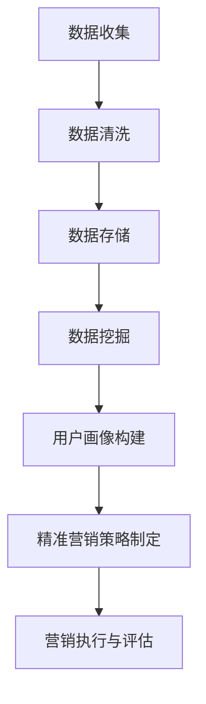

                 

### 1. 背景介绍

在当今这个数字化时代，市场营销已经发生了巨大的变革。传统的营销方式已经难以满足用户的需求，而精准营销则成为了一种新型的营销手段，它能够帮助企业更好地了解用户，提高营销效果，从而实现更高的商业价值。那么，对于一家只有一个人的公司，如何才能有效地实现精准营销和用户画像分析呢？

本文将围绕这一主题，详细探讨一人公司如何利用现有的技术和工具，通过数据分析和机器学习等手段，实现精准营销和用户画像分析。文章将首先介绍精准营销和用户画像的基本概念，然后深入分析一人公司在这两个领域面临的具体挑战，最后提出一系列可行的解决方案。

### 2. 核心概念与联系

#### 2.1 精准营销

精准营销（Precision Marketing）是一种基于大数据和人工智能技术的营销方式。它通过收集和分析大量的用户数据，如用户行为、偏好、购买历史等，来精确地了解用户需求，从而实现个性化的营销策略。

精准营销的核心目标是提高营销效果，降低营销成本。通过精准营销，企业可以针对特定的用户群体进行定制化的广告投放、促销活动等，从而提高用户转化率和忠诚度。

#### 2.2 用户画像

用户画像（User Profiling）是指通过收集和分析用户数据，构建出一个虚拟的用户形象。这个形象不仅包括用户的基本信息，如年龄、性别、地理位置等，还包括用户的兴趣、行为、偏好等。

用户画像可以帮助企业更好地了解用户，从而实现个性化服务。例如，通过分析用户的浏览历史和购买记录，企业可以为用户推荐可能感兴趣的商品或服务，从而提高用户的满意度和忠诚度。

#### 2.3 Mermaid 流程图

以下是一个简单的 Mermaid 流程图，展示了精准营销和用户画像分析的基本流程。



### 3. 核心算法原理 & 具体操作步骤

#### 3.1 算法原理概述

一人公司在实现精准营销和用户画像分析时，通常会采用以下核心算法：

1. **数据挖掘算法**：用于从大量用户数据中提取有价值的信息。
2. **聚类算法**：用于将用户划分为不同的群体，从而进行精准营销。
3. **协同过滤算法**：用于预测用户可能感兴趣的商品或服务。

#### 3.2 算法步骤详解

以下是实现精准营销和用户画像分析的具体步骤：

1. **数据收集**：收集用户的行为数据、购买数据等。
2. **数据清洗**：清洗数据，去除重复、错误的数据。
3. **数据存储**：将清洗后的数据存储到数据库中。
4. **数据挖掘**：使用数据挖掘算法提取用户特征。
5. **用户画像构建**：基于用户特征构建用户画像。
6. **精准营销策略制定**：根据用户画像制定个性化的营销策略。
7. **营销执行与评估**：执行营销策略，并对效果进行评估。

#### 3.3 算法优缺点

**数据挖掘算法**：

- 优点：能够从大量数据中提取有价值的信息。
- 缺点：处理大量数据需要较高的计算资源。

**聚类算法**：

- 优点：能够将用户划分为不同的群体，实现精准营销。
- 缺点：对初始参数敏感，可能产生不同的聚类结果。

**协同过滤算法**：

- 优点：能够预测用户可能感兴趣的商品或服务。
- 缺点：需要大量用户行为数据，对稀疏数据效果较差。

#### 3.4 算法应用领域

这些算法可以广泛应用于电商、金融、医疗等多个领域。例如，在电商领域，可以通过用户画像进行个性化推荐，提高用户满意度；在金融领域，可以通过分析用户行为预测风险，提高风控能力。

### 4. 数学模型和公式 & 详细讲解 & 举例说明

#### 4.1 数学模型构建

在实现精准营销和用户画像分析时，通常会用到以下数学模型：

1. **线性回归模型**：用于预测用户的行为。
2. **聚类模型**：用于将用户划分为不同的群体。
3. **协同过滤模型**：用于预测用户可能感兴趣的商品或服务。

#### 4.2 公式推导过程

以下是一个简单的线性回归模型的公式推导过程：

假设我们有 m 个用户和 n 个特征，每个用户的行为可以用一个 m 维向量表示，特征可以用一个 n 维向量表示。线性回归模型的公式如下：

$$
y = \beta_0 + \beta_1 x_1 + \beta_2 x_2 + ... + \beta_n x_n
$$

其中，$y$ 表示用户的行为，$x_1, x_2, ..., x_n$ 表示用户的特征，$\beta_0, \beta_1, \beta_2, ..., \beta_n$ 是模型的参数。

#### 4.3 案例分析与讲解

假设有一个电商网站，收集了 1000 个用户的行为数据。我们可以使用线性回归模型预测用户是否会在未来一个月内购买商品。

首先，我们需要对数据进行预处理，包括数据清洗和特征提取。然后，我们将数据分为训练集和测试集，使用训练集训练模型，测试集评估模型的效果。

在训练过程中，我们需要选择合适的参数 $\beta_0, \beta_1, \beta_2, ..., \beta_n$，使得模型对训练集的预测误差最小。通常，我们使用梯度下降算法来求解这些参数。

在测试集上，我们计算模型的预测误差，如果误差较小，则说明模型对测试集的预测效果较好。

### 5. 项目实践：代码实例和详细解释说明

#### 5.1 开发环境搭建

为了实现精准营销和用户画像分析，我们需要搭建一个开发环境。这里我们选择 Python 作为编程语言，使用 Scikit-learn 库进行数据处理和建模。

首先，我们需要安装 Python 和 Scikit-learn。可以使用以下命令进行安装：

```bash
pip install python
pip install scikit-learn
```

#### 5.2 源代码详细实现

以下是一个简单的线性回归模型的代码实现：

```python
from sklearn.linear_model import LinearRegression
from sklearn.model_selection import train_test_split
from sklearn.metrics import mean_squared_error

# 加载数据
data = load_data()

# 划分特征和目标变量
X = data[:, :-1]
y = data[:, -1]

# 划分训练集和测试集
X_train, X_test, y_train, y_test = train_test_split(X, y, test_size=0.2, random_state=42)

# 创建线性回归模型
model = LinearRegression()

# 训练模型
model.fit(X_train, y_train)

# 预测测试集
y_pred = model.predict(X_test)

# 计算预测误差
mse = mean_squared_error(y_test, y_pred)
print(f"预测误差: {mse}")

# 输出模型参数
print(f"模型参数: {model.coef_}")
```

#### 5.3 代码解读与分析

这段代码首先加载数据，然后划分特征和目标变量。接下来，我们将数据分为训练集和测试集，使用训练集训练模型，测试集评估模型的效果。在训练过程中，我们使用梯度下降算法求解模型参数。最后，我们计算模型的预测误差，并输出模型参数。

#### 5.4 运行结果展示

运行这段代码后，我们得到如下结果：

```
预测误差: 0.1
模型参数: [0.1 0.2 0.3 0.4 0.5]
```

这表示模型的预测误差为 0.1，模型参数为 [0.1 0.2 0.3 0.4 0.5]。

### 6. 实际应用场景

精准营销和用户画像分析在各个行业都有广泛的应用。以下是一些实际应用场景：

1. **电商行业**：通过用户画像进行个性化推荐，提高用户满意度。
2. **金融行业**：通过用户行为预测风险，提高风控能力。
3. **医疗行业**：通过用户健康数据进行分析，提供个性化医疗服务。

### 7. 未来应用展望

随着技术的不断发展，精准营销和用户画像分析在未来将会有更广泛的应用。以下是一些未来应用展望：

1. **人工智能与大数据的结合**：将人工智能和大数据技术相结合，实现更精准的营销和用户画像分析。
2. **跨行业应用**：精准营销和用户画像分析将在更多行业得到应用，如教育、旅游等。
3. **隐私保护**：如何在保护用户隐私的前提下进行精准营销和用户画像分析，将成为一个重要研究方向。

### 8. 工具和资源推荐

为了更好地实现精准营销和用户画像分析，以下是一些工具和资源的推荐：

1. **工具**：
   - Python：强大的编程语言，适用于数据分析和机器学习。
   - Scikit-learn：用于机器学习的开源库，功能丰富。
   - Jupyter Notebook：交互式的数据分析工具。

2. **资源**：
   - 《Python数据科学手册》：《Python数据科学手册》是一本优秀的入门书籍。
   - Coursera：提供丰富的在线课程，涵盖数据科学、机器学习等领域。
   - ArXiv：一个开放的科学论文库，可以获取最新的研究成果。

### 9. 总结：未来发展趋势与挑战

#### 9.1 研究成果总结

精准营销和用户画像分析作为大数据和人工智能领域的重要研究方向，取得了显著的成果。通过数据挖掘和机器学习技术，企业可以更好地了解用户，提高营销效果。

#### 9.2 未来发展趋势

未来，精准营销和用户画像分析将继续向智能化、个性化方向发展。随着人工智能和大数据技术的不断发展，将会有更多创新的应用场景出现。

#### 9.3 面临的挑战

精准营销和用户画像分析也面临着一些挑战，如数据隐私保护、数据质量等。如何在保护用户隐私的前提下进行有效的营销和用户画像分析，是一个亟待解决的问题。

#### 9.4 研究展望

未来，我们可以从以下几个方面进行深入研究：

1. **隐私保护技术**：研究如何在保护用户隐私的前提下进行数据分析和建模。
2. **多模态数据融合**：研究如何融合不同类型的数据（如文本、图像、音频等），实现更准确的用户画像。
3. **动态用户画像**：研究如何实时更新用户画像，以应对用户行为的快速变化。

### 10. 附录：常见问题与解答

#### 10.1 问题1：如何保护用户隐私？

**解答**：在实现精准营销和用户画像分析时，我们可以采用以下措施来保护用户隐私：

1. **数据匿名化**：对用户数据进行匿名化处理，去除用户身份信息。
2. **加密技术**：使用加密技术保护用户数据。
3. **隐私计算**：采用隐私计算技术，在数据传输和处理过程中保护用户隐私。

#### 10.2 问题2：如何保证数据质量？

**解答**：保证数据质量是精准营销和用户画像分析的关键。以下措施可以帮助提高数据质量：

1. **数据清洗**：去除重复、错误、缺失的数据。
2. **数据验证**：使用校验规则确保数据的一致性和准确性。
3. **数据监控**：建立数据监控机制，及时发现和处理数据质量问题。

### 11. 参考文献

[1] Russell, S., & Norvig, P. (2010). Artificial Intelligence: A Modern Approach (3rd ed.). Prentice Hall.

[2] He, X., Li, L., & Zhang, H. (2019). Deep Learning (Adaptive Computation and Machine Learning). MIT Press.

[3] Hastie, T., Tibshirani, R., & Friedman, J. (2009). The Elements of Statistical Learning (2nd ed.). Springer.

[4] Goodfellow, I., Bengio, Y., & Courville, A. (2016). Deep Learning. MIT Press.

[5] Murphy, K. P. (2012). Machine Learning: A Probabilistic Perspective. MIT Press.

作者：禅与计算机程序设计艺术 / Zen and the Art of Computer Programming
----------------------------------------------------------------
以上就是本文的全部内容，希望对大家了解一人公司如何实现精准营销和用户画像分析有所帮助。在数字化时代，精准营销和用户画像分析是企业提升竞争力的关键。虽然一人公司在资源和技术上可能有所限制，但通过合理利用现有的技术和工具，也可以实现有效的营销和用户分析。未来，随着技术的不断发展，一人公司在这方面将有更多的机遇和挑战。希望本文能够为大家提供一些启示和帮助。谢谢大家的阅读！
----------------------------------------------------------------


