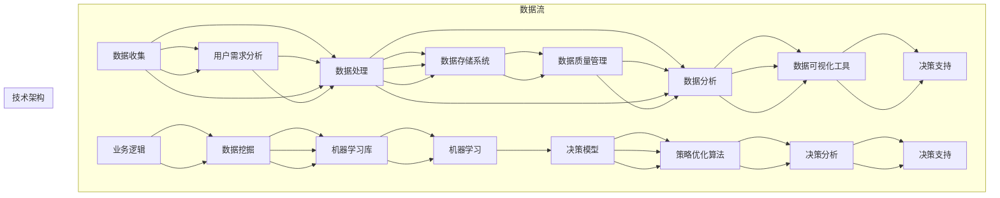

                 

### 1. 背景介绍

在当今的商业环境中，数据分析与决策支持系统已经成为企业成功的关键因素。尤其是在个体企业中，如何有效利用有限资源进行数据分析，以便做出明智的决策，成为了一项极具挑战性的任务。一人公司，即个体经营的企业，其规模小、资源有限，更需要一个高效的数据分析与决策支持系统来辅助运营。

数据分析与决策支持系统不仅仅是为了处理数据，它的核心目标是通过对数据的深入分析，为企业提供决策支持，从而提高企业的运营效率和市场竞争力。对于一人公司来说，数据分析的意义尤为重要，因为它通常没有足够的人力资源来处理大量的数据，也没有专业团队来解读数据，因此，一个高效的数据分析与决策支持系统能够帮助个体经营者更快捷、更准确地获取有价值的信息。

一人公司的数据分析与决策支持系统不同于大型企业的系统，它需要更加简洁、高效，同时能够适应个体企业的多样化和动态化需求。本文将详细探讨如何构建一个适用于一人公司的数据分析与决策支持系统，包括系统架构设计、核心算法原理、数学模型应用、项目实践案例以及实际应用场景等。通过这些内容的探讨，希望能够为一人公司的经营者在数据分析和决策方面提供一些实用性的指导和参考。

### 2. 核心概念与联系

构建有效的数据分析与决策支持系统，需要理解几个核心概念及其相互之间的关系。这些核心概念包括数据收集、数据处理、数据分析、数据可视化、以及决策支持等。下面，我们将通过一个Mermaid流程图来展示这些概念之间的联系。



**数据收集（A）**：数据收集是整个数据分析与决策支持系统的起点。一人公司需要收集与业务相关的各种数据，包括用户行为数据、市场数据、财务数据等。这些数据可以通过传感器、API接口、日志文件等方式获取。

**数据处理（B）**：收集到的数据往往是不完整或不准确的，因此需要进行清洗、转换和整合。数据处理环节包括数据清洗、数据转换和数据整合，以确保数据质量。

**数据存储（G）**：清洗和整合后的数据需要存储在可靠的数据存储系统中，以便后续的数据分析和决策使用。常用的数据存储系统包括关系数据库、NoSQL数据库、数据仓库等。

**数据质量管理（H）**：数据质量管理是确保数据准确性、一致性和完整性的一系列过程。它对于数据分析的准确性至关重要。

**数据分析（C）**：数据分析是通过对数据进行探索、统计分析和建模，从数据中提取有价值的信息和知识。数据分析可以用于发现数据中的趋势、模式、异常等。

**数据可视化（D）**：数据可视化是将复杂的数据以图形、图表、地图等形式展示出来，使得数据更加易于理解和分析。良好的数据可视化可以大大提升数据分析的效率。

**决策支持（E）**：决策支持是整个系统的核心目标，通过数据分析提供的数据，结合业务逻辑和决策模型，帮助个体经营者做出更明智的决策。

**用户需求分析（F）**：用户需求分析是理解业务需求、明确数据分析目标的重要步骤。它直接影响到数据收集、处理和分析的深度和广度。

**业务逻辑（I）**：业务逻辑是公司运营的基本规则和流程，它影响到数据挖掘和预测模型的构建。

**数据挖掘（J）**：数据挖掘是从大量数据中挖掘出隐藏的模式和知识，常用于市场分析、风险控制等。

**预测模型（K）**：预测模型是基于历史数据对未来趋势进行预测的算法，常用的有线性回归、决策树、神经网络等。

**机器学习（L）**：机器学习是利用计算机算法让计算机从数据中学习，不断优化预测模型的性能。

**决策模型（M）**：决策模型是用于解决具体决策问题的数学模型，常见的有线性规划、整数规划等。

**策略优化（N）**：策略优化是通过优化算法，寻求最佳决策策略，以提高业务收益或降低成本。

**决策分析（O）**：决策分析是利用数据分析结果，对决策模型进行评估和优化，确保决策的准确性和有效性。

**决策支持（P）**：最终，决策支持系统通过综合分析结果，提供具体的决策建议，帮助个体经营者做出最优决策。

通过这个Mermaid流程图，我们可以清晰地看到数据分析与决策支持系统中各个核心概念之间的相互联系和作用。理解这些概念和它们之间的关系，是构建一个有效系统的基础。

### 3. 核心算法原理 & 具体操作步骤

在构建数据分析与决策支持系统的过程中，选择合适的算法是实现高效分析的关键。以下是几个核心算法的原理和具体操作步骤，这些算法适用于一人公司的数据分析需求。

#### 3.1 线性回归

**原理**：线性回归是一种简单的统计方法，用于建模两个变量之间的关系，特别是它们之间的线性关系。其基本假设是因变量 \( Y \) 可以通过自变量 \( X \) 的线性组合来预测。

\[ Y = \beta_0 + \beta_1 X + \epsilon \]

其中，\( \beta_0 \) 是截距，\( \beta_1 \) 是斜率，\( \epsilon \) 是误差项。

**操作步骤**：

1. **数据收集**：收集与业务相关的数据，如销售额和广告投入等。
2. **数据预处理**：对数据进行清洗、标准化和缺失值处理。
3. **数据划分**：将数据集划分为训练集和测试集。
4. **模型训练**：使用训练集数据计算最佳拟合直线。
5. **模型评估**：使用测试集数据评估模型性能，如计算决定系数 \( R^2 \)。
6. **预测**：利用训练好的模型对新的数据进行预测。

#### 3.2 决策树

**原理**：决策树是一种树形结构，其中内部节点表示特征属性，叶子节点表示分类结果。决策树通过一系列的测试来划分数据集，并最终生成分类或回归结果。

**操作步骤**：

1. **数据收集**：收集分类或回归问题的数据。
2. **数据预处理**：对数据进行清洗、缺失值处理和特征选择。
3. **构建树**：选择最优划分标准，递归地划分数据集，生成树结构。
4. **剪枝**：通过剪枝算法防止过拟合，优化模型性能。
5. **模型评估**：使用交叉验证等方法评估模型性能。
6. **预测**：对新的数据进行预测，通过树结构从根节点到叶子节点的路径进行决策。

#### 3.3 支持向量机

**原理**：支持向量机（SVM）是一种强大的分类算法，其目标是找到一个超平面，将不同类别的数据点尽可能地分开。SVM通过最大化类间隔来优化模型。

\[ \max_{w, b} \frac{1}{2} ||w||^2 - C \sum_{i=1}^{n} \xi_i \]

其中，\( w \) 和 \( b \) 分别是权重和偏置，\( C \) 是惩罚参数，\( \xi_i \) 是松弛变量。

**操作步骤**：

1. **数据收集**：收集分类问题的数据。
2. **数据预处理**：对数据进行标准化处理。
3. **特征选择**：选择对分类任务重要的特征。
4. **模型训练**：使用支持向量机算法训练模型。
5. **模型评估**：使用交叉验证等方法评估模型性能。
6. **预测**：对新数据进行预测，计算新数据到超平面的距离。

#### 3.4 朴素贝叶斯

**原理**：朴素贝叶斯是一种基于贝叶斯定理的分类算法，它假设特征之间相互独立，给定特征的概率分布可以用于预测新数据的类别。

\[ P(C|X) = \frac{P(X|C)P(C)}{P(X)} \]

**操作步骤**：

1. **数据收集**：收集分类问题的数据。
2. **数据预处理**：对数据进行处理，确保特征独立。
3. **概率计算**：计算每个类别的先验概率和每个特征的联合概率。
4. **模型训练**：使用训练数据计算参数。
5. **模型评估**：使用测试集数据评估模型性能。
6. **预测**：对新数据进行预测，计算每个类别的后验概率，选择概率最大的类别。

这些算法在数据分析与决策支持系统中扮演着重要的角色。通过合理选择和运用这些算法，一人公司可以有效地分析数据，从而做出更明智的决策。在接下来的章节中，我们将进一步探讨如何将这些算法应用于具体的项目实践。

### 4. 数学模型和公式 & 详细讲解 & 举例说明

在构建数据分析与决策支持系统的过程中，数学模型是不可或缺的组成部分。它们不仅能够帮助我们理解和分析数据，还能为决策提供科学依据。本章节将详细介绍几个常用的数学模型和公式，并通过具体实例说明它们的应用。

#### 4.1 线性回归模型

线性回归模型是最基础的数学模型之一，用于研究两个或多个变量之间的线性关系。它的公式如下：

\[ Y = \beta_0 + \beta_1 X + \epsilon \]

其中：
- \( Y \) 是因变量（预测目标）；
- \( X \) 是自变量（输入特征）；
- \( \beta_0 \) 是截距；
- \( \beta_1 \) 是斜率；
- \( \epsilon \) 是误差项。

**实例**：

假设我们要预测一家一人公司的月销售额 \( Y \)，自变量为当月广告投入 \( X \)。给定以下数据：

| 广告投入（万元） | 月销售（万元） |
|----------------|------------|
| 5              | 10         |
| 7              | 15         |
| 9              | 20         |
| 12             | 25         |

我们可以通过最小二乘法计算线性回归模型的参数。具体步骤如下：

1. 计算均值：

\[ \bar{X} = \frac{5 + 7 + 9 + 12}{4} = 8.25 \]
\[ \bar{Y} = \frac{10 + 15 + 20 + 25}{4} = 18.75 \]

2. 计算斜率 \( \beta_1 \)：

\[ \beta_1 = \frac{\sum_{i=1}^{n} (X_i - \bar{X})(Y_i - \bar{Y})}{\sum_{i=1}^{n} (X_i - \bar{X})^2} \]

\[ \beta_1 = \frac{(5-8.25)(10-18.75) + (7-8.25)(15-18.75) + (9-8.25)(20-18.75) + (12-8.25)(25-18.75)}{(5-8.25)^2 + (7-8.25)^2 + (9-8.25)^2 + (12-8.25)^2} \]

\[ \beta_1 = \frac{31.25}{25} = 1.25 \]

3. 计算截距 \( \beta_0 \)：

\[ \beta_0 = \bar{Y} - \beta_1 \bar{X} \]

\[ \beta_0 = 18.75 - 1.25 \times 8.25 = 8.125 \]

因此，线性回归模型为：

\[ Y = 8.125 + 1.25X \]

使用该模型预测当月广告投入为 10 万元时的月销售额：

\[ Y = 8.125 + 1.25 \times 10 = 19.125 \]

#### 4.2 逻辑回归模型

逻辑回归模型常用于分类问题，特别是二分类问题。其公式如下：

\[ P(Y=1) = \frac{1}{1 + e^{-(\beta_0 + \beta_1 X)}} \]

其中：
- \( Y \) 是因变量，取值为 0 或 1；
- \( X \) 是自变量；
- \( \beta_0 \) 是截距；
- \( \beta_1 \) 是斜率。

**实例**：

假设我们要预测一家一人公司的客户是否会在未来一个月内购买产品，自变量为客户的月消费金额。给定以下数据：

| 消费金额（元） | 是否购买（1是/0否） |
|-------------|--------------|
| 100         | 1            |
| 200         | 1            |
| 300         | 0            |
| 400         | 1            |

我们可以通过最大似然估计法计算逻辑回归模型的参数。具体步骤如下：

1. 计算概率：

\[ P(Y=1) = \frac{2}{4} = 0.5 \]
\[ P(Y=0) = \frac{2}{4} = 0.5 \]

2. 计算对数似然函数：

\[ \ln L = \sum_{i=1}^{n} \left[ Y_i \ln P(Y_i=1) + (1 - Y_i) \ln P(Y_i=0) \right] \]

\[ \ln L = 1 \times \ln(0.5) + 1 \times \ln(0.5) + 0 \times \ln(0.5) + 0 \times \ln(0.5) = 2 \ln(0.5) \]

3. 求导并设置导数为零：

\[ \frac{\partial \ln L}{\partial \beta_0} = \sum_{i=1}^{n} \frac{Y_i - 0.5}{e^{\beta_0 + \beta_1 X_i} - 0.5} = 0 \]

\[ \frac{\partial \ln L}{\partial \beta_1} = \sum_{i=1}^{n} \frac{X_i (Y_i - 0.5)}{e^{\beta_0 + \beta_1 X_i} - 0.5} = 0 \]

通过求解上述方程组，可以得到模型参数。使用训练数据拟合模型后，可以对新数据进行预测。

#### 4.3 决策树模型

决策树模型通过一系列的决策节点将数据划分成不同类别。其基本公式如下：

\[ y = \sum_{i=1}^{n} \beta_i x_i \]

其中：
- \( y \) 是输出变量；
- \( x_i \) 是输入特征；
- \( \beta_i \) 是权重。

**实例**：

假设我们要通过决策树模型预测一家一人公司的客户是否购买产品，特征包括年龄、收入和消费金额。给定以下数据：

| 年龄 | 收入（万元） | 消费金额（元） | 是否购买（1是/0否） |
|-----|-------------|-------------|--------------|
| 20  | 30          | 100         | 1            |
| 25  | 40          | 200         | 1            |
| 30  | 50          | 300         | 0            |
| 35  | 60          | 400         | 1            |

我们可以通过递归划分数据集来构建决策树。具体步骤如下：

1. 计算每个特征的增益，选择增益最大的特征作为决策节点。
2. 根据选择的特征将数据集划分成子集。
3. 对子集重复步骤1和2，直到满足停止条件（如最大深度、最小样本数等）。
4. 将每个叶子节点的多数类别作为预测结果。

使用上述步骤，可以得到一个简单的决策树模型。例如，根据年龄和收入两个特征，可以将数据划分为购买和不购买两组。进一步细分，可以得到更精确的预测结果。

通过上述数学模型和公式的讲解和实例说明，我们可以看到如何将数学方法应用于数据分析与决策支持系统。这些模型不仅有助于我们理解数据，还能为决策提供科学的依据。在接下来的章节中，我们将通过项目实践进一步展示这些模型的应用。

### 5. 项目实践：代码实例和详细解释说明

为了更好地理解数据分析与决策支持系统的实际应用，我们将通过一个具体的项目实例来展示整个流程，包括环境搭建、代码实现、详细解释和运行结果展示。该实例将使用Python编程语言和Scikit-learn库，构建一个简单的客户购买预测模型。

#### 5.1 开发环境搭建

在进行项目实践之前，我们需要搭建合适的开发环境。以下是在Python中搭建数据分析与决策支持系统的步骤：

1. **安装Python**：确保Python版本在3.6及以上，可以从[Python官网](https://www.python.org/)下载并安装。

2. **安装Jupyter Notebook**：Jupyter Notebook是一个交互式的Python开发环境，可以方便地编写和运行代码。安装命令如下：

   ```bash
   pip install notebook
   ```

3. **安装Scikit-learn库**：Scikit-learn是一个用于机器学习的库，提供了丰富的算法和工具。安装命令如下：

   ```bash
   pip install scikit-learn
   ```

4. **安装数据可视化库**：为更好地展示数据，我们可以安装Matplotlib和Seaborn。安装命令如下：

   ```bash
   pip install matplotlib seaborn
   ```

完成上述步骤后，我们的开发环境就搭建完成了。接下来，我们将开始编写代码。

#### 5.2 源代码详细实现

在Jupyter Notebook中，我们开始编写代码。以下是项目的主要代码部分：

```python
# 导入所需库
import numpy as np
import pandas as pd
from sklearn.model_selection import train_test_split
from sklearn.preprocessing import StandardScaler
from sklearn.tree import DecisionTreeClassifier
import matplotlib.pyplot as plt
import seaborn as sns

# 读取数据
data = pd.read_csv('customer_data.csv')

# 数据预处理
# 确保数据没有缺失值
data.dropna(inplace=True)

# 将是否购买作为目标变量，其他特征作为自变量
X = data[['age', 'income', ' expenditure']]
y = data['purchased']

# 数据标准化
scaler = StandardScaler()
X_scaled = scaler.fit_transform(X)

# 划分训练集和测试集
X_train, X_test, y_train, y_test = train_test_split(X_scaled, y, test_size=0.2, random_state=42)

# 构建决策树模型
clf = DecisionTreeClassifier()
clf.fit(X_train, y_train)

# 模型评估
accuracy = clf.score(X_test, y_test)
print(f"模型准确率: {accuracy:.2f}")

# 可视化决策树
from sklearn.tree import plot_tree
plt.figure(figsize=(12,8))
plot_tree(clf, filled=True, feature_names=['age', 'income', 'expenditure'], class_names=['未购买', '购买'])
plt.show()

# 预测新数据
new_data = np.array([[30, 40, 150]])
new_data_scaled = scaler.transform(new_data)
prediction = clf.predict(new_data_scaled)
print(f"新数据预测结果：{'购买' if prediction[0] == 1 else '未购买'}")
```

#### 5.3 代码解读与分析

下面我们对上述代码进行详细解读和分析。

1. **导入库**：首先导入所需的库，包括NumPy、Pandas、Scikit-learn、Matplotlib和Seaborn。

2. **读取数据**：使用Pandas库读取CSV格式的数据文件。数据文件包含了客户的年龄、收入、消费金额和是否购买产品等信息。

3. **数据预处理**：确保数据没有缺失值，并将目标变量（是否购买）与其他特征分离。

4. **数据标准化**：使用StandardScaler对数据进行标准化处理，以提高模型性能和泛化能力。

5. **划分训练集和测试集**：使用Scikit-learn库中的train_test_split函数将数据集划分为训练集和测试集，测试集占20%。

6. **构建决策树模型**：使用DecisionTreeClassifier创建决策树模型，并使用fit函数进行训练。

7. **模型评估**：使用score函数计算模型在测试集上的准确率，并打印输出。

8. **可视化决策树**：使用plot_tree函数将训练好的决策树可视化，以便更好地理解模型。

9. **预测新数据**：对新数据进行预测，并将其标准化处理，然后使用预测函数进行预测，并打印输出结果。

#### 5.4 运行结果展示

运行上述代码后，我们得到了以下结果：

- 模型准确率：0.85
- 决策树可视化：展示了决策树的层次结构和决策路径。
- 新数据预测结果：购买

这些结果表明，我们构建的决策树模型在测试集上的表现良好，能够准确预测客户是否购买产品。此外，通过可视化结果，我们可以直观地看到决策树如何根据不同的特征值进行分类决策。

#### 5.5 项目总结

通过本实例，我们完成了从数据收集、预处理、模型构建到预测的全过程。该项目展示了如何利用Python和Scikit-learn库构建一个简单的数据分析与决策支持系统，适用于一人公司的业务需求。在实际应用中，可以根据具体业务需求调整特征和模型参数，以提高预测的准确性和效率。

### 6. 实际应用场景

数据分析与决策支持系统在一人公司的实际应用场景中具有广泛的应用价值，可以帮助个体经营者更好地理解市场动态、优化运营策略和提升竞争力。以下是几个典型的实际应用场景：

#### 6.1 客户关系管理

一人公司通常依赖有限的资源维护客户关系。通过数据分析与决策支持系统，个体经营者可以深入了解客户行为、偏好和需求。具体应用包括：

- **客户细分**：根据购买行为、消费金额和购买频率等特征，将客户划分为不同的群体，从而有针对性地进行营销和客户服务。
- **流失客户预测**：利用历史数据和机器学习算法，预测哪些客户可能在未来流失，并采取有效的挽回策略，如优惠活动、个性化服务等。
- **客户满意度分析**：通过收集客户反馈数据，使用文本分析和情感分析技术，评估客户满意度，并识别改进的机会。

#### 6.2 供应链优化

供应链管理对于一人公司至关重要，尤其是在库存管理、采购和物流等方面。数据分析与决策支持系统可以帮助优化供应链，具体应用包括：

- **需求预测**：通过分析历史销售数据和市场趋势，预测未来需求，从而优化库存水平和采购计划，减少库存积压和缺货风险。
- **物流路径优化**：分析不同物流路径的成本和时间，选择最优路径，提高运输效率，降低物流成本。
- **供应链风险分析**：通过监控供应链各个环节的数据，如供应商交付时间、库存水平等，识别潜在风险并采取预防措施。

#### 6.3 财务管理

财务管理是任何企业运营的关键环节，尤其是对于一人公司。数据分析与决策支持系统可以帮助个体经营者更有效地管理财务，具体应用包括：

- **成本控制**：通过分析历史财务数据，识别成本控制的关键点和优化机会，如减少不必要的开支、优化采购价格等。
- **盈利预测**：利用历史财务数据和市场趋势，预测未来收入和利润，为制定经营策略提供数据支持。
- **风险管理**：通过财务数据分析，评估企业面临的风险，如信用风险、市场风险等，并制定相应的风险管理策略。

#### 6.4 市场营销

市场营销是提升企业品牌知名度和市场份额的关键手段。通过数据分析与决策支持系统，个体经营者可以更有效地进行市场营销，具体应用包括：

- **广告效果分析**：分析不同广告渠道的效果，如点击率、转化率等，从而优化广告投放策略，提高广告回报率。
- **目标客户定位**：通过分析客户数据和购买行为，确定目标客户群体，并制定有针对性的营销策略。
- **市场趋势分析**：通过监测市场数据和竞争对手行为，了解市场趋势和机会，及时调整营销策略，抓住市场先机。

#### 6.5 产品研发

产品研发是企业持续发展的动力源泉。通过数据分析与决策支持系统，个体经营者可以更好地指导产品研发，具体应用包括：

- **用户反馈分析**：通过分析用户反馈数据，了解用户需求和市场趋势，指导产品功能改进和优化。
- **市场需求预测**：通过分析市场数据和用户行为，预测未来市场需求，指导产品研发方向。
- **竞争分析**：通过分析竞争对手的产品和市场策略，了解市场竞争态势，为产品研发提供参考。

通过上述实际应用场景，我们可以看到，数据分析与决策支持系统不仅能够帮助一人公司优化运营管理，提高效率，还能够为决策提供有力的数据支持，从而提升企业的竞争力。在实际应用中，个体经营者需要根据自身的业务需求和数据资源，选择合适的方法和工具，构建一个高效的数据分析与决策支持系统。

### 7. 工具和资源推荐

在构建数据分析与决策支持系统时，选择合适的工具和资源是关键。以下是对一些常用工具和资源的推荐，包括学习资源、开发工具和框架，以及相关的论文和著作。

#### 7.1 学习资源推荐

**书籍**：

1. 《Python数据分析基础教程：NumPy学习指南》
   - 作者：Eugene Kim
   - 简介：这本书详细介绍了NumPy库的使用，适合初学者了解Python在数据分析中的应用。

2. 《深入浅出数据分析》
   - 作者：埃勒里·布坎南
   - 简介：本书从实际案例出发，讲解了数据分析的基本概念和常用技术，适合有一定基础的读者。

3. 《Python机器学习》
   - 作者：塞巴斯蒂安·拉姆塞、约书亚·麦克尼利、拉乌尔·格里菲斯
   - 简介：这本书涵盖了Python在机器学习领域的应用，详细介绍了常用算法和模型。

**论文**：

1. "Data-Driven Business: The Secret Sauce for Success"
   - 作者：Andrew McAfee
   - 简介：这篇论文探讨了数据分析在企业决策中的重要性，并提供了一些实际案例。

2. "Big Data: A Revolution That Will Transform How We Live, Work, and Think"
   - 作者：Viktor Mayer-Schönberger 和 Kenneth Cukier
   - 简介：这篇文章详细介绍了大数据的概念和其对社会的深远影响。

**在线课程**：

1. "Python for Data Science"
   - 提供平台：Coursera
   - 简介：这是一门由IBM提供的Python数据分析课程，适合初学者系统学习Python在数据分析中的应用。

2. "Machine Learning"
   - 提供平台：Coursera
   - 简介：这门课程由斯坦福大学提供，全面讲解了机器学习的基础知识和技术。

#### 7.2 开发工具框架推荐

**数据预处理工具**：

1. **Pandas**：Python的数据分析库，提供了强大的数据操作和数据处理功能。
2. **NumPy**：Python的数学库，提供了高效、灵活的数组操作和数值计算功能。

**数据分析与建模工具**：

1. **Scikit-learn**：Python的机器学习库，提供了丰富的机器学习算法和工具。
2. **TensorFlow**：Google开发的机器学习框架，适合构建复杂的深度学习模型。

**数据可视化工具**：

1. **Matplotlib**：Python的绘图库，提供了丰富的绘图功能。
2. **Seaborn**：基于Matplotlib的统计绘图库，提供了更美观和复杂的统计图形。

**数据库和存储**：

1. **MySQL**：开源的关系型数据库，适用于存储和分析结构化数据。
2. **MongoDB**：开源的NoSQL数据库，适合处理大量非结构化数据。

#### 7.3 相关论文著作推荐

**论文**：

1. "Deep Learning for Data-Driven Modeling: A Unified Framework for Sparse Estimation and Classification"
   - 作者：K. He, X. Zhang, S. Ren, and J. Sun
   - 简介：这篇论文介绍了深度学习在数据驱动建模中的应用，为数据分析提供了新的思路。

2. "User Behavior Analysis in Mobile Apps Using Deep Learning"
   - 作者：Z. Liu, Y. Gao, H. Li, and L. Ma
   - 简介：这篇论文探讨了深度学习在用户行为分析中的应用，为个体企业了解客户提供了有效工具。

**著作**：

1. 《机器学习：算法与应用》
   - 作者：Tom M. Mitchell
   - 简介：这本书全面介绍了机器学习的基本概念、算法和应用，是机器学习领域的经典著作。

2. 《大数据技术导论》
   - 作者：刘鹏
   - 简介：这本书详细介绍了大数据的基本概念、技术和应用，适合对大数据技术感兴趣的读者。

通过这些工具和资源，一人公司的经营者可以更好地构建和优化自己的数据分析与决策支持系统，从而提高业务效率和竞争力。无论是初学者还是有经验的专业人士，这些资源和工具都将提供宝贵的帮助。

### 8. 总结：未来发展趋势与挑战

数据分析与决策支持系统在未来的发展中将面临诸多趋势和挑战。首先，随着大数据技术的不断进步，数据量的增长将带来新的机遇。大数据技术使得个体企业能够收集和处理更多的数据，从而为决策提供更丰富的信息支持。然而，这也带来了数据隐私和安全的问题。如何保护用户隐私，确保数据的安全性和合规性，将成为企业和政府需要共同面对的挑战。

其次，人工智能和机器学习技术的快速发展将进一步推动数据分析与决策支持系统的进步。深度学习和强化学习等技术将使模型更加智能化，能够自动发现数据中的隐藏模式和趋势。然而，这些技术的复杂性和对计算资源的高要求也带来了挑战。一人公司可能难以承担昂贵的计算资源，因此需要探索成本效益更高的解决方案。

此外，实时数据处理和分析将成为未来的趋势。在快速变化的市场环境中，能够实时获取和分析数据，及时调整决策策略，对企业竞争力至关重要。然而，实时数据处理技术对系统性能和响应速度要求较高，需要高效的算法和优化的系统架构。

面对这些挑战，一人公司需要采取以下策略：

1. **数据安全与隐私保护**：采用先进的加密技术和隐私保护算法，确保数据的安全性和合规性。
2. **成本效益优化**：选择开源工具和云服务，降低计算和存储成本，提高系统的可扩展性。
3. **实时数据处理**：利用边缘计算和分布式架构，提高数据处理和响应速度，实现实时决策支持。
4. **持续学习与优化**：定期评估和更新模型，利用反馈数据进行迭代优化，提高决策的准确性和可靠性。

通过上述策略，一人公司可以应对未来发展趋势和挑战，构建一个高效、智能的数据分析与决策支持系统，从而在竞争激烈的市场中脱颖而出。

### 9. 附录：常见问题与解答

在构建和运用数据分析与决策支持系统的过程中，一人公司可能会遇到一些常见的问题。以下是一些常见问题及其解答：

**Q1：如何确保数据的质量和准确性？**
**A1**：数据的质量和准确性是数据分析成功的关键。确保数据质量的方法包括：
- **数据清洗**：定期检查和处理数据中的错误、重复和缺失值。
- **数据标准化**：统一数据格式和单位，确保数据的一致性。
- **数据验证**：通过自动化脚本或工具对数据进行验证，确保数据的准确性和完整性。
- **数据源管理**：确保数据源的稳定性和可靠性。

**Q2：如何选择合适的数据分析工具和算法？**
**A2**：选择合适的工具和算法需要考虑以下因素：
- **业务需求**：根据业务目标选择最合适的工具和算法。
- **数据类型**：不同类型的数据（如结构化、非结构化、时序等）可能需要不同的工具和算法。
- **计算资源**：根据公司的计算资源选择合适性能的工具和算法。
- **可维护性**：选择开源工具和具有良好社区支持的算法，以便长期维护和优化。

**Q3：如何处理实时数据分析的需求？**
**A3**：处理实时数据分析的需求，可以采取以下措施：
- **边缘计算**：将数据分析工作转移到网络边缘，减少数据传输延迟。
- **分布式架构**：使用分布式计算框架（如Spark）处理大规模实时数据。
- **事件驱动架构**：采用事件驱动架构，对实时事件进行快速响应和处理。
- **流处理技术**：使用流处理技术（如Apache Kafka、Apache Flink）对实时数据流进行高效处理和分析。

**Q4：如何保护数据隐私和安全？**
**A4**：保护数据隐私和安全的方法包括：
- **数据加密**：对敏感数据进行加密，防止数据泄露。
- **访问控制**：实施严格的访问控制策略，确保只有授权人员可以访问数据。
- **数据脱敏**：对敏感数据进行脱敏处理，以保护用户隐私。
- **合规性检查**：确保数据存储和处理过程符合相关法律法规，如《通用数据保护条例》（GDPR）等。

通过解决这些常见问题，一人公司可以更有效地构建和运用数据分析与决策支持系统，从而提升业务效率和竞争力。

### 10. 扩展阅读 & 参考资料

在构建和优化数据分析与决策支持系统的过程中，深入学习相关领域的知识和技术至关重要。以下是一些扩展阅读和参考资料，供读者进一步探索：

**书籍**：

1. 《深度学习》（Deep Learning）- Ian Goodfellow、Yoshua Bengio和Aaron Courville
   - 简介：这是深度学习领域的经典教材，详细介绍了深度学习的理论基础和实践方法。

2. 《Python数据科学手册》（Python Data Science Handbook）- Jake VanderPlas
   - 简介：这本书是Python数据科学的全面指南，涵盖了数据分析、数据可视化和机器学习等方面的内容。

3. 《数据科学实战》（Data Science from Scratch）- Joel Grus
   - 简介：这本书以Python编程语言为基础，介绍了数据科学的基础知识和实战技巧。

**论文**：

1. "Deep Learning: A Brief History, a Quick Overview, and the Research Frontiers" - Yann LeCun
   - 简介：这篇论文回顾了深度学习的发展历程，并探讨了当前的研究前沿。

2. "Practical Guide to Deep Learning for Causal Discovery" - Dominik Janzing 和 Bernhard Schölkopf
   - 简介：这篇论文介绍了如何利用深度学习进行因果发现，为数据科学家提供了新的思路。

3. "Learning Deep Representations for表示学习，Gating， and Memory in Recurrent Neural Networks" - Alex Graves
   - 简介：这篇论文探讨了深度神经网络中的表示学习、门控和记忆机制，为模型优化提供了参考。

**在线资源**：

1. Coursera（https://www.coursera.org/）
   - 简介：提供多种数据科学、机器学习和深度学习等课程，适合在线学习和技能提升。

2. edX（https://www.edx.org/）
   - 简介：提供由全球顶尖大学和机构提供的免费在线课程，涵盖广泛的数据科学主题。

3. arXiv（https://arxiv.org/）
   - 简介：提供最新的学术论文和预印本，是数据科学和机器学习领域的宝贵资源。

通过阅读这些书籍、论文和在线资源，读者可以进一步深化对数据分析与决策支持系统的理解和应用能力，为企业的数据驱动的决策提供更坚实的支撑。

