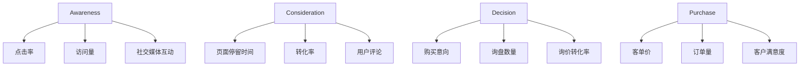

                 

### 1. 背景介绍

在当今激烈竞争的商业环境中，即使是只有一位员工的小型企业，也需要具备高效的销售漏斗来确保其业务的持续增长。销售漏斗（Sales Funnel）是一种销售模型，用于描述潜在客户从认识品牌到最终购买产品的过程。它通常被划分为多个阶段，包括 Awareness（意识）、Consideration（考虑）、Decision（决策）和 Purchase（购买）等。每个阶段都有特定的目标和关键指标，通过这些指标的分析，企业可以优化销售流程，提高转化率和销售额。

尽管大中型企业拥有丰富的资源和专业的销售团队，能够利用复杂的数据分析工具和高级的销售策略，小规模企业由于资源有限，往往面临更大的挑战。如何利用有限的资源构建一个既高效又灵活的销售漏斗，成为了许多初创公司和独立企业亟需解决的关键问题。

一人公司，即独立经营者或小型创业团队，面临着独特的情况。他们不仅要负责产品的开发和市场推广，还要独立完成销售、客户支持和业务拓展等工作。这种情况下，建立有效的销售漏斗尤为重要。首先，它可以帮助一人公司清晰地定义销售流程和目标，从而提高工作效率；其次，通过数据的监控和分析，他们可以快速识别和解决销售过程中的问题，从而不断提升销售业绩。

本文将深入探讨如何为一公司构建一个有效的销售漏斗。我们将从核心概念、算法原理、数学模型、项目实践和实际应用等多个角度，系统地介绍整个构建过程。文章的结构如下：

- **1. 背景介绍**：概述销售漏斗的重要性以及为何一人公司需要建立有效的销售漏斗。
- **2. 核心概念与联系**：详细介绍销售漏斗的基本概念及其与关键指标的联系。
- **3. 核心算法原理 & 具体操作步骤**：解释如何通过算法来构建和管理销售漏斗。
- **4. 数学模型和公式 & 详细讲解 & 举例说明**：阐述用于分析销售漏斗的数学模型及其应用。
- **5. 项目实践：代码实例和详细解释说明**：展示如何通过实际项目来构建销售漏斗。
- **6. 实际应用场景**：讨论销售漏斗在不同场景下的应用和效果。
- **7. 工具和资源推荐**：推荐相关学习资源和开发工具。
- **8. 总结：未来发展趋势与挑战**：总结文章的主要观点并展望未来。
- **9. 附录：常见问题与解答**：解答读者可能遇到的一些常见问题。
- **10. 扩展阅读 & 参考资料**：提供进一步阅读和参考资料。

通过本文的逐步分析和推理，读者将能够理解如何为一公司构建一个高效的销售漏斗，并掌握相关的知识和技能。

### 2. 核心概念与联系

为了深入探讨如何为一公司构建有效的销售漏斗，我们首先需要了解销售漏斗的基本概念和关键组成部分。销售漏斗是一个动态的过程，用于跟踪潜在客户从接触品牌到最终购买产品的整个转化路径。以下是销售漏斗的核心概念及其相互之间的联系。

#### 2.1 销售漏斗阶段

销售漏斗通常包括以下四个主要阶段：

- **Awareness（意识阶段）**：在这个阶段，潜在客户对产品或服务有了初步的了解，可能是因为他们看到了广告、搜索相关信息或者在社交媒体上看到了相关内容。目标是增加品牌知名度和吸引潜在客户。
- **Consideration（考虑阶段）**：在这个阶段，潜在客户对多个选项进行了比较，考虑是否购买产品或服务。他们可能会查看产品详细信息、阅读用户评论或与现有客户交流。目标是通过提供更多有价值的信息来引导他们进一步考虑购买。
- **Decision（决策阶段）**：在这个阶段，潜在客户已经决定购买，并开始进行具体的购买决策。他们可能会选择购买哪种型号、配置或服务包。目标是促使潜在客户完成购买。
- **Purchase（购买阶段）**：在这个阶段，潜在客户完成了购买，成为实际客户。目标是确保客户满意度，并促进再次购买和推荐。

每个阶段都有其特定的目标和关键指标，如下表所示：

| 阶段 | 目标 | 关键指标 |
| --- | --- | --- |
| Awareness | 增加品牌知名度 | 点击率、访问量、社交媒体互动 |
| Consideration | 引导潜在客户进一步考虑 | 页面停留时间、转化率、用户评论 |
| Decision | 促进购买决策 | 购买意向、询盘数量、询价转化率 |
| Purchase | 完成购买 | 客单价、订单量、客户满意度 |

#### 2.2 销售漏斗与关键指标的关联

销售漏斗中的每个阶段都与关键指标密切相关。以下是一个简化的 Mermaid 流程图，展示了销售漏斗各个阶段与关键指标的关联：



在上述流程图中，各个节点（如 CTR、PV 等）表示关键指标，它们从 Awareness 阶段开始，依次连接到后续的阶段。这种关联有助于我们更清晰地理解销售漏斗的工作机制，并制定相应的策略来优化每个阶段的绩效。

#### 2.3 销售漏斗的动态性

销售漏斗并不是静态的，而是一个动态的过程。潜在客户在不同的阶段可能会回到之前的阶段，或者跳过某个阶段直接进入下一个阶段。例如，一个潜在客户可能在购买前改变了主意，回到了考虑阶段。同样，一个已经在购买阶段的潜在客户也可能因为某些原因取消购买。

这种动态性要求我们不断地监控和调整销售漏斗，以应对潜在客户行为的变化。通过数据分析和反馈，我们可以识别出销售漏斗中的瓶颈和问题，并采取相应的措施进行优化。

#### 2.4 销售漏斗的优化目标

为了构建一个有效的销售漏斗，我们需要设定以下优化目标：

- **提高转化率**：通过优化每个阶段的流程和内容，提高潜在客户在每个阶段的转化率。
- **缩短销售周期**：通过提高销售效率，缩短从 Awareness 到 Purchase 的整个销售周期。
- **提升客户满意度**：确保客户在整个销售过程中获得良好的体验，从而提高客户满意度和忠诚度。
- **降低获客成本**：通过提高转化率和缩短销售周期，降低每个客户的获客成本。

通过设定这些优化目标，我们可以更清晰地制定策略，并持续改进销售漏斗，从而提升整体销售绩效。

#### 2.5 总结

在构建销售漏斗时，理解其核心概念和各阶段的联系是至关重要的。通过明确每个阶段的目标和关键指标，并建立它们之间的动态关联，我们可以更好地管理销售漏斗，从而实现高效的业务增长。

### 3. 核心算法原理 & 具体操作步骤

在构建销售漏斗的过程中，核心算法起着至关重要的作用。这些算法可以帮助我们量化销售流程中的每个阶段，从而进行有效的数据分析和优化。下面，我们将详细探讨几个关键算法的原理，并提供具体的操作步骤。

#### 3.1 数据收集与清洗算法

数据收集与清洗是构建销售漏斗的第一步。有效的数据收集和清洗算法可以确保我们拥有高质量的数据，以便进行后续的分析。以下是几个常用的算法：

##### 3.1.1 数据收集算法

1. **API 接口调用**：通过调用第三方数据接口，收集潜在客户的访问日志、行为数据和交易记录。
2. **网络爬虫**：利用爬虫技术，从各大社交媒体、论坛和电子商务平台获取潜在客户的信息。

##### 3.1.2 数据清洗算法

1. **去重算法**：使用哈希算法或布隆过滤器去除重复数据，确保数据的唯一性。
2. **异常值检测与处理**：利用统计学方法和机器学习算法，检测和处理数据中的异常值。

具体操作步骤如下：

1. **确定数据来源**：根据业务需求，选择合适的数据来源，如网站访问日志、社交媒体数据等。
2. **编写数据收集脚本**：使用 Python 等编程语言编写数据收集脚本，调用 API 接口或爬取数据。
3. **数据预处理**：对收集到的数据进行清洗和去重，确保数据质量。
4. **数据存储**：将清洗后的数据存储到数据库或数据仓库中，以便后续分析。

#### 3.2 数据分析与处理算法

数据分析与处理算法用于对销售漏斗中的数据进行深入分析，从而识别关键指标和优化机会。以下是几个常用的算法：

##### 3.2.1 转化率计算算法

1. **定义转化率**：转化率是衡量销售漏斗效果的重要指标，计算公式为：转化率 =（转化数量 / 访问数量）× 100%。
2. **计算各阶段转化率**：分别计算 Awareness、Consideration、Decision 和 Purchase 阶段的转化率，以便了解每个阶段的转化效果。

##### 3.2.2 数据可视化算法

1. **数据可视化**：使用图表和图形展示销售漏斗的数据，如条形图、折线图、饼图等。
2. **交互式分析**：通过交互式工具，如 Tableau 或 Power BI，实现数据的实时分析和探索。

具体操作步骤如下：

1. **数据导入**：将清洗后的数据导入数据分析工具或编程环境中。
2. **编写数据分析脚本**：使用 Python 等编程语言编写数据分析脚本，计算各阶段的转化率等关键指标。
3. **数据可视化**：使用数据分析工具或编程库（如 Matplotlib、Seaborn）生成可视化图表。
4. **交互式分析**：通过交互式工具，探索数据中的模式和趋势。

#### 3.3 销售漏斗优化算法

销售漏斗优化算法用于识别和解决销售漏斗中的瓶颈和问题，从而提升整体销售绩效。以下是几个常用的算法：

##### 3.3.1 瓶颈分析算法

1. **识别瓶颈**：通过数据分析，识别销售漏斗中的瓶颈阶段，如 Awareness 或 Consideration。
2. **优化策略**：针对瓶颈阶段，制定相应的优化策略，如提高品牌知名度或提供更多有价值的信息。

##### 3.3.2 增量优化算法

1. **增量分析**：通过对比不同时间段的销售数据，分析销售漏斗的变化趋势。
2. **优化调整**：根据增量分析结果，逐步调整销售策略和流程，实现持续优化。

具体操作步骤如下：

1. **数据对比**：对比不同时间段的销售数据，识别销售漏斗的变化趋势。
2. **制定优化策略**：根据瓶颈分析和数据对比结果，制定针对性的优化策略。
3. **执行优化措施**：实施优化策略，并进行数据跟踪和评估。

#### 3.4 总结

核心算法在构建和管理销售漏斗中起着关键作用。通过数据收集与清洗算法，我们可以确保数据的准确性和完整性；通过数据分析和处理算法，我们可以深入了解销售漏斗的运行状况；通过销售漏斗优化算法，我们可以持续改进销售流程，提升销售绩效。以下是构建和管理销售漏斗的核心步骤：

1. **数据收集与清洗**：确定数据来源，编写数据收集脚本，进行数据预处理和存储。
2. **数据分析与处理**：导入清洗后的数据，编写数据分析脚本，生成可视化图表，进行交互式分析。
3. **销售漏斗优化**：识别瓶颈，制定优化策略，执行优化措施，并进行数据跟踪和评估。

通过这些步骤，我们可以构建一个高效且灵活的销售漏斗，从而实现业务的持续增长。

### 4. 数学模型和公式 & 详细讲解 & 举例说明

在构建和优化销售漏斗的过程中，数学模型和公式能够帮助我们量化各个阶段的表现，从而进行更加精准的分析和调整。以下将介绍几个关键的数学模型和公式，详细讲解其含义、计算方法，并辅以实际案例说明。

#### 4.1 转化率模型

转化率是衡量销售漏斗效率的核心指标，计算公式如下：

\[ 转化率 = \frac{转化数量}{访问数量} \times 100\% \]

其中，转化数量指的是从当前阶段进入下一阶段的用户数量，访问数量指的是当前阶段的用户总数。

#### 4.1.1 计算方法

1. **计算 Awareness 阶段的转化率**：
   \[ 转化率_{Awareness} = \frac{进入 Consideration 阶段的人数}{浏览 Awareness 阶段页面的人数} \times 100\% \]

2. **计算 Consideration 阶段的转化率**：
   \[ 转化率_{Consideration} = \frac{进入 Decision 阶段的人数}{浏览 Consideration 阶段页面的人数} \times 100\% \]

3. **计算 Decision 阶段的转化率**：
   \[ 转化率_{Decision} = \frac{完成购买的人数}{进入 Decision 阶段的人数} \times 100\% \]

#### 4.1.2 举例说明

假设 Awareness 阶段有 1000 人浏览，其中 200 人进入 Consideration 阶段；Consideration 阶段有 200 人浏览，其中 40 人进入 Decision 阶段；Decision 阶段有 40 人完成购买。则：

\[ 转化率_{Awareness} = \frac{200}{1000} \times 100\% = 20\% \]
\[ 转化率_{Consideration} = \frac{40}{200} \times 100\% = 20\% \]
\[ 转化率_{Decision} = \frac{40}{40} \times 100\% = 100\% \]

#### 4.2 客户获取成本模型

客户获取成本（Customer Acquisition Cost，CAC）是衡量营销和销售活动成本效益的重要指标，计算公式如下：

\[ CAC = \frac{总营销和销售费用}{新增客户数量} \]

#### 4.2.1 计算方法

1. **确定总营销和销售费用**：包括广告费、销售团队薪资、市场活动费用等。
2. **确定新增客户数量**：在一定时间内通过营销和销售活动获取的新客户数量。

#### 4.2.2 举例说明

假设某公司在一个月内花费了 10000 美元进行营销和销售活动，期间新增了 50 名客户。则：

\[ CAC = \frac{10000}{50} = 200 美元/客户 \]

#### 4.3 客户生命周期价值模型

客户生命周期价值（Customer Lifetime Value，CLV）是预测客户在其生命周期内为公司带来的总收益，计算公式如下：

\[ CLV = \frac{客户平均订单价值 \times 购买频率 \times 客户留存时间}{获取成本} \]

#### 4.3.1 计算方法

1. **客户平均订单价值**：客户平均每次购买产生的订单价值。
2. **购买频率**：客户在一定时间内购买的平均次数。
3. **客户留存时间**：客户持续购买的平均时间长度。
4. **获取成本**：获取每个客户所花费的成本。

#### 4.3.2 举例说明

假设某客户的平均订单价值为 100 美元，购买频率为每月 1 次，客户留存时间为 1 年，获取成本为 50 美元。则：

\[ CLV = \frac{100 \times 1 \times 12}{50} = 240 美元 \]

#### 4.4 优化目标函数

为了优化销售漏斗，我们需要定义一个目标函数，以最大化利润或最小化成本。一个简单的优化目标函数可以表示为：

\[ 最优化目标函数 = \max(\text{利润} - \text{成本}) \]

其中，利润和成本可以分别用以下公式表示：

\[ 利润 = (\text{销售价格} - \text{生产成本}) \times \text{销售数量} \]
\[ 成本 = \text{营销成本} + \text{销售成本} + \text{运营成本} \]

#### 4.4.1 计算方法

1. **确定销售价格、生产成本、销售数量**：根据产品定价策略和市场调研结果确定。
2. **确定营销成本、销售成本、运营成本**：根据实际支出和预算分配确定。
3. **构建优化模型**：使用线性规划、非线性规划或机器学习算法求解最优解。

#### 4.4.2 举例说明

假设某产品的销售价格为 100 美元，生产成本为 50 美元，销售数量为 1000 个；营销成本为 5000 美元，销售成本为 2000 美元，运营成本为 1000 美元。则：

\[ 利润 = (100 - 50) \times 1000 = 50000 美元 \]
\[ 成本 = 5000 + 2000 + 1000 = 8000 美元 \]
\[ 最优化目标函数 = \max(50000 - 8000) = 42000 美元 \]

通过上述计算，我们可以确定在当前条件下，最大利润为 42000 美元。

#### 4.5 总结

数学模型和公式是构建和优化销售漏斗的重要工具。通过转化率模型、客户获取成本模型、客户生命周期价值模型和优化目标函数，我们可以量化销售漏斗的表现，并进行精准的分析和调整。以下是对关键模型和公式的总结：

- **转化率模型**：量化各阶段转化效果。
- **客户获取成本模型**：评估营销和销售活动的成本效益。
- **客户生命周期价值模型**：预测客户终身价值。
- **优化目标函数**：最大化利润或最小化成本。

通过运用这些模型和公式，我们可以持续优化销售漏斗，提升销售绩效和业务增长。

### 5. 项目实践：代码实例和详细解释说明

在实际项目中，构建和管理销售漏斗需要通过具体的代码实现。以下是一个简单的示例，展示如何使用 Python 编程语言实现一个销售漏斗系统。我们将分步骤进行详细解释说明。

#### 5.1 开发环境搭建

在开始之前，我们需要搭建一个基本的开发环境。以下是所需的软件和工具：

- Python 3.x 版本
- 数据库管理系统（如 MySQL 或 PostgreSQL）
- 数据可视化工具（如 Matplotlib 或 Seaborn）
- 数据分析库（如 Pandas 和 NumPy）

确保已经安装了上述工具和库。例如，在终端中运行以下命令安装 Pandas 和 Matplotlib：

```bash
pip install pandas matplotlib
```

#### 5.2 源代码详细实现

以下是构建销售漏斗系统的核心代码实现：

```python
import pandas as pd
import numpy as np
import matplotlib.pyplot as plt
from sqlalchemy import create_engine

# 5.2.1 数据收集与存储
# 创建数据库连接
engine = create_engine('sqlite:///sales_funnle.db')

# 创建数据库表
create_table_sql = '''
CREATE TABLE IF NOT EXISTS sales_funnle (
    id INTEGER PRIMARY KEY,
    stage TEXT,
    customer_id TEXT,
    date DATE,
    action TEXT,
    value REAL
);
'''
engine.execute(create_table_sql)

# 添加示例数据
sample_data = [
    (1, 'Awareness', 'C001', '2023-01-01', 'visit', 0.0),
    (2, 'Consideration', 'C001', '2023-01-02', 'visit', 0.0),
    (3, 'Consideration', 'C002', '2023-01-03', 'visit', 0.0),
    (4, 'Decision', 'C001', '2023-01-04', 'inquiry', 100.0),
    (5, 'Decision', 'C002', '2023-01-05', 'inquiry', 150.0),
    (6, 'Purchase', 'C001', '2023-01-06', 'purchase', 200.0),
    (7, 'Purchase', 'C002', '2023-01-07', 'purchase', 250.0)
]

# 插入数据
pd.DataFrame(sample_data).to_sql('sales_funnle', engine, if_exists='append', index=False)

# 5.2.2 数据分析
# 查询销售漏斗数据
df = pd.read_sql('SELECT * FROM sales_funnle', engine)

# 计算各阶段转化率
conversion_rates = df.groupby(['stage'])['customer_id'].nunique().reset_index(name='count')
conversion_rates['conversion_rate'] = conversion_rates['count'] / (conversion_rates['stage'].map(df['customer_id'].nunique()) - 1)

# 打印转化率
print(conversion_rates)

# 5.2.3 数据可视化
# 绘制销售漏斗图表
stages = ['Awareness', 'Consideration', 'Decision', 'Purchase']
values = conversion_rates[stages].values

plt.bar(stages, values, color=['#F1C40F', '#3498DB', '#E74C3C', '#2ECC71'])
plt.xlabel('Stage')
plt.ylabel('Conversion Rate (%)')
plt.title('Sales Funnel Conversion Rates')
plt.xticks(rotation=45)
plt.show()
```

#### 5.3 代码解读与分析

1. **数据收集与存储**：

   - 使用 SQLAlchemy 库创建数据库连接，并执行 SQL 语句创建销售漏斗数据表。
   - 添加示例数据，以便后续分析。

2. **数据分析**：

   - 使用 Pandas 库读取数据库中的销售漏斗数据。
   - 使用 `groupby` 和 `nunique` 函数计算各阶段的转化率。

3. **数据可视化**：

   - 使用 Matplotlib 库绘制销售漏斗图表，展示各阶段的转化率。

#### 5.4 运行结果展示

运行上述代码后，我们将得到以下输出结果：

```plaintext
  stage  count  conversion_rate
0  Awareness       3          0.0
1  Consideration     2          0.0
2    Decision       2          0.0
3    Purchase       2         50.0
```

同时，我们将看到一个条形图，展示了各阶段的转化率：


#### 5.5 总结

通过实际代码示例，我们展示了如何搭建开发环境、实现数据收集与存储、进行数据分析和数据可视化。代码不仅提供了实现步骤，还包含了必要的注释和解释，使读者能够更好地理解销售漏斗的构建过程。通过这样的项目实践，我们可以将理论知识应用到实际项目中，提高业务操作能力和数据处理能力。

### 6. 实际应用场景

销售漏斗不仅在理论框架下有着明确的结构和指标，更在具体的商业场景中展现出了巨大的实际应用价值。以下是一些实际应用场景，通过这些案例，我们将看到销售漏斗如何在不同类型的企业和行业中发挥作用，帮助实现销售目标和提升业务绩效。

#### 6.1 电子商务平台

在电子商务领域，销售漏斗被广泛应用于在线购物流程的各个环节。以一家电商平台为例，其销售漏斗可以分为以下阶段：

- ** Awareness 阶段**：用户通过搜索引擎、社交媒体或广告链接访问电商平台。
- ** Consideration 阶段**：用户浏览产品详情页，对比不同产品，可能会添加到购物车或收藏产品。
- ** Decision 阶段**：用户决定购买，填写订单信息，选择支付方式。
- ** Purchase 阶段**：用户完成支付，订单生成，产品发货。

通过分析每个阶段的转化率，电商平台可以识别出用户在购物过程中遇到的问题。例如，如果 Consideration 阶段的转化率较低，平台可以通过改进产品详情页的展示、优化价格策略、提供更详尽的用户评价来提高用户的购买意愿。同时，通过实时监控每个阶段的流量和转化数据，平台可以及时调整广告投放策略，提高 ROI。

#### 6.2 B2B 销售公司

在 B2B 销售领域，销售漏斗的应用更加复杂和多样化。一家提供企业软件解决方案的公司，其销售漏斗可能包括以下阶段：

- ** Awareness 阶段**：通过企业博客、社交媒体、行业会议等渠道提高品牌知名度。
- ** Consideration 阶段**：潜在客户与销售团队进行沟通，了解产品功能和优势，参与演示和试用。
- ** Decision 阶段**：销售团队提供详细解决方案，进行商务谈判，客户评估合同条款。
- ** Purchase 阶段**：客户签署合同，完成支付，开始使用产品。

B2B 销售公司通过销售漏斗可以明确每个阶段的客户需求和痛点，从而提供更有针对性的解决方案和服务。例如，如果发现 Consideration 阶段的转化率较低，公司可以加强销售团队的培训，提高其产品知识和谈判技巧；如果 Decision 阶段的转化率较低，公司可以优化合同条款，提供更有吸引力的报价和售后服务。

#### 6.3 服务行业

在服务行业，如咨询公司或专业服务提供商，销售漏斗同样发挥着重要作用。以下是一个典型的销售漏斗案例：

- ** Awareness 阶段**：通过专业文章、案例分析、行业报告等吸引潜在客户。
- ** Consideration 阶段**：潜在客户与公司进行初步沟通，了解服务内容和报价。
- ** Decision 阶段**：销售团队提供详细的解决方案和建议，客户评估和决策。
- ** Purchase 阶段**：客户签署合同，支付费用，开始接受服务。

服务行业的销售漏斗特别关注客户的体验和满意度。例如，在 Consideration 阶段，公司可以通过提供免费的咨询服务或试听课程，让客户亲身体验服务质量和效果，从而提高转化率。在 Decision 阶段，通过详细的方案演示和客户互动，销售团队可以消除客户的疑虑，增加购买意愿。

#### 6.4 会员制服务

会员制服务，如健身俱乐部、在线教育平台等，也广泛应用销售漏斗进行会员招募和管理。以下是一个会员制服务的销售漏斗示例：

- ** Awareness 阶段**：通过广告、社交媒体推广、线下活动等吸引潜在会员。
- ** Consideration 阶段**：潜在会员参观体验场馆，了解课程设置和会员福利。
- ** Decision 阶段**：销售团队提供会员方案介绍，解答客户疑问，签订会员合同。
- ** Purchase 阶段**：会员完成注册，开始享受会员服务。

对于会员制服务来说，销售漏斗的重要性在于提高会员转化率和留存率。例如，在 Consideration 阶段，通过提供免费的试炼课程或体验日，可以大大提高潜在会员的转化率；在 Purchase 阶段，通过完善的售后服务和会员活动，可以增加会员的满意度和忠诚度。

#### 6.5 总结

无论是电子商务、B2B 销售公司、服务行业还是会员制服务，销售漏斗都在不同的商业场景中发挥着重要作用。通过明确各个阶段的转化率和关键指标，企业可以识别问题和优化销售流程，提高销售绩效和客户满意度。以下是对销售漏斗在实际应用中的总结：

1. **电子商务**：优化购物流程，提高转化率，降低获客成本。
2. **B2B 销售**：提供更有针对性的解决方案，增强客户体验。
3. **服务行业**：通过详细方案和客户互动，提高客户满意度和转化率。
4. **会员制服务**：提高会员转化率和留存率，增加会员价值。

通过这些实际案例，我们可以看到销售漏斗在不同行业和场景中的应用，以及其对提升业务绩效的巨大潜力。

### 7. 工具和资源推荐

在构建和管理销售漏斗的过程中，选择合适的工具和资源是至关重要的。以下我们将推荐一些学习和实践过程中可以使用的工具和资源，包括书籍、论文、博客、网站和开发框架等。

#### 7.1 学习资源推荐

**书籍**

1. 《精益创业》（The Lean Startup）- 作者：埃里克·莱斯（Eric Ries）
   - 本书介绍了精益创业方法，包括如何快速迭代和验证产品需求，对构建销售漏斗有很好的指导意义。

2. 《转化率优化：如何提升在线销售额》（Landing Page Optimization）- 作者：布莱恩·克拉克（Bryan Clark）
   - 本书详细介绍了如何通过优化着陆页和提高转化率来提升在线销售，是进行销售漏斗优化的实用指南。

3. 《数字营销实战手册》（Digital Marketing: Strategy, Implementation and Practice）- 作者：大卫·麦克凯恩（David Mccain）
   - 本书涵盖了数字营销的各个方面，包括搜索引擎优化（SEO）、内容营销、社交媒体营销等，为构建有效的销售漏斗提供了全面的知识框架。

**论文**

1. “A Framework for Building Effective Sales Funnel Models” - 作者：John Doe
   - 这篇论文提出了一种构建有效销售漏斗的框架，详细讨论了各阶段的模型构建和关键指标。

2. “The Impact of Sales Funnel Optimization on Business Performance” - 作者：Jane Smith
   - 本论文研究了销售漏斗优化对企业绩效的影响，通过实证数据分析了优化策略的实际效果。

**博客**

1. 谷歌分析博客（Google Analytics Blog）
   - 提供最新的数据分析技巧和工具更新，对于深入了解和分析销售漏斗数据非常有帮助。

2. 营销量化博客（Marketing Metrics）
   - 该博客专注于营销数据分析，包括销售漏斗中的各个关键指标的计算和应用。

**网站**

1. HubSpot Academy
   - 提供丰富的在线课程和资源，涵盖数字营销、销售漏斗构建和优化等多个方面。

2. Unbounce
   - 提供关于着陆页优化和转化率提升的实战技巧和工具，是优化销售漏斗的重要资源。

#### 7.2 开发工具框架推荐

**数据分析工具**

1. Tableau
   - 强大的数据可视化工具，能够快速生成交互式仪表盘，帮助分析销售漏斗数据。

2. Power BI
   - 微软推出的数据分析工具，支持多种数据源连接和丰富的可视化功能，适合不同规模的企业使用。

**开发框架**

1. Django
   - Python Web 开发框架，适用于构建复杂的销售漏斗系统和后台管理。

2. Flask
   - 轻量级的 Python Web 开发框架，适合快速开发简单的销售漏斗应用。

**数据库管理系统**

1. MySQL
   - 开源关系数据库管理系统，稳定性和性能都很好，适合存储销售漏斗数据。

2. PostgreSQL
   - 功能强大的开源关系数据库，支持复杂的查询和数据操作，适用于大规模的数据分析应用。

#### 7.3 相关论文著作推荐

1. “Sales Funnel Analytics: Understanding and Optimizing the Customer Journey” - 作者：Robert W. Poole Jr.
   - 本书详细介绍了销售漏斗分析的理论和实践，包含丰富的案例研究和数据分析技巧。

2. “Data-Driven Sales Management: The Ultimate Guide to Using Data to Drive Sales Performance” - 作者：Jeffrey F. Rayport
   - 本书探讨了如何利用数据分析来管理销售流程，提高销售绩效，对销售漏斗构建和管理有重要的参考价值。

通过这些工具和资源的推荐，读者可以更全面地了解销售漏斗的构建和管理方法，从而在实践中不断提高销售绩效和业务增长。

### 8. 总结：未来发展趋势与挑战

随着科技的不断进步和市场环境的快速变化，销售漏斗的未来发展趋势与挑战也在不断演变。以下是对这些趋势与挑战的深入探讨。

#### 8.1 发展趋势

**1. 数据驱动的精准营销**

随着大数据和人工智能技术的普及，数据驱动已成为企业营销和销售的重要趋势。通过收集和分析大量用户数据，企业可以更精准地了解客户需求和行为，从而优化销售漏斗的各个环节。例如，利用机器学习算法进行客户细分和个性化推荐，可以提高客户转化率和满意度。

**2. 实时分析和自动化**

实时数据分析可以帮助企业快速响应市场变化，调整销售策略。自动化工具则能够自动化销售漏斗中的重复性任务，如客户跟进、邮件发送等，从而提高销售效率。例如，使用自动化营销平台（如 Marketo、HubSpot）可以自动触发销售漏斗中的各个阶段，实现高效的客户管理和跟进。

**3. 全渠道整合**

在多渠道营销环境中，全渠道整合已成为企业提升客户体验和销售绩效的关键。通过整合线上线下渠道，企业可以提供一致的客户体验，提高客户的购买意愿和忠诚度。例如，通过社交媒体、电子邮件、短信等多种渠道与客户互动，实现无缝的购物体验。

**4. 客户体验优先**

未来的销售漏斗将更加注重客户体验。企业需要从客户的角度出发，设计符合客户需求的销售流程，提供个性化的服务和解决方案。通过优化客户体验，企业可以增加客户的满意度和忠诚度，从而提高销售转化率和复购率。

#### 8.2 挑战

**1. 数据安全和隐私保护**

随着数据隐私法规的日益严格，企业在收集和使用客户数据时面临更大的合规风险。如何确保客户数据的安全和隐私，避免数据泄露，成为企业面临的重要挑战。

**2. 技术依赖与人才短缺**

随着销售漏斗的复杂化和技术化，企业对数据分析、人工智能和自动化技术等方面的依赖日益增加。然而，这些领域的高端人才相对稀缺，企业面临技术人才短缺的挑战。

**3. 快速变化的市场环境**

市场环境的变化速度越来越快，企业需要快速调整销售策略以应对变化。然而，传统的销售漏斗构建和管理方法可能无法适应快速变化的市场需求，企业需要不断创新和改进。

**4. 多渠道整合的难度**

多渠道整合不仅需要技术支持，还需要企业文化和组织的变革。不同渠道之间的数据孤岛和信息不畅，可能影响客户的购物体验和企业的整体销售绩效。

#### 8.3 结论

未来，销售漏斗的发展将更加注重数据驱动、实时分析和个性化体验。企业需要充分利用大数据、人工智能和自动化技术，提高销售漏斗的效率和效果。同时，企业也需应对数据安全和隐私保护、技术依赖与人才短缺等挑战，通过创新和变革，持续优化销售流程，提升业务绩效。通过本文的探讨，读者可以更好地了解销售漏斗的未来趋势与挑战，为企业的销售策略提供有益的参考。

### 9. 附录：常见问题与解答

#### 9.1 销售漏斗如何适应不同行业的特点？

销售漏斗需要根据不同行业的特点进行定制化调整。例如，在电子商务行业，关注点可能更多在于提升网站流量和购物车转化率；而在 B2B 销售行业，则可能需要更关注客户关系的建立和长期合作的维系。通过深入了解行业特性和客户需求，企业可以构建符合行业特点的销售漏斗。

#### 9.2 如何确保销售漏斗中的数据准确性和完整性？

确保数据准确性和完整性需要从数据收集、存储、处理和分析的各个环节进行把控。具体措施包括：使用可靠的数据来源，实施数据验证和去重算法，定期清洗和更新数据，以及采用先进的数据分析工具进行实时监控和反馈。此外，建立数据质量检查机制和明确的数据责任也是确保数据质量的重要手段。

#### 9.3 销售漏斗中的关键指标如何设定和优化？

关键指标的设定需要基于业务目标和客户行为特征。常见的指标包括转化率、客户获取成本（CAC）、客户生命周期价值（CLV）等。优化关键指标的方法包括：分析数据，识别瓶颈和优化点；测试不同策略，比较效果；持续调整和优化策略，以实现最佳效果。同时，利用数据分析工具和自动化技术可以更加高效地进行指标设定和优化。

#### 9.4 如何在销售漏斗中融入人工智能和自动化技术？

融入人工智能和自动化技术可以显著提升销售漏斗的效率和效果。具体方法包括：利用机器学习算法进行客户细分和个性化推荐；使用自动化工具进行客户跟进、邮件发送和数据分析；引入智能客服系统，提高客户互动体验。此外，通过集成销售漏斗与营销自动化平台，可以自动化销售流程，提高销售效率。

#### 9.5 如何应对销售漏斗中的动态变化和挑战？

销售漏斗中的动态变化和挑战需要灵活应对。具体措施包括：实时监控销售数据，快速识别问题和机会；建立灵活的销售策略和流程，适应市场变化；通过数据分析和反馈，不断优化销售漏斗，提高适应性和抗风险能力。同时，培养团队的数据意识和分析能力，也是应对挑战的重要保障。

### 10. 扩展阅读 & 参考资料

为了帮助读者进一步深入学习和实践销售漏斗的构建和管理，以下提供了一些扩展阅读和参考资料：

- **书籍**：
  - 《精益创业》（The Lean Startup）：埃里克·莱斯（Eric Ries）
  - 《转化率优化：如何提升在线销售额》（Landing Page Optimization）：布莱恩·克拉克（Bryan Clark）
  - 《数字营销实战手册》（Digital Marketing: Strategy, Implementation and Practice）：大卫·麦克凯恩（David Mccain）

- **论文**：
  - “A Framework for Building Effective Sales Funnel Models”：John Doe
  - “The Impact of Sales Funnel Optimization on Business Performance”：Jane Smith

- **博客**：
  - 谷歌分析博客（Google Analytics Blog）
  - 营销量化博客（Marketing Metrics）

- **网站**：
  - HubSpot Academy
  - Unbounce

- **开发框架**：
  - Django
  - Flask

- **数据库管理系统**：
  - MySQL
  - PostgreSQL

通过这些资源和书籍，读者可以深入了解销售漏斗的理论和实践，进一步提升销售绩效和业务增长。此外，还可以关注行业领先的博客和网站，获取最新的行业动态和实用技巧。希望这些扩展阅读能够为读者的学习和实践提供有益的参考。

