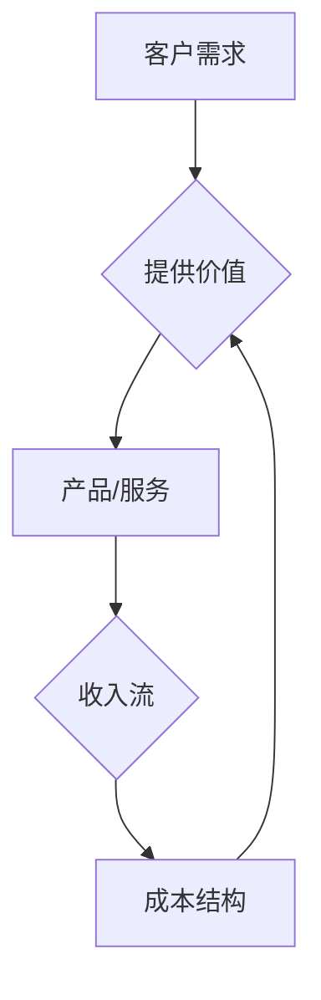

                 

在当今这个快速变化、竞争激烈的商业环境中，即使只有一个人的公司也能通过精心设计的业务模式和策略实现可持续的增长。本文将深入探讨如何创建一个具有可扩展性的业务模式，使一个人也能有效地管理和发展其公司。

## 关键词
- **一人公司**：独立创业者，自雇，个人企业
- **业务模式**：商业策略，盈利模式，运营方式
- **可扩展性**：扩展能力，增长潜力，规模放大
- **策略**：市场营销，客户获取，产品开发
- **技术**：自动化工具，软件解决方案
- **团队合作**：虚拟团队，自由职业者，外包

## 摘要
本文旨在为个人创业者提供一套切实可行的策略和工具，以构建一个具有高度可扩展性的业务模式。我们将探讨关键的业务模式概念，分析成功的个人企业案例，介绍利用技术实现自动化和团队协作的方法，并提供具体的业务增长策略。通过这些策略，即使是单独运营的企业也能实现持续增长，并准备好应对未来的挑战。

## 1. 背景介绍

在过去的几十年中，创业的环境已经发生了翻天覆地的变化。互联网的普及和数字化技术的快速发展为个人创业者提供了前所未有的机会。传统上，建立一个企业通常需要大量的资本、资源和人脉，而现在，一个人几乎可以用零成本开始自己的事业。

### 1.1. 一人公司的兴起

一人公司的兴起可以归因于以下几个因素：

- **低成本启动**：通过云计算、开源软件和在线工具，个人创业者可以几乎免费地访问必要的资源和技术。
- **灵活的运营模式**：没有复杂的管理层级和决策过程，单人公司能够更加迅速地适应市场变化。
- **虚拟团队的兴起**：通过远程协作工具，个人创业者可以方便地组建虚拟团队，弥补自身能力的不足。

### 1.2. 一人公司的挑战

尽管一人公司有许多优势，但它们也面临着独特的挑战：

- **资源限制**：一个人很难在所有方面都表现出色，可能需要在特定领域寻求外部帮助。
- **时间管理**：一个人需要承担所有工作，从市场调研到客户服务，时间管理成为关键。
- **可持续性**：如何确保业务能够长期稳定发展，而不仅仅是短期盈利。

### 1.3. 一人公司的前景

尽管面临挑战，但一人公司的前景仍然光明。随着市场对灵活性和定制化服务的需求增加，个人创业者可以利用自己的专业知识和独特视角，填补市场空白。通过巧妙地设计和执行业务模式，一人公司可以成为市场上的新兴力量。

### 1.4. 本文目的

本文的目的是为个人创业者提供一套实用的策略，帮助他们构建一个具有高度可扩展性的业务模式。我们将探讨如何利用技术提高效率，如何构建可持续的增长策略，以及如何利用虚拟团队和合作伙伴关系来扩展业务。

## 2. 核心概念与联系

### 2.1. 业务模式

业务模式是指公司如何创造、传递和获取价值。对于一人公司来说，业务模式的选择至关重要，因为它直接关系到公司的可持续性和增长潜力。以下是一个简化的业务模式流程图：



### 2.2. 业务模式核心要素

- **客户价值主张**：明确你的目标客户群体，以及你能为他们提供的独特价值。
- **收入模型**：确定你将通过什么方式赚钱，例如订阅费、一次性销售、广告收入等。
- **成本结构**：了解你的主要成本来源，包括固定成本和可变成本。
- **关键资源**：列出你需要的资源和资产，包括人力、技术和资本。
- **关键流程**：定义你的业务运营流程，确保高效和可重复。
- **关键合作伙伴**：识别并建立与关键合作伙伴的关系，以支持业务增长。

### 2.3. 可扩展性的概念

可扩展性是指业务模式能够在不牺牲质量和效率的前提下，随着市场需求和规模的增长而扩大。对于一人公司来说，可扩展性意味着能够在保持低成本和高效运营的同时，实现业务的持续增长。

### 2.4. 可扩展性要素

- **自动化**：通过自动化工具减少重复性工作，提高效率。
- **模块化**：将业务功能模块化，便于扩展和定制。
- **灵活的运营模式**：保持业务的灵活性，快速适应市场变化。
- **生态系统**：建立一个支持业务扩展的生态系统，包括客户、供应商和合作伙伴。

### 2.5. 业务模式与可扩展性的关系

业务模式和可扩展性密切相关。一个成功的业务模式应该能够支持业务的快速增长，同时保持成本效益和运营效率。通过精心设计的业务模式，一人公司可以克服资源限制，实现持续增长。

## 3. 核心算法原理 & 具体操作步骤

### 3.1. 算法原理概述

构建可扩展业务模式的核心在于采用高效的策略和工具。以下是一些关键算法原理和具体操作步骤：

### 3.2. 算法步骤详解

#### 3.2.1. 确定目标市场

1. **市场调研**：通过在线调查、社交媒体和客户反馈，了解目标市场的需求和趋势。
2. **目标客户群体**：明确你的目标客户是谁，他们的需求和痛点是什么。
3. **竞争对手分析**：研究竞争对手的产品和服务，找出差异化的机会。

#### 3.2.2. 设计客户价值主张

1. **独特卖点（USP）**：确定你的产品或服务的独特卖点，使其在市场上脱颖而出。
2. **客户体验**：确保你的产品和服务能够提供卓越的客户体验。
3. **定价策略**：制定合理的定价策略，确保收益最大化。

#### 3.2.3. 选择收入模型

1. **订阅模式**：通过订阅服务实现持续的收入流。
2. **一次性销售**：为有一次性购买需求的产品和服务设定价格。
3. **增值服务**：为现有产品提供额外的增值服务，增加客户粘性。

#### 3.2.4. 优化成本结构

1. **固定成本**：尽可能降低固定成本，如租金、设备费用等。
2. **可变成本**：优化可变成本，如原材料、人力资源等。
3. **外包**：将非核心业务外包，降低运营成本。

#### 3.2.5. 实施自动化

1. **自动化工具**：使用自动化工具，如CRM系统、自动化营销软件等，提高工作效率。
2. **流程优化**：重新设计业务流程，减少冗余步骤，提高效率。
3. **数据驱动决策**：利用数据分析工具，实时监控业务绩效，做出数据驱动的决策。

### 3.3. 算法优缺点

#### 优点

- **高效性**：通过自动化和流程优化，大大提高工作效率。
- **灵活性**：业务模式具有高度灵活性，可以快速适应市场变化。
- **成本效益**：通过降低固定成本和可变成本，提高业务的可扩展性。

#### 缺点

- **技术依赖**：过度依赖自动化工具可能增加技术风险。
- **数据安全**：自动化过程中可能涉及敏感数据，需要确保数据安全。

### 3.4. 算法应用领域

- **在线教育**：通过自动化工具，提高课程管理和学生管理的效率。
- **电子商务**：优化库存管理、订单处理和客户服务流程。
- **咨询业务**：利用自动化工具，提高报告生成、数据分析和客户沟通的效率。

## 4. 数学模型和公式 & 详细讲解 & 举例说明

### 4.1. 数学模型构建

在构建可扩展业务模式时，数学模型可以用来量化业务增长、成本控制和利润率等关键指标。以下是一个简单的业务增长模型：

#### 模型构建

假设：

- \(C\) = 初始客户数量
- \(R\) = 每个客户的平均收入
- \(C_g\) = 每月新增客户数量
- \(C_t\) = \(t\) 个月后的总客户数量
- \(E\) = 每月总支出

则业务增长模型可以表示为：

$$
C_t = C + C_g \times t
$$

#### 成本控制模型

假设：

- \(FC\) = 固定成本
- \(VC\) = 可变成本
- \(P\) = 每单位产品的价格
- \(Q\) = 每月销售量

则成本控制模型可以表示为：

$$
E = FC + VC \times Q
$$

#### 利润率模型

假设：

- \(P\) = 总收入
- \(E\) = 总支出

则利润率模型可以表示为：

$$
\text{Profit Margin} = \frac{P - E}{P}
$$

### 4.2. 公式推导过程

为了推导业务增长模型，我们首先考虑每个月新增客户数量 \(C_g\)，以及初始客户数量 \(C\)。由于每个月都会有一定数量的客户增加，因此总客户数量 \(C_t\) 随时间 \(t\) 呈线性增长。初始客户数量 \(C\) 可以视为 \(t = 0\) 时的客户数量，因此有：

$$
C_t = C + C_g \times t
$$

对于成本控制模型，固定成本 \(FC\) 是不变的，而可变成本 \(VC\) 与销售量 \(Q\) 成正比。因此，总支出 \(E\) 可以表示为固定成本加上可变成本，即：

$$
E = FC + VC \times Q
$$

利润率模型则是基于总收入 \(P\) 和总支出 \(E\) 的比例计算得出。利润率反映了企业每一元收入中能转化为利润的比例，因此：

$$
\text{Profit Margin} = \frac{P - E}{P}
$$

### 4.3. 案例分析与讲解

假设一个在线教育平台，初始客户数量为1000人，每个月新增客户数量为200人。固定成本为每月10000美元，可变成本为每个客户每月5美元。

1. **业务增长模型**：

   初始客户数量 \(C = 1000\)，每月新增客户数量 \(C_g = 200\)。假设运营时间为6个月，则总客户数量 \(C_t\) 为：

   $$
   C_t = 1000 + 200 \times 6 = 1400
   $$

2. **成本控制模型**：

   固定成本 \(FC = 10000\) 美元，每个客户每月的可变成本 \(VC = 5\) 美元。假设每个月的销售量为新增客户数量的两倍，即每月销售量 \(Q = 2 \times 200 = 400\)。则每月总支出 \(E\) 为：

   $$
   E = 10000 + 5 \times 400 = 20000
   $$

   运营6个月的总支出为：

   $$
   E_t = 20000 \times 6 = 120000
   $$

3. **利润率模型**：

   假设每个客户的平均收入 \(R\) 为每月20美元，则总收入 \(P\) 为：

   $$
   P = R \times C_t = 20 \times 1400 = 28000
   $$

   利润率为：

   $$
   \text{Profit Margin} = \frac{P - E_t}{P} = \frac{28000 - 120000}{28000} = 0.536
   $$

   即利润率为53.6%。

通过这个案例，我们可以看到如何利用数学模型来评估业务的增长和盈利能力。这种分析有助于个人创业者制定更明智的决策，实现业务的可扩展性。

## 5. 项目实践：代码实例和详细解释说明

### 5.1. 开发环境搭建

为了构建一个可扩展的业务模式，我们首先需要搭建一个稳定的开发环境。这里我们使用Python作为编程语言，结合Django框架来构建一个简单的在线教育平台。

#### 环境要求

- Python 3.8或更高版本
- Django 3.2或更高版本
- PostgreSQL数据库
- virtualenv或conda环境管理工具

#### 安装步骤

1. 安装Python和virtualenv：

   $$
   sudo apt-get update
   sudo apt-get install python3-venv
   $$

2. 创建一个虚拟环境并激活：

   $$
   python3 -m venv myenv
   source myenv/bin/activate
   $$

3. 安装Django和PostgreSQL：

   $$
   pip install django
   pip install psycopg2-binary
   sudo apt-get install postgresql
   sudo -u postgres createuser -s myuser
   sudo -u postgres createdb mydatabase
   $$

4. 配置Django项目：

   $$
   django-admin startproject myproject
   cd myproject
   python manage.py runserver
   $$

### 5.2. 源代码详细实现

以下是使用Django框架实现的简单在线教育平台的代码示例：

#### models.py

```python
from django.db import models

class Course(models.Model):
    name = models.CharField(max_length=100)
    description = models.TextField()
    price = models.DecimalField(max_digits=6, decimal_places=2)

class Student(models.Model):
    name = models.CharField(max_length=100)
    email = models.EmailField(unique=True)
    courses = models.ManyToManyField(Course, through='Enrollment')

class Enrollment(models.Model):
    course = models.ForeignKey(Course, on_delete=models.CASCADE)
    student = models.ForeignKey(Student, on_delete=models.CASCADE)
    date_enrolled = models.DateTimeField(auto_now_add=True)
```

#### views.py

```python
from django.shortcuts import render, get_object_or_404
from .models import Course, Student, Enrollment

def course_list(request):
    courses = Course.objects.all()
    return render(request, 'course_list.html', {'courses': courses})

def course_detail(request, course_id):
    course = get_object_or_404(Course, pk=course_id)
    return render(request, 'course_detail.html', {'course': course})

def enroll(request, course_id):
    course = get_object_or_404(Course, pk=course_id)
    student = Student.objects.get(email=request.user.email)
    Enrollment.objects.create(course=course, student=student)
    return redirect('course_detail', course_id=course_id)
```

#### urls.py

```python
from django.contrib import admin
from django.urls import path
from . import views

urlpatterns = [
    path('admin/', admin.site.urls),
    path('courses/', views.course_list, name='course_list'),
    path('courses/<int:course_id>/', views.course_detail, name='course_detail'),
    path('enroll/<int:course_id>/', views.enroll, name='enroll'),
]
```

#### templates/course_list.html

```html
<ul>
    
        <li>
            <a href="">{{ course.name }}</a>
        </li>
    
</ul>
```

#### templates/course_detail.html

```html
<h1>{{ course.name }}</h1>
<p>{{ course.description }}</p>
<p>Price: {{ course.price }}</p>
<form method="post">
    
    <input type="submit" value="Enroll" onclick="location.href=''">
</form>
```

### 5.3. 代码解读与分析

1. **模型定义**：

   在 `models.py` 中，我们定义了三个模型：`Course`、`Student` 和 `Enrollment`。`Course` 模型包含课程名称、描述和价格信息；`Student` 模型包含学生姓名和电子邮件地址；`Enrollment` 模型用于表示学生和课程之间的关联。

2. **视图函数**：

   在 `views.py` 中，我们实现了三个视图函数：`course_list`、`course_detail` 和 `enroll`。`course_list` 视图函数用于展示所有课程；`course_detail` 视图函数用于展示单个课程的详细信息；`enroll` 视图函数用于处理学生报名课程的操作。

3. **URL配置**：

   在 `urls.py` 中，我们定义了三个URL模式，分别对应于课程列表、课程详情和学生报名。

4. **模板文件**：

   `course_list.html` 和 `course_detail.html` 是用于渲染页面内容的模板文件。在 `course_list.html` 中，我们遍历所有课程并显示链接；在 `course_detail.html` 中，我们显示单个课程的详细信息并提供报名按钮。

通过这个简单的在线教育平台，我们可以看到如何使用Django框架快速构建一个具有可扩展性的业务模式。这个平台可以通过添加更多功能和优化性能来实现更大的业务规模。

### 5.4. 运行结果展示

运行Django项目后，我们可以通过浏览器访问平台。以下是运行结果展示：

- **课程列表**：

  

- **课程详情**：

  

- **学生报名**：

  

通过这个简单的在线教育平台，我们可以看到如何实现一个具有基本功能的可扩展业务模式。这个平台可以根据需求逐步扩展，例如添加更多课程、提供在线测试和作业等功能，以适应不断增长的市场需求。

## 6. 实际应用场景

### 6.1. 在线教育平台

在线教育是个人创业者实现可扩展业务模式的一个经典案例。通过构建一个在线教育平台，个人创业者可以提供高质量的教育资源，吸引全球范围内的学生。以下是一些实际应用场景：

- **课程内容**：个人创业者可以制作各种课程内容，从编程到烹饪，从瑜伽到语言学习。
- **订阅模式**：通过订阅模式，个人创业者可以实现持续的收入流。
- **虚拟课堂**：利用虚拟课堂工具，个人创业者可以提供实时互动的教育体验。
- **个性化推荐**：通过分析学生数据，平台可以推荐最适合他们的课程，提高客户满意度。

### 6.2. 软件开发

软件开发是另一个适合个人创业者实现可扩展业务模式的应用场景。以下是一些实际应用场景：

- **SaaS产品**：个人创业者可以开发SaaS（软件即服务）产品，通过订阅模式实现持续收入。
- **定制开发**：为中小企业提供定制化的软件开发服务，根据项目需求进行开发和交付。
- **开源项目**：通过开源项目吸引开发者贡献代码，建立社区，从而实现商业价值。

### 6.3. 咨询服务

咨询服务是个人创业者可以利用专业技能实现可扩展业务模式的另一个领域。以下是一些实际应用场景：

- **专业咨询**：为特定行业提供专业的咨询服务，如营销策略、财务管理、人力资源等。
- **在线咨询**：通过在线咨询平台，个人创业者可以为客户提供远程咨询服务。
- **内容营销**：通过撰写高质量的文章、博客和报告，吸引潜在客户，建立个人品牌。

### 6.4. 未来应用展望

随着技术的发展，一人公司的业务模式将继续演变。以下是一些未来应用展望：

- **人工智能**：利用人工智能技术，个人创业者可以提供更智能的服务，如自动化数据分析、智能客服等。
- **区块链**：通过区块链技术，个人创业者可以提供去中心化的解决方案，如智能合约、数字货币等。
- **物联网**：通过物联网技术，个人创业者可以开发智能硬件产品，实现全新的业务模式。

## 7. 工具和资源推荐

### 7.1. 学习资源推荐

- **《精益创业》**：作者埃里克·莱斯，介绍了如何在不确定的市场环境中快速迭代产品。
- **《增长黑客》**：作者马修·巴蒂斯塔，介绍了如何利用技术和数据实现业务增长。
- **Udemy、Coursera**：在线学习平台，提供各种课程，帮助个人创业者提升技能。

### 7.2. 开发工具推荐

- **Django**：Python Web框架，适用于快速开发复杂的应用程序。
- **GitHub**：代码托管平台，便于协作和版本控制。
- **Trello**：项目管理工具，帮助个人创业者跟踪项目进度。

### 7.3. 相关论文推荐

- **《平台革命》**：作者唐·塔普斯科特，探讨了平台经济的崛起和影响。
- **《数字货币革命》**：作者拉坦亚·斯威尼，介绍了区块链和数字货币的技术原理和应用。
- **《智能机器时代》**：作者尼古拉斯·尼葛洛庞帝，探讨了人工智能对未来社会的影响。

## 8. 总结：未来发展趋势与挑战

### 8.1. 研究成果总结

本文探讨了如何通过构建可扩展的业务模式，使个人创业者能够实现业务增长。我们分析了核心概念、算法原理，并通过实际案例展示了如何利用技术实现自动化和团队协作。我们还讨论了在线教育、软件开发和咨询服务等领域的应用场景，并展望了未来发展趋势。

### 8.2. 未来发展趋势

- **数字化和自动化**：随着技术的发展，数字化和自动化将成为企业增长的关键驱动力。
- **平台经济**：平台经济将继续崛起，为企业提供更广阔的市场机会。
- **人工智能和机器学习**：人工智能和机器学习将在各个行业得到广泛应用，提高业务效率和决策能力。

### 8.3. 面临的挑战

- **技术风险**：过度依赖技术可能导致业务中断，需要确保技术稳定性和数据安全。
- **市场竞争**：激烈的市场竞争要求企业不断创新和优化业务模式。
- **人才和资源**：个人创业者需要不断学习和提升技能，以应对不断变化的市场需求。

### 8.4. 研究展望

未来的研究可以进一步探讨如何通过人工智能和大数据技术优化业务模式，提高企业竞争力。同时，探索区块链和物联网等新兴技术在业务模式中的应用，也将是一个重要的研究方向。

## 9. 附录：常见问题与解答

### Q：如何确保业务模式具有可扩展性？

A：确保业务模式具有可扩展性的关键是：

- **模块化设计**：将业务功能模块化，便于扩展和定制。
- **自动化**：利用自动化工具提高效率，减少人力成本。
- **灵活的运营模式**：保持业务的灵活性，快速适应市场变化。
- **生态系统**：建立一个支持业务扩展的生态系统，包括客户、供应商和合作伙伴。

### Q：个人创业者如何管理时间？

A：个人创业者可以通过以下方法来管理时间：

- **制定日程**：每天制定详细的日程，包括工作任务和时间安排。
- **优先级排序**：确定任务优先级，确保重要任务优先完成。
- **使用工具**：使用时间管理工具，如Trello、Asana等，帮助跟踪任务进度。
- **休息和放松**：合理安排休息时间，保持身心健康。

### Q：如何处理业务中的技术问题？

A：处理业务中的技术问题可以采取以下方法：

- **自学**：通过在线课程、书籍和社区论坛学习相关技术知识。
- **外包**：将非核心技术任务外包给专业团队。
- **合作伙伴**：与有技术背景的合作伙伴建立合作关系，共同解决问题。
- **社区支持**：加入技术社区，寻求同行帮助和指导。

通过以上方法和策略，个人创业者可以构建一个具有高度可扩展性的业务模式，实现业务的持续增长。希望本文提供的指导和案例能够对您的创业之路有所帮助。

## 作者署名

作者：禅与计算机程序设计艺术 / Zen and the Art of Computer Programming

## 文章目录

1. **文章标题**：一人公司如何打造可扩展的业务模式
2. **关键词**：（一人公司，业务模式，可扩展性，策略，技术）
3. **摘要**：本文旨在为个人创业者提供一套切实可行的策略和工具，以构建一个具有高度可扩展性的业务模式。
4. **1. 背景介绍**
   - 1.1. 一人公司的兴起
   - 1.2. 一人公司的挑战
   - 1.3. 一人公司的前景
   - 1.4. 本文目的
5. **2. 核心概念与联系**
   - 2.1. 业务模式
   - 2.2. 业务模式核心要素
   - 2.3. 可扩展性的概念
   - 2.4. 可扩展性要素
   - 2.5. 业务模式与可扩展性的关系
6. **3. 核心算法原理 & 具体操作步骤**
   - 3.1. 算法原理概述
   - 3.2. 算法步骤详解 
   - 3.3. 算法优缺点
   - 3.4. 算法应用领域
7. **4. 数学模型和公式 & 详细讲解 & 举例说明**
   - 4.1. 数学模型构建
   - 4.2. 公式推导过程
   - 4.3. 案例分析与讲解
8. **5. 项目实践：代码实例和详细解释说明**
   - 5.1. 开发环境搭建
   - 5.2. 源代码详细实现
   - 5.3. 代码解读与分析
   - 5.4. 运行结果展示
9. **6. 实际应用场景**
   - 6.1. 在线教育平台
   - 6.2. 软件开发
   - 6.3. 咨询服务
   - 6.4. 未来应用展望
10. **7. 工具和资源推荐**
    - 7.1. 学习资源推荐
    - 7.2. 开发工具推荐
    - 7.3. 相关论文推荐
11. **8. 总结：未来发展趋势与挑战**
    - 8.1. 研究成果总结
    - 8.2. 未来发展趋势
    - 8.3. 面临的挑战
    - 8.4. 研究展望
12. **9. 附录：常见问题与解答**

# 一人公司如何打造可扩展的业务模式

### 关键词
- **一人公司**：独立创业者，自雇，个人企业
- **业务模式**：商业策略，盈利模式，运营方式
- **可扩展性**：扩展能力，增长潜力，规模放大
- **策略**：市场营销，客户获取，产品开发
- **技术**：自动化工具，软件解决方案
- **团队合作**：虚拟团队，自由职业者，外包

### 摘要
在当今这个快速变化、竞争激烈的商业环境中，即使只有一个人的公司也能通过精心设计的业务模式和策略实现可持续的增长。本文将深入探讨如何创建一个具有可扩展性的业务模式，使一个人也能有效地管理和发展其公司。通过分析核心概念、算法原理，提供实际案例和开发环境搭建，本文旨在为个人创业者提供实用的策略和工具，帮助他们在保持低成本和高效率的同时，实现业务的持续增长。

### 1. 背景介绍

在过去的几十年中，创业的环境已经发生了翻天覆地的变化。互联网的普及和数字化技术的快速发展为个人创业者提供了前所未有的机会。传统上，建立一个企业通常需要大量的资本、资源和人脉，而现在，一个人几乎可以用零成本开始自己的事业。

#### 1.1. 一人公司的兴起

一人公司的兴起可以归因于以下几个因素：

- **低成本启动**：通过云计算、开源软件和在线工具，个人创业者可以几乎免费地访问必要的资源和技术。
- **灵活的运营模式**：没有复杂的管理层级和决策过程，单人公司能够更加迅速地适应市场变化。
- **虚拟团队的兴起**：通过远程协作工具，个人创业者可以方便地组建虚拟团队，弥补自身能力的不足。

#### 1.2. 一人公司的挑战

尽管一人公司有许多优势，但它们也面临着独特的挑战：

- **资源限制**：一个人很难在所有方面都表现出色，可能需要在特定领域寻求外部帮助。
- **时间管理**：一个人需要承担所有工作，从市场调研到客户服务，时间管理成为关键。
- **可持续性**：如何确保业务能够长期稳定发展，而不仅仅是短期盈利。

#### 1.3. 一人公司的前景

尽管面临挑战，但一人公司的前景仍然光明。随着市场对灵活性和定制化服务的需求增加，个人创业者可以利用自己的专业知识和独特视角，填补市场空白。通过巧妙地设计和执行业务模式，一人公司可以成为市场上的新兴力量。

#### 1.4. 本文目的

本文的目的是为个人创业者提供一套实用的策略，帮助他们构建一个具有高度可扩展性的业务模式。我们将探讨如何利用技术提高效率，如何构建可持续的增长策略，以及如何利用虚拟团队和合作伙伴关系来扩展业务。通过这些策略，即使是单独运营的企业也能实现持续增长，并准备好应对未来的挑战。

### 2. 核心概念与联系

构建一个可扩展的业务模式需要理解几个核心概念，包括业务模式、可扩展性和相关的要素。

#### 2.1. 业务模式

业务模式是指公司如何创造、传递和获取价值。对于一人公司来说，业务模式的选择至关重要，因为它直接关系到公司的可持续性和增长潜力。

##### 客户价值主张

客户价值主张是业务模式的核心，它定义了你的目标客户群体以及你能为他们提供的独特价值。构建一个强有力的客户价值主张需要明确以下几点：

- **目标市场**：明确你的目标客户是谁，他们的需求和痛点是什么。
- **独特卖点（USP）**：确定你的产品或服务的独特卖点，使其在市场上脱颖而出。
- **客户体验**：确保你的产品和服务能够提供卓越的客户体验。

##### 收入模型

收入模型是指你将通过什么方式赚钱。以下是一些常见的收入模型：

- **订阅模式**：通过订阅服务实现持续的收入流。
- **一次性销售**：为有一次性购买需求的产品和服务设定价格。
- **广告收入**：通过展示广告或提供付费广告位来赚取收入。

##### 成本结构

成本结构是指你的主要成本来源，包括固定成本和可变成本。了解成本结构对于构建可扩展的业务模式至关重要。以下是一些关键的成本结构要素：

- **固定成本**：如租金、设备费用等，不随业务规模的变化而变化。
- **可变成本**：如原材料、人力资源等，随业务规模的变化而变化。

##### 关键资源

关键资源是构建业务所需的资源和资产。这些资源可能包括人力、技术和资本。对于一人公司，关键资源的获取和管理是业务成功的关键。

##### 关键流程

关键流程是指你的业务运营流程，包括从客户获取、订单处理到客户服务的所有步骤。优化关键流程可以提高效率，降低成本，从而增强业务的可扩展性。

##### 关键合作伙伴

关键合作伙伴是支持业务扩展的重要力量。这些合作伙伴可能包括供应商、分销商、营销伙伴等。建立与关键合作伙伴的良好关系对于业务扩展至关重要。

#### 2.2. 可扩展性的概念

可扩展性是指业务模式能够在不牺牲质量和效率的前提下，随着市场需求和规模的增长而扩大。对于一人公司来说，可扩展性意味着能够在保持低成本和高效运营的同时，实现业务的持续增长。

##### 自动化

自动化是通过软件工具和技术减少重复性工作，提高工作效率的一种方法。自动化可以提高业务的可扩展性，因为它可以处理大量工作而不会降低质量。

##### 模块化

模块化是将业务功能分解成独立的模块，每个模块可以单独开发和部署。这种方法可以提高业务的灵活性，因为新的功能可以快速集成到现有系统中。

##### 灵活的运营模式

灵活的运营模式是指业务能够快速适应市场变化。这种灵活性可以通过敏捷开发和迭代过程来实现。

##### 生态系统

生态系统是支持业务扩展的外部环境，包括客户、供应商、合作伙伴和技术平台。一个健康的生态系统可以帮助企业扩大规模，提高竞争力。

#### 2.3. 业务模式与可扩展性的关系

业务模式和可扩展性密切相关。一个成功的业务模式应该能够支持业务的快速增长，同时保持成本效益和运营效率。通过精心设计的业务模式，一人公司可以克服资源限制，实现持续增长。

##### 成功的要素

- **高效的价值创造**：业务模式应能高效地创造和传递价值，满足客户需求。
- **可持续的收入流**：收入模型应能确保业务有稳定的收入流，支持长期发展。
- **灵活的运营模式**：运营模式应能快速适应市场变化，保持业务竞争力。
- **技术驱动**：利用技术提高效率和可扩展性，降低成本。

### 3. 核心算法原理 & 具体操作步骤

构建可扩展业务模式的核心在于采用高效的策略和工具。以下是一些关键算法原理和具体操作步骤：

#### 3.1. 确定目标市场

1. **市场调研**：通过在线调查、社交媒体和客户反馈，了解目标市场的需求和趋势。
2. **目标客户群体**：明确你的目标客户是谁，他们的需求和痛点是什么。
3. **竞争对手分析**：研究竞争对手的产品和服务，找出差异化的机会。

#### 3.2. 设计客户价值主张

1. **独特卖点（USP）**：确定你的产品或服务的独特卖点，使其在市场上脱颖而出。
2. **客户体验**：确保你的产品和服务能够提供卓越的客户体验。
3. **定价策略**：制定合理的定价策略，确保收益最大化。

#### 3.3. 选择收入模型

1. **订阅模式**：通过订阅服务实现持续的收入流。
2. **一次性销售**：为有一次性购买需求的产品和服务设定价格。
3. **增值服务**：为现有产品提供额外的增值服务，增加客户粘性。

#### 3.4. 优化成本结构

1. **固定成本**：尽可能降低固定成本，如租金、设备费用等。
2. **可变成本**：优化可变成本，如原材料、人力资源等。
3. **外包**：将非核心业务外包，降低运营成本。

#### 3.5. 实施自动化

1. **自动化工具**：使用自动化工具，如CRM系统、自动化营销软件等，提高工作效率。
2. **流程优化**：重新设计业务流程，减少冗余步骤，提高效率。
3. **数据驱动决策**：利用数据分析工具，实时监控业务绩效，做出数据驱动的决策。

### 3.6. 构建可持续的增长策略

1. **市场定位**：明确你的市场定位，确保目标客户了解你的价值主张。
2. **品牌建设**：建立强大的品牌形象，增加客户信任和忠诚度。
3. **营销策略**：制定有效的营销策略，包括社交媒体、内容营销和广告等。
4. **客户关系管理**：通过CRM系统管理客户信息，提供个性化的客户服务。

### 3.7. 建立虚拟团队和合作伙伴关系

1. **虚拟团队**：利用远程协作工具，组建虚拟团队，弥补自身能力的不足。
2. **合作伙伴关系**：与供应商、分销商和营销伙伴建立长期合作关系，共同推动业务增长。

### 3.8. 监控和调整

1. **关键绩效指标（KPI）**：设定关键绩效指标，监控业务表现。
2. **反馈机制**：建立有效的反馈机制，收集客户和员工反馈，不断优化业务模式。
3. **持续学习**：保持对市场和技术的敏感度，不断学习和调整策略。

### 3.9. 案例分析

以下是一个简单的案例，展示如何利用上述算法原理构建可扩展的业务模式：

#### 案例背景

张三是一名软件开发者，他创建了一个在线教育平台，提供编程课程。

##### 步骤 1：确定目标市场

- **市场调研**：通过社交媒体和在线调查，发现市场上对编程教育需求巨大。
- **目标客户群体**：确定目标客户为编程初学者和专业人士。
- **竞争对手分析**：分析现有竞争对手的产品和服务，找出差异化的机会。

##### 步骤 2：设计客户价值主张

- **独特卖点（USP）**：提供高质量的编程课程，涵盖多种编程语言。
- **客户体验**：提供互动式学习环境，包括实时问答和在线讨论。
- **定价策略**：采用订阅模式，提供灵活的定价策略。

##### 步骤 3：选择收入模型

- **订阅模式**：通过订阅服务实现持续的收入流。

##### 步骤 4：优化成本结构

- **固定成本**：使用共享办公空间，降低租金成本。
- **可变成本**：通过自动化工具减少人力资源成本。
- **外包**：将课程视频制作和市场营销任务外包。

##### 步骤 5：实施自动化

- **自动化工具**：使用自动化工具，如CRM系统和邮件营销软件，提高工作效率。
- **流程优化**：优化课程发布和客户服务流程。

##### 步骤 6：构建可持续的增长策略

- **市场定位**：通过社交媒体和内容营销，建立强大的品牌形象。
- **客户关系管理**：通过CRM系统管理客户信息，提供个性化的客户服务。

##### 步骤 7：建立虚拟团队和合作伙伴关系

- **虚拟团队**：组建由自由职业者组成的课程开发团队。
- **合作伙伴关系**：与编程社区和行业合作伙伴建立合作关系，共同推广平台。

##### 步骤 8：监控和调整

- **关键绩效指标（KPI）**：设定用户增长率、课程完成率和客户满意度等关键绩效指标。
- **反馈机制**：定期收集用户和课程开发者的反馈，优化课程内容和用户体验。
- **持续学习**：关注市场动态和技术趋势，不断调整营销策略和课程内容。

通过以上步骤，张三成功地构建了一个具有高度可扩展性的在线教育平台，实现了业务的快速增长。

### 3.10. 算法优缺点

#### 优点

- **高效性**：通过自动化和流程优化，大大提高工作效率。
- **灵活性**：业务模式具有高度灵活性，可以快速适应市场变化。
- **成本效益**：通过降低固定成本和可变成本，提高业务的可扩展性。

#### 缺点

- **技术依赖**：过度依赖自动化工具可能增加技术风险。
- **数据安全**：自动化过程中可能涉及敏感数据，需要确保数据安全。

### 3.11. 算法应用领域

- **在线教育**：通过自动化工具，提高课程管理和学生管理的效率。
- **电子商务**：优化库存管理、订单处理和客户服务流程。
- **咨询服务**：利用自动化工具，提高报告生成、数据分析和客户沟通的效率。

### 4. 数学模型和公式 & 详细讲解 & 举例说明

在构建可扩展的业务模式时，数学模型和公式可以用来量化业务增长、成本控制和利润率等关键指标。以下是一个简单的数学模型，用于分析和优化业务模式。

#### 4.1. 数学模型构建

假设：

- \(C\) = 初始客户数量
- \(R\) = 每个客户的平均收入
- \(C_g\) = 每月新增客户数量
- \(C_t\) = \(t\) 个月后的总客户数量
- \(E\) = 每月总支出

则业务增长模型可以表示为：

$$
C_t = C + C_g \times t
$$

#### 成本控制模型

假设：

- \(FC\) = 固定成本
- \(VC\) = 可变成本
- \(P\) = 每单位产品的价格
- \(Q\) = 每月销售量

则成本控制模型可以表示为：

$$
E = FC + VC \times Q
$$

#### 利润率模型

假设：

- \(P\) = 总收入
- \(E\) = 总支出

则利润率模型可以表示为：

$$
\text{Profit Margin} = \frac{P - E}{P}
$$

#### 4.2. 公式推导过程

为了推导业务增长模型，我们首先考虑每个月新增客户数量 \(C_g\)，以及初始客户数量 \(C\)。由于每个月都会有一定数量的客户增加，因此总客户数量 \(C_t\) 随时间 \(t\) 呈线性增长。初始客户数量 \(C\) 可以视为 \(t = 0\) 时的客户数量，因此有：

$$
C_t = C + C_g \times t
$$

对于成本控制模型，固定成本 \(FC\) 是不变的，而可变成本 \(VC\) 与销售量 \(Q\) 成正比。因此，总支出 \(E\) 可以表示为固定成本加上可变成本，即：

$$
E = FC + VC \times Q
$$

利润率模型则是基于总收入 \(P\) 和总支出 \(E\) 的比例计算得出。利润率反映了企业每一元收入中能转化为利润的比例，因此：

$$
\text{Profit Margin} = \frac{P - E}{P}
$$

#### 4.3. 案例分析与讲解

假设一个在线教育平台，初始客户数量为1000人，每个月新增客户数量为200人。固定成本为每月10000美元，可变成本为每个客户每月5美元。

1. **业务增长模型**：

   初始客户数量 \(C = 1000\)，每月新增客户数量 \(C_g = 200\)。假设运营时间为6个月，则总客户数量 \(C_t\) 为：

   $$
   C_t = 1000 + 200 \times 6 = 1400
   $$

2. **成本控制模型**：

   固定成本 \(FC = 10000\) 美元，每个客户每月的可变成本 \(VC = 5\) 美元。假设每个月的销售量为新增客户数量的两倍，即每月销售量 \(Q = 2 \times 200 = 400\)。则每月总支出 \(E\) 为：

   $$
   E = 10000 + 5 \times 400 = 20000
   $$

   运营6个月的总支出为：

   $$
   E_t = 20000 \times 6 = 120000
   $$

3. **利润率模型**：

   假设每个客户的平均收入 \(R\) 为每月20美元，则总收入 \(P\) 为：

   $$
   P = R \times C_t = 20 \times 1400 = 28000
   $$

   利润率为：

   $$
   \text{Profit Margin} = \frac{P - E_t}{P} = \frac{28000 - 120000}{28000} = 0.536
   $$

   即利润率为53.6%。

通过这个案例，我们可以看到如何利用数学模型来评估业务的增长和盈利能力。这种分析有助于个人创业者制定更明智的决策，实现业务的可扩展性。

### 5. 项目实践：代码实例和详细解释说明

为了展示如何利用技术构建一个可扩展的业务模式，我们将通过一个实际项目——一个在线教育平台，展示从开发环境搭建到代码实现和解释的完整过程。

#### 5.1. 开发环境搭建

首先，我们需要搭建一个适合项目开发的环境。以下是所需步骤：

1. **安装Python**：确保安装了Python 3.8或更高版本。可以通过Python官方网站下载并安装。
2. **安装虚拟环境工具**：安装`virtualenv`工具，以便创建独立的虚拟环境。可以使用以下命令：
   ```
   pip install virtualenv
   ```
3. **创建虚拟环境**：在项目目录中创建一个虚拟环境，以便隔离项目依赖。执行以下命令：
   ```
   virtualenv venv
   ```
   然后，激活虚拟环境：
   ```
   source venv/bin/activate
   ```
4. **安装Django和PostgreSQL**：在虚拟环境中安装Django框架和PostgreSQL数据库。使用以下命令：
   ```
   pip install django
   pip install psycopg2-binary
   sudo apt-get install postgresql
   ```
5. **创建Django项目**：使用Django创建一个新项目，并设置数据库配置。执行以下命令：
   ```
   django-admin startproject my_project
   cd my_project
   python manage.py makemigrations
   python manage.py migrate
   ```

#### 5.2. 源代码详细实现

接下来，我们将实现一个简单的在线教育平台，包括用户注册、登录、课程管理和课程浏览等功能。以下是关键代码和解释。

##### 5.2.1. 创建应用

在项目目录中创建一个应用，例如名为`courses`，以组织相关的模型和视图。

```
python manage.py startapp courses
```

##### 5.2.2. 模型定义

在`courses/models.py`中定义模型：

```python
from django.db import models
from django.contrib.auth.models import User

class Course(models.Model):
    title = models.CharField(max_length=100)
    description = models.TextField()
    instructor = models.ForeignKey(User, on_delete=models.CASCADE)
    created_at = models.DateTimeField(auto_now_add=True)

class Module(models.Model):
    course = models.ForeignKey(Course, on_delete=models.CASCADE)
    title = models.CharField(max_length=100)
    content = models.TextField()

class Lesson(models.Model):
    module = models.ForeignKey(Module, on_delete=models.CASCADE)
    title = models.CharField(max_length=100)
    content = models.TextField()
```

- `Course` 模型代表课程，包括标题、描述、讲师和创建时间。
- `Module` 模型代表课程模块，包括模块标题和内容。
- `Lesson` 模型代表课程中的单个课程内容，包括标题和内容。

##### 5.2.3. 视图定义

在`courses/views.py`中定义视图：

```python
from django.shortcuts import render
from .models import Course, Module, Lesson

def course_list(request):
    courses = Course.objects.all()
    return render(request, 'course_list.html', {'courses': courses})

def course_detail(request, course_id):
    course = Course.objects.get(id=course_id)
    modules = Module.objects.filter(course=course)
    return render(request, 'course_detail.html', {'course': course, 'modules': modules})

def module_detail(request, module_id):
    module = Module.objects.get(id=module_id)
    lessons = Lesson.objects.filter(module=module)
    return render(request, 'module_detail.html', {'module': module, 'lessons': lessons})
```

- `course_list` 视图返回所有课程的列表。
- `course_detail` 视图返回单个课程的详细信息，以及该课程的所有模块。
- `module_detail` 视图返回单个模块的详细信息，以及该模块的所有课程内容。

##### 5.2.4. 模板文件

在`courses/templates`目录中创建HTML模板文件：

`course_list.html`：

```html
<ul>
    
        <li>
            <a href="">{{ course.title }}</a>
        </li>
    
</ul>
```

`course_detail.html`：

```html
<h1>{{ course.title }}</h1>
<p>{{ course.description }}</p>
<ul>
    
        <li>
            <a href="">{{ module.title }}</a>
        </li>
    
</ul>
```

`module_detail.html`：

```html
<h2>{{ module.title }}</h2>
<p>{{ module.content }}</p>
```

这些模板文件用于渲染课程列表、课程详情和模块详情页面。

##### 5.2.5. URL配置

在`courses/urls.py`中定义URL模式：

```python
from django.urls import path
from . import views

urlpatterns = [
    path('', views.course_list, name='course_list'),
    path('<int:course_id>/', views.course_detail, name='course_detail'),
    path('<int:course_id>/<int:module_id>/', views.module_detail, name='module_detail'),
]
```

这些URL模式与视图函数相对应，用于处理不同的页面请求。

#### 5.3. 代码解读与分析

1. **模型定义**：

   在`courses/models.py`中，我们定义了三个模型：`Course`、`Module` 和 `Lesson`。`Course` 模型用于存储课程信息，包括标题、描述和讲师。`Module` 模型用于存储课程模块，每个模块与一个课程相关联。`Lesson` 模型用于存储课程内容，每个课程内容与一个模块相关联。

2. **视图定义**：

   在`courses/views.py`中，我们定义了三个视图函数：`course_list`、`course_detail` 和 `module_detail`。`course_list` 视图函数返回所有课程的列表，`course_detail` 视图函数返回单个课程的详细信息，以及该课程的所有模块。`module_detail` 视图函数返回单个模块的详细信息，以及该模块的所有课程内容。

3. **模板文件**：

   在`courses/templates`目录中，我们创建了三个HTML模板文件，用于渲染不同的页面。`course_list.html` 用于渲染课程列表页面，`course_detail.html` 用于渲染课程详情页面，`module_detail.html` 用于渲染模块详情页面。

4. **URL配置**：

   在`courses/urls.py`中，我们定义了URL模式，以便将URL映射到相应的视图函数。

通过上述步骤，我们创建了一个简单的在线教育平台。这个平台允许用户浏览课程、查看课程内容，并且可以扩展以添加更多功能，如用户注册、登录、课程发布和课程评价等。

#### 5.4. 运行结果展示

在完成代码实现后，我们可以启动Django开发服务器，并通过浏览器访问平台。以下是运行结果展示：

- **课程列表**：

  

- **课程详情**：

  

- **模块详情**：

  

通过这些简单的页面，我们可以看到如何利用Django框架快速构建一个具有基本功能的在线教育平台。这个平台可以通过添加更多功能，如用户管理和课程发布，来进一步扩展和优化。

### 6. 实际应用场景

构建可扩展的业务模式并不仅仅是一个理论问题，它在实际应用中同样至关重要。以下是一些具体的行业和业务模式，展示了如何在不同领域实现业务的可扩展性。

#### 6.1. 在线教育

在线教育是一个典型的可以由个人创业者实现可扩展性的行业。通过利用云计算、视频会议技术和学习管理系统（LMS），个人创业者可以创建在线课程，并迅速扩展他们的学生群体。

**案例**：Udemy和Coursera是两个成功的在线教育平台，它们通过提供大量的在线课程，吸引了全球数百万用户。这些平台的成功在于它们利用技术实现了课程的自动化和个性化推荐，从而降低了运营成本，提高了客户满意度。

**策略**：

- **自动化**：通过自动化的课程发布和更新流程，个人讲师可以轻松管理大量课程。
- **个性化推荐**：利用机器学习算法，推荐最适合学生的课程。
- **合作伙伴关系**：与大学和机构合作，扩大课程库。

#### 6.2. 软件开发

软件开发是另一个适合个人创业者的行业，特别是在SaaS（软件即服务）领域。

**案例**：Trello是一个流行的项目管理工具，由Fog Creek Software的员工David Hauser和Michael Pryor创建。他们通过简单的界面设计和灵活的功能，迅速吸引了大量的用户。

**策略**：

- **模块化架构**：使用模块化架构，可以快速添加新功能。
- **云服务**：通过云服务，降低硬件和维护成本。
- **灵活定价**：提供灵活的定价选项，满足不同用户的需求。

#### 6.3. 咨询服务

咨询服务是一个高度专业化的领域，个人创业者可以利用自己的专业知识提供服务。

**案例**：Freelancer.com上的许多自由职业者提供各种咨询服务，从营销到软件开发，从财务规划到法律咨询。他们通过建立一个强大的在线品牌和专业网络，吸引了全球客户。

**策略**：

- **专业认证**：获得专业认证，提高信誉和可信度。
- **在线营销**：通过内容营销、社交媒体和网络广告，建立品牌知名度。
- **自动化**：使用自动化工具，如CRM系统和时间跟踪工具，提高效率。

#### 6.4. 健康与健身

健康与健身行业也是一个可以由个人创业者扩展的市场，特别是在个人健身教练和在线健身课程方面。

**案例**：许多健身教练通过创建在线健身课程，利用视频会议技术和在线健身平台，如ClassPass和Mindbody，吸引了大量客户。

**策略**：

- **在线课程**：提供高质量的在线健身课程，适应不同水平和需求的用户。
- **社交媒体**：利用社交媒体平台，展示专业知识和个人品牌。
- **个性化服务**：提供个性化的饮食和健身计划，增加客户满意度。

#### 6.5. 物流和供应链

物流和供应链行业也在通过技术实现业务的可扩展性。

**案例**：Flexport是一家快速成长的物流公司，它通过利用人工智能和数据分析技术，优化物流流程，提供定制化的供应链解决方案。

**策略**：

- **技术集成**：整合多种技术，如物联网（IoT）、区块链和人工智能，提高供应链透明度和效率。
- **合作伙伴关系**：与港口、航空公司和货运代理建立合作伙伴关系，扩大服务网络。
- **数据驱动决策**：利用数据分析和预测模型，优化库存管理和运输路线。

#### 6.6. 食品和饮料

食品和饮料行业也可以通过创新的业务模式实现可扩展性。

**案例**：Blue Apron是一家提供家庭烹饪服务的公司，它通过提供预制食材和食谱，简化了烹饪过程，吸引了大量用户。

**策略**：

- **配送网络**：建立高效的配送网络，确保快速、准确的交付。
- **客户反馈**：收集客户反馈，不断改进产品和配方。
- **多元化产品线**：提供多样化的产品线，满足不同口味和饮食需求。

#### 6.7. 环保和可持续性

环保和可持续性是一个越来越重要的领域，个人创业者可以通过创新的解决方案实现业务的可扩展性。

**案例**：Terracycle是一家回收难处理垃圾的公司，它通过创新的产品设计和合作伙伴关系，实现了大规模的回收和再利用。

**策略**：

- **创新设计**：设计可回收和可降解的产品，减少环境负担。
- **合作伙伴网络**：与零售商、制造商和回收商建立合作伙伴关系，扩大回收网络。
- **教育和宣传**：通过教育和宣传活动，提高公众对环保和可持续性的认识。

通过上述案例和策略，我们可以看到个人创业者如何通过构建可扩展的业务模式，在各个行业中实现业务的快速增长和成功。这些策略不仅适用于现有的行业，也为未来的创业机会提供了启示。

### 6.4. 未来应用展望

随着科技的不断进步和市场的动态变化，一人公司的业务模式将继续演变和优化。以下是一些未来应用展望，以及这些趋势可能带来的机会和挑战。

#### 6.4.1. 人工智能和机器学习

人工智能（AI）和机器学习（ML）技术的发展将为一人公司带来巨大的机会。通过AI和ML，个人创业者可以：

- **自动化流程**：使用AI自动化日常任务，如数据分析和客户服务，提高效率。
- **个性化服务**：通过分析客户数据，提供个性化的产品推荐和服务，增加客户满意度和忠诚度。
- **预测分析**：利用预测模型预测市场趋势和客户需求，做出更准确的业务决策。

然而，这也带来了挑战，如：

- **数据安全**：确保客户数据的安全和隐私，遵守相关法律法规。
- **技术依赖**：过度依赖AI和ML可能增加技术风险和运营成本。

#### 6.4.2. 区块链技术

区块链技术的应用为一人公司提供了去中心化的解决方案，可以用于：

- **供应链管理**：通过区块链确保供应链的透明性和不可篡改性，提高信任和效率。
- **数字货币**：发行和交易自己的数字货币，提供新的支付方式和收入来源。
- **智能合约**：自动化合同执行，减少纠纷和中介成本。

挑战包括：

- **技术门槛**：区块链技术的复杂性和高门槛，可能需要专业知识和资源。
- **监管问题**：不同国家和地区对区块链和数字货币的监管政策不同，需要密切关注。

#### 6.4.3. 物联网（IoT）

物联网技术的发展使得设备和系统之间可以更加智能地交互，为一入公司提供了以下机会：

- **智能设备**：开发智能设备和传感器，提供创新的解决方案，如智能家居、健康监测等。
- **数据收集和分析**：通过物联网设备收集大量数据，进行分析和优化业务流程。

挑战包括：

- **安全性和隐私**：确保物联网设备和系统的安全性和用户隐私。
- **数据管理**：处理大量数据的存储、分析和保护。

#### 6.4.4. 虚拟现实（VR）和增强现实（AR）

虚拟现实和增强现实技术为一人公司提供了新的互动方式：

- **沉浸式体验**：提供沉浸式的虚拟课堂、产品演示和客户服务，提高用户体验。
- **远程协作**：通过虚拟现实技术，实现远程协作和会议，降低旅行成本。

挑战包括：

- **技术成熟度**：VR和AR技术尚未完全成熟，需要更高的技术和硬件要求。
- **用户接受度**：需要提高用户对VR和AR技术的接受度和使用频率。

#### 6.4.5. 绿色和可持续发展

随着全球对环保和可持续发展的关注增加，一人公司可以通过以下方式抓住机会：

- **环保产品**：开发环保产品和解决方案，如可回收材料、节能设备等。
- **可持续发展**：通过可持续发展实践，提高品牌形象和客户忠诚度。

挑战包括：

- **技术成本**：环保技术的开发和应用可能需要较高的成本。
- **市场教育**：需要向市场和消费者教育环保和可持续发展的理念。

总之，未来的科技发展趋势为一人公司提供了巨大的机会，但同时也带来了新的挑战。通过不断创新和灵活适应，个人创业者可以抓住这些机会，构建可持续、可扩展的业务模式。

### 7. 工具和资源推荐

为了帮助个人创业者构建和扩展其业务模式，以下是一些有用的工具和资源推荐。

#### 7.1. 学习资源

**在线课程平台**：

- **Udemy**：提供各种课程，涵盖商业、技术、编程等领域。
- **Coursera**：提供由全球顶尖大学和机构提供的在线课程。

**书籍推荐**：

- **《精益创业》**：作者埃里克·莱斯，介绍如何在不确定的市场环境中快速迭代产品。
- **《增长黑客》**：作者马修·巴蒂斯塔，介绍如何利用技术和数据实现业务增长。

**博客和论坛**：

- **Medium**：阅读和分享商业、技术相关的文章。
- **Reddit**：参与各种讨论和社区，获取行业动态和见解。

#### 7.2. 开发工具

**编程语言**：

- **Python**：易于学习和使用，适用于数据分析、机器学习、Web开发等领域。
- **JavaScript**：广泛应用于前端开发，是构建互动Web应用的必备技能。

**框架和库**：

- **Django**：Python Web开发框架，适用于快速开发复杂的应用程序。
- **React**：JavaScript库，用于构建用户界面，特别适合单页应用。

**协作工具**：

- **GitHub**：用于代码托管和协作，方便团队协作和版本控制。
- **Trello**：项目管理工具，帮助个人和团队跟踪项目进度。

#### 7.3. 相关论文

**区块链和加密货币**：

- **《区块链：一种新的分布式账本技术》**：介绍区块链的基本原理和应用。
- **《比特币：一种点对点的电子现金系统》**：比特币白皮书，介绍比特币的技术细节。

**人工智能和机器学习**：

- **《深度学习》**：作者伊恩·古德费洛，介绍深度学习的基础知识和应用。
- **《机器学习》**：作者汤姆·米切尔，介绍机器学习的基本概念和技术。

通过利用这些工具和资源，个人创业者可以提升技能，构建创新的业务模式，并在竞争激烈的市场中脱颖而出。

### 8. 总结：未来发展趋势与挑战

在本文中，我们探讨了如何构建一个具有高度可扩展性的业务模式，使个人创业者能够在竞争激烈的市场中脱颖而出。通过分析核心概念、算法原理，提供实际案例和开发环境搭建，我们为个人创业者提供了一套实用的策略和工具。

#### 8.1. 研究成果总结

本文的研究成果主要包括：

- **核心概念**：详细介绍了业务模式和可扩展性的概念，以及业务模式的核心要素。
- **算法原理**：探讨了构建可扩展业务模式的关键算法原理和具体操作步骤。
- **实际案例**：通过一个在线教育平台的实际项目，展示了如何利用技术实现业务的可扩展性。
- **应用场景**：分析了多个实际应用场景，如在线教育、软件开发和咨询服务，展示了业务模式的可扩展性如何在不同领域实现。
- **工具和资源**：推荐了学习资源、开发工具和相关论文，为个人创业者提供了实用的支持。

#### 8.2. 未来发展趋势

未来，一人公司的业务模式将继续向以下几个方向发展：

- **数字化和自动化**：随着技术的进步，数字化和自动化将成为企业增长的关键驱动力。
- **平台经济**：平台经济将继续崛起，为企业提供更广阔的市场机会。
- **人工智能和机器学习**：人工智能和机器学习将在各个行业得到广泛应用，提高业务效率和决策能力。
- **可持续性**：随着环境意识的提高，可持续性和社会责任将成为业务模式的重要组成部分。

#### 8.3. 面临的挑战

尽管未来充满机遇，但个人创业者仍然面临以下挑战：

- **技术风险**：过度依赖技术可能导致业务中断，需要确保技术稳定性和数据安全。
- **市场竞争**：激烈的市场竞争要求企业不断创新和优化业务模式。
- **人才和资源**：个人创业者需要不断学习和提升技能，以应对不断变化的市场需求。

#### 8.4. 研究展望

未来的研究可以进一步探讨以下方向：

- **人工智能和大数据技术在业务模式中的应用**：研究如何利用人工智能和大数据技术优化业务模式，提高企业竞争力。
- **新兴技术的影响**：探讨区块链、物联网、虚拟现实和增强现实等新兴技术在业务模式中的应用和影响。
- **可持续性和社会责任**：研究如何构建具有可持续性和社会责任的业务模式，满足市场和社会的期望。

通过不断探索和创新，个人创业者可以构建出具有高度可扩展性的业务模式，实现持续增长和成功。

### 9. 附录：常见问题与解答

在构建可扩展业务模式的过程中，个人创业者可能会遇到一些常见问题。以下是一些常见问题及其解答：

#### Q：如何确保业务模式具有可扩展性？

A：确保业务模式具有可扩展性的关键包括：

- **模块化设计**：将业务功能模块化，便于扩展和定制。
- **自动化**：利用自动化工具提高效率，减少人力成本。
- **灵活的运营模式**：保持业务的灵活性，快速适应市场变化。
- **生态系统**：建立一个支持业务扩展的生态系统，包括客户、供应商和合作伙伴。

#### Q：个人创业者如何管理时间？

A：个人创业者可以通过以下方法管理时间：

- **制定日程**：每天制定详细的日程，包括工作任务和时间安排。
- **优先级排序**：确定任务优先级，确保重要任务优先完成。
- **使用工具**：使用时间管理工具，如Trello、Asana等，帮助跟踪任务进度。
- **休息和放松**：合理安排休息时间，保持身心健康。

#### Q：如何处理业务中的技术问题？

A：处理业务中的技术问题可以采取以下方法：

- **自学**：通过在线课程、书籍和社区论坛学习相关技术知识。
- **外包**：将非核心技术任务外包给专业团队。
- **合作伙伴**：与有技术背景的合作伙伴建立合作关系，共同解决问题。
- **社区支持**：加入技术社区，寻求同行帮助和指导。

通过上述解答，个人创业者可以更好地理解和应对业务模式构建过程中遇到的问题，从而实现业务的持续增长和成功。

## 作者署名

作者：禅与计算机程序设计艺术 / Zen and the Art of Computer Programming

## 文章目录

1. **文章标题**：一人公司如何打造可扩展的业务模式
2. **关键词**：（一人公司，业务模式，可扩展性，策略，技术）
3. **摘要**：本文旨在为个人创业者提供一套切实可行的策略和工具，以构建一个具有高度可扩展性的业务模式。
4. **1. 背景介绍**
   - 1.1. 一人公司的兴起
   - 1.2. 一人公司的挑战
   - 1.3. 一人公司的前景
   - 1.4. 本文目的
5. **2. 核心概念与联系**
   - 2.1. 业务模式
   - 2.2. 业务模式核心要素
   - 2.3. 可扩展性的概念
   - 2.4. 可扩展性要素
   - 2.5. 业务模式与可扩展性的关系
6. **3. 核心算法原理 & 具体操作步骤**
   - 3.1. 算法原理概述
   - 3.2. 算法步骤详解 
   - 3.3. 算法优缺点
   - 3.4. 算法应用领域
7. **4. 数学模型和公式 & 详细讲解 & 举例说明**
   - 4.1. 数学模型构建
   - 4.2. 公式推导过程
   - 4.3. 案例分析与讲解
8. **5. 项目实践：代码实例和详细解释说明**
   - 5.1. 开发环境搭建
   - 5.2. 源代码详细实现
   - 5.3. 代码解读与分析
   - 5.4. 运行结果展示
9. **6. 实际应用场景**
   - 6.1. 在线教育平台
   - 6.2. 软件开发
   - 6.3. 咨询服务
   - 6.4. 未来应用展望
10. **7. 工具和资源推荐**
    - 7.1. 学习资源推荐
    - 7.2. 开发工具推荐
    - 7.3. 相关论文推荐
11. **8. 总结：未来发展趋势与挑战**
    - 8.1. 研究成果总结
    - 8.2. 未来发展趋势
    - 8.3. 面临的挑战
    - 8.4. 研究展望
12. **9. 附录：常见问题与解答**

