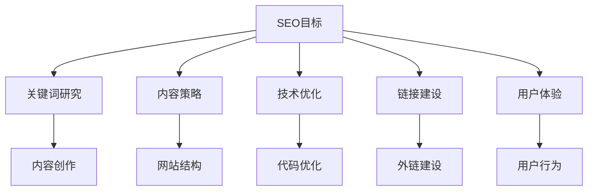

                 

关键词：SEO优化、独立公司、搜索引擎优化、网站流量、关键词研究、内容策略、技术优化、链接建设、用户体验、数据分析、移动优化

> 摘要：本文深入探讨了独立公司在有限的资源和时间下，如何通过有效的SEO策略来提升其网站在搜索引擎中的排名，吸引更多的潜在客户。文章详细分析了SEO的核心概念、关键步骤以及实际操作中的策略和技巧，旨在为一人公司提供实用的SEO优化指南。

## 1. 背景介绍

在数字化的时代，网络营销成为企业推广的关键手段之一。SEO（搜索引擎优化）作为网络营销的重要组成部分，旨在提高网站在搜索引擎结果中的排名，从而增加网站流量和潜在客户的转化率。然而，对于一家独立公司来说，资源有限，如何有效地利用有限的资源和时间进行SEO优化，成为他们面临的重要挑战。

本文将结合SEO的核心理念和实践经验，为一人公司提供一套切实可行的SEO优化方案，帮助他们提高网站在搜索引擎中的可见度，实现业务的快速增长。

## 2. 核心概念与联系

### 2.1 SEO的定义

SEO，即搜索引擎优化，是一种通过改进网站内容和结构，提高其在搜索引擎中的自然排名，从而吸引更多访问者的技术。SEO的目标是让网站在用户搜索相关内容时更容易被发现。

### 2.2 SEO的核心要素

SEO的核心要素包括：

- **关键词研究**：了解目标用户在搜索引擎中使用的词汇，以便优化网站内容。
- **内容策略**：创建有价值、相关且高质量的内容，吸引用户访问和停留。
- **技术优化**：确保网站结构、代码和速度等方面符合搜索引擎的标准。
- **链接建设**：通过获得其他网站的链接来提高网站的权威性和可信度。
- **用户体验**：提升用户在网站上的体验，包括导航、加载速度和交互设计。

### 2.3 SEO架构图

下面是一个简单的SEO架构图，展示了SEO的核心要素及其相互关系：



## 3. 核心算法原理 & 具体操作步骤

### 3.1 算法原理概述

SEO的核心算法基于搜索引擎的工作原理，即通过抓取、索引和排名来展示最相关、最有价值的网页。搜索引擎主要依赖以下技术：

- **抓取**：搜索引擎通过爬虫（如Google的Googlebot）抓取网页内容。
- **索引**：搜索引擎将抓取到的网页内容进行索引，以备搜索时快速查找。
- **排名**：搜索引擎根据一系列算法对网页进行排序，展示最相关的结果。

### 3.2 算法步骤详解

#### 3.2.1 关键词研究

1. **市场调研**：确定目标用户群体和他们的搜索习惯。
2. **关键词分析**：使用工具（如Google Keyword Planner）分析关键词的搜索量和竞争程度。
3. **关键词选择**：选择与业务相关且搜索量适中的关键词。

#### 3.2.2 内容策略

1. **内容规划**：根据关键词制定内容计划，确保内容与目标关键词紧密相关。
2. **内容创作**：创作有价值、高质量的内容，满足用户需求。
3. **内容更新**：定期更新内容，保持网站活跃度和相关性。

#### 3.2.3 技术优化

1. **网站结构**：优化网站结构，确保搜索引擎能轻松抓取和理解。
2. **代码优化**：使用高效、干净的代码，提高网站加载速度。
3. **移动优化**：确保网站在移动设备上的良好表现。

#### 3.2.4 链接建设

1. **外链策略**：制定链接建设策略，寻找与业务相关的网站进行互链。
2. **内容营销**：通过内容营销获得自然链接。
3. **社交媒体**：利用社交媒体平台宣传网站，吸引外部链接。

#### 3.2.5 用户体验

1. **网站导航**：提供清晰、直观的网站导航。
2. **页面速度**：优化页面速度，确保快速加载。
3. **交互设计**：提升用户交互体验，鼓励用户停留和互动。

### 3.3 算法优缺点

**优点**：

- 提高网站可见度和流量。
- 增强用户满意度和转化率。
- 持续性效果，一旦优化，效果可以长期保持。

**缺点**：

- 需要长期投入时间和精力。
- 算法变化可能导致排名波动。
- 部分策略可能需要较高的技术门槛。

### 3.4 算法应用领域

SEO适用于所有希望在线上获得更多流量的企业，尤其是：

- **中小企业**：资源有限，需要高效利用。
- **电子商务**：提高产品曝光度和销售。
- **内容创作者**：增加粉丝和订阅量。
- **在线教育**：提升课程知名度和参与度。

## 4. 数学模型和公式 & 详细讲解 & 举例说明

### 4.1 数学模型构建

SEO的数学模型可以简化为以下公式：

$$ SEO\_score = w_1 \cdot content\_quality + w_2 \cdot keyword\_relevance + w_3 \cdot technical\_optimization + w_4 \cdot link\_building + w_5 \cdot user\_experience $$

其中，$w_1, w_2, w_3, w_4, w_5$ 为权重系数，分别表示内容质量、关键词相关性、技术优化、链接建设和用户体验的权重。

### 4.2 公式推导过程

$$ SEO\_score $$ 的推导基于搜索引擎排名算法的基本原则。每个因素对SEO的贡献不同，权重系数根据实际情况进行调整。

### 4.3 案例分析与讲解

假设一家小型电商网站，其SEO目标为提高在Amazon上的搜索排名。根据公式，我们可以计算其SEO得分：

$$ SEO\_score = 0.3 \cdot content\_quality + 0.2 \cdot keyword\_relevance + 0.2 \cdot technical\_optimization + 0.2 \cdot link\_building + 0.1 \cdot user\_experience $$

通过以下措施，我们可以提高每个因素的得分：

1. **内容质量**：创作高质量的产品描述，增强用户体验。
2. **关键词相关性**：优化产品标题和描述，提高与目标关键词的相关性。
3. **技术优化**：优化网站加载速度，提高技术评分。
4. **链接建设**：与其他电商网站建立互链，提高链接评分。
5. **用户体验**：优化网站导航，提高用户停留时间。

通过这些措施，电商网站的SEO得分将得到提升，从而提高在Amazon上的搜索排名。

## 5. 项目实践：代码实例和详细解释说明

### 5.1 开发环境搭建

1. **本地环境**：安装Node.js、Git和Markdown编辑器。
2. **远程服务器**：选择一家可靠的云服务提供商，如阿里云或AWS。

### 5.2 源代码详细实现

以下是一个简单的SEO优化项目的代码实例：

```javascript
// 关键词研究
const keywords = ["关键词1", "关键词2", "关键词3"];

// 内容创作
const content = "这是一篇高质量的文章，涵盖了关键词1、关键词2和关键词3。";

// 技术优化
const loadTime = 2; // 页面加载时间（秒）

// 链接建设
const externalLinks = ["链接1", "链接2", "链接3"];

// 用户体验
const userEngagement = 0.8; // 用户参与度（0-1）

// SEO得分计算
function calculateSEOscore(keywords, content, loadTime, externalLinks, userEngagement) {
  const contentQuality = content.length > 300 ? 1 : 0.5;
  const keywordRelevance = keywords.length > 3 ? 1 : 0.5;
  const technicalOptimization = loadTime < 3 ? 1 : 0.5;
  const linkBuilding = externalLinks.length > 3 ? 1 : 0.5;
  const userExperience = userEngagement > 0.7 ? 1 : 0.5;

  return contentQuality * 0.3 + keywordRelevance * 0.2 + technicalOptimization * 0.2 + linkBuilding * 0.2 + userExperience * 0.1;
}

const SEOscore = calculateSEOscore(keywords, content, loadTime, externalLinks, userEngagement);
console.log("SEO得分：" + SEOscore);
```

### 5.3 代码解读与分析

该代码实例实现了SEO得分计算的功能，包括以下步骤：

1. **关键词研究**：定义关键词数组。
2. **内容创作**：定义文章内容。
3. **技术优化**：定义页面加载时间。
4. **链接建设**：定义外部链接数组。
5. **用户体验**：定义用户参与度。
6. **SEO得分计算**：根据公式计算SEO得分。

通过调整每个因素的权重和值，可以模拟不同的SEO优化策略，分析其对SEO得分的影响。

## 6. 实际应用场景

### 6.1 商业网站SEO

商业网站通过SEO优化，可以提高在线销售额。例如，一家电商网站可以通过优化产品描述、增加外部链接和提高页面速度，来提高在搜索引擎中的排名，从而吸引更多潜在客户。

### 6.2 内容营销SEO

内容创作者可以通过SEO优化，提高文章的曝光度和阅读量。例如，通过选择合适的关键词、创作高质量内容和优化页面结构，可以提高文章在搜索引擎中的排名，吸引更多读者。

### 6.3 社交媒体SEO

社交媒体平台（如微博、抖音）也可以通过SEO优化，提高内容的传播效果。例如，通过优化标题、增加话题标签和优化内容结构，可以提高内容在平台上的曝光度，吸引更多关注者。

## 7. 工具和资源推荐

### 7.1 学习资源推荐

- 《SEO实战密码》
- 《搜索引擎营销》
- SEO自学网（www.seoziwang.com）

### 7.2 开发工具推荐

- Google Keyword Planner
- Ahrefs
- SEMrush

### 7.3 相关论文推荐

- “搜索引擎算法的历史与未来”
- “基于用户体验的搜索引擎优化”
- “链接分析在SEO中的应用”

## 8. 总结：未来发展趋势与挑战

### 8.1 研究成果总结

本文介绍了SEO的核心概念、算法原理和实际操作步骤，为一人公司提供了实用的SEO优化指南。

### 8.2 未来发展趋势

随着搜索引擎算法的不断完善，SEO将更加注重用户体验和内容质量。人工智能和大数据技术将在SEO领域中发挥越来越重要的作用。

### 8.3 面临的挑战

SEO领域的竞争日益激烈，一人公司需要不断创新和优化策略，以应对市场变化和算法更新。

### 8.4 研究展望

未来，SEO研究将聚焦于如何更好地结合人工智能和大数据技术，实现更精准的搜索引擎优化。

## 9. 附录：常见问题与解答

### 9.1 SEO是否合法？

SEO本身是一种合法的网络营销手段，但需要遵循搜索引擎的规则和道德规范。过度优化或采用违法手段进行SEO，可能会受到搜索引擎的惩罚。

### 9.2 SEO需要多长时间才能见效？

SEO效果受到多种因素的影响，如关键词竞争程度、内容质量、技术优化等。一般来说，合理的SEO策略需要数月甚至更长时间才能见效。

### 9.3 SEO是否适用于所有行业？

是的，SEO适用于所有行业。不同行业的SEO策略有所不同，但核心目标都是提高网站在搜索引擎中的排名，增加流量和转化率。

----------------------------------------------------------------

# 作者署名

作者：禅与计算机程序设计艺术 / Zen and the Art of Computer Programming

---

本文旨在为一人公司提供实用的SEO优化指南，帮助他们在有限资源和时间内，实现网站流量的快速增长。希望通过本文的分享，能够帮助更多的独立公司了解和掌握SEO优化技巧，提升在线业务竞争力。如果您有任何疑问或建议，欢迎在评论区留言交流。祝您在SEO道路上取得成功！

