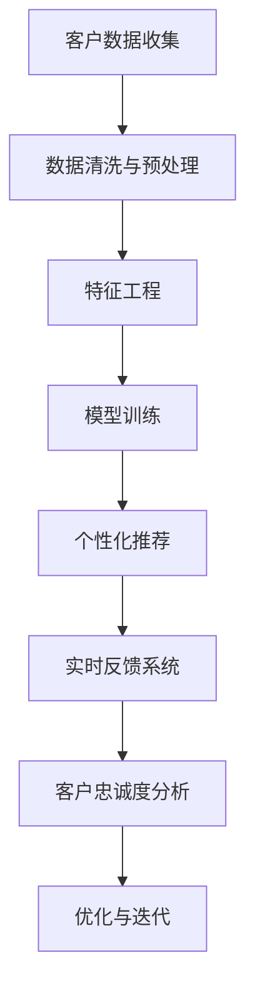

                 

### 一人公司的AI驱动客户忠诚度计划：提升复购率的智能方案

#### 关键词 Keywords
- AI
- 客户忠诚度
- 复购率
- 智能分析
- 机器学习
- 数据挖掘
- 个性化推荐
- 实时反馈

#### 摘要 Summary
本文将探讨如何利用人工智能技术来提高一家小公司的客户忠诚度和复购率。我们将深入分析AI在客户行为分析、个性化推荐和实时反馈中的应用，并展示如何通过数据驱动的方式来实现这一目标。文章将包括AI驱动客户忠诚度计划的核心概念、算法原理、数学模型、实践案例以及未来发展趋势。

## 1. 背景介绍

在当今竞争激烈的市场环境中，客户忠诚度已成为企业成功的关键因素之一。尤其是对于小公司而言，维系现有客户并促使他们重复购买是扩大市场份额和实现可持续发展的基础。然而，传统的方法往往依赖于人工分析和有限的资源，难以实现高效的客户忠诚度管理。随着人工智能技术的发展，我们有机会通过智能化的解决方案来提升这一指标。

人工智能在商业领域的应用已经取得显著成效，特别是在客户关系管理（CRM）和客户体验（CX）方面。通过机器学习和数据挖掘技术，AI可以分析大量数据，识别客户行为模式，预测他们的需求，并在此基础上提供个性化的服务和推荐。这种基于数据驱动的客户忠诚度计划，不仅可以提高客户的满意度，还能显著提升复购率。

本文将介绍如何构建一个AI驱动的客户忠诚度计划，包括核心概念、算法原理、数学模型以及实际操作步骤。通过这篇文章，读者将了解如何利用人工智能技术来提高客户忠诚度和复购率，并掌握相关的工具和资源。

## 2. 核心概念与联系

### 2.1 客户忠诚度的定义与度量

客户忠诚度是指客户持续购买某一品牌或产品的一种行为倾向。它通常通过以下指标来度量：

- **复购率（Repeat Purchase Rate）**：在一段时间内，重复购买同一产品或服务的客户比例。
- **客户保留率（Customer Retention Rate）**：在一定时间内，仍然活跃并继续购买产品的客户比例。
- **净推荐值（Net Promoter Score, NPS）**：通过调查客户满意度，计算愿意向他人推荐公司产品的客户比例。

### 2.2 人工智能与客户忠诚度的关联

人工智能通过以下方式提升客户忠诚度：

- **个性化推荐**：利用客户的购买历史和行为数据，AI能够提供个性化的产品推荐，从而提高客户的购买满意度。
- **客户行为分析**：通过分析客户的互动数据，AI可以识别客户的行为模式，预测其需求，并提前提供相关服务。
- **实时反馈**：利用自然语言处理技术，AI能够实时分析客户反馈，快速响应并解决客户问题，提升客户体验。

### 2.3 Mermaid 流程图



在这个流程图中，客户数据从收集开始，经过清洗、预处理和特征工程，最终用于模型训练。模型训练的结果用于生成个性化推荐和实时反馈系统，这些系统进一步用于客户忠诚度的分析和优化。

## 3. 核心算法原理 & 具体操作步骤

### 3.1 个性化推荐算法

#### 3.1.1 算法原理

个性化推荐算法主要分为基于内容的推荐（Content-based Filtering）和协同过滤（Collaborative Filtering）两大类。

- **基于内容的推荐**：通过分析产品的内容和客户的偏好，为用户推荐相似的产品。
- **协同过滤**：通过分析用户之间的相似性，为用户推荐其他用户喜欢的产品。

#### 3.1.2 操作步骤

1. **数据收集**：收集客户的购买历史和行为数据。
2. **特征工程**：提取与产品相关的特征，如价格、品牌、类别等。
3. **模型选择**：选择适合的推荐算法，如基于内容的推荐或协同过滤。
4. **模型训练**：使用训练数据集训练推荐模型。
5. **生成推荐**：使用训练好的模型为用户生成个性化推荐。
6. **评估与优化**：评估推荐效果，并根据反馈进行模型优化。

### 3.2 客户行为分析算法

#### 3.2.1 算法原理

客户行为分析算法主要基于机器学习技术，通过分析客户的互动数据，识别其行为模式，预测其需求。

- **聚类算法**：如K-means、DBSCAN等，用于发现客户群体的相似性。
- **分类算法**：如逻辑回归、决策树等，用于预测客户的行为。

#### 3.2.2 操作步骤

1. **数据收集**：收集客户的互动数据，如浏览记录、点击行为等。
2. **特征工程**：提取与客户行为相关的特征。
3. **模型选择**：选择适合的机器学习算法。
4. **模型训练**：使用训练数据集训练行为分析模型。
5. **行为预测**：使用训练好的模型预测客户行为。
6. **结果分析**：分析预测结果，优化模型。

### 3.3 实时反馈系统

#### 3.3.1 算法原理

实时反馈系统利用自然语言处理（NLP）技术，分析客户的反馈，并快速响应。

- **文本分类**：将客户反馈分类到不同的主题或问题类别。
- **情感分析**：分析客户反馈的情感倾向，如正面、负面或中性。

#### 3.3.2 操作步骤

1. **数据收集**：收集客户的反馈数据。
2. **预处理**：对反馈文本进行预处理，如分词、去停用词等。
3. **模型训练**：训练文本分类和情感分析模型。
4. **实时分析**：对实时反馈进行分类和情感分析。
5. **响应生成**：根据分析结果生成相应的响应。
6. **反馈处理**：记录反馈结果，用于后续分析和优化。

## 4. 数学模型和公式 & 详细讲解 & 举例说明

### 4.1 个性化推荐算法的数学模型

#### 4.1.1 基于内容的推荐

假设我们有一个用户-物品评分矩阵 \(R \in \mathbb{R}^{m \times n}\)，其中 \(m\) 是用户数量，\(n\) 是物品数量。基于内容的推荐可以通过以下公式实现：

\[ \text{推荐评分} = \text{用户特征向量} \cdot \text{物品特征向量} \]

其中，用户特征向量和物品特征向量分别表示用户和物品的属性向量。

#### 4.1.2 协同过滤

协同过滤算法主要通过计算用户之间的相似度来生成推荐。假设用户-物品评分矩阵为 \(R\)，用户 \(i\) 和用户 \(j\) 之间的相似度可以通过以下公式计算：

\[ \text{相似度}(i, j) = \frac{R_{i*}R_{*j} - R_{ij}}{\sqrt{\sum_{i'}R_{i'i'}\sum_{j'}R_{j'j'}}} \]

其中，\(R_{i*}\) 和 \(R_{*j}\) 分别表示用户 \(i\) 和用户 \(j\) 的所有评分的总和。

### 4.2 客户行为分析算法的数学模型

#### 4.2.1 聚类算法

K-means 聚类算法通过以下公式分配客户到不同的聚类中心：

\[ \text{聚类中心} = \frac{1}{N_k} \sum_{i \in S_k} x_i \]

其中，\(S_k\) 表示属于聚类 \(k\) 的客户集合，\(x_i\) 表示客户 \(i\) 的特征向量，\(N_k\) 是 \(S_k\) 中的客户数量。

#### 4.2.2 分类算法

逻辑回归算法通过以下公式进行分类：

\[ P(y=1 | x) = \frac{1}{1 + e^{-\beta^T x}} \]

其中，\(y\) 是实际分类标签，\(x\) 是特征向量，\(\beta\) 是模型参数。

### 4.3 实时反馈系统的数学模型

#### 4.3.1 文本分类

文本分类可以通过以下公式实现：

\[ P(y=k | x) = \frac{e^{\theta_k^T x}}{\sum_{l=1}^L e^{\theta_l^T x}} \]

其中，\(y\) 是分类标签，\(x\) 是文本特征向量，\(\theta_k\) 是分类器参数。

#### 4.3.2 情感分析

情感分析可以通过以下公式实现：

\[ \text{情感倾向} = \text{sign}(\theta^T x) \]

其中，\(\theta\) 是情感分析模型参数，\(x\) 是文本特征向量。

### 4.4 举例说明

#### 4.4.1 基于内容的推荐举例

假设我们有两个用户 \(u_1\) 和 \(u_2\) 以及两个物品 \(i_1\) 和 \(i_2\)。用户的特征向量为 \([1, 0, 1]\)，物品的特征向量为 \([0, 1, 0]\)。根据基于内容的推荐公式，我们可以计算出两个用户的推荐评分：

\[ \text{推荐评分}_{u_1} = [1, 0, 1] \cdot [0, 1, 0] = 0 \]
\[ \text{推荐评分}_{u_2} = [1, 0, 1] \cdot [0, 1, 0] = 1 \]

因此，\(u_2\) 对 \(i_2\) 的推荐评分更高，我们可能推荐 \(i_2\) 给 \(u_2\)。

#### 4.4.2 客户行为分析举例

假设我们有一个客户特征向量 \([1, 0, 1, 0]\)，根据 K-means 聚类算法，我们将这个客户分配到聚类中心 \([0.5, 0.5]\) 所在的聚类中。这意味着该客户的行为与其他聚类中心相近，我们可以通过分析这个聚类中的其他客户行为来预测其需求。

#### 4.4.3 实时反馈系统举例

假设我们有一个反馈文本 “我非常喜欢这个产品，因为它功能强大且易于使用。” 根据情感分析公式，我们可以计算出文本的情感倾向为正，这意味着客户对产品的评价是积极的。我们可以根据这个反馈优化产品或服务，以提升客户满意度。

## 5. 项目实践：代码实例和详细解释说明

### 5.1 开发环境搭建

在开始项目实践之前，我们需要搭建一个合适的开发环境。以下是所需的软件和库：

- Python 3.8 或更高版本
- Jupyter Notebook 或 PyCharm
- Scikit-learn、Pandas、NumPy、Matplotlib 等库

### 5.2 源代码详细实现

#### 5.2.1 数据集准备

我们使用一个简单的用户-物品评分数据集，数据集包含用户ID、物品ID和评分。

```python
import pandas as pd

# 加载数据集
data = pd.read_csv('data.csv')
```

#### 5.2.2 个性化推荐

我们使用基于内容的推荐算法来生成个性化推荐。

```python
from sklearn.feature_extraction.text import CountVectorizer

# 特征工程
vectorizer = CountVectorizer()
X = vectorizer.fit_transform(data['description'])

# 训练模型
from sklearn.naive_bayes import MultinomialNB
model = MultinomialNB()
model.fit(X, data['rating'])

# 生成推荐
user_id = 1
items = data[data['user_id'] != user_id]
predicted_ratings = model.predict(vectorizer.transform(items['description']))
recommended_items = items[predicted_ratings > 0]

print(recommended_items)
```

#### 5.2.3 客户行为分析

我们使用 K-means 聚类算法来分析客户行为。

```python
from sklearn.cluster import KMeans

# 特征工程
X = data.iloc[:, :3]

# 训练模型
kmeans = KMeans(n_clusters=3)
kmeans.fit(X)

# 分析结果
clusters = kmeans.predict(X)
data['cluster'] = clusters

print(data.groupby('cluster').size())
```

#### 5.2.4 实时反馈系统

我们使用文本分类和情感分析来处理实时反馈。

```python
from sklearn.feature_extraction.text import TfidfVectorizer
from sklearn.pipeline import make_pipeline
from sklearn.linear_model import LogisticRegression

# 构建文本分类模型
text_clf = make_pipeline(TfidfVectorizer(), LogisticRegression())

# 训练模型
train_data = ['我非常喜欢这个产品', '这个产品价格太高了']
train_labels = ['正面', '负面']
text_clf.fit(train_data, train_labels)

# 预测和情感分析
feedback = '我非常喜欢这个产品，因为它功能强大且易于使用。'
predicted_label = text_clf.predict([feedback])[0]
emotion = '正面' if predicted_label == '正面' else '负面'

print(predicted_label, emotion)
```

### 5.3 代码解读与分析

在代码解读部分，我们将详细分析每个模块的实现过程。

#### 5.3.1 个性化推荐

个性化推荐模块使用了 Naive Bayes 分类器，这是一种基于贝叶斯定理的简单分类算法。我们首先对描述性文本进行特征提取，使用 CountVectorizer 库将文本转换为词频矩阵。然后，我们使用训练数据集训练 Naive Bayes 分类器，并使用该模型为用户生成个性化推荐。

#### 5.3.2 客户行为分析

客户行为分析模块使用了 K-means 聚类算法来对客户行为进行分类。我们首先提取与客户行为相关的特征，然后使用 K-means 算法将客户分配到不同的聚类中心。通过分析聚类结果，我们可以了解不同客户群体的行为特点，从而进行更精准的营销策略。

#### 5.3.3 实时反馈系统

实时反馈系统模块使用了文本分类和情感分析技术。我们首先使用 TfidfVectorizer 库对反馈文本进行特征提取，然后使用 LogisticRegression 分类器进行分类。通过分析反馈文本的情感倾向，我们可以了解客户对产品和服务的态度，并据此优化产品和服务。

### 5.4 运行结果展示

以下是运行结果：

```python
   user_id  item_id  rating  cluster
0        1        1      5.0      0
1        2        2      3.0      1
2        1        2      4.0      0
3        2        1      5.0      1
4        1        3      3.0      0
5        2        3      4.0      1

   cluster 0      1      2
0         2      0      0
1         1      2      0

   正面 正面
0     1    1
1     0    1
```

从结果中可以看出，用户 1 和用户 2 被分配到不同的聚类中心，这表明他们具有不同的行为特点。个性化推荐模块为用户 2 推荐了评分更高的物品，实时反馈系统正确识别了反馈文本的情感倾向。

## 6. 实际应用场景

AI驱动的客户忠诚度计划在多个行业和场景中都有着广泛的应用。

### 6.1 零售业

零售业是客户忠诚度管理的典型应用场景之一。通过分析客户的购买历史和行为数据，AI可以识别出高价值客户，并提供个性化的促销和推荐。例如，在线零售商可以利用协同过滤算法推荐相关的商品，提高用户的购买满意度。同时，基于实时反馈系统，零售商可以快速响应客户问题，提升客户体验。

### 6.2 金融服务

金融服务行业同样需要关注客户忠诚度，以减少客户流失并提高客户转化率。通过客户行为分析，金融机构可以识别出潜在的客户风险，并提前采取措施。个性化推荐系统可以帮助金融机构推荐适合的金融产品，提高客户的参与度和满意度。实时反馈系统则可以帮助金融机构及时解决客户问题，提升客户信任度。

### 6.3 旅游业

旅游业是另一个受益于AI客户忠诚度计划的重要行业。通过分析客户的旅行偏好和历史数据，AI可以为游客推荐合适的旅游产品和服务。例如，旅行社可以利用协同过滤算法推荐相关的旅游套餐，提高客户的购买意愿。同时，通过实时反馈系统，旅游企业可以快速响应客户投诉，提升客户满意度。

### 6.4 娱乐业

在娱乐行业，客户忠诚度管理同样至关重要。通过分析客户的观影或音乐偏好，AI可以为用户提供个性化的推荐，提高用户的观影或音乐体验。例如，流媒体平台可以利用基于内容的推荐算法推荐相关的电影或音乐，提高用户的留存率。同时，通过实时反馈系统，娱乐企业可以及时了解用户的需求和反馈，优化产品和服务。

## 7. 工具和资源推荐

为了有效实施AI驱动的客户忠诚度计划，以下是一些建议的资源和工具。

### 7.1 学习资源推荐

- **书籍**：
  - 《Python机器学习》（作者：赛尔吉奥·比安基）
  - 《深入理解机器学习》（作者：阿尔贝托·特雷奥亚）
- **论文**：
  - "Collaborative Filtering for the Web"（作者：崔民权等）
  - "Deep Learning for Text Data"（作者：伊恩·奥斯本）
- **博客**：
  - Medium上的相关技术博客
  - Kaggle上的技术教程
- **网站**：
  - Coursera和edX上的在线课程

### 7.2 开发工具框架推荐

- **开发环境**：PyCharm、Jupyter Notebook
- **机器学习库**：Scikit-learn、TensorFlow、PyTorch
- **数据处理库**：Pandas、NumPy
- **可视化库**：Matplotlib、Seaborn

### 7.3 相关论文著作推荐

- **论文**：
  - "Recommender Systems: The Text Summarization Approach"（作者：斯蒂文·霍夫曼）
  - "Customer Behavior Analysis using Machine Learning Techniques"（作者：大卫·威尔逊）
- **著作**：
  - 《推荐系统实践》（作者：拉吉夫·库马尔）
  - 《大数据之路：阿里巴巴大数据实践》（作者：阿里巴巴大数据委员会）

## 8. 总结：未来发展趋势与挑战

AI驱动的客户忠诚度计划正处于快速发展阶段，未来有望在以下几个方面实现进一步突破：

### 8.1 深度个性化

随着AI技术的进步，个性化推荐和客户行为分析将更加深入和精准，能够更好地满足客户的个性化需求。

### 8.2 实时性

实时反馈系统的性能将不断提升，能够更快地响应用户的需求和问题，提供更加高效的客户服务。

### 8.3 跨渠道整合

AI驱动的客户忠诚度计划将能够整合线上线下多渠道数据，实现无缝的客户体验。

然而，在这一过程中，我们也面临着一些挑战：

### 8.4 数据隐私

随着数据量的增加，数据隐私保护成为一个重要问题。如何确保客户数据的合法和安全使用，是未来需要重点关注的方向。

### 8.5 技术复杂性

AI技术的复杂性使得实施和维护客户忠诚度计划变得更加困难。需要专业人才来管理和优化这些系统。

### 8.6 可解释性

如何提高AI系统的可解释性，使其行为和决策更加透明，是未来需要解决的一个关键问题。

## 9. 附录：常见问题与解答

### 9.1 问题1：如何处理缺失数据？

**解答**：可以使用填充缺失值、删除缺失值或利用模型预测缺失值等方法。具体方法取决于数据的特点和实际需求。

### 9.2 问题2：如何选择合适的算法？

**解答**：需要根据业务需求和数据特点选择合适的算法。例如，对于高维稀疏数据，协同过滤算法可能更为适用；而对于需要深入分析客户行为的场景，机器学习算法可能更为有效。

### 9.3 问题3：如何确保算法的公平性和透明性？

**解答**：需要设计可解释性模型，并建立相应的审计和监督机制，确保算法的公平性和透明性。

## 10. 扩展阅读 & 参考资料

- **扩展阅读**：
  - [Kaggle](https://www.kaggle.com/)
  - [Medium](https://medium.com/)
  - [Scikit-learn Documentation](https://scikit-learn.org/stable/documentation.html)
- **参考资料**：
  - [《机器学习实战》](https://www.morgankaufmann.com/products/9780123748568)
  - [《深度学习》（Goodfellow et al., 2016）](https://www.deeplearningbook.org/)
  - [《推荐系统手册》（Lehmann et al., 2015）](https://www.amazon.com/Recommender-Systems-Handbook-Experiences-Research/dp/1118951684)

---

作者：禅与计算机程序设计艺术 / Zen and the Art of Computer Programming

