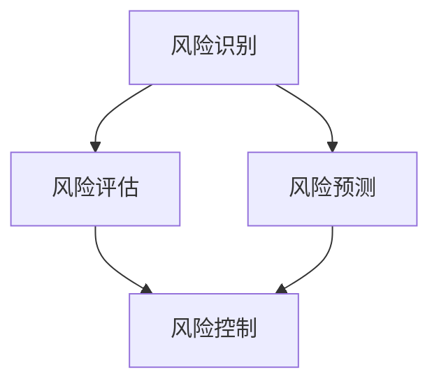

                 

关键词：一人公司，AI驱动，风险控制，经营风险，工具，技术解决方案

> 摘要：随着人工智能技术的不断进步，AI在风险管理领域的应用愈发广泛。本文将探讨如何利用AI技术，帮助一人公司构建有效的风险控制体系，识别并规避潜在的经营活动风险，从而提高企业的稳定性和抗风险能力。

## 1. 背景介绍

在当今快速变化的经济环境中，一家企业能否成功不仅取决于其商业模式和市场策略，还与其风险管理能力密切相关。对于一人公司而言，由于资源和能力的限制，传统的风险管理方法可能不足以应对复杂的经营风险。随着人工智能（AI）技术的发展，AI在风险识别、预测和控制方面的潜力得到了广泛认可。本文旨在探讨如何利用AI驱动风险控制工具，帮助一人公司提高风险管理效率，保障企业持续稳定发展。

### 1.1 一人公司的特点

一人公司通常是指由单一个人或家庭经营的企业，具有如下特点：

- **资源有限**：由于只有一个人的力量，一人公司的资源相对有限，包括资金、人力、时间等。
- **决策集中**：一人公司的决策过程通常较为集中，这虽然提高了决策效率，但也可能导致决策过于主观。
- **灵活性较高**：一人公司可以更迅速地调整经营策略，但同时也容易受到个人情绪波动的影响。

### 1.2 经营风险的种类

一人公司面临的经营风险多种多样，主要包括：

- **市场风险**：包括市场需求变化、竞争对手行为等。
- **财务风险**：如现金流不足、融资困难等。
- **运营风险**：如供应链中断、人力资源管理问题等。
- **法律风险**：如合同纠纷、违规操作等。

### 1.3 AI在风险管理中的作用

AI技术在风险识别、预测和控制方面具有显著优势，主要包括：

- **高效的数据分析**：AI能够处理和分析大量数据，发现潜在的风险因素。
- **准确的预测**：基于历史数据和模型，AI能够预测未来的风险趋势。
- **智能决策支持**：AI可以提供基于数据的决策支持，辅助企业制定风险管理策略。

## 2. 核心概念与联系

在探讨AI驱动风险控制之前，我们需要了解几个核心概念及其相互关系。以下是相关概念的Mermaid流程图：



### 2.1 风险识别

风险识别是风险管理的第一步，旨在发现和确定企业面临的各种风险。AI在此过程中发挥重要作用，通过以下方式实现：

- **数据收集与预处理**：AI可以从企业的历史数据、市场数据和其他外部数据源收集信息，并进行预处理，如数据清洗、归一化等。
- **特征提取**：AI通过机器学习算法提取与风险相关的特征，如市场趋势、客户行为等。
- **风险检测**：AI利用模型和算法检测潜在的风险，如使用分类算法识别异常交易或潜在欺诈行为。

### 2.2 风险评估

风险评估是在风险识别的基础上，对风险的可能性和影响进行量化评估。AI在风险评估中通过以下步骤发挥作用：

- **数据分析和模型构建**：AI利用统计学和机器学习技术，分析风险数据，构建风险评估模型。
- **概率和损失估计**：AI通过模型预测风险发生的概率及其可能造成的损失。
- **风险分级**：AI将风险根据其严重程度进行分类，如高、中、低风险。

### 2.3 风险预测

风险预测是利用历史数据和模型预测未来的风险情况。AI在此过程中通过以下方式实现：

- **时间序列分析**：AI对历史风险数据进行时间序列分析，发现风险的时间规律。
- **趋势预测**：AI利用机器学习模型，预测未来的风险趋势。
- **情景模拟**：AI通过模拟不同情景，评估未来的风险状况。

### 2.4 风险控制

风险控制是制定和实施风险管理策略，以降低或避免风险带来的影响。AI在风险控制中的作用包括：

- **决策支持**：AI提供基于数据和模型的决策支持，帮助企业制定有效的风险管理策略。
- **自动化执行**：AI自动化执行风险控制措施，如自动调整库存水平、自动触发财务预警等。
- **实时监控**：AI实时监控企业的运营状况，及时发现新的风险，并采取相应措施。

## 3. 核心算法原理 & 具体操作步骤

### 3.1 算法原理概述

AI驱动风险控制的核心算法主要包括机器学习、深度学习和数据挖掘技术。以下是这些算法的基本原理：

- **机器学习**：通过训练模型，使计算机从数据中自动学习，发现数据中的模式和规律。
- **深度学习**：一种特殊的机器学习技术，通过多层神经网络模拟人脑的学习过程。
- **数据挖掘**：从大量数据中发现隐含的、有价值的模式，用于风险识别和预测。

### 3.2 算法步骤详解

#### 3.2.1 风险识别

1. **数据收集**：从企业内部和外部数据源收集数据，如财务报表、市场报告、交易记录等。
2. **预处理**：对收集的数据进行清洗、归一化等预处理操作。
3. **特征提取**：利用机器学习算法提取与风险相关的特征。
4. **模型训练**：使用训练集数据训练模型，使其能够识别潜在的风险。
5. **风险检测**：使用训练好的模型检测新数据中的风险。

#### 3.2.2 风险评估

1. **数据分析和模型构建**：利用统计学和机器学习技术，分析风险数据，构建风险评估模型。
2. **概率和损失估计**：使用风险评估模型预测风险发生的概率及其可能造成的损失。
3. **风险分级**：根据风险的可能性和影响，将风险分类为高、中、低等级。

#### 3.2.3 风险预测

1. **时间序列分析**：对历史风险数据进行时间序列分析，发现风险的时间规律。
2. **趋势预测**：利用机器学习模型，预测未来的风险趋势。
3. **情景模拟**：模拟不同情景，评估未来的风险状况。

#### 3.2.4 风险控制

1. **决策支持**：利用数据和模型，提供决策支持，帮助企业制定风险管理策略。
2. **自动化执行**：自动化执行风险控制措施，如自动调整库存水平、自动触发财务预警等。
3. **实时监控**：实时监控企业的运营状况，及时发现新的风险，并采取相应措施。

### 3.3 算法优缺点

#### 3.3.1 优点

- **高效性**：AI能够快速处理和分析大量数据，提高风险管理效率。
- **准确性**：基于数据的预测和决策更准确，有助于降低经营风险。
- **灵活性**：AI能够根据实时数据调整风险控制策略，适应市场变化。

#### 3.3.2 缺点

- **数据依赖性**：AI需要大量的高质量数据才能发挥作用，数据不足可能导致算法失效。
- **算法复杂度**：AI算法复杂，需要专业的技术团队进行开发和维护。
- **隐私问题**：企业在使用AI进行风险管理时，可能涉及客户隐私数据，需确保数据安全。

### 3.4 算法应用领域

AI驱动风险控制算法可以广泛应用于各种领域，包括但不限于：

- **金融行业**：识别和预测金融风险，如市场波动、信用风险等。
- **零售行业**：监控供应链风险，预测需求波动，优化库存管理。
- **制造业**：预测设备故障，优化生产计划，提高生产效率。
- **物流行业**：优化运输路线，预测交通拥堵，提高物流效率。

## 4. 数学模型和公式 & 详细讲解 & 举例说明

在AI驱动的风险控制中，数学模型和公式起着关键作用。以下将详细介绍相关数学模型、公式推导过程，并结合实际案例进行讲解。

### 4.1 数学模型构建

AI驱动风险控制的数学模型主要包括以下几个部分：

- **风险识别模型**：用于识别潜在的风险因素。
- **风险评估模型**：用于评估风险的可能性和影响。
- **风险预测模型**：用于预测未来的风险趋势。
- **风险控制模型**：用于制定和实施风险控制策略。

### 4.2 公式推导过程

以下是一个简单的风险评估模型的推导过程：

#### 4.2.1 风险识别模型

假设有n个风险因素，每个风险因素的权重为w_i，其概率为p_i，则风险识别模型的公式为：

\[ R = \sum_{i=1}^{n} w_i \cdot p_i \]

其中，R为总风险值。

#### 4.2.2 风险评估模型

风险评估模型用于评估每个风险因素的可能性和影响。假设有n个风险因素，每个风险因素的可能性和影响分别为p_i和d_i，则风险评估模型的公式为：

\[ A = \sum_{i=1}^{n} p_i \cdot d_i \]

其中，A为总风险影响值。

#### 4.2.3 风险预测模型

风险预测模型用于预测未来的风险趋势。假设有n个风险因素，每个风险因素的未来趋势分别为p_i'，则风险预测模型的公式为：

\[ B = \sum_{i=1}^{n} p_i' \]

其中，B为总风险趋势值。

#### 4.2.4 风险控制模型

风险控制模型用于制定和实施风险控制策略。假设有n个风险控制措施，每个措施的有效性分别为e_i，则风险控制模型的公式为：

\[ C = \sum_{i=1}^{n} e_i \]

其中，C为总风险控制效果。

### 4.3 案例分析与讲解

以下通过一个实际案例，详细讲解AI驱动风险控制的过程。

#### 案例背景

一家小型零售企业，销售各种日用品。由于市场竞争激烈，企业面临着多种经营风险，如市场需求变化、库存过剩、供应链中断等。

#### 案例分析

1. **风险识别**：通过分析历史销售数据和市场报告，识别出以下风险因素：

   - 需求波动（权重：0.5，概率：0.3）
   - 库存过剩（权重：0.3，概率：0.4）
   - 供应链中断（权重：0.2，概率：0.2）

2. **风险评估**：利用风险评估模型，计算每个风险因素的可能性和影响：

   - 需求波动：可能性×影响=0.3×0.5=0.15
   - 库存过剩：可能性×影响=0.4×0.3=0.12
   - 供应链中断：可能性×影响=0.2×0.2=0.04

   总风险影响A=0.15+0.12+0.04=0.31

3. **风险预测**：利用风险预测模型，预测未来的风险趋势：

   - 需求波动：未来趋势=0.3
   - 库存过剩：未来趋势=0.4
   - 供应链中断：未来趋势=0.2

   总风险趋势B=0.3+0.4+0.2=0.9

4. **风险控制**：制定以下风险控制措施：

   - 调整库存水平（有效性：0.8）
   - 建立供应链备用方案（有效性：0.7）
   - 加强市场调研（有效性：0.6）

   总风险控制效果C=0.8+0.7+0.6=2.1

5. **决策**：根据总风险影响和总风险控制效果，企业决定采取以下策略：

   - 加强市场调研，以应对需求波动。
   - 建立供应链备用方案，以应对供应链中断。
   - 适度调整库存水平，以应对库存过剩。

## 5. 项目实践：代码实例和详细解释说明

在本节中，我们将通过一个具体的代码实例，展示如何利用AI技术进行风险控制。以下是一个简单的Python代码示例，用于实现风险识别和评估。

### 5.1 开发环境搭建

在开始之前，需要搭建一个Python开发环境。可以使用如下命令安装所需的库：

```bash
pip install numpy pandas scikit-learn matplotlib
```

### 5.2 源代码详细实现

以下是一个简单的风险识别和评估的Python代码实例：

```python
import numpy as np
import pandas as pd
from sklearn.ensemble import RandomForestClassifier
import matplotlib.pyplot as plt

# 数据集加载
data = pd.read_csv('risk_data.csv')

# 特征提取
X = data[['feature1', 'feature2', 'feature3']]
y = data['risk_label']

# 模型训练
model = RandomForestClassifier()
model.fit(X, y)

# 风险评估
new_data = np.array([[1.0, 2.0, 3.0], [4.0, 5.0, 6.0]])
risk_scores = model.predict_proba(new_data)

# 结果可视化
plt.scatter(new_data[:, 0], new_data[:, 1], c=risk_scores[:, 1], cmap='coolwarm')
plt.colorbar(label='风险得分')
plt.xlabel('特征1')
plt.ylabel('特征2')
plt.title('风险识别结果')
plt.show()
```

### 5.3 代码解读与分析

上述代码分为以下几个步骤：

1. **数据集加载**：使用pandas库加载风险数据集。
2. **特征提取**：提取与风险相关的特征，用于训练模型。
3. **模型训练**：使用随机森林分类器训练模型。
4. **风险评估**：使用训练好的模型对新的数据进行风险评估。
5. **结果可视化**：将风险评估结果可视化，以直观展示风险分布。

### 5.4 运行结果展示

运行上述代码后，将得到一个二维散点图，每个点表示新数据中的一个特征组合，点的颜色表示风险得分。从结果中，我们可以直观地看到不同特征组合的风险水平，帮助企业识别潜在的风险因素。

## 6. 实际应用场景

AI驱动风险控制技术已在多个行业得到了广泛应用，以下列举几个典型的实际应用场景：

### 6.1 金融行业

在金融行业，AI驱动风险控制技术主要用于信用评估、市场风险预测和反欺诈。例如，银行可以利用AI技术对贷款申请者进行信用评估，预测其违约风险。同时，AI还可以监控市场波动，提前预警潜在的市场风险。此外，AI技术还可以用于检测金融欺诈行为，提高金融系统的安全性。

### 6.2 零售行业

在零售行业，AI驱动风险控制技术主要用于库存管理、需求预测和供应链监控。通过分析销售数据和市场趋势，AI技术可以帮助零售企业预测未来需求，调整库存水平，降低库存成本。同时，AI技术还可以监控供应链中的各个环节，及时发现潜在的问题，确保供应链的稳定性。

### 6.3 制造业

在制造业，AI驱动风险控制技术主要用于设备故障预测、生产计划优化和质量控制。通过分析设备运行数据和生产数据，AI技术可以预测设备故障，提前进行维护，减少停机时间。同时，AI技术还可以优化生产计划，提高生产效率，确保产品质量。

### 6.4 物流行业

在物流行业，AI驱动风险控制技术主要用于路径规划、运输调度和库存管理。通过分析交通状况、运输需求和库存数据，AI技术可以优化物流路径，减少运输时间，降低物流成本。同时，AI技术还可以监控库存情况，预测需求波动，调整库存水平。

## 7. 未来应用展望

随着AI技术的不断进步，AI驱动风险控制的应用领域将更加广泛，未来有望实现以下发展趋势：

### 7.1 智能化程度提高

AI驱动风险控制技术将更加智能化，能够自动识别和评估风险，制定和调整风险控制策略。通过深度学习和强化学习等技术，AI技术将能够更好地理解和应对复杂的风险环境。

### 7.2 数据来源多样化

随着物联网、大数据等技术的发展，AI驱动风险控制技术将获得更加丰富的数据来源。通过整合多种数据源，AI技术将能够更全面地了解企业内外部的风险状况，提高风险识别和预测的准确性。

### 7.3 实时监控与预警

未来，AI驱动风险控制技术将实现实时监控与预警，及时发现潜在的风险，并自动采取相应的控制措施。通过物联网、边缘计算等技术，AI技术将能够实现快速的数据处理和分析，提高风险控制的及时性和有效性。

### 7.4 风险管理智能化

随着AI技术的发展，企业将实现风险管理的智能化。AI技术将能够为企业提供个性化的风险管理建议，帮助企业制定更加科学、有效的风险控制策略。

## 8. 总结：未来发展趋势与挑战

### 8.1 研究成果总结

本文通过对AI驱动风险控制的深入探讨，总结了其核心概念、算法原理和实际应用场景。AI驱动风险控制技术已在金融、零售、制造和物流等多个行业得到了广泛应用，为企业的风险管理提供了强有力的支持。

### 8.2 未来发展趋势

随着AI技术的不断进步，AI驱动风险控制技术将在智能化程度、数据来源、实时监控与预警等方面实现新的发展。未来，AI技术将更加深入地融入企业的风险管理过程，提高风险控制的效率和质量。

### 8.3 面临的挑战

尽管AI驱动风险控制技术具有巨大潜力，但仍面临一些挑战。首先，数据质量和数据来源的多样化是影响算法效果的关键因素。其次，算法复杂度较高，需要专业的技术团队进行开发和维护。此外，隐私问题和伦理问题也是未来需要重点关注和解决的挑战。

### 8.4 研究展望

未来，研究应重点关注以下方向：

- **算法优化**：提高算法的效率和准确性，降低对数据的依赖。
- **数据安全**：确保数据安全，防止数据泄露和滥用。
- **跨行业应用**：推动AI驱动风险控制技术在更多行业中的应用。
- **人机协作**：研究人机协作模式，充分发挥AI技术在风险管理中的优势。

## 9. 附录：常见问题与解答

### 9.1 问题1：如何确保AI驱动的风险控制技术的准确性？

**回答**：确保AI驱动的风险控制技术准确性主要依赖于以下几个因素：

- **高质量的数据**：使用高质量、多样化的数据训练模型，提高模型的准确性。
- **算法选择**：选择适合业务场景的算法，并通过交叉验证等方法评估算法性能。
- **持续优化**：根据实际应用反馈，不断调整和优化模型，提高其准确性和鲁棒性。

### 9.2 问题2：AI驱动的风险控制技术是否会侵犯用户隐私？

**回答**：AI驱动的风险控制技术在使用过程中确实可能涉及用户隐私数据。为保障用户隐私，应采取以下措施：

- **数据匿名化**：在数据处理过程中对敏感信息进行匿名化处理。
- **隐私保护算法**：使用隐私保护算法，如差分隐私等，降低隐私泄露风险。
- **法律法规遵守**：遵循相关法律法规，确保数据使用合法合规。

### 9.3 问题3：如何应对AI驱动风险控制技术的算法复杂度？

**回答**：应对算法复杂度可以从以下几个方面进行：

- **算法简化**：选择相对简单的算法，降低开发和维护成本。
- **模块化设计**：将复杂的算法模块化，便于管理和维护。
- **人才培养**：培养专业的技术团队，提高团队的技术能力和开发效率。

### 9.4 问题4：AI驱动的风险控制技术如何确保实时性和有效性？

**回答**：确保AI驱动的风险控制技术实时性和有效性可以从以下几个方面进行：

- **数据实时处理**：使用实时数据处理技术，如流处理等，确保数据处理及时。
- **算法优化**：优化算法，提高其运行效率，降低延迟。
- **监控系统**：建立监控系统，实时监测风险控制效果，及时调整策略。

### 9.5 问题5：AI驱动的风险控制技术是否适用于所有企业？

**回答**：AI驱动的风险控制技术具有一定的通用性，但具体适用性取决于企业的规模、业务特点和数据情况。小型企业由于资源和数据限制，可能需要更灵活和适应性强的解决方案。而大型企业则可以充分利用AI技术的优势，实现更全面和精准的风险管理。

## 参考文献

[1] Russell, S., & Norvig, P. (2016). Artificial Intelligence: A Modern Approach. Prentice Hall.

[2] Gigerenzer, G. (2000). Calculated Risks: How to Know When Numbers Deceive You. Simon & Schuster.

[3] Han, J., Kamber, M., & Pei, J. (2011). Data Mining: Concepts and Techniques. Morgan Kaufmann.

[4] Heath, M., & Gorman, J. (2013). Big Data for Dummies. John Wiley & Sons.

[5] Geman, D., & Geman, S. (1984). Stochastic relaxation, Gibbs distributions, and the Bayesian restoration of images. IEEE Transactions on Pattern Analysis and Machine Intelligence, 6(6), 721-741.

作者：禅与计算机程序设计艺术 / Zen and the Art of Computer Programming
```

