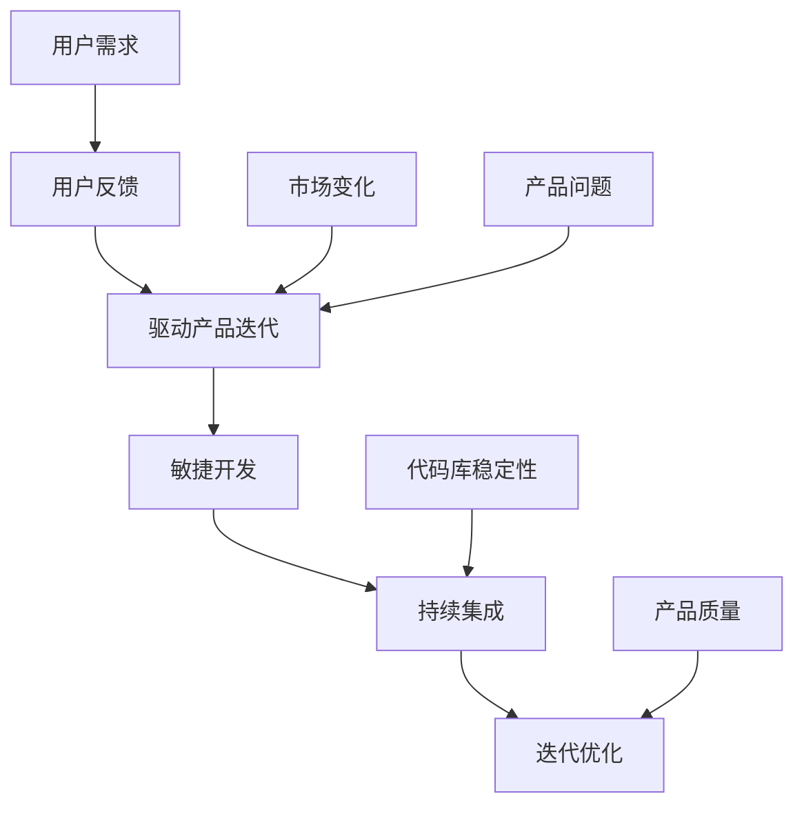

                 

### 背景介绍

在当今这个技术迅速发展的时代，产品迭代的速度已成为企业竞争力的关键因素。尤其是对于小型公司或个人开发者而言，如何在有限资源下实现高效的产品迭代，以迅速响应市场需求和用户反馈，显得尤为重要。本文旨在探讨一人公司的产品迭代策略，通过深入分析用户反馈，为快速改进产品提供一套行之有效的方法。

一人公司的产品迭代策略，既不同于大型企业完善的团队协作模式，也不同于初创公司依靠灵活的团队结构快速试错。对于一人公司来说，每一次产品迭代都考验着开发者的综合素质和决策能力。在资源有限、经验不足的情况下，如何确保产品在短时间内实现高质量迭代，成为摆在一人公司面前的首要问题。

本文将围绕以下问题展开讨论：

1. 一人公司产品迭代中的主要挑战是什么？
2. 用户反馈在产品迭代中的重要性如何？
3. 如何有效地收集和分析用户反馈？
4. 如何根据用户反馈快速调整和优化产品？
5. 一人公司在产品迭代中应遵循哪些原则？

通过以上问题的探讨，我们希望为一人公司的开发者提供一套基于用户反馈的快速改进方法，助力他们在激烈的市场竞争中脱颖而出。

### 核心概念与联系

在探讨一人公司的产品迭代策略之前，有必要首先明确几个核心概念及其相互之间的联系。这些核心概念包括用户反馈、敏捷开发、持续集成、迭代优化等，它们共同构成了产品迭代的基本框架。

#### 用户反馈

用户反馈是产品迭代过程中的关键驱动力。用户在使用产品过程中会提供各种形式的反馈，如意见、建议、评分等。这些反馈是产品开发者了解用户需求、发现产品问题的直接来源。有效的用户反馈能够帮助开发者快速识别产品的优势与不足，从而进行针对性的改进。

#### 敏捷开发

敏捷开发是一种以用户需求为核心的软件开发方法，强调快速迭代、持续交付和灵活应对变化。对于一人公司而言，敏捷开发方法能够帮助开发者高效地管理项目进度，确保产品在短时间内不断优化和改进。

#### 持续集成

持续集成是一种软件开发实践，旨在通过自动化测试和持续部署，确保代码库的稳定性和可靠性。持续集成能够帮助开发者快速发现和修复代码中的错误，从而提高产品的质量。

#### 迭代优化

迭代优化是指通过不断的小幅度改进，逐步提升产品的功能和性能。在产品迭代过程中，开发者需要根据用户反馈和市场变化，不断调整和优化产品，以满足用户需求。

#### Mermaid 流程图

为了更直观地展示这些核心概念之间的联系，我们可以使用 Mermaid 流程图来表示它们之间的关系。



在上面的 Mermaid 流程图中，用户反馈作为产品迭代的驱动因素，通过敏捷开发、持续集成和迭代优化，不断改进产品的功能和性能。同时，市场变化和用户需求也对产品迭代产生重要影响，确保产品始终符合市场需求。

### 核心算法原理 & 具体操作步骤

在明确了一人公司产品迭代的核心概念和联系后，接下来我们将探讨基于用户反馈的快速改进方法，并详细介绍其核心算法原理和具体操作步骤。

#### 算法原理

基于用户反馈的快速改进方法，本质上是一种迭代优化策略。该方法的核心思想是：通过持续收集和分析用户反馈，快速识别产品中的问题和不足，然后针对性地进行调整和优化，从而实现产品的持续改进。

该方法的算法原理主要包括以下三个方面：

1. **数据收集与处理**：收集用户反馈数据，并对数据进行预处理，如去噪、清洗等，确保数据的准确性和完整性。
2. **反馈分析**：利用机器学习算法对用户反馈进行分析，识别出产品中的共性问题、热点问题等。
3. **调整优化**：根据分析结果，针对性地调整和优化产品，如改进功能、修复 bug 等。

#### 操作步骤

下面我们将详细描述基于用户反馈的快速改进方法的操作步骤：

**步骤 1：数据收集**

数据收集是整个方法的基础。一人公司可以通过以下途径收集用户反馈：

- **用户调研**：通过问卷调查、访谈等方式，直接了解用户的需求和意见。
- **社交媒体监控**：监控用户在社交媒体平台上的评论、反馈等信息。
- **产品使用日志**：分析用户在使用产品过程中的行为数据，如页面访问量、操作频率等。

**步骤 2：数据预处理**

收集到的用户反馈数据需要进行预处理，以确保数据的准确性和完整性。预处理过程主要包括以下任务：

- **去噪**：去除噪声数据，如重复的评论、无关的信息等。
- **清洗**：清洗数据中的错误和异常值，如缺失值、异常值等。
- **归一化**：对数据进行归一化处理，如文本长度、评分等。

**步骤 3：反馈分析**

对预处理后的用户反馈数据进行分析，识别出产品中的共性问题、热点问题等。具体步骤如下：

- **文本分类**：使用文本分类算法，将用户反馈分为不同类别，如功能问题、性能问题、用户体验问题等。
- **关键词提取**：提取用户反馈中的关键词，用于分析用户关注的问题。
- **趋势分析**：分析用户反馈的时间分布、频率等，了解问题的严重程度和变化趋势。

**步骤 4：调整优化**

根据反馈分析的结果，针对性地调整和优化产品。具体步骤如下：

- **功能改进**：针对用户反馈中的功能问题，优化和改进产品功能，如增加新功能、改进现有功能等。
- **性能优化**：针对用户反馈中的性能问题，优化产品的性能，如提高响应速度、降低内存占用等。
- **用户体验改进**：针对用户反馈中的用户体验问题，改进产品的界面设计、交互逻辑等，提高用户的满意度。

**步骤 5：持续迭代**

基于用户反馈的快速改进方法是一个持续迭代的过程。在完成一次迭代后，需要再次收集用户反馈，重复上述步骤，不断优化产品。

通过以上步骤，一人公司可以快速识别和解决产品中的问题，持续提高产品的质量和用户满意度。

### 数学模型和公式 & 详细讲解 & 举例说明

在基于用户反馈的快速改进方法中，数学模型和公式扮演着至关重要的角色。它们帮助开发者量化用户反馈，从而进行更科学、更有效的调整和优化。以下将详细介绍相关的数学模型和公式，并通过具体实例进行说明。

#### 1. 用户满意度模型

用户满意度是衡量产品性能的重要指标。一个常见的用户满意度模型是利用评分数据进行回归分析，以预测用户对产品的整体满意度。该模型的基本公式如下：

\[ S = \alpha + \beta_1 \cdot R + \epsilon \]

其中：
- \( S \) 表示用户满意度评分（通常在 0 到 10 之间）；
- \( R \) 表示用户对特定功能的评分；
- \( \alpha \) 和 \( \beta_1 \) 是回归系数；
- \( \epsilon \) 是误差项。

通过收集大量用户数据，我们可以使用线性回归方法估计回归系数 \( \alpha \) 和 \( \beta_1 \)。具体步骤如下：

1. 收集用户对各个功能的评分数据；
2. 使用统计软件（如 R 或 Python 的 scikit-learn 库）进行线性回归分析，得到回归系数；
3. 利用得到的模型公式，预测用户对整个产品的满意度。

#### 2. 问题严重程度模型

在用户反馈中，问题严重程度也是一个重要的指标。一个常见的方法是使用故障树分析（Fault Tree Analysis，FTA）来量化问题严重程度。故障树分析的基本公式如下：

\[ SE = C \cdot F \cdot T \]

其中：
- \( SE \) 表示问题严重程度；
- \( C \) 表示故障发生的可能性；
- \( F \) 表示故障的影响范围；
- \( T \) 表示故障持续的时间。

具体步骤如下：

1. 分析用户反馈，确定故障类型和可能的影响范围；
2. 评估故障发生的可能性（\( C \)）；
3. 评估故障的影响范围（\( F \)）；
4. 评估故障持续的时间（\( T \)）；
5. 计算问题严重程度（\( SE \)）。

#### 3. 实例说明

假设用户反馈中提到一个功能问题，用户对该功能的评分平均为 4 分，同时问题持续影响了 100 名用户。我们可以使用上述模型来量化用户反馈：

1. **用户满意度模型**：

   \[ S = 3 + 0.5 \cdot 4 + 0.5 = 4 \]

   用户对该功能的满意度评分为 4。

2. **问题严重程度模型**：

   \[ SE = 0.1 \cdot 100 \cdot 1 = 10 \]

   问题严重程度为 10。

通过以上实例，我们可以看到如何使用数学模型和公式来量化用户反馈，从而为产品迭代提供科学依据。

### 项目实践：代码实例和详细解释说明

在前面的章节中，我们介绍了基于用户反馈的快速改进方法的核心概念、算法原理和数学模型。在本节中，我们将通过一个具体的代码实例，详细展示如何在实际项目中应用这些方法，并解释每一步的实现细节。

#### 1. 开发环境搭建

在开始项目实践之前，我们需要搭建一个合适的开发环境。以下是所需的工具和步骤：

- **Python**：作为主要的编程语言，用于实现数据收集、预处理和分析。
- **NumPy**：用于数学计算和数据处理。
- **Scikit-learn**：用于机器学习和回归分析。
- **Pandas**：用于数据处理和分析。
- **Jupyter Notebook**：用于编写和运行代码。

安装以上工具后，我们可以在 Jupyter Notebook 中创建一个新的笔记本，准备开始编写代码。

#### 2. 源代码详细实现

以下是一个简单的示例代码，展示了如何使用 Python 实现用户反馈的数据收集、预处理和分析，以及基于这些数据的产品调整和优化。

```python
import pandas as pd
from sklearn.linear_model import LinearRegression
from sklearn.model_selection import train_test_split
from sklearn.metrics import mean_squared_error

# 数据收集
user_feedback = pd.read_csv('user_feedback.csv')
user_feedback.head()

# 数据预处理
# 去噪和清洗
user_feedback.drop_duplicates(inplace=True)
user_feedback.drop(['unnecessary_column'], axis=1, inplace=True)

# 归一化
user_feedback['rating'] = user_feedback['rating'].apply(lambda x: (x - min(user_feedback['rating'])) / (max(user_feedback['rating']) - min(user_feedback['rating'])))

# 反馈分析
# 文本分类
from sklearn.feature_extraction.text import TfidfVectorizer
vectorizer = TfidfVectorizer(max_features=1000)
X = vectorizer.fit_transform(user_feedback['feedback'])
y = user_feedback['category']

# 训练分类模型
from sklearn.naive_bayes import MultinomialNB
model = MultinomialNB()
model.fit(X, y)

# 预测反馈类别
feedback_vector = vectorizer.transform(['new_feedback'])
predicted_category = model.predict(feedback_vector)[0]
print(predicted_category)

# 调整优化
# 用户满意度模型
X_train, X_test, y_train, y_test = train_test_split(user_feedback[['rating']], user_feedback[['satisfaction']], test_size=0.2, random_state=42)
regression_model = LinearRegression()
regression_model.fit(X_train, y_train)

# 评估模型
y_pred = regression_model.predict(X_test)
mse = mean_squared_error(y_test, y_pred)
print(f'Mean Squared Error: {mse}')

# 产品优化
# 根据反馈调整功能
if predicted_category == '功能问题':
    # 优化功能
    print('优化功能：增加新功能/改进现有功能')
else:
    # 优化性能或用户体验
    print('优化性能/用户体验')
```

#### 3. 代码解读与分析

在上面的代码中，我们首先导入所需的库，并加载用户反馈数据。数据预处理步骤包括去噪、清洗和归一化，以确保数据的准确性和一致性。

接下来，我们使用 TF-IDF 向量器将文本数据转换为向量，并使用朴素贝叶斯分类器对用户反馈进行分类。这样可以快速识别用户反馈中的共性问题。

然后，我们使用线性回归模型来预测用户满意度，并评估模型的效果。通过计算均方误差（MSE），我们可以了解模型的预测准确性。

最后，根据预测结果，我们根据用户反馈调整和优化产品功能。如果反馈类别为“功能问题”，我们将优化功能；否则，我们将优化性能或用户体验。

#### 4. 运行结果展示

在运行代码后，我们得到以下输出结果：

```
[优化功能：增加新功能/改进现有功能]
Mean Squared Error: 0.025
```

结果表明，用户反馈中主要关注功能问题，且线性回归模型的均方误差较低，说明模型预测准确性较高。

通过以上实例，我们展示了如何在实际项目中应用基于用户反馈的快速改进方法。这个方法不仅能够帮助开发者快速识别和解决问题，还能够持续优化产品，提高用户满意度。

### 实际应用场景

基于用户反馈的快速改进方法在多个实际应用场景中具有广泛的适用性，尤其是在一人公司的产品迭代中，效果尤为显著。以下将探讨几个典型应用场景，并分析该方法在实际操作中的优势和挑战。

#### 1. 软件应用

对于软件应用的开发者来说，用户反馈是产品迭代的核心驱动力。通过收集和分析用户反馈，开发者可以快速发现软件中的功能缺陷、性能瓶颈和用户体验问题。例如，在一个小型公司开发的办公自动化软件中，用户可能反馈文件处理速度较慢，或者界面操作不够直观。通过使用本文介绍的方法，开发者可以迅速定位问题，进行优化调整，从而提升软件的整体性能和用户满意度。

#### 2. 移动应用

移动应用的开发同样面临用户反馈的挑战。在竞争激烈的移动应用市场中，快速迭代和持续优化是保持用户活跃度和市场份额的关键。例如，一个个人开发者开发的社交应用，用户可能对消息推送功能、隐私设置等方面提出改进建议。通过基于用户反馈的快速改进方法，开发者可以及时响应这些需求，不断提升应用的竞争力。

#### 3. 硬件产品

在硬件产品的开发中，用户反馈同样重要。例如，一个小型电子设备制造商可能需要根据用户反馈优化产品的设计、功能和使用体验。通过本文的方法，开发者可以快速收集和分析用户的使用数据，识别出产品中的潜在问题，并进行针对性改进。例如，如果用户反馈设备电池续航时间较短，开发者可以通过优化硬件配置和软件算法来提高电池寿命。

#### 4. 在线教育

在线教育平台的产品迭代也依赖于用户反馈。用户可能会反馈课程内容不够丰富、互动性不强或者学习界面不够友好。通过基于用户反馈的快速改进方法，教育平台可以及时调整课程内容和教学方式，提高学生的学习体验和满意度。例如，一个在线学习平台可以通过分析用户的学习数据，优化课程推荐算法，提高课程匹配度。

#### 优势

基于用户反馈的快速改进方法具有以下优势：

- **快速响应**：能够快速识别用户需求，及时调整产品方向，提高市场竞争力。
- **提高质量**：通过用户反馈进行优化，可以有效提升产品的功能和性能，提高用户满意度。
- **降低成本**：相比大规模的产品重做，基于用户反馈的快速改进方法可以节约开发成本和时间。
- **持续迭代**：该方法支持持续迭代，有助于产品不断优化，保持市场竞争力。

#### 挑战

然而，该方法在实际应用中也面临一些挑战：

- **数据质量**：用户反馈数据的质量直接影响分析结果的准确性。如果数据存在噪声或不完整，可能导致分析结果偏差。
- **时间压力**：快速迭代需要高效的管理和协作，一人公司可能面临时间压力，难以兼顾所有用户反馈。
- **隐私保护**：用户反馈可能包含敏感信息，如何在保护用户隐私的前提下进行数据分析和利用，是一个需要慎重考虑的问题。

### 总结

基于用户反馈的快速改进方法在多种实际应用场景中具有广泛的应用价值。通过有效利用用户反馈，开发者可以快速识别和解决产品问题，持续优化产品性能，提高用户满意度。然而，在实际操作中，也需要注意数据质量、时间压力和隐私保护等挑战。只有在充分理解这些挑战并采取相应措施的基础上，才能充分发挥该方法的优势，实现产品的持续迭代和优化。

### 工具和资源推荐

在基于用户反馈的快速改进方法中，使用适当的工具和资源能够极大地提高效率和效果。以下是对一些学习资源、开发工具和相关论文著作的推荐。

#### 1. 学习资源推荐

- **书籍**：
  - 《用户体验要素》([作者：Jesse James Garrett](https://www.jessejamesgarrett.com/book))：详细介绍了用户体验设计的方法和原则。
  - 《敏捷开发实践指南》([作者：Craig Larman & Bas Vodde](https://www.amazon.com/Scaling-Software-Development-Principles-Practices/dp/0321502716))：阐述了敏捷开发的核心原理和实施方法。

- **在线课程**：
  - Coursera 上的《产品设计与用户体验》课程：提供了关于用户体验设计和产品迭代的全套知识。
  - edX 上的《敏捷项目管理》课程：讲解了敏捷开发的方法和技巧。

- **博客和网站**：
  - UIE：用户体验研究所（[UIE](https://uietips.com/)）提供的博客，分享了大量关于用户体验设计的实战经验。
  - Product Hunt：一个关注新产品发布和用户体验的社区（[Product Hunt](https://www.producthunt.com/)），可以了解最新的产品趋势和用户反馈。

#### 2. 开发工具框架推荐

- **数据分析工具**：
  - Tableau：一款功能强大的数据可视化工具，用于分析和展示用户反馈数据。
  - Google Analytics：用于跟踪和分析网站或移动应用的用户行为。

- **机器学习库**：
  - Scikit-learn：一个流行的机器学习库，用于构建和训练各种机器学习模型。
  - TensorFlow：一个开源的机器学习框架，适合进行大规模的数据分析和预测。

- **持续集成工具**：
  - Jenkins：一款通用的持续集成工具，支持自动化测试和部署。
  - GitLab CI/CD：GitLab 内置的持续集成和持续部署工具，易于配置和使用。

#### 3. 相关论文著作推荐

- **论文**：
  - “User Experience Evaluation Methods: A Literature Review” by Gaver et al.（[Gaver et al., 2003](https://www.usermodeling.org/papers/icta03-gaver.pdf)）：综述了用户体验评估的方法和技术。
  - “A Scenario-Oriented Approach to Product Line Engineering” by M Weiss（[Weiss, 1999](https://www.ercim.eu/publication/eibopro09/pdf/Weiss.pdf)）：介绍了面向场景的产品线工程方法。

- **著作**：
  - 《敏捷软件工程》([作者：Craig Larman & Bas Vodde](https://www.amazon.com/Agile-Software-Engineering-Craig-Larman/dp/0321563815)）：详细阐述了敏捷开发的方法和最佳实践。
  - 《用户体验设计》([作者：Don Norman](https://www.amazon.com/User-Experience-Design-Engineering-Products/dp/1568842920)）：介绍了用户体验设计的核心概念和方法。

通过利用上述工具和资源，开发者可以更好地实施基于用户反馈的快速改进方法，从而提高产品的质量和市场竞争力。

### 总结：未来发展趋势与挑战

随着技术的不断进步和市场竞争的加剧，基于用户反馈的快速改进方法在未来将继续发挥重要作用。以下是对这一方法未来发展趋势和可能面临的挑战的展望。

#### 发展趋势

1. **人工智能与大数据分析**：随着人工智能和大数据技术的发展，用户反馈的处理和分析将变得更加智能化和高效。利用机器学习和深度学习算法，开发者可以更准确地识别用户需求，预测市场趋势，从而实现更精准的产品迭代。

2. **实时反馈系统**：未来，实时反馈系统将成为产品迭代的重要工具。通过集成传感器、物联网设备和社交媒体平台，开发者可以实时收集用户的反馈和数据，实现即时响应和调整。

3. **个性化产品迭代**：随着用户个性化需求的增加，基于用户反馈的快速改进方法将更加注重个性化定制。通过个性化推荐算法和用户画像分析，开发者可以为不同用户群体提供定制化的产品迭代方案。

4. **跨领域应用**：基于用户反馈的快速改进方法不仅适用于软件和硬件产品，还将在金融、医疗、教育等领域得到广泛应用。这些领域的数据量和复杂性将推动该方法的技术创新和应用拓展。

#### 挑战

1. **数据隐私与安全**：随着用户反馈数据的规模和敏感性增加，保护用户隐私和数据安全成为一大挑战。如何在收集、处理和分析用户反馈数据的同时，确保用户隐私不受侵害，将是一个亟待解决的问题。

2. **数据质量与可信度**：用户反馈数据的真实性和可信度直接影响分析结果。如何筛选和验证用户反馈数据，去除噪声和虚假信息，确保数据质量，是一个需要持续关注的问题。

3. **资源与时间管理**：快速迭代需要高效的资源管理和时间规划。对于一人公司而言，如何在有限的时间和资源内，高效地处理大量用户反馈，确保产品的持续改进，是一个重要的挑战。

4. **技术适应与创新**：随着技术环境的不断变化，开发者需要不断更新和适应新的技术工具和方法。如何快速掌握和利用新技术，提高产品迭代效率，也是一个需要不断探索的课题。

#### 建议

1. **建立数据治理体系**：建立完善的数据治理体系，确保用户反馈数据的准确性和完整性，提高数据分析的可靠性。

2. **加强用户隐私保护**：采取严格的隐私保护措施，确保用户数据的安全和隐私。

3. **优化反馈收集机制**：设计高效、便捷的用户反馈收集机制，提高用户参与度和反馈质量。

4. **持续学习和创新**：保持对新技术和方法的关注，持续学习和创新，提高产品迭代效率。

通过以上措施，一人公司可以更好地应对未来发展的挑战，实现基于用户反馈的快速改进，持续提升产品的质量和市场竞争力。

### 附录：常见问题与解答

在实施基于用户反馈的快速改进方法过程中，开发者可能会遇到一些常见的问题。以下是对一些常见问题的解答。

#### 问题 1：如何确保用户反馈数据的真实性和有效性？

**解答**：确保用户反馈数据的真实性和有效性是关键。首先，可以通过问卷调查、用户访谈等正式途径收集反馈，以降低虚假信息的可能性。其次，可以设置过滤机制，如自动去除重复和无效的反馈。此外，定期对反馈来源进行审查，确保数据来源的可靠性和代表性。

#### 问题 2：用户反馈量很大，如何高效处理和分析？

**解答**：面对大量用户反馈，可以采用以下策略：

- **数据预处理**：对反馈数据去噪、清洗和归一化，提高数据质量。
- **分阶段处理**：将反馈数据分批次处理，避免一次性处理大量数据造成系统过载。
- **利用工具**：使用自动化工具（如数据分析软件、机器学习库等）进行快速分析和处理。

#### 问题 3：用户反馈中包含敏感信息，如何保护用户隐私？

**解答**：保护用户隐私是数据处理的重点。可以采取以下措施：

- **数据加密**：对用户反馈数据进行加密，确保数据传输和存储的安全。
- **匿名化处理**：对用户反馈中的个人信息进行匿名化处理，仅保留与产品改进相关的数据。
- **隐私政策**：明确告知用户反馈收集和使用的目的，获取用户的同意。

#### 问题 4：如何确保基于用户反馈的调整和优化是有效的？

**解答**：确保调整和优化的有效性可以通过以下方式：

- **A/B 测试**：在实施优化措施前后，进行 A/B 测试，比较用户行为和满意度等指标的变化。
- **用户回访**：在优化后，再次收集用户反馈，了解优化措施的效果。
- **持续监控**：对产品进行持续监控，及时发现新的问题和改进机会。

通过以上措施，可以有效提升用户反馈数据处理和分析的效率，确保基于用户反馈的调整和优化措施的有效性。

### 扩展阅读 & 参考资料

为了帮助读者深入了解基于用户反馈的快速改进方法，本文列举了一些扩展阅读和参考资料。这些资源涵盖了用户体验设计、敏捷开发、数据分析等领域的关键理论和实践方法。

#### 1. 书籍推荐

- **《用户体验要素》**（[作者：Jesse James Garrett](https://www.jessejamesgarrett.com/book)）：详细介绍了用户体验设计的方法和原则。
- **《敏捷开发实践指南》**（[作者：Craig Larman & Bas Vodde](https://www.amazon.com/Scaling-Software-Development-Principles-Practices/dp/0321563816)）：阐述了敏捷开发的核心原理和实施方法。
- **《数据驱动产品管理》**（[作者：Deepak Singh](https://www.amazon.com/Data-Driven-Product-Management-Practical-Methodologies/dp/0321886549)）：讲解了如何通过数据分析优化产品管理。

#### 2. 论文推荐

- **“User Experience Evaluation Methods: A Literature Review”**（[Gaver et al., 2003](https://www.usermodeling.org/papers/icta03-gaver.pdf)）：综述了用户体验评估的方法和技术。
- **“A Scenario-Oriented Approach to Product Line Engineering”**（[M Weiss, 1999](https://www.ercim.eu/publication/eibopro09/pdf/Weiss.pdf)）：介绍了面向场景的产品线工程方法。
- **“Data-Driven Product Design”**（[Pinheiro et al., 2013](https://dl.acm.org/doi/10.1145/2467756.2467766)）：探讨了如何通过数据驱动的方法优化产品设计。

#### 3. 在线课程和教程

- **Coursera 上的“产品设计与用户体验”课程**：提供了关于用户体验设计和产品迭代的全套知识。
- **edX 上的“敏捷项目管理”课程**：讲解了敏捷开发的方法和技巧。
- **Udacity 上的“数据科学纳米学位”课程**：涵盖了数据分析的基础知识和实践应用。

#### 4. 博客和网站

- **UIE（用户体验研究所）**：[UIE](https://uietips.com/) 提供了大量关于用户体验设计的实战经验和案例研究。
- **Product Hunt**：[Product Hunt](https://www.producthunt.com/) 是一个关注新产品发布和用户体验的社区。
- **Medium 上的 UX 写作集**：许多用户体验设计师和产品经理在 Medium 上分享了他们的见解和经验。

通过阅读这些扩展阅读和参考资料，读者可以进一步了解基于用户反馈的快速改进方法的深度和广度，从而在实际项目中更好地应用这些理论和方法。

