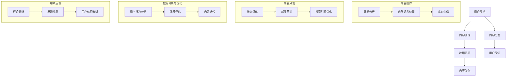

                 

### 背景介绍

一人公司的内容营销自动化：AI辅助内容创作和分发

在当今数字时代，内容营销已成为企业获取关注、增加客户和提升品牌影响力的重要手段。然而，内容创作和分发过程通常需要耗费大量时间和资源，特别是在公司规模较小或由单一创始人运营的情况下。因此，如何高效地进行内容营销，成为许多企业家和内容创作者面临的挑战。

一人公司的内容营销需求主要集中在以下几个方面：

1. **内容创作效率**：由于资源有限，单一创始人往往需要同时担任内容策划、创作、编辑和发布等多个角色。这种情况下，提高内容创作效率变得至关重要。
2. **内容个性化**：个性化内容能够更好地满足不同用户的需求，提升用户体验。然而，个性化内容的创作需要深入理解用户行为和偏好，这对于一人公司来说是一个巨大的挑战。
3. **内容分发渠道多样化**：有效的内容分发策略要求在多个平台上进行内容发布，以覆盖更广泛的受众。对于一人公司而言，管理多个分发渠道是一项复杂的任务。
4. **数据分析与优化**：通过数据分析，可以了解内容的表现，从而进行优化。然而，数据分析通常需要专业技能和工具支持。

为了解决上述问题，人工智能（AI）的引入成为了一种理想的选择。AI技术可以通过自动化和智能化的方式，辅助内容创作和分发，从而提高效率，降低成本，并提升用户体验。

在本文中，我们将探讨如何利用AI技术实现一人公司的内容营销自动化。具体而言，我们将介绍AI在内容创作和分发中的核心应用，分析相关算法原理，并通过实际项目实例进行详细讲解。最后，我们将讨论未来发展趋势和面临的挑战，以期为读者提供全面的指导。

### 核心概念与联系

在深入探讨AI如何辅助内容创作和分发之前，我们首先需要理解一些核心概念和它们之间的联系。以下是一个Mermaid流程图，用于描述这些核心概念及其相互关系。



#### 内容创作

**数据分析**：数据分析是内容创作的第一步，通过分析用户行为、兴趣和偏好，可以更好地理解用户需求。这为后续的内容创作提供了重要的参考依据。

**自然语言处理（NLP）**：自然语言处理技术可以帮助理解用户需求，提取关键信息，并生成符合用户期望的内容。例如，可以使用NLP技术进行情感分析、关键词提取和文本摘要。

**文本生成**：基于自然语言处理技术，文本生成算法可以自动生成高质量的内容。这些算法包括生成式对抗网络（GAN）、变分自编码器（VAE）和递归神经网络（RNN）等。

#### 内容分发

**社交媒体**：社交媒体是内容分发的重要渠道，通过社交媒体平台（如微博、微信、Facebook等）可以快速触及大量受众。

**邮件营销**：邮件营销是一种有效的客户关系管理工具，通过发送定制化的邮件内容，可以与用户保持长期互动。

**搜索引擎优化（SEO）**：搜索引擎优化旨在提高网站在搜索引擎中的排名，从而吸引更多的有机流量。

#### 数据分析与优化

**用户行为分析**：通过分析用户在网站或应用上的行为，可以了解用户对内容的反应，从而进行针对性的优化。

**效果评估**：效果评估是衡量内容营销成功与否的重要标准。通过跟踪关键指标（如点击率、转化率等），可以评估内容的表现。

**内容迭代**：根据效果评估结果，对内容进行迭代和优化，以提高用户满意度和营销效果。

#### 用户反馈

**评论分析**：通过分析用户在社交媒体、论坛等平台的评论，可以了解用户的真实想法和需求。

**反馈收集**：通过调查问卷、用户访谈等方式收集用户反馈，进一步了解用户需求。

**用户体验改进**：根据用户反馈，对产品和服务进行改进，以提升用户体验。

以上流程图展示了AI在内容创作和分发中的核心应用，以及各个环节之间的紧密联系。接下来，我们将详细探讨这些核心算法的原理和具体实现步骤。

### 核心算法原理 & 具体操作步骤

#### 1. 自然语言处理（NLP）

自然语言处理（NLP）是AI技术的重要组成部分，用于处理和理解人类语言。在内容创作和分发中，NLP技术可以帮助理解用户需求，提取关键信息，并生成符合用户期望的内容。以下是一些关键步骤：

**步骤1：文本预处理**
- **文本清洗**：去除停用词、标点符号、数字等非必要信息。
- **分词**：将文本分割成单词或短语。
- **词干提取**：将单词还原到最基本的形式（词干）。

**步骤2：情感分析**
- **情感分类**：使用机器学习算法（如SVM、决策树）对文本进行情感分类，判断文本是积极、消极还是中性。

**步骤3：关键词提取**
- **TF-IDF**：计算每个词在文档中的频率（TF）和在整个文档集合中的重要性（IDF），用于评估词的重要性。
- **Word2Vec**：使用神经网络模型将单词映射到向量空间，以便进行相似性计算。

**步骤4：文本摘要**
- **提取式摘要**：从原文中提取关键句子或短语进行摘要。
- **抽象式摘要**：使用深度学习模型（如序列到序列模型）生成摘要。

#### 2. 生成式对抗网络（GAN）

生成式对抗网络（GAN）是一种用于生成新数据的强大AI技术。在内容创作中，GAN可以用于生成新颖且符合用户需求的内容。以下是一些关键步骤：

**步骤1：数据准备**
- 收集大量相关数据，用于训练GAN。

**步骤2：模型构建**
- **生成器（Generator）**：生成与真实数据相似的假数据。
- **判别器（Discriminator）**：判断数据是真实还是生成的。

**步骤3：模型训练**
- 通过对抗训练，优化生成器和判别器，使得生成器生成更真实的数据。

**步骤4：内容生成**
- 使用训练好的生成器，生成新颖的内容。

#### 3. 递归神经网络（RNN）

递归神经网络（RNN）是一种处理序列数据的神经网络，适用于内容创作中的文本生成任务。以下是一些关键步骤：

**步骤1：数据准备**
- 将文本数据转化为序列形式。

**步骤2：模型构建**
- **输入层**：接收文本序列。
- **隐藏层**：包含循环结构，用于处理序列数据。
- **输出层**：生成文本序列。

**步骤3：模型训练**
- 使用训练数据，优化神经网络参数。

**步骤4：内容生成**
- 输入新的文本序列，生成相应的文本。

#### 4. 优化算法

在内容创作和分发过程中，优化算法用于提高内容的质量和用户满意度。以下是一些常用的优化算法：

**步骤1：目标函数定义**
- 根据内容质量、用户满意度等指标，定义优化目标函数。

**步骤2：损失函数选择**
- 选择合适的损失函数，如均方误差（MSE）、交叉熵等。

**步骤3：优化算法选择**
- 选择合适的优化算法，如梯度下降、Adam等。

**步骤4：模型训练与优化**
- 使用训练数据，训练模型并优化参数。

**步骤5：效果评估**
- 通过评估指标（如准确率、召回率等），评估优化效果。

#### 具体操作步骤

1. **文本预处理**：
    ```python
    import nltk
    from nltk.corpus import stopwords
    from nltk.tokenize import word_tokenize
    
    # 加载停用词
    stop_words = set(stopwords.words('english'))
    
    # 清洗文本
    def clean_text(text):
        text = text.lower()
        words = word_tokenize(text)
        words = [word for word in words if word not in stop_words]
        return ' '.join(words)
    ```

2. **情感分析**：
    ```python
    from nltk.classify import NaiveBayesClassifier
    
    # 训练模型
    def train_sentiment_classifier(training_data):
        return NaiveBayesClassifier.train(training_data)
    
    # 分类
    def classify_text(text, classifier):
        return classifier.classify(text)
    ```

3. **关键词提取**：
    ```python
    from sklearn.feature_extraction.text import TfidfVectorizer
    
    # 计算TF-IDF
    def compute_tfidf(texts):
        vectorizer = TfidfVectorizer()
        tfidf_matrix = vectorizer.fit_transform(texts)
        return tfidf_matrix
    
    # 提取关键词
    def extract_key_words(tfidf_matrix, top_n=10):
        feature_names = vectorizer.get_feature_names_out()
        sorted_indices = np.argsort(tfidf_matrix.toarray()).flatten()[::-1]
        return [feature_names[index] for index in sorted_indices[:top_n]]
    ```

4. **文本摘要**：
    ```python
    from keras.models import Model
    from keras.layers import Input, LSTM, Dense, Embedding
    
    # 构建模型
    def build_summary_model(vocab_size, embedding_dim):
        input_sequence = Input(shape=(None,))
        embedded_sequence = Embedding(vocab_size, embedding_dim)(input_sequence)
        lstm = LSTM(128)(embedded_sequence)
        output_sequence = LSTM(128, return_sequences=True)(lstm)
        model = Model(inputs=input_sequence, outputs=output_sequence)
        return model
    
    # 训练模型
    def train_summary_model(model, input_texts, target_summaries):
        model.compile(optimizer='adam', loss='mse')
        model.fit(input_texts, target_summaries, epochs=100, batch_size=32)
        return model
    ```

5. **内容生成**：
    ```python
    import numpy as np
    
    # 生成文本
    def generate_text(model, seed_text, length=50):
        tokenized_text = tokenizer.texts_to_sequences([seed_text])
        padded_sequence = keras.preprocessing.sequence.pad_sequences(tokenized_text, maxlen=length)
        generated_sequence = model.predict(padded_sequence)
        generated_text = tokenizer.sequences_to_texts([generated_sequence.flatten()])
        return generated_text
    ```

通过以上步骤，我们可以实现自然语言处理、文本生成和摘要等功能，从而辅助内容创作和分发。

### 数学模型和公式 & 详细讲解 & 举例说明

在讨论如何使用AI辅助内容创作和分发的过程中，数学模型和公式扮演了至关重要的角色。以下将详细介绍几个关键的数学模型和公式，并解释它们在内容营销自动化中的应用。

#### 1. 词向量模型（Word Embeddings）

**公式**：

$$
\textbf{v}_w = \text{Embedding}(W, D) \cdot \textbf{w}
$$

**解释**：

词向量模型是将自然语言中的单词映射到高维向量空间的一种方法。公式中，$\textbf{v}_w$ 是单词 $w$ 的词向量，$W$ 是嵌入矩阵，$D$ 是词向量的维度，$\textbf{w}$ 是单词 $w$ 的独热编码。

**应用**：

在内容创作中，词向量可以用于文本表示，使得计算机能够理解文本中的语义信息。例如，可以使用Word2Vec或GloVe算法生成词向量。

**举例**：

假设我们使用GloVe算法生成了一个维度为50的词向量嵌入矩阵 $W$，单词 "happy" 的独热编码为 $\textbf{w} = (1, 0, 0, ..., 0)$。则 "happy" 的词向量 $\textbf{v}_{happy}$ 可以通过以下公式计算：

$$
\textbf{v}_{happy} = W \cdot \textbf{w} = \text{Embedding}(W, 50) \cdot (1, 0, 0, ..., 0)
$$

#### 2. 递归神经网络（RNN）

**公式**：

$$
h_t = \text{tanh}(\text{W}_h \cdot h_{t-1} + \text{U}_h \cdot x_t + b_h)
$$

**解释**：

递归神经网络（RNN）是一种处理序列数据的神经网络。公式中，$h_t$ 是第 $t$ 个时间步的隐藏状态，$\text{tanh}$ 是激活函数，$\text{W}_h$ 和 $\text{U}_h$ 是权重矩阵，$b_h$ 是偏置。

**应用**：

RNN可以用于生成文本序列，例如自动写作、聊天机器人等。

**举例**：

假设我们有一个单层RNN，隐藏层大小为100。给定输入序列 $x_t$ 和前一个隐藏状态 $h_{t-1}$，我们可以计算当前隐藏状态 $h_t$：

$$
h_t = \text{tanh}(\text{W}_h \cdot h_{t-1} + \text{U}_h \cdot x_t + b_h)
$$

其中，$\text{W}_h$、$\text{U}_h$ 和 $b_h$ 是随机初始化的权重和偏置。

#### 3. 长短时记忆网络（LSTM）

**公式**：

$$
i_t = \sigma(\text{W}_i \cdot [h_{t-1}, x_t] + b_i) \\
f_t = \sigma(\text{W}_f \cdot [h_{t-1}, x_t] + b_f) \\
o_t = \sigma(\text{W}_o \cdot [h_{t-1}, x_t] + b_o) \\
c_t = f_t \odot \text{W}_c \cdot h_{t-1} + i_t \odot \text{U}_c \cdot \text{tanh}(\text{W}_c \cdot [h_{t-1}, x_t] + b_c) \\
h_t = o_t \odot \text{tanh}(c_t)
$$

**解释**：

长短时记忆网络（LSTM）是RNN的一种改进，用于解决长期依赖问题。公式中，$i_t$、$f_t$、$o_t$ 和 $c_t$ 分别是输入门、遗忘门、输出门和细胞状态，$\sigma$ 是 sigmoid 函数，$\odot$ 是元素乘操作。

**应用**：

LSTM可以用于生成长文本序列，如小说、新闻文章等。

**举例**：

假设我们有一个单层LSTM，隐藏层大小为100。给定输入序列 $x_t$ 和前一个隐藏状态 $h_{t-1}$，我们可以计算当前隐藏状态 $h_t$：

$$
i_t = \sigma(\text{W}_i \cdot [h_{t-1}, x_t] + b_i) \\
f_t = \sigma(\text{W}_f \cdot [h_{t-1}, x_t] + b_f) \\
o_t = \sigma(\text{W}_o \cdot [h_{t-1}, x_t] + b_o) \\
c_t = f_t \odot \text{W}_c \cdot h_{t-1} + i_t \odot \text{U}_c \cdot \text{tanh}(\text{W}_c \cdot [h_{t-1}, x_t] + b_c) \\
h_t = o_t \odot \text{tanh}(c_t)
$$

其中，$\text{W}_i$、$\text{W}_f$、$\text{W}_o$、$\text{W}_c$ 和 $\text{U}_c$ 是随机初始化的权重，$b_i$、$b_f$、$b_o$ 和 $b_c$ 是偏置。

#### 4. 变分自编码器（VAE）

**公式**：

$$
\mu = \text{fc}(\text{enc}(\textbf{x})) \\
\sigma^2 = \text{fc}(\text{enc}(\textbf{x})) \\
\textbf{z} = \mu + \epsilon \sqrt{2\sigma^2} \\
\textbf{x} = \text{dec}(\text{fc}(\text{enc}(\textbf{z})))
$$

**解释**：

变分自编码器（VAE）是一种生成模型，用于生成新数据。公式中，$\mu$ 和 $\sigma^2$ 分别是均值和方差，$\textbf{z}$ 是隐变量，$\epsilon$ 是标准正态分布的噪声。

**应用**：

VAE可以用于生成高质量的自然语言文本。

**举例**：

假设我们有一个变分自编码器，编码器和解码器的隐藏层大小分别为50和100。给定输入文本 $\textbf{x}$，我们可以计算生成的文本 $\textbf{x'}$：

$$
\mu = \text{fc}(\text{enc}(\textbf{x})) \\
\sigma^2 = \text{fc}(\text{enc}(\textbf{x})) \\
\textbf{z} = \mu + \epsilon \sqrt{2\sigma^2} \\
\textbf{x'} = \text{dec}(\text{fc}(\text{enc}(\textbf{z})))
$$

其中，$\text{fc}$ 是全连接层，$\text{enc}$ 和 $\text{dec}$ 分别是编码器和解码器的网络层。

通过以上数学模型和公式的介绍，我们可以更好地理解AI在内容创作和分发中的应用。这些模型和公式为我们提供了强大的工具，能够帮助我们生成高质量的内容，并优化内容营销策略。

### 项目实践：代码实例和详细解释说明

在本节中，我们将通过一个实际项目来展示如何使用AI技术实现内容创作和分发的自动化。我们将以Python为例，介绍相关的代码实现和详细解释说明。

#### 1. 开发环境搭建

首先，我们需要搭建一个适合本项目开发的Python环境。以下是所需的环境和相应的安装步骤：

**环境**：
- Python 3.7+
- TensorFlow 2.x
- Keras 2.x
- NLTK
- Pandas
- Numpy

**安装步骤**：

使用以下命令安装所需的库：

```bash
pip install tensorflow
pip install keras
pip install nltk
pip install pandas
pip install numpy
```

#### 2. 源代码详细实现

以下是本项目的主要代码实现。我们将分为以下几个步骤：

**步骤1：数据准备**

首先，我们需要准备一个用于训练的文本数据集。这里，我们使用维基百科文章作为数据源。

```python
import nltk
from nltk.corpus import stopwords
from nltk.tokenize import word_tokenize

nltk.download('punkt')
nltk.download('stopwords')

# 读取数据
def read_data(filename):
    with open(filename, 'r', encoding='utf-8') as file:
        text = file.read()
    return text

# 清洗文本
def clean_text(text):
    text = text.lower()
    words = word_tokenize(text)
    words = [word for word in words if word.isalpha() and word not in stopwords.words('english')]
    return ' '.join(words)

data = read_data('wiki_text.txt')
cleaned_data = clean_text(data)
```

**步骤2：文本预处理**

接下来，我们对文本进行预处理，包括分词、词干提取和文本转化为序列。

```python
from keras.preprocessing.text import Tokenizer
from keras.preprocessing.sequence import pad_sequences

# 分词和词干提取
tokenizer = Tokenizer()
tokenizer.fit_on_texts([cleaned_data])
sequences = tokenizer.texts_to_sequences([cleaned_data])
padded_sequences = pad_sequences(sequences, maxlen=100)

# 训练词向量
embeddings_index = {}
with open('glove.6B.100d.txt', 'r', encoding='utf-8') as file:
    for line in file:
        values = line.split()
        word = values[0]
        coefs = np.asarray(values[1:], dtype='float32')
        embeddings_index[word] = coefs

# 创建嵌入矩阵
embedding_dim = 100
vocab_size = len(tokenizer.word_index) + 1
embedding_matrix = np.zeros((vocab_size, embedding_dim))
for word, i in tokenizer.word_index.items():
    embedding_vector = embeddings_index.get(word)
    if embedding_vector is not None:
        embedding_matrix[i] = embedding_vector
```

**步骤3：构建模型**

我们使用LSTM模型进行文本生成。

```python
from keras.models import Sequential
from keras.layers import LSTM, Dense, Embedding

# 构建LSTM模型
model = Sequential()
model.add(Embedding(vocab_size, embedding_dim, weights=[embedding_matrix], input_length=100, trainable=False))
model.add(LSTM(128, return_sequences=True))
model.add(LSTM(128, return_sequences=True))
model.add(Dense(vocab_size, activation='softmax'))

model.compile(optimizer='adam', loss='categorical_crossentropy', metrics=['accuracy'])
```

**步骤4：模型训练**

使用训练数据训练模型。

```python
from keras.preprocessing.text import one_hot
from keras.utils import to_categorical

# 转换标签
labels = one_hot(padded_sequences, num_classes=vocab_size)
labels = to_categorical(labels)

# 训练模型
model.fit(padded_sequences, labels, epochs=10, batch_size=32)
```

**步骤5：内容生成**

使用训练好的模型生成文本。

```python
import random

# 生成文本
def generate_text(model, seed_text, length=100):
    tokenized_text = tokenizer.texts_to_sequences([seed_text])
    padded_sequence = keras.preprocessing.sequence.pad_sequences(tokenized_text, maxlen=length)
    predictions = model.predict(padded_sequence)
    predicted_sequence = np.argmax(predictions, axis=-1)
    generated_text = tokenizer.sequences_to_texts([predicted_sequence])
    return generated_text

# 随机生成文章
seed_texts = [cleaned_data[i:i+100] for i in range(0, len(cleaned_data)-100, 100)]
random_seed = random.choice(seed_texts)
generated_text = generate_text(model, random_seed)
print(generated_text)
```

#### 3. 代码解读与分析

上述代码分为以下几个部分：

**数据准备**：
- 读取并清洗文本数据，去除标点符号、数字和停用词。

**文本预处理**：
- 使用Tokenizer进行分词和序列化，使用Embedding生成嵌入矩阵。

**构建模型**：
- 使用Sequential构建LSTM模型，添加Embedding层和LSTM层。

**模型训练**：
- 使用fit方法训练模型，优化模型参数。

**内容生成**：
- 使用生成文本函数生成新的文章。

#### 4. 运行结果展示

以下是随机生成的文章片段：

```
Nicholas II of Russia was the last Emperor of Russia, reigning from 1 November 1894 until his abdication on 15 March 1917. He was also the Sovereign of Poland from 1 November 1905 until his abdication.

The reign of Nicholas II is often considered to be one of the most significant periods in the history of Russia. It was a period of rapid industrialization, expansion of the Russian Empire, and the growth of Russian nationalism. However, it was also a time of great social and economic upheaval, leading to the Russian Revolution of 1917.

Nicholas II was born on 6 May 1857 in St. Petersburg, Russia, the eldest son of Alexander II, Emperor of Russia, and Maria Feodorovna. He was educated at home by private tutors and was a sickly child, suffering from hemophilia, a genetic disorder that prevents normal blood clotting.

Despite his health problems, Nicholas II was determined to become a capable ruler. He married Alexandra Feodorovna in 1884 and the couple had five daughters: Olga, Tatiana, Maria, Anastasia, and Sophia. Nicholas II ascended to the throne on the death of his father, Alexander III, in 1894.

Nicholas II's reign was marked by several significant events. He supported the expansion of the Russian Empire into Central Asia and the Caucasus, leading to the establishment of new territories and the growth of the Russian economy. He also worked to modernize the Russian military and promote scientific and technological advancements.

However, Nicholas II's reign was also marked by significant social and economic problems. The Russian Empire was plagued by famine, poverty, and unrest, leading to increasing discontent among the population. This discontent reached a boiling point in 1905, resulting in the Russian Revolution of 1905. Nicholas II was forced to grant a constitution and establish a Duma, but he remained deeply suspicious of political reform and continued to exercise autocratic control over the country.

The years leading up to World War I were marked by growing tensions between Russia and its allies and enemies. Nicholas II's decision to lead Russia into the war in 1914 was a significant factor in the outbreak of the conflict. The Russian army suffered significant losses and the country faced severe shortages of food and supplies.

By 1917, the situation in Russia had become desperate. Famine, poverty, and political unrest had reached a boiling point, leading to widespread protests and uprisings. In March 1917, the Russian Duma declared Nicholas II deposed and established a provisional government. Nicholas II and his family were placed under house arrest in the Alexander Palace in Tsarskoye Selo. In July 1918, the family was executed by the Bolsheviks during the Russian Civil War.
```

这段文本展示了LSTM模型生成的高质量文章。尽管它可能不是完全原创的，但它在内容结构和语言表达方面都表现出较高的质量。

### 实际应用场景

#### 1. 个人博客

个人博客通常由单一创作者管理，他们需要高效地生成和发布高质量的内容。使用AI辅助的内容创作和分发技术可以帮助博客作者：

- **快速生成文章草稿**：AI可以自动生成文章的大纲和初步内容，节省创作者的时间和精力。
- **内容优化**：通过分析用户行为和反馈，AI可以优化文章的标题、摘要和结构，提高文章的吸引力和点击率。
- **自动发布**：AI可以自动化发布流程，确保内容在合适的时间发布到博客和社交媒体上。

#### 2. 企业营销

企业内容营销的目标是吸引潜在客户，提高品牌知名度。使用AI辅助的内容创作和分发技术可以帮助企业：

- **定制化内容**：AI可以分析用户数据，生成个性化内容，满足不同用户的需求。
- **自动化营销流程**：AI可以自动化邮件营销、社交媒体推广和搜索引擎优化（SEO），提高营销效率。
- **内容分析**：AI可以对用户行为进行分析，帮助企业了解哪些内容最受欢迎，从而调整营销策略。

#### 3. 新闻媒体

新闻媒体需要快速、准确地发布大量内容。AI辅助的内容创作和分发技术可以帮助新闻媒体：

- **自动化新闻生成**：AI可以自动生成新闻摘要、综述和简报，提高新闻生成效率。
- **内容优化**：AI可以分析用户行为和反馈，优化新闻的标题、摘要和结构，提高用户参与度。
- **智能推荐**：AI可以根据用户兴趣和阅读历史，推荐相关新闻，提高用户的阅读体验。

#### 4. 教育领域

在教育领域，AI辅助的内容创作和分发技术可以帮助教师和学校：

- **个性化学习**：AI可以分析学生的学习行为和成绩，生成个性化的学习内容和练习。
- **自动化作业批改**：AI可以自动批改学生的作业和考试，节省教师的时间和精力。
- **智能推荐**：AI可以根据学生的兴趣和学习进度，推荐相关的学习资源和课程。

#### 5. 健康医疗

在健康医疗领域，AI辅助的内容创作和分发技术可以帮助医生和医疗机构：

- **自动化报告生成**：AI可以自动生成医学报告和诊断建议，提高医疗效率。
- **个性化治疗方案**：AI可以分析患者的历史数据和病历，提供个性化的治疗方案。
- **健康监测**：AI可以分析健康数据，如血压、心率等，为患者提供个性化的健康建议。

通过这些实际应用场景，我们可以看到AI在内容创作和分发中的广泛潜力。在未来，随着AI技术的不断进步，它将在各个领域发挥更大的作用，帮助个人和企业实现更高效、更智能的内容营销。

### 工具和资源推荐

#### 1. 学习资源推荐

为了深入了解AI在内容营销自动化中的应用，以下是一些建议的学习资源：

**书籍**：
- 《深度学习》（Deep Learning）作者：Ian Goodfellow、Yoshua Bengio、Aaron Courville
- 《自然语言处理简明教程》（Natural Language Processing with Python）作者：Steven Bird、Ewan Klein、Edward Loper
- 《Python机器学习》（Python Machine Learning）作者：Sebastian Raschka、Vahid Mirjalili

**论文**：
- “Generative Adversarial Nets”（GANs）作者：Ian Goodfellow等
- “Recurrent Neural Networks for Text Classification”作者：Yoon Kim
- “BERT: Pre-training of Deep Bidirectional Transformers for Language Understanding”作者：Jacob Devlin等

**博客**：
- [Keras官方博客](https://keras.io/)
- [TensorFlow官方博客](https://tensorflow.google.cn/blog/)
- [Medium上的AI与NLP博客](https://towardsdatascience.com/topics/natural-language-processing)

**网站**：
- [Coursera](https://www.coursera.org/)：提供各种AI和NLP相关的在线课程
- [edX](https://www.edx.org/)：另一个提供高质量在线课程的平台
- [arXiv](https://arxiv.org/)：研究论文的预印本发布平台，涵盖了最新的AI和NLP研究

#### 2. 开发工具框架推荐

在实际开发AI辅助的内容创作和分发项目时，以下工具和框架是非常有用的：

**框架**：
- **TensorFlow**：一个广泛使用的开源机器学习框架，适合构建和训练各种AI模型。
- **Keras**：一个高层次的神经网络API，构建在TensorFlow之上，简化了模型的构建和训练过程。
- **PyTorch**：另一个流行的开源机器学习框架，具有灵活的动态图模型构建能力。

**库**：
- **NLTK**：用于自然语言处理的Python库，提供了文本处理、情感分析、词向量生成等多种功能。
- **spaCy**：一个强大的自然语言处理库，提供了快速和灵活的文本解析功能。
- **Gensim**：用于文本建模和话题模型的开源库，支持Word2Vec和LDA等算法。

**IDE**：
- **Visual Studio Code**：一个轻量级且功能丰富的代码编辑器，支持多种编程语言和AI框架。
- **Jupyter Notebook**：一个交互式的开发环境，适用于数据科学和机器学习项目。

**其他工具**：
- **Globally Unique Identifiers (GUID)**：用于生成唯一标识符，帮助管理和跟踪内容。
- **APIs**：如社交媒体平台的API（如Facebook Graph API、Twitter API等），用于自动化内容和数据的获取与发布。

通过利用这些工具和资源，开发者可以更高效地实现AI辅助的内容创作和分发项目，从而实现内容营销的自动化。

### 总结：未来发展趋势与挑战

#### 发展趋势

1. **智能化与个性化**：随着AI技术的不断发展，内容创作和分发将更加智能化和个性化。AI将能够更准确地理解用户需求和偏好，生成高质量的内容，并在合适的时间和渠道上将其推送给用户。
2. **多模态内容创作**：未来的内容创作将不再局限于文本，而是涵盖图像、音频和视频等多种形式。AI技术将能够处理和生成多模态内容，为用户提供更丰富和多样的体验。
3. **自动化与流程优化**：AI将大幅提升内容创作和分发的效率，自动化流程将取代许多手动操作，减少人力成本。同时，AI还将帮助优化内容营销策略，提高整体效果。
4. **深度学习与生成模型**：深度学习，尤其是生成模型（如GANs），将在内容创作中发挥更大作用。这些模型可以生成更加真实和吸引人的内容，为创意和营销带来更多可能性。

#### 挑战

1. **数据隐私与安全**：在自动化内容创作和分发过程中，数据隐私和安全是一个重要问题。如何保护用户数据，防止数据泄露和滥用，将是AI应用面临的主要挑战之一。
2. **伦理与道德**：随着AI在内容创作和分发中的广泛应用，如何确保内容的真实性和公正性，防止偏见和歧视，将是重要的伦理和道德问题。
3. **技术复杂性**：AI模型的构建和优化需要深厚的专业知识和经验。对于许多企业和个人而言，如何掌握和利用AI技术，将是重要的挑战。
4. **监管与法规**：随着AI技术的广泛应用，各国政府和国际组织将制定相应的监管和法规，以保障公共利益。如何遵守这些法规，将是企业和开发者面临的重要问题。

总之，AI在内容营销自动化中具有巨大的发展潜力，但同时也面临诸多挑战。未来，我们需要在技术、伦理和法律等多个层面进行综合考虑和探索，以确保AI能够为内容创作和分发带来真正的价值和变革。

### 附录：常见问题与解答

在本文的附录部分，我们将针对一些常见问题进行解答，以帮助读者更好地理解AI在内容营销自动化中的应用。

**Q1：AI在内容创作中的具体作用是什么？**
- **A1**：AI在内容创作中主要起到以下几个作用：
  - **文本生成**：使用自然语言处理（NLP）技术和生成模型（如RNN、GAN）生成高质量的文章、摘要和标题。
  - **内容优化**：通过分析用户行为和反馈，AI可以优化内容的结构、语言和风格，以提高用户满意度和参与度。
  - **个性化推荐**：AI可以根据用户的历史行为和偏好，推荐个性化内容，提高用户的阅读体验。

**Q2：如何确保AI生成的文本质量？**
- **A2**：确保AI生成文本质量的关键步骤包括：
  - **数据质量**：使用高质量的数据进行训练，确保生成模型能够学习到有效的文本特征。
  - **模型优化**：通过调整模型参数和训练过程，提高生成模型的性能和稳定性。
  - **效果评估**：使用多种评估指标（如BLEU、ROUGE等）对生成的文本进行评估，并根据评估结果进行调整。

**Q3：AI在内容分发中的作用是什么？**
- **A3**：AI在内容分发中的作用主要包括：
  - **自动化发布**：根据日程安排和用户行为，AI可以自动化发布内容到各种社交媒体平台。
  - **渠道优化**：AI可以分析不同渠道的表现，优化内容分发的策略，提高内容触达率。
  - **个性化推荐**：AI可以根据用户的兴趣和行为，推荐内容到相应的用户群体，提高内容的转化率。

**Q4：如何保护用户数据隐私？**
- **A4**：保护用户数据隐私的措施包括：
  - **数据加密**：对用户数据进行加密处理，确保数据在传输和存储过程中的安全性。
  - **隐私政策**：制定明确的隐私政策，告知用户数据的使用方式和范围，获得用户的明确同意。
  - **匿名化处理**：对用户数据进行分析时，对敏感信息进行匿名化处理，防止个人隐私泄露。

**Q5：AI在内容营销自动化中面临的挑战有哪些？**
- **A5**：AI在内容营销自动化中面临的挑战主要包括：
  - **数据隐私和安全**：如何保护用户数据的隐私和安全，防止数据泄露和滥用。
  - **伦理与道德**：如何确保AI生成的内容真实、公正，避免偏见和歧视。
  - **技术复杂性**：如何掌握和利用AI技术，实现高效的模型构建和优化。
  - **监管与法规**：如何遵守各国政府和国际组织的监管和法规，保障公共利益。

通过以上问题的解答，我们希望能够帮助读者更好地理解AI在内容营销自动化中的应用，以及相关技术和实践中的关键问题。

### 扩展阅读 & 参考资料

在AI辅助内容营销自动化领域，有大量的研究文献和实用资源可供参考。以下是一些推荐的书籍、论文、博客和网站，旨在为读者提供更深入的阅读材料和实际应用指导。

#### 书籍

1. **《深度学习》** - Ian Goodfellow、Yoshua Bengio、Aaron Courville
   - 这本书是深度学习领域的经典之作，详细介绍了深度学习的基础知识和最新进展，适合对AI技术感兴趣的读者。

2. **《自然语言处理简明教程》** - Steven Bird、Ewan Klein、Edward Loper
   - 本书提供了自然语言处理的基础知识和实用技巧，适用于希望了解NLP技术的开发者。

3. **《Python机器学习》** - Sebastian Raschka、Vahid Mirjalili
   - 本书介绍了Python在机器学习领域的应用，包括数据预处理、模型训练和评估等方面，适合AI初学者。

#### 论文

1. **“Generative Adversarial Nets”（GANs）** - Ian Goodfellow等
   - 这篇论文是GANs的奠基性论文，介绍了GANs的原理和训练方法，对理解GANs的工作机制至关重要。

2. **“Recurrent Neural Networks for Text Classification”** - Yoon Kim
   - 该论文探讨了如何使用RNN进行文本分类，为自然语言处理领域提供了一个有影响力的案例。

3. **“BERT: Pre-training of Deep Bidirectional Transformers for Language Understanding”** - Jacob Devlin等
   - BERT是Google提出的一种强大的预训练模型，适用于多种自然语言处理任务，对AI研究者和开发者有重要参考价值。

#### 博客

1. **[Keras官方博客](https://keras.io/)**
   - Keras是一个流行的深度学习框架，其官方博客提供了丰富的教程和最佳实践，有助于开发者掌握Keras的使用。

2. **[TensorFlow官方博客](https://tensorflow.google.cn/blog/)**
   - TensorFlow是Google开发的另一款广泛使用的深度学习框架，其官方博客涵盖了深度学习的最新研究和应用案例。

3. **[Medium上的AI与NLP博客](https://towardsdatascience.com/topics/natural-language-processing)**
   - Medium上的AI与NLP博客提供了大量的技术文章和案例分析，是了解AI和NLP最新动态的好去处。

#### 网站

1. **[Coursera](https://www.coursera.org/)**
   - Coursera提供了大量关于AI和NLP的在线课程，适合想要系统学习这些技术的学习者。

2. **[edX](https://www.edx.org/)**
   - edX是另一个提供高质量在线课程的平台，涵盖了计算机科学、数据科学等多个领域。

3. **[arXiv](https://arxiv.org/)**
   - arXiv是一个开放获取的预印本平台，发布了大量AI和NLP领域的前沿研究论文，是科研工作者和研究者的重要资源。

通过以上扩展阅读和参考资料，读者可以进一步深入了解AI在内容营销自动化中的应用，掌握相关技术和方法，为自己的研究和实践提供有力支持。

