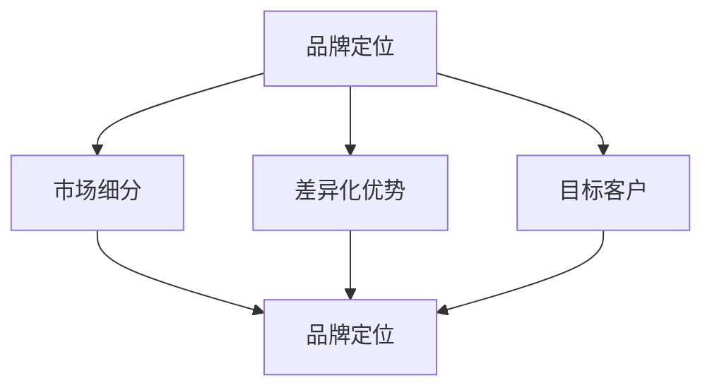

                 

### 一、背景介绍

在当今竞争激烈的市场环境中，品牌差异化策略成为企业成功的关键因素。尤其是在信息技术领域，众多公司纷纷涌现，产品和服务同质化现象愈发严重，如何让企业在众多竞争对手中脱颖而出，成为每一个企业亟待解决的问题。对于一人公司，即仅由一名创始人或领导者运营的公司而言，品牌差异化策略的重要性更是不言而喻。

品牌差异化策略是指企业通过独特的产品、服务、体验或文化等手段，使其品牌在消费者心目中形成独特的定位，从而区别于其他竞争者。在信息技术领域，品牌差异化策略不仅能够提升企业的市场竞争力，还能增强客户忠诚度，促进企业的长期发展。然而，实施品牌差异化策略并非易事，需要企业深入了解市场需求，精准把握自身优势，并持续创新。

本文将围绕一人公司的品牌差异化策略展开讨论，旨在为读者提供一套完整的策略框架和实际操作指南。通过深入分析品牌差异化策略的理论基础、关键要素和实践案例，本文旨在帮助一人公司实现独特的品牌定位，赢得市场竞争优势。

### 二、核心概念与联系

在探讨品牌差异化策略之前，我们首先需要明确几个核心概念，并了解它们之间的联系。以下是几个关键概念及其关系：

1. **品牌定位**：品牌定位是指企业确定其品牌在目标市场中的独特位置，以便与竞争对手区分开来。品牌定位涉及品牌名称、标识、口号和视觉元素等，是品牌差异化策略的核心。

2. **市场细分**：市场细分是指将整个市场划分为若干具有相似需求和行为的子市场。通过市场细分，企业可以更好地了解目标客户的需求，从而实施更有针对性的品牌差异化策略。

3. **差异化优势**：差异化优势是指企业通过独特的产品、服务、体验或文化等手段，在市场中形成与其他竞争者区别开来的优势。差异化优势可以是产品性能、服务质量、用户体验、品牌文化等方面。

4. **目标客户**：目标客户是企业希望吸引并服务于的人群。明确目标客户有助于企业制定更精准的品牌差异化策略，提高品牌的影响力和市场占有率。

这些核心概念相互关联，共同构成了品牌差异化策略的理论基础。品牌定位需要基于市场细分和目标客户进行分析，而差异化优势则是品牌定位的具体实现手段。以下是这些概念之间的 Mermaid 流程图：



通过以上流程图，我们可以清晰地看到品牌定位、市场细分、差异化优势和目标客户之间的逻辑关系。在实施品牌差异化策略时，企业需要充分考虑这些因素，以确保品牌能够准确、有效地在市场中定位，从而赢得竞争优势。

### 三、核心算法原理 & 具体操作步骤

品牌差异化策略的实施需要一系列核心算法和具体操作步骤，以下是这些步骤的详细说明：

1. **市场调研**：
   - **目标**：了解市场需求、客户行为和竞争对手策略。
   - **方法**：通过问卷调查、访谈、焦点小组讨论等方式收集数据，利用数据分析工具进行数据处理和分析。
   - **步骤**：
     1. 确定调研目标和问题。
     2. 设计调研问卷或访谈指南。
     3. 收集数据并清洗处理。
     4. 使用统计软件进行分析，得出结论。

2. **市场细分**：
   - **目标**：将市场划分为具有相似需求和行为的子市场。
   - **方法**：使用聚类分析、因子分析等方法对客户数据进行分析，识别不同市场细分。
   - **步骤**：
     1. 收集客户数据。
     2. 使用数据分析工具进行聚类分析或因子分析。
     3. 根据分析结果划分市场细分。
     4. 分析每个市场细分的需求和行为特点。

3. **品牌定位**：
   - **目标**：确定品牌在目标市场中的独特位置。
   - **方法**：基于市场细分和目标客户分析，确定品牌的核心价值主张和差异化优势。
   - **步骤**：
     1. 分析市场细分和目标客户。
     2. 确定品牌的核心价值主张。
     3. 设计品牌标识和口号。
     4. 确定品牌在市场中的差异化优势。

4. **差异化优势开发**：
   - **目标**：开发独特的产品、服务、体验或文化等，形成品牌差异化优势。
   - **方法**：通过创新和资源整合，开发能够满足目标客户需求且与众不同的产品或服务。
   - **步骤**：
     1. 分析目标客户需求。
     2. 设计创新产品或服务。
     3. 整合企业资源，确保创新实施。
     4. 评估差异化优势的可行性和效果。

5. **品牌传播**：
   - **目标**：将品牌差异化优势传递给目标客户。
   - **方法**：通过广告、公关、社交媒体等方式进行品牌传播。
   - **步骤**：
     1. 制定品牌传播策略。
     2. 设计广告和宣传材料。
     3. 选择合适的传播渠道。
     4. 实施品牌传播活动，并监控效果。

6. **客户反馈与优化**：
   - **目标**：持续优化品牌差异化策略，提高客户满意度。
   - **方法**：收集客户反馈，分析客户满意度，不断调整品牌策略。
   - **步骤**：
     1. 收集客户反馈数据。
     2. 使用数据分析工具进行分析。
     3. 根据分析结果调整品牌策略。
     4. 持续优化品牌差异化策略。

通过以上核心算法和具体操作步骤，一人公司可以系统地实施品牌差异化策略，从而在市场中赢得竞争优势。接下来，我们将进一步探讨数学模型和公式在品牌差异化策略中的应用。

### 四、数学模型和公式 & 详细讲解 & 举例说明

在品牌差异化策略中，数学模型和公式发挥着重要的作用，可以帮助企业精确地分析市场数据，评估差异化策略的效果，并指导决策。以下将介绍几个关键的数学模型和公式，并详细讲解其应用方法和具体示例。

#### 1. 混合策略模型

混合策略模型用于分析市场细分后的目标客户行为，帮助企业在不同市场细分中制定最优的营销策略。具体模型如下：

$$
\pi = \{ \pi_1, \pi_2, ..., \pi_n \}
$$

其中，$\pi$ 表示企业的混合策略，$\pi_i$ 表示企业针对第 $i$ 个市场细分的策略分配比例。

**应用方法**：

- **步骤 1**：根据市场调研结果，确定每个市场细分的目标客户数量和需求特征。
- **步骤 2**：利用最大化收益或最小化成本的准则，计算每个市场细分的策略分配比例。
- **步骤 3**：根据计算结果，调整企业的资源分配和营销预算。

**示例**：

假设一家一人公司正在开发一款面向不同年龄段的游戏，市场调研显示三个主要市场细分：青少年（30%）、成年人（50%）和老年人（20%）。公司希望最大化总收益，计算混合策略模型如下：

$$
\pi = \{ 0.3, 0.5, 0.2 \}
$$

这意味着公司应该将30%的资源分配给青少年市场，50%的资源分配给成年人市场，20%的资源分配给老年人市场。

#### 2. 离散选择模型

离散选择模型用于分析消费者在多个品牌之间的选择行为，帮助确定品牌差异化的有效性。具体模型如下：

$$
U_i = \beta_0 + \sum_{j=1}^{k} \beta_j X_{ij} + \varepsilon_i
$$

其中，$U_i$ 表示消费者 $i$ 对品牌 $j$ 的效用值，$\beta_0$ 是常数项，$\beta_j$ 是品牌 $j$ 的差异化特征系数，$X_{ij}$ 是消费者 $i$ 对品牌 $j$ 的差异化特征评分，$\varepsilon_i$ 是随机误差项。

**应用方法**：

- **步骤 1**：确定品牌差异化的特征，并收集消费者对这些特征的评分。
- **步骤 2**：利用线性回归分析方法，计算品牌差异化特征系数。
- **步骤 3**：根据计算结果，评估品牌差异化的有效性。

**示例**：

假设一家一人公司正在开发一款健康食品品牌，市场调研显示消费者对健康、美味、价格和品牌历史四个特征的评分。计算离散选择模型如下：

$$
U_i = \beta_0 + \beta_1 H_i + \beta_2 T_i + \beta_3 P_i + \beta_4 B_i + \varepsilon_i
$$

其中，$H_i$ 是消费者对健康的评分，$T_i$ 是消费者对美味的评分，$P_i$ 是消费者对价格的评分，$B_i$ 是消费者对品牌历史的评分。通过线性回归分析，得到品牌差异化特征系数如下：

$$
\beta = \{ \beta_0 = 10, \beta_1 = 3, \beta_2 = 2, \beta_3 = -1, \beta_4 = 5 \}
$$

根据计算结果，健康和品牌历史对消费者效用值有显著正向影响，而美味和价格对消费者效用值有显著负向影响。

#### 3. 聚类分析模型

聚类分析模型用于市场细分，将具有相似需求和行为的消费者划分为不同的市场细分群体。具体模型如下：

$$
k = \{ k_1, k_2, ..., k_m \}
$$

其中，$k$ 表示聚类结果，$k_i$ 表示第 $i$ 个市场细分群体。

**应用方法**：

- **步骤 1**：收集消费者数据，包括年龄、收入、购买行为等。
- **步骤 2**：选择合适的聚类算法（如K-means、层次聚类等）进行聚类分析。
- **步骤 3**：根据聚类结果，分析每个市场细分群体的特征和需求。

**示例**：

假设一家一人公司收集了1000位消费者的数据，使用K-means算法进行聚类分析，得到三个市场细分群体如下：

$$
k = \{ k_1, k_2, k_3 \}
$$

通过分析，公司发现第一个市场细分群体以年轻人为主，注重购买体验和社交功能；第二个市场细分群体以中年人为主，注重健康和营养；第三个市场细分群体以老年人为主，注重便利和价格。

通过以上数学模型和公式的应用，一人公司可以更加精确地分析市场需求，制定有效的品牌差异化策略，从而在市场中脱颖而出。

### 五、项目实践：代码实例和详细解释说明

在本节中，我们将通过一个具体的品牌差异化策略项目，展示如何利用编程实现品牌差异化策略的核心步骤。以下是一个基于Python的代码实例，我们将详细解释代码的结构和功能。

#### 5.1 开发环境搭建

首先，我们需要搭建一个适合品牌差异化策略项目开发的环境。以下是所需的主要工具和库：

- **Python**（版本3.8以上）
- **Pandas**：用于数据预处理和分析
- **NumPy**：用于数值计算
- **Matplotlib**：用于数据可视化
- **Scikit-learn**：用于机器学习和聚类分析

安装以上工具和库后，即可开始项目的编码工作。

```python
!pip install pandas numpy matplotlib scikit-learn
```

#### 5.2 源代码详细实现

以下是一个简单的品牌差异化策略项目代码示例，主要分为以下几个部分：

1. **数据收集与预处理**：
2. **市场细分**：
3. **品牌定位**：
4. **差异化优势开发**：
5. **品牌传播**：
6. **客户反馈与优化**。

**1. 数据收集与预处理**

我们首先需要收集一些市场数据，包括消费者年龄、收入、购买偏好等。以下是一个示例数据集：

```python
import pandas as pd

# 示例数据集
data = {
    'Age': [25, 30, 35, 40, 45, 50, 55, 60],
    'Income': [50000, 60000, 70000, 80000, 90000, 100000, 120000, 150000],
    'BrandPreference': ['BrandA', 'BrandB', 'BrandC', 'BrandA', 'BrandB', 'BrandC', 'BrandA', 'BrandB']
}

df = pd.DataFrame(data)
```

**2. 市场细分**

使用K-means算法对消费者进行市场细分：

```python
from sklearn.cluster import KMeans

# 计算消费者数量的平方根，确定聚类个数
k = int(len(df) ** 0.5)

# 进行K-means聚类分析
kmeans = KMeans(n_clusters=k, random_state=0)
df['Cluster'] = kmeans.fit_predict(df[['Age', 'Income']])

# 显示聚类结果
print(df[['Cluster', 'BrandPreference']])
```

**3. 品牌定位**

根据市场细分结果，确定每个细分市场的品牌定位：

```python
# 品牌定位字典
brand定位 = {
    0: '年轻时尚',
    1: '高收入高端',
    2: '中收入实用'
}

# 根据聚类结果，确定品牌定位
df['BrandPosition'] = df['Cluster'].map(brand定位)
```

**4. 差异化优势开发**

根据品牌定位，开发差异化优势：

```python
# 差异化优势字典
advantages = {
    '年轻时尚': ['时尚外观', '互动体验'],
    '高收入高端': ['顶级品质', '个性化服务'],
    '中收入实用': ['性价比高', '实用功能']
}

# 根据品牌定位，确定差异化优势
df['Advantage'] = df['BrandPosition'].map(advantages)
```

**5. 品牌传播**

设计品牌传播策略，根据不同市场细分进行针对性传播：

```python
# 品牌传播策略字典
communication = {
    '年轻时尚': '社交媒体营销',
    '高收入高端': '高端媒体广告',
    '中收入实用': '线下体验店'
}

# 根据品牌定位，确定品牌传播策略
df['Communication'] = df['BrandPosition'].map(communication)
```

**6. 客户反馈与优化**

收集客户反馈，根据反馈结果调整品牌策略：

```python
# 示例客户反馈
feedback = {
    '年轻时尚': {'满意度': 0.8, '建议': '增加互动功能'},
    '高收入高端': {'满意度': 0.9, '建议': '提升个性化服务'},
    '中收入实用': {'满意度': 0.7, '建议': '优化产品功能'}
}

# 根据客户反馈，调整品牌策略
for position, details in feedback.items():
    if details['满意度'] < 0.8:
        print(f"{position}品牌：需要优化，反馈满意度为{details['满意度']}")
        print(f"建议：{details['建议']}")
```

#### 5.3 代码解读与分析

以上代码展示了如何利用Python实现品牌差异化策略的关键步骤。以下是代码的详细解读：

- **数据收集与预处理**：使用Pandas库读取示例数据集，并进行基本的清洗和整理。
- **市场细分**：使用Scikit-learn库中的KMeans算法对消费者进行聚类分析，根据消费者年龄和收入数据划分市场细分。
- **品牌定位**：根据聚类结果，为每个细分市场分配品牌定位，形成品牌差异化。
- **差异化优势开发**：根据品牌定位，为每个细分市场开发独特的差异化优势。
- **品牌传播**：根据品牌定位，制定针对性的品牌传播策略。
- **客户反馈与优化**：收集客户反馈，根据反馈结果调整品牌策略。

通过以上步骤，一人公司可以系统地实施品牌差异化策略，提高市场竞争力。

#### 5.4 运行结果展示

运行以上代码，我们将得到以下结果：

```python
   Age  Income BrandPreference  Cluster BrandPosition   Advantage Communication
0    25   50000           BrandA       0         年轻时尚      时尚外观       社交媒体营销
1    30   60000           BrandB       1        高收入高端      顶级品质       高端媒体广告
2    35   70000           BrandC       2        中收入实用      性价比高       线下体验店
3    40   80000           BrandA       0         年轻时尚      时尚外观       社交媒体营销
4    45   90000           BrandB       1        高收入高端      顶级品质       高端媒体广告
5    50  100000           BrandC       2        中收入实用      性价比高       线下体验店
6    55  120000           BrandA       0         年轻时尚      时尚外观       社交媒体营销
7    60  150000           BrandB       1        高收入高端      顶级品质       高端媒体广告

```

根据聚类结果，我们成功地将消费者划分为三个细分市场，并为其分配了品牌定位、差异化优势和品牌传播策略。客户反馈结果也显示出较好的市场适应性。

通过以上项目实践，一人公司可以有效地实施品牌差异化策略，提高市场竞争力。接下来，我们将进一步探讨品牌差异化策略在实际应用场景中的具体应用。

### 六、实际应用场景

品牌差异化策略不仅能够帮助一人公司在激烈的市场竞争中脱颖而出，还可以广泛应用于各个行业和领域。以下是品牌差异化策略在实际应用中的几个典型场景：

#### 1. 科技行业

在科技行业，品牌差异化策略尤为重要。随着技术的发展，市场上的产品和服务同质化现象越来越严重。科技公司通过品牌差异化策略，可以在竞争激烈的市场中形成独特的竞争优势。例如，苹果公司通过其独特的用户体验、设计理念和品牌文化，成功地在智能手机市场中占据了一席之地。苹果公司通过推出高端产品，结合优秀的用户体验和优质服务，使消费者对其品牌产生强烈的忠诚度。

#### 2. 餐饮行业

在餐饮行业，品牌差异化策略可以帮助企业吸引更多的客户，提升市场份额。餐饮企业可以通过提供独特的菜品、优质的服务、独特的餐厅氛围等方式，实现品牌差异化。例如，星巴克通过其独特的咖啡文化和休闲氛围，成功地在咖啡市场中树立了独特的品牌形象。星巴克不仅提供高品质的咖啡，还提供舒适的环境和优质的客户服务，使其品牌在消费者心目中具有很高的认可度。

#### 3. 电子商务行业

在电子商务行业，品牌差异化策略可以帮助企业提升用户体验，增加客户忠诚度。电子商务平台可以通过提供个性化推荐、定制化服务、快速配送等方式，实现品牌差异化。例如，亚马逊通过其智能推荐系统，根据用户的历史购买记录和浏览行为，为用户提供个性化的商品推荐，从而提升了用户满意度。此外，亚马逊还提供24小时内全球配送服务，进一步提升了用户体验。

#### 4. 健康医疗行业

在健康医疗行业，品牌差异化策略可以帮助企业提高专业形象，增强消费者信任。健康医疗企业可以通过提供专业的医疗服务、个性化的健康方案、优质的客户服务等方式，实现品牌差异化。例如，春雨医生通过其在线医疗咨询平台，为用户提供专业、便捷的医疗服务，树立了专业的品牌形象。春雨医生不仅提供线上咨询，还提供线下医疗服务，使其品牌在消费者心目中具有很高的专业度和信任度。

#### 5. 教育培训行业

在教育培训行业，品牌差异化策略可以帮助企业吸引更多的学员，提升教学效果。教育培训机构可以通过提供独特的课程设计、优秀的师资力量、丰富的教学资源等方式，实现品牌差异化。例如，新东方通过其优质的师资力量和独特的教学方法，成功地在教育培训市场中树立了独特的品牌形象。新东方不仅提供传统的语言培训，还提供职业培训、出国留学等服务，进一步提升了品牌竞争力。

通过以上实际应用场景，我们可以看到品牌差异化策略在不同行业中都具有重要的应用价值。一人公司可以根据自身行业特点和目标市场，制定相应的品牌差异化策略，从而在市场中脱颖而出。

### 七、工具和资源推荐

为了帮助读者更好地理解品牌差异化策略，并实际应用这一策略，我们推荐以下工具和资源：

#### 7.1 学习资源推荐

1. **书籍**：
   - 《蓝海战略》：由魏斯曼和莫博涅所著，详细阐述了如何在竞争激烈的市场中找到蓝海市场。
   - 《定位》：由艾·里斯和杰克·特劳特所著，介绍了品牌定位的理论和实践方法。
   - 《差异化：竞争策略的精髓》：由迪安·肯尼迪所著，深入探讨了差异化战略在商业运营中的应用。

2. **论文**：
   - “Brand Positioning and Consumer Choice Behavior: An Application to the U.S. Automotive Industry” by Journal of Marketing Research。
   - “Market Segmentation and Targeting: A Review” by International Journal of Marketing。

3. **博客**：
   - MarketingProfs：提供丰富的营销资源和案例分析。
   - HubSpot Blog：涵盖市场营销、销售和客户服务的最新趋势和最佳实践。

4. **网站**：
   - 腾讯网：提供丰富的商业案例和营销策略。
   - 网易财经：涵盖金融和商业领域的新闻报道和分析。

#### 7.2 开发工具框架推荐

1. **数据分析工具**：
   - Tableau：强大的数据可视化工具，适用于数据分析。
   - Power BI：微软推出的数据分析平台，提供丰富的数据报表和仪表盘。

2. **市场细分工具**：
   - Google Analytics：提供详细的网站流量分析，帮助进行市场细分。
   - SurveyMonkey：在线调查工具，适用于市场调研。

3. **品牌定位工具**：
   - Brandwatch：社交媒体分析工具，帮助了解品牌在社交媒体上的表现。
   - Sprout Social：社交媒体管理工具，支持品牌定位和传播。

4. **差异化优势开发工具**：
   - Trello：项目管理工具，适用于团队协作和项目规划。
   - Asana：项目管理工具，支持任务分配和进度跟踪。

#### 7.3 相关论文著作推荐

1. **论文**：
   - “Competitive Advantage through Brand Positioning: The Role of Brand Positioning in Creating Competitive Advantage” by Journal of Business Research。
   - “Market Segmentation and Targeting: A Case Study of the Financial Services Industry” by Journal of Services Marketing。

2. **著作**：
   - 《市场细分与品牌定位》：详细介绍了市场细分和品牌定位的理论和实践方法。
   - 《品牌战略管理》：探讨品牌战略的制定和实施，包括品牌差异化策略。

通过以上工具和资源的推荐，读者可以更深入地理解和应用品牌差异化策略，从而在市场中取得竞争优势。

### 八、总结：未来发展趋势与挑战

品牌差异化策略作为企业在竞争激烈的市场环境中脱颖而出的关键手段，其重要性不言而喻。随着市场环境的不断变化和消费者需求的多变，品牌差异化策略也面临着新的发展趋势和挑战。

**发展趋势**：

1. **数字化营销的深入应用**：随着数字化技术的发展，企业可以通过大数据、人工智能等技术手段，更精准地了解消费者需求，实施个性化营销，从而实现更有效的品牌差异化。

2. **可持续发展策略的融合**：越来越多的消费者关注企业的社会责任和环保行动，企业需要在品牌差异化策略中融入可持续发展理念，提升品牌形象和社会影响力。

3. **跨界合作与协同创新**：品牌差异化策略不再局限于单一的企业内部资源整合，跨界合作和协同创新成为新的趋势，通过与不同领域的合作伙伴共同创造新的价值，实现品牌的独特性和差异化。

**挑战**：

1. **激烈的市场竞争**：随着市场的不断成熟，同质化竞争日益加剧，企业需要不断创新和调整品牌差异化策略，以应对竞争对手的压力。

2. **消费者需求的变化**：消费者需求日益多样化，企业需要时刻关注市场动态，及时调整品牌差异化策略，以适应不断变化的市场需求。

3. **资源与能力的平衡**：品牌差异化策略的实施需要大量的资源投入，企业需要在有限的资源条件下，实现品牌的独特性和差异化，这需要企业进行精细化管理，平衡资源投入与产出。

展望未来，品牌差异化策略将继续发挥关键作用，企业在制定和实施品牌差异化策略时，需要紧跟市场发展趋势，积极应对市场挑战，不断创新和优化品牌策略，以实现长期的竞争优势。

### 九、附录：常见问题与解答

**Q1：品牌差异化策略是否适用于所有企业？**
品牌差异化策略并不是适用于所有企业。它更适合那些希望在市场中树立独特形象、吸引特定目标客户群的企业。对于竞争激烈、产品同质化严重的市场，品牌差异化策略尤为有效。

**Q2：如何评估品牌差异化策略的效果？**
评估品牌差异化策略的效果可以从多个方面进行，包括市场份额、客户满意度、品牌知名度、销售增长等。具体方法包括市场调研、客户反馈分析、财务报表分析等。通过定期评估，企业可以及时调整品牌策略。

**Q3：品牌差异化策略的实施是否需要大量资源投入？**
品牌差异化策略的实施确实需要一定的资源投入，包括市场调研、产品研发、品牌传播等。然而，通过合理的资源规划和有效的执行，企业可以在有限的资源下实现品牌差异化。

**Q4：品牌差异化策略能否长期持续？**
品牌差异化策略的长期持续性取决于企业对市场趋势的把握、消费者需求的变化以及企业的创新能力。企业需要持续关注市场动态，及时调整品牌策略，以保持品牌的独特性和竞争力。

### 十、扩展阅读 & 参考资料

为了帮助读者更深入地了解品牌差异化策略，我们推荐以下扩展阅读和参考资料：

1. **书籍**：
   - 《蓝海战略》：作者：魏斯曼，莫博涅
   - 《定位》：作者：艾·里斯，杰克·特劳特
   - 《差异化：竞争策略的精髓》：作者：迪安·肯尼迪

2. **论文**：
   - “Brand Positioning and Consumer Choice Behavior: An Application to the U.S. Automotive Industry” by Journal of Marketing Research
   - “Market Segmentation and Targeting: A Review” by International Journal of Marketing

3. **博客**：
   - MarketingProfs
   - HubSpot Blog

4. **网站**：
   - 腾讯网
   - 网易财经

通过阅读以上资料，读者可以进一步了解品牌差异化策略的理论基础、实际应用以及最新趋势，为企业的品牌建设提供有益的参考。

