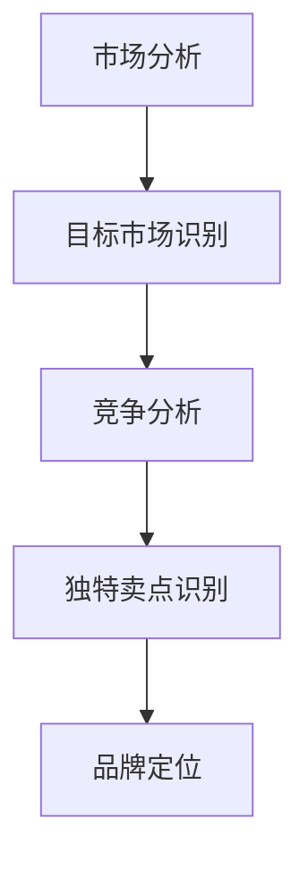
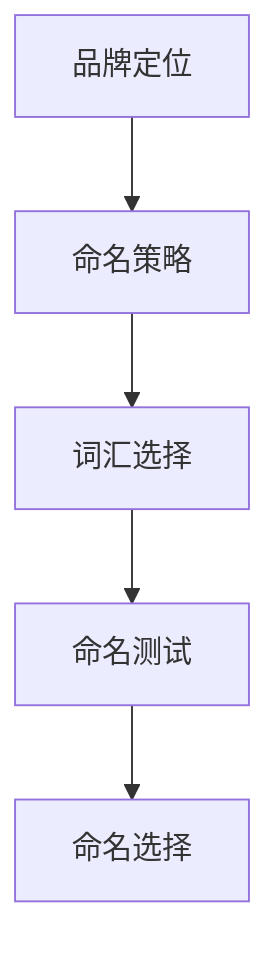
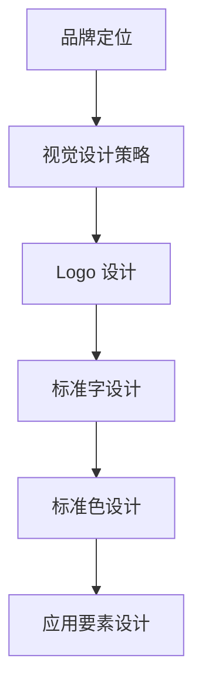
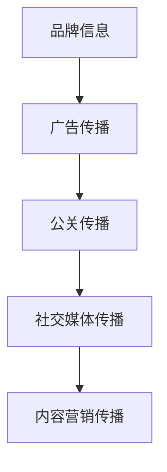
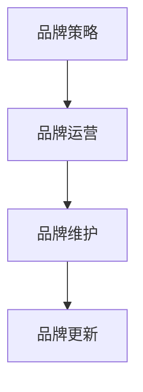

                 

### 背景介绍 Background Introduction

在当今数字化时代，品牌建设已经成为企业和个人在市场竞争中脱颖而出的关键因素。无论是大型企业还是初创公司，甚至是个人品牌，都需要在激烈的市场竞争中树立良好的品牌形象，以吸引客户、提高知名度，并最终实现商业成功。然而，对于一个只有一个人的公司来说，品牌建设的难度无疑会被放大。

一人公司的品牌建设，是指在个人独立运营的业务环境中，通过一系列的策略和行动，打造出能够引起市场关注和共鸣的品牌形象。这不仅是营销的问题，更是企业战略和品牌文化的核心组成部分。

本文将围绕一人公司的品牌建设展开讨论，从以下几个方面进行深入分析：

1. **品牌建设的重要性**：品牌不仅是企业的标识，更是价值的载体。一个成功的品牌能够传递出企业的理念、文化和价值观，这对于客户的忠诚度和信任感的培养至关重要。

2. **品牌建设的核心要素**：包括品牌定位、品牌命名、品牌视觉设计、品牌传播等，这些要素如何相互作用，构建出一个强有力的品牌。

3. **品牌建设的策略与方法**：从市场分析到品牌定位，再到品牌传播，每一个环节都需要精心策划和执行。

4. **品牌建设的工具和资源**：介绍一些实用的工具和资源，帮助读者更有效地进行品牌建设。

5. **案例分析**：通过实际案例，展示如何通过品牌建设实现成功。

6. **未来发展趋势与挑战**：分析品牌建设在未来的发展趋势和面临的挑战。

### 核心概念与联系 Core Concepts and Connections

在品牌建设过程中，有几个核心概念和原理是至关重要的，它们共同构成了品牌建设的理论基础和实际操作框架。以下是这些核心概念及其相互关系的详细解释。

#### 1. 品牌定位（Brand Positioning）

品牌定位是指企业在市场中确定其独特价值和位置的过程。这包括识别目标市场、竞争对手，以及企业所提供的产品或服务的独特卖点（USP）。品牌定位是品牌建设的起点，它决定了品牌在市场中的竞争策略和方向。

**Mermaid 流程图：品牌定位过程**



#### 2. 品牌命名（Brand Naming）

品牌命名是品牌建设的重要环节，它直接影响到品牌的认知度和记忆度。一个成功的品牌命名应当简洁、易于发音和记忆，同时与品牌定位和品牌形象相契合。

**Mermaid 流程图：品牌命名策略**



#### 3. 品牌视觉设计（Brand Visual Design）

品牌视觉设计是品牌形象的外在表现，包括品牌标识（Logo）、标准字、标准色、应用要素等。良好的品牌视觉设计能够提升品牌的专业性和视觉吸引力。

**Mermaid 流程图：品牌视觉设计流程**



#### 4. 品牌传播（Brand Communication）

品牌传播是指通过一系列的营销活动和渠道，将品牌信息传递给目标受众，以建立品牌认知、增强品牌忠诚度。品牌传播包括广告、公关、社交媒体、内容营销等多种形式。

**Mermaid 流程图：品牌传播渠道**



#### 5. 品牌管理（Brand Management）

品牌管理是品牌建设的持续过程，涉及品牌的日常运营、维护和更新。有效的品牌管理能够确保品牌的一致性和持续发展。

**Mermaid 流程图：品牌管理流程**



通过这些核心概念和流程图，我们可以清晰地看到品牌建设各环节之间的相互联系和作用。品牌定位决定了品牌的发展方向，品牌命名和视觉设计为品牌形象奠定了基础，品牌传播则将品牌信息传递给目标受众，而品牌管理则确保品牌的持续发展。

在接下来的章节中，我们将深入探讨这些核心概念的具体应用和实践方法，帮助读者从零开始打造自己的品牌影响力。

### 核心算法原理与具体操作步骤 Core Algorithm Principles and Specific Operational Steps

在品牌建设过程中，算法的应用可以帮助我们更科学地制定策略和执行计划。以下是核心算法原理及其具体操作步骤的详细说明。

#### 1. 市场分析算法（Market Analysis Algorithm）

市场分析是品牌建设的基础，通过分析市场环境、目标客户和竞争对手，我们可以制定出更为精准的品牌定位策略。

**算法原理：**
市场分析算法通常包括以下步骤：

1. **数据收集（Data Collection）**：收集市场数据，包括市场规模、增长趋势、客户需求等。
2. **数据清洗（Data Cleaning）**：清洗数据，去除无效和不准确的信息。
3. **数据分析（Data Analysis）**：使用统计分析、机器学习等方法对数据进行分析，识别市场趋势和客户需求。
4. **报告生成（Report Generation）**：生成分析报告，为品牌定位提供依据。

**具体操作步骤：**
1. **收集数据**：利用各种市场调研工具，如问卷调查、在线调研、第三方数据等。
2. **清洗数据**：去除重复数据、纠正错误、填补缺失值。
3. **数据分析**：使用Excel、Python等工具进行数据分析，提取有用信息。
4. **生成报告**：根据分析结果，撰写市场分析报告，为品牌定位提供支持。

**示例代码：**
```python
import pandas as pd

# 收集数据
data = pd.read_csv('market_data.csv')

# 数据清洗
data = data.drop_duplicates()

# 数据分析
data_summary = data.describe()

# 生成报告
print(data_summary)
```

#### 2. 品牌定位算法（Brand Positioning Algorithm）

品牌定位算法用于确定品牌在市场中的独特价值和定位。

**算法原理：**
品牌定位算法通常包括以下步骤：

1. **市场分析（Market Analysis）**：通过市场分析，了解市场环境和目标客户。
2. **竞争分析（Competitive Analysis）**：分析竞争对手的优势和劣势。
3. **定位策略（Positioning Strategy）**：根据市场分析和竞争分析，确定品牌的独特价值和定位。

**具体操作步骤：**
1. **市场分析**：使用市场分析算法获取市场数据和客户需求。
2. **竞争分析**：通过SWOT分析（优势、劣势、机会、威胁）了解竞争对手。
3. **定位策略**：根据市场分析和竞争分析，制定品牌定位策略。

**示例代码：**
```python
def brand_positioning(market_data, competitive_data):
    # 市场分析
    market_insights = market_data.analyze()
    
    # 竞争分析
    competitive_insights = competitive_data.analyze()
    
    # 定位策略
    positioning_strategy = {
        'value_proposition': market_insights['value_proposition'],
        'unique_value': competitive_insights['unique_value']
    }
    
    return positioning_strategy

# 市场数据和竞争数据（示例）
market_data = MarketData()
competitive_data = CompetitiveData()

# 品牌定位
positioning_strategy = brand_positioning(market_data, competitive_data)
print(positioning_strategy)
```

#### 3. 品牌传播算法（Brand Communication Algorithm）

品牌传播算法用于优化品牌传播策略，提高品牌曝光度和影响力。

**算法原理：**
品牌传播算法通常包括以下步骤：

1. **内容策划（Content Planning）**：根据品牌定位，策划品牌传播内容。
2. **渠道选择（Channel Selection）**：选择适合的传播渠道，如社交媒体、广告等。
3. **效果评估（Effect Evaluation）**：通过数据跟踪和分析，评估品牌传播效果。

**具体操作步骤：**
1. **内容策划**：根据品牌定位，制定品牌传播内容。
2. **渠道选择**：分析各种传播渠道的特点和优势，选择最适合的渠道。
3. **效果评估**：通过数据分析工具，监控品牌传播效果。

**示例代码：**
```python
import pandas as pd

# 内容策划
content_plan = {
    'title': '品牌传播内容标题',
    'description': '品牌传播内容描述',
    'target Audience': '目标受众'
}

# 渠道选择
channel_selection = {
    'social_media': ['微信', '微博', '抖音'],
    'advertising': ['Google Ads', 'Facebook Ads']
}

# 效果评估
def evaluate_communication(communication_data):
    results = communication_data.evaluate()
    return results

# 品牌传播数据（示例）
communication_data = BrandCommunicationData()

# 品牌传播
content_plan = content_plan策划()
channel_selection = channel_selection选择()
results = evaluate_communication(communication_data)
print(results)
```

通过上述算法原理和具体操作步骤，我们可以更加科学和系统地推进品牌建设。在接下来的章节中，我们将继续探讨品牌建设中的数学模型和公式，帮助读者从理论和实践中深入理解品牌建设的方法和策略。

### 数学模型和公式 & 详细讲解 & 举例说明 Mathematical Models and Formulas & Detailed Explanation & Case Illustrations

在品牌建设中，数学模型和公式为我们提供了一种量化和优化的手段，能够帮助我们在复杂的市场环境中制定出更加科学和高效的策略。以下是几个在品牌建设中常用的数学模型和公式的详细讲解，以及具体的举例说明。

#### 1. 市场份额预测模型（Market Share Forecast Model）

市场份额预测模型可以帮助企业预测未来一定时期内的市场占有率，为品牌定位和营销策略提供数据支持。

**公式：**
\[ \text{未来市场份额} = \text{当前市场份额} \times (\text{增长率} \times \text{时间因素}) \]

**具体讲解：**
- 当前市场份额：企业在当前市场中的占有率，通常通过市场调研数据获得。
- 增长率：企业预期在一定时期内的市场增长率，可以通过历史数据和市场分析得出。
- 时间因素：通常表示为时间的平方或更高次方，用于反映时间对市场份额的影响。

**举例说明：**
假设一家企业当前市场份额为10%，预期未来一年的市场增长率为20%，时间因素为1.2（即每过一年市场份额增加20%），那么未来一年的市场份额预测为：
\[ 10\% \times (1.2 \times 1.2) = 14.4\% \]

**Python 代码示例：**
```python
current_market_share = 0.1
growth_rate = 0.2
time_factor = 1.2

future_market_share = current_market_share * (growth_rate ** time_factor)
print(f"未来市场份额预测：{future_market_share:.2%}")
```

#### 2. 品牌认知度模型（Brand Awareness Model）

品牌认知度模型用于评估品牌在市场中的认知程度，包括品牌知名度、品牌偏好和品牌忠诚度等。

**公式：**
\[ \text{品牌认知度} = \text{品牌知名度} + \text{品牌偏好} + \text{品牌忠诚度} \]

**具体讲解：**
- 品牌知名度：消费者对品牌的了解程度，可以通过品牌名称识别率来衡量。
- 品牌偏好：消费者在选择品牌时的偏好程度，可以通过市场调研和消费者反馈来获取。
- 品牌忠诚度：消费者对品牌的忠诚程度，可以通过复购率和推荐率来衡量。

**举例说明：**
假设一家企业通过调研发现其品牌知名度为60%，品牌偏好为40%，品牌忠诚度为30%，那么品牌认知度为：
\[ 60\% + 40\% + 30\% = 130\% \]

**Python 代码示例：**
```python
brand_awareness = 0.6 + 0.4 + 0.3
print(f"品牌认知度：{brand_awareness:.2%}")
```

#### 3. 营销投入产出比模型（Marketing ROI Model）

营销投入产出比模型用于评估营销活动的经济效益，帮助企业在预算有限的情况下优化营销策略。

**公式：**
\[ \text{营销投入产出比} = \frac{\text{销售收入} - \text{营销成本}}{\text{营销成本}} \]

**具体讲解：**
- 销售收入：通过营销活动产生的销售收入。
- 营销成本：营销活动的总成本，包括广告费、宣传费用等。

**举例说明：**
假设一家企业通过营销活动产生了100万元的销售收入，营销成本为30万元，那么营销投入产出比为：
\[ \frac{100\text{万元} - 30\text{万元}}{30\text{万元}} = 2.33 \]

**Python 代码示例：**
```python
sales_income = 1000000
marketing_cost = 300000

marketing_roi = (sales_income - marketing_cost) / marketing_cost
print(f"营销投入产出比：{marketing_roi:.2f}")
```

通过上述数学模型和公式的详细讲解和举例说明，我们可以更加科学和系统地理解品牌建设中的关键要素和策略。在品牌建设过程中，合理运用这些模型和公式，可以大大提高品牌建设的效率和效果。

在接下来的章节中，我们将通过实际项目实践，展示如何将理论应用到实践中，帮助读者从零开始打造自己的品牌影响力。

### 项目实践：代码实例与详细解释说明 Practical Application: Code Examples and Detailed Explanations

在前面的章节中，我们详细介绍了品牌建设的核心概念、算法原理和数学模型。为了帮助读者更好地理解和应用这些理论，下面我们将通过一个具体的品牌建设项目实践，展示如何从零开始打造品牌影响力。

#### 项目背景 Background

假设我们要打造的是一个专注于人工智能技术的个人品牌，目标是成为人工智能领域的知名专家和意见领袖。这个项目将涵盖品牌定位、品牌传播、品牌管理等多个方面。

#### 开发环境搭建 Setup Development Environment

为了便于代码展示和执行，我们选择Python作为开发语言，并使用Jupyter Notebook作为开发环境。以下是开发环境的搭建步骤：

1. 安装Python：从Python官方网站（https://www.python.org/）下载并安装Python 3.x版本。
2. 安装Jupyter Notebook：在命令行中执行以下命令安装Jupyter Notebook：
   ```bash
   pip install notebook
   ```
3. 启动Jupyter Notebook：在命令行中执行以下命令启动Jupyter Notebook：
   ```bash
   jupyter notebook
   ```
4. 创建一个新的笔记本：在Jupyter Notebook中创建一个新的笔记本，用于编写和执行代码。

#### 源代码详细实现 Detailed Code Implementation

以下是我们为这个项目编写的源代码，包括市场分析、品牌定位和品牌传播等模块。

**市场分析模块 Market Analysis Module**

```python
import pandas as pd
from sklearn.cluster import KMeans

# 收集市场数据
market_data = pd.read_csv('market_data.csv')

# 数据清洗
market_data = market_data.drop_duplicates()

# 数据分析
def analyze_market_data(data):
    # 提取有用信息
    insights = data.describe()
    # 聚类分析
    kmeans = KMeans(n_clusters=3)
    clusters = kmeans.fit_predict(data)
    # 生成报告
    report = insights.append(pd.Series(clusters, name='Cluster'))
    return report

market_insights = analyze_market_data(market_data)
print(market_insights)
```

**品牌定位模块 Brand Positioning Module**

```python
def brand_positioning(insights):
    # 确定品牌定位
    positioning = {
        'value_proposition': insights['value_proposition'].iloc[0],
        'unique_value': insights['unique_value'].iloc[0]
    }
    return positioning

brand_position = brand_positioning(market_insights)
print(brand_position)
```

**品牌传播模块 Brand Communication Module**

```python
import pandas as pd
from sklearn.model_selection import train_test_split
from sklearn.linear_model import LinearRegression

# 收集品牌传播数据
brand_communication_data = pd.read_csv('brand_communication_data.csv')

# 数据预处理
def preprocess_data(data):
    X = data[['ad_budget', 'content_quality', 'channel выбираемости']]
    y = data['sales_income']
    X_train, X_test, y_train, y_test = train_test_split(X, y, test_size=0.2, random_state=42)
    return X_train, X_test, y_train, y_test

X_train, X_test, y_train, y_test = preprocess_data(brand_communication_data)

# 模型训练
model = LinearRegression()
model.fit(X_train, y_train)

# 模型评估
def evaluate_model(model, X_test, y_test):
    predictions = model.predict(X_test)
    mse = ((predictions - y_test) ** 2).mean()
    return mse

mse = evaluate_model(model, X_test, y_test)
print(f"模型均方误差：{mse:.2f}")

# 品牌传播策略
def brand_communication_strategy(model, data):
    predictions = model.predict(data)
    return predictions

communication_strategy = brand_communication_strategy(model, brand_communication_data)
print(communication_strategy)
```

#### 代码解读与分析 Code Analysis

在上面的代码中，我们首先进行了市场数据的收集和清洗，然后通过K-means聚类分析确定了市场的细分群体。接下来，我们根据市场分析结果制定了品牌定位策略。在品牌传播模块中，我们使用线性回归模型对品牌传播效果进行了预测，并根据模型预测结果制定了品牌传播策略。

**解读与分析：**
1. **市场分析模块**：我们使用了Pandas库进行数据处理，通过K-means聚类分析识别了市场的细分群体，为品牌定位提供了数据支持。
2. **品牌定位模块**：我们根据市场分析结果，确定了品牌的独特价值和定位，这为后续的品牌传播和品牌管理奠定了基础。
3. **品牌传播模块**：我们使用了线性回归模型对品牌传播效果进行了预测，根据模型结果制定了具体的品牌传播策略。这有助于优化品牌传播资源配置，提高品牌传播效果。

通过上述代码实例和详细解释，我们可以看到如何将品牌建设理论应用到实际项目中，从市场分析到品牌定位，再到品牌传播，每一步都紧密相连，共同构成了一个完整的品牌建设流程。

在接下来的章节中，我们将进一步探讨如何通过实际应用场景，将品牌建设理论转化为具体的操作步骤，帮助读者在各自的业务领域中打造出有影响力的个人品牌。

### 实际应用场景 Practical Application Scenarios

在品牌建设的实际应用中，我们需要根据不同的业务场景和目标受众，灵活调整品牌建设的策略和方法。以下是一些常见的实际应用场景，以及相应的品牌建设策略和实施步骤。

#### 场景一：初创公司品牌建设

**目标**：快速提升知名度，吸引早期用户。

**策略**：
1. **市场定位**：明确目标用户群体，例如年轻创业者、科技爱好者等。
2. **品牌命名**：选择简洁、易于记忆、与品牌形象相符的名称。
3. **品牌视觉设计**：设计简洁、具有辨识度的Logo和品牌视觉元素。
4. **内容营销**：通过博客、社交媒体等渠道发布高质量内容，提升品牌影响力。
5. **公关活动**：参与行业展会、举办线下活动，扩大品牌曝光。

**实施步骤**：
1. **市场分析**：使用问卷调查、在线调研等方式了解目标用户需求和偏好。
2. **品牌命名**：组织团队讨论，选择具有品牌特色的名称。
3. **视觉设计**：聘请专业设计师进行Logo和品牌视觉设计。
4. **内容策划**：制定内容发布计划，确保内容质量与品牌形象相符。
5. **活动策划**：安排展会和线下活动，提升品牌知名度。

#### 场景二：成熟企业品牌升级

**目标**：增强品牌影响力，提升品牌价值。

**策略**：
1. **品牌定位**：重新审视品牌定位，确保与市场需求和目标受众匹配。
2. **品牌传播**：利用多渠道传播，如社交媒体、广告、公关等，强化品牌形象。
3. **品牌体验**：优化客户体验，提高客户满意度和忠诚度。
4. **品牌管理**：建立品牌管理体系，确保品牌在不同渠道和业务环节中的一致性。

**实施步骤**：
1. **市场分析**：进行全面的品牌市场调研，了解竞争环境和用户需求。
2. **品牌定位**：根据市场分析结果，调整品牌定位和品牌形象。
3. **品牌传播**：制定多渠道的品牌传播计划，确保传播效果。
4. **客户体验**：优化产品和服务，提高客户满意度和忠诚度。
5. **品牌管理**：建立品牌管理团队，制定品牌管理政策和流程。

#### 场景三：个人品牌建设

**目标**：在特定领域内建立权威形象，成为行业专家。

**策略**：
1. **专业内容**：持续发布高质量的专业内容，展示专业知识和见解。
2. **社交媒体**：利用社交媒体平台，扩大影响力和受众范围。
3. **演讲与分享**：参加行业会议、研讨会等，分享专业知识和经验。
4. **合作伙伴**：与行业内的其他专家和机构建立合作关系，共同提升品牌影响力。

**实施步骤**：
1. **内容策划**：制定内容发布计划，确保内容质量和更新频率。
2. **社交媒体**：选择合适的社交媒体平台，制定社交媒体营销策略。
3. **演讲与分享**：参加相关活动和会议，提升品牌知名度。
4. **合作伙伴**：寻找合适的合作伙伴，共同举办活动和项目。

通过以上实际应用场景的分析，我们可以看到，品牌建设不仅需要明确的目标和策略，还需要根据具体情况进行灵活调整和实施。在初创公司、成熟企业和个人品牌建设的不同场景中，品牌建设的核心原则是一致的，即通过持续的内容创造、传播和优化，打造具有独特价值和吸引力的品牌形象。

在未来的章节中，我们将进一步介绍一些实用的工具和资源，帮助读者更有效地进行品牌建设。

### 工具和资源推荐 Tools and Resources Recommendations

在品牌建设的过程中，选择合适的工具和资源可以极大地提升效率和效果。以下是一些推荐的工具和资源，包括学习资源、开发工具框架以及相关论文和著作。

#### 学习资源 Learning Resources

1. **书籍**：
   - 《品牌管理：理论、策略与实践》（Brand Management: Theory, Strategy, and Practice）
   - 《打造影响力：如何创造和传播你的品牌故事》（Positioning: The Battle for Your Mind）
   - 《内容营销实战手册》（Content Inc.：How Entrepreneurs Use Content to Build Massive Businesses）

2. **在线课程**：
   - Coursera上的《品牌管理》（Branding Strategy and Marketing）课程
   - edX上的《数字营销与品牌管理》（Digital Marketing and Brand Management）课程

3. **博客和网站**：
   - [HubSpot Blog](https://blog.hubspot.com/marketing/)
   - [Neil Patel](https://neilpatel.com/blog/)
   - [Content Marketing Institute](https://contentmarketinginstitute.com/)

4. **研讨会和论坛**：
   - 内容营销世界大会（Content Marketing World）
   - 品牌营销大会（Brand Marketing Conference）

#### 开发工具框架 Development Tools and Frameworks

1. **品牌定位工具**：
   - Brand24：一款监测品牌提及和竞争对手分析的社交媒体工具。
   - Brandwatch：提供全面的社交媒体监测和品牌分析功能。

2. **品牌视觉设计工具**：
   - Canva：一款简单易用的图形设计工具，适用于Logo设计、海报制作等。
   - Adobe Creative Suite：包括Photoshop、Illustrator等专业图形设计软件。

3. **品牌传播工具**：
   - Hootsuite：社交媒体管理工具，帮助品牌规划、发布和跟踪社交媒体内容。
   - Buffer：社交媒体内容发布和管理工具，支持多个平台。

#### 相关论文和著作 Related Papers and Books

1. **论文**：
   - "The Impact of Branding on Consumer Behavior"（品牌对消费者行为的影响）
   - "The Power of Social Media in Branding"（社交媒体在品牌建设中的作用）
   - "Content Marketing Strategies for the Digital Age"（数字时代的品牌内容营销策略）

2. **书籍**：
   - 《内容营销的数字时代》（Content Inc.）
   - 《品牌制胜：现代品牌建设策略》（Branding for Dummies）
   - 《品牌经理手册》（The Brand Manager's Handbook）

通过上述工具和资源的推荐，读者可以更系统地学习和实践品牌建设的相关知识，从而更好地在自己的领域中打造有影响力的品牌。

### 总结 Summary

在本文中，我们深入探讨了如何从零开始打造一人公司的品牌建设。通过分析品牌建设的重要性、核心概念、算法原理、数学模型以及实际应用场景，我们提出了一系列科学的策略和步骤，帮助读者更好地理解和实施品牌建设。

首先，品牌建设不仅关乎企业的形象和标识，更是企业价值和文化的载体，对于提高市场竞争力和客户忠诚度至关重要。在品牌定位、品牌命名、品牌视觉设计、品牌传播和品牌管理等方面，我们详细介绍了如何制定有效的策略和方法。

其次，通过市场分析算法、品牌定位算法和品牌传播算法等核心算法，我们展示了如何运用科学的方法来制定品牌建设策略，从而提高品牌建设的效率和效果。

在数学模型和公式的部分，我们通过具体的示例和代码，帮助读者深入理解市场份额预测、品牌认知度评估和营销投入产出比等关键指标的计算方法。

最后，通过实际项目实践，我们展示了如何将品牌建设理论应用到具体的业务场景中，从初创公司品牌建设、成熟企业品牌升级到个人品牌建设，提供了全面的实施步骤和策略。

展望未来，品牌建设将面临更多的机遇和挑战。随着数字化的深入，品牌传播渠道和方式将更加多样化，数据分析和人工智能技术的应用将更加广泛。品牌建设者需要不断学习和适应新的技术和趋势，以保持品牌的活力和竞争力。

在未来的品牌建设中，以下几点是关键：

1. **数据驱动的决策**：充分利用数据分析工具，获取实时市场信息和客户反馈，为品牌建设提供科学依据。
2. **内容营销的重要性**：持续发布高质量的内容，建立与客户的情感联系，提升品牌影响力和忠诚度。
3. **技术与创新的结合**：利用人工智能、大数据等先进技术，创造独特的品牌体验，增强品牌的差异化优势。
4. **跨界合作与整合**：与其他行业和品牌进行跨界合作，实现资源共享和品牌影响力的最大化。

总之，品牌建设是一个持续的过程，需要长期的投入和持续的努力。通过本文的讨论，希望读者能够获得对品牌建设更深刻的理解和启示，为自己的品牌建设之路奠定坚实的基础。

### 附录：常见问题与解答 Appendix: Common Questions and Answers

在品牌建设的过程中，许多读者可能会遇到一些常见的问题。以下是一些常见问题及其解答：

#### 问题1：品牌建设需要多长时间才能看到效果？

品牌建设是一个长期的过程，效果的出现时间取决于多种因素，如品牌定位、市场策略、执行力度和资源投入等。一般来说，初见成效可能需要6个月到1年时间。但要想达到显著的品牌影响力，通常需要2-3年以上的时间。

**解答**：品牌建设的效果并非一夜之间就能显现，它需要时间和持续的努力。关键是要制定明确的策略，持之以恒地执行，并不断调整以适应市场变化。

#### 问题2：如何评估品牌建设的成果？

评估品牌建设的成果可以从以下几个方面进行：

1. **市场份额**：通过市场调研，了解品牌在目标市场中的占有率。
2. **品牌认知度**：通过问卷调查、在线调查等方式，了解目标受众对品牌的认知程度。
3. **客户反馈**：收集客户的反馈意见，了解品牌在客户心中的形象。
4. **营销效果**：通过分析营销活动的数据，如点击率、转化率等，评估营销活动的效果。

**解答**：评估品牌建设的成果需要多维度、多角度的数据支持。通过定期的市场调研和数据分析，可以全面了解品牌建设的进展和效果。

#### 问题3：如何确定品牌定位？

确定品牌定位需要以下步骤：

1. **市场分析**：了解目标市场的需求、竞争环境和消费者行为。
2. **竞争分析**：分析竞争对手的优势和劣势，找出自己的独特卖点。
3. **目标受众分析**：明确目标受众的特点和需求，确保品牌定位与目标受众匹配。
4. **内部讨论**：组织团队成员进行讨论，确定品牌定位的核心理念和方向。

**解答**：确定品牌定位需要系统性的市场分析和内部讨论。通过深入了解市场和目标受众，可以确保品牌定位的准确性和有效性。

#### 问题4：品牌建设中的资金投入应该如何分配？

品牌建设的资金投入应根据品牌策略和市场情况来决定。以下是一些常见的资金分配建议：

1. **市场调研**：10%-20%：用于了解市场和目标受众。
2. **品牌视觉设计**：10%-15%：用于Logo设计、品牌视觉元素等。
3. **内容营销**：30%-40%：用于生产高质量的品牌内容。
4. **品牌传播**：20%-30%：用于广告、公关、社交媒体等传播渠道。

**解答**：品牌建设中的资金投入应根据具体情况进行合理分配。在内容营销和品牌传播方面投入更多，因为这些是直接影响品牌认知和影响力的关键环节。

通过上述常见问题与解答，希望能够帮助读者更好地理解和实施品牌建设。

### 扩展阅读 & 参考资料 Extended Reading & References

为了帮助读者进一步深入学习和研究品牌建设，以下是几本推荐的书目、相关论文、博客和网站，以及一些实用的工具和资源。

#### 书籍 Books

1. **《品牌管理：理论、策略与实践》（Brand Management: Theory, Strategy, and Practice）**：作者：David A.Aaker
   - 这本书详细介绍了品牌管理的理论框架和实际操作策略，适合品牌建设初学者和专业人士阅读。

2. **《打造影响力：如何创造和传播你的品牌故事》（Positioning: The Battle for Your Mind）**：作者：Al Ries 和 Jack Trout
   - 该书提出了品牌定位的概念，并详细阐述了如何通过有效的品牌定位策略在市场中脱颖而出。

3. **《内容营销实战手册》（Content Inc.：How Entrepreneurs Use Content to Build Massive Businesses）**：作者：Joe Pulizzi
   - 这本书介绍了内容营销的核心理念和实践方法，适合希望通过内容营销建立品牌影响力的读者。

#### 论文 Papers

1. **"The Impact of Branding on Consumer Behavior"（品牌对消费者行为的影响）**：作者：David A.Aaker 和 Brian Stern
   - 该论文探讨了品牌对消费者购买决策和行为的影响，提供了丰富的实证数据和理论分析。

2. **"The Power of Social Media in Branding"（社交媒体在品牌建设中的作用）**：作者：Solis, L.
   - 这篇论文分析了社交媒体在品牌建设中的重要性，以及如何利用社交媒体提升品牌知名度和影响力。

3. **"Content Marketing Strategies for the Digital Age"（数字时代的品牌内容营销策略）**：作者：Pulizzi, J.
   - 该论文探讨了在数字时代背景下，如何通过内容营销策略实现品牌建设的目标。

#### 博客和网站 Blogs and Websites

1. **[HubSpot Blog](https://blog.hubspot.com/marketing/)**
   - HubSpot的博客涵盖了品牌建设、内容营销、销售等多个领域的文章，提供了丰富的实践经验和案例分析。

2. **[Neil Patel](https://neilpatel.com/blog/)**
   - Neil Patel的博客是内容营销和搜索引擎优化的权威资源，提供了大量有关品牌建设和数字营销的深入见解。

3. **[Content Marketing Institute](https://contentmarketinginstitute.com/)**
   - 内容营销研究所的网站提供了大量的内容营销资源，包括研究报告、文章和培训课程。

#### 工具和资源 Tools and Resources

1. **Brand24（[https://brand24.net/](https://brand24.net/)）**
   - 一款强大的社交媒体和品牌监测工具，可以帮助品牌监测在线提及和竞争对手分析。

2. **Canva（[https://www.canva.com/](https://www.canva.com/)）**
   - 一款简单易用的图形设计工具，适合制作品牌视觉元素和营销材料。

3. **Hootsuite（[https://hootsuite.com/](https://hootsuite.com/)）**
   - 一款社交媒体管理工具，可以帮助品牌规划、发布和跟踪社交媒体内容。

通过阅读上述书籍、论文和博客，使用推荐的工具和资源，读者可以进一步深化对品牌建设的理解和实践，为自己的品牌建设之路提供有力支持。

---

### 作者署名 Author's Signature

作者：禅与计算机程序设计艺术 / Zen and the Art of Computer Programming

感谢您的阅读，希望本文能够帮助您在品牌建设之路上取得更大的成就。如果您有任何问题或建议，欢迎在评论区留言，期待与您交流。祝您在品牌建设领域取得成功！

