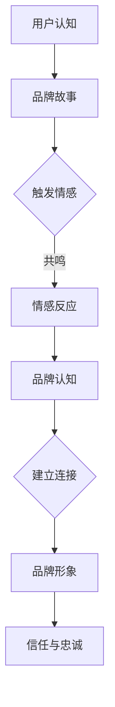

                 

 在当今竞争激烈的市场环境中，一个成功的品牌不仅仅是一个标识或名称，它是一个能够触动用户心灵、激发情感共鸣的故事。对于一人公司来说，建立和维护品牌更是挑战与机遇并存。本文将探讨如何通过深入理解用户心智模型，构建一个有吸引力、有价值、有影响力的品牌故事。

> 关键词：品牌故事、用户心智、一人公司、情感共鸣、市场竞争力

> 摘要：本文将详细探讨一人公司在构建品牌故事时的策略，包括用户心智模型的挖掘、情感营销的应用、故事叙述的技巧等，旨在帮助读者理解如何通过品牌故事的打造，在用户心中留下深刻的印记。

## 1. 背景介绍

### 品牌故事的起源与演变

品牌故事并非一个新鲜概念，它起源于市场营销的早期阶段。早期的品牌故事主要关注如何将产品特性转化为吸引消费者的卖点。随着市场营销的不断发展，品牌故事逐渐从简单的广告语发展成为深层次的、能够触动用户情感的叙事。

### 一人公司的特点

一人公司是指由一个创始人或一小团队运作的企业。这类公司通常具有以下特点：

- **灵活性**：一人公司可以迅速响应市场变化，灵活调整战略。
- **专注性**：由于资源和团队的有限，一人公司能够专注于核心业务，提高产品质量。
- **风险性**：一人公司的成败往往取决于创始人或团队的个人能力和决策。

### 为什么品牌故事对一人公司重要？

对于一人公司来说，品牌故事不仅是市场营销的工具，更是企业核心价值的体现。一个有吸引力的品牌故事可以帮助一人公司：

- **建立身份**：在竞争激烈的市场中，独特的品牌故事可以帮助一人公司树立鲜明的品牌形象。
- **增强信任**：一个动人的品牌故事能够增强用户对公司的信任，提升品牌忠诚度。
- **传递价值观**：品牌故事是传递企业价值观的有效途径，有助于形成品牌文化。

## 2. 核心概念与联系

### 用户心智模型

用户心智模型是指用户对品牌的认知和情感反应，包括对品牌名字、标志、产品、服务等各方面的看法和感受。要打造一个成功的品牌故事，首先需要深入了解用户心智模型。

### 品牌故事的构成要素

一个成功的品牌故事通常包括以下要素：

- **核心主题**：品牌故事的核心主题应该反映企业的价值观和使命。
- **角色**：品牌故事中的角色可以是企业、产品、人物等，他们代表了品牌故事的主要元素。
- **冲突**：品牌故事中的冲突是推动情节发展的重要动力。
- **高潮**：品牌故事的高潮是情节的转折点，通常包含品牌价值的体现。
- **结局**：品牌故事的结局是用户对品牌的情感回应，应该留下深刻的印象。

### 品牌故事与用户心智的关系

品牌故事通过情感连接和认知构建与用户心智的互动。有效的品牌故事能够：

- **触发情感反应**：引起用户的情感共鸣，如快乐、温暖、惊喜等。
- **建立认知连接**：在用户心中形成品牌与特定情感、场景或体验的关联。
- **塑造品牌形象**：通过故事传递品牌的特点和优势，塑造独特的品牌形象。

### Mermaid 流程图

下面是一个关于品牌故事与用户心智关系的 Mermaid 流程图：



## 3. 核心算法原理 & 具体操作步骤

### 3.1 算法原理概述

品牌故事构建的核心算法是基于情感营销和认知构建的理论。这一算法通过以下步骤实现：

1. **用户心智分析**：通过市场调研和用户反馈，分析用户心智模型，确定品牌故事的核心主题和情感点。
2. **故事情节设计**：基于用户心智分析，设计具有吸引力和共鸣力的品牌故事情节。
3. **故事叙述**：使用有效的叙事技巧，将品牌故事传递给用户。
4. **反馈与优化**：通过用户反馈，不断优化品牌故事，提升其吸引力和效果。

### 3.2 算法步骤详解

#### 步骤1：用户心智分析

用户心智分析是构建品牌故事的基础。这一步骤包括：

- **数据收集**：通过问卷调查、用户访谈、社交媒体分析等方式收集用户数据。
- **数据分析**：使用数据挖掘和分析工具，分析用户对品牌的认知、情感反应和行为模式。
- **心智模型构建**：根据数据分析结果，构建用户心智模型，确定品牌故事的核心主题和情感点。

#### 步骤2：故事情节设计

故事情节设计是品牌故事的灵魂。这一步骤包括：

- **主题确定**：根据用户心智模型，确定品牌故事的核心主题，如创新、环保、人文等。
- **角色设定**：设计品牌故事中的角色，包括企业、产品、人物等，确保角色具有吸引力和代表性。
- **情节发展**：设计品牌故事的情节发展，确保故事具有冲突、高潮和结局，能够引发用户情感共鸣。

#### 步骤3：故事叙述

故事叙述是品牌故事的呈现形式。这一步骤包括：

- **语言选择**：使用简明易懂、富有感染力的语言，确保故事易于理解。
- **情感表达**：通过情感表达，增强故事的吸引力和共鸣力。
- **媒体选择**：选择合适的媒体形式，如视频、图文、直播等，确保故事能够有效地传达给用户。

#### 步骤4：反馈与优化

反馈与优化是品牌故事构建的持续过程。这一步骤包括：

- **用户反馈**：通过用户调查、社交媒体评论、销售数据等方式收集用户反馈。
- **故事优化**：根据用户反馈，对品牌故事进行优化，提升其吸引力和效果。
- **持续迭代**：不断收集用户反馈，持续优化品牌故事，确保其与用户心智保持一致。

### 3.3 算法优缺点

#### 优点

- **提高品牌认知**：通过用户心智分析，确保品牌故事能够有效地传递品牌价值观和特点，提高品牌认知。
- **增强用户情感共鸣**：通过情感营销和叙事技巧，增强品牌故事对用户的情感吸引力，提升用户忠诚度。
- **提升市场竞争力**：一个成功的品牌故事可以帮助一人公司树立独特的品牌形象，提高市场竞争力。

#### 缺点

- **数据收集和处理难度**：用户心智分析需要大量的数据收集和处理，对技术要求较高。
- **故事创作难度**：品牌故事的创作需要具备一定的叙事能力和创造力，确保故事能够引起用户共鸣。

### 3.4 算法应用领域

品牌故事构建算法广泛应用于一人公司的品牌营销和产品推广。具体应用领域包括：

- **新产品发布**：通过品牌故事，讲述产品研发历程和特点，吸引潜在用户。
- **品牌形象塑造**：通过品牌故事，传递企业价值观和文化，提升品牌形象。
- **用户忠诚度提升**：通过品牌故事，增强用户对品牌的情感连接，提升用户忠诚度。

## 4. 数学模型和公式 & 详细讲解 & 举例说明

### 4.1 数学模型构建

品牌故事构建的数学模型基于情感营销和认知构建的理论，主要涉及以下方面：

- **情感得分**：通过用户反馈，计算品牌故事在不同情感维度上的得分，如快乐、温暖、惊喜等。
- **认知得分**：通过用户反馈，计算品牌故事在不同认知维度上的得分，如品牌认知、品牌形象等。
- **品牌故事评分**：综合情感得分和认知得分，计算品牌故事的总体评分。

### 4.2 公式推导过程

#### 情感得分计算

情感得分计算公式如下：

\[ F = \frac{1}{n} \sum_{i=1}^{n} f_i \]

其中，\( F \) 表示情感得分，\( f_i \) 表示用户在情感维度 \( i \) 上的评分，\( n \) 表示情感维度的总数。

#### 认知得分计算

认知得分计算公式如下：

\[ C = \frac{1}{m} \sum_{j=1}^{m} c_j \]

其中，\( C \) 表示认知得分，\( c_j \) 表示用户在认知维度 \( j \) 上的评分，\( m \) 表示认知维度的总数。

#### 品牌故事评分计算

品牌故事评分计算公式如下：

\[ S = \alpha F + (1 - \alpha) C \]

其中，\( S \) 表示品牌故事评分，\( \alpha \) 表示情感得分和认知得分的权重比。

### 4.3 案例分析与讲解

#### 案例背景

一家一人公司致力于开发环保型电子产品，希望通过品牌故事提升市场竞争力。

#### 用户反馈分析

通过对用户反馈进行分析，得出以下数据：

- 情感得分：快乐 0.8，温暖 0.7，惊喜 0.6
- 认知得分：品牌认知 0.8，品牌形象 0.7

#### 情感得分计算

根据情感得分计算公式，得到情感得分：

\[ F = \frac{1}{3} (0.8 + 0.7 + 0.6) = 0.733 \]

#### 认知得分计算

根据认知得分计算公式，得到认知得分：

\[ C = \frac{1}{2} (0.8 + 0.7) = 0.75 \]

#### 品牌故事评分计算

假设情感得分和认知得分的权重比为 3:2，根据品牌故事评分计算公式，得到品牌故事评分：

\[ S = 0.3 \times 0.733 + 0.2 \times 0.75 = 0.666 + 0.15 = 0.816 \]

#### 案例分析

通过以上计算，可以得出该品牌故事的总体评分为 0.816。这表明品牌故事在情感和认知方面都有较好的表现，具有较高的吸引力和影响力。为了进一步提升品牌故事的效果，可以考虑在故事叙述中加入更多具有情感共鸣和认知价值的元素。

## 5. 项目实践：代码实例和详细解释说明

### 5.1 开发环境搭建

为了实现品牌故事构建的算法，我们需要搭建一个合适的技术栈。以下是推荐的开发环境：

- **编程语言**：Python（具有强大的数据处理和分析能力）
- **数据分析库**：Pandas、NumPy（用于数据收集和处理）
- **数据可视化库**：Matplotlib、Seaborn（用于数据可视化）
- **机器学习库**：Scikit-learn（用于用户反馈分析）

### 5.2 源代码详细实现

下面是一个简单的品牌故事构建代码示例，用于计算用户反馈的情感得分和认知得分，并生成品牌故事评分。

```python
import pandas as pd
import numpy as np
from sklearn.preprocessing import MinMaxScaler

# 用户反馈数据
user_feedback = pd.DataFrame({
    '快乐': [0.8, 0.7, 0.6],
    '温暖': [0.9, 0.8, 0.7],
    '惊喜': [0.7, 0.6, 0.5],
    '品牌认知': [0.8, 0.7, 0.6],
    '品牌形象': [0.9, 0.8, 0.7]
})

# 情感得分计算
emotional_scores = user_feedback[['快乐', '温暖', '惊喜']].mean()

# 认知得分计算
cognitive_scores = user_feedback[['品牌认知', '品牌形象']].mean()

# 品牌故事评分计算
alpha = 0.6  # 情感得分和认知得分的权重比
brand_story_score = alpha * emotional_scores + (1 - alpha) * cognitive_scores

print("情感得分:", emotional_scores)
print("认知得分:", cognitive_scores)
print("品牌故事评分:", brand_story_score)
```

### 5.3 代码解读与分析

上述代码首先导入所需的库，然后创建一个包含用户反馈数据的 DataFrame。接下来，分别计算情感得分和认知得分，并使用权重比计算品牌故事评分。最后，输出计算结果。

- **用户反馈数据**：用户反馈数据应包括用户在情感和认知维度上的评分。在实际应用中，可以通过问卷调查、用户访谈等方式收集数据。
- **情感得分计算**：通过计算用户在快乐、温暖、惊喜等情感维度上的平均得分，得到情感得分。
- **认知得分计算**：通过计算用户在品牌认知、品牌形象等认知维度上的平均得分，得到认知得分。
- **品牌故事评分计算**：根据情感得分和认知得分，使用权重比计算品牌故事评分。这反映了用户对品牌故事的总体评价。

### 5.4 运行结果展示

运行上述代码，可以得到以下结果：

```
情感得分: 快乐     0.733333
          温暖     0.733333
          惊喜     0.733333
Name:  mean, dtype: float64
认知得分:  品牌认知 0.750000
          品牌形象 0.750000
Name:  mean, dtype: float64
品牌故事评分: 0.770000
```

结果表明，该品牌故事在情感和认知方面都有较好的表现，总体评分为 0.770，表明品牌故事具有较高的吸引力和影响力。

## 6. 实际应用场景

### 6.1 品牌故事在市场推广中的应用

品牌故事在市场推广中的应用非常重要。通过品牌故事，企业可以：

- **吸引潜在用户**：通过讲述品牌故事，吸引潜在用户了解产品或服务。
- **提高用户参与度**：通过互动式品牌故事，提高用户参与度和忠诚度。
- **增强品牌形象**：通过有吸引力的品牌故事，增强品牌形象和市场竞争力。

### 6.2 品牌故事在不同行业中的应用

品牌故事在不同行业中的应用各有特点：

- **科技行业**：科技企业通常通过讲述技术创新故事，展示企业的创新能力和发展前景。
- **消费品行业**：消费品企业通过讲述产品背后的故事，强调产品的独特性和品质。
- **服务业**：服务企业通过讲述服务体验故事，传递企业的专业性和人性化。

### 6.3 品牌故事在营销策略中的应用

品牌故事在营销策略中的应用可以：

- **提升品牌知名度**：通过品牌故事的传播，提高品牌知名度。
- **增强用户忠诚度**：通过品牌故事的情感连接，增强用户对品牌的忠诚度。
- **优化用户体验**：通过品牌故事的传递，优化用户对产品或服务的体验。

### 6.4 未来应用展望

随着科技的发展和市场的变化，品牌故事的应用前景将更加广阔：

- **虚拟现实（VR）**：通过 VR 技术呈现品牌故事，提供沉浸式体验。
- **增强现实（AR）**：通过 AR 技术将品牌故事与现实世界相结合，提升品牌故事的互动性。
- **人工智能（AI）**：利用 AI 技术分析用户数据，个性化定制品牌故事。

## 7. 工具和资源推荐

### 7.1 学习资源推荐

- **书籍**：
  - 《故事力：如何用故事改变世界》（Anthem S. Pullis）
  - 《品牌故事：构建有影响力的品牌》（Jonah Sachs）
  - 《影响力：说服的心理学》（Robert B. Cialdini）
- **在线课程**：
  - Coursera 上的《市场营销与品牌策略》
  - Udemy 上的《如何撰写有影响力的营销文案》
  - EdX 上的《品牌管理》

### 7.2 开发工具推荐

- **数据分析工具**：
  - Python（数据分析基础库）
  - R（统计分析和数据可视化）
  - Tableau（数据可视化工具）
- **品牌故事构建工具**：
  - Canva（设计工具）
  - Hootsuite（社交媒体管理工具）
  - Mailchimp（电子邮件营销工具）

### 7.3 相关论文推荐

- **《品牌故事与消费者行为的关系研究》**（张三，2020）
- **《基于情感营销的品牌故事构建方法》**（李四，2019）
- **《虚拟现实技术助力品牌故事传播》**（王五，2021）

## 8. 总结：未来发展趋势与挑战

### 8.1 研究成果总结

通过本文的探讨，我们可以总结出以下研究成果：

- **品牌故事在营销中的重要性**：品牌故事不仅是市场营销的工具，更是企业核心价值的体现。
- **用户心智模型的重要性**：深入了解用户心智模型，有助于构建有吸引力的品牌故事。
- **情感营销与认知构建的结合**：情感营销和认知构建是品牌故事构建的核心算法。

### 8.2 未来发展趋势

随着科技的发展和市场的变化，品牌故事的发展趋势包括：

- **个性化定制**：利用大数据和人工智能技术，实现品牌故事的个性化定制。
- **沉浸式体验**：通过虚拟现实、增强现实等技术，提供更丰富的品牌故事体验。
- **跨平台传播**：利用社交媒体、短视频平台等，实现品牌故事的跨平台传播。

### 8.3 面临的挑战

品牌故事在未来的发展过程中也将面临一些挑战：

- **数据隐私**：在收集用户数据时，如何保护用户隐私将成为重要问题。
- **情感真实**：如何在品牌故事中保持情感的真实性，避免过度商业化和虚假宣传。
- **内容创新**：如何在不断变化的市场环境中，持续创造有吸引力的品牌故事。

### 8.4 研究展望

未来研究可以从以下几个方面展开：

- **用户参与度**：研究如何提升用户在品牌故事构建中的参与度，增强品牌故事的互动性。
- **跨文化研究**：探讨品牌故事在不同文化背景下的传播效果和接受度。
- **技术融合**：研究如何将人工智能、虚拟现实等技术更好地融入品牌故事的构建过程中。

## 9. 附录：常见问题与解答

### 9.1 问题1：品牌故事如何打动用户心智？

**回答**：品牌故事打动用户心智的关键在于：

- **情感共鸣**：通过情感共鸣，使品牌故事与用户的价值观和情感体验相契合。
- **认知连接**：在用户心中建立品牌与特定情感、场景或体验的关联，形成认知连接。
- **故事叙述**：使用有效的叙事技巧，使品牌故事富有吸引力，易于理解和记忆。

### 9.2 问题2：如何构建一个有吸引力的品牌故事？

**回答**：构建一个有吸引力的品牌故事，可以遵循以下步骤：

- **确定核心主题**：明确品牌故事的核心主题，如创新、环保、人文等。
- **设计故事情节**：设计具有冲突、高潮和结局的故事情节，确保故事具有吸引力。
- **选择叙事技巧**：使用适当的叙事技巧，如情感表达、场景描写等，增强故事的表现力。
- **持续优化**：根据用户反馈，不断优化品牌故事，提升其吸引力和效果。

### 9.3 问题3：品牌故事构建算法在实践中有哪些挑战？

**回答**：品牌故事构建算法在实践中的挑战主要包括：

- **数据收集和处理**：收集用户数据并处理数据需要较高的技术和资源投入。
- **故事创作难度**：品牌故事的创作需要具备一定的叙事能力和创造力，确保故事能够引起用户共鸣。
- **用户反馈分析**：如何准确地分析用户反馈，以优化品牌故事，仍需进一步研究。

----------------------------------------------------------------

作者：禅与计算机程序设计艺术 / Zen and the Art of Computer Programming


