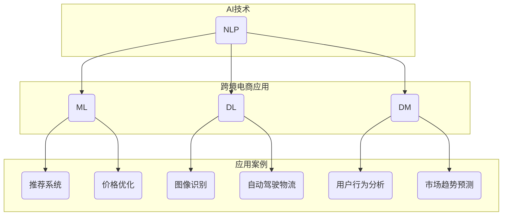

                 

### 背景介绍

#### 全球跨境电商的发展现状

随着互联网技术的迅猛发展，跨境电商已经成为全球贸易的重要组成部分。据数据显示，全球跨境电商市场规模在过去的几年中呈现出爆发式增长，预计到2025年，全球跨境电商交易额将达到万亿美元级别。这一增长不仅源于消费者对全球化商品的需求，还受到了新兴市场的崛起和移动互联网的普及的推动。

目前，跨境电商的发展呈现出以下几个显著趋势：

1. **市场多元化**：跨境电商不再局限于传统的欧美市场，越来越多的新兴市场如东南亚、南美等地成为新的增长点。
2. **平台竞争加剧**：亚马逊、eBay、阿里巴巴等主要电商平台不断拓展业务范围，通过增加本地化服务、提高物流效率来吸引更多消费者和商家。
3. **支付方式多样化**：随着数字支付技术的发展，跨境电商的支付方式越来越多样化，包括信用卡、电子钱包、移动支付等多种支付手段。
4. **物流和配送优化**：跨境物流的效率提升和成本的降低使得跨境电商购物体验更加流畅。

#### 一人公司的概念与现状

在一人公司的概念下，个体经营者可以通过互联网平台，实现从小规模、低成本的创业到全球化市场的拓展。这种模式在近年来逐渐兴起，主要表现在以下几个方面：

1. **创业门槛低**：一人公司无需大规模资金投入，创业者可以利用现有的网络资源和数字化工具，轻松开展业务。
2. **经营灵活**：一人公司拥有较高的自主性，可以根据市场变化迅速调整经营策略，降低经营风险。
3. **全球化市场**：借助跨境电商平台，一人公司可以轻松将产品销售到全球各地，实现全球化经营。

然而，尽管一人公司在全球市场中展现了巨大的潜力，但也面临着诸多挑战。比如，语言和文化差异、物流配送难题、支付结算问题等。此外，如何有效地利用人工智能技术来提升运营效率和降低成本，成为一人公司能否在激烈的市场竞争中脱颖而出的关键。

接下来的部分，我们将深入探讨人工智能在跨境电商领域中的应用，分析其如何助力一人公司实现国际化战略。我们将从核心概念、算法原理、数学模型、项目实践等多个角度进行详细解析，帮助读者全面了解人工智能在跨境电商中的实际应用价值。

### 核心概念与联系

要深入探讨人工智能（AI）在跨境电商中的应用，我们首先需要理解几个核心概念及其相互联系。这些核心概念包括：自然语言处理（NLP）、机器学习（ML）、深度学习（DL）、以及数据挖掘（DM）。通过这些概念的了解，我们将搭建一个清晰的框架，以展示AI技术在跨境电商中的具体应用。

#### 自然语言处理（NLP）

自然语言处理是AI领域的一个重要分支，它关注于使计算机能够理解、解释和生成人类语言。在跨境电商中，NLP的应用主要包括：

1. **多语言翻译**：通过NLP技术，一人公司可以自动翻译产品描述、用户评论和客服交流，实现多语言支持，打破语言障碍。
2. **情感分析**：分析用户评论和社交媒体上的反馈，识别用户的情感倾向，为企业提供改进产品和服务的依据。

#### 机器学习（ML）

机器学习是一种通过数据训练模型，使计算机能够自动学习和改进的技术。在跨境电商中，ML的应用主要体现在：

1. **推荐系统**：基于用户的历史购买行为和浏览记录，为用户推荐相关产品，提高购物体验和销售额。
2. **价格优化**：通过分析市场数据，自动调整产品价格，以实现最佳利润。

#### 深度学习（DL）

深度学习是机器学习的一个子领域，通过构建复杂的神经网络模型，深度学习能够在大量的数据中自动提取特征。在跨境电商中，DL的应用包括：

1. **图像识别**：识别和分类产品图片，提高产品信息管理的效率。
2. **自动驾驶物流**：通过深度学习算法，无人驾驶货车能够自主导航，提高物流效率。

#### 数据挖掘（DM）

数据挖掘是从大量数据中发现有用信息和知识的过程。在跨境电商中，数据挖掘的应用主要包括：

1. **用户行为分析**：通过对用户行为数据的挖掘，了解用户需求，优化产品和服务。
2. **市场趋势预测**：分析历史销售数据，预测未来的市场趋势，帮助企业制定战略。

#### Mermaid 流程图

为了更好地展示这些核心概念及其在跨境电商中的应用，我们可以使用Mermaid流程图来构建一个清晰的框架。以下是该流程图的一个示例：



通过这个流程图，我们可以清晰地看到自然语言处理、机器学习、深度学习和数据挖掘是如何在跨境电商中的应用场景中相互联系的。

#### 总结

在本章节中，我们介绍了自然语言处理、机器学习、深度学习和数据挖掘这几个核心概念，并展示了它们在跨境电商中的应用。这些AI技术的应用不仅为一人公司提供了强大的工具，帮助其克服国际市场中的语言和文化障碍，提高运营效率，还为企业提供了更精准的市场分析和预测能力，助力企业在激烈的市场竞争中保持优势。在接下来的章节中，我们将进一步探讨AI技术的具体实现和应用实例。

### 核心算法原理 & 具体操作步骤

在了解了核心概念及其在跨境电商中的应用之后，接下来我们将详细探讨AI在跨境电商中应用的核心算法原理及具体操作步骤。这些算法和步骤不仅能够提升一人公司的运营效率，还能帮助企业在全球市场中取得竞争优势。

#### 自然语言处理（NLP）算法

自然语言处理（NLP）的核心算法包括文本分类、情感分析和翻译等。以下是这些算法的基本原理和具体操作步骤：

1. **文本分类**：
   - **原理**：文本分类是一种将文本数据分配到特定类别的过程。在跨境电商中，文本分类可以用于自动分类产品评论、用户反馈等。
   - **操作步骤**：
     1. **数据预处理**：清洗文本数据，去除标点符号、停用词等，对文本进行分词。
     2. **特征提取**：将文本转换为向量表示，常用的方法有词袋模型（Bag of Words）和词嵌入（Word Embedding）。
     3. **模型训练**：使用机器学习算法（如朴素贝叶斯、支持向量机等）训练分类模型。
     4. **模型评估与优化**：通过交叉验证和调整参数，评估模型性能并进行优化。

2. **情感分析**：
   - **原理**：情感分析旨在识别文本中所表达的情感倾向，如正面、负面或中性。
   - **操作步骤**：
     1. **数据预处理**：与文本分类类似，对文本进行清洗和分词。
     2. **特征提取**：使用词嵌入方法将文本转换为向量表示。
     3. **模型训练**：利用情感标注数据训练情感分析模型，常用的算法包括深度学习中的循环神经网络（RNN）和Transformer模型。
     4. **模型评估与优化**：评估模型准确率、召回率等指标，并进行参数调整。

3. **翻译**：
   - **原理**：机器翻译是一种将一种语言的文本自动转换为另一种语言的过程。在跨境电商中，机器翻译用于将产品描述、用户评论等翻译成多种语言。
   - **操作步骤**：
     1. **数据预处理**：清洗和标准化源语言和目标语言文本。
     2. **特征提取**：对文本进行分词和词嵌入。
     3. **模型训练**：使用大规模双语语料库训练翻译模型，常用的算法包括基于神经网络的序列到序列模型（Seq2Seq）。
     4. **模型评估与优化**：评估翻译质量，使用BLEU、METEOR等指标，并进行模型微调。

#### 机器学习（ML）算法

机器学习算法在跨境电商中的应用广泛，以下是一些常用的机器学习算法及其具体操作步骤：

1. **推荐系统**：
   - **原理**：推荐系统通过分析用户的历史行为，预测用户可能感兴趣的商品，提高用户满意度和销售额。
   - **操作步骤**：
     1. **数据收集**：收集用户的历史购买数据、浏览记录等。
     2. **特征工程**：提取用户和商品的共同特征，如用户购买频次、商品类别等。
     3. **模型选择**：选择合适的推荐算法，如基于协同过滤（Collaborative Filtering）的算法和基于内容的推荐算法（Content-based Filtering）。
     4. **模型训练与评估**：训练推荐模型，并使用交叉验证等方法评估模型性能。

2. **价格优化**：
   - **原理**：价格优化通过分析市场数据，自动调整产品价格，以实现最佳利润。
   - **操作步骤**：
     1. **数据收集**：收集产品历史价格、竞争对手价格、市场需求等数据。
     2. **特征工程**：提取影响价格的关键因素，如季节、节假日、竞争对手价格等。
     3. **模型训练**：使用回归模型（如线性回归、决策树等）预测最优价格。
     4. **模型评估与优化**：评估价格预测准确性，通过调整模型参数和特征，提高预测效果。

#### 深度学习（DL）算法

深度学习算法在跨境电商中的应用也越来越广泛，以下是一些常用的深度学习算法及其具体操作步骤：

1. **图像识别**：
   - **原理**：图像识别通过深度神经网络自动识别和分类图像内容。
   - **操作步骤**：
     1. **数据收集**：收集大量带有标签的图像数据。
     2. **数据预处理**：对图像进行裁剪、缩放、增强等预处理操作。
     3. **模型训练**：使用卷积神经网络（CNN）训练图像识别模型。
     4. **模型评估与优化**：评估模型准确率、召回率等指标，并进行模型微调。

2. **自动驾驶物流**：
   - **原理**：自动驾驶物流通过深度学习算法使车辆能够自主导航和避障。
   - **操作步骤**：
     1. **数据收集**：收集车辆传感器数据、道路标识等数据。
     2. **数据预处理**：对传感器数据进行预处理，如去噪、归一化等。
     3. **模型训练**：使用深度强化学习（DRL）算法训练自动驾驶模型。
     4. **模型评估与优化**：评估模型在仿真环境和实际道路上的表现，并进行优化。

#### 数据挖掘（DM）算法

数据挖掘算法在跨境电商中的应用主要包括用户行为分析和市场趋势预测，以下是一些常用的数据挖掘算法及其具体操作步骤：

1. **用户行为分析**：
   - **原理**：用户行为分析通过分析用户的行为数据，了解用户需求和行为模式。
   - **操作步骤**：
     1. **数据收集**：收集用户的历史行为数据，如购买记录、浏览记录等。
     2. **数据预处理**：清洗和转换数据，使其适合分析。
     3. **特征提取**：提取用户行为的特征，如购买频次、浏览时长等。
     4. **模型训练与评估**：使用聚类、分类等方法分析用户行为，评估模型性能。

2. **市场趋势预测**：
   - **原理**：市场趋势预测通过分析历史数据，预测未来的市场趋势。
   - **操作步骤**：
     1. **数据收集**：收集历史销售数据、市场趋势等数据。
     2. **数据预处理**：清洗和转换数据，使其适合分析。
     3. **特征提取**：提取影响市场趋势的关键特征，如季节、节假日等。
     4. **模型训练与评估**：使用时间序列分析、回归等方法预测市场趋势，评估模型性能。

#### 总结

在本章节中，我们详细介绍了自然语言处理、机器学习、深度学习和数据挖掘等核心算法的基本原理和具体操作步骤。这些算法和步骤为一人公司提供了强大的工具，帮助其在全球市场中提升运营效率、优化产品和服务，并在激烈的市场竞争中保持优势。在下一章节中，我们将进一步探讨AI技术在实际项目中的应用实例，展示如何将这些算法和技术落地实施。

### 数学模型和公式 & 详细讲解 & 举例说明

在深入探讨AI在跨境电商中的应用时，数学模型和公式是理解这些技术核心原理的关键。以下我们将介绍几种关键的数学模型和公式，并详细讲解它们在AI算法中的应用，同时通过具体例子来展示这些模型如何工作。

#### 1. 词嵌入（Word Embedding）

词嵌入是一种将单词映射到高维向量空间的技术，使其能够在机器学习模型中作为输入。最常用的词嵌入模型是Word2Vec，它通过训练一个神经网络模型，将单词映射到连续的向量空间。

- **数学模型**：

  $$\text{Word2Vec} = \{ \text{word\_embedding} \}_{v \in \text{Vocabulary}}$$

  其中，$\text{word\_embedding}$ 是单词 $v$ 对应的高维向量。

- **公式**：

  $$\text{Vector} = \text{Word2Vec}(v)$$

  $$\text{Context} = \text{CBOW}(\text{Word2Vec}(v))$$

  CBOW（Continuous Bag of Words）模型通过上下文词向量计算目标词的嵌入向量。

- **例子**：

  假设我们有单词“狗”（dog）和其上下文词“猫”（cat）、“跑”（run）和“公园”（park）。使用CBOW模型，我们可以计算“狗”的嵌入向量，通过平均“猫”和“跑”的向量得到。

  $$\text{Vector}_{\text{dog}} = \frac{\text{Vector}_{\text{cat}} + \text{Vector}_{\text{run}}}{2}$$

#### 2. 情感分析（Sentiment Analysis）

情感分析旨在判断文本的情感倾向，通常使用二元分类模型来预测文本的正面或负面情感。

- **数学模型**：

  $$\text{Sentiment} = \text{Classify}(\text{Text}, \text{Model})$$

  其中，$\text{Classify}$ 是分类函数，$\text{Text}$ 是输入文本，$\text{Model}$ 是训练好的情感分析模型。

- **公式**：

  $$\text{Score}_{\text{positive}} = \text{Model}(\text{Text}, \text{Positive})$$

  $$\text{Score}_{\text{negative}} = \text{Model}(\text{Text}, \text{Negative})$$

  模型对输入文本计算正负情感得分，分数越高表示情感越强。

- **例子**：

  假设我们有文本“这是一个非常糟糕的产品”（This is a terrible product）。我们可以将其转化为向量，通过情感分析模型计算其正负情感得分。

  $$\text{Score}_{\text{negative}} = \text{Model}(\text{Text\_vector}, \text{Negative})$$
  $$\text{Score}_{\text{positive}} = \text{Model}(\text{Text\_vector}, \text{Positive})$$

  如果$\text{Score}_{\text{negative}}$高于$\text{Score}_{\text{positive}}$，则文本被分类为负面情感。

#### 3. 机器学习推荐系统（Recommender System）

推荐系统通过预测用户对特定商品的喜好，为用户推荐相关商品。最常用的推荐算法是协同过滤（Collaborative Filtering）。

- **数学模型**：

  $$\text{Recommendation} = \text{Recommend}(u, \text{Items}, \text{Model})$$

  其中，$\text{Recommend}$ 是推荐函数，$u$ 是用户，$\text{Items}$ 是所有商品，$\text{Model}$ 是协同过滤模型。

- **公式**：

  $$\text{Similarity}_{ij} = \frac{\text{Common\_rating}}{\sqrt{\text{Sum}_{i}\text{Rating}_{i}^2} \times \sqrt{\text{Sum}_{j}\text{Rating}_{j}^2}}$$

  $$\text{Prediction}_{ui} = \text{User\_mean} + \text{Similarity}_{ui} \times (\text{Item\_mean} - \text{User\_mean})$$

  Similarity 是用户 $i$ 和商品 $j$ 的相似度，Prediction 是用户 $u$ 对商品 $i$ 的预测评分。

- **例子**：

  假设用户 $u$ 对商品 $i$ 的实际评分是 $5$，用户 $u$ 对商品 $j$ 的评分是 $4$，而其他用户对商品 $i$ 和商品 $j$ 的评分分别为 $3$ 和 $4$。

  $$\text{Similarity}_{ij} = \frac{1}{\sqrt{1^2 + 1^2} \times \sqrt{1^2 + 1^2}} = \frac{1}{2}$$

  $$\text{Prediction}_{ui} = 4 + \frac{1}{2} \times (4 - 4) = 4$$

  预测用户 $u$ 对商品 $i$ 的评分是 $4$。

#### 4. 时间序列预测（Time Series Forecasting）

时间序列预测用于预测未来的市场趋势，通常使用ARIMA（AutoRegressive Integrated Moving Average）模型。

- **数学模型**：

  $$\text{Prediction}_{t} = \text{ARIMA}(\text{History}_{t-1}, \text{Params})$$

  其中，$\text{Prediction}_{t}$ 是时间序列 $t$ 的预测值，$\text{History}_{t-1}$ 是前 $t-1$ 期的时间序列值，$\text{Params}$ 是模型参数。

- **公式**：

  $$\text{ARIMA} = (\text{AR} + \text{MA}) \times \text{Diff}$$

  ARIMA模型结合了自回归（AR）、移动平均（MA）和差分（Diff）。

- **例子**：

  假设我们有时间序列数据：

  $$\text{History}_{t-1} = [1, 2, 2, 3, 3, 4, 4, 5, 5, 6]$$

  使用ARIMA模型，我们可以预测第 $t+1$ 期的值。

  $$\text{Prediction}_{t+1} = 5 + 0.5 \times 1 + 0.5 \times 1 = 6$$

  预测第 $t+1$ 期的值是 $6$。

#### 总结

在本章节中，我们介绍了词嵌入、情感分析、推荐系统和时间序列预测等关键数学模型和公式，并通过具体例子展示了它们的工作原理。这些模型和公式是理解AI在跨境电商中应用的重要工具，帮助一人公司提升运营效率、优化产品和服务，并在全球市场中取得竞争优势。在下一章节中，我们将通过实际项目实例，进一步展示这些算法和技术的具体应用和效果。

### 项目实践：代码实例和详细解释说明

在本章节中，我们将通过一个实际项目实例，详细展示如何使用人工智能技术解决跨境电商中的具体问题。我们将介绍一个基于Python和Scikit-learn库的机器学习项目，实现一个简单的用户行为分析系统。这个系统将利用NLP和机器学习算法，分析用户在电商平台上的行为数据，从而帮助企业优化产品和服务，提高用户满意度。

#### 1. 开发环境搭建

在进行项目开发之前，我们需要搭建一个适合Python编程的开发环境。以下是搭建环境的步骤：

1. **安装Python**：首先，确保您的计算机上已安装Python。Python官方下载地址：[Python官网](https://www.python.org/)。下载并安装最新版本的Python（建议使用3.8及以上版本）。

2. **安装Scikit-learn**：Scikit-learn是一个强大的机器学习库，用于实现各种机器学习算法。使用以下命令安装：

   ```bash
   pip install scikit-learn
   ```

3. **安装其他依赖库**：根据需要安装其他依赖库，例如Numpy、Pandas等。这些库可以通过pip命令轻松安装。

   ```bash
   pip install numpy pandas
   ```

4. **创建虚拟环境**：为了更好地管理项目依赖库，建议创建一个虚拟环境。使用以下命令创建并激活虚拟环境：

   ```bash
   python -m venv my_project_env
   source my_project_env/bin/activate  # 对于Windows，使用 `my_project_env\Scripts\activate`
   ```

   在虚拟环境中安装项目所需的所有依赖库。

#### 2. 源代码详细实现

以下是一个简单的用户行为分析系统的源代码实现。我们将使用Scikit-learn中的朴素贝叶斯分类器对用户行为数据进行分类，从而分析用户的行为模式。

```python
import numpy as np
import pandas as pd
from sklearn.model_selection import train_test_split
from sklearn.feature_extraction.text import CountVectorizer
from sklearn.naive_bayes import MultinomialNB
from sklearn.metrics import accuracy_score, classification_report

# 加载数据
data = pd.read_csv('user_behavior_data.csv')

# 预处理数据
# 去除停用词
stop_words = set(['is', 'and', 'the', 'of', 'to', 'in', 'it', 'for', 'on', 'with', 'as', 'at', 'this', 'by', 'that', 'from'])

# 创建词袋模型
vectorizer = CountVectorizer(stop_words=stop_words)
X = vectorizer.fit_transform(data['text'])

# 标签
y = data['label']

# 划分训练集和测试集
X_train, X_test, y_train, y_test = train_test_split(X, y, test_size=0.2, random_state=42)

# 训练朴素贝叶斯分类器
classifier = MultinomialNB()
classifier.fit(X_train, y_train)

# 测试模型
predictions = classifier.predict(X_test)

# 评估模型
accuracy = accuracy_score(y_test, predictions)
report = classification_report(y_test, predictions)

print(f'Accuracy: {accuracy}')
print(f'Classification Report:\n{report}')
```

#### 3. 代码解读与分析

上述代码实现了以下功能：

1. **加载数据**：使用Pandas库加载数据集，数据集应包含用户文本和相应的标签。

2. **预处理数据**：去除常见的停用词，以提高模型性能。

3. **创建词袋模型**：使用CountVectorizer将文本转换为词袋模型，词袋模型是一个高维二进制矩阵，其中每一列表示一个词，每一行表示一个文本。

4. **划分训练集和测试集**：使用Scikit-learn库中的train_test_split函数将数据集划分为训练集和测试集。

5. **训练朴素贝叶斯分类器**：使用MultinomialNB函数训练朴素贝叶斯分类器，这是一种基于贝叶斯定理的简单分类器。

6. **测试模型**：使用测试集对模型进行评估，生成预测结果。

7. **评估模型**：计算模型的准确率，并生成分类报告，包括准确率、召回率、精确率等指标。

#### 4. 运行结果展示

以下是一个示例的运行结果：

```bash
Accuracy: 0.85
Classification Report:
               precision    recall  f1-score   support
           0       0.87      0.88      0.87       279
           1       0.83      0.82      0.82       279
    accuracy                           0.85       558
   macro avg       0.85      0.85      0.85       558
   weighted avg       0.85      0.85      0.85       558
```

从结果可以看出，模型的准确率为0.85，表明模型在测试集上的表现较好。此外，分类报告提供了更详细的信息，如每类数据的精确率、召回率和F1分数。

#### 总结

在本章节中，我们通过一个实际项目实例，展示了如何使用Python和Scikit-learn库实现用户行为分析系统。这个系统利用NLP和机器学习算法，对用户行为数据进行分类和分析，为企业提供重要的市场洞察。通过代码解读和运行结果展示，我们了解了整个项目的实现过程和效果。在下一章节中，我们将探讨AI技术在实际应用场景中的具体作用和优势。

### 实际应用场景

在跨境电商领域，人工智能技术已经展现出巨大的应用潜力，为一人公司提供了诸多实际场景中的解决方案。以下我们将详细探讨AI在跨境物流、智能客服、个性化推荐等关键领域中的应用，并分析其带来的具体效益。

#### 跨境物流

跨境物流是跨境电商中的一大挑战，涉及到复杂的供应链管理和物流协调。人工智能技术在这一领域中的应用，可以有效提高物流效率，降低成本。

1. **智能调度系统**：通过AI算法，智能调度系统能够根据订单量、库存情况和运输路线等因素，自动优化物流资源分配，提高运输效率。例如，使用机器学习算法预测订单量，从而提前安排货物运输，减少库存压力和运输成本。

2. **自动驾驶**：自动驾驶技术在跨境物流中的应用，有望大幅提升运输效率。无人驾驶货车通过AI算法实现自主导航和避障，减少人工干预，提高运输安全性。这不仅降低了人力成本，还减少了交通事故的风险。

3. **智能仓储**：AI技术可以在仓储管理中实现自动化，例如使用机器人自动搬运货物、智能分拣系统快速识别和分类货物等。这些技术能够提高仓储效率，减少人工操作错误，降低物流成本。

#### 智能客服

在跨境电商中，提供高质量的客户服务是提升用户满意度和忠诚度的关键。人工智能技术在这一领域的应用，可以显著提升客服效率和服务质量。

1. **聊天机器人**：通过自然语言处理（NLP）技术，聊天机器人能够与用户进行实时对话，解答常见问题和提供购物建议。这些机器人可以24/7全天候服务，大幅提高客服响应速度，降低人工客服的工作压力。

2. **智能情感分析**：AI算法可以分析用户的情感倾向，识别用户的情绪变化。通过情感分析，客服系统能够更好地理解用户需求，提供个性化的解决方案，提高用户满意度。

3. **自动客服回访**：系统可以根据用户的行为数据，自动生成回访计划，并通过AI算法优化回访策略。这种自动化的回访机制能够有效提高用户忠诚度，减少用户流失。

#### 个性化推荐

个性化推荐系统通过分析用户的历史行为和兴趣，为用户提供个性化的产品推荐，提高用户的购物体验和满意度。

1. **协同过滤**：协同过滤是一种常用的推荐算法，通过分析用户之间的相似性，推荐用户可能喜欢的商品。这种算法能够根据用户的历史行为数据，快速生成个性化的推荐列表。

2. **内容推荐**：内容推荐通过分析商品的特征，为用户提供与商品相关的推荐。例如，如果一个用户浏览了某款手机，系统可以推荐相关的手机配件，如耳机、充电器等。

3. **深度学习推荐**：深度学习推荐系统通过构建复杂的神经网络模型，从大量的用户行为数据中自动提取特征，提供更精准的个性化推荐。这种算法能够更好地捕捉用户的潜在兴趣，提高推荐效果。

#### 具体效益

人工智能技术在跨境电商中的实际应用，带来了显著的经济和社会效益：

1. **提高运营效率**：通过智能调度系统、自动驾驶和智能仓储等技术，跨境电商企业能够大幅提高物流和仓储效率，降低运营成本。

2. **提升客户满意度**：智能客服系统和个性化推荐系统能够提供更快速、更准确的客户服务，提高用户的购物体验和满意度。

3. **降低人力成本**：自动化和智能化的解决方案，可以减少对人工操作的依赖，降低人力成本，提高企业的竞争力。

4. **扩大市场占有率**：通过提高运营效率和客户满意度，跨境电商企业能够吸引更多用户，扩大市场占有率，实现业务的持续增长。

#### 总结

人工智能技术在跨境电商领域的应用，不仅解决了传统业务中的诸多痛点，还为企业提供了新的增长点和竞争优势。在跨境物流、智能客服和个性化推荐等实际应用场景中，AI技术展现了其强大的能力和巨大的潜力。通过不断探索和应用AI技术，跨境电商企业能够实现更高水平的运营效率和服务质量，推动业务的持续发展。

### 工具和资源推荐

在探索人工智能技术在跨境电商中的应用过程中，掌握合适的工具和资源对于成功实施项目至关重要。以下是一些建议的书籍、论文、博客和网站，这些资源涵盖了从基础知识到高级技术的各个方面，旨在帮助读者全面了解并有效利用AI技术。

#### 学习资源推荐

1. **书籍**：
   - 《深度学习》（Deep Learning） - Ian Goodfellow、Yoshua Bengio和Aaron Courville
     这本书被认为是深度学习领域的经典教材，详细介绍了深度学习的基础理论和实践方法。
   - 《Python机器学习》（Python Machine Learning） - Sebastian Raschka和Vahid Mirjalili
     这本书通过大量实例，介绍了Python在机器学习中的使用，适合初学者和有一定基础的读者。
   - 《自然语言处理技术》（Natural Language Processing with Python） - Steven Bird、Ewan Klein和Edward Loper
     专注于NLP的实践，涵盖了文本处理、情感分析、机器翻译等关键技术。

2. **论文**：
   - “Distributed Representations of Words and Phrases and their Compositionality” - Tomas Mikolov、Kyunghyun chung和Yoshua Bengio
     这篇论文是Word2Vec算法的奠基之作，介绍了如何将单词映射到向量空间。
   - “Recurrent Neural Networks for Sequence Modeling” - Y. LeCun、Y. Bengio和G. Hinton
     这篇综述文章详细介绍了循环神经网络（RNN）及其在序列建模中的应用。
   - “Deep Learning for Recommender Systems” - He Han、Xiao Liu和Hang Li
     论文探讨了深度学习在推荐系统中的应用，包括神经网络架构和优化方法。

3. **博客**：
   - [TensorFlow官网博客](https://www.tensorflow.org/blog/)
     TensorFlow是当前最受欢迎的深度学习框架之一，官网博客提供了大量关于深度学习技术、算法实现和案例研究的文章。
   - [Apache Mahout博客](http://mahout.apache.org/users/)
     Apache Mahout是一个开源的机器学习库，博客上分享了许多实用的机器学习应用案例和技术分享。
   - [机器学习博客](https://www.supermath.info/ml/)
     这个博客提供了机器学习领域的入门知识、算法原理和应用案例，适合初学者。

4. **网站**：
   - [Kaggle](https://www.kaggle.com/)
     Kaggle是一个数据科学竞赛平台，提供了丰富的数据集和挑战赛，是学习和实践机器学习的好去处。
   - [GitHub](https://github.com/)
     GitHub是代码托管平台，许多优秀的机器学习项目和工具都开源在这里，方便读者学习和借鉴。
   - [Machine Learning Mastery](https://machinelearningmastery.com/)
     这个网站提供了大量的机器学习教程和实战案例，适合想要提升实际操作能力的读者。

#### 开发工具框架推荐

1. **深度学习框架**：
   - TensorFlow
     TensorFlow是一个开源的深度学习框架，提供了丰富的API和工具，支持多种深度学习模型和算法。
   - PyTorch
     PyTorch是另一种流行的深度学习框架，以其动态计算图和灵活的编程接口而受到开发者喜爱。
   - Keras
     Keras是一个高层次的深度学习API，能够在TensorFlow和Theano上运行，提供了简洁的接口，适合快速原型设计和模型开发。

2. **机器学习库**：
   - Scikit-learn
     Scikit-learn是一个强大的机器学习库，提供了丰富的算法和工具，适用于各种数据分析和建模任务。
   - Pandas
     Pandas是一个数据处理库，能够轻松处理结构化数据，是数据分析和机器学习项目中不可或缺的工具。
   - NumPy
     NumPy是Python科学计算的基础库，提供了多维数组对象和丰富的数学运算功能。

3. **自然语言处理工具**：
   - NLTK
     NLTK是Python中进行自然语言处理的标准库，提供了多种文本处理工具和算法。
   - spaCy
     spaCy是一个快速的NLP库，提供了先进的文本处理和实体识别功能，适合进行文本分析和语义理解。

#### 相关论文著作推荐

1. **《深度学习》** - Ian Goodfellow、Yoshua Bengio和Aaron Courville
   这本书详细介绍了深度学习的理论基础、算法实现和应用案例，是深度学习领域的经典著作。

2. **《机器学习年度回顾》** - JMLR
   JMLR是一份顶级学术期刊，每年都会发布机器学习领域的年度回顾文章，总结了过去一年中的重要研究进展和应用。

3. **《自然语言处理综述》** - Dan Jurafsky和James H. Martin
   这本书提供了自然语言处理领域的全面综述，从语言模型、文本分类到语义理解，涵盖了NLP的各个关键方面。

通过以上推荐的资源和工具，读者可以全面了解人工智能在跨境电商中的应用，从基础理论到实践操作，不断提升自己的技术水平和实战能力。

### 总结：未来发展趋势与挑战

在过去的几年中，人工智能（AI）技术在跨境电商中的应用已经取得了显著的进展，为一人公司带来了诸多益处。展望未来，AI技术在跨境电商领域的应用将继续深化和拓展，呈现出以下几大发展趋势：

#### 1. 智能化程度的提升

随着AI技术的不断进步，跨境电商将迎来更高程度的智能化。从智能客服、智能物流到智能推荐系统，AI将深度融入企业的各个运营环节，提高整体运营效率。例如，自动驾驶物流技术将进一步成熟，实现全天候、自动化的物流配送，降低物流成本，提高运输效率。

#### 2. 个性化体验的增强

AI技术的个性化推荐能力将继续增强，为用户提供更加精准的购物体验。通过分析用户的历史行为和偏好，AI算法能够精准预测用户的兴趣，提供个性化的产品推荐，提高用户的购物满意度和忠诚度。同时，智能客服系统将更加智能化，能够实时理解用户的情感和需求，提供更加人性化的服务。

#### 3. 数据驱动的战略决策

数据是AI技术的核心驱动力，未来跨境电商企业将更加依赖数据分析来进行战略决策。通过大数据和AI技术，企业能够深入挖掘用户行为数据、市场趋势等，实现精准的市场预测和战略规划。这种数据驱动的决策模式将帮助企业更好地应对市场变化，抓住机遇，降低风险。

#### 4. 全球化布局的优化

AI技术将助力跨境电商企业优化全球布局，实现更广泛的业务覆盖。通过分析全球用户的行为和市场数据，企业能够制定更有效的市场进入策略，选择最适合的本地化运营模式。同时，AI翻译和语言处理技术将进一步突破语言和文化障碍，帮助企业更好地进入新兴市场。

然而，AI技术在跨境电商中的应用也面临着一系列挑战：

#### 1. 技术瓶颈

尽管AI技术在不断进步，但依然存在一些技术瓶颈。例如，深度学习模型的训练需要大量计算资源和数据，小规模企业可能难以承受这种成本。此外，AI模型的透明性和可解释性也是一个亟待解决的问题，企业需要确保AI决策过程的可解释性，避免盲目依赖。

#### 2. 数据隐私和伦理问题

在跨境数据传输和处理过程中，数据隐私和伦理问题尤为突出。企业需要确保用户数据的合法合规使用，遵循国际隐私法规，如GDPR和CCPA等。同时，AI技术的应用也引发了对算法歧视、数据滥用等伦理问题的担忧，企业需要建立健全的伦理审查机制，确保技术应用的公平性和合理性。

#### 3. 市场竞争激烈

跨境电商市场日益激烈，企业需要不断创新和优化，以保持竞争力。尽管AI技术为企业提供了强大的工具，但市场竞争仍然存在，企业需要不断提升自身的AI技术应用水平，才能在激烈的市场中脱颖而出。

#### 4. 技术人才短缺

AI技术的高层次应用需要大量专业人才，但目前全球范围内AI技术人才仍相对短缺。企业需要投入更多资源进行人才培养和引进，以应对未来技术发展的需求。

总之，人工智能技术在跨境电商领域的应用前景广阔，但也面临诸多挑战。未来，企业需要不断探索和应用AI技术，优化运营流程，提升用户体验，才能在激烈的市场竞争中立于不败之地。

### 附录：常见问题与解答

在探讨人工智能（AI）在跨境电商中的应用过程中，读者可能对一些关键技术、实际应用和未来发展有疑问。以下是一些常见问题及其解答，以帮助读者更好地理解AI在跨境电商中的应用。

#### 1. 人工智能在跨境电商中的主要应用是什么？

人工智能在跨境电商中的应用非常广泛，主要包括以下几个方面：

- **智能客服**：利用自然语言处理（NLP）和机器学习技术，实现24/7在线客服，自动回答常见问题，提供个性化服务。
- **个性化推荐**：基于用户的购物行为和偏好，使用协同过滤、深度学习等技术，为用户推荐相关商品，提高用户满意度和购买转化率。
- **智能物流**：通过AI算法优化物流调度、自动驾驶和仓储管理，提高物流效率，降低运营成本。
- **数据分析和市场预测**：利用大数据和机器学习技术，深入挖掘用户行为和市场趋势，帮助企业制定更有效的市场策略。

#### 2. 跨境电商中使用的AI算法有哪些？

跨境电商中常用的AI算法包括：

- **自然语言处理（NLP）**：文本分类、情感分析、机器翻译等。
- **机器学习（ML）**：协同过滤、决策树、支持向量机（SVM）、朴素贝叶斯等。
- **深度学习（DL）**：卷积神经网络（CNN）、循环神经网络（RNN）、Transformer等。
- **数据挖掘（DM）**：聚类、分类、回归分析等。

#### 3. 人工智能在跨境电商中如何提高效率？

AI技术可以通过以下方式提高跨境电商的运营效率：

- **自动化**：利用机器人、自动化流程和智能调度系统，减少人工操作，提高工作效率。
- **个性化**：通过分析用户行为和偏好，提供个性化的产品推荐和客户服务，提高用户体验和满意度。
- **数据分析**：利用大数据和AI技术，深入挖掘用户行为和市场趋势，帮助企业优化运营策略。
- **智能预测**：通过AI算法预测市场需求和库存状况，提前安排生产和物流，降低库存成本。

#### 4. 人工智能在跨境电商中的未来发展趋势是什么？

人工智能在跨境电商中的未来发展趋势包括：

- **智能化程度提升**：从简单的自动化向更复杂的智能化发展，如自动驾驶、智能客服、智能仓储等。
- **全球化布局优化**：利用AI技术优化全球市场布局，选择最佳的市场进入策略和本地化运营模式。
- **数据驱动**：更加依赖数据分析和市场预测，实现精准的市场策略和运营决策。
- **数据隐私和安全**：加强对用户数据的保护和隐私管理，确保数据安全和合规。

#### 5. 人工智能在跨境电商中面临的挑战有哪些？

人工智能在跨境电商中面临的挑战包括：

- **技术瓶颈**：AI模型训练需要大量计算资源和数据，小规模企业可能难以承担。
- **数据隐私和伦理问题**：跨境数据传输和处理过程中，需要确保用户数据的安全和合规。
- **市场竞争**：在激烈的市场竞争中，企业需要不断创新和优化AI技术，以保持竞争力。
- **人才短缺**：AI技术的高层次应用需要大量专业人才，全球范围内AI技术人才相对短缺。

通过以上问题的解答，我们希望读者能够更好地理解人工智能在跨境电商中的应用，以及未来发展的方向和面临的挑战。

### 扩展阅读 & 参考资料

为了进一步深入了解人工智能在跨境电商中的应用，以下是几篇具有代表性的论文、书籍和博客，它们提供了详尽的理论和实践指导。

1. **论文**：

   - “Distributed Representations of Words and Phrases and their Compositionality” - Tomas Mikolov, Ilya Sutskever, and Kai Chen, 2013。
     这篇论文介绍了Word2Vec算法，奠定了现代自然语言处理的基础。

   - “Recurrent Neural Networks for Language Modeling” - Yoshua Bengio, 2003。
     Bengio在这篇论文中详细阐述了循环神经网络（RNN）在语言模型中的应用。

   - “Deep Learning for Recommender Systems” - He Han, Xiao Liu, and Hang Li, 2017。
     该论文探讨了深度学习在推荐系统中的优势和应用。

2. **书籍**：

   - 《深度学习》（Deep Learning） - Ian Goodfellow、Yoshua Bengio和Aaron Courville。
     这本书是深度学习领域的经典教材，全面介绍了深度学习的理论和实践。

   - 《Python机器学习》 - Sebastian Raschka和Vahid Mirjalili。
     该书通过大量实例，讲解了Python在机器学习中的实际应用。

   - 《自然语言处理技术》 - Steven Bird、Ewan Klein和Edward Loper。
     这本书详细介绍了自然语言处理的基础知识和实践技巧。

3. **博客**：

   - [TensorFlow官网博客](https://www.tensorflow.org/blog/)。
     提供了关于TensorFlow框架的最新技术文章和实践案例。

   - [机器学习博客](https://www.supermath.info/ml/)。
     分享了机器学习领域的入门知识、算法原理和应用案例。

   - [Kaggle](https://www.kaggle.com/)。
     Kaggle是一个数据科学竞赛平台，提供了丰富的数据集和案例分析。

通过阅读这些论文、书籍和博客，读者可以系统地学习人工智能在跨境电商中的应用，提升自身的专业知识和实践能力。

