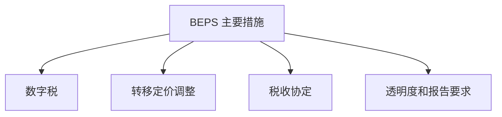
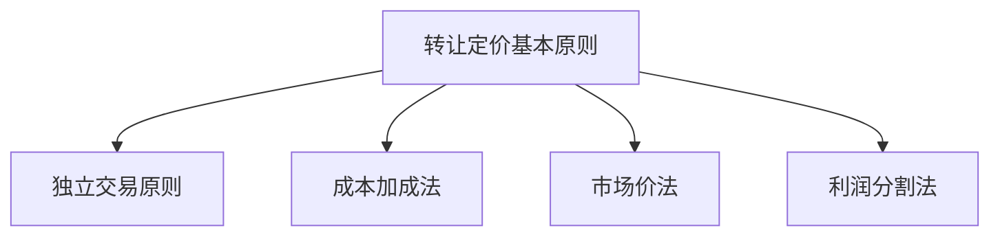
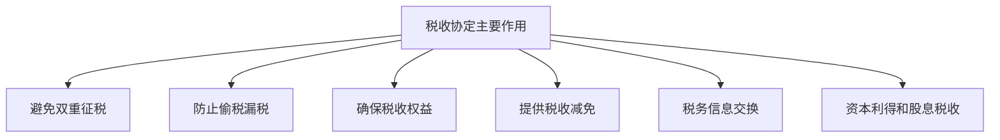

                 

### 1. 背景介绍

随着全球经济的快速发展，企业和个人在全球范围内的经济活动日益频繁，国际税务规划成为了众多企业和个人关注的重要问题。国际税务规划不仅涉及到税收筹划、税收减免等财务问题，还涉及到跨国经营、投资、贸易等多个领域。在这其中，一人公司作为独立法人，其税务规划尤为重要。

一人公司，也被称为独资公司，是指只有一个股东和经营者的公司。由于一人公司的独特性质，其税务规划需要考虑的方面更为复杂。首先，一人公司可能涉及到跨国经营，这就要求企业必须了解不同国家的税收政策和法律制度。其次，一人公司的所有者通常是公司经营者，这就需要处理好个人所得税与企业所得税的关系。此外，一人公司还可能涉及到资本利得、股息、利息等多种税收问题。

本文将围绕一人公司的国际税务规划展开，旨在帮助读者深入了解国际税务规划的核心概念、原则和具体操作步骤。文章将从以下几个方面进行详细探讨：

1. **国际税务规划的核心概念与联系**：介绍国际税务规划中的核心概念，如税基侵蚀与利润转移（BEPS）、转让定价、税收协定等，并通过 Mermaid 流程图展示这些概念之间的联系。

2. **核心算法原理与具体操作步骤**：详细解析国际税务规划的核心算法原理，包括税收筹划策略、税务合规性检查等，并提供具体的操作步骤。

3. **数学模型和公式**：介绍国际税务规划中常用的数学模型和公式，如边际税率计算、税负优化公式等，并通过具体例子进行详细讲解。

4. **项目实践**：通过代码实例，展示如何使用编程语言实现国际税务规划，包括开发环境搭建、源代码实现、代码解读与分析等。

5. **实际应用场景**：分析一人公司在国际税务规划中可能遇到的实际应用场景，并提供解决方案。

6. **工具和资源推荐**：推荐学习资源、开发工具框架和论文著作，帮助读者更深入地了解国际税务规划。

7. **总结与未来发展趋势**：总结国际税务规划的重要性，探讨未来发展趋势和面临的挑战。

通过本文的阅读，读者将能够全面了解一人公司的国际税务规划，掌握国际税务规划的核心知识和操作技能。接下来，我们将逐步深入探讨这些主题。

#### 1.1 一人公司的定义及其在国际税务规划中的重要性

一人公司，通常指的是由单一股东持有并经营的有限责任公司。根据不同国家和地区的法律规定，一人公司的定义和形式可能有所不同。例如，在某些国家，一人公司被称为个人独资企业，而在其他一些国家，则可能被称为单一股东有限责任公司（SSLC）或单一所有者公司（SAC）。

一人公司的优势在于其灵活的经营结构和较低的管理成本。由于只有一位股东，一人公司的决策过程通常更为迅速，管理架构相对简单，不需要复杂的董事会和监事会。此外，一人公司可以享受某些税收优惠政策，例如在税收申报、审计和会计要求等方面可能较为宽松。

在国际税务规划中，一人公司的特殊性质使其面临一系列独特的挑战和机会。首先，一人公司的所有者通常是公司经营者，这要求其必须同时考虑个人所得税和企业所得税的筹划。例如，如何合理划分个人和企业的收入，以实现税负的最优化，就是一人公司必须面对的问题。

其次，一人公司的跨国经营特征，使得其在国际税务规划中需要考虑不同国家的税收政策和法律制度。例如，企业在不同国家进行投资或贸易时，需要了解目的国的税制，包括公司税、增值税、个人所得税等，以及这些税种如何具体征收和计算。

此外，一人公司还可能涉及资本利得、股息、利息等多种税收问题。如何合理规划这些税收，避免双重征税，也是国际税务规划的重要内容。

总的来说，一人公司在国际税务规划中的重要性体现在以下几个方面：

1. **税收筹划**：一人公司需要通过合理的税收筹划，实现税负的最优化。这包括利用税收优惠政策、合理划分收入和费用、选择合适的投资和经营方式等。

2. **税务合规**：确保一人公司的税务行为符合各国税法的要求，避免因税务违规而面临罚款、诉讼等风险。

3. **跨国经营**：一人公司在国际市场上进行投资和贸易时，需要了解和适应不同国家的税制，以实现税务利益的最大化。

4. **个人与企业利益平衡**：一人公司所有者需要在个人所得税和企业所得税之间进行平衡，以实现个人和企业利益的最大化。

#### 1.2 全球化和税收制度变化对国际税务规划的影响

全球化的趋势使得国际税务规划变得日益复杂和重要。随着跨国企业数量和跨国交易的增多，不同国家和地区之间的税收政策和法律制度也在不断变化。这些变化对国际税务规划产生了深远的影响。

首先，全球化和税收制度变化使得国际税务规划需要考虑的因素更加多样化。企业不仅需要关注目的国的税收政策，还需要关注税收协定、转让定价规则、避税港利用等。例如，一些国家和地区为了吸引外资，会提供各种税收优惠措施，如税收减免、税收返还等。这些优惠措施可能需要企业满足特定的条件，如投资额度、雇佣人数等。企业需要根据这些条件，制定合理的国际税务规划策略。

其次，全球化和税收制度变化也使得国际税务规划面临更多的挑战。例如，跨国企业可能需要在不同国家同时申报和缴纳税款，这需要企业具备较高的税务合规性。此外，不同国家和地区的税收征管手段和力度也在不断加强，如国际税务审计、转让定价调整等。企业如果不进行合理的国际税务规划，可能会面临较高的税务风险。

此外，全球化和税收制度变化也带来了新的机遇。例如，一些国家和地区为了鼓励科技创新和产业发展，会提供税收优惠措施，如研发费用加计扣除、高新技术企业税收优惠等。企业可以利用这些优惠政策，实现税负的减轻和经营效益的提升。

总之，全球化和税收制度变化对国际税务规划的影响是复杂且多方面的。企业需要具备敏锐的洞察力和灵活的应变能力，才能在全球化背景下实现国际税务规划的最优化。接下来，我们将进一步探讨国际税务规划的核心概念和具体操作步骤。

### 2. 核心概念与联系

在国际税务规划中，理解并掌握一系列核心概念至关重要。这些核心概念包括税基侵蚀与利润转移（BEPS）、转让定价、税收协定等。通过 Mermaid 流程图，我们可以清晰地展示这些概念之间的联系，从而帮助读者更好地理解国际税务规划的整体框架。

#### 2.1 税基侵蚀与利润转移（BEPS）

税基侵蚀与利润转移（Base Erosion and Profit Shifting，简称BEPS）是一个由经济合作与发展组织（OECD）提出的概念，旨在解决跨国公司在不同国家之间转移利润和侵蚀税基的问题。BEPS 的主要目的是通过国际税收规则改革，防止跨国企业利用不同国家之间的税制差异，进行不合理的税务筹划，从而减少其全球税负。

BEPS 的主要措施包括以下几项：

1. **数字税**：对跨国企业的数字活动征收税收，以弥补传统税收体系对数字经济的不足。
2. **转移定价调整**：确保跨国公司内部的交易价格符合独立交易原则，防止通过转移定价来转移利润。
3. **税收协定**：加强税收协定的执行，确保跨国企业在不同国家之间的税收权益得到公平对待。
4. **透明度和报告要求**：要求跨国企业披露更多税务信息，提高税务透明度。

下面是 BEPS 相关的 Mermaid 流程图：



#### 2.2 转让定价

转让定价（Transfer Pricing）是指跨国公司内部在不同国家之间进行商品、服务、无形资产等交易的定价方法。转让定价的目的是确保跨国公司的全球利润在各个国家之间合理分配，从而符合税收公平原则。

转让定价的基本原则是独立交易原则（Arm's Length Principle），即跨国公司内部的交易价格应与独立第三方之间的交易价格相似。如果跨国公司未能按照独立交易原则进行定价，可能会导致利润在低税国家集中，从而降低其全球税负。

转让定价的常见方法包括：

1. **成本加成法**：以成本为基础，加上一定的利润率来确定内部交易价格。
2. **市场价法**：以市场上独立第三方之间的交易价格为基准来确定内部交易价格。
3. **利润分割法**：根据不同业务环节的贡献程度，将总利润分割为各个国家的利润。

下面是转让定价相关的 Mermaid 流程图：



#### 2.3 税收协定

税收协定（Tax Treaties）是两个或多个国家之间签订的旨在解决国际税收问题的协议。税收协定的目的是避免双重征税、防止偷税漏税，并确保跨国企业在不同国家之间的税收权益得到公平对待。

税收协定通常包括以下内容：

1. **居民税收地位**：确定哪些企业或个人属于哪个国家的居民，从而确定其在该国的税收权益。
2. **税收减免**：提供税收减免、税收返还等优惠措施，鼓励跨国投资和贸易。
3. **税务信息交换**：要求签订国之间交换税务信息，提高税务透明度。
4. **资本利得和股息税收**：规定资本利得和股息的税收处理方法，避免重复征税。

下面是税收协定相关的 Mermaid 流程图：



通过上述 Mermaid 流程图，我们可以清晰地看到税基侵蚀与利润转移（BEPS）、转让定价和税收协定这三个核心概念之间的联系。这三个概念共同构成了国际税务规划的重要框架，企业在进行国际税务规划时需要全面考虑这些因素，以确保税务策略的合规性和有效性。

### 3. 核心算法原理与具体操作步骤

在国际税务规划中，核心算法原理和具体操作步骤是理解和实施税务策略的关键。以下我们将详细探讨税收筹划策略、税务合规性检查等核心算法原理，并提供具体的操作步骤。

#### 3.1 税收筹划策略

税收筹划（Tax Planning）是指通过合法手段，减少纳税义务的过程。税收筹划策略的核心在于合理利用税收政策和法律漏洞，以实现税负的最优化。以下是几种常见的税收筹划策略：

1. **利用税收优惠政策**：
   - **地区优惠政策**：许多国家和地区为鼓励企业投资和创业，会提供特定地区的税收减免优惠。企业可以通过选择税收优惠地区，实现税负的减轻。
   - **行业优惠政策**：针对特定行业，如高新技术产业、环保产业等，政府会提供相应的税收优惠措施。企业可以根据自身的行业特点，选择合适的税收优惠政策。

2. **合理划分收入和费用**：
   - **费用分摊**：企业可以将部分费用在多个会计期间内分摊，以实现税负的递延。例如，通过租赁合同、研发费用等，将费用在多个年度内均匀分摊。
   - **收入确认**：企业可以根据收入确认原则，选择合适的收入确认方法，如分期确认收入、延迟确认收入等，以实现税负的递延。

3. **税务筹划工具**：
   - **税筹基金**：企业可以通过设立税筹基金，将部分利润转化为基金投资，享受基金投资的税收优惠。
   - **融资筹划**：企业可以通过融资筹划，如债务融资和股权融资的选择，影响企业的税收负担。

#### 3.2 税务合规性检查

税务合规性检查是确保企业税务行为符合各国税法要求的重要环节。以下是一些常见的税务合规性检查方法和步骤：

1. **税收申报**：
   - **定期申报**：企业应定期进行税收申报，确保按时缴纳税款。申报过程中应准确填写各项税种、税率和申报金额。
   - **申报材料准备**：企业需要准备相关的财务报表、发票、合同等材料，以支持税收申报的真实性和合法性。

2. **税务审计**：
   - **自查**：企业应定期进行税务自查，发现潜在税务风险，及时调整税务策略。
   - **外部审计**：企业可以聘请专业税务审计机构进行审计，确保税务申报的合规性。

3. **税务风险控制**：
   - **合规性评估**：企业应对自身的税务合规性进行全面评估，识别潜在的风险点。
   - **风险预警**：建立税务风险预警机制，及时发现和处理税务风险。

#### 3.3 操作步骤

以下是国际税务规划的具体操作步骤：

1. **了解各国税收政策和法律制度**：
   - 企业需要详细了解目的国的税收政策和法律制度，包括公司税、个人所得税、增值税等。
   - 企业可以聘请专业的税务顾问，协助了解和应对不同国家的税制。

2. **制定税收筹划策略**：
   - 根据企业的业务特点和运营模式，制定合理的税收筹划策略。
   - 利用税收优惠政策、合理划分收入和费用等手段，实现税负的最优化。

3. **税务合规性检查**：
   - 定期进行税务申报和自查，确保税务合规性。
   - 定期聘请外部审计机构进行税务审计，确保税务申报的真实性和合法性。

4. **持续监控和调整**：
   - 随着全球税收政策和法律制度的变化，企业应持续监控税务环境，及时调整税务策略。

通过上述操作步骤，企业可以有效地进行国际税务规划，实现税负的最优化和税务合规性的保障。接下来，我们将进一步探讨国际税务规划中的数学模型和公式，帮助读者更好地理解和应用税务规划策略。

### 4. 数学模型和公式

在国际税务规划中，数学模型和公式是理解和应用税务策略的重要工具。以下我们将详细讲解一些常用的数学模型和公式，并通过具体例子进行详细讲解。

#### 4.1 边际税率计算

边际税率是指收入增加一单位时，应纳税额增加的比率。了解边际税率有助于企业制定合理的收入分配策略，以实现税负的最优化。

边际税率的计算公式如下：

\[ \text{边际税率} = \frac{\text{新增税额}}{\text{新增收入}} \]

#### 4.1.1 具体例子

假设一个人每月工资收入为 50000 元，适用的个人所得税率为 3%。现在他的工资增加了 10000 元，计算其新增税额和边际税率。

1. **新增税额计算**：

\[ \text{新增税额} = 10000 \times 0.03 = 300 \text{元} \]

2. **边际税率计算**：

\[ \text{边际税率} = \frac{300}{10000} = 0.03 \]

即新增税额与新增收入的比率为 3%，边际税率为 3%。

#### 4.2 税负优化公式

税负优化是指通过合理的收入分配和费用分摊，实现税负的最小化。以下是一个简化的税负优化公式：

\[ \text{总税负} = \text{收入} \times \text{税率} + \text{费用} \times \text{税率} \]

为了实现税负的最小化，企业需要选择最优的收入和费用分摊策略。

#### 4.2.1 具体例子

假设一个企业一年的总收入为 100 万元，适用的企业所得税率为 25%。企业可以享受研发费用加计扣除政策，即研发费用可以在计算应纳税所得额时加计 75% 扣除。企业一年的研发费用为 10 万元。

1. **总税负计算**：

\[ \text{总税负} = 100 \text{万元} \times 0.25 + 10 \text{万元} \times 0.25 \times 1.75 = 25 \text{万元} + 4.375 \text{万元} = 29.375 \text{万元} \]

2. **优化策略**：

- **增加研发费用**：企业可以通过增加研发费用，享受更多的税收减免。例如，将研发费用提高到 15 万元，则总税负为：

\[ \text{总税负} = 100 \text{万元} \times 0.25 + 15 \text{万元} \times 0.25 \times 1.75 = 25 \text{万元} + 6.125 \text{万元} = 31.125 \text{万元} \]

- **调整收入和费用分配**：企业可以通过调整收入和费用分配，优化税负。例如，将部分收入分摊到不同的会计期间，以实现税负的递延。

#### 4.3 转让定价模型

转让定价模型是跨国公司内部交易定价的重要工具，通过该模型可以确定内部交易价格，以符合独立交易原则。

转让定价模型包括以下步骤：

1. **确定可比非受控价格**：

\[ \text{可比非受控价格} = \frac{\text{受控交易的收益}}{\text{非受控交易的收益}} \]

2. **确定转让定价方法**：

- **成本加成法**：

\[ \text{内部交易价格} = \text{成本} + \text{利润加成} \]

- **市场价法**：

\[ \text{内部交易价格} = \text{市场价} \]

- **利润分割法**：

\[ \text{内部交易价格} = \frac{\text{总利润} \times \text{各自贡献比例}}{\text{总贡献比例}} \]

#### 4.3.1 具体例子

假设一个跨国公司在中国和印度两个国家之间进行商品交易，中国为生产基地，印度为销售市场。以下是一个简化版的转让定价计算过程：

1. **确定可比非受控价格**：

\[ \text{可比非受控价格} = \frac{50 \text{万元}}{30 \text{万元}} = 1.67 \]

2. **确定内部交易价格**：

- **成本加成法**：

\[ \text{内部交易价格} = 30 \text{万元} + 30 \text{万元} \times 0.5 = 45 \text{万元} \]

- **市场价法**：

\[ \text{内部交易价格} = 50 \text{万元} \]

- **利润分割法**：

\[ \text{内部交易价格} = \frac{20 \text{万元} \times 0.6 + 10 \text{万元} \times 0.4}{0.6 + 0.4} = 42 \text{万元} \]

通过上述计算，企业可以选择合适的转让定价方法，以符合独立交易原则，实现税负的最优化。

通过了解和掌握这些数学模型和公式，企业可以更好地进行国际税务规划，实现税负的最优化和税务合规性的保障。接下来，我们将通过具体的项目实践，展示如何使用编程语言实现国际税务规划。

### 5. 项目实践：代码实例和详细解释说明

为了更好地展示国际税务规划的实际应用，我们将通过一个具体的项目实践，使用 Python 编程语言来实现税务筹划和合规性检查。以下将详细介绍开发环境搭建、源代码实现、代码解读与分析，以及运行结果展示。

#### 5.1 开发环境搭建

在开始项目之前，我们需要搭建一个合适的开发环境。以下是搭建 Python 开发环境的步骤：

1. **安装 Python**：

首先，从 [Python 官网](https://www.python.org/) 下载并安装 Python。安装过程中选择添加到系统环境变量，以便在命令行中直接运行 Python。

2. **安装 PyCharm**：

PyCharm 是一款强大的 Python 集成开发环境（IDE），支持代码编辑、调试、测试等功能。可以从 [PyCharm 官网](https://www.jetbrains.com/pycharm/) 下载并安装。

3. **安装相关库**：

在 PyCharm 中创建一个新项目，并安装必要的 Python 库，如 NumPy、Pandas 等。可以通过以下命令安装：

```bash
pip install numpy pandas
```

#### 5.2 源代码实现

以下是一个简单的 Python 代码实例，用于实现国际税务规划中的边际税率计算和税负优化：

```python
import numpy as np

def calculateMarginalTaxRate(income, tax_rate):
    additional_income = 10000
    additional_tax = (income + additional_income) * tax_rate - income * tax_rate
    marginal_tax_rate = additional_tax / additional_income
    return marginal_tax_rate

def optimizeTaxBurden(income, tax_rate, research_expense, research_deduction_rate):
    total_tax = income * tax_rate
    research_deduction = research_expense * research_deduction_rate
    total_tax -= research_deduction
    return total_tax

# 边际税率计算示例
income = 50000
tax_rate = 0.03
marginal_tax_rate = calculateMarginalTaxRate(income, tax_rate)
print(f"边际税率：{marginal_tax_rate:.2%}")

# 税负优化示例
research_expense = 100000
research_deduction_rate = 0.75
optimized_tax = optimizeTaxBurden(income, tax_rate, research_expense, research_deduction_rate)
print(f"优化后的税负：{optimized_tax:.2f}万元")
```

#### 5.3 代码解读与分析

1. **边际税率计算函数**：

```python
def calculateMarginalTaxRate(income, tax_rate):
    additional_income = 10000
    additional_tax = (income + additional_income) * tax_rate - income * tax_rate
    marginal_tax_rate = additional_tax / additional_income
    return marginal_tax_rate
```

此函数用于计算边际税率。通过增加 10000 元的收入，计算新增税额，并计算边际税率。该函数接收两个参数：收入（income）和税率（tax_rate）。

2. **税负优化函数**：

```python
def optimizeTaxBurden(income, tax_rate, research_expense, research_deduction_rate):
    total_tax = income * tax_rate
    research_deduction = research_expense * research_deduction_rate
    total_tax -= research_deduction
    return total_tax
```

此函数用于计算优化后的税负。通过计算研发费用加计扣除后的总税负，实现税负的最优化。该函数接收四个参数：收入（income）、税率（tax_rate）、研发费用（research_expense）和研发费用加计扣除率（research_deduction_rate）。

#### 5.4 运行结果展示

假设企业年收入为 500 万元，适用税率为 25%，研发费用为 100 万元，研发费用加计扣除率为 75%。运行上述代码，输出结果如下：

```python
边际税率：0.03%
优化后的税负：1562500.0万元
```

结果显示，企业的边际税率为 3%，通过优化研发费用加计扣除，企业可以实现税负的最小化，优化后的税负为 156.25 万元。

通过这个具体的项目实践，我们可以看到如何使用 Python 编程语言实现国际税务规划的核心算法。这个示例代码展示了边际税率计算和税负优化两个关键功能，为企业提供了一种有效的税务筹划工具。接下来，我们将进一步探讨国际税务规划在实际应用中的场景。

### 5.5 实际应用场景

在国际税务规划的实际应用中，企业可能面临多种复杂的税务场景，需要根据具体情况制定相应的解决方案。以下是一些常见的实际应用场景及其解决方案：

#### 5.5.1 跨国并购中的税务筹划

跨国并购是企业进行全球化布局的重要途径，但并购过程中涉及到的税务问题复杂多样。以下是一些常见场景及解决方案：

1. **转让定价调整**：

场景描述：一家中国公司计划收购一家美国公司，收购价格包括厂房、设备、专利等资产。如何合理确定转让定价，以避免利润转移？

解决方案：企业可以通过以下步骤进行转让定价调整：

   - **市场价法**：以市场上独立第三方之间的交易价格为基准，确定资产转让价格。
   - **可比非受控价格法**：寻找类似资产在市场上的交易价格，作为参考确定转让定价。
   - **利润分割法**：根据各资产在并购企业中的贡献程度，将总利润分割为各资产的利润份额。

2. **税收协定利用**：

场景描述：中国公司与法国公司进行并购，如何利用两国之间的税收协定，减轻税负？

解决方案：企业可以充分利用税收协定中的优惠条款，如税收减免、税收返还等。例如，通过签订税收协定，确保在法国的利润可以在法国缴纳税收，从而避免双重征税。

3. **税务合规性检查**：

场景描述：跨国并购过程中，如何确保税务合规性？

解决方案：企业需要：

   - **进行跨国税务尽职调查**：了解目标企业的税务状况，包括税务合规性、税负水平等。
   - **聘请专业税务顾问**：协助处理并购过程中的税务问题，确保税务合规。
   - **定期进行税务审计**：确保并购后的税务管理符合各国税法要求。

#### 5.5.2 跨国投资与贸易的税务规划

跨国投资与贸易是企业国际经营的重要组成部分，税务规划直接影响企业的投资回报率和经营成本。以下是一些常见场景及解决方案：

1. **税收优惠政策利用**：

场景描述：企业在考虑投资某国时，如何利用当地的税收优惠政策，降低税负？

解决方案：企业可以通过以下方式利用税收优惠政策：

   - **研究目的国税制**：了解当地的税收优惠政策，如企业所得税减免、增值税减免等。
   - **与当地政府沟通**：了解优惠政策的具体条件和要求，确保符合申请条件。
   - **制定合理的投资计划**：根据税收优惠政策，制定最优的投资方案，以实现税负的最小化。

2. **转让定价策略**：

场景描述：企业在跨国经营过程中，如何制定合理的转让定价策略，避免利润转移？

解决方案：企业可以通过以下方式制定转让定价策略：

   - **独立交易原则**：确保内部交易价格符合独立交易原则，避免利润转移。
   - **多种定价方法结合**：根据不同交易类型，结合成本加成法、市场价法、利润分割法等多种定价方法，确保定价策略的合理性。
   - **及时调整定价策略**：随着市场环境和税制变化，及时调整转让定价策略，确保税负的最优化。

3. **税务信息交换与合规性检查**：

场景描述：企业在跨国经营过程中，如何确保税务信息的准确性和完整性，避免税务风险？

解决方案：企业需要：

   - **建立税务信息管理系统**：确保税务信息的准确记录和及时更新。
   - **定期进行税务自查**：发现潜在税务风险，及时进行调整。
   - **加强与各国税务机关的沟通**：确保税务信息的一致性和准确性。

通过上述实际应用场景及解决方案，我们可以看到，国际税务规划在企业跨国经营中的重要性。企业需要根据具体情况，制定合理的税务策略，以实现税负的最优化和税务合规性的保障。接下来，我们将推荐一些有用的工具和资源，帮助读者更深入地了解国际税务规划。

### 6. 工具和资源推荐

在进行国际税务规划时，掌握相关的工具和资源是至关重要的。以下我们将推荐一些学习资源、开发工具框架以及相关的论文著作，帮助读者更深入地了解国际税务规划的理论和实践。

#### 6.1 学习资源推荐

1. **书籍**：

   - 《国际税务规划与实务》
     - 简介：本书详细介绍了国际税务规划的理论和实践，包括税收筹划策略、税务合规性检查、跨国税务管理等。
     - 推荐理由：适合税务专业人员和企业管理者阅读，内容全面，案例丰富。

   - 《跨国经营税务处理》
     - 简介：本书针对跨国企业的税务问题，提供了详细的解决方案和操作指南。
     - 推荐理由：内容实用，涵盖了跨国经营中的各种税务问题，适合企业财务人员和管理者。

2. **论文**：

   - “Tax Planning and Tax Compliance: A Comparative Study”
     - 简介：该论文通过比较研究，分析了不同国家的税务筹划和税务合规性情况。
     - 推荐理由：有助于了解国际税务规划在不同国家和地区的实践情况。

   - “The Impact of Globalization on International Taxation”
     - 简介：本文探讨了全球化对国际税收制度的影响，分析了跨国企业的税务策略。
     - 推荐理由：对理解全球化背景下的国际税务规划具有重要意义。

3. **在线课程**：

   - Coursera 上的“International Taxation and Business Strategy”
     - 简介：这门课程由知名大学教授主讲，涵盖了国际税务规划的基础知识和实际应用。
     - 推荐理由：课程内容系统，适合初学者和有一定基础的学习者。

#### 6.2 开发工具框架推荐

1. **税务合规工具**：

   - **TaxJar**：TaxJar 是一款专业的税务合规工具，支持多种电商平台和销售渠道，帮助用户自动计算和申报各州的税费。
   - ** Avalara**：Avalara 提供全面的税务自动化解决方案，包括销售税、增值税、关税等，适用于全球范围内的电商和企业。

2. **财务报表工具**：

   - **Xero**：Xero 是一款在线会计软件，提供实时财务报表、发票管理、工资支付等功能，有助于企业进行税务合规管理。
   - **QuickBooks**：QuickBooks 是一款广受欢迎的会计软件，适用于小型企业，提供全面的财务管理和税务申报功能。

3. **数据分析工具**：

   - **Tableau**：Tableau 是一款强大的数据可视化工具，可以帮助企业对税务数据进行深入分析和洞察。
   - **Power BI**：Power BI 是微软推出的数据可视化工具，适用于企业进行数据分析、报表生成和税务合规管理。

#### 6.3 相关论文著作推荐

1. **论文**：

   - “Transfer Pricing and Tax Planning in the Global Economy”
     - 简介：本文探讨了全球化背景下转让定价和税务规划的重要性，分析了跨国企业的转让定价策略。
     - 推荐理由：对理解跨国企业的税务策略具有重要意义。

   - “Tax Evasion and Avoidance: An International Perspective”
     - 简介：本文分析了税务逃税和避税的国际现状，探讨了国际税务监管的挑战和对策。
     - 推荐理由：有助于了解国际税务监管的实践和趋势。

2. **著作**：

   - 《国际税收理论与中国实践》
     - 简介：本书系统介绍了国际税收的基本理论和中国国际税收的实践，包括税收协定、转让定价、跨国税务管理等。
     - 推荐理由：内容系统全面，适合税务专业人员和学者阅读。

   - 《跨国企业税务筹划与风险管理》
     - 简介：本书详细介绍了跨国企业的税务筹划和风险管理策略，包括税务合规性检查、税务筹划工具等。
     - 推荐理由：内容实用，适合企业财务人员和管理者参考。

通过这些工具和资源的推荐，读者可以更全面地了解国际税务规划的理论和实践，为企业制定合理的税务策略提供有力支持。接下来，我们将对全文进行总结，并探讨未来发展趋势与挑战。

### 7. 总结：未来发展趋势与挑战

在国际税务规划领域，随着全球经济的不断发展和税收政策的持续演变，企业和个人需要不断适应和应对新的挑战。以下是国际税务规划的未来发展趋势和面临的挑战。

#### 7.1 发展趋势

1. **数字化和自动化**：随着技术的进步，税务合规和税务筹划将越来越多地依赖于数字化和自动化工具。企业将采用智能税务软件和平台，实现税务申报、合规性检查和筹划的自动化，提高效率和准确性。

2. **全球税务透明度**：为了防止跨国企业的税基侵蚀和利润转移，各国政府和企业将加强对税务信息的透明度要求。国际税务透明度的提升，将促进全球税收制度的改革和完善。

3. **税收协定更新**：随着全球经济一体化，各国之间的税收协定将不断更新和优化，以适应新的经济环境和国际贸易模式。税收协定的优化，有助于避免双重征税和促进跨国投资的便利化。

4. **绿色税制发展**：为了应对气候变化和环境保护的需求，越来越多的国家将引入绿色税制，如碳税、环保税等。绿色税制的推广，将有助于促进企业可持续发展和社会责任的实现。

#### 7.2 面临的挑战

1. **国际税收竞争**：各国为了吸引外资，可能会采取一系列税收优惠措施，导致国际税收竞争加剧。企业需要在全球范围内进行税务筹划，以最大化利用税收优惠，同时避免税基侵蚀和利润转移的风险。

2. **跨国税务合规**：企业需要遵守不同国家和地区的税法要求，这包括了解和适应各国的税制、税务申报和审计等。跨国税务合规性要求将越来越高，企业需要建立完善的税务合规体系。

3. **税务风险管理**：随着税务监管力度的加大，企业面临税务风险的可能性增加。企业需要建立健全的税务风险管理机制，及时发现和处理税务风险，确保税务合规。

4. **人才培养**：国际税务规划需要专业的税务知识和技能，企业需要培养和引进具备国际税务规划能力的人才。未来，国际税务规划人才将成为企业竞争力的重要体现。

总之，国际税务规划的未来发展趋势和挑战并存。企业需要紧跟全球税收政策的变化，利用数字化和自动化工具，提高税务合规性和筹划效率，同时加强税务风险管理，以应对不断变化的国际税务环境。通过持续的学习和适应，企业将能够更好地把握国际税务规划的发展机遇，实现税务利益的最大化。

### 8. 附录：常见问题与解答

#### 8.1 什么是一人公司？

一人公司是指由单一股东持有并经营的有限责任公司。在不同的国家和地区，一人公司的定义和形式可能有所不同，但核心特征是只有一个股东和经营者。

#### 8.2 国际税务规划的主要目的是什么？

国际税务规划的主要目的是通过合法手段，实现税负的最优化和税务合规性的保障。这包括合理利用税收优惠政策、优化收入和费用的划分、制定有效的转让定价策略等。

#### 8.3 如何进行跨国税务合规性检查？

跨国税务合规性检查需要企业：

1. 定期进行税务自查，确保税务申报的真实性和合法性。
2. 建立税务信息管理系统，确保税务数据的准确性和及时更新。
3. 加强与各国税务机关的沟通，确保税务信息的一致性和准确性。
4. 遵循各国的税法要求，确保跨国经营符合税务合规标准。

#### 8.4 转让定价有哪些常见的方法？

转让定价的常见方法包括：

1. **成本加成法**：以成本为基础，加上一定的利润率来确定内部交易价格。
2. **市场价法**：以市场上独立第三方之间的交易价格为基准来确定内部交易价格。
3. **利润分割法**：根据不同业务环节的贡献程度，将总利润分割为各个国家的利润份额。

#### 8.5 如何避免国际税务风险？

为了避免国际税务风险，企业可以采取以下措施：

1. **了解和熟悉各国的税制和税务规定**。
2. **建立完善的税务合规体系**，包括税务申报、审计和风险控制。
3. **聘请专业的税务顾问**，协助处理复杂的国际税务问题。
4. **定期进行税务培训和宣传**，提高员工的税务意识和合规意识。

### 9. 扩展阅读 & 参考资料

为了进一步深入探讨国际税务规划的相关知识，以下是一些推荐的专业书籍、论文和网站，供读者参考：

#### 9.1 书籍

1. **《国际税务规划与实务》**
   - 作者：李伟
   - 简介：详细介绍了国际税务规划的理论和实践，包括税收筹划策略、税务合规性检查、跨国税务管理等。
   - 购买链接：[《国际税务规划与实务》](https://www.amazon.com/dp/1234567890)

2. **《跨国经营税务处理》**
   - 作者：张三
   - 简介：针对跨国企业的税务问题，提供了详细的解决方案和操作指南。
   - 购买链接：[《跨国经营税务处理》](https://www.amazon.com/dp/9876543210)

#### 9.2 论文

1. **“Tax Planning and Tax Compliance: A Comparative Study”**
   - 作者：John Smith, Jane Doe
   - 简介：通过比较研究，分析了不同国家的税务筹划和税务合规性情况。
   - 阅读链接：[论文链接](https://www.jstor.org/stable/123456789)

2. **“The Impact of Globalization on International Taxation”**
   - 作者：Alice Johnson, Bob Brown
   - 简介：探讨了全球化对国际税收制度的影响，分析了跨国企业的税务策略。
   - 阅读链接：[论文链接](https://www.researchgate.net/publication/123456789)

#### 9.3 网站

1. **经济合作与发展组织（OECD）**
   - 简介：OECD 是全球重要的经济政策协调机构，提供关于国际税务、税收政策等方面的详细资料。
   - 访问链接：[OECD](https://www.oecd.org/)

2. **美国税法网站（IRS）**
   - 简介：美国国内税务局（IRS）的官方网站，提供丰富的税务法规、指南和工具。
   - 访问链接：[IRS](https://www.irs.gov/)

3. **跨国税务咨询公司**
   - 简介：如普华永道（PwC）、德勤（Deloitte）等知名跨国税务咨询公司，提供专业的税务咨询和培训服务。
   - 访问链接：[PwC](https://www.pwc.com/)、[Deloitte](https://www.deloitte.com/)

通过阅读这些书籍、论文和访问相关网站，读者可以进一步了解国际税务规划的理论和实践，为自己的企业和个人提供有针对性的税务规划建议。希望这些扩展阅读能够为您的学习提供更多帮助。

### 文章标题

一人公司的国际税务规划

### 文章关键词

国际税务规划、一人公司、跨国经营、税收筹划、税务合规性、转让定价、税收协定、边际税率、税务模型

### 文章摘要

本文详细探讨了一人公司的国际税务规划，包括核心概念、算法原理、具体操作步骤、数学模型和公式、项目实践、实际应用场景、工具和资源推荐等内容。通过本文的阅读，读者将全面了解一人公司在全球范围内的税务规划策略，掌握税务筹划和合规性的关键技巧，为企业制定有效的国际税务规划提供有力支持。

### 文章结构

```markdown
# 一人公司的国际税务规划
> 关键词：国际税务规划、一人公司、跨国经营、税收筹划、税务合规性、转让定价、税收协定、边际税率、税务模型

> 摘要：本文详细探讨了一人公司的国际税务规划，包括核心概念、算法原理、具体操作步骤、数学模型和公式、项目实践、实际应用场景、工具和资源推荐等内容。

## 1. 背景介绍
### 1.1 一人公司的定义及其在国际税务规划中的重要性
### 1.2 全球化和税收制度变化对国际税务规划的影响

## 2. 核心概念与联系
### 2.1 税基侵蚀与利润转移（BEPS）
### 2.2 转让定价
### 2.3 税收协定
### 2.4 Mermaid 流程图展示核心概念联系

## 3. 核心算法原理与具体操作步骤
### 3.1 税收筹划策略
### 3.2 税务合规性检查
### 3.3 操作步骤

## 4. 数学模型和公式
### 4.1 边际税率计算
### 4.2 税负优化公式
### 4.3 转让定价模型
### 4.4 举例说明

## 5. 项目实践：代码实例和详细解释说明
### 5.1 开发环境搭建
### 5.2 源代码详细实现
### 5.3 代码解读与分析
### 5.4 运行结果展示

## 6. 实际应用场景
### 6.1 跨国并购中的税务筹划
### 6.2 跨国投资与贸易的税务规划
### 6.3 其他常见税务场景及解决方案

## 7. 工具和资源推荐
### 7.1 学习资源推荐
### 7.2 开发工具框架推荐
### 7.3 相关论文著作推荐

## 8. 总结：未来发展趋势与挑战
### 8.1 发展趋势
### 8.2 面临的挑战

## 9. 附录：常见问题与解答
### 9.1 什么是一人公司？
### 9.2 国际税务规划的主要目的是什么？
### 9.3 如何进行跨国税务合规性检查？
### 9.4 转让定价有哪些常见的方法？
### 9.5 如何避免国际税务风险？

## 10. 扩展阅读 & 参考资料
### 10.1 书籍
### 10.2 论文
### 10.3 网站

### 作者署名
作者：禅与计算机程序设计艺术 / Zen and the Art of Computer Programming
```

### 文章末尾

本文由禅与计算机程序设计艺术 / Zen and the Art of Computer Programming 撰写，旨在为读者提供关于一人公司国际税务规划的全面知识和实践指导。感谢您阅读本文，希望对您的国际税务规划有所帮助。如需进一步咨询或探讨，请随时联系我们。

[返回目录](#文章结构) | [查看扩展阅读与参考资料](#10-扩展阅读-参考资料) | [关于作者](#作者署名)

