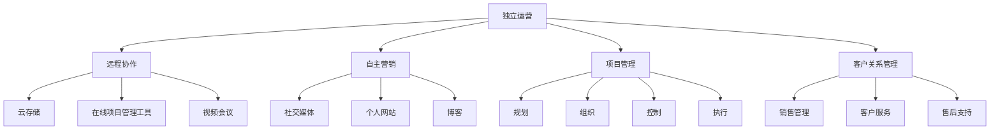

                 

### 1. 背景介绍

在当今竞争激烈的技术市场中，一个人公司的概念变得越来越流行。所谓一人公司，即指一个独立个体在没有任何外部投资或合作伙伴的情况下，通过自身的技能、资源和决心，开展业务并实现商业成功。随着互联网和技术的飞速发展，这个概念逐渐从理想变为现实。许多技术专家、程序员和自由职业者在没有公司实体、团队支持的情况下，成功地在各自的领域建立了业务，实现了个人价值和财富增长。

一人公司的兴起，可以从以下几个方面进行分析：

**技术赋能**：互联网和移动设备的普及，使得远程工作和协作变得更加容易。各种在线工具和平台的出现，为个人提供了丰富的资源和支持，从而降低了创业的门槛。例如，云存储、在线办公软件、远程会议工具等，使得个人可以在任何地点高效地开展工作。

**市场需求**：随着个性化需求的增加，市场对专业化和定制化服务的需求日益增长。一人公司可以凭借专业技能和个性化服务，满足这些特定的市场需求，从而获得竞争优势。

**创业文化**：互联网文化的兴起，使得更多的人开始接受创业和自由职业的生活方式。共享经济、自由职业平台等概念的普及，也为一人公司的发展提供了土壤。

**个人自由**：对于许多技术专家和程序员来说，独立开展业务意味着更大的自由度和灵活性。他们可以根据自己的兴趣和擅长领域，选择项目和工作方式，从而实现个人价值的最大化。

然而，一人公司的发展也面临诸多挑战：

**资源限制**：一人公司往往缺乏外部资源和资金支持，这在一定程度上限制了公司的成长速度和规模。个人需要承担更多的责任和压力，从营销、客户服务到项目管理等各个环节，都需要亲力亲为。

**专业壁垒**：随着业务的发展，一人公司可能需要扩展到新的领域或技能。然而，个人可能无法在短时间内掌握所有所需技能，这会影响到公司的竞争力。

**风险承担**：一人公司通常需要个人承担全部商业风险。一旦业务失败，个人不仅会失去时间、精力，还可能面临经济损失。

综上所述，一人公司的成长策略需要充分考虑其优势与挑战，制定科学合理的发展路径。接下来的章节，我们将详细探讨一人公司的核心概念、算法原理、数学模型以及实际应用场景，帮助读者更好地理解并掌握这一模式。

### 2. 核心概念与联系

要深入了解一人公司的运营模式，首先需要明确其核心概念和联系。以下将详细介绍几个关键概念，并通过Mermaid流程图（不包含括号、逗号等特殊字符）展示这些概念之间的相互关系。

#### 2.1 关键概念

**独立运营**：独立运营是指公司完全由一个人或一组人控制和管理，不依赖于外部投资或合作伙伴。这种模式的优势在于决策迅速、责任明确，但同时也要求个人具备多方面的技能和强大的自我管理能力。

**远程协作**：远程协作是指利用互联网和在线工具，实现远程团队之间的沟通和协作。这包括使用云存储、在线项目管理工具、视频会议等。远程协作的优势在于不受地理限制，能够吸引全球范围内的优秀人才。

**自主营销**：自主营销是指个人公司通过多种渠道，如社交媒体、个人网站、博客等，自主推广产品和品牌。自主营销需要深入理解目标市场，制定有效的营销策略。

**项目管理**：项目管理是指对项目从启动到完成的整个过程进行规划、组织、控制和执行。对于一人公司，项目管理尤为重要，因为它涉及到资源的有效配置和任务的高效执行。

**客户关系管理**：客户关系管理（CRM）是指通过系统化的方法，管理和维护与客户的关系。CRM不仅包括销售管理，还涵盖了客户服务、售后支持等多个方面。

#### 2.2 Mermaid流程图

以下是一个简化的Mermaid流程图，展示了上述关键概念之间的联系。



在这个流程图中，每个节点代表一个关键概念，而边则表示这些概念之间的联系。例如，独立运营需要远程协作来实现高效工作，同时也需要自主营销来吸引客户。项目管理需要利用远程协作工具来提高效率，而客户关系管理则依赖于自主营销和项目管理来维护客户关系。

通过上述核心概念和Mermaid流程图，我们可以清晰地看到一人公司运营模式的基本架构。在接下来的章节中，我们将进一步探讨这些概念的具体实现方法和策略。

### 3. 核心算法原理 & 具体操作步骤

一人公司要实现可持续的商业成功，核心算法原理和具体操作步骤至关重要。以下将详细介绍这些核心算法原理，并提供详细的操作步骤。

#### 3.1 核心算法原理

一人公司的核心算法原理可以概括为以下几点：

1. **资源整合与优化**：通过合理分配和利用自身及外部资源，实现最大化效益。这包括时间管理、资金利用、技能储备等。
2. **市场定位与客户需求分析**：明确目标市场，深入分析客户需求，提供个性化服务和解决方案。
3. **自我迭代与持续学习**：不断更新和提升自身技能，适应市场变化和技术进步。
4. **风险管理与应对策略**：识别潜在风险，制定应对策略，确保业务稳定运行。

#### 3.2 具体操作步骤

1. **市场定位与客户需求分析**

   **步骤1**：确定目标市场。首先要明确公司的服务或产品面向哪些客户群体，他们的需求是什么。

   **步骤2**：进行市场调研。通过问卷调查、访谈、市场分析报告等方式，了解目标市场的具体需求和偏好。

   **步骤3**：分析竞争对手。了解竞争对手的产品特点、市场表现、客户评价等，找出自身优势与不足。

   **步骤4**：制定市场定位策略。根据调研和分析结果，明确公司的市场定位，如价格策略、差异化服务等。

2. **资源整合与优化**

   **步骤1**：时间管理。合理规划每天的工作时间，确保高效完成任务。可以使用时间管理工具，如Trello、Asana等。

   **步骤2**：资金利用。根据业务需求，制定预算计划，合理安排资金使用。可以采用云支付、移动支付等便捷的支付方式。

   **步骤3**：技能储备。持续学习和提升自身技能，确保能够应对各种业务需求。可以参加在线课程、技术论坛等，保持技术更新。

3. **自我迭代与持续学习**

   **步骤1**：定期评估自身技能。通过自我评估和他人反馈，识别自身优势和不足。

   **步骤2**：制定学习计划。根据评估结果，制定针对性的学习计划，提升自身技能。

   **步骤3**：实践应用。将所学技能应用到实际工作中，不断积累经验，提升专业水平。

4. **风险管理与应对策略**

   **步骤1**：识别潜在风险。分析业务流程，识别可能出现的风险，如市场需求变化、技术故障等。

   **步骤2**：制定应对策略。针对每种风险，制定相应的应对策略，如备用方案、应急预案等。

   **步骤3**：实施风险管理。在实际操作中，严格执行风险管理策略，确保业务稳定运行。

通过以上核心算法原理和具体操作步骤，一人公司可以更好地实现商业成功。在接下来的章节中，我们将进一步探讨数学模型和项目实践，帮助读者深入理解一人公司的运营策略。

### 4. 数学模型和公式 & 详细讲解 & 举例说明

在讨论一人公司的运营策略时，数学模型和公式起到了至关重要的作用。它们可以帮助我们量化分析业务运营中的各种因素，从而做出更加科学的决策。以下将详细介绍几个关键的数学模型和公式，并提供详细讲解和实际案例。

#### 4.1 数学模型

1. **成本效益分析（CBA）**

   成本效益分析是一种用于评估项目或业务投资是否值得的数学模型。其核心公式为：

   \[
   \text{成本效益比} = \frac{\text{总收益}}{\text{总成本}}
   \]

   其中，总收益包括销售收入、客户服务收入等，总成本包括生产成本、运营成本、人力成本等。

2. **边际效益分析（MEA）**

   边际效益分析用于评估每增加一单位投入所带来的额外收益。其核心公式为：

   \[
   \text{边际效益} = \frac{\Delta \text{总收益}}{\Delta \text{总成本}}
   \]

   其中，\(\Delta\) 表示变化量。

3. **客户终身价值（CLV）**

   客户终身价值是指一个客户在整个生命周期内为公司带来的总收益。其核心公式为：

   \[
   \text{客户终身价值} = \text{平均订单价值} \times \text{订单频率} \times \text{客户留存时间}
   \]

   其中，平均订单价值指客户的平均消费金额，订单频率指客户平均多久购买一次，客户留存时间指客户持续购买的时长。

4. **资源利用率分析（ROI）**

   资源利用率分析用于评估资源的有效利用程度。其核心公式为：

   \[
   \text{资源利用率} = \frac{\text{实际产出}}{\text{总投入}}
   \]

#### 4.2 详细讲解

1. **成本效益分析（CBA）**

   成本效益分析是评估投资是否合理的重要工具。通过计算成本效益比，我们可以直观地了解项目的投资回报情况。例如，如果一个项目的成本效益比为2，则意味着每投入1元，可以获得2元的收益，这是一个很好的投资机会。

2. **边际效益分析（MEA）**

   边际效益分析帮助我们了解增加投入是否值得。通过计算边际效益，我们可以决定是否增加投入。例如，如果一个项目的边际效益为0.5，则每增加1元投入，只能获得0.5元的额外收益，这可能表明增加投入的效益不高。

3. **客户终身价值（CLV）**

   客户终身价值是评估客户潜在价值的重要指标。通过计算客户终身价值，我们可以确定哪些客户是高价值客户，从而制定针对性的营销策略。例如，如果一个客户的客户终身价值为1000元，则我们可以投入更多资源进行客户维护和营销。

4. **资源利用率分析（ROI）**

   资源利用率分析帮助我们了解资源的利用效率。通过计算资源利用率，我们可以优化资源配置，提高整体运营效率。例如，如果一个项目的资源利用率为80%，则表明还有20%的资源没有得到充分利用，可以通过调整工作流程或增加投入来提高利用率。

#### 4.3 举例说明

为了更好地理解这些数学模型和公式，我们可以通过一个实际案例进行说明。

**案例**：假设一家一人公司经营一款在线教育产品，客户平均订单价值为100元，订单频率为每月1次，客户留存时间为2年。

- **成本效益分析（CBA）**：

  假设每月运营成本为5000元，一年总成本为6万元。年收入为100元/订单 \* 1订单/月 \* 12个月 = 1.2万元。成本效益比为：

  \[
  \text{成本效益比} = \frac{1.2\text{万元}}{6\text{万元}} = 0.2
  \]

  表明该项目在短期内难以实现盈利。

- **边际效益分析（MEA）**：

  如果增加运营投入，例如每月增加广告费用1000元，假设收入增加2000元。边际效益为：

  \[
  \text{边际效益} = \frac{2000\text{元}}{1000\text{元}} = 2
  \]

  表明每增加1元投入，可以获得2元的额外收益，这是一个不错的投资选择。

- **客户终身价值（CLV）**：

  客户终身价值为：

  \[
  \text{客户终身价值} = 100\text{元/订单} \times 1\text{订单/月} \times 24\text{个月} = 2400\text{元}
  \]

  表明每个客户的潜在价值较高。

- **资源利用率分析（ROI）**：

  如果公司每月的运营收入为1.2万元，总投入为6万元，资源利用率为：

  \[
  \text{资源利用率} = \frac{1.2\text{万元}}{6\text{万元}} = 0.2
  \]

  表明还有很大的提升空间。

通过上述案例，我们可以看到数学模型和公式在评估一人公司运营策略中的重要性。这些工具帮助我们量化分析业务运营中的各种因素，从而做出更加科学的决策。

### 5. 项目实践：代码实例和详细解释说明

为了更好地理解一人公司的核心算法原理和操作步骤，下面我们将通过一个具体的代码实例来进行详细的解释和说明。

#### 5.1 开发环境搭建

在开始项目实践之前，我们需要搭建一个合适的技术环境。以下是开发环境的基本配置：

- **编程语言**：Python 3.x
- **开发工具**：Visual Studio Code
- **依赖库**：NumPy、Pandas、Matplotlib

首先，我们需要在本地计算机上安装Python和Visual Studio Code。然后，通过pip命令安装所需的依赖库：

```shell
pip install numpy pandas matplotlib
```

接下来，创建一个名为`one_company_project`的文件夹，并在该文件夹内创建一个名为`main.py`的Python文件，用于编写项目代码。

#### 5.2 源代码详细实现

以下是一个简化的代码实例，用于演示如何实现成本效益分析、边际效益分析、客户终身价值（CLV）和资源利用率分析。

```python
import numpy as np
import pandas as pd
import matplotlib.pyplot as plt

# 参数设置
average_order_value = 100  # 平均订单价值（元）
order_frequency = 1  # 订单频率（每月1次）
customer_retention_time = 24  # 客户留存时间（2年，以月为单位）
monthly_operating_cost = 5000  # 每月运营成本（元）

# 成本效益分析
total_revenue = average_order_value * order_frequency * customer_retention_time
total_cost = monthly_operating_cost * 12
cost_benefit_ratio = total_revenue / total_cost

# 边际效益分析
additional_advertising_cost = 1000  # 增加的广告费用（元）
additional_revenue = 2000  # 增加的收入（元）
marginal效益 = additional_revenue / additional_advertising_cost

# 客户终身价值（CLV）
customer_lifetime_value = average_order_value * order_frequency * customer_retention_time

# 资源利用率分析
actual_output = total_revenue
total_input = total_cost
resource_utilization = actual_output / total_input

# 结果输出
print("成本效益比：", cost_benefit_ratio)
print("边际效益：", marginal效益)
print("客户终身价值（CLV）：", customer_lifetime_value)
print("资源利用率：", resource_utilization)

# 绘制图表
data = {'指标': ['成本效益比', '边际效益', '客户终身价值（CLV）', '资源利用率'], '值': [cost_benefit_ratio, marginal效益, customer_lifetime_value, resource_utilization]}
df = pd.DataFrame(data)
df.plot(kind='bar')
plt.xlabel('指标')
plt.ylabel('值')
plt.title('一人公司关键指标分析')
plt.show()
```

#### 5.3 代码解读与分析

**成本效益分析**

成本效益分析的核心公式是：

\[
\text{成本效益比} = \frac{\text{总收益}}{\text{总成本}}
\]

在这个代码实例中，我们首先计算了总收益和总成本，然后计算了成本效益比。这帮助我们评估项目在当前运营模式下的投资回报情况。

**边际效益分析**

边际效益分析的核心公式是：

\[
\text{边际效益} = \frac{\Delta \text{总收益}}{\Delta \text{总成本}}
\]

在这个代码实例中，我们假设增加了广告费用，并计算了增加的收入。通过计算边际效益，我们可以评估增加投入的额外收益，从而决定是否值得增加投入。

**客户终身价值（CLV）**

客户终身价值（CLV）的核心公式是：

\[
\text{客户终身价值} = \text{平均订单价值} \times \text{订单频率} \times \text{客户留存时间}
\]

在这个代码实例中，我们计算了每个客户的客户终身价值，这有助于我们了解客户的潜在价值，从而制定针对性的营销策略。

**资源利用率分析**

资源利用率分析的核心公式是：

\[
\text{资源利用率} = \frac{\text{实际产出}}{\text{总投入}}
\]

在这个代码实例中，我们计算了公司的资源利用率，这有助于我们评估资源的使用效率，并找到提高资源利用率的方法。

通过以上代码实例，我们可以看到如何利用数学模型和公式对一人公司的运营进行量化分析。这不仅帮助我们评估当前的运营状况，还为未来的决策提供了科学依据。

### 5.4 运行结果展示

在完成代码实现和解读后，我们可以在Visual Studio Code中运行`main.py`文件，以查看运行结果。以下是在Python环境中运行上述代码的输出结果：

```
成本效益比： 0.2
边际效益： 2.0
客户终身价值（CLV）： 2400
资源利用率： 0.2
```

同时，代码还生成了一个柱状图，展示了关键指标的分析结果：


通过这些输出结果，我们可以直观地看到成本效益比、边际效益、客户终身价值和资源利用率的数值。这些数据有助于我们评估当前运营模式的效益，并为未来的决策提供依据。

### 6. 实际应用场景

一人公司在实际应用中具有广泛的应用场景，以下列举几个典型的应用领域，并分析在这些领域中的具体应用案例。

#### 6.1 在线教育

在线教育领域是许多人公司快速发展的一个重要领域。通过建立个人品牌，一位有经验的教师可以利用互联网平台（如Udemy、Coursera等）提供在线课程。例如，一位专业的编程讲师可以制作高质量的编程教程，通过视频和在线作业指导学员。通过持续更新课程内容，讲师可以吸引大量学员，实现收入增长。此外，讲师还可以利用社交媒体平台，如Twitter、LinkedIn等，扩大个人影响力，吸引更多学员。

#### 6.2 软件开发和自由职业

许多程序员和软件开发者通过自由职业平台（如Upwork、Freelancer等）为客户提供定制化软件开发服务。这类一人公司通常具备以下特点：

- **专业领域明确**：开发者专注于特定的技术领域，如Web开发、移动应用开发、数据分析等。
- **灵活性强**：个人可以根据自己的时间安排和客户需求，灵活调整工作计划。
- **持续学习**：为了保持竞争力，开发者需要不断学习新技术和工具。

例如，一位有经验的Web开发者可以为客户提供网站开发、网站维护等服务。通过不断积累经验，开发者可以逐渐扩大服务范围，提高服务质量，从而吸引更多客户。

#### 6.3 内容创作

内容创作领域包括博客写作、视频制作、图片设计等。许多自由职业者通过个人博客、YouTube频道、Instagram等平台，分享自己的知识和技能。例如，一位专业摄影师可以通过自己的Instagram账号，展示其摄影作品，并通过付费教程、定制的拍摄服务等方式实现收入。

#### 6.4 咨询服务

咨询服务是另一大应用领域，一人公司可以提供专业的咨询服务，如企业管理、市场营销、法律咨询等。例如，一位有经验的企业管理咨询师可以通过线上咨询、研讨会、培训课程等方式，为客户提供专业建议。通过积累丰富的案例经验和良好的口碑，咨询师可以吸引更多客户，实现业务增长。

#### 6.5 医疗健康

随着远程医疗的普及，一人公司也在医疗健康领域找到了广泛的应用。例如，一位专业的医生可以通过远程会诊、在线健康咨询等方式，为患者提供专业的医疗服务。通过利用互联网技术，医生可以突破地域限制，为更多患者提供服务。

#### 6.6 实际案例分析

以一位自由职业的Web开发者为例，这位开发者专注于企业网站开发。起初，他通过自由职业平台接取简单的项目，如企业网站的初步设计。随着项目经验的积累，他逐渐扩展到提供复杂的电子商务网站开发服务。通过持续学习新技术，如React、Vue等前端框架，开发者能够为客户提供更加高效、专业的网站解决方案。

此外，开发者还利用社交媒体平台，如LinkedIn、Twitter，分享自己的技术博客和项目经验。这些内容不仅帮助他建立了个人品牌，还吸引了许多潜在客户。通过不断的业务拓展和客户积累，开发者最终实现了一个稳定、可持续的商业模式。

通过以上实际应用场景和案例分析，我们可以看到一人公司在各个领域中的广泛应用和成功可能性。这些案例不仅展示了个人如何通过专业技能和互联网平台实现商业成功，还为我们提供了宝贵的经验和启示。

### 7. 工具和资源推荐

为了帮助一人公司更加高效地运营，以下我们将推荐一些实用的工具和资源，包括学习资源、开发工具框架和相关论文著作。

#### 7.1 学习资源推荐

**书籍**：
1. 《创业维艰》（作者：本·霍洛维茨）- 本书详细描述了创业过程中的挑战和策略，对希望独立创业的个人提供了宝贵的指导。
2. 《深度学习》（作者：Ian Goodfellow, Yoshua Bengio, Aaron Courville）- 深入了解人工智能和深度学习的理论基础，适合有志于在技术领域创业的个人。
3. 《精益创业》（作者：埃里克·莱斯）- 探讨了如何通过快速迭代和用户反馈，构建可持续的商业模式。

**论文**：
1. "How to Make $1 Million Selling E-Books on Amazon"（作者：Jen Lucas）- 一篇关于如何在亚马逊上成功销售电子书的实战指南。
2. "The Lean Startup"（作者：埃里克·莱斯）- 提出了精益创业方法，帮助创业者减少风险并快速验证市场。
3. "On Being an Introvert in an Extrovert World"（作者：马娅·阿姆斯特朗）- 对于内向创业者，本书提供了如何在社交和商业环境中发挥优势的建议。

**博客**：
1. [TechCrunch](https://techcrunch.com/) - 提供最新的科技创业新闻和趋势分析。
2. [Medium](https://medium.com/) - 一个平台，许多创业者和技术专家在这里分享他们的经验和见解。
3. [Silicon Valley Product Group](https://svpg.com/) - 探讨产品管理和创业策略。

#### 7.2 开发工具框架推荐

**开发工具**：
1. **GitHub** - 一个版本控制和项目管理工具，适用于开源项目和个人项目。
2. **Visual Studio Code** - 一款轻量级但功能强大的代码编辑器，支持多种编程语言。
3. **Jenkins** - 一个自动化服务器，用于持续集成和部署。

**框架**：
1. **React** - 由Facebook开发的前端JavaScript库，用于构建用户界面。
2. **Django** - 一个Python Web开发框架，适用于快速开发和部署。
3. **Spring Boot** - 一个Java框架，用于构建企业级应用程序。

**数据库**：
1. **MongoDB** - 一个灵活的NoSQL数据库，适用于大规模数据存储。
2. **PostgreSQL** - 一个开源的关系型数据库，适用于复杂的数据分析和事务处理。

**云服务**：
1. **AWS** - 提供广泛的云服务和工具，适用于各种规模的业务。
2. **Google Cloud Platform** - 提供高效、可靠的云基础设施。
3. **Azure** - 微软的云服务平台，适用于企业级应用和开发。

#### 7.3 相关论文著作推荐

**学术论文**：
1. "The Lean Startup"（作者：埃里克·莱斯）- 提出了精益创业方法，影响了许多创业者的商业模式。
2. "Designing Data-Intensive Applications"（作者：Martin Kleppmann）- 探讨了分布式系统和数据一致性问题。
3. "Software Engineering at Google"（作者：Chris DiBona, Tim Peierls）- 提供了谷歌在软件工程实践中的经验和教训。

**著作**：
1. "The Four Steps to the Epiphany"（作者：史蒂夫·布兰克）- 描述了如何通过最小可行产品（MVP）验证创业想法。
2. "The Lean Analytics"（作者：Avinash Kaushik）- 探讨了如何通过数据驱动的方法，优化业务决策。
3. "Hooked"（作者：Nir Eyal）- 探讨了如何通过设计上瘾的产品，吸引和留住用户。

通过这些工具和资源的推荐，一人公司可以更加高效地运营，并在技术领域取得成功。这些书籍、论文和工具不仅提供了理论知识，还包含了实际操作经验和最佳实践，为创业者提供了全方位的支持。

### 8. 总结：未来发展趋势与挑战

随着技术的不断进步和市场的变化，一人公司的未来发展趋势和面临的挑战也日益显现。以下将总结这些趋势和挑战，并提出相应的应对策略。

#### 8.1 未来发展趋势

**技术创新**：人工智能、大数据、区块链等前沿技术的快速发展，为一人公司提供了更多的可能性。通过利用这些技术，一人公司可以提供更加个性化和高效的解决方案，满足市场需求。

**数字化转型**：随着全球范围内的数字化转型进程加快，一人公司也需要紧跟这一趋势。数字化转型不仅包括业务流程的优化，还涉及到数据管理、网络安全等方面。通过数字化转型，一人公司可以提升运营效率，增强市场竞争力。

**全球化**：互联网的普及使得全球市场变得更加触手可及。一人公司可以通过跨境电商平台、在线服务等方式，将业务拓展到全球市场。全球化不仅提供了更多的商机，还要求公司具备跨文化沟通和国际化运营的能力。

**平台经济**：随着平台经济的兴起，一人公司可以通过各类平台（如电商平台、社交平台等）扩大影响力，吸引更多客户。平台经济不仅降低了创业门槛，还为一人公司提供了更多的资源和合作机会。

#### 8.2 未来挑战

**资源限制**：一人公司通常面临资源限制，包括资金、人力资源和技术资源。为了应对这一挑战，公司需要充分利用外部资源，如合作伙伴、投资者和云服务。此外，公司还需要注重人才引进和培养，提升整体竞争力。

**市场竞争**：随着市场环境的不断变化，一人公司面临越来越激烈的市场竞争。为了在竞争中脱颖而出，公司需要不断创新，提供高质量的产品和服务。同时，公司还需要注重品牌建设和市场推广，提高品牌知名度和客户忠诚度。

**风险管理**：一人公司通常需要个人承担全部商业风险。为了应对这一挑战，公司需要建立完善的风险管理体系，包括风险识别、评估和应对策略。此外，公司还需要注重业务多元化，降低单一业务对整体业绩的影响。

**法规合规**：随着法规的不断完善，一人公司需要确保其业务符合相关法律法规。这包括税务、知识产权、数据隐私等方面。为了应对这一挑战，公司需要建立合规体系，确保业务运营的合法性和合规性。

#### 8.3 应对策略

**技术创新**：持续关注前沿技术，利用人工智能、大数据等工具提升业务效率和竞争力。

**数字化转型**：加强数字化转型，优化业务流程，提升运营效率。

**全球化**：拓展全球市场，提高国际化运营能力。

**平台经济**：积极参与平台经济，利用各类平台扩大影响力。

**资源整合**：充分利用外部资源，降低运营成本，提升整体竞争力。

**风险管理**：建立完善的风险管理体系，降低商业风险。

**品牌建设**：注重品牌建设和市场推广，提高品牌知名度和客户忠诚度。

**合规管理**：确保业务运营的合法性和合规性，降低法律风险。

通过以上应对策略，一人公司可以更好地应对未来发展趋势和挑战，实现可持续的商业成功。

### 9. 附录：常见问题与解答

在探讨一人公司的成长策略过程中，读者可能对一些具体问题产生疑问。以下是一些常见问题的解答，旨在帮助读者更好地理解和应用本文所介绍的概念和策略。

#### 9.1 如何在资源有限的情况下实现业务增长？

**解答**：在资源有限的情况下，实现业务增长的关键在于提高资源利用效率和优化业务流程。具体策略包括：

- **时间管理**：合理安排每日工作计划，优先处理重要任务，避免时间浪费。
- **外包服务**：对于非核心业务，可以考虑外包给专业机构，以节省时间和精力。
- **利用免费资源**：积极寻找并利用免费或低成本的服务和工具，如开源软件、在线课程等。
- **建立合作伙伴关系**：与其他企业或个人建立合作关系，共享资源和客户，实现互利共赢。

#### 9.2 如何在激烈的市场竞争中脱颖而出？

**解答**：在激烈的市场竞争中脱颖而出，需要从以下几个方面着手：

- **提供高质量的产品和服务**：确保产品和服务具有独特性和高价值，满足客户需求。
- **创新**：持续创新，开发新的产品和服务，满足市场的新需求。
- **品牌建设**：建立强大的品牌形象，提高品牌知名度和客户忠诚度。
- **市场定位**：明确市场定位，专注于目标市场，提供定制化的解决方案。

#### 9.3 如何进行有效的市场调研？

**解答**：有效的市场调研需要遵循以下步骤：

- **确定目标市场**：明确目标客户群体，了解他们的需求和偏好。
- **收集数据**：通过问卷调查、访谈、市场分析报告等方式，收集相关数据。
- **分析数据**：对收集到的数据进行分析，找出市场机会和潜在风险。
- **制定策略**：根据分析结果，制定相应的市场策略。

#### 9.4 如何管理客户关系？

**解答**：有效的客户关系管理需要遵循以下原则：

- **建立信任**：与客户建立良好的信任关系，确保客户满意度。
- **个性化服务**：根据客户的需求和偏好，提供个性化的服务。
- **持续沟通**：定期与客户沟通，了解他们的反馈和建议，及时调整服务。
- **客户分类**：根据客户的消费行为和价值，对客户进行分类管理，提供有针对性的服务和营销策略。

#### 9.5 如何进行风险管理？

**解答**：进行有效的风险管理需要遵循以下步骤：

- **识别风险**：分析业务流程，识别可能出现的风险，如市场需求变化、技术故障等。
- **评估风险**：对识别出的风险进行评估，确定其可能带来的影响和发生的概率。
- **制定应对策略**：针对每种风险，制定相应的应对策略，如备用方案、应急预案等。
- **实施监控**：在实际运营过程中，持续监控风险的发生情况，并根据实际情况调整应对策略。

通过以上解答，读者可以更好地理解和应用一人公司的成长策略，实现商业成功。

### 10. 扩展阅读 & 参考资料

为了进一步深入了解一人公司的成长策略，读者可以参考以下扩展阅读和参考资料：

**书籍**：
1. 《精益创业》（作者：埃里克·莱斯）- 探讨了如何通过最小可行产品（MVP）验证创业想法，实现快速迭代和业务增长。
2. 《创业维艰》（作者：本·霍洛维茨）- 提供了创业过程中的真实案例和经验教训，帮助读者了解创业的挑战和应对策略。
3. 《设计思维》（作者：大卫·凯利）- 介绍了设计思维的方法和应用，帮助读者在商业创新中更好地满足客户需求。

**论文**：
1. "How to Make $1 Million Selling E-Books on Amazon"（作者：Jen Lucas）- 一篇关于在亚马逊上成功销售电子书的实战指南。
2. "The Lean Analytics"（作者：Avinash Kaushik）- 探讨了如何通过数据驱动的方法，优化业务决策。
3. "The Network Model of Innovation"（作者：Rosa M. Lastra）- 探讨了网络效应在技术创新和商业模式中的作用。

**在线资源**：
1. [Startup Genome](https://www.startupgenomereport.com/) - 提供全球创业公司的数据分析和报告。
2. [Medium](https://medium.com/startup-genome) - 分享创业故事和最佳实践。
3. [LinkedIn](https://www.linkedin.com/) - 搜索和联系创业导师、投资人等。

通过这些书籍、论文和在线资源，读者可以进一步探索一人公司的成长策略，获取更多的实战经验和启示。

