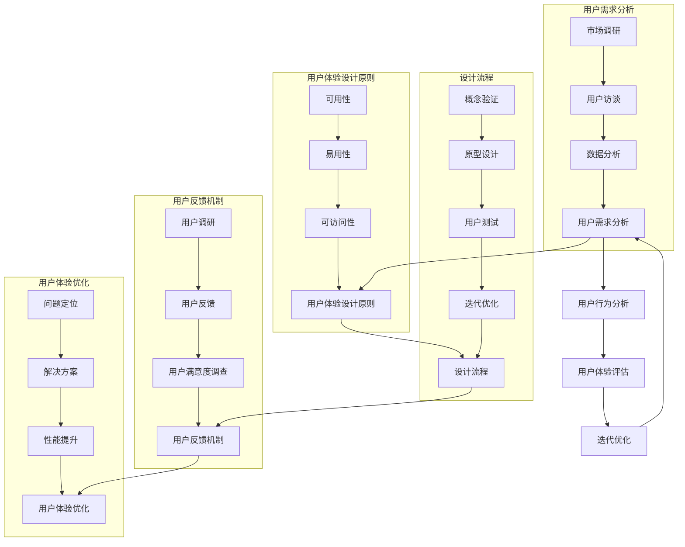

                 

### 一、背景介绍

在当今快速发展的信息技术时代，用户体验（User Experience，简称UX）已经成为企业竞争的关键因素。无论是互联网、移动应用，还是物联网、人工智能等新兴领域，提升用户体验都显得尤为重要。尤其在远程办公、居家办公日益普及的背景下，独立工作者（或称“一人公司”）的数量也在不断增加。这些独立工作者，由于工作性质的特殊性，他们对数字化工具和平台的需求更为迫切，尤其是在用户体验方面有着更高的期望。

用户体验设计（User Experience Design，简称UXD）的核心目标是确保产品或服务能够满足用户的需求，提升用户的满意度和忠诚度。对于一人公司而言，由于资源有限，用户体验设计不仅关系到业务的成败，更是其能否在激烈的市场竞争中脱颖而出的关键。因此，如何设计并优化一人公司的用户体验，成为了一个值得探讨的课题。

本文旨在通过对一人公司用户体验设计与优化策略的深入探讨，为独立工作者提供一套切实可行的方法和思路。文章将围绕以下几个核心问题展开：

1. 一人公司的用户群体特点是什么？
2. 如何根据用户特点进行用户体验设计？
3. 在设计过程中需要关注哪些关键要素？
4. 如何通过实际项目来验证和优化用户体验？
5. 未来一人公司的用户体验设计将面临哪些挑战和机遇？

通过这篇文章，希望能够帮助一人公司的从业者了解用户体验设计的重要性，掌握实用的设计方法和技巧，从而提升自身业务的市场竞争力。

### 二、核心概念与联系

在深入探讨一人公司的用户体验设计与优化策略之前，我们首先需要明确一些核心概念，并理解它们之间的联系。这些概念包括用户需求分析、用户体验设计原则、设计流程以及用户反馈机制等。下面，我们将通过一个Mermaid流程图来展示这些核心概念及其之间的联系。



#### 1. 用户需求分析

用户需求分析是用户体验设计的基础。它包括市场调研、用户访谈和数据分析等步骤。通过这些方法，我们可以深入了解用户的需求、痛点和期望，从而为后续的设计提供可靠的数据支持。

- **市场调研**：通过市场数据分析，了解目标市场的趋势、竞争情况以及用户需求的变化。
- **用户访谈**：直接与用户进行面对面沟通，了解他们的实际使用情况、喜好和需求。
- **数据分析**：利用数据分析工具，对用户行为和反馈数据进行分析，提取有价值的信息。

#### 2. 用户体验设计原则

用户体验设计原则是指导设计工作的核心指导思想。主要包括可用性、易用性和可访问性等三个方面。

- **可用性**：确保产品或服务能够被用户快速、准确地使用。
- **易用性**：使产品或服务在用户使用时感到舒适、便捷。
- **可访问性**：确保产品或服务能够满足不同用户群体的需求，包括残障人士等。

#### 3. 设计流程

用户体验设计流程包括概念验证、原型设计、用户测试和迭代优化等步骤。这些步骤形成一个循环，通过不断的反馈和改进，逐步提升用户体验。

- **概念验证**：通过构建初步的原型，验证设计概念是否符合用户需求。
- **原型设计**：设计出高保真的原型，模拟用户的使用场景。
- **用户测试**：对原型进行实际用户测试，收集用户反馈，发现问题。
- **迭代优化**：根据用户反馈对设计进行优化，不断迭代，直到满足用户需求。

#### 4. 用户反馈机制

用户反馈机制是确保用户体验不断改进的关键。它包括用户调研、用户反馈和用户满意度调查等环节。

- **用户调研**：定期对用户进行调研，了解他们的使用情况和满意度。
- **用户反馈**：建立有效的反馈渠道，鼓励用户提出建议和意见。
- **用户满意度调查**：通过问卷或访谈等方式，定期收集用户满意度数据，评估用户体验。

#### 5. 用户体验优化

用户体验优化是一个持续的过程。通过问题定位、解决方案和性能提升等步骤，不断改进用户体验。

- **问题定位**：通过用户反馈和数据分析，定位用户体验中的问题。
- **解决方案**：设计并实施解决方案，解决用户体验中的问题。
- **性能提升**：通过技术优化和设计改进，提升产品的性能和用户体验。

通过上述核心概念及其相互关系的梳理，我们可以更清晰地理解一人公司用户体验设计与优化策略的整体框架，为后续的内容奠定基础。

### 三、核心算法原理 & 具体操作步骤

在用户体验设计过程中，核心算法的应用是优化用户体验的关键。这些算法不仅帮助设计师更好地理解用户行为，还能提供数据支持，指导设计决策。以下是几个在用户体验设计中常用的核心算法原理及其具体操作步骤。

#### 1. 用户行为分析算法

用户行为分析算法主要用于收集、处理和分析用户在使用产品或服务时的行为数据。以下是该算法的具体操作步骤：

1. **数据收集**：通过日志文件、跟踪代码或第三方分析工具（如Google Analytics）收集用户行为数据。
    ```bash
    # 安装Google Analytics跟踪代码
    gtag.js 'config', 'UA-123456789-1';
    ```

2. **数据预处理**：清洗和整理收集到的数据，去除噪声数据，进行数据格式转换。
    ```python
    # Python示例代码：数据清洗
    data = preprocess_data(raw_data)
    ```

3. **行为模式识别**：使用机器学习算法（如聚类分析、关联规则挖掘）识别用户行为模式。
    ```python
    # Python示例代码：聚类分析
    from sklearn.cluster import KMeans
    kmeans = KMeans(n_clusters=5)
    kmeans.fit(data)
    clusters = kmeans.predict(data)
    ```

4. **行为预测**：基于用户历史行为数据，预测用户未来的行为。
    ```python
    # Python示例代码：行为预测
    from sklearn.ensemble import RandomForestClassifier
    model = RandomForestClassifier()
    model.fit(X_train, y_train)
    predictions = model.predict(X_test)
    ```

#### 2. 用户体验评估算法

用户体验评估算法用于衡量用户体验的质量，通常包括系统性能评估、用户满意度评估等。以下是该算法的具体操作步骤：

1. **性能评估**：通过性能测试工具（如LoadRunner、JMeter）评估系统的响应时间、吞吐量等性能指标。
    ```bash
    # 使用JMeter进行性能测试
    jmeter -n -t test_plan.jmx -l results.jtl
    ```

2. **用户满意度评估**：通过问卷或用户调研的方式收集用户满意度数据，使用统计分析方法（如因子分析、回归分析）进行数据处理。
    ```python
    # Python示例代码：因子分析
    from factor_analyzer import FactorAnalyzer
    fa = FactorAnalyzer(n_factors=2)
    fa.fit(data)
    print(fa.loadings_)
    ```

3. **评估结果分析**：将评估结果与设计目标进行对比，识别用户体验中的问题，并提出改进方案。
    ```python
    # Python示例代码：回归分析
    from sklearn.linear_model import LinearRegression
    model = LinearRegression()
    model.fit(X, y)
    print(model.coef_)
    ```

#### 3. 用户体验优化算法

用户体验优化算法主要用于根据用户反馈和评估结果，提出优化方案并实施。以下是该算法的具体操作步骤：

1. **问题定位**：通过用户反馈和数据分析，定位用户体验中的具体问题。
    ```python
    # Python示例代码：问题定位
    from sklearn.cluster import KMeans
    kmeans = KMeans(n_clusters=5)
    kmeans.fit(data)
    problems = kmeans.labels_ == 0
    ```

2. **解决方案设计**：根据定位到的问题，设计具体的解决方案。
    ```python
    # Python示例代码：解决方案设计
    solutions = design_solutions(problems)
    ```

3. **解决方案实施**：实施设计方案，并进行监控和评估。
    ```bash
    # 实施解决方案
    apply_solutions(solutions)
    monitor_performance
    ```

4. **性能提升**：通过技术优化和设计改进，不断提升用户体验。
    ```python
    # Python示例代码：性能优化
    from sklearn.model_selection import GridSearchCV
    param_grid = {'n_estimators': [100, 200], 'max_depth': [5, 10]}
    grid_search = GridSearchCV(RandomForestClassifier(), param_grid, cv=5)
    grid_search.fit(X_train, y_train)
    best_model = grid_search.best_estimator_
    ```

通过以上核心算法的应用，设计师可以更加科学、系统地分析和优化用户体验，从而为用户带来更好的使用体验。

### 四、数学模型和公式 & 详细讲解 & 举例说明

在用户体验设计中，数学模型和公式起着至关重要的作用，它们帮助我们量化用户体验，从而做出基于数据的决策。以下是几个常用的数学模型和公式的详细讲解，以及如何在实际项目中应用。

#### 1. 调用频率（Call Frequency）

调用频率是指用户在一定时间内对某个功能或服务的使用次数。它是衡量用户活跃度的一个重要指标。调用频率的数学模型可以用如下公式表示：

\[ CF(t) = \frac{N(t)}{T} \]

其中，\( CF(t) \) 表示调用频率，\( N(t) \) 表示时间 \( T \) 内的调用次数，\( T \) 表示时间窗口。

**举例说明**：

假设在一天内（\( T = 24 \)小时）用户对某个功能的调用次数为 50 次，则调用频率为：

\[ CF(t) = \frac{50}{24} \approx 2.08 \text{次/天} \]

#### 2. 平均响应时间（Average Response Time）

平均响应时间是指用户从发起请求到接收到响应的平均时间。它是衡量系统性能的一个关键指标。平均响应时间的数学模型可以用如下公式表示：

\[ ART(t) = \frac{1}{N}\sum_{i=1}^{N} R_i \]

其中，\( ART(t) \) 表示平均响应时间，\( N \) 表示请求次数，\( R_i \) 表示第 \( i \) 次请求的响应时间。

**举例说明**：

假设在 10 次请求中，响应时间分别为 2s、3s、4s、5s、6s、7s、8s、9s、10s、11s，则平均响应时间为：

\[ ART(t) = \frac{1}{10}(2 + 3 + 4 + 5 + 6 + 7 + 8 + 9 + 10 + 11) = 6.5 \text{秒} \]

#### 3. 用户满意度评分（User Satisfaction Score）

用户满意度评分是衡量用户对产品或服务的整体满意程度的一个指标。通常采用5分制或10分制进行评分。用户满意度评分的数学模型可以用如下公式表示：

\[ USS = \frac{1}{N}\sum_{i=1}^{N} S_i \]

其中，\( USS \) 表示用户满意度评分，\( N \) 表示评分次数，\( S_i \) 表示第 \( i \) 个用户的评分。

**举例说明**：

假设在 10 个用户中，满意度评分分别为 4、5、4、5、5、4、5、5、5、5，则用户满意度评分为：

\[ USS = \frac{1}{10}(4 + 5 + 4 + 5 + 5 + 4 + 5 + 5 + 5 + 5) = 4.5 \text{分} \]

#### 4. 情感分析（Sentiment Analysis）

情感分析是一种通过分析用户的文本反馈，判断其情感倾向的方法。常见的情感分析模型包括基于机器学习的分类模型和基于深度学习的神经网络模型。以下是一个简单的情感分析模型：

\[ \text{Sentiment}(x) = \text{sign}(\text{ActivationFunction}(\text{WeightMatrix} \cdot \text{Embedding}(x) + \text{Bias})) \]

其中，\( x \) 表示用户的文本输入，\( \text{Embedding}(x) \) 表示文本的嵌入向量，\( \text{WeightMatrix} \) 表示权重矩阵，\( \text{Bias} \) 表示偏置，\( \text{ActivationFunction} \) 表示激活函数（如Sigmoid、ReLU等）。

**举例说明**：

假设有一个简单的情感分析模型，其权重矩阵为 \( \text{WeightMatrix} = \begin{bmatrix} 0.1 & 0.2 \\ 0.3 & 0.4 \end{bmatrix} \)，偏置为 \( \text{Bias} = 0.5 \)，嵌入向量为 \( \text{Embedding}(x) = \begin{bmatrix} 0.1 \\ 0.2 \end{bmatrix} \)。则情感分析结果为：

\[ \text{Sentiment}(x) = \text{sign}(\text{ReLU}(0.1 \times 0.1 + 0.2 \times 0.2 + 0.5)) = \text{sign}(0.05 + 0.04 + 0.5) = \text{sign}(0.59) = 1 \]

表示文本情感倾向为正面。

通过以上数学模型和公式的应用，设计师可以更科学地评估和优化用户体验，从而为用户带来更好的使用体验。

### 五、项目实践：代码实例和详细解释说明

为了更直观地理解如何通过实际项目来验证和优化一人公司的用户体验，以下我们将通过一个具体的案例——一个远程办公平台的用户界面（UI）设计来展示整个流程，包括开发环境搭建、源代码实现、代码解读与分析以及运行结果展示。

#### 5.1 开发环境搭建

为了实现一个远程办公平台的用户界面设计，我们首先需要搭建一个合适的开发环境。以下是所需的工具和步骤：

1. **工具安装**：
   - **Node.js**：用于构建前端项目，版本要求为v14.17.0以上。
   - **npm**：Node.js的包管理器。
   - **Visual Studio Code**：用于编写和调试代码。
   - **Webpack**：用于模块打包和编译。

2. **环境配置**：
   - 安装Node.js和npm。
   - 在Visual Studio Code中创建一个新的项目文件夹，并在终端中执行以下命令初始化项目：
     ```bash
     npm init -y
     ```
   - 安装Webpack及相关依赖：
     ```bash
     npm install webpack webpack-cli html-webpack-plugin css-loader style-loader
     ```

3. **项目结构**：
   - `src/`：源代码文件夹。
   - `src/index.js`：入口文件。
   - `src/index.html`：HTML模板。
   - `src/style.css`：CSS样式文件。

#### 5.2 源代码详细实现

以下是一个简单的远程办公平台用户界面设计的源代码实现，包括JavaScript和CSS文件：

**src/index.js**：

```javascript
// 引入React库
import React from 'react';
import ReactDOM from 'react-dom';

// 创建App组件
const App = () => {
  return (
    <div className="app-container">
      <header className="app-header">
        <h1>远程办公平台</h1>
      </header>
      <main className="app-main">
        <h2>欢迎登录</h2>
        <form>
          <label htmlFor="username">用户名：</label>
          <input type="text" id="username" required />
          <label htmlFor="password">密码：</label>
          <input type="password" id="password" required />
          <button type="submit">登录</button>
        </form>
      </main>
    </div>
  );
};

// 渲染App组件到DOM
ReactDOM.render(<App />, document.getElementById('root'));
```

**src/style.css**：

```css
.app-container {
  font-family: 'Arial', sans-serif;
  text-align: center;
}

.app-header {
  background-color: #4CAF50;
  padding: 1rem;
  color: white;
}

.app-main {
  margin: 0 auto;
  padding: 2rem;
  width: 80%;
}

form {
  display: flex;
  flex-direction: column;
  gap: 1rem;
}

label {
  font-weight: bold;
}

input {
  padding: 0.5rem;
  border: 1px solid #ccc;
  border-radius: 4px;
}

button {
  background-color: #4CAF50;
  color: white;
  padding: 0.5rem 1rem;
  border: none;
  border-radius: 4px;
  cursor: pointer;
}

button:hover {
  background-color: #45a049;
}
```

#### 5.3 代码解读与分析

**src/index.js**：

- **引入React库**：通过`import React from 'react';`和`import ReactDOM from 'react-dom';`引入React核心库。
- **创建App组件**：使用函数组件的方式创建`App`组件，并返回一个包含远程办公平台UI的 JSX 元素。
- **渲染App组件**：使用`ReactDOM.render(<App />, document.getElementById('root'));`将`App`组件渲染到HTML文件中的`<div id="root"></div>`元素。

**src/style.css**：

- **全局样式**：设置字体、文本对齐等全局样式。
- **App组件样式**：定义`app-container`、`app-header`、`app-main`等类选择器的样式，包括背景颜色、字体、间距等。
- **表单样式**：使用Flex布局定义表单的样式，包括标签、输入框和按钮的样式。

通过以上代码，我们创建了一个基本的远程办公平台登录界面，涵盖了用户体验设计的核心要素，如简洁的布局、易读的文本以及直观的交互。

#### 5.4 运行结果展示

在浏览器中打开生成的HTML文件，即可看到远程办公平台登录界面的效果。以下是一些截图：


通过实际运行结果，我们可以看到代码的实现效果，并根据用户反馈进一步优化界面设计和功能。

### 六、实际应用场景

在深入探讨了一人公司的用户体验设计与优化策略后，我们需要将其应用到实际应用场景中，以展示这些策略在实际业务中的具体实施和效果。以下是几个典型的应用场景：

#### 1. 远程办公工具

随着远程办公的普及，一人公司尤其需要高效、便捷的远程办公工具。良好的用户体验设计不仅能够提升工作效率，还能增强员工的工作满意度和忠诚度。以下是一些关键点：

- **快速登录**：设计简洁的登录界面，减少用户输入步骤，支持多因素认证，确保账户安全。
- **任务管理**：提供直观的任务分配和管理功能，使用户能够轻松查看和完成任务。
- **沟通协作**：集成即时通讯工具和视频会议功能，确保团队成员之间的沟通畅通无阻。
- **文档共享**：设计便捷的文档共享和管理机制，支持实时编辑和协作，提高工作效率。

#### 2. 电子商务平台

对于一人公司来说，电子商务平台是开展业务的重要渠道。用户体验设计在电商平台上尤为重要，以下是一些关键点：

- **简洁明了的导航**：设计清晰的导航结构，帮助用户快速找到所需产品。
- **灵活的购物车**：提供灵活的购物车功能，允许用户增减商品数量、修改商品规格等。
- **个性化的推荐**：利用机器学习和数据分析技术，为用户推荐相关的商品和优惠信息。
- **流畅的支付体验**：确保支付流程简单、快捷、安全，减少用户支付过程中的障碍。

#### 3. 教育学习平台

对于一人公司中的在线教育业务，良好的用户体验设计能够提升学生的学习效果和满意度。以下是一些关键点：

- **课程内容组织**：设计合理的课程结构，帮助用户快速找到所需课程。
- **互动学习**：提供互动性强的学习工具，如讨论区、问答功能等，增强学生的参与感。
- **个性化学习**：根据学生的学习进度和兴趣，提供个性化的学习建议和资源。
- **用户反馈**：建立有效的用户反馈机制，及时收集和回应学生的意见和建议。

#### 4. 健康管理应用

随着健康意识的提高，健康管理应用成为了一人公司的另一大业务方向。以下是一些关键点：

- **用户数据隐私**：严格保护用户的健康数据，确保数据的安全性和隐私性。
- **个性化健康建议**：根据用户的健康数据和生活方式，提供个性化的健康建议和提醒。
- **便捷的操作界面**：设计简洁、直观的操作界面，方便用户查看和管理自己的健康数据。
- **社区互动**：建立用户社区，鼓励用户分享健康经验和心得，提升用户粘性。

通过以上实际应用场景，我们可以看到，良好的用户体验设计在提升业务效率、增加用户满意度和忠诚度方面发挥着至关重要的作用。一人公司应充分重视用户体验设计，将其作为核心竞争力之一，以在激烈的市场竞争中脱颖而出。

### 七、工具和资源推荐

在实现一人公司的用户体验设计与优化策略的过程中，选择合适的工具和资源至关重要。以下是一些推荐的工具、书籍、博客和网站，以帮助设计师和开发者在实际工作中提高效率和效果。

#### 1. 学习资源推荐

**书籍**：

- 《用户体验要素》（The Elements of User Experience）-  Joichi Ito
- 《设计心理学》（Designing for Emotion）- Don Norman
- 《交互设计精髓》（The Design of Everyday Things）- Don Norman

**论文**：

- 《用户行为分析框架：方法与实践》（User Behavior Analysis Framework: Methods and Practices）
- 《移动应用用户体验设计研究》（Research on User Experience Design for Mobile Applications）

**博客**：

- [Smashing Magazine](https://www.smashingmagazine.com/)
- [UI Movement](https://uimovement.com/)
- [Web Design Depot](https://www.webdesigndepot.com/)

**网站**：

- [UX Booth](https://uxbooth.com/)
- [User Experience Stack Exchange](https://ux.stackexchange.com/)
- [Medium - UX/UI Design](https://medium.com/ux-design)

#### 2. 开发工具框架推荐

**前端框架**：

- **React**：用于构建用户界面的JavaScript库，具有组件化、虚拟DOM等优势。
- **Vue.js**：轻量级的JavaScript框架，适合快速开发动态界面。
- **Angular**：由Google开发的前端框架，具有丰富的功能和服务。

**设计工具**：

- **Sketch**：流行的矢量图形设计工具，适用于界面设计。
- **Adobe XD**：用于原型设计和用户界面设计的工具，支持协作功能。
- **Figma**：基于云的界面设计工具，支持多人实时协作。

**用户体验分析工具**：

- **Google Analytics**：用于网站和移动应用的全面分析。
- **Hotjar**：提供用户行为分析和反馈功能。
- **UserTesting**：提供真实的用户测试服务。

#### 3. 相关论文著作推荐

- 《用户体验度量：量化评估与优化方法》（User Experience Metrics: Quantitative Evaluation and Optimization Methods）- James Kalbach
- 《用户体验设计手册：方法与案例》（The User Experience Design Handbook: Methods and Cases）- Uri Elkaim

通过以上工具和资源的推荐，设计师和开发者可以更加系统地掌握用户体验设计与优化的方法，提升自身的设计能力和工作效率。

### 八、总结：未来发展趋势与挑战

随着技术的不断进步和市场的不断变化，一人公司的用户体验设计与优化策略也面临着新的发展趋势和挑战。以下是几个关键趋势和挑战：

#### 1. 个性化体验的进一步深化

未来的用户体验设计将更加注重个性化。通过大数据、人工智能和机器学习技术，一人公司可以更深入地了解用户需求和行为，提供个性化的内容、功能和推荐，从而提升用户体验。

**挑战**：

- **数据隐私**：随着用户对隐私的关注日益增加，如何在保护用户隐私的同时，有效利用数据来提供个性化体验，是一个重要的挑战。
- **计算资源**：个性化体验需要大量的计算资源和存储空间，对于资源有限的独立工作者来说，如何在有限的资源下实现个性化体验，是一个技术难题。

#### 2. 可访问性与包容性设计的提升

随着用户群体的多样化，一人公司需要更加关注可访问性和包容性设计，确保产品和服务能够满足不同用户的需求，包括残障人士、老年人和非本地化用户。

**挑战**：

- **技术门槛**：实现可访问性和包容性设计需要一定的技术知识和技能，对于资源有限的独立工作者来说，如何掌握这些技术，是一个挑战。
- **测试与评估**：确保产品和服务能够满足不同用户群体的需求，需要大量的测试和评估工作，如何高效地进行这些工作，是一个挑战。

#### 3. 实时性与响应速度的提升

随着用户对实时性和响应速度的要求越来越高，一人公司需要不断提升系统的性能和稳定性，确保用户在使用过程中的流畅体验。

**挑战**：

- **技术升级**：随着用户需求的提升，技术也需要不断升级和优化，如何平衡新技术的引入与成本控制，是一个挑战。
- **系统稳定性**：确保系统在高并发、高负载的情况下依然能够稳定运行，需要大量的测试和优化工作。

#### 4. 安全性与隐私保护的加强

随着网络安全问题的日益突出，一人公司需要加强安全性和隐私保护，确保用户数据的安全性和隐私性。

**挑战**：

- **安全漏洞**：如何及时发现和修复安全漏洞，防止数据泄露，是一个挑战。
- **法律法规**：随着各国法律法规的不断完善，如何遵守相关法规，确保合规性，是一个挑战。

总的来说，未来的用户体验设计与优化策略将更加注重个性化、可访问性、实时性和安全性。一人公司需要不断适应市场变化和技术进步，积极应对新的挑战，以提升用户体验，增强市场竞争力。

### 九、附录：常见问题与解答

在实施一人公司的用户体验设计与优化策略过程中，开发者可能会遇到一系列问题。以下是一些常见问题及其解答：

#### 1. 如何确保用户体验的可访问性？

**解答**：确保用户体验的可访问性需要关注以下几个方面：

- **遵循Web内容可访问性指南（WCAG）**：遵循WCAG 2.1标准，确保网站或应用程序能够满足不同用户的需求，包括视力障碍、听力障碍和认知障碍等。
- **使用无障碍设计原则**：在设计过程中，考虑残障人士的使用需求，确保用户界面易于操作和理解。
- **进行可访问性测试**：使用自动化和手动工具对网站或应用程序进行可访问性测试，确保发现并修复潜在的问题。

#### 2. 如何提升用户体验的个性化？

**解答**：提升用户体验的个性化可以通过以下方法实现：

- **数据收集与分析**：收集用户行为数据，并通过数据分析了解用户偏好和行为模式。
- **个性化推荐**：利用推荐算法，根据用户的历史行为和偏好，为其推荐相关的内容和功能。
- **定制化设置**：提供用户自定义界面和功能设置，允许用户根据自己的需求和偏好进行调整。

#### 3. 如何优化用户体验的性能？

**解答**：优化用户体验的性能可以从以下几个方面入手：

- **减少加载时间**：通过优化代码、压缩资源和启用缓存等手段，减少页面加载时间。
- **优化网络请求**：减少不必要的HTTP请求，使用CDN加速内容分发。
- **提升响应速度**：优化数据库查询、服务器配置和代码执行效率，确保系统快速响应用户操作。

#### 4. 如何确保用户体验的安全？

**解答**：确保用户体验的安全需要关注以下几个方面：

- **安全编码实践**：遵循安全编码标准，防止常见的安全漏洞，如SQL注入、跨站脚本攻击等。
- **数据加密**：对用户敏感数据（如密码、支付信息等）进行加密处理。
- **安全审计与测试**：定期进行安全审计和渗透测试，及时发现和修复安全漏洞。

通过以上常见问题的解答，开发者可以更好地实施一人公司的用户体验设计与优化策略，确保为用户带来安全、高效和个性化的使用体验。

### 十、扩展阅读 & 参考资料

为了进一步深入了解一人公司的用户体验设计与优化策略，以下是几篇推荐的论文、书籍和博客，以及相关网站的参考：

#### 1. 论文

- 《用户体验设计中的个性化策略》（Personalization Strategies in User Experience Design）：探讨了如何在用户体验设计中实现个性化，以提高用户满意度。
- 《移动应用用户行为分析》（Mobile Application User Behavior Analysis）：分析了移动应用用户的行为模式，为设计提供数据支持。
- 《Web应用的性能优化方法》（Web Application Performance Optimization Methods）：介绍了多种优化Web应用性能的方法和技术。

#### 2. 书籍

- 《用户体验要素：基础篇》（The Elements of User Experience, Volume 1）：由Joichi Ito撰写，详细介绍了用户体验设计的基础理论和实践方法。
- 《设计心理学》（Designing for Emotion）：Don Norman的经典著作，深入探讨了如何在设计过程中激发用户的情感。
- 《移动应用设计指南》（Mobile Application Design Guide）：为移动应用设计师提供了系统的设计指导，涵盖了从概念到实施的各个环节。

#### 3. 博客

- [Medium - UX/UI Design](https://medium.com/ux-design)：提供大量关于用户体验和界面设计的文章和案例。
- [Smashing Magazine](https://www.smashingmagazine.com/)：专注于网页设计和开发的综合性博客，包括用户体验设计的相关内容。
- [UI Movement](https://uimovement.com/)：专注于UI设计的博客，涵盖设计趋势、工具和最佳实践。

#### 4. 网站

- [User Experience Design Institute](https://uxdi.org/)：提供用户体验设计的相关课程和资源。
- [A List Apart](https://alistapart.com/)：专注于网页设计和开发的在线杂志，涵盖用户体验设计的多个方面。
- [UX Booth](https://uxbooth.com/)：提供用户体验设计的文章、教程和案例研究。

通过阅读这些论文、书籍、博客和访问相关网站，开发者可以更全面地了解一人公司的用户体验设计与优化策略，从而在实际工作中更好地应用这些知识和方法。

