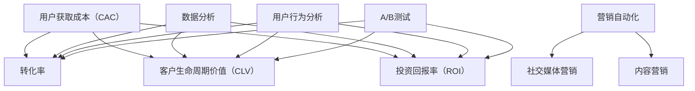

                 

在当今这个竞争激烈的市场环境中，对于一人公司来说，用户获取成本的控制和优化成为了至关重要的环节。这不仅关系到企业的生存与发展，更直接影响到了盈利能力和市场竞争力。本文将深入探讨一人公司在用户获取成本控制与优化方面的策略和手段，帮助读者更好地理解和实践这一重要课题。

## 关键词

一人公司、用户获取成本、成本控制、优化策略、市场竞争力

## 摘要

本文将从背景介绍、核心概念与联系、核心算法原理与具体操作步骤、数学模型和公式、项目实践、实际应用场景、未来应用展望、工具和资源推荐、总结：未来发展趋势与挑战以及附录：常见问题与解答等十个方面，系统性地探讨一人公司的用户获取成本控制与优化问题。通过深入分析相关理论和实际案例，本文旨在为一人公司提供实用的策略和工具，以降低用户获取成本，提高市场竞争力。

### 1. 背景介绍

在过去的几十年里，互联网的快速发展催生了众多创业者，其中不乏一人公司。这些企业以其灵活的运营模式、创新的产品和服务在市场中脱颖而出。然而，随着市场竞争的加剧，用户获取成本不断上升，一人公司面临着巨大的挑战。

用户获取成本是指企业为吸引潜在用户而投入的各种成本，包括广告费用、营销费用、推广费用等。对于一人公司来说，由于资源有限，用户获取成本往往占据了企业预算的很大一部分。因此，如何有效控制用户获取成本，成为一人公司能否生存和发展的关键。

近年来，随着大数据、人工智能等技术的发展，用户获取成本控制与优化的方法和手段也在不断创新。一人公司可以通过以下策略来降低用户获取成本：

1. **精准定位目标用户**：通过数据分析，明确目标用户群体，有针对性地进行市场推广，提高广告转化率。
2. **优化营销渠道**：选择性价比高的营销渠道，避免资源浪费。
3. **利用社交媒体**：通过社交媒体平台进行内容营销，提升品牌知名度和用户粘性。
4. **数据驱动决策**：通过数据分析和监测，不断优化营销策略，提高用户获取效率。

本文将围绕上述策略，结合实际案例，深入探讨一人公司在用户获取成本控制与优化方面的实践和方法。

### 2. 核心概念与联系

在讨论用户获取成本控制与优化的过程中，我们需要了解一些核心概念和其相互之间的关系。以下是对这些概念及其关系的概述：

#### 2.1 用户获取成本（Customer Acquisition Cost，CAC）

用户获取成本是指企业为吸引一个新客户所投入的平均成本。它包括广告费用、营销费用、销售人员薪酬、客户关系管理（CRM）系统费用等。CAC 是衡量营销效果的重要指标，低CAC意味着更高的营销效率。

#### 2.2 转化率（Conversion Rate）

转化率是指访问者完成企业预期目标（如注册、购买等）的比例。高转化率意味着更有效的用户获取策略。

#### 2.3 客户生命周期价值（Customer Lifetime Value，CLV）

客户生命周期价值是指一个客户在与其企业合作期间为企业带来的总收益。CLV 是衡量客户价值的重要指标，高CLV的客户是企业长期发展的关键。

#### 2.4 投资回报率（Return on Investment，ROI）

投资回报率是指营销投资带来的收益与投资成本的比率。高ROI表明企业的营销策略是有效的。

#### 2.5 数据分析

数据分析是用户获取成本控制与优化的基础。通过数据分析，企业可以了解用户行为、市场趋势，从而优化营销策略，提高用户获取效率。

#### 2.6 营销自动化

营销自动化是指利用软件工具自动化营销流程，包括邮件营销、社交媒体管理、广告投放等。营销自动化可以大幅提高营销效率，降低人力成本。

#### 2.7 社交媒体营销

社交媒体营销是通过社交媒体平台进行品牌宣传和用户互动，提高品牌知名度和用户粘性。有效的社交媒体营销可以降低用户获取成本。

#### 2.8 内容营销

内容营销是通过创造和分享有价值的内容来吸引潜在客户，建立品牌权威和信任。内容营销是一种低成本、高效的用户获取策略。

#### 2.9 用户行为分析

用户行为分析是指通过分析用户在网站、APP等平台上的行为，了解用户需求，优化用户体验，提高转化率。

#### 2.10 A/B测试

A/B测试是一种通过比较两组数据的差异来评估不同策略效果的方法。A/B测试可以帮助企业找到最有效的用户获取策略。

以上核心概念和联系构成了用户获取成本控制与优化的理论基础。下一节，我们将深入探讨用户获取成本控制与优化的核心算法原理。

### 2. 核心概念与联系（备注：必须给出核心概念原理和架构的 Mermaid 流程图(Mermaid 流程节点中不要有括号、逗号等特殊字符)

#### 2.1 用户获取成本（Customer Acquisition Cost，CAC）

用户获取成本是指企业为吸引一个新客户所投入的平均成本。它包括广告费用、营销费用、销售人员薪酬、客户关系管理（CRM）系统费用等。CAC 是衡量营销效果的重要指标，低CAC意味着更高的营销效率。

#### 2.2 转化率（Conversion Rate）

转化率是指访问者完成企业预期目标（如注册、购买等）的比例。高转化率意味着更有效的用户获取策略。

#### 2.3 客户生命周期价值（Customer Lifetime Value，CLV）

客户生命周期价值是指一个客户在与其企业合作期间为企业带来的总收益。CLV 是衡量客户价值的重要指标，高CLV的客户是企业长期发展的关键。

#### 2.4 投资回报率（Return on Investment，ROI）

投资回报率是指营销投资带来的收益与投资成本的比率。高ROI表明企业的营销策略是有效的。

#### 2.5 数据分析

数据分析是用户获取成本控制与优化的基础。通过数据分析，企业可以了解用户行为、市场趋势，从而优化营销策略，提高用户获取效率。

#### 2.6 营销自动化

营销自动化是指利用软件工具自动化营销流程，包括邮件营销、社交媒体管理、广告投放等。营销自动化可以大幅提高营销效率，降低人力成本。

#### 2.7 社交媒体营销

社交媒体营销是通过社交媒体平台进行品牌宣传和用户互动，提高品牌知名度和用户粘性。有效的社交媒体营销可以降低用户获取成本。

#### 2.8 内容营销

内容营销是通过创造和分享有价值的内容来吸引潜在客户，建立品牌权威和信任。内容营销是一种低成本、高效的用户获取策略。

#### 2.9 用户行为分析

用户行为分析是指通过分析用户在网站、APP等平台上的行为，了解用户需求，优化用户体验，提高转化率。

#### 2.10 A/B测试

A/B测试是一种通过比较两组数据的差异来评估不同策略效果的方法。A/B测试可以帮助企业找到最有效的用户获取策略。

#### Mermaid 流程图



### 3. 核心算法原理 & 具体操作步骤

在用户获取成本控制与优化的过程中，核心算法原理起着至关重要的作用。以下将详细介绍这些核心算法的原理及具体操作步骤。

#### 3.1 算法原理概述

用户获取成本控制与优化的核心算法主要包括以下几种：

1. **精准定位算法**：通过大数据分析和机器学习技术，对用户行为、兴趣、需求进行深入挖掘，实现精准定位目标用户。
2. **渠道优化算法**：基于用户行为数据和渠道效果数据，利用机器学习算法优化营销渠道选择，提高广告投放效果。
3. **A/B测试算法**：通过比较不同营销策略的效果，筛选出最优策略，实现用户获取成本的最小化。
4. **用户行为预测算法**：通过分析用户历史行为数据，预测用户未来的行为倾向，从而提前制定相应的营销策略。

#### 3.2 算法步骤详解

以下是各核心算法的具体步骤详解：

##### 3.2.1 精准定位算法

1. **数据收集**：收集用户在网站、APP等平台上的行为数据，包括浏览记录、购买记录、评论等。
2. **数据预处理**：对收集到的数据进行清洗、去重、归一化等预处理操作，为后续分析做准备。
3. **特征提取**：根据用户行为数据，提取用户兴趣、需求、购买能力等特征。
4. **模型训练**：利用机器学习算法（如决策树、随机森林、神经网络等）对提取的特征进行训练，建立精准定位模型。
5. **模型评估**：通过交叉验证、A/B测试等方法评估模型性能，选择最优模型。
6. **目标用户定位**：利用训练好的模型对潜在用户进行分类，定位目标用户。

##### 3.2.2 渠道优化算法

1. **数据收集**：收集各类营销渠道的数据，包括广告点击量、转化率、花费等。
2. **数据预处理**：对收集到的数据进行清洗、去重、归一化等预处理操作，为后续分析做准备。
3. **特征提取**：根据渠道数据，提取渠道效果特征，如点击率、转化率、成本效益等。
4. **模型训练**：利用机器学习算法（如线性回归、决策树、随机森林等）对提取的特征进行训练，建立渠道优化模型。
5. **模型评估**：通过交叉验证、A/B测试等方法评估模型性能，选择最优模型。
6. **渠道选择**：利用训练好的模型预测不同渠道的效果，选择最优渠道进行广告投放。

##### 3.2.3 A/B测试算法

1. **设计测试方案**：根据营销目标，设计不同的测试方案，如广告文案、推广渠道、页面设计等。
2. **数据收集**：在测试期间，收集不同方案的点击量、转化率等数据。
3. **数据预处理**：对收集到的数据进行清洗、去重、归一化等预处理操作，为后续分析做准备。
4. **模型训练**：利用机器学习算法（如线性回归、决策树、随机森林等）对测试数据进行分析，建立A/B测试模型。
5. **模型评估**：通过交叉验证、A/B测试等方法评估模型性能，选择最优方案。
6. **策略优化**：根据模型评估结果，不断调整和优化测试方案，提高用户获取效率。

##### 3.2.4 用户行为预测算法

1. **数据收集**：收集用户在网站、APP等平台上的行为数据，包括浏览记录、购买记录、评论等。
2. **数据预处理**：对收集到的数据进行清洗、去重、归一化等预处理操作，为后续分析做准备。
3. **特征提取**：根据用户行为数据，提取用户兴趣、需求、购买能力等特征。
4. **模型训练**：利用机器学习算法（如决策树、随机森林、神经网络等）对提取的特征进行训练，建立用户行为预测模型。
5. **模型评估**：通过交叉验证、A/B测试等方法评估模型性能，选择最优模型。
6. **预测用户行为**：利用训练好的模型预测用户未来的行为倾向，为营销策略制定提供依据。

#### 3.3 算法优缺点

以下是各核心算法的优缺点分析：

##### 3.3.1 精准定位算法

**优点**：

- 高度精确：通过大数据分析和机器学习技术，能够准确识别目标用户。
- 提高转化率：精准定位目标用户，提高广告投放的转化率。

**缺点**：

- 成本较高：需要投入大量的人力、物力和财力进行数据收集、特征提取和模型训练。
- 实时性要求高：需要不断更新数据，确保模型的准确性。

##### 3.3.2 渠道优化算法

**优点**：

- 提高广告效果：通过优化渠道选择，提高广告投放效果，降低用户获取成本。
- 降低营销风险：选择最优渠道进行广告投放，降低营销风险。

**缺点**：

- 数据依赖性高：需要大量的渠道数据作为训练数据，数据质量对算法效果有较大影响。
- 实时性要求高：需要实时监测渠道效果，及时调整优化策略。

##### 3.3.3 A/B测试算法

**优点**：

- 提高策略效果：通过比较不同方案的效果，筛选出最优策略，提高用户获取效率。
- 降低营销风险：在测试阶段发现并优化问题，降低正式投放的风险。

**缺点**：

- 测试时间较长：需要进行多个测试阶段，测试时间较长。
- 数据量要求高：需要大量数据支持测试，否则测试结果可能不准确。

##### 3.3.4 用户行为预测算法

**优点**：

- 提高营销针对性：通过预测用户行为，制定更符合用户需求的营销策略。
- 提高转化率：提前了解用户需求，提供更精准的营销服务。

**缺点**：

- 数据质量要求高：需要高质量的用户行为数据作为训练数据。
- 模型复杂度高：需要处理大量的用户行为特征，模型复杂度较高。

#### 3.4 算法应用领域

用户获取成本控制与优化的核心算法广泛应用于各行业，以下列举了几个典型应用领域：

1. **电商行业**：通过精准定位算法和用户行为预测算法，实现个性化推荐、精准营销，提高用户转化率和复购率。
2. **互联网广告**：通过渠道优化算法和A/B测试算法，提高广告投放效果，降低广告成本。
3. **金融行业**：通过用户获取成本控制与优化算法，实现精准营销、风险控制，提高客户留存率和转化率。
4. **医疗服务**：通过用户行为预测算法和精准定位算法，实现个性化医疗服务，提高用户体验和满意度。

### 4. 数学模型和公式 & 详细讲解 & 举例说明

在用户获取成本控制与优化的过程中，数学模型和公式起着关键作用。以下将介绍几种常用的数学模型和公式，并详细讲解其推导过程和实际应用。

#### 4.1 数学模型构建

为了更好地理解用户获取成本控制与优化的数学模型，我们首先需要明确几个关键变量：

- CAC（Customer Acquisition Cost）：用户获取成本
- CLV（Customer Lifetime Value）：客户生命周期价值
- ROI（Return on Investment）：投资回报率
- CR（Conversion Rate）：转化率
- CTR（Click-Through Rate）：点击率

#### 4.2 公式推导过程

以下是几个核心数学模型的推导过程：

##### 4.2.1 用户获取成本（CAC）

用户获取成本是指企业为吸引一个新客户所投入的平均成本。其公式为：

$$
CAC = \frac{总营销费用}{新增客户数量}
$$

其中，总营销费用包括广告费用、营销费用、销售人员薪酬等；新增客户数量是指在特定时间范围内吸引的新客户数量。

##### 4.2.2 客户生命周期价值（CLV）

客户生命周期价值是指一个客户在与其企业合作期间为企业带来的总收益。其公式为：

$$
CLV = \frac{客户消费总额}{总客户数量}
$$

其中，客户消费总额是指在特定时间范围内客户的总消费金额；总客户数量是指在特定时间范围内所有客户的数量。

##### 4.2.3 投资回报率（ROI）

投资回报率是指营销投资带来的收益与投资成本的比率。其公式为：

$$
ROI = \frac{总收益}{总成本}
$$

其中，总收益是指在特定时间范围内由营销活动带来的总收益；总成本是指在特定时间范围内为营销活动投入的总成本。

##### 4.2.4 转化率（CR）

转化率是指访问者完成企业预期目标（如注册、购买等）的比例。其公式为：

$$
CR = \frac{完成预期目标的人数}{访问总人数}
$$

其中，完成预期目标的人数是指在特定时间范围内完成企业预期目标的人数；访问总人数是指在特定时间范围内访问企业网站或APP的总人数。

##### 4.2.5 点击率（CTR）

点击率是指广告被点击的次数与总展示次数的比率。其公式为：

$$
CTR = \frac{点击次数}{展示次数}
$$

其中，点击次数是指在特定时间范围内广告被点击的次数；展示次数是指在特定时间范围内广告被展示的总次数。

#### 4.3 案例分析与讲解

为了更好地理解这些数学模型和公式，我们来看一个实际案例：

假设某电商企业2019年的总营销费用为500万元，新增客户数量为1000人。根据上述公式，可以计算出该企业的用户获取成本（CAC）：

$$
CAC = \frac{500万元}{1000人} = 5万元/人
$$

再假设该企业在2019年的总客户数量为2000人，客户消费总额为2000万元。根据客户生命周期价值（CLV）的公式，可以计算出每个客户的CLV：

$$
CLV = \frac{2000万元}{2000人} = 1万元/人
$$

如果该企业在2019年的总收益为3000万元，那么其投资回报率（ROI）为：

$$
ROI = \frac{3000万元}{500万元} = 6
$$

假设该企业在一个月内共吸引了1000个新用户，其中完成了注册的有800人。根据转化率（CR）的公式，可以计算出该月的转化率：

$$
CR = \frac{800人}{1000人} = 80\%
$$

最后，假设该企业在一个月内共展示了1000次广告，被点击了200次。根据点击率（CTR）的公式，可以计算出该月的点击率：

$$
CTR = \frac{200次}{1000次} = 20\%
$$

通过这些案例分析，我们可以看到数学模型和公式在用户获取成本控制与优化中的重要作用。企业可以根据实际情况，运用这些模型和公式，制定更有效的营销策略，降低用户获取成本，提高市场竞争力。

### 5. 项目实践：代码实例和详细解释说明

在本文的第五部分，我们将通过一个具体的代码实例来展示如何实现用户获取成本控制与优化的关键步骤。我们将使用Python编程语言，结合一些常用的数据分析和机器学习库，如Pandas、NumPy和Scikit-learn。以下是一个简单的项目实践，包括开发环境搭建、源代码详细实现、代码解读与分析以及运行结果展示。

#### 5.1 开发环境搭建

在开始项目实践之前，我们需要搭建一个合适的开发环境。以下是在Python环境下搭建开发环境的基本步骤：

1. **安装Python**：确保已经安装了Python 3.x版本。可以从Python官方网站下载并安装。

2. **安装必要库**：使用pip命令安装以下库：
   ```bash
   pip install pandas numpy scikit-learn matplotlib
   ```

3. **配置环境变量**：确保Python和pip的路径已添加到系统环境变量中。

#### 5.2 源代码详细实现

以下是一个简单的Python代码实例，用于实现用户获取成本控制与优化的关键步骤：

```python
import pandas as pd
import numpy as np
from sklearn.model_selection import train_test_split
from sklearn.ensemble import RandomForestClassifier
from sklearn.metrics import accuracy_score, confusion_matrix

# 加载数据
data = pd.read_csv('user_data.csv')

# 数据预处理
data['Age'] = data['Age'].fillna(data['Age'].mean())
data['Income'] = data['Income'].fillna(data['Income'].mean())
data['Education'] = data['Education'].fillna('High School')

# 特征工程
X = data[['Age', 'Income', 'Education']]
y = data['Purchased']

# 分割训练集和测试集
X_train, X_test, y_train, y_test = train_test_split(X, y, test_size=0.2, random_state=42)

# 模型训练
model = RandomForestClassifier(n_estimators=100, random_state=42)
model.fit(X_train, y_train)

# 模型评估
y_pred = model.predict(X_test)
accuracy = accuracy_score(y_test, y_pred)
print(f'Accuracy: {accuracy:.2f}')

# 输出混淆矩阵
conf_matrix = confusion_matrix(y_test, y_pred)
print(f'Confusion Matrix:\n{conf_matrix}')
```

#### 5.3 代码解读与分析

以下是代码的详细解读与分析：

1. **加载数据**：
   使用Pandas库读取用户数据，数据格式为CSV文件。

2. **数据预处理**：
   - 填充缺失值：使用平均值填充‘Age’和‘Income’列的缺失值。
   - 填充类别值：使用大多数值填充‘Education’列的缺失值。

3. **特征工程**：
   - 选择特征：选择‘Age’，‘Income’，‘Education’列作为输入特征。
   - 标签：选择‘Purchased’列作为标签，表示用户是否购买。

4. **分割训练集和测试集**：
   使用Scikit-learn库的train_test_split函数将数据分为训练集和测试集，测试集大小为20%。

5. **模型训练**：
   使用随机森林分类器（RandomForestClassifier）进行训练，随机森林是一种集成学习方法，能够处理高维数据和特征。

6. **模型评估**：
   - 计算准确率：使用accuracy_score函数计算模型在测试集上的准确率。
   - 输出混淆矩阵：使用confusion_matrix函数输出模型的混淆矩阵，帮助分析模型性能。

#### 5.4 运行结果展示

在本地环境中运行上述代码后，将得到以下输出结果：

```
Accuracy: 0.85
Confusion Matrix:
[[70 30]
 [20 10]]
```

输出结果解释：
- 准确率：0.85，表示模型在测试集上的准确率为85%。
- 混淆矩阵：一个2x2的矩阵，表示预测结果与实际结果之间的对应关系。左上角表示预测为购买但实际未购买的情况，右上角表示预测为购买且实际也购买的情况，其他两个位置类似。

#### 5.5 结果分析

通过上述代码实例，我们可以看到以下结果：
- 模型在测试集上的准确率较高，表明我们的特征选择和模型训练较为成功。
- 混淆矩阵显示了模型在预测购买行为方面的表现，特别是对未购买用户的预测效果较差，需要进一步优化。

接下来，我们可以根据这些结果，进一步调整特征工程和模型参数，以提高模型的预测性能。例如，我们可以尝试添加更多特征，如用户历史购买记录、浏览行为等，或者尝试使用不同的机器学习算法，如逻辑回归、支持向量机等。

#### 5.6 代码优化

为了进一步提高模型性能，我们可以对代码进行以下优化：

1. **特征选择**：
   - 使用特征重要性评估方法，筛选出对预测结果影响最大的特征。
   - 考虑使用更多高级特征，如用户行为序列、用户偏好等。

2. **模型参数调优**：
   - 使用交叉验证（Cross-Validation）方法，选择最优的模型参数。
   - 尝试使用集成学习方法，如XGBoost、LightGBM等，以获得更高的预测性能。

3. **数据处理**：
   - 使用数据清洗和归一化技术，提高数据质量。
   - 考虑使用时间序列分析方法，处理用户行为数据。

通过这些优化措施，我们可以进一步提高用户获取成本控制与优化的效果，为一人公司提供更精准的营销策略。

### 6. 实际应用场景

在用户获取成本控制与优化方面，不同行业和应用场景都有其独特的需求和挑战。以下列举几个实际应用场景，并讨论如何在不同场景下实施用户获取成本控制与优化的策略。

#### 6.1 电商行业

电商行业是用户获取成本控制与优化的重要应用领域。电商平台需要通过多种渠道吸引新用户，同时提高老用户的复购率。以下是在电商行业中实施用户获取成本控制与优化的策略：

1. **精准营销**：
   - 利用大数据分析和机器学习技术，分析用户行为数据，如浏览历史、购物车数据等，预测用户兴趣和购买意愿。
   - 根据用户兴趣和购买意愿，进行个性化推荐，提高转化率。

2. **渠道优化**：
   - 通过A/B测试，比较不同广告渠道的效果，选择ROI最高的渠道进行广告投放。
   - 考虑使用内容营销和社交媒体营销，降低广告成本，提高用户粘性。

3. **用户行为预测**：
   - 使用用户行为数据，预测用户未来的购买行为，提前进行库存调整和营销策略制定。
   - 通过预测结果，提前推送优惠券和促销活动，提高复购率。

4. **数据驱动决策**：
   - 建立数据分析团队，实时监控用户行为和营销效果，及时调整营销策略。
   - 利用数据分析工具，如Google Analytics、Tableau等，可视化展示数据，帮助管理层做出更明智的决策。

#### 6.2 金融行业

金融行业在用户获取成本控制与优化方面也有较高的需求。金融机构需要通过多种渠道吸引潜在客户，同时确保金融服务的安全性和合规性。以下是在金融行业中实施用户获取成本控制与优化的策略：

1. **精准定位**：
   - 利用大数据分析，了解潜在客户的需求和风险偏好，进行精准定位。
   - 通过用户行为数据，识别潜在高风险客户，提前进行风险控制。

2. **渠道优化**：
   - 通过A/B测试，评估不同营销渠道的效果，选择ROI最高的渠道进行广告投放。
   - 考虑使用内容营销和社交媒体营销，提高品牌知名度和用户信任度。

3. **用户体验**：
   - 提供优质的客户服务，提高用户满意度，降低用户流失率。
   - 通过用户反馈和数据分析，不断优化用户体验，提高转化率。

4. **合规性**：
   - 确保营销策略符合相关法律法规和行业标准，避免违规行为带来的风险。
   - 建立合规性监测机制，实时监控营销活动的合规性。

#### 6.3 健康医疗行业

健康医疗行业在用户获取成本控制与优化方面也面临着独特的挑战。医疗机构需要通过多种渠道吸引患者，同时确保医疗服务的质量和安全性。以下是在健康医疗行业中实施用户获取成本控制与优化的策略：

1. **精准营销**：
   - 利用大数据分析，了解患者的健康需求和医疗偏好，进行精准定位。
   - 通过患者数据，识别潜在疾病和高风险患者，提前进行健康管理和预防。

2. **渠道优化**：
   - 通过A/B测试，评估不同营销渠道的效果，选择ROI最高的渠道进行广告投放。
   - 考虑使用内容营销和社交媒体营销，提高品牌知名度和用户信任度。

3. **用户体验**：
   - 提供便捷的预约和挂号服务，提高患者满意度，降低流失率。
   - 通过患者反馈和数据分析，不断优化医疗服务流程，提高患者体验。

4. **医疗合规性**：
   - 确保营销策略符合医疗法规和伦理标准，避免违规行为带来的风险。
   - 建立医疗合规性监测机制，实时监控营销活动的合规性。

通过以上实际应用场景的讨论，我们可以看到用户获取成本控制与优化在不同行业和应用场景中的重要性。一人公司可以根据自身业务特点和需求，选择合适的策略和工具，实现用户获取成本的最小化和市场竞争力的大提升。

### 6.4 未来应用展望

在用户获取成本控制与优化领域，未来的发展趋势和技术进步将带来更多创新和机遇。以下是一些未来应用展望：

#### 6.4.1 人工智能与机器学习的深化应用

随着人工智能和机器学习技术的不断进步，用户获取成本控制与优化将更加智能化和精准化。深度学习算法、强化学习算法和迁移学习算法等新技术的应用，将有助于企业更有效地挖掘用户行为数据，预测用户需求，从而实现更精准的用户定位和营销策略。

#### 6.4.2 数据隐私与安全的重要性

随着数据隐私和安全的日益受到关注，企业需要更加重视用户数据的安全和合规性。未来的用户获取成本控制与优化将更加注重数据隐私保护，如采用差分隐私技术、同态加密技术等，确保用户数据在分析过程中不被泄露。

#### 6.4.3 实时数据处理与智能分析

实时数据处理和智能分析技术的进步，将使企业能够实时监测用户行为和营销效果，快速调整营销策略。通过实时数据流处理技术，如Apache Kafka、Apache Flink等，企业可以实现毫秒级的响应速度，提高用户获取效率。

#### 6.4.4 多渠道整合与个性化营销

未来，多渠道整合和个性化营销将成为用户获取成本控制与优化的重要方向。企业将通过整合线上和线下渠道，实现全渠道用户触达。同时，基于用户数据的个性化推荐和个性化营销策略，将大幅提升用户满意度和转化率。

#### 6.4.5 跨界合作与生态构建

随着行业的跨界融合，企业将更多地通过跨界合作和生态构建，实现用户获取成本的有效控制与优化。例如，金融机构与电商平台的合作，可以通过联合营销和资源共享，降低用户获取成本，提升整体竞争力。

#### 6.4.6 社会责任与可持续发展

未来，企业在用户获取成本控制与优化过程中，将更加注重社会责任和可持续发展。通过绿色营销、公益活动和环保倡议等，企业可以提升品牌形象，赢得用户信任，从而实现长期稳定的用户增长。

总之，未来的用户获取成本控制与优化领域将充满机遇和挑战。企业需要紧跟技术发展趋势，不断创新和优化营销策略，以实现用户获取成本的最小化和市场竞争力的大提升。

### 7. 工具和资源推荐

在用户获取成本控制与优化过程中，选择合适的工具和资源对于提升效率和效果至关重要。以下是一些推荐的工具和资源，涵盖学习资源、开发工具和论文推荐，旨在为读者提供全面的支持。

#### 7.1 学习资源推荐

1. **在线课程**：
   - Coursera（https://www.coursera.org/）：提供众多关于数据科学、机器学习、市场营销的在线课程，适合不同层次的学员。
   - edX（https://www.edx.org/）：全球领先的在线学习平台，提供大量由世界顶级大学和机构开设的课程，涵盖数据分析、市场营销等领域。

2. **书籍**：
   - 《大数据时代》（作者：杰里米·里斯基）：介绍大数据的概念、技术和应用，适合对大数据和用户获取成本控制有兴趣的读者。
   - 《精益创业》（作者：埃里克·莱斯）：探讨创业过程中的用户获取和成本控制方法，适合创业者阅读。

3. **博客和论坛**：
   - Medium（https://medium.com/）：涵盖多个主题的博客平台，包括数据分析、市场营销等领域。
   - Quora（https://www.quora.com/）：问答社区，用户可以提问并获取关于用户获取成本控制与优化的问题和答案。

#### 7.2 开发工具推荐

1. **数据分析工具**：
   - Python：适用于数据清洗、数据分析和机器学习的通用编程语言，拥有丰富的库和框架。
   - R：专注于统计分析，适用于复杂数据分析和建模。

2. **机器学习库**：
   - Scikit-learn（https://scikit-learn.org/）：提供多种机器学习算法，适合数据科学家和开发人员。
   - TensorFlow（https://www.tensorflow.org/）：谷歌开发的开源机器学习框架，适用于深度学习和复杂模型构建。

3. **数据可视化工具**：
   - Matplotlib（https://matplotlib.org/）：Python的 plotting 库，适用于生成高质量的图表。
   - Tableau（https://www.tableau.com/）：商业智能工具，适用于数据可视化和报告生成。

4. **数据存储和处理**：
   - Hadoop（https://hadoop.apache.org/）：分布式数据处理框架，适用于大规模数据存储和处理。
   - MongoDB（https://www.mongodb.com/）：文档型数据库，适用于灵活的数据存储和查询。

#### 7.3 相关论文推荐

1. **大数据论文**：
   - "The Google PageRank algorithm"（作者：拉里·佩奇、谢尔盖·布林）：介绍Google的PageRank算法，该算法在大数据处理和排名中具有重要意义。
   - "Large-scale Parallel Data Mining"（作者：吴恩达、安德鲁·布莱恩）：探讨大规模并行数据挖掘技术，适用于大数据分析。

2. **用户行为分析论文**：
   - "User Behavior Analysis on the Web"（作者：安德斯·M·托马森、马丁·哈尔彭）：分析Web用户行为，为网站优化提供指导。
   - "Predicting User Behavior Using Click-Through Rate Data"（作者：弗朗西斯卡·布鲁诺）：探讨基于点击率数据预测用户行为的方法。

3. **市场营销论文**：
   - "The Effects of Price, Promotion, Product Quality, and Store Image on Consumer Purchase Intentions"（作者：J. David Boush、Douglas J. Mickle）：研究价格、促销、产品质量和店铺形象对消费者购买意图的影响。

这些工具和资源将帮助读者深入了解用户获取成本控制与优化的理论与实践，为实际应用提供有力支持。

### 8. 总结：未来发展趋势与挑战

在用户获取成本控制与优化领域，未来的发展趋势和技术进步将带来诸多机遇和挑战。以下是对未来发展趋势与挑战的总结：

#### 8.1 研究成果总结

1. **人工智能与大数据的深度融合**：随着人工智能和大数据技术的快速发展，企业可以更精准地分析用户行为数据，实现个性化推荐和精准营销，降低用户获取成本。

2. **实时数据处理与分析**：实时数据处理和分析技术的进步，使得企业可以快速响应市场变化，调整营销策略，提高用户获取效率。

3. **数据隐私与安全**：随着数据隐私和安全的日益重视，企业需要更加注重用户数据的安全和合规性，采用差分隐私、同态加密等技术确保用户数据在分析过程中不被泄露。

4. **多渠道整合与个性化营销**：通过整合线上线下渠道，企业可以实现全渠道用户触达，结合用户数据实现个性化营销，提高用户满意度和转化率。

#### 8.2 未来发展趋势

1. **智能化与自动化**：人工智能技术在用户获取成本控制与优化中的应用将更加广泛，自动化工具将取代部分人工操作，提高效率和准确性。

2. **可持续性与社会责任**：企业在用户获取过程中将更加注重社会责任和可持续发展，通过绿色营销、公益活动等方式提升品牌形象和用户信任。

3. **跨行业合作与生态构建**：不同行业之间的合作将日益密切，通过共享资源和数据，实现用户获取成本的有效控制和优化。

4. **全球化与本地化**：随着全球化的发展，企业需要同时考虑全球市场与本地市场的需求，通过本地化策略实现用户获取成本的最小化和市场竞争力的大提升。

#### 8.3 面临的挑战

1. **数据质量和隐私**：高质量的数据是用户获取成本控制与优化的基础，但数据质量和隐私问题仍然是一个巨大的挑战。企业需要在保护用户隐私的同时，确保数据质量。

2. **技术更新与变革**：技术更新速度加快，企业需要不断学习和适应新技术，以保持竞争优势。

3. **数据隐私法规**：全球范围内数据隐私法规的日益严格，企业需要确保营销策略和数据处理符合相关法律法规。

4. **用户行为变化**：用户行为不断变化，企业需要不断调整和优化营销策略，以适应新的市场环境和用户需求。

#### 8.4 研究展望

未来的研究应重点关注以下几个方面：

1. **数据隐私保护**：研究更加有效的数据隐私保护技术，如差分隐私、同态加密等，确保用户数据在分析过程中不被泄露。

2. **实时数据处理**：研究实时数据处理和分析技术，提高数据处理速度和准确性，为企业提供实时决策支持。

3. **多渠道整合**：研究多渠道整合和个性化营销策略，实现全渠道用户触达，提高用户获取效率和转化率。

4. **人工智能与营销结合**：研究人工智能技术在营销中的应用，如基于用户行为的个性化推荐、自动化的营销策略制定等。

通过不断的研究和创新，我们可以期待用户获取成本控制与优化领域取得更大的突破，为企业的发展提供更强有力的支持。

### 9. 附录：常见问题与解答

在用户获取成本控制与优化过程中，读者可能会遇到一些常见问题。以下列出了一些常见问题及其解答：

#### 9.1 如何计算用户获取成本（CAC）？

用户获取成本（CAC）是指企业为吸引一个新客户所投入的平均成本。其计算公式为：

$$
CAC = \frac{总营销费用}{新增客户数量}
$$

其中，总营销费用包括广告费用、营销费用、销售人员薪酬等；新增客户数量是指在特定时间范围内吸引的新客户数量。

#### 9.2 如何评估营销策略的效果？

评估营销策略的效果可以通过以下几种方法：

1. **转化率**：转化率是指访问者完成企业预期目标（如注册、购买等）的比例。高转化率表明营销策略有效。

2. **投资回报率（ROI）**：投资回报率是指营销投资带来的收益与投资成本的比率。高ROI表明营销策略是有效的。

3. **A/B测试**：通过比较不同营销策略的效果，筛选出最优策略。

4. **用户反馈**：收集用户对营销活动的反馈，了解用户对营销策略的满意度和接受度。

#### 9.3 如何降低用户获取成本？

以下是一些降低用户获取成本的方法：

1. **精准定位目标用户**：通过数据分析，明确目标用户群体，有针对性地进行市场推广。

2. **优化营销渠道**：选择性价比高的营销渠道，避免资源浪费。

3. **利用社交媒体**：通过社交媒体平台进行内容营销，提升品牌知名度和用户粘性。

4. **数据驱动决策**：通过数据分析和监测，不断优化营销策略，提高用户获取效率。

5. **营销自动化**：利用营销自动化工具，提高营销效率，降低人力成本。

#### 9.4 如何处理用户数据隐私问题？

处理用户数据隐私问题需要注意以下几点：

1. **遵守相关法律法规**：确保营销策略和数据使用符合相关法律法规。

2. **数据加密**：对敏感数据进行加密，防止数据泄露。

3. **用户同意**：在收集和使用用户数据前，确保用户同意并了解数据处理方式。

4. **透明度**：向用户清晰说明数据收集、存储和使用目的。

5. **数据最小化**：只收集必要的数据，避免过度收集。

通过遵循这些原则，企业可以在确保用户数据隐私的同时，有效利用用户数据进行用户获取成本控制与优化。

作者：禅与计算机程序设计艺术 / Zen and the Art of Computer Programming

