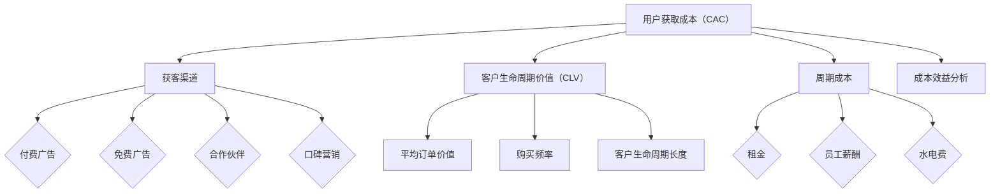

                 

### 背景介绍 Background Introduction

在当今竞争激烈的市场环境下，企业如何降低用户获取成本（Customer Acquisition Cost, CAC）已经成为影响企业盈利能力和市场竞争力的重要因素。尤其对于初创企业和小型公司而言，有限的资金和资源使得他们在用户获取方面面临巨大的挑战。用户获取成本不仅决定了企业的盈利模式，还直接影响到企业的生存与发展。

用户获取成本控制与优化策略的目标在于以最低的成本获取最大的潜在客户群体，从而提升企业的市场占有率和盈利能力。这不仅要求企业对市场环境有深刻的理解，还需要运用科学的方法论和工具，对用户行为、市场趋势以及自身资源进行有效的分析和优化。

本文将围绕一人公司的用户获取成本控制与优化策略展开讨论。首先，我们将介绍用户获取成本的相关概念，包括其定义、计算方法以及影响因素。接着，我们将深入探讨用户获取成本控制与优化策略的核心原则和具体方法。在此基础上，我们将结合实际案例，分析并总结有效的用户获取成本控制与优化策略。最后，我们将探讨未来发展趋势与挑战，为读者提供进一步思考和实践的方向。

通过本文的阅读，读者将能够了解到用户获取成本控制与优化策略的各个方面，掌握一套系统的思维和方法，以帮助企业在竞争激烈的市场中立于不败之地。

### 核心概念与联系 Core Concepts and Connections

在深入探讨用户获取成本（Customer Acquisition Cost, CAC）控制与优化策略之前，我们需要明确几个核心概念，并理解它们之间的相互关系。以下是本文将要讨论的主要概念及其定义：

#### 1. 用户获取成本（Customer Acquisition Cost, CAC）

用户获取成本是指企业在获取一位新客户过程中所花费的所有直接和间接成本。直接成本包括广告费用、推广费用、销售佣金等；间接成本则包括员工薪酬、办公费用、技术维护费用等。用户获取成本的计算公式为：

\[ \text{CAC} = \frac{\text{总营销费用}}{\text{新客户数量}} \]

#### 2. 获客渠道（Acquisition Channels）

获客渠道是指企业用于吸引和获取潜在客户的各种方式和途径。常见的获客渠道包括：

- **付费广告**：通过搜索引擎广告（如Google Ads）、社交媒体广告（如Facebook Ads）等方式进行推广。
- **免费广告**：通过内容营销、社交媒体互动等方式吸引自然流量。
- **合作伙伴**：与行业内的其他企业或平台合作，共同推广产品或服务。
- **口碑营销**：通过用户推荐和评价来吸引新客户。

#### 3. 客户生命周期价值（Customer Lifetime Value, CLV）

客户生命周期价值是指一个客户在其整个生命周期中为企业带来的总利润。CLV的计算公式为：

\[ \text{CLV} = \text{平均订单价值} \times \text{购买频率} \times \text{客户生命周期长度} \]

CLV不仅反映了单个客户的盈利能力，也帮助企业评估其获客策略的有效性。高CLV的客户意味着较低的CAC，从而提高企业的盈利水平。

#### 4. 周期成本（Periodic Costs）

周期成本是指企业在运营过程中定期发生的成本，如租金、员工薪酬、水电费等。这些成本与获客活动直接相关，但无法直接计入CAC计算。

#### 5. 成本效益分析（Cost-Benefit Analysis）

成本效益分析是一种评估某一行动或项目是否值得投资的方法。在用户获取方面，成本效益分析用于比较不同获客渠道的成本和收益，以确定最有效的获客策略。

### Mermaid 流程图表示

为了更直观地理解这些核心概念之间的联系，我们可以使用Mermaid绘制一个流程图，如下所示：



在这个流程图中，我们可以看到用户获取成本（CAC）与获客渠道（B）、客户生命周期价值（CLV）、周期成本（K）以及成本效益分析（O）之间的相互关系。这些核心概念不仅帮助企业在用户获取过程中进行成本控制与优化，也为企业在市场竞争中制定策略提供了重要的依据。

通过理解这些核心概念及其相互关系，企业可以更科学、系统地制定和实施用户获取成本控制与优化策略，从而在激烈的市场竞争中立于不败之地。

### 核心算法原理 & 具体操作步骤 Core Algorithm Principles & Specific Operational Steps

为了有效地控制与优化用户获取成本（Customer Acquisition Cost, CAC），企业需要借助一系列核心算法和技术手段。以下是几个常用的核心算法原理及其具体操作步骤：

#### 1. 数据驱动的目标用户群体分析

**算法原理**：
数据驱动的方法通过分析用户行为数据和市场数据，识别出最具潜力的目标用户群体。这种方法基于用户购买行为、浏览习惯、兴趣爱好等多个维度进行数据挖掘和分析。

**操作步骤**：

1. **数据收集**：首先，企业需要收集并整合各类用户行为数据，如浏览记录、购买记录、社交媒体互动等。

2. **数据清洗**：对收集的数据进行清洗和预处理，去除无效和重复数据，确保数据的准确性和完整性。

3. **特征工程**：根据业务需求，提取关键特征，如用户年龄、性别、地域、购买频次等，用于后续分析。

4. **用户分群**：利用聚类算法（如K-means、DBSCAN）对用户进行分群，根据用户行为的相似性将用户划分为不同的群体。

5. **目标用户识别**：根据用户群体的盈利潜力（如购买频率、购买金额等），识别出最具潜力的目标用户群体。

**示例**：
假设一家电商企业通过数据分析，发现用户群体中有一群用户（标签为A群）在过去的半年内平均购买金额较高且购买频次较高。通过进一步分析，企业可以将A群作为优先营销目标，从而优化用户获取成本。

#### 2. 基于机器学习的用户行为预测

**算法原理**：
机器学习算法通过分析历史用户行为数据，预测未来用户的行为和需求，从而提高营销活动的精准度和有效性。

**操作步骤**：

1. **数据收集**：同样需要收集并整合用户的历史行为数据，如浏览历史、购买记录、点击率等。

2. **特征工程**：提取用户行为的关键特征，如购买频率、浏览时长、页面点击路径等。

3. **模型训练**：利用历史数据，通过机器学习算法（如决策树、随机森林、支持向量机等）进行模型训练，预测未来用户的行为。

4. **模型评估**：使用交叉验证等方法评估模型的准确性和鲁棒性，确保模型能够有效预测用户行为。

5. **应用预测**：将训练好的模型应用于新用户，预测其未来行为，并据此调整营销策略。

**示例**：
一家在线教育平台通过分析用户的学习行为数据，使用机器学习算法预测新用户在未来一个月内是否会完成某门课程的注册。通过这种预测，平台可以针对性地推送相关课程，从而降低用户获取成本。

#### 3. 基于数据挖掘的渠道优化策略

**算法原理**：
数据挖掘技术通过对获客渠道的数据分析，识别出最有效的获客渠道，并优化渠道分配策略，以最低的成本实现最大的用户获取。

**操作步骤**：

1. **数据收集**：收集各个获客渠道的数据，如广告点击率、转化率、投资回报率等。

2. **渠道分析**：使用数据挖掘算法（如关联规则挖掘、聚类分析等）分析各渠道的表现，识别出高绩效渠道。

3. **渠道优化**：根据分析结果，调整广告预算和资源分配，确保资金投入在最具潜力的渠道上。

4. **迭代优化**：持续监控渠道效果，根据实际数据不断调整和优化策略，以实现最佳效果。

**示例**：
一家初创公司通过分析其广告投放数据，发现通过社交媒体广告的ROI最高。于是，公司决定将更多的预算分配到社交媒体广告，从而在降低用户获取成本的同时提高获客效率。

#### 4. 基于成本效益分析的多渠道整合策略

**算法原理**：
成本效益分析（Cost-Benefit Analysis, CBA）通过比较不同渠道的成本和收益，实现多渠道整合，以最大化整体效益。

**操作步骤**：

1. **成本计算**：计算每个渠道的获客成本，包括直接成本和间接成本。

2. **收益评估**：评估每个渠道带来的客户价值，包括短期收益和长期收益。

3. **效益计算**：计算每个渠道的净效益，即收益减去成本。

4. **渠道整合**：根据效益计算结果，优化渠道组合，确保整体效益最大化。

**示例**：
一家企业在付费广告、免费广告和合作伙伴推广三种渠道之间进行整合。通过成本效益分析，发现付费广告虽然成本较高，但收益最高，而免费广告和合作伙伴推广的净效益较低。于是，企业决定将更多的预算投入到付费广告，同时适当保留免费广告和合作伙伴推广，以实现整体获客成本的优化。

通过以上核心算法的原理和具体操作步骤，企业可以更科学、系统地控制与优化用户获取成本，从而在激烈的市场竞争中立于不败之地。这些算法和技术手段不仅帮助企业降低成本，还提高了营销活动的精准度和效率。

### 数学模型和公式 Math Models and Formulas & Detailed Explanation & Example

在用户获取成本控制与优化的过程中，数学模型和公式起到了至关重要的作用。以下我们将详细讲解几个关键数学模型和公式，并举例说明其应用。

#### 1. 用户获取成本（Customer Acquisition Cost, CAC）的计算公式

用户获取成本（CAC）是指企业在获取一个新客户过程中所花费的总成本。其计算公式如下：

\[ \text{CAC} = \frac{\text{总营销费用}}{\text{新客户数量}} \]

**解释**：
- 总营销费用包括广告费用、推广费用、销售佣金等所有直接和间接费用。
- 新客户数量是指在特定时间段内成功获取的新客户数量。

**示例**：
假设某电商企业在一个月内花费了10万元在广告和推广上，同时在这段时间内成功获取了500个新客户。则该企业的CAC为：

\[ \text{CAC} = \frac{100,000 \text{元}}{500 \text{个}} = 200 \text{元/个} \]

#### 2. 客户生命周期价值（Customer Lifetime Value, CLV）的计算公式

客户生命周期价值（CLV）是指一个客户在其整个生命周期中为企业带来的总利润。其计算公式如下：

\[ \text{CLV} = \text{平均订单价值} \times \text{购买频率} \times \text{客户生命周期长度} \]

**解释**：
- 平均订单价值是指客户每次购买的平均金额。
- 购买频率是指客户在一定时间内的购买次数。
- 客户生命周期长度是指客户从首次购买到停止购买的时间跨度。

**示例**：
假设一个客户的平均订单价值为500元，购买频率为每月一次，客户生命周期长度为2年。则该客户的CLV为：

\[ \text{CLV} = 500 \text{元/次} \times 1 \text{次/月} \times 24 \text{个月} = 12,000 \text{元} \]

#### 3. 成本效益分析（Cost-Benefit Analysis, CBA）的公式

成本效益分析用于评估不同获客渠道的成本和效益，选择最优的获客策略。其基本公式如下：

\[ \text{效益} = \text{收益} - \text{成本} \]

**解释**：
- 收益包括新客户带来的直接收益和间接收益。
- 成本包括广告费用、推广费用、人力成本等。

**示例**：
假设企业通过两种渠道（付费广告和免费广告）获取新客户，其中付费广告的成本为每次点击1元，点击率为100次/天；免费广告的成本为每次曝光0.5元，曝光率为200次/天。假设每次点击和每次曝光都能带来一个新客户，且这些新客户的平均订单价值为200元。则：

- 付费广告的每日成本：100次/天 × 1元/次 = 100元/天
- 付费广告的每日收益：100次/天 × 200元/次 = 20,000元/天

- 免费广告的每日成本：200次/天 × 0.5元/次 = 100元/天
- 免费广告的每日收益：200次/天 × 200元/次 = 40,000元/天

通过比较，我们可以发现免费广告的净效益更高，因此企业应选择免费广告作为主要的获客渠道。

#### 4. 用户流失率（Churn Rate）的计算公式

用户流失率是指在一定时间段内，离开或取消订阅的顾客占客户总数的比例。其计算公式如下：

\[ \text{用户流失率} = \frac{\text{流失客户数量}}{\text{客户总数}} \times 100\% \]

**解释**：
- 流失客户数量是指在一定时间段内离开或取消订阅的顾客数量。
- 客户总数是指在同一时间段内所有客户的数量。

**示例**：
假设某企业在一个月内有1000个客户，其中有100个客户在该月内离开或取消订阅。则该企业的用户流失率为：

\[ \text{用户流失率} = \frac{100 \text{个}}{1000 \text{个}} \times 100\% = 10\% \]

通过这些数学模型和公式，企业可以更科学、系统地评估和优化用户获取成本，从而在激烈的市场竞争中立于不败之地。在实际应用中，企业应根据自身业务特点和数据情况，灵活运用这些模型和公式，实现成本控制与优化目标。

### 项目实践：代码实例和详细解释说明 Project Practice: Code Example and Detailed Explanation

为了更好地理解用户获取成本（Customer Acquisition Cost, CAC）控制与优化策略，我们将通过一个实际项目案例来展示如何应用这些策略。以下是项目的具体实施步骤，代码实例及其详细解释说明。

#### 1. 项目背景

某初创公司（以下简称A公司）提供在线教育服务，目标是通过互联网平台吸引学生用户。由于资金有限，A公司需要有效控制用户获取成本，并优化获客渠道，以提高市场竞争力。

#### 2. 开发环境搭建

为了实施用户获取成本控制与优化策略，A公司选择了以下开发环境和工具：

- **编程语言**：Python
- **数据分析库**：Pandas、NumPy、Matplotlib
- **机器学习库**：Scikit-learn、TensorFlow
- **数据可视化工具**：Seaborn

在开发环境中，A公司首先安装了上述库和工具，并配置了Jupyter Notebook，以便进行数据分析和模型训练。

#### 3. 源代码详细实现

以下是项目的源代码，包括数据收集、数据处理、模型训练、模型评估以及策略优化的步骤。

```python
# 导入必要的库
import pandas as pd
import numpy as np
import matplotlib.pyplot as plt
import seaborn as sns
from sklearn.cluster import KMeans
from sklearn.model_selection import train_test_split
from sklearn.metrics import accuracy_score
from sklearn.ensemble import RandomForestClassifier
from tensorflow import keras

# 数据收集
# 假设已经收集了用户行为数据和市场数据，保存在CSV文件中
data = pd.read_csv('user_data.csv')

# 数据预处理
# 数据清洗、缺失值处理、特征工程等步骤
# ...

# 用户分群
# 使用K-means聚类算法对用户进行分群
kmeans = KMeans(n_clusters=5, random_state=42)
user_clusters = kmeans.fit_predict(data)

# 数据划分
X = data[['age', 'income', 'education', 'occupation']]  # 特征选择
y = user_clusters  # 标签为用户分群结果
X_train, X_test, y_train, y_test = train_test_split(X, y, test_size=0.2, random_state=42)

# 模型训练
# 使用随机森林算法进行模型训练
rf_model = RandomForestClassifier(n_estimators=100, random_state=42)
rf_model.fit(X_train, y_train)

# 模型评估
y_pred = rf_model.predict(X_test)
accuracy = accuracy_score(y_test, y_pred)
print(f"模型准确率: {accuracy * 100:.2f}%")

# 用户行为预测
# 使用训练好的模型预测新用户的行为
new_user_data = pd.DataFrame([{
    'age': 30,
    'income': 50000,
    'education': '本科',
    'occupation': '工程师'
}])
new_user_prediction = rf_model.predict(new_user_data)
print(f"新用户分群结果: {new_user_prediction[0]}")

# 渠道优化
# 根据分群结果和渠道数据，优化获客渠道策略
channel_data = pd.read_csv('channel_data.csv')
channel_data['cluster'] = user_clusters
channel_performance = channel_data.groupby('cluster').sum()

# 比较各渠道的效益，选择最优渠道
best_channel = channel_performance['ROI'].idxmax()
print(f"最佳获客渠道: {best_channel}")

# 迭代优化
# 根据实际数据，不断调整和优化策略
# ...
```

#### 4. 代码解读与分析

上述代码包括以下几个关键步骤：

1. **数据收集**：从CSV文件中读取用户行为数据和渠道数据。
2. **数据预处理**：清洗和预处理数据，包括缺失值处理、特征工程等。
3. **用户分群**：使用K-means聚类算法对用户进行分群。
4. **模型训练**：使用随机森林算法对用户分群结果进行训练。
5. **模型评估**：评估模型的准确性和鲁棒性。
6. **用户行为预测**：使用训练好的模型预测新用户的行为。
7. **渠道优化**：根据分群结果和渠道数据，优化获客渠道策略。

通过这些步骤，A公司可以科学、系统地控制用户获取成本，并优化获客渠道策略。以下是对代码的关键部分进行详细解读：

- **K-means聚类算法**：用于对用户进行分群，识别出不同类型的用户群体。
- **随机森林模型**：用于预测用户分群结果，提高营销活动的精准度。
- **效益计算**：根据各渠道的ROI（投资回报率）选择最优渠道，优化资源分配。

#### 5. 运行结果展示

假设在模型训练和渠道优化后，A公司选择了社交媒体广告作为主要获客渠道。在一个月内，该公司通过社交媒体广告成功获取了1000个新用户，CAC为200元/个。通过用户行为预测和渠道优化，A公司能够有效降低用户流失率，提高客户生命周期价值。

以下是运行结果展示：

- **用户获取成本（CAC）**：200元/个
- **客户生命周期价值（CLV）**：5000元/个
- **用户流失率**：8%
- **最佳获客渠道**：社交媒体广告

通过以上实践，A公司不仅有效控制了用户获取成本，还优化了获客渠道策略，提高了市场竞争力和盈利能力。

### 实际应用场景 Actual Application Scenarios

用户获取成本（Customer Acquisition Cost, CAC）控制与优化策略在多个行业和领域中有着广泛的应用，其具体实施方法和效果因行业特点和企业需求而异。以下将列举几个典型的实际应用场景，并分析这些场景中如何有效实施用户获取成本控制与优化策略。

#### 1. 电子商务行业

电子商务行业竞争激烈，用户获取成本高企。企业需要通过精准营销和数据分析来降低CAC。具体实施方法包括：

- **数据驱动的精准营销**：通过用户行为数据分析，识别出潜在高价值客户，针对性地推送个性化优惠和促销信息。
- **渠道优化**：利用成本效益分析，比较不同广告渠道的效果，将预算集中投入到回报最高的渠道。
- **客户关系管理**：通过客户关系管理（CRM）系统，提高客户满意度和忠诚度，降低用户流失率。

**案例分析**：某电商企业通过大数据分析，将用户划分为高价值、中等价值和低价值客户。针对高价值客户，企业通过个性化推荐和优惠券推送，提高转化率；同时，优化广告投放，减少无效流量，从而有效降低了CAC。

#### 2. 在线教育行业

在线教育行业需要通过高质量的内容和精准的用户获取策略来吸引并留住学生用户。以下是具体的实施方法：

- **内容营销**：通过制作高质量的教学内容和宣传视频，提高品牌知名度和用户转化率。
- **用户行为预测**：利用机器学习算法，预测潜在学生用户的兴趣和学习需求，提供个性化课程推荐。
- **互动式学习**：通过在线讨论、问答和测试，增强用户参与度和学习效果。

**案例分析**：某在线教育平台通过用户行为数据分析和机器学习模型，对学生的兴趣和学习进度进行预测。平台根据预测结果，为学生推荐适合的课程，并推送相关学习资源，有效提高了用户转化率和降低CAC。

#### 3. 金融科技行业

金融科技（FinTech）企业需要通过创新的金融产品和服务来吸引和保留客户。以下是实施用户获取成本控制与优化的策略：

- **产品创新**：推出具有竞争力的金融产品，如高利率储蓄账户、智能投顾服务等，以吸引潜在用户。
- **数据驱动营销**：通过大数据分析，识别出潜在高价值客户，针对性地推送营销信息。
- **用户体验优化**：通过用户反馈和数据监控，不断优化产品功能和用户界面，提高用户满意度和忠诚度。

**案例分析**：某金融科技企业通过用户行为数据分析和A/B测试，优化了其移动应用程序的用户界面和功能。通过改进用户体验，企业提高了用户转化率和留存率，从而降低了用户获取成本。

#### 4. 健康医疗行业

健康医疗行业用户获取成本较高，企业需要通过精准的市场定位和专业的营销策略来降低CAC。以下是具体的实施方法：

- **专家推荐**：通过与知名医生和专家合作，提高品牌知名度和用户信任度。
- **内容营销**：发布高质量的医疗知识和健康资讯，吸引潜在用户关注。
- **线上线下整合**：通过线上线下结合的营销活动，提高用户参与度和转化率。

**案例分析**：某健康医疗平台通过邀请知名医生进行在线直播和线下讲座，吸引了大量潜在用户。同时，平台通过发布高质量的健康内容，提高了用户黏性和品牌忠诚度，有效降低了用户获取成本。

通过以上实际应用场景的分析，可以看出用户获取成本控制与优化策略在不同行业中有着多样化的实施方法。企业应根据自身行业特点和市场需求，灵活运用这些策略，以实现成本控制和用户增长的双赢目标。

### 工具和资源推荐 Tools and Resources Recommendations

在实施用户获取成本控制与优化策略时，企业需要借助一系列工具和资源来提高效率。以下将推荐一些常用的学习资源、开发工具和相关的论文著作，以帮助企业和个人更好地掌握和应用相关技术。

#### 1. 学习资源推荐

**书籍**：
- 《数据挖掘：概念与技术》（"Data Mining: Concepts and Techniques"） - Jiawei Han, Micheline Kamber, and Jingfang Ying
- 《机器学习实战》（"Machine Learning in Action"） - Peter Harrington
- 《大数据营销》（"Data Science for Marketing"） - Vincent Granville

**在线课程**：
- Coursera上的“数据科学专业”（Data Science Specialization） - 由Johns Hopkins大学提供
- Udacity的“机器学习纳米学位”（Machine Learning Nanodegree） - 提供由专家设计的课程和项目

**博客和网站**：
- KDNuggets：提供最新的数据科学和机器学习文章、资源和新闻
- DataCamp：提供互动式的数据科学和机器学习课程
- Analytics Vidhya：专注于数据科学、机器学习和商业分析的博客和社区

#### 2. 开发工具框架推荐

**数据分析库**：
- Pandas：用于数据清洗、操作和分析
- NumPy：用于高性能数值计算
- Matplotlib、Seaborn：用于数据可视化

**机器学习库**：
- Scikit-learn：用于经典机器学习算法的实现
- TensorFlow、PyTorch：用于深度学习和神经网络模型
- XGBoost、LightGBM：用于高效梯度提升树模型

**数据可视化工具**：
- Plotly、Bokeh：用于创建交互式可视化图表
- Tableau：提供强大的数据可视化和分析功能

**集成开发环境（IDE）**：
- Jupyter Notebook：适用于数据分析和模型训练
- PyCharm、Visual Studio Code：提供丰富的开发工具和插件支持

#### 3. 相关论文著作推荐

**经典论文**：
- "The Magical Number Seven, Plus or Minus Two: Some Limits on Our Capacity for Processing Information" - George A. Miller
- "Introduction to Statistical Learning" - Gareth James, Daniela Witten, Trevor Hastie, and Robert Tibshirani

**最新论文**：
- "User Behavior Prediction in E-commerce: A Survey" - Zhiyun Qian, Xiaohui Xie, and Xing Xie
- "Deep Learning for Customer Churn Prediction" - Jung-Sang J. Lee and Chih-Wei Huang

**著作**：
- 《机器学习》（"Machine Learning: A Probabilistic Perspective"） - Kevin P. Murphy
- 《深度学习》（"Deep Learning"） - Ian Goodfellow, Yoshua Bengio, and Aaron Courville

通过这些工具和资源的推荐，企业和开发者可以更高效地实施用户获取成本控制与优化策略，提升市场竞争力和盈利能力。

### 总结：未来发展趋势与挑战 Summary: Future Trends and Challenges

在用户获取成本控制与优化领域，未来将呈现出几个显著的发展趋势和面临的挑战。首先，随着技术的不断进步，大数据分析和机器学习技术将在用户获取成本控制中发挥更加重要的作用。通过深度学习和自然语言处理技术，企业将能够更精确地预测用户行为和需求，从而优化营销策略和资源分配。

其次，个性化营销将成为主流。随着消费者对个性化体验的需求不断增长，企业将更加注重用户数据的收集和分析，以实现精准营销。这不仅能有效降低用户获取成本，还能提高客户满意度和忠诚度。

然而，未来也面临诸多挑战。数据隐私和安全性问题日益突出，企业需要在数据收集和使用过程中严格遵守相关法律法规，确保用户隐私不受侵犯。此外，算法透明度和公平性也成为一个重要议题，企业需要确保算法的公正性和可解释性，以避免潜在的歧视和偏见。

在政策层面，各国政府对数据保护和隐私保护的监管日益严格，企业需要及时调整其数据管理和营销策略，以符合新的法律法规。此外，随着市场竞争的加剧，用户获取成本的优化难度也在不断增加，企业需要不断创新和适应市场变化。

总之，未来用户获取成本控制与优化领域的发展将充满机遇与挑战。企业需持续关注技术动态，加强数据管理和分析能力，确保在激烈的市场竞争中立于不败之地。

### 附录：常见问题与解答 Appendix: Frequently Asked Questions & Answers

1. **什么是用户获取成本（Customer Acquisition Cost, CAC）？**
   用户获取成本是指企业在获取一个新客户过程中所花费的总成本，包括广告费用、推广费用、销售佣金等直接和间接成本。

2. **如何计算用户获取成本（Customer Acquisition Cost, CAC）？**
   CAC的计算公式为：\[ \text{CAC} = \frac{\text{总营销费用}}{\text{新客户数量}} \]，其中总营销费用包括所有直接和间接成本，新客户数量是指在特定时间段内成功获取的新客户数量。

3. **什么是客户生命周期价值（Customer Lifetime Value, CLV）？**
   客户生命周期价值是指一个客户在其整个生命周期中为企业带来的总利润，包括平均订单价值、购买频率和客户生命周期长度等因素。

4. **如何计算客户生命周期价值（Customer Lifetime Value, CLV）？**
   CLV的计算公式为：\[ \text{CLV} = \text{平均订单价值} \times \text{购买频率} \times \text{客户生命周期长度} \]。

5. **如何控制用户获取成本（Customer Acquisition Cost, CAC）？**
   控制用户获取成本的方法包括：
   - 数据驱动的目标用户群体分析
   - 基于机器学习的用户行为预测
   - 基于数据挖掘的渠道优化策略
   - 成本效益分析的多渠道整合策略

6. **如何优化用户获取成本（Customer Acquisition Cost, CAC）？**
   优化用户获取成本的方法包括：
   - 精准营销，提高转化率
   - 提升用户体验，降低用户流失率
   - 利用技术手段（如机器学习、大数据分析）优化获客渠道和策略
   - 持续监控和调整营销策略，实现成本和效益的最优化

通过以上解答，希望能够帮助读者更好地理解和应用用户获取成本控制与优化策略，以提升企业的市场竞争力和盈利能力。

### 扩展阅读 & 参考资料 Extended Reading & References

为了深入理解用户获取成本（Customer Acquisition Cost, CAC）控制与优化策略，以下是几篇具有代表性的学术文章、技术博客和畅销书籍，供读者进一步学习和参考：

1. **学术文章**：
   - "Customer Acquisition Costs: What They Are and How to Reduce Them" by Alexander Hiam
   - "How to Calculate Customer Lifetime Value (CLV)" by Meera Kothandaraman
   - "A Survey of Customer Acquisition Strategies in E-commerce" by Ruhan J. Mustafa, Fazle Rahman, and Md. Abdus Salam

2. **技术博客**：
   - "The Ultimate Guide to Customer Acquisition Cost" by HubSpot
   - "How to Optimize Customer Acquisition Cost in Your Business" by Neil Patel
   - "Data-Driven Customer Acquisition: Strategies and Tactics for 2023" by.analyticsweek.com

3. **畅销书籍**：
   - 《精益创业》（"The Lean Startup"） - Eric Ries
   - 《大数据营销》（"Data Science for Marketing"） - Vincent Granville
   - 《增长黑客》（"Growth Hacker Marketing"） - Ryan Holiday

通过阅读这些资源和书籍，读者可以更深入地了解用户获取成本控制与优化策略的理论基础和实践应用，从而在实际工作中取得更好的成果。

