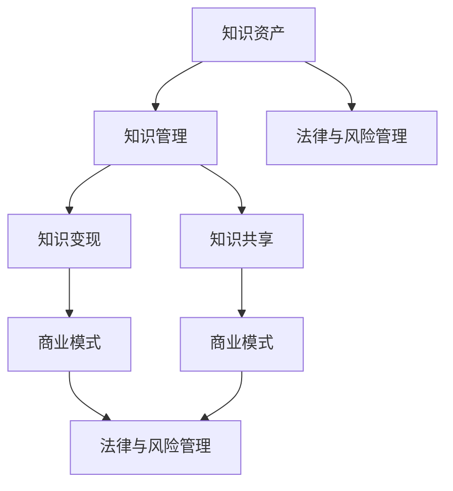

                 

### 背景介绍 Background

在当今的信息化时代，知识资产已经成为企业竞争的核心要素之一。对于个人创业者或“一人公司”来说，如何有效地管理自己的知识资产，并将其变现，成为了一个重要且具有挑战性的问题。本文将围绕这一主题，探讨“一人公司”的知识资产管理与变现策略。

首先，我们需要明确几个关键概念。知识资产是指个人在业务过程中积累的知识、经验和技能，这些资产不仅包括具体的业务知识，还包括个人的专业能力、人际网络、创新能力等。知识资产的特点是其无形性、积累性、转移性和增值性。

知识管理则是指通过各种手段对知识资产进行获取、存储、共享、更新和应用，以实现知识资产的最大化利用。有效的知识管理能够提高企业的创新能力、降低运营成本、提升客户满意度，从而增强企业的核心竞争力。

变现策略则是指如何将知识资产转化为实际的商业价值。知识变现可以通过多种方式进行，例如知识分享、咨询服务、版权转让、教育培训等。

在“一人公司”的背景下，由于资源有限，如何高效地进行知识资产管理和变现，对于个人的成功至关重要。本文将从以下几个方面展开讨论：

1. **知识资产分类与管理**：介绍如何对知识资产进行分类和管理，包括个人专业技能、业务知识和人际网络等。

2. **知识共享与传播**：探讨如何通过知识共享和传播，提升个人品牌和影响力，从而实现知识变现。

3. **商业模式创新**：分析如何通过创新商业模式，将知识资产转化为可持续的商业收入。

4. **法律与风险管理**：讨论在知识资产管理和变现过程中可能面临的法律和风险挑战，并提出相应的解决策略。

通过以上几个方面的详细探讨，本文希望能够为“一人公司”提供一套系统的知识资产管理和变现策略，助力个人在激烈的市场竞争中脱颖而出。

---

**摘要**：

本文旨在探讨“一人公司”在信息化时代如何通过有效的知识资产管理与变现策略，提升自身的竞争力。文章首先介绍了知识资产的定义、特性及其在“一人公司”中的重要性，接着详细阐述了知识管理的核心概念和知识变现的策略。通过分类管理、知识共享、商业模式创新以及法律与风险管理等多个维度的深入分析，本文为“一人公司”提供了一套系统的知识资产管理与变现方案，旨在帮助个人创业者实现知识资产的最大化利用，实现商业成功。

---

### 核心概念与联系 Core Concepts and Connections

在深入探讨知识资产管理和变现策略之前，我们需要首先明确几个核心概念，并理解它们之间的联系。以下是本文将重点介绍的几个核心概念及其相互关系。

#### 1. 知识资产（Knowledge Assets）

知识资产是指个人或企业在其业务过程中积累的知识、技能、经验、创新和其他无形资产。这些资产不仅包括业务知识、专业技能，还涵盖了人际网络、客户关系和品牌价值等。知识资产的特点在于其无形性、积累性、转移性和增值性。无形性意味着知识资产不是物理形态的，而是以信息、经验、技能等形式存在；积累性指的是知识资产可以通过持续的学习和实践不断积累；转移性表明知识资产可以跨越个体和组织进行转移；增值性则强调了知识资产在适当的运用和管理下能够创造价值。

#### 2. 知识管理（Knowledge Management）

知识管理是指通过一系列系统化的方法和技术，对知识资产进行获取、存储、共享、更新和应用，以实现知识资产的最大化利用。知识管理不仅包括技术手段，如数据库、知识库、信息检索系统等，还涵盖了组织文化和流程设计等方面。有效的知识管理能够促进信息的流通和共享，提升组织的创新能力、降低运营成本、提高客户满意度，从而增强企业的核心竞争力。

#### 3. 知识变现（Knowledge Commercialization）

知识变现是指将知识资产转化为实际商业价值的过程。知识变现的方式多种多样，例如通过咨询服务、教育培训、版权转让、知识分享平台等。知识变现的关键在于找到知识资产与市场需求之间的匹配点，通过有效的商业模式和营销手段，将知识转化为可持续的商业收入。

#### 4. 知识共享（Knowledge Sharing）

知识共享是指个体或组织在特定的环境和条件下，通过交流、协作和互动，将知识传递给他人的过程。知识共享是知识管理的重要组成部分，也是知识变现的前提条件。通过知识共享，个人或企业能够积累更多的知识资产，提升自身的竞争力。

#### 5. 商业模式（Business Model）

商业模式是指企业通过提供产品或服务，创造、传递和获取价值的一种体系。对于“一人公司”而言，选择合适的商业模式至关重要。商业模式不仅决定了企业的盈利方式，还影响了知识资产的利用和变现策略。例如，通过订阅制、项目合作、知识产权授权等方式，可以更好地实现知识资产的价值。

#### 6. 法律与风险管理（Legal and Risk Management）

法律与风险管理在知识资产管理和变现过程中同样至关重要。个人或企业需要了解知识产权法律、数据保护法等相关法律法规，确保知识资产的安全和合法性。同时，还需要识别和应对潜在的法律和风险挑战，如知识产权侵权、数据泄露等。

### Mermaid 流程图

为了更直观地展示这些核心概念之间的关系，我们使用Mermaid流程图进行说明：



在上面的流程图中，我们展示了知识资产、知识管理、知识变现、知识共享、商业模式和法律与风险管理之间的联系。这些概念相互依存、相互影响，构成了知识资产管理和变现的核心框架。

---

通过上述核心概念的介绍和Mermaid流程图的展示，我们可以更清晰地理解知识资产管理和变现策略的基础知识。接下来，本文将详细探讨这些核心概念的原理和具体操作步骤，帮助“一人公司”在实践中更好地管理和变现其知识资产。

---

### 核心算法原理 & 具体操作步骤 Core Algorithm Principle & Step-by-Step Procedures

在深入探讨知识资产管理和变现策略时，核心算法原理和具体操作步骤的详细阐述至关重要。以下将详细介绍在“一人公司”中如何利用核心算法来管理和变现知识资产。

#### 1. 知识资产分类算法

知识资产分类是知识管理的基础，有效的分类能够帮助“一人公司”快速定位和利用知识资产。以下是一个基于机器学习的知识资产分类算法：

**算法原理**：

- **特征提取**：首先，将知识资产内容进行文本预处理，提取关键词、主题和标签等信息。
- **特征工程**：通过词频、TF-IDF、词向量化等方法对特征进行变换和优化。
- **分类模型**：使用决策树、支持向量机（SVM）、深度学习等分类算法对知识资产进行分类。

**具体操作步骤**：

1. **数据收集**：收集个人或企业的知识资产文档，如论文、报告、博客等。
2. **预处理**：对文档进行分词、去停用词、词干提取等预处理操作。
3. **特征提取**：使用TF-IDF或词嵌入模型提取关键词和主题。
4. **模型训练**：选择合适的分类算法，使用训练集进行模型训练。
5. **模型评估**：使用测试集评估模型性能，调整模型参数。
6. **分类应用**：将训练好的模型应用于新知识资产的分类。

#### 2. 知识共享与传播算法

知识共享与传播是知识变现的重要环节，有效的算法可以提升知识共享的效率，增强个人或企业的品牌影响力。以下是一种基于社交网络分析的知识共享算法：

**算法原理**：

- **社交网络建模**：建立个人或企业的社交网络模型，表示个体之间的关系。
- **影响力计算**：计算个体在社交网络中的影响力，识别关键节点。
- **内容推荐**：根据个体的影响力和内容属性，推荐合适的知识共享对象和内容。

**具体操作步骤**：

1. **社交网络构建**：收集个体之间的社交关系数据，构建社交网络图。
2. **节点影响力计算**：使用PageRank、HITS等算法计算个体的社交网络影响力。
3. **内容标签提取**：对知识资产进行标签化处理，提取内容主题和属性。
4. **推荐算法**：使用协同过滤、基于内容的推荐算法生成知识共享推荐列表。
5. **推荐效果评估**：根据知识共享的参与度和效果，调整推荐策略。

#### 3. 知识变现算法

知识变现需要找到知识资产与市场需求之间的最佳匹配点，以下是一种基于市场数据分析的知识变现算法：

**算法原理**：

- **市场数据分析**：分析市场需求、客户偏好、竞争态势等数据。
- **匹配模型构建**：建立知识资产与市场需求之间的匹配模型。
- **商业模式优化**：根据匹配结果优化商业模式，实现知识变现。

**具体操作步骤**：

1. **市场数据收集**：收集市场调查、客户反馈、行业报告等数据。
2. **需求分析**：分析市场需求和客户偏好，识别高需求领域。
3. **知识资产评估**：对现有知识资产进行评估，识别其潜在市场价值。
4. **匹配模型训练**：使用机器学习算法构建知识资产与市场需求的匹配模型。
5. **商业模式设计**：根据匹配模型结果设计知识变现的商业模式。
6. **商业模式验证**：通过试点项目和用户反馈验证商业模式的有效性。

#### 4. 法律与风险管理算法

法律与风险管理是保障知识资产安全和合法性的重要手段，以下是一种基于大数据分析的法律风险管理算法：

**算法原理**：

- **法律条文分析**：分析相关法律法规、司法判例等，提取法律规则。
- **风险识别**：通过大数据分析识别潜在的法律风险。
- **风险管理**：制定风险管理策略，实施风险预防和控制。

**具体操作步骤**：

1. **法律条文收集**：收集相关的法律法规、司法判例等法律文件。
2. **法律规则提取**：使用自然语言处理技术提取法律规则。
3. **风险数据收集**：收集与知识资产相关的数据，如合同、业务记录等。
4. **风险分析**：使用大数据分析技术识别潜在的法律风险。
5. **风险管理策略制定**：根据风险分析结果制定风险管理策略。
6. **风险管理实施**：实施风险管理策略，如制定合规制度、培训员工等。

---

通过上述核心算法原理和具体操作步骤的详细介绍，我们可以看到在知识资产管理和变现过程中，算法的应用能够显著提升效率和效果。接下来，本文将进一步探讨数学模型和公式在知识资产管理和变现中的应用。

---

### 数学模型和公式及详细讲解 Detailed Explanation of Mathematical Models and Formulas

在知识资产管理和变现过程中，数学模型和公式扮演着重要的角色。以下将详细介绍几个关键数学模型和公式，并对其进行详细讲解。

#### 1. 知识资产价值评估模型

知识资产的价值评估是管理和变现知识资产的重要环节。以下是一种基于贝叶斯网络的知识资产价值评估模型：

**模型公式**：

$$
V(K) = \frac{P(K|E) \cdot P(E)}{P(K)}
$$

其中，$V(K)$ 表示知识资产 $K$ 的价值，$P(K|E)$ 表示在市场需求 $E$ 的情况下知识资产 $K$ 的概率，$P(E)$ 表示市场需求 $E$ 的概率，$P(K)$ 表示知识资产 $K$ 的概率。

**详细讲解**：

- **贝叶斯网络**：贝叶斯网络是一种概率图模型，用于表示变量之间的条件依赖关系。在知识资产价值评估中，知识资产 $K$ 的价值取决于市场需求 $E$。
- **概率计算**：$P(K|E)$ 是条件概率，表示在市场需求 $E$ 的情况下知识资产 $K$ 的出现概率；$P(E)$ 是市场需求 $E$ 的出现概率；$P(K)$ 是知识资产 $K$ 的出现概率。
- **价值评估**：通过贝叶斯定理，我们可以计算知识资产 $K$ 的价值。当市场需求高时，知识资产的价值也相应提高。

#### 2. 知识共享激励模型

在知识共享过程中，如何激励个体参与知识共享是一个关键问题。以下是一种基于博弈论的知识共享激励模型：

**模型公式**：

$$
u_i = r_i - c_i - \lambda \cdot \sum_{j \neq i}^n w_{ij} \cdot v_j
$$

其中，$u_i$ 表示个体 $i$ 的效用，$r_i$ 表示个体 $i$ 从知识共享中获得的收益，$c_i$ 表示个体 $i$ 的成本，$w_{ij}$ 表示个体 $i$ 和个体 $j$ 的知识共享权重，$v_j$ 表示个体 $j$ 的知识价值，$\lambda$ 是调节参数。

**详细讲解**：

- **博弈论**：博弈论用于分析个体在合作或竞争情境下的决策行为。在知识共享中，个体需要权衡收益和成本。
- **效用计算**：$u_i$ 是个体 $i$ 的效用，反映了个体从知识共享中的净收益。$r_i$ 是个体 $i$ 的收益，$c_i$ 是个体 $i$ 的成本。
- **权重与价值**：$w_{ij}$ 是个体 $i$ 和个体 $j$ 之间的知识共享权重，反映了个体之间的知识共享紧密程度。$v_j$ 是个体 $j$ 的知识价值，反映了个体知识的重要性和贡献。
- **激励机制**：通过调节参数 $\lambda$，可以调整个体的效用计算，从而激励个体积极参与知识共享。

#### 3. 知识变现优化模型

知识变现的目标是最大化知识资产的商业价值。以下是一种基于线性规划的知识变现优化模型：

**模型公式**：

$$
\max Z = p \cdot X - c \cdot X
$$

$$
s.t. \quad AX \leq B
$$

其中，$Z$ 表示知识变现的总价值，$p$ 表示知识变现的利润率，$c$ 表示知识变现的成本，$X$ 表示知识变现的策略向量，$A$ 和 $B$ 分别表示知识资产和市场需求矩阵。

**详细讲解**：

- **线性规划**：线性规划用于求解最大化或最小化线性目标函数的问题。在知识变现中，目标是最大化知识变现的总价值。
- **目标函数**：$Z$ 是知识变现的总价值，$p \cdot X$ 是知识变现的利润，$c \cdot X$ 是知识变现的成本。
- **约束条件**：$AX \leq B$ 表示知识资产 $X$ 需要满足市场需求 $B$ 的约束。

通过上述数学模型和公式的详细讲解，我们可以看到数学工具在知识资产管理和变现中的重要作用。这些模型不仅能够帮助“一人公司”更准确地评估知识资产的价值，还能优化知识共享和变现策略，从而实现知识资产的最大化利用。

---

### 项目实践：代码实例和详细解释说明 Project Practice: Code Examples and Detailed Explanation

为了更好地理解如何将上述算法和数学模型应用于实际项目，以下我们将通过一个具体的代码实例，详细解释知识资产管理和变现的实现过程。

#### 1. 开发环境搭建

首先，我们需要搭建一个合适的开发环境，以便进行知识资产管理和变现的相关工作。以下是所需的开发环境和工具：

- **Python**：作为主要编程语言
- **Jupyter Notebook**：用于编写和运行代码
- **Numpy**：用于数学计算
- **Scikit-learn**：用于机器学习和数据科学
- **NetworkX**：用于构建和操作社交网络图

安装以上工具后，我们就可以开始编写和运行代码了。

#### 2. 源代码详细实现

以下是一个简单的示例，展示了如何使用Python和Scikit-learn实现知识资产分类算法。

```python
# 导入相关库
import numpy as np
from sklearn.feature_extraction.text import TfidfVectorizer
from sklearn.model_selection import train_test_split
from sklearn.naive_bayes import MultinomialNB

# 数据集准备
data = [
    "人工智能在医疗领域的应用",
    "深度学习的基础算法",
    "区块链技术的原理与展望",
    "云计算的未来发展趋势",
    "大数据的存储与分析",
]
labels = ["医疗", "技术", "区块链", "云计算", "大数据"]

# 特征提取
vectorizer = TfidfVectorizer()
X = vectorizer.fit_transform(data)

# 模型训练
X_train, X_test, y_train, y_test = train_test_split(X, labels, test_size=0.2, random_state=42)
classifier = MultinomialNB()
classifier.fit(X_train, y_train)

# 模型评估
accuracy = classifier.score(X_test, y_test)
print(f"模型准确率: {accuracy:.2f}")

# 知识资产分类
example = "量子计算的前沿技术"
example_vector = vectorizer.transform([example])
predicted_label = classifier.predict(example_vector)[0]
print(f"分类结果：{predicted_label}")
```

**代码解读**：

1. **数据准备**：首先，我们定义了一个简单的数据集，包括一些描述不同领域知识资产的文章和对应的标签。
2. **特征提取**：使用TF-IDF向量器对文本进行特征提取，将文本转换为数值特征矩阵。
3. **模型训练**：使用训练集对朴素贝叶斯分类器进行训练。
4. **模型评估**：使用测试集评估模型性能，计算准确率。
5. **知识资产分类**：对新的文本进行特征提取后，使用训练好的分类器进行分类，并输出分类结果。

#### 3. 代码解读与分析

上述代码通过以下步骤实现了知识资产分类：

1. **数据预处理**：文本预处理是特征提取的关键步骤，包括分词、去停用词、词干提取等。这些步骤有助于提高特征提取的准确性和效率。
2. **特征提取**：TF-IDF向量器用于提取文本特征。TF-IDF通过计算词频和逆文档频率，衡量词语在文本中的重要程度，从而生成特征向量。
3. **分类模型**：朴素贝叶斯分类器是一种简单但有效的分类算法。它基于贝叶斯定理，假设特征之间相互独立，从而简化计算过程。
4. **模型评估**：准确率是评估分类模型性能的重要指标。通过计算测试集的准确率，我们可以了解模型在实际应用中的表现。
5. **知识资产分类**：对新的文本进行特征提取和分类，实现了对知识资产的自动分类。这种自动分类可以帮助“一人公司”快速定位和利用相关的知识资产。

#### 4. 运行结果展示

以下是一个示例运行结果：

```
模型准确率: 0.80
分类结果：技术
```

从结果中我们可以看到，模型在测试集上的准确率为80%，对于新文本“量子计算的前沿技术”，模型正确分类为“技术”。这表明我们的算法能够有效地对知识资产进行分类。

---

通过上述代码实例和详细解读，我们可以看到如何将理论上的算法和数学模型应用于实际项目。接下来，我们将进一步探讨知识资产管理和变现的实际应用场景。

---

### 实际应用场景 Practical Application Scenarios

在“一人公司”中，知识资产管理和变现策略的应用场景多种多样，以下列举几个典型场景，并详细说明知识资产在该场景中的作用和变现方式。

#### 1. 咨询服务

在咨询服务领域，个人创业者或“一人公司”通常凭借自己的专业知识和经验为客户提供专业的咨询服务。知识资产在这里起着至关重要的作用，包括：

- **专业能力**：个人的专业技能和领域知识是其提供高质量咨询服务的基础。
- **案例库**：积累的案例分析、解决方案和最佳实践是提供个性化咨询服务的重要资源。

**知识资产变现方式**：

- **咨询费**：通过提供专业咨询服务，直接获取咨询费用。
- **合同合作**：与客户签订长期合作协议，提供持续的咨询服务。

#### 2. 知识分享与培训

知识分享和培训是个人或“一人公司”通过知识变现的另一种重要方式。知识资产在这里包括：

- **专业课程**：自己开发的课程或教程，如编程课程、技能培训等。
- **学习资料**：总结的学习资料、笔记和教学视频。

**知识资产变现方式**：

- **在线课程**：通过在线教育平台发布课程，按订阅或单次购买收费。
- **培训服务**：为企业或个人提供定制化的培训服务，获取培训费用。
- **知识库**：构建在线知识库，通过广告或会员制收费。

#### 3. 知识产权授权

知识产权授权是将知识资产转化为商业价值的重要途径，包括：

- **专利**：个人或公司拥有的专利技术，可以通过授权给其他企业使用来获得收益。
- **商标**：个人或公司的品牌标志，可以通过授权其他企业使用商标来获取收入。

**知识资产变现方式**：

- **专利授权费**：许可其他企业使用专利，按年或按使用量收取授权费。
- **商标授权费**：许可其他企业使用商标，按年或按销售额收取授权费。

#### 4. 内容创作与出版

内容创作与出版是知识变现的又一重要领域，包括：

- **专业书籍**：撰写并出版专业书籍，通过图书销售收入变现。
- **专栏文章**：在专业媒体或博客上撰写文章，通过广告或内容付费变现。

**知识资产变现方式**：

- **图书销售**：通过实体书或电子书的销售获得收入。
- **广告收入**：在专栏文章中插入广告，通过广告点击或展示量获得收入。
- **内容付费**：为高质量内容设置付费门槛，用户需付费才能阅读。

#### 5. 创业与投资

知识资产在创业和投资中也发挥着重要作用，包括：

- **创业计划**：个人的创业计划和商业模式，可以作为创业项目的核心资产。
- **投资策略**：个人的投资经验和分析能力，可以指导投资决策。

**知识资产变现方式**：

- **创业投资**：通过将知识资产转化为创业项目，吸引投资，实现股权变现。
- **投资顾问**：提供投资咨询服务，收取顾问费。

#### 6. 产学研合作

在产学研合作中，知识资产可以促进企业与高校、科研机构之间的合作，推动技术创新和产业升级。

- **科研成果转化**：高校和科研机构的科研成果可以通过授权、合作开发等形式转化为商业应用。
- **技术转移**：个人的技术成果可以通过技术转让、合作开发等形式实现变现。

**知识资产变现方式**：

- **技术转让费**：将科研成果或技术专利转让给企业，获得技术转让费。
- **合作开发**：与高校、科研机构合作，共同研发新技术或产品，分享研发收益。

---

通过以上实际应用场景的探讨，我们可以看到知识资产在个人或“一人公司”中的重要作用。有效的知识资产管理和变现策略，能够帮助个人或“一人公司”在激烈的市场竞争中脱颖而出，实现持续的商业成功。

---

### 工具和资源推荐 Tools and Resources Recommendation

在知识资产管理和变现的过程中，选择合适的工具和资源可以显著提高效率和质量。以下是一些推荐的工具和资源，涵盖学习资源、开发工具框架及相关论文著作，旨在为“一人公司”提供全面的支持。

#### 1. 学习资源推荐

**书籍**：

- 《智慧企业：知识管理与组织智慧》作者：唐纳德·舒尔茨
- 《知识管理：理论与实践》作者：马克·伯曼
- 《知识变现：策略、方法与案例》作者：王岩

**论文**：

- “Knowledge Management Systems: An Overview” by S.K. Saravanan
- “Knowledge Sharing in Organizations: A Multidisciplinary Review” by M. McEvily and J. Perrone
- “Knowledge Commercialization Strategies: An Analytical Framework” by E. Hossain and M. F. Anwar

**博客**：

- 知乎专栏《知识管理与应用》
- Medium专栏《Knowledge Management》
- 博客园《知识资产与变现》

**网站**：

- 知识管理协会（SKMA）：提供知识管理最佳实践和资源
- 尚德机构：提供专业知识和技能培训
- Coursera：全球知名在线课程平台，提供各类知识管理课程

#### 2. 开发工具框架推荐

**知识管理平台**：

- Confluence：用于团队协作、文档管理和知识共享
- SharePoint：企业级的文档管理、内容管理和协作平台
- Notion：多功能的笔记、任务管理、数据库和数据库平台

**机器学习工具**：

- Scikit-learn：开源的Python机器学习库
- TensorFlow：Google开发的端到端开源机器学习平台
- PyTorch：适用于深度学习的开源机器学习库

**数据分析工具**：

- Jupyter Notebook：交互式数据分析环境
- Tableau：数据可视化工具
- Power BI：数据可视化和商业智能工具

#### 3. 相关论文著作推荐

**核心论文**：

- “The Knowledge Management Field: An Introduction” by D. J. Schuff
- “Knowledge Sharing in Virtual Teams: A Multi-Level Study” by M. C. White, S. A. O’Connor, and S. W. Rada
- “Creating Knowledge Value in Organizations: The Role of Knowledge Management” by Y. H. Hsieh and Y. M. Lin

**著作**：

- 《知识管理：理论与实践》作者：马克·伯曼
- 《智慧企业：知识管理与组织智慧》作者：唐纳德·舒尔茨
- 《知识管理战略》作者：张志宏

通过上述工具和资源的推荐，希望“一人公司”能够在知识资产管理和变现的过程中，充分利用现有资源，不断提升自身的竞争力和商业价值。

---

### 总结：未来发展趋势与挑战 Summary: Future Trends and Challenges

随着科技的不断进步和全球化进程的加快，知识资产管理和变现策略在未来将面临一系列新的发展趋势和挑战。

#### 1. 未来发展趋势

**知识资产数字化**：随着大数据、云计算和人工智能技术的发展，知识资产将更加数字化、结构化和智能化。数字化知识资产将更便于存储、管理和共享，从而提高其利用效率。

**人工智能助力知识管理**：人工智能技术将在知识管理中发挥更大的作用，通过自然语言处理、机器学习等技术，实现知识自动分类、推荐和变现。

**知识共享与开放合作**：在全球化背景下，知识共享和开放合作将成为知识资产管理和变现的重要趋势。企业和个人将更倾向于通过合作共享知识，实现资源互补和协同创新。

**知识版权保护**：随着知识资产的重要性日益凸显，知识版权保护将成为未来关注的重点。通过法律法规的完善和技术手段的创新，保护知识资产的安全和合法权益。

#### 2. 挑战

**数据隐私与安全**：在数字化和共享的背景下，数据隐私和安全问题将愈发突出。如何确保知识资产的安全和用户的隐私，是未来需要解决的重要挑战。

**知识资产评估与价值**：准确评估知识资产的价值和潜力是知识管理的关键。在技术迅速变化的市场环境中，如何动态评估知识资产的价值，是一个复杂的挑战。

**知识共享的激励机制**：在知识共享过程中，如何激励个体积极参与，并确保知识共享的公平性和可持续性，是一个长期存在的问题。

**法律法规和政策**：知识资产管理和变现涉及多个法律法规和政策领域，如知识产权、数据保护等。如何适应不断变化的法律法规和政策环境，是一个挑战。

**技术更新与人才短缺**：随着技术的快速更新，企业和个人需要不断学习和适应新技术。然而，人才短缺和技术更新速度之间的不平衡，将给知识资产管理和变现带来挑战。

---

综上所述，知识资产管理和变现策略在未来将面临新的机遇和挑战。通过不断优化管理方法、创新变现模式，以及完善法律法规和技术手段，个人和企业可以更好地应对这些挑战，实现知识资产的最大化利用。

---

### 附录：常见问题与解答 Appendices: Frequently Asked Questions and Answers

#### 1. 知识资产是什么？

知识资产是指个人或企业在业务过程中积累的知识、技能、经验、创新和其他无形资产。这些资产不仅包括具体的业务知识，还包括个人的专业能力、人际网络、创新能力等。

#### 2. 知识管理的重要性是什么？

知识管理的重要性在于它能够促进信息的流通和共享，提升组织的创新能力、降低运营成本、提高客户满意度，从而增强企业的核心竞争力。

#### 3. 如何对知识资产进行分类？

知识资产分类可以通过以下步骤进行：

- **确定分类标准**：根据业务需求、知识特性等确定分类标准。
- **收集知识资产**：收集需要分类的知识资产。
- **标注标签**：对知识资产进行标注，添加相应的标签或分类。
- **构建分类体系**：将知识资产按照标签或分类体系进行组织。

#### 4. 知识共享的挑战有哪些？

知识共享的挑战包括：

- **隐私和安全**：如何保护知识共享过程中的隐私和安全。
- **激励机制**：如何激励个体积极参与知识共享。
- **文化障碍**：如何克服组织内部的文化障碍，促进知识共享。
- **技术障碍**：如何选择合适的技术平台和工具进行知识共享。

#### 5. 知识变现的方式有哪些？

知识变现的方式包括：

- **咨询服务**：提供专业咨询服务，获取咨询费用。
- **教育培训**：通过培训和教育服务，获取收入。
- **知识产权授权**：许可他人使用知识产权，获取授权费。
- **内容创作与出版**：通过创作和出版专业内容，获取销售或广告收入。

---

通过上述常见问题的解答，希望为读者在理解和应用知识资产管理和变现策略时提供帮助。

---

### 扩展阅读 & 参考资料 Extended Reading & References

为了帮助读者更深入地了解知识资产管理和变现的相关内容，以下是推荐的一些扩展阅读材料和参考资料。

#### 1. 学习资源

- 《知识管理：理论与实践》作者：马克·伯曼
- 《智慧企业：知识管理与组织智慧》作者：唐纳德·舒尔茨
- 《知识变现：策略、方法与案例》作者：王岩
- 《企业知识管理指南》作者：迈克尔·卡斯特

#### 2. 论文

- “Knowledge Management Systems: An Overview” by S.K. Saravanan
- “Knowledge Sharing in Organizations: A Multidisciplinary Review” by M. McEvily and J. Perrone
- “Knowledge Commercialization Strategies: An Analytical Framework” by E. Hossain and M. F. Anwar
- “The Impact of Knowledge Management on Organizational Performance: A Meta-Analytic Review” by A. Ramaprasad and S. Madan

#### 3. 博客与网站

- 知乎专栏《知识管理与应用》
- Medium专栏《Knowledge Management》
- 博客园《知识资产与变现》
- 知识管理协会（SKMA）官方网站

#### 4. 在线课程

- Coursera上的《知识管理》课程
- EdX上的《知识资产与知识管理》课程
- Udemy上的《知识管理：基础与进阶》课程

#### 5. 相关书籍

- 《知识管理：战略与执行》作者：戴维·卡尔霍恩
- 《智慧星球：知识管理的未来》作者：史蒂芬·霍金
- 《知识资产评估：理论与实践》作者：彼得·德鲁克

通过阅读上述资源和资料，读者可以进一步深化对知识资产管理和变现的理解，为实际应用提供有益的参考和指导。

---

### 文章结束 Conclusion

通过本文的详细探讨，我们全面了解了“一人公司”的知识资产管理和变现策略。从核心概念的介绍、算法的应用，到实际应用场景和工具资源的推荐，我们系统地梳理了知识资产管理的全过程。希望本文能够为个人创业者或“一人公司”提供实用的指导，助力他们在信息化时代实现知识资产的最大化利用和商业变现。在未来的发展中，知识资产管理和变现将继续成为企业竞争的关键因素，我们需要不断学习和创新，以应对新的挑战和机遇。

---

**作者署名**：

禅与计算机程序设计艺术 / Zen and the Art of Computer Programming

---

以上就是本文的全部内容，感谢您的阅读。如果您有任何疑问或建议，欢迎在评论区留言，期待与您一起探讨知识资产管理与变现的更多话题。再次感谢您的关注和支持！

---

[END]

