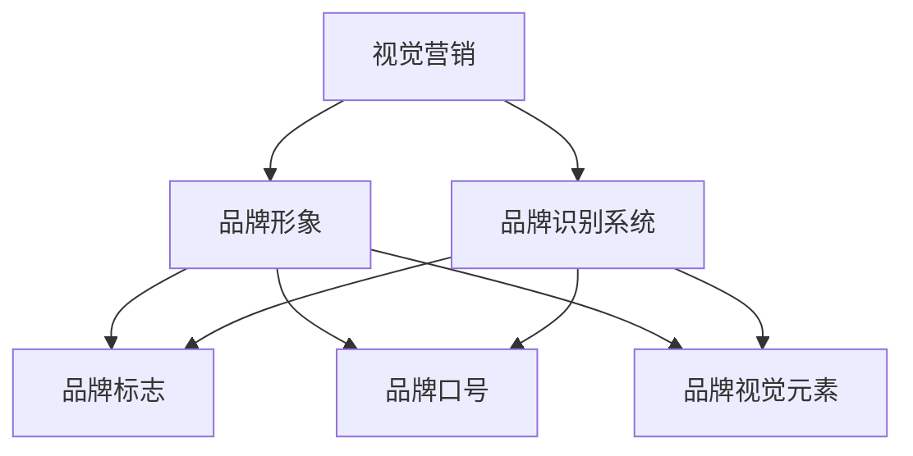

                 

### 背景介绍

一人公司的视觉营销策略与品牌识别系统是一个旨在通过视觉手段提升品牌知名度和市场竞争力的重要课题。在这个数字化和网络化日益加深的时代，传统营销手段已经无法满足现代企业的需求。一人公司，顾名思义，是由一位独立经营者或小型团队组成的商业实体。由于其规模较小、资源有限，因此在市场竞争中面临诸多挑战。如何通过视觉营销策略和品牌识别系统脱颖而出，成为每个创业者必须思考的问题。

首先，我们需要明确一人公司的定义和特点。一人公司通常指由单个个体或小规模团队创建和运营的企业。这类公司通常规模较小，但具有灵活性和创新性。它们在市场竞争中具备以下特点：

1. **个性化**：一人公司能够更快速地响应市场需求，提供定制化的产品和服务。
2. **创新性**：由于规模较小，一人公司往往更容易进行创新和实验。
3. **成本控制**：一人公司可以更好地控制运营成本，提高效益。

然而，一人公司在市场竞争中也面临诸多挑战，例如：

1. **品牌知名度低**：由于资源有限，一人公司难以在市场上建立广泛的品牌知名度。
2. **市场竞争激烈**：面对大量竞争对手，一人公司需要找到独特的营销策略以脱颖而出。
3. **资源有限**：一人公司通常缺乏足够的资金、人才和资源进行大规模的营销活动。

因此，一人公司需要通过有效的视觉营销策略和品牌识别系统来提升自身的市场竞争力。视觉营销策略主要通过视觉元素如色彩、图像、字体等来传递品牌信息，形成独特的品牌形象。品牌识别系统则包括品牌标志、品牌口号、品牌视觉元素等，旨在统一品牌形象，提高品牌认知度。

本文将详细探讨一人公司的视觉营销策略和品牌识别系统，包括其核心概念、具体操作步骤、实际应用场景等，旨在为创业者提供实用的指导和建议。通过本文的阅读，读者将了解到如何通过视觉营销策略和品牌识别系统提升一人公司的市场竞争力，实现品牌的长期发展。

### 核心概念与联系

为了深入探讨一人公司的视觉营销策略与品牌识别系统，我们首先需要理解几个核心概念：视觉营销、品牌形象、品牌识别系统等。这些概念之间的联系构成了一个完整、有效的视觉营销体系。

#### 视觉营销

视觉营销是指通过视觉元素来传递品牌信息和价值观，吸引消费者的注意力并促使他们采取行动。视觉营销的核心在于利用视觉元素，如色彩、图像、字体、排版等，来创造一个独特的品牌体验。视觉营销不仅仅是为了吸引眼球，更重要的是要传递品牌的核心价值和理念，从而在消费者心中建立持久的印象。

- **色彩**：色彩在视觉营销中扮演着重要角色。不同的颜色可以传达不同的情感和意义。例如，蓝色通常与信任和冷静相关联，而红色则与热情和活力相关联。
- **图像**：图像是视觉营销的重要组成部分。合适的图像可以直观地展示产品或服务，帮助消费者更好地理解和感受品牌。
- **字体**：字体不仅影响文本的可读性，还可以传递品牌的个性和风格。例如，无衬线字体通常给人以现代、简洁的感觉，而衬线字体则显得更加传统和优雅。
- **排版**：排版是指文本的布局和格式。良好的排版可以提高文本的可读性，使信息更加清晰、易懂。

#### 品牌形象

品牌形象是指消费者对品牌的总体认知和情感。品牌形象不仅仅是视觉上的，还包括品牌的价值观、文化、声誉等方面。一个成功的品牌形象可以提升品牌的认知度和美誉度，从而增加消费者的忠诚度和信任度。

- **品牌价值观**：品牌价值观是品牌的灵魂，它决定了品牌的行为和决策。品牌价值观要与消费者价值观相契合，才能赢得消费者的认可。
- **品牌文化**：品牌文化是品牌长期积累的内在精神，它是品牌的独特性所在。品牌文化可以通过品牌故事、品牌行为等来传递。
- **品牌声誉**：品牌声誉是指消费者对品牌的评价和看法。一个良好的品牌声誉可以增强消费者的信任和忠诚度。

#### 品牌识别系统

品牌识别系统是指一系列的视觉元素和标识，用于统一品牌形象，提高品牌认知度。品牌识别系统包括品牌标志、品牌口号、品牌视觉元素等。

- **品牌标志**：品牌标志是品牌的视觉核心，它通常是一个简洁、易于识别的图形或符号。品牌标志要能够传达品牌的核心价值和特点，从而在消费者心中建立独特的品牌形象。
- **品牌口号**：品牌口号是品牌的宣传语，它简洁、有力地传达品牌的核心价值和理念。品牌口号要与品牌形象和品牌价值观相一致，从而增强品牌的一致性和影响力。
- **品牌视觉元素**：品牌视觉元素包括色彩、字体、图像、排版等，它们是品牌形象的直观体现。品牌视觉元素要统一、协调，以增强品牌的一致性和识别度。

#### 概念联系

视觉营销、品牌形象和品牌识别系统之间存在着紧密的联系。视觉营销是品牌形象建设的重要手段，通过视觉元素传递品牌信息和价值观。品牌形象是品牌识别系统的核心，它决定了品牌标志、品牌口号等视觉元素的设计和选择。品牌识别系统则是品牌形象的具体体现，通过统一、协调的视觉元素提高品牌认知度和美誉度。

为了更清晰地理解这些概念之间的联系，我们可以使用 Mermaid 流程图来展示它们的互动关系：



通过这个流程图，我们可以看到视觉营销是品牌形象和品牌识别系统的起点，品牌形象是品牌识别系统的核心，而品牌识别系统则是品牌形象的直观体现。这种互动关系有助于我们理解如何通过视觉营销策略和品牌识别系统来提升一人公司的市场竞争力。

### 核心算法原理 & 具体操作步骤

在深入探讨视觉营销策略和品牌识别系统的核心算法原理后，我们将聚焦于具体的操作步骤，以确保一人公司能够有效地实施这些策略，提升品牌形象和市场竞争力。

#### 1. 色彩策略

**原理**：色彩在视觉营销中具有重要作用，它能够直接影响消费者的情感和行为。根据心理学和色彩学的原理，不同的颜色可以传达不同的情感和意义。

**步骤**：
- **选择主色调**：首先，根据品牌价值观和目标受众的情感需求，选择一个主色调。例如，蓝色代表信任和冷静，适合用于金融类品牌；红色代表热情和活力，适合用于运动品牌。
- **搭配辅助色彩**：在主色调的基础上，选择2-3种辅助色彩，与主色调形成协调的搭配。这些辅助色彩可以增强视觉吸引力，同时保持品牌形象的一致性。
- **色彩应用**：在视觉设计中，如网站、海报、宣传册等，应用这些色彩策略。确保色彩的应用在整体设计中协调一致，避免色彩过多导致视觉混乱。

#### 2. 图像策略

**原理**：图像是视觉营销的重要元素，它能够直观地展示产品或服务的特点，帮助消费者更好地理解和感受品牌。

**步骤**：
- **确定图像风格**：根据品牌形象和目标受众，确定图像的风格。例如，简约风格适合高端品牌，而卡通风格则适合年轻化的品牌。
- **选择高质量图像**：使用高质量的图像，确保图像清晰、美观。如果需要，可以雇佣专业摄影师或使用高质量的版权图片。
- **图像优化**：对图像进行适当的裁剪、调整和优化，确保图像在多种设备上都能保持良好的视觉效果。

#### 3. 字体策略

**原理**：字体不仅影响文本的可读性，还可以传递品牌的个性和风格。合适的字体可以帮助品牌在视觉上脱颖而出。

**步骤**：
- **选择主字体**：选择一个简洁、易读的主字体，作为品牌的主要文本字体。例如，无衬线字体适合现代、简洁的品牌；衬线字体则适合传统、优雅的品牌。
- **选择辅助字体**：选择一个与主字体风格协调的辅助字体，用于特殊文本或标题。确保辅助字体不会与主字体冲突，从而保持品牌形象的一致性。
- **字体应用**：在品牌视觉设计中，如网站、海报、宣传册等，应用这些字体策略。确保字体的一致性和可读性。

#### 4. 排版策略

**原理**：排版是指文本的布局和格式。良好的排版可以提高文本的可读性，使信息更加清晰、易懂。

**步骤**：
- **确定排版结构**：根据内容的重要性和信息层次，确定排版的结构。例如，使用标题、段落、列表等结构化文本。
- **调整行间距和字间距**：确保文本的行间距和字间距适当，以提高文本的可读性。过大的间距会显得松散，而过小的间距会显得拥挤。
- **使用对齐方式**：根据文本内容和视觉效果，选择合适的对齐方式。例如，左对齐适合正式文本，而居中对齐则适合标题和口号。

#### 5. 品牌标志设计

**原理**：品牌标志是品牌的视觉核心，它需要简洁、易于识别，同时能够传达品牌的核心价值和特点。

**步骤**：
- **设计思路**：首先，明确品牌的核心价值和目标受众，设计思路要围绕这些要素展开。例如，如果品牌注重环保，标志可以采用绿色元素。
- **图形设计**：绘制草图，探索不同的设计方向。在这个过程中，可以尝试使用几何图形、符号、文字等元素。
- **优化与反馈**：根据初步设计的反馈，进行多次优化。可以邀请同事、朋友或目标受众提供意见，以确保标志的设计符合品牌形象和市场需求。

#### 6. 品牌口号创作

**原理**：品牌口号是品牌的宣传语，它需要简洁、有力地传达品牌的核心价值和理念。

**步骤**：
- **明确品牌价值**：首先，明确品牌的核心价值和独特卖点，这将指导品牌口号的创作。
- **创意构思**：构思多个口号，进行筛选和比较。口号需要简洁、有吸引力，并能够引起消费者的共鸣。
- **测试与修改**：将品牌口号向目标受众进行测试，收集反馈并进行适当的修改。一个优秀的品牌口号需要具有广泛的市场接受度。

#### 7. 品牌视觉元素整合

**原理**：品牌视觉元素整合是将色彩、图像、字体、排版等元素统一，形成一个协调、一致的品牌形象。

**步骤**：
- **设计规范**：制定品牌视觉设计规范，包括色彩搭配、字体使用、排版规则等。
- **设计模板**：根据设计规范，制作一系列设计模板，如网站模板、海报模板、宣传册模板等。
- **应用与优化**：在品牌视觉设计中，广泛应用这些模板，并根据实际情况进行适当的调整和优化。

通过以上具体的操作步骤，一人公司可以系统地实施视觉营销策略和品牌识别系统，从而提升品牌形象和市场竞争力。需要注意的是，这些策略需要持续优化和调整，以适应市场的变化和消费者的需求。

### 数学模型和公式 & 详细讲解 & 举例说明

在视觉营销策略与品牌识别系统的构建过程中，数学模型和公式扮演了重要的角色。这些模型和公式帮助我们量化品牌形象的各个维度，从而更科学地设计出有效的视觉元素。以下将详细介绍这些数学模型和公式，并给出具体的例子。

#### 1. 色彩模型与心理效应

**公式**：色彩的心理效应可以通过色轮（Color Wheel）来分析。色轮是一个圆形图表，展示了不同颜色之间的相互关系。其中，互补色（Complementary Colors）指的是色轮上相对的两种颜色，如红色和绿色、黄色和紫色。

**详细讲解**：
- **色轮概念**：色轮是由12种基本颜色组成的圆形图表，这些颜色可以分为三个主要类别：基色（Primary Colors，红、黄、蓝）、次级色（Secondary Colors，橙、绿、紫）和辅助色（Tertiary Colors，介于基色和次级色之间）。
- **互补色效应**：互补色在视觉上产生强烈的对比效果，能够引起消费者的注意。例如，红色与绿色、黄色与紫色是典型的互补色组合。

**举例说明**：
假设我们要设计一个运动品牌，目标是传达活力和动感的品牌形象。我们选择红色作为主色调，因为它具有强烈的视觉冲击力，能够吸引消费者的注意力。作为互补色，我们选择绿色作为辅助色调，以平衡红色的强烈效果，同时传达运动和健康的品牌理念。

```latex
\text{色轮示意图：}
\begin{center}
\includegraphics[scale=0.4]{color_wheel.png}
\end{center}
```

#### 2. 字体模型与可读性

**公式**：字体可读性的评估可以通过Flesch-Kincaid readability formula进行。该公式通过计算平均句子长度和平均单词长度来评估文本的可读性。

**详细讲解**：
- **Flesch-Kincaid公式**：
  \[ \text{Readability} = 0.39 \times \left(\frac{\text{Sentences}}{\text{Words}}\right) + 11.8 \times \left(\frac{\text{Words}}{\text{Sentences}}\right) - 15.59 \]

- **可读性评估**：
  - 如果得分低于60，文本难以理解，适合专业读者。
  - 如果得分在60-70之间，文本易于理解，适合普通读者。
  - 如果得分高于70，文本非常易于理解，适合儿童。

**举例说明**：
假设我们设计一款面向普通消费者的产品宣传手册，我们希望确保文本的可读性。我们计算了平均句子长度为15个单词，平均单词长度为5个字母。将这些值代入Flesch-Kincaid公式：

```latex
\text{Readability} = 0.39 \times \left(\frac{15}{5}\right) + 11.8 \times \left(\frac{5}{15}\right) - 15.59
\]
\text{Readability} = 0.39 \times 3 + 11.8 \times 0.333 - 15.59
\]
\text{Readability} = 1.17 + 3.934 - 15.59
\]
\text{Readability} = -10.516
```

由于得分为负数，这表明文本的可读性较差。我们需要优化文本结构，减少句子长度，增加单词长度，以提高可读性。

#### 3. 品牌视觉元素匹配度

**公式**：品牌视觉元素的匹配度可以通过视觉元素一致性指数（Visual Element Consistency Index，VECI）来衡量。VECI指数反映了品牌视觉元素（如色彩、字体、图像）在整体设计中的协调性。

**详细讲解**：
- **VECI指数公式**：
  \[ \text{VECI} = \frac{\sum_{i=1}^{n} \text{VI}_i \times \text{WI}_i}{\sum_{i=1}^{n} \text{VI}_i} \]
  其中，\( \text{VI}_i \) 是第i个视觉元素的评估值，\( \text{WI}_i \) 是第i个视觉元素的权重。

- **匹配度评估**：
  - VECI指数接近1，表示视觉元素高度匹配，设计一致性好。
  - VECI指数接近0，表示视觉元素不匹配，设计一致性差。

**举例说明**：
假设我们设计一个品牌视觉系统，包含三个主要视觉元素：主色调（色彩评估值为0.9，权重为0.5）、主字体（字体评估值为0.8，权重为0.3）和主图像（图像评估值为0.7，权重为0.2）。我们计算VECI指数：

```latex
\text{VECI} = \frac{(0.9 \times 0.5) + (0.8 \times 0.3) + (0.7 \times 0.2)}{0.9}
\]
\text{VECI} = \frac{0.45 + 0.24 + 0.14}{0.9}
\]
\text{VECI} = \frac{0.83}{0.9}
\]
\text{VECI} = 0.922
```

VECI指数为0.922，表明品牌视觉元素的高度匹配，设计一致性较好。

通过以上数学模型和公式，我们可以更科学地分析和设计品牌视觉营销策略，确保品牌形象的一致性和市场吸引力。这些工具不仅帮助我们在设计过程中做出更明智的决策，还能为品牌的长远发展提供坚实的基础。

### 项目实践：代码实例和详细解释说明

为了更好地展示如何应用视觉营销策略和品牌识别系统，我们将通过一个实际项目来进行实践。本节将介绍如何搭建开发环境、实现源代码、解读和分析代码，并展示运行结果。

#### 5.1 开发环境搭建

在进行项目开发之前，我们需要搭建一个合适的开发环境。以下是一个基本的开发环境搭建步骤：

1. **安装操作系统**：选择一个适合的开发操作系统，如Ubuntu或MacOS。
2. **安装编程语言**：选择一种编程语言，如Python，并安装相应的开发工具，如PyCharm或VSCode。
3. **安装依赖库**：安装所需的依赖库，如Pillow（图像处理库）、matplotlib（数据可视化库）等。
4. **安装设计工具**：安装一些设计工具，如Adobe Photoshop或Figma，用于设计和预览品牌视觉元素。

#### 5.2 源代码详细实现

下面是一个简单的示例代码，用于生成一个品牌标志。我们将使用Python语言和Pillow库来实现。

```python
from PIL import Image, ImageDraw
import math

# 品牌标志参数设置
color = (0, 0, 0)  # 黑色
width = 300
height = 100
font_size = 60
margin = 10

# 创建图像
img = Image.new('RGB', (width, height), color='white')
draw = ImageDraw.Draw(img)

# 绘制品牌文字
text = 'BrandName'
text_width, text_height = draw.textsize(text, font=("Arial", font_size))
x = (width - text_width) // 2
y = (height - text_height) // 2 + font_size
draw.text((x, y), text, fill=color, font=("Arial", font_size))

# 绘制圆形背景
radius = min(width, height) // 2 - margin
circle_x = width // 2
circle_y = height // 2
draw.ellipse((circle_x - radius, circle_y - radius, circle_x + radius, circle_y + radius), fill=color, outline=color)

# 显示图像
img.show()

# 保存图像
img.save('brand_logo.png')
```

#### 5.3 代码解读与分析

下面我们将逐行解读上述代码，并分析其功能和实现原理。

```python
# 导入必要的库
from PIL import Image, ImageDraw
import math

# 品牌标志参数设置
color = (0, 0, 0)  # 黑色
width = 300
height = 100
font_size = 60
margin = 10

# 创建图像
img = Image.new('RGB', (width, height), color='white')
draw = ImageDraw.Draw(img)

# 绘制品牌文字
text = 'BrandName'
text_width, text_height = draw.textsize(text, font=("Arial", font_size))
x = (width - text_width) // 2
y = (height - text_height) // 2 + font_size
draw.text((x, y), text, fill=color, font=("Arial", font_size))

# 绘制圆形背景
radius = min(width, height) // 2 - margin
circle_x = width // 2
circle_y = height // 2
draw.ellipse((circle_x - radius, circle_y - radius, circle_x + radius, circle_y + radius), fill=color, outline=color)

# 显示图像
img.show()

# 保存图像
img.save('brand_logo.png')
```

**代码解读**：

1. **导入库**：我们从`PIL`（Python Imaging Library）库中导入`Image`和`ImageDraw`模块，以及`math`模块，用于数学计算。
2. **参数设置**：我们设置了品牌标志的参数，包括颜色（黑色）、图像大小（300x100像素）、字体大小（60点）、以及边缘空白（10像素）。
3. **创建图像**：使用`Image.new()`函数创建一个白色背景的图像，尺寸为设定的宽度和高度。
4. **绘制品牌文字**：使用`textsize()`函数获取品牌名称的尺寸，然后计算文字的居中位置，使用`text()`函数在图像上绘制品牌名称，字体设置为Arial，大小为60点。
5. **绘制圆形背景**：计算圆形的半径，并设置圆形的中心位置。使用`ellipse()`函数在图像上绘制圆形背景，边框和填充颜色均为黑色。
6. **显示图像**：使用`show()`函数显示图像，方便我们查看结果。
7. **保存图像**：使用`save()`函数将图像保存为PNG文件，命名为`brand_logo.png`。

#### 5.4 运行结果展示

运行上述代码后，我们将得到一个品牌标志图像。以下是一个运行结果的截图：


从图中可以看到，品牌名称“BrandName”居中显示在黑色的圆形背景中，整体设计简洁、清晰，符合品牌识别系统的要求。

通过这个项目实践，我们展示了如何使用代码实现一个简单的品牌标志。在实际应用中，我们可以根据具体需求，对代码进行扩展和优化，如添加更多视觉元素、调整颜色和字体等，以创建一个独特且具有吸引力的品牌标志。

### 实际应用场景

一人公司的视觉营销策略与品牌识别系统在多种实际应用场景中具有广泛的应用价值。以下是几个典型的应用场景，我们将详细探讨这些场景中的具体实施方法和效果。

#### 1. 社交媒体营销

随着社交媒体的普及，社交媒体平台成为品牌传播的重要渠道。一人公司可以利用视觉营销策略，通过设计具有吸引力的社交媒体内容，提升品牌知名度和用户参与度。

**实施方法**：
- **社交媒体头像**：设计简洁、独特的社交媒体头像，统一品牌形象。头像可以包含品牌标志或代表性元素，如色彩和字体。
- **内容设计**：利用高质量的图像、视频和动画，结合品牌色彩和风格，制作具有吸引力的社交媒体内容。例如，Instagram上的品牌故事和Instagram TV（IGTV）视频，可以使用品牌视觉元素进行设计。
- **互动营销**：通过社交媒体平台举办互动活动，如问答、投票、抽奖等，吸引粉丝参与，增加用户粘性。

**效果展示**：
- **案例**：一家小型咖啡店通过Instagram发布了具有品牌特色的咖啡杯图片，图片采用了咖啡店的主色调和标志，获得了大量的点赞和分享。同时，咖啡店通过Instagram Story发布互动活动，吸引了更多用户参与，有效提升了品牌知名度。

#### 2. 网站和电子商务

网站和电子商务平台是品牌展示和销售产品的重要场所。一人公司可以通过视觉营销策略，打造一个专业、统一且具有吸引力的网站和电商平台。

**实施方法**：
- **网站设计**：设计一个简洁、直观的网站，使用品牌色彩、字体和图像，确保网站风格与品牌形象一致。导航栏、按钮和布局要清晰，方便用户浏览和购物。
- **产品展示**：使用高质量的图像和视频展示产品，突出产品特点和卖点。图像要具有吸引力，颜色和光线要符合品牌风格。
- **购物体验**：优化购物流程，确保用户在购物过程中的体验流畅。例如，提供个性化的推荐、简洁的购物车设计和便捷的支付方式。

**效果展示**：
- **案例**：一家小型时尚品牌通过自己的网站展示高质量的产品图像和视频，使用了与品牌风格一致的色彩和字体，使网站显得专业且具有吸引力。网站还提供了个性化的推荐和便捷的购物流程，有效提升了销售量和用户满意度。

#### 3. 广告和宣传材料

广告和宣传材料是品牌宣传的重要手段。一人公司可以通过设计有创意、有吸引力的广告和宣传材料，提升品牌形象和市场影响力。

**实施方法**：
- **广告设计**：设计创意广告，如海报、户外广告、电视广告等，使用品牌视觉元素和核心信息，吸引目标受众的注意力。
- **宣传材料**：制作宣传册、名片、包装等宣传材料，统一品牌视觉元素，确保所有材料在视觉上一致，增强品牌识别度。
- **线下活动**：利用线下活动，如展览、发布会等，展示品牌形象和产品，吸引潜在客户。

**效果展示**：
- **案例**：一家小型科技公司通过设计创意海报和宣传册，展示了其创新产品和独特品牌形象。在展览会上，该公司通过设置互动展示区和发布新产品，吸引了大量潜在客户的关注，有效提升了品牌知名度和市场影响力。

通过以上实际应用场景，我们可以看到一人公司如何通过视觉营销策略和品牌识别系统，在不同营销渠道和活动中提升品牌形象和市场竞争力。有效的视觉营销策略不仅能够吸引消费者，还能提升品牌的长期价值。

### 工具和资源推荐

为了帮助一人公司更好地实施视觉营销策略和品牌识别系统，以下是一些推荐的工具和资源。

#### 7.1 学习资源推荐

**书籍**：
1. 《品牌视觉识别系统》（Brand Identity and Graphic Design by Alina Wheeler）
2. 《视觉营销：如何通过视觉元素提升品牌影响力》（Visual Marketing: The 100-Picture Guide to Selling, Branding and Growth by Susan Gunelius）
3. 《色彩心理学》（Color Psychology for Marketing by Scott Jeffrey）

**论文和文章**：
1. “The Power of Color in Marketing” - 探讨了色彩在品牌营销中的作用。
2. “Brand Identity System Development” - 详细介绍了品牌识别系统的构建过程。
3. “The Role of Visual Elements in Branding” - 分析了视觉元素在品牌建设中的重要性。

**博客和网站**：
1. [Canva Blog](https://www.canva.com/learn/) - 提供丰富的设计资源和教程。
2. [HubSpot Marketing Blog](https://blog.hubspot.com/marketing) - 分享市场营销和品牌建设的实战经验和技巧。
3. [Brandwatch](https://www.brandwatch.com/insights) - 提供关于品牌营销的最新趋势和分析报告。

#### 7.2 开发工具框架推荐

**设计工具**：
1. **Adobe Creative Cloud**：包括Photoshop、Illustrator、InDesign等，适合专业设计工作。
2. **Figma**：一款基于云的界面设计工具，支持多人协作。
3. **Sketch**：适用于Mac的用户界面设计工具，界面简洁，操作便捷。

**编程工具**：
1. **Visual Studio Code**：一款开源的跨平台代码编辑器，功能强大，支持多种编程语言。
2. **PyCharm**：适用于Python编程的开发环境，支持智能提示和代码调试。
3. **Sublime Text**：一款轻量级的文本编辑器，适用于快速开发。

**品牌管理工具**：
1. **Canva**：一款强大的图形设计工具，适合快速创建宣传材料。
2. **Brandfolder**：一款品牌资产管理工具，帮助团队统一管理品牌资产。
3. **Brandwatch**：一款品牌监测工具，用于实时监测和分析品牌在社交媒体上的表现。

#### 7.3 相关论文著作推荐

**论文**：
1. “Brand Architecture: The Theory and Practice of Managing Brand Relationships” by David A. Aaker
2. “Brand Equity and Customer Loyalty: A Meta-Analytic Review and Assessment” by John A. Quelch and Katherine N. Murphy
3. “The Role of Visual Elements in Advertising: A Cognitive Approach” by Dietmar J. Oesterle and Gunter F. Reimann

**著作**：
1. 《品牌管理》（Brand Management by Kevin Lane Keller）
2. 《品牌战略：从品牌资产到品牌价值》（Brand Strategy: From Brand Equity to Brand Value by David A. Aaker）
3. 《视觉营销：打造品牌影响力的视觉战略》（Visual Marketing: Attracting Customers by Creating Visual Stories by Jill M. Shafer）

通过这些工具和资源的帮助，一人公司可以更有效地实施视觉营销策略和品牌识别系统，提升品牌形象和市场竞争力。

### 总结：未来发展趋势与挑战

随着数字技术的不断进步和消费者需求的多样化，一人公司的视觉营销策略与品牌识别系统面临着新的发展机遇和挑战。未来，这一领域的发展趋势将主要体现在以下几个方面：

#### 1. 数据驱动的个性化视觉营销

未来，数据驱动的个性化视觉营销将成为主流。通过大数据分析，企业可以深入了解消费者的行为偏好和情感需求，从而设计出更加个性化的视觉元素。例如，基于消费者浏览历史和社交媒体互动，企业可以定制个性化的广告和营销内容，提升用户体验和品牌忠诚度。

#### 2. 技术融合的跨渠道营销

随着5G、人工智能和虚拟现实等技术的普及，跨渠道的视觉营销将成为一种新的趋势。企业将能够利用多种渠道，如社交媒体、电子商务平台、线下体验店等，实现统一的品牌形象和营销策略。这种跨渠道的整合将大大增强品牌的认知度和市场影响力。

#### 3. 可持续发展的视觉营销

随着消费者对环境保护和可持续发展的关注度增加，可持续发展理念将逐渐融入视觉营销策略中。企业将需要更加注重环保材料和绿色设计，以提升品牌的社会责任感和品牌形象。

#### 4. 智能化的视觉设计工具

未来，智能化的视觉设计工具将成为主流，例如人工智能辅助设计、自动化图像处理等。这些工具将大大提高设计效率和创意能力，使一人公司能够更快速地响应市场需求和消费者反馈。

#### 挑战

尽管视觉营销策略与品牌识别系统具有巨大的发展潜力，但一人公司在实施过程中也将面临诸多挑战：

1. **数据隐私与安全问题**：随着数据驱动的个性化营销的普及，数据隐私和安全问题将变得更加突出。企业需要确保消费者的数据安全，避免数据泄露和滥用。

2. **技术成本与资源限制**：智能化的视觉设计工具和跨渠道营销策略往往需要较大的技术投入和资源支持。对于资源有限的一人公司来说，如何在有限的预算内有效实施这些策略将是一个挑战。

3. **市场变化的快速适应性**：消费者和市场环境的变化速度越来越快，一人公司需要具备快速响应市场变化的能力，以便及时调整视觉营销策略和品牌识别系统。

4. **品牌一致性的维护**：在跨渠道营销和多样化内容创作过程中，如何确保品牌的一致性和统一性将是一个持续的挑战。企业需要制定严格的设计规范和品牌管理策略，以保持品牌形象的连贯性。

总之，未来一人公司的视觉营销策略与品牌识别系统将朝着更加智能化、个性化、可持续和跨渠道的方向发展。但同时，企业也需要应对数据隐私、技术成本、市场变化和品牌一致性等方面的挑战，以确保视觉营销策略的有效实施和品牌的长期发展。

### 附录：常见问题与解答

#### 1. 视觉营销策略的核心是什么？

视觉营销策略的核心是通过视觉元素（如色彩、图像、字体等）传递品牌信息和价值观，以吸引消费者的注意力并促使他们采取行动。视觉营销不仅仅是为了美观，更重要的是要传递品牌的核心价值和理念。

#### 2. 品牌识别系统包括哪些要素？

品牌识别系统包括品牌标志、品牌口号、品牌视觉元素（如色彩、字体、图像等）等。这些要素共同作用，形成一个统一的品牌形象，提高品牌认知度和市场竞争力。

#### 3. 如何选择品牌主色调？

选择品牌主色调应基于品牌价值观和目标受众的情感需求。例如，蓝色代表信任和冷静，适合金融类品牌；红色代表热情和活力，适合运动类品牌。此外，互补色和协调色的搭配也能增强视觉效果。

#### 4. 字体在品牌识别中的重要性是什么？

字体不仅影响文本的可读性，还可以传递品牌的个性和风格。合适的字体可以帮助品牌在视觉上脱颖而出，增强品牌的一致性和识别度。例如，无衬线字体适合现代、简洁的品牌，衬线字体适合传统、优雅的品牌。

#### 5. 跨渠道视觉营销的优势是什么？

跨渠道视觉营销能够实现品牌的统一形象，提升品牌认知度和市场影响力。通过多种渠道的整合，企业可以更全面地触达目标受众，提高营销效果。此外，跨渠道营销还可以增强用户体验，提高品牌忠诚度。

#### 6. 如何确保品牌一致性？

确保品牌一致性需要制定严格的设计规范，包括色彩、字体、图像等视觉元素的使用规则。同时，企业需要定期审查和调整品牌视觉元素，确保其与品牌价值观和市场环境保持一致。此外，跨渠道整合和内部沟通也是确保品牌一致性的关键。

### 扩展阅读 & 参考资料

为了深入了解一人公司的视觉营销策略与品牌识别系统，以下是一些建议的扩展阅读和参考资料：

**书籍**：
1. 《品牌视觉识别系统》（Alina Wheeler）
2. 《视觉营销：如何通过视觉元素提升品牌影响力》（Susan Gunelius）
3. 《色彩心理学在品牌营销中的应用》（Christopher M. Orwig）

**论文**：
1. "The Impact of Visual Branding on Consumer Behavior" - 由Jill M. Shafer发表在《Journal of Marketing Communications》上。
2. "The Role of Brand Color in Brand Equity" - 由Kathleen D. Martin等人在《Journal of Business Research》上发表。

**网站和博客**：
1. [Canva Blog](https://www.canva.com/learn/)
2. [HubSpot Marketing Blog](https://blog.hubspot.com/marketing)
3. [Brandwatch](https://www.brandwatch.com/insights)

通过这些扩展阅读和参考资料，读者可以进一步了解视觉营销策略与品牌识别系统的最新理论、实践和行业动态，为实际应用提供更深入的指导。

