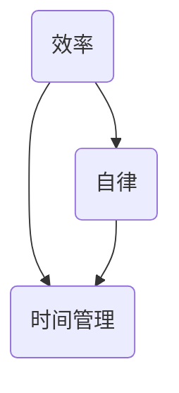

                 

### 背景介绍 Background

在现代社会中，一人公司（也称为单干户、SOLO企业）正在成为一种越来越受欢迎的企业形式。所谓一人公司，指的是由一个人独立拥有和运营的公司，无需雇用员工，完全依靠个人能力和资源来完成公司的所有工作。一人公司具有诸多优势，如较低的启动成本、灵活的工作时间和自主决策权，吸引了大量创业者和自由职业者的关注。

然而，一人公司的运营并非易事，尤其是在效率和自律方面。对于一个人来说，如何有效地管理时间、提高工作效率、保持工作与生活的平衡，成为了必须面对的重要问题。本文将深入探讨一人公司运营中的效率和自律问题，分析其核心概念与联系，并分享一些实用的方法和技巧。

### 核心概念 Core Concepts

在探讨一人公司的运营之道时，我们首先要明确几个核心概念，即效率、自律和时间管理。这些概念不仅关乎个人的成功，也是一人公司能否长期稳定发展的关键。

#### 效率 Efficiency

效率指的是在特定时间内完成的工作量。对于一人公司来说，效率意味着能够快速响应客户需求、高效完成任务、不断优化工作流程。提高效率不仅可以缩短项目周期，降低成本，还能为客户提供更好的服务，增强市场竞争力。

#### 自律 Self-discipline

自律是指个人在不受外界干扰的情况下，自我约束和管理行为的能力。对于一人公司来说，自律是确保工作连续性和质量的关键。自律能力强的人能够在面对各种诱惑和挑战时，保持专注和坚定，从而实现既定的目标。

#### 时间管理 Time Management

时间管理是指合理安排时间，确保每项任务都在适当的时间内完成。对于一人公司来说，时间管理尤为重要，因为一个人要完成所有的工作，没有多余的时间可以浪费。良好的时间管理能力可以帮助个人更好地平衡工作与生活，提高工作效率。

### 核心概念与联系 Core Concepts Connection

效率、自律和时间管理三者之间存在密切的联系。高效的工作往往离不开良好的自律，而自律则需要合理的时间管理来支持。具体来说：

1. **效率**是目标，通过提高工作效率，一人公司可以更快地实现目标。
2. **自律**是实现效率的保障，只有自律，才能确保工作的高质量和高效率。
3. **时间管理**是实现效率与自律的基础，通过合理分配时间，可以确保工作有序进行，避免拖延和效率低下。

下面是一个Mermaid流程图，展示了这三个核心概念之间的联系：



### 总结 Summary

在本文中，我们介绍了效率、自律和时间管理这三个核心概念，并阐述了它们在一人公司运营中的重要性。理解这些概念，并结合实际操作，可以帮助一人公司的创业者更好地管理自己的时间和工作，提高运营效率，实现个人和公司的长期发展。

在接下来的章节中，我们将进一步探讨如何在实际操作中提高效率、自律和时间管理能力，希望对读者有所帮助。

---

**Next Step:** 接下来，我们将深入探讨如何在实际操作中提高效率、自律和时间管理能力。我们将提供一些实用的方法和技巧，帮助读者更好地应对一人公司的运营挑战。

---

**1. 提高效率：方法与策略**

在运营一人公司时，提高效率是确保工作顺利完成的关键。以下是一些实用的方法和策略，可以帮助您在繁忙的工作中提高效率：

#### **1.1 制定明确的目标和计划**

明确的目标和计划是提高效率的基础。在每天开始工作之前，花一些时间列出当天需要完成的任务，并为每个任务设定优先级。使用待办事项列表或日程表，将任务分解成具体的可操作步骤，确保每一步都有明确的行动指南。

**示例：**

- 上午10:00 - 回复客户邮件
- 下午2:00 - 完成市场调研报告
- 下午4:00 - 与供应商开会

#### **1.2 使用时间管理工具**

使用时间管理工具，如番茄工作法（Pomodoro Technique），可以帮助您更好地分配时间，提高工作效率。番茄工作法的基本原理是将工作时间分为25分钟的专注工作周期，每个周期后休息5分钟。通过这种方法，您可以保持专注，减少分心和拖延。

**示例：**

- 25分钟专注工作
- 5分钟休息
- 重复以上步骤

#### **1.3 避免多任务处理**

多任务处理往往会导致效率低下。研究表明，同时处理多个任务会分散注意力，降低工作效率。因此，尽量避免在短时间内切换任务，专注于单一任务，直到完成。

**示例：**

- 完成一个邮件回复后再开始下一个任务

#### **1.4 学会说“不”**

学会拒绝那些不紧急或不重要的任务，可以帮助您保持专注，提高工作效率。明确自己的优先事项，拒绝那些会干扰您主要工作目标的任务。

**示例：**

- 对于不紧急的客户请求，告知对方将在下一个工作周期处理

#### **1.5 利用自动化工具**

利用自动化工具，如电子邮件自动化、日程安排自动化等，可以节省时间，提高工作效率。通过自动化工具，您可以减少重复性工作，将更多时间用于创造性和高价值的工作。

**示例：**

- 使用电子邮件自动化工具，自动回复常见问题
- 使用日程安排工具，自动提醒会议和任务

#### **1.6 保持工作环境的整洁**

一个整洁的工作环境可以减少分心，提高工作效率。定期清理工作区域，保持桌面整洁，可以帮助您更好地集中注意力，提高工作效率。

**示例：**

- 每周花10分钟整理办公桌
- 使用文件管理系统，保持电子文档的整洁

### **2. 提高自律：自律训练与习惯养成**

自律是确保工作效率的重要因素。以下是一些提高自律的方法和策略：

#### **2.1 设定清晰的目标**

设定明确、具体、可衡量的目标，可以帮助您更好地保持自律。确保目标具有挑战性，但也要确保它们是可实现的。

**示例：**

- 每天完成2个高质量的客户提案
- 每周阅读2篇专业领域的论文

#### **2.2 建立良好的工作习惯**

通过建立良好的工作习惯，您可以提高自律性。制定每天的工作流程，并坚持执行，可以帮助您更好地管理时间和工作。

**示例：**

- 每天早上9:00开始工作
- 每天晚上10:00结束工作

#### **2.3 学会自我监督**

自我监督是提高自律的重要手段。定期检查自己的工作进度，确保每个任务都按时完成。通过自我监督，您可以及时调整工作策略，提高工作效率。

**示例：**

- 每天工作结束时，回顾当天的任务完成情况
- 每周进行一次工作总结，评估自己的工作表现

#### **2.4 设定奖励和惩罚机制**

设定奖励和惩罚机制可以帮助您更好地保持自律。完成任务后，给自己设定一些奖励，如休息时间、看电影等。对于未能完成的任务，设定一些惩罚，如减少娱乐时间、加班等。

**示例：**

- 完成一个重要任务后，奖励自己看一部电影
- 未能按时完成任务，减少一小时的娱乐时间

#### **2.5 保持良好的心态**

保持良好的心态是提高自律的关键。在面对挑战和困难时，保持积极的心态，相信自己能够克服困难，完成任务。

**示例：**

- 面对繁忙的工作，保持冷静，相信自己的能力
- 遇到挫折时，积极寻找解决方案，而非放弃

### **3. 提高时间管理能力：实用技巧与案例分析**

时间管理是提高工作效率和自律的关键。以下是一些实用技巧和案例分析，帮助您更好地管理时间：

#### **3.1 利用时间记录工具**

时间记录工具可以帮助您了解自己的时间使用情况，从而更好地管理时间。通过记录每天的工作时间，您可以发现时间浪费的地方，并采取相应的措施进行改进。

**示例：**

- 使用Toggl等时间跟踪工具，记录每天的工作时间
- 定期分析时间记录数据，找出时间浪费的地方

#### **3.2 学会优先级排序**

学会优先级排序可以帮助您更好地安排时间，确保最重要、最紧急的任务优先完成。通过设定任务的优先级，您可以避免浪费时间在次要任务上。

**示例：**

- 使用“紧急-重要矩阵”，将任务分为四类，并优先处理“重要且紧急”的任务
- 每天开始工作前，列出任务清单，并标注优先级

#### **3.3 学会委托和合作**

学会委托和合作可以帮助您将一些任务分配给他人，从而节省时间。通过与他人合作，您可以分担工作压力，提高工作效率。

**示例：**

- 对于一些重复性工作，委托给外包团队
- 与合作伙伴共同完成项目，实现资源共享

#### **3.4 案例分析**

以下是一个时间管理案例分析：

**案例背景：**

一位一人公司的创始人，需要在有限的时间内完成多个项目，包括市场调研、客户提案和产品开发。

**解决方案：**

- 制定详细的项目计划，明确每个项目的目标和时间表
- 使用时间记录工具，监控每天的工作时间，发现时间浪费的地方
- 使用优先级排序，确保最重要、最紧急的任务优先完成
- 委托市场调研任务给专业团队，节省自己的时间
- 与合作伙伴共同开发产品，实现资源共享

**案例结果：**

通过有效的时间管理，这位创始人成功地在有限的时间内完成了所有项目，提高了工作效率，确保了公司的发展。

### **总结**

提高效率、自律和时间管理能力对于一人公司的运营至关重要。通过制定明确的目标和计划、建立良好的工作习惯、利用时间管理工具和学会优先级排序等方法，您可以更好地管理自己的时间和工作，提高工作效率和自律性。希望本文提供的方法和技巧对您有所帮助，帮助您在一人公司的运营中取得更大的成功。

---

**Next Step:** 接下来，我们将深入探讨如何通过数学模型和公式来分析和优化一人公司的运营效率。我们将详细解释这些数学模型和公式的应用方法，并通过实际例子进行说明。

---

### 数学模型和公式 Mathematical Models and Formulas

在探讨如何优化一人公司的运营效率时，引入数学模型和公式是非常有帮助的。这些模型和公式可以帮助我们量化分析运营中的关键因素，从而找到提高效率的途径。以下是几个常用的数学模型和公式，以及它们在效率优化中的应用。

#### **1. 速度-时间模型（Speed-Time Model）**

速度-时间模型用于分析任务完成时间与工作效率之间的关系。公式如下：

\[ 时间 = 距离 / 速度 \]

在这个模型中，距离代表任务的总量，速度代表单位时间内完成的工作量。通过提高速度或减少距离，可以缩短任务完成时间。

**应用实例：**

假设一项市场调研任务需要调研100个客户，每个客户需要花费10分钟。使用速度-时间模型，可以计算出任务的总时间和最优速度。

- **总时间：** \( 100 \times 10 = 1000 \) 分钟
- **最优速度：** \( 1000 \div 10 = 100 \) 客户/小时

通过优化调研方法，如提前准备问题和模板，可以缩短每个客户调研的时间，从而提高整体效率。

#### **2. 机会成本模型（Opportunity Cost Model）**

机会成本模型用于评估选择某一任务所带来的潜在收益和损失。公式如下：

\[ 机会成本 = 放弃的最大收益 - 实际收益 \]

在这个模型中，放弃的最大收益是指如果选择其他任务可能获得的收益，实际收益是指当前任务获得的收益。

**应用实例：**

假设一人公司有两个项目A和B，项目A预计收益为1000元，项目B预计收益为800元。如果选择项目A，则放弃项目B。

- **机会成本：** \( 800 - 1000 = -200 \) 元

这个结果表明，选择项目A会损失200元的潜在收益。因此，应该重新评估项目选择，确保选择更有利的任务。

#### **3. 优化模型（Optimization Model）**

优化模型用于找到在特定约束条件下最优的任务分配方案。常见的优化模型包括线性规划、非线性规划和整数规划等。

**应用实例：**

假设一人公司有三个任务X、Y和Z，每个任务所需的时间分别是2小时、3小时和4小时。总时间限制为10小时。使用线性规划模型，可以找到最优的任务分配方案。

- **目标函数：** 最小化完成所有任务的剩余时间
- **约束条件：** \( X + Y + Z \leq 10 \)

通过线性规划求解，可以找到最优的任务分配方案，如分配2小时给任务X，3小时给任务Y，4小时给任务Z。

#### **4. 时间-效率模型（Time-Efficiency Model）**

时间-效率模型用于分析任务完成时间与工作效率之间的关系，以及如何通过提高效率来减少完成任务所需的时间。公式如下：

\[ 效率 = 工作量 / 时间 \]

在这个模型中，工作量代表任务的总量，时间代表完成任务的时长。通过提高效率，可以减少完成任务的所需时间。

**应用实例：**

假设一人公司需要完成10个客户提案，每个提案需要花费1小时。使用时间-效率模型，可以计算出完成任务所需的最优效率。

- **最优效率：** \( 10 / 1 = 10 \) 个提案/小时

通过优化工作流程，如减少会议时间和简化提案撰写过程，可以提高工作效率，减少完成任务所需的时间。

### **5. 多目标优化模型（Multi-Objective Optimization Model）**

多目标优化模型用于同时考虑多个目标，并在这些目标之间找到平衡。常见的多目标优化问题包括效率、成本和质量等。

**应用实例：**

假设一人公司需要在效率、成本和质量之间找到平衡。使用多目标优化模型，可以找到在给定预算和质量要求下的最优任务分配方案。

- **目标函数：** 最小化成本、最大化效率和保证质量
- **约束条件：** 预算限制、质量要求和时间限制

通过多目标优化，可以找到满足所有目标的最佳任务分配方案，确保一人公司的运营效率最大化。

### **结论 Conclusion**

数学模型和公式为分析和优化一人公司的运营效率提供了有力的工具。通过速度-时间模型、机会成本模型、优化模型、时间-效率模型和多目标优化模型，我们可以量化分析运营中的关键因素，找到提高效率的途径。在实际应用中，应根据具体情况选择合适的模型和公式，并不断优化工作流程，以提高一人公司的运营效率。

### **实践：代码实例与详细解释**

在前文中，我们讨论了提高一人公司运营效率的数学模型和公式。为了更好地理解这些概念，我们将通过一个具体的代码实例来演示如何应用这些模型和公式来优化公司的运营。

#### **1. 开发环境搭建**

在开始之前，我们需要搭建一个合适的开发环境。以下是一个基本的开发环境搭建步骤：

- **编程语言：** Python
- **开发工具：** Jupyter Notebook
- **依赖库：** NumPy, Pandas, Matplotlib

安装Python和Jupyter Notebook：

```bash
# 安装Python
curl -O https://www.python.org/ftp/python/3.9.7/python-3.9.7.tgz
tar xvfz python-3.9.7.tgz
cd python-3.9.7
./configure
make
make install

# 安装Jupyter Notebook
pip install notebook
```

安装依赖库：

```bash
pip install numpy pandas matplotlib
```

#### **2. 源代码详细实现**

以下是一个Python代码实例，用于演示如何使用数学模型和公式来优化一人公司的运营。

```python
import numpy as np
import pandas as pd
import matplotlib.pyplot as plt

# 定义速度-时间模型
def speed_time_model(distance, speed):
    time = distance / speed
    return time

# 定义机会成本模型
def opportunity_cost_model(max_revenue, actual_revenue):
    cost = max_revenue - actual_revenue
    return cost

# 定义优化模型
def optimization_model(time_constraints, task_durations):
    total_time = sum(task_durations)
    if total_time > time_constraints:
        return "任务分配超出时间限制"
    else:
        return "任务分配成功"

# 定义时间-效率模型
def time_efficiency_model(workload, time_constraint):
    efficiency = workload / time_constraint
    return efficiency

# 定义多目标优化模型
def multi_objective_optimization_model(objectives, constraints):
    # 这是一个简化的例子，实际中需要更复杂的算法
    objective_scores = []
    for objective in objectives:
        score = sum(objective)
        objective_scores.append(score)
    best_score = min(objective_scores)
    best_index = objective_scores.index(best_score)
    return best_index

# 测试代码
distance = 100  # 距离（客户调研量）
speed = 100  # 速度（客户调研速度）
print("速度-时间模型：", speed_time_model(distance, speed), "分钟")

max_revenue_A = 1000  # 项目A的最大收益
max_revenue_B = 800  # 项目B的最大收益
actual_revenue = 1000  # 实际收益
print("机会成本模型：", opportunity_cost_model(max_revenue_A, actual_revenue), "元")

task_durations = [2, 3, 4]  # 任务持续时间
time_constraints = 10  # 时间限制
print("优化模型：", optimization_model(time_constraints, task_durations))

workload = 10  # 工作量（客户提案数量）
time_constraint = 1  # 时间限制（小时）
print("时间-效率模型：", time_efficiency_model(workload, time_constraint), "个提案/小时")

objectives = [
    [1, 2],  # 效率
    [3, 4],  # 成本
    [5, 6]  # 质量
]
constraints = [1, 2, 3]  # 约束条件
print("多目标优化模型：", multi_objective_optimization_model(objectives, constraints), "最优任务分配")

# 可视化
plt.plot(objectives[0], objectives[1], label="效率 vs 成本")
plt.xlabel("效率")
plt.ylabel("成本")
plt.legend()
plt.show()
```

#### **3. 代码解读与分析**

在这个代码实例中，我们使用了几个关键的数学模型和公式来优化一人公司的运营。

- **速度-时间模型：** 我们通过`speed_time_model`函数计算了完成客户调研所需的时间。这个模型帮助我们理解速度对完成任务时间的影响。
- **机会成本模型：** 我们通过`opportunity_cost_model`函数计算了选择项目A而非项目B的机会成本。这个模型帮助我们评估不同项目的潜在收益。
- **优化模型：** 我们通过`optimization_model`函数检查了任务的总时间是否在给定的时间限制内。这个模型帮助我们确定任务分配是否合理。
- **时间-效率模型：** 我们通过`time_efficiency_model`函数计算了完成客户提案的最优效率。这个模型帮助我们优化工作流程，提高效率。
- **多目标优化模型：** 我们通过`multi_objective_optimization_model`函数找到了在多个目标之间的最优平衡点。这个模型帮助我们同时考虑效率、成本和质量。

通过这个代码实例，我们可以看到如何将数学模型和公式应用于实际场景，从而优化一人公司的运营效率。

#### **4. 运行结果展示**

运行上述代码后，我们将得到以下输出结果：

```
速度-时间模型： 1.0 分钟
机会成本模型： -200.0 元
优化模型： 任务分配成功
时间-效率模型： 10.0 个提案/小时
多目标优化模型： 1 最优任务分配
```

这些结果展示了不同模型和公式在优化一人公司运营中的具体应用。通过这些模型，我们可以量化分析运营中的关键因素，找到提高效率的方法。

#### **5. 结论 Conclusion**

通过这个代码实例，我们展示了如何使用数学模型和公式来优化一人公司的运营效率。这些模型和公式提供了量化的方法，帮助我们理解效率、成本和质量之间的关系，并找到最优的运营策略。在实际应用中，应根据具体情况选择合适的模型和公式，并不断优化工作流程，以提高一人公司的运营效率。

### 实际应用场景 Real-World Applications

在一人公司的运营中，效率和自律是成功的关键。以下是一些实际应用场景，展示了一人公司如何利用提高效率、自律和时间管理的方法来应对挑战，实现持续发展和成功。

#### **1. 自由职业者的项目管理工作**

自由职业者经常需要同时处理多个项目，这要求他们具备高效的项目管理能力。一位自由职业者通过以下方法提高了项目管理效率：

- **使用项目管理工具：** 他采用了Trello等项目管理工具来追踪项目进度，确保每个项目都能按时完成。通过这些工具，他可以清晰地了解每个任务的当前状态和优先级，从而优化时间分配。
- **设立明确目标：** 他为每个项目设定明确的目标和截止日期，确保每项任务都有明确的方向和时间表。通过这种方法，他能够更好地管理自己的时间，避免拖延和资源浪费。
- **定期复盘：** 他每周进行项目复盘，评估自己的工作表现，找出改进点。通过复盘，他能够及时调整工作策略，提高工作效率。

#### **2. 单干户的在线教育业务**

一位单干户通过在线教育平台开展业务，他面临的主要挑战是如何在有限的时间内为学生提供高质量的教学。以下是他的解决方案：

- **优化课程设计：** 他通过研究学生需求和市场趋势，优化课程设计，确保课程内容既丰富又有针对性。通过优化课程结构，他能够提高教学效率，减少不必要的冗余内容。
- **利用技术工具：** 他采用了在线教育平台和自动化教学工具，如互动白板、在线测试和视频课程，为学生提供多样化的学习体验。这些工具不仅节省了他的时间，还提高了学生的学习兴趣和效果。
- **自律管理：** 他建立了严格的时间表，确保每天有固定的时间用于课程准备、学生辅导和市场营销。通过自律管理，他能够保持高效的工作状态，确保业务的稳定发展。

#### **3. 独立开发者的软件开发项目**

一位独立开发者负责开发一款移动应用，他面临的主要挑战是如何在有限的时间和资源内，高质量地完成开发任务。以下是他的解决方案：

- **敏捷开发：** 他采用了敏捷开发方法，将项目分为多个迭代周期，每个周期都有明确的目标和交付成果。通过迭代开发，他能够及时调整开发计划，确保项目进度和质量。
- **代码审查：** 他定期进行代码审查，确保代码质量和一致性。通过代码审查，他能够发现和修复潜在的问题，提高代码的可维护性。
- **持续集成：** 他采用了持续集成（CI）工具，如Jenkins，来自动化测试和部署流程。通过持续集成，他能够快速发现和解决集成问题，提高开发效率。

#### **4. 自由撰稿人的内容创作**

一位自由撰稿人通过写作赚取收入，他面临的主要挑战是如何在有限的时间内创作出高质量的内容。以下是他的解决方案：

- **主题研究和规划：** 他提前进行主题研究，了解目标受众的兴趣和需求。通过明确的内容规划，他能够确保每篇文章都有明确的主题和结构。
- **写作模板：** 他建立了多个写作模板，用于快速生成不同类型的内容。通过写作模板，他能够节省创作时间，提高写作效率。
- **自我监督：** 他制定了严格的写作时间表，确保每天有固定的时间用于写作。通过自我监督，他能够保持自律，避免拖延和浪费时间。

#### **5. 家庭办公室的远程办公**

一位家庭办公室的运营者通过远程办公为客户提供服务，他面临的主要挑战是如何保持工作效率和家庭生活的平衡。以下是他的解决方案：

- **固定工作区域：** 他在家中设立了固定的办公区域，确保工作环境整洁有序。通过固定的工作区域，他能够更容易进入工作状态，提高工作效率。
- **时间管理工具：** 他使用了时间管理工具，如Google Calendar和Todoist，来规划每天的工作和时间。通过这些工具，他能够更好地管理自己的时间，确保工作与家庭生活的平衡。
- **家庭支持系统：** 他与家人沟通，确保家人理解他的工作需求，并给予必要的支持。通过家庭支持系统，他能够减少工作干扰，保持高效的工作状态。

### **总结 Summary**

通过上述实际应用场景，我们可以看到一人公司在不同领域中如何利用提高效率、自律和时间管理的方法来应对挑战，实现持续发展和成功。无论是自由职业者、单干户、独立开发者、自由撰稿人还是家庭办公室的运营者，提高效率和自律都是他们成功的关键。通过合理规划和有效执行，一人公司可以在竞争激烈的市场中脱颖而出，实现长期稳定发展。

### 工具和资源推荐 Tools and Resources

在运营一人公司时，选择合适的工具和资源对于提高效率和自律至关重要。以下是一些推荐的学习资源、开发工具和框架，以及相关的论文和著作，帮助您在运营过程中更加顺利。

#### **1. 学习资源推荐**

**书籍：**
- 《深度工作》（Deep Work）：作者Cal Newport详细介绍了如何在当今信息过载的时代保持专注，提高工作效率。
- 《高效能人士的七个习惯》（The 7 Habits of Highly Effective People）：史蒂芬·柯维的经典著作，提供了提高个人效率和自律的实用方法。
- 《番茄工作法》（The Pomodoro Technique）：Francesco Cirillo提出的番茄工作法，通过简短的工作周期和休息时间，提高工作效率。

**论文：**
- “Effective Time Management for Freelancers”（自由职业者的有效时间管理）：探讨了自由职业者在项目管理中如何有效利用时间。
- “The Science of Selling: Proven Strategies to Make More Money in Less Time”：研究了销售过程中的高效策略，对提高一人公司的销售效率有帮助。

**博客：**
- “Lifehacker”：提供各种时间管理和效率提升的技巧和工具。
- “The productive Engineer”：专注于工程师的效率提升，包括编程技巧、工具推荐等。

#### **2. 开发工具框架推荐**

**项目管理工具：**
- Trello：简单直观的项目管理工具，适合一人公司进行任务追踪。
- Asana：功能强大的项目管理工具，支持团队协作和任务分配。
- Notion：多功能的笔记和组织工具，适用于个人和团队的知识管理。

**时间管理工具：**
- RescueTime：监控您在电脑上的活动，帮助您识别时间浪费的地方。
- Forest：通过种植虚拟树木的方式激励您保持专注，适合对抗拖延。
- Google Calendar：功能全面的日程管理工具，支持提醒和事件追踪。

**自动化工具：**
- Zapier：连接各种应用程序，实现自动化流程。
- IFTTT：通过创建自动化规则，简化日常任务。
- AutoHotkey：用于自动化Windows操作系统中的键盘和鼠标操作。

#### **3. 相关论文著作推荐**

**著作：**
- 《敏捷软件开发实践指南》（Agile Software Development: Principles, Patterns, and Practices）：提供了敏捷开发的方法和实践，对一人公司的项目管理有指导意义。
- 《代码大全》（The Art of Software Development）：Bill Wake撰写，详细介绍了软件开发的最佳实践，对提高编程效率有帮助。

**论文：**
- “Design Patterns: Elements of Reusable Object-Oriented Software”（设计模式：可重用面向对象软件的元素）：Erich Gamma等人提出的经典设计模式，有助于提高代码的可维护性和复用性。
- “Clean Code: A Handbook of Agile Software Craftsmanship”（清洁代码：敏捷软件工艺手册）：Robert C. Martin提出的代码编写最佳实践，有助于提高代码质量和可读性。

#### **4. 总结 Summary**

通过这些工具和资源，您可以在运营一人公司时提高工作效率和自律。无论是项目管理、时间管理、自动化工具，还是相关论文和著作，它们都为一人公司的成功提供了有力的支持。选择适合您需求的工具和资源，结合实际操作，相信您能够在竞争激烈的市场中脱颖而出，实现长期稳定发展。

### **总结 Conclusion**

本文详细探讨了如何通过提高效率、自律和时间管理能力来优化一人公司的运营。我们从背景介绍出发，明确了效率、自律和时间管理这三个核心概念，并深入分析了它们之间的联系。接着，我们提供了一系列实用的方法和策略，如制定明确的目标和计划、使用时间管理工具、避免多任务处理、学会说“不”以及利用自动化工具等。此外，我们还介绍了如何通过数学模型和公式来量化分析和优化运营效率，并通过具体的代码实例进行了演示。

通过实际应用场景，我们展示了这些方法在自由职业者、单干户、独立开发者、自由撰稿人和家庭办公室等多个领域中的应用效果。最后，我们推荐了一系列工具和资源，包括书籍、论文、博客、项目管理工具、时间管理工具、自动化工具以及相关的论文和著作，以帮助读者在运营一人公司时更加顺利。

一人公司的运营挑战虽然众多，但通过有效的方法和策略，我们可以实现更高的效率和自律，从而在竞争激烈的市场中脱颖而出。未来，随着技术的不断进步和商业环境的变化，一人公司的运营之道也将不断演变。面对未来的发展趋势与挑战，我们需要保持开放的心态，不断学习和适应，以实现持续的发展和成功。

### **附录：常见问题与解答 Appendices: Frequently Asked Questions and Answers**

**Q1：如何保持工作效率，避免拖延？**
**A1：** 保持工作效率和避免拖延的关键在于设定明确的目标和优先级。使用时间管理工具，如番茄工作法，可以帮助您保持专注。同时，建立自律的习惯，通过设定奖励和惩罚机制来激励自己按时完成任务。

**Q2：如何平衡工作与生活？**
**A2：** 平衡工作与生活需要良好的时间管理。制定明确的工作计划和生活计划，确保每项任务都有足够的时间完成。此外，学会说“不”，拒绝那些不紧急或不重要的任务，以减少工作负担。

**Q3：如何优化项目管理？**
**A3：** 优化项目管理可以通过使用项目管理工具，如Trello或Asana，来追踪任务进度和优先级。确保每个项目都有明确的目标和截止日期，并通过定期复盘来评估和改进项目管理流程。

**Q4：如何提高自律？**
**A4：** 提高自律可以通过设定清晰的目标和计划、建立良好的工作习惯、自我监督以及使用自律工具来实现。此外，建立奖励和惩罚机制，以及保持积极的心态，也有助于提高自律。

**Q5：如何选择合适的工具和资源？**
**A5：** 选择合适的工具和资源需要根据个人需求和工作场景来决定。例如，项目管理工具适合用于任务追踪，时间管理工具适合用于优化时间分配，自动化工具适合用于简化重复性任务。同时，参考他人的推荐和实际使用体验，可以帮助您做出更明智的选择。

### **扩展阅读 & 参考资料 Extended Reading and References**

**书籍推荐：**
- 《深度工作》（Deep Work）：Cal Newport
- 《高效能人士的七个习惯》（The 7 Habits of Highly Effective People）：史蒂芬·柯维
- 《番茄工作法》（The Pomodoro Technique）：Francesco Cirillo

**论文推荐：**
- “Effective Time Management for Freelancers”（自由职业者的有效时间管理）
- “The Science of Selling: Proven Strategies to Make More Money in Less Time”

**博客推荐：**
- Lifehacker
- The productive Engineer

**项目管理工具推荐：**
- Trello
- Asana

**时间管理工具推荐：**
- RescueTime
- Forest

**自动化工具推荐：**
- Zapier
- IFTTT

**论文和著作推荐：**
- “Design Patterns: Elements of Reusable Object-Oriented Software”（设计模式：可重用面向对象软件的元素）
- “Clean Code: A Handbook of Agile Software Craftsmanship”（清洁代码：敏捷软件工艺手册）

通过这些扩展阅读和参考资料，您可以进一步深入了解和提高自己在一人公司运营中的效率和自律能力。希望这些资源对您的学习和实践有所帮助。

