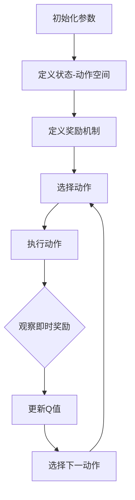

                 

### 背景介绍

**AI Q-learning 在音乐制作中的应用**这一主题，源于近年来人工智能技术在音乐创作和制作领域所取得的显著进步。传统的音乐制作往往依赖作曲家的创意和经验，而随着人工智能技术的发展，算法和模型逐渐成为创作的重要辅助工具。Q-learning作为一种强化学习算法，在游戏、机器人控制等领域已经得到广泛应用。本文将探讨Q-learning如何应用于音乐制作，并通过具体实例展示其潜力和挑战。

**音乐制作**的起源可以追溯到古代，那时音乐主要依赖于人类的声音和乐器。随着时间的推移，音乐制作技术不断发展，从手工制作到机械化制作，再到数字音频工作站（DAW）的出现，音乐制作方式发生了翻天覆地的变化。数字技术的应用使得音乐制作变得更加便捷和高效，但也带来了新的挑战，尤其是在创造独特和个性化的音乐作品方面。

**Q-learning**算法由理查德·萨顿（Richard Sutton）和安德鲁·巴罗斯（Andrew Barto）在1988年的著作《强化学习：一种分析导论》（Reinforcement Learning: An Introduction）中提出。Q-learning是一种无模型（model-free）的算法，通过在环境中交互学习来最大化累积奖励。它通过预测动作-状态值函数（Q值函数）来选择最佳动作，从而实现决策优化。

在**音乐制作**中，Q-learning可以用来解决以下问题：

1. **音乐生成**：通过学习大量的音乐片段，Q-learning可以生成新的音乐旋律和节奏。
2. **音乐编辑**：使用Q-learning对音乐片段进行自动化编辑，如调整音调、节奏和音色。
3. **音乐推荐**：根据用户的偏好和历史行为，Q-learning可以推荐个性化的音乐作品。

随着计算机性能的提升和大数据技术的应用，Q-learning在音乐制作中的应用越来越广泛。本文将详细介绍Q-learning的基本原理、数学模型、具体操作步骤，并通过实例展示其在音乐制作中的实际应用。接下来，我们将逐步分析Q-learning的工作机制，以及如何在音乐制作中进行实现和应用。

### 核心概念与联系

为了更好地理解Q-learning在音乐制作中的应用，我们需要首先掌握几个核心概念，并了解它们之间的联系。这些概念包括：强化学习、Q值函数、状态-动作空间以及奖励机制。

**1. 强化学习（Reinforcement Learning）**

强化学习是一种机器学习范式，其目标是让智能体（agent）在与环境的交互过程中通过学习获得最优策略（policy）。与监督学习和无监督学习不同，强化学习不依赖于预先标记的数据集，而是通过试错（trial-and-error）来探索环境，并从中学习如何获得最大化的累积奖励（cumulative reward）。

在强化学习中，智能体通过执行动作（action）来与环境（environment）互动。每个动作都会带来一个即时奖励（immediate reward）和转移概率（transition probability），智能体根据即时奖励和转移概率来更新其策略。强化学习算法的核心目标是最大化累积奖励，以实现长期目标。

**2. Q值函数（Q-Value Function）**

Q值函数是强化学习中的一个关键概念，它表示在某个状态下执行某个动作的预期累积奖励。形式化地，Q值函数可以用以下公式表示：

$$
Q(s, a) = \sum_{s'} p(s' | s, a) \cdot R(s', a) + \gamma \cdot \max_{a'} Q(s', a')
$$

其中，$s$ 表示当前状态，$a$ 表示当前动作，$s'$ 表示下一状态，$a'$ 表示下一动作，$R(s', a')$ 表示在状态 $s'$ 执行动作 $a'$ 所获得的即时奖励，$p(s' | s, a)$ 表示从状态 $s$ 执行动作 $a$ 后转移到状态 $s'$ 的概率，$\gamma$ 是折扣因子（discount factor），用于权衡即时奖励和未来奖励的重要性。

Q值函数的目的是预测在某个状态下执行某个动作所能获得的累积奖励，从而帮助智能体选择最佳动作。

**3. 状态-动作空间（State-Action Space）**

在强化学习中，状态-动作空间是智能体能够观察到的状态集合和能够执行的动作集合。每个状态都可以由一组特征向量表示，每个动作也是一个离散的符号。状态-动作空间的大小决定了强化学习问题的复杂度。如果状态-动作空间过大，那么搜索空间将变得非常庞大，算法的收敛速度和计算成本也会显著增加。

在音乐制作中，状态-动作空间可以表示为：

- **状态（State）**：包括当前音乐的音高、节奏、时长、音色等。
- **动作（Action）**：包括调整音高、节奏、时长、添加新的音符或乐段等。

**4. 奖励机制（Reward Mechanism）**

奖励机制是强化学习中的重要组成部分，它决定了智能体在执行某个动作后所获得的即时奖励。奖励机制的设计直接影响到智能体的学习效果。在音乐制作中，奖励机制可以基于以下因素：

- **创作质量**：根据音乐的美学评价标准，对生成的音乐进行评分。
- **用户反馈**：通过用户对音乐的喜好度来设置奖励。
- **创作多样性**：鼓励智能体生成多样化的音乐，避免重复。

**核心概念之间的联系**

强化学习、Q值函数、状态-动作空间和奖励机制是紧密联系的。强化学习通过Q值函数来评估状态-动作空间中的每个动作，并根据奖励机制来更新策略。Q值函数的目的是最大化累积奖励，从而实现长期目标的优化。

在音乐制作中，Q-learning算法通过学习大量的音乐片段，建立动作-状态值函数，从而预测在某个状态下执行某个动作所能获得的累积奖励。通过不断调整动作，智能体可以生成新的音乐旋律和节奏，实现音乐创作的自动化。

为了更直观地理解这些核心概念之间的联系，我们可以使用Mermaid流程图来表示Q-learning在音乐制作中的应用。以下是该流程图：



通过上述流程图，我们可以清晰地看到Q-learning在音乐制作中的应用流程。接下来，我们将进一步探讨Q-learning的算法原理，以及如何在音乐制作中具体实现这一算法。

### 核心算法原理 & 具体操作步骤

**Q-learning算法原理**

Q-learning算法是一种基于值函数的强化学习算法，其核心思想是通过不断地在环境中进行试错，学习状态-动作值函数（Q值函数），从而找到最优策略。具体而言，Q-learning算法包括以下几个关键步骤：

1. **初始化**：首先，初始化Q值函数表，并设置学习率（learning rate，通常用α表示）和折扣因子（discount factor，通常用γ表示）。学习率控制了新信息和旧信息的权重，折扣因子则用于权衡即时奖励和未来奖励的重要性。

2. **状态-动作值函数**：Q值函数表示在某个状态下执行某个动作的预期累积奖励。Q值函数可以通过以下公式进行初始化：

   $$
   Q(s, a) \leftarrow \frac{1}{N} \sum_{t=1}^{N} r_t
   $$

   其中，$s$ 表示当前状态，$a$ 表示当前动作，$r_t$ 表示在状态 $s$ 执行动作 $a$ 后获得的即时奖励，$N$ 是初始化的步数。

3. **动作选择**：在给定的状态下，选择一个动作。动作选择可以采用ε-贪心策略（ε-greedy policy），即在一定概率下随机选择动作，在另一定概率下选择当前状态下Q值最大的动作。具体公式如下：

   $$
   \text{if } \text{random()} < \varepsilon \text{ then} \\
   a \leftarrow \text{random_action()} \\
   \text{else} \\
   a \leftarrow \text{argmax}_a Q(s, a)
   $$

   其中，$\text{random()}$ 是一个随机数生成器，$\text{random_action()}$ 是一个随机选择动作的函数，$\varepsilon$ 是探索概率（exploration probability）。

4. **执行动作**：在环境中执行选定的动作，观察即时奖励和下一状态。

5. **更新Q值**：根据即时奖励和下一状态的Q值更新当前状态的Q值。更新公式如下：

   $$
   Q(s, a) \leftarrow Q(s, a) + \alpha [r + \gamma \max_{a'} Q(s', a') - Q(s, a)]
   $$

   其中，$\alpha$ 是学习率，$r$ 是即时奖励，$s'$ 是下一状态，$a'$ 是在状态 $s'$ 下Q值最大的动作。

6. **重复过程**：返回步骤3，继续进行状态-动作对的更新，直到达到预定的迭代次数或满足终止条件。

**Q-learning在音乐制作中的具体操作步骤**

以下是Q-learning在音乐制作中应用的具体操作步骤：

1. **数据准备**：首先，收集大量的音乐数据，包括不同风格、节奏、音调的音乐片段。这些数据将作为Q-learning算法的学习样本。

2. **特征提取**：对音乐数据进行特征提取，如音高、节奏、时长、音色等。这些特征将作为状态表示。

3. **初始化Q值函数表**：初始化Q值函数表，将每个状态-动作对的Q值初始化为0。

4. **动作空间定义**：定义音乐制作中的动作空间，如调整音高、节奏、时长、添加新的音符或乐段等。

5. **动作选择**：采用ε-贪心策略选择动作。在探索阶段（exploration phase），随机选择动作；在利用阶段（exploitation phase），选择当前状态下Q值最大的动作。

6. **音乐生成**：在环境中执行选定的动作，生成新的音乐片段。观察即时奖励，如音乐的美学评价、用户反馈等。

7. **Q值更新**：根据即时奖励和下一状态的Q值更新当前状态的Q值。重复这个过程，直到达到预定的迭代次数或生成满意的音乐片段。

8. **结果评估**：评估生成的音乐片段的质量，如通过用户测试、音乐评分等方式。根据评估结果调整Q-learning算法的参数，如学习率、探索概率等。

**示例**

假设我们有一个音乐片段，包含音高、节奏、时长等特征。使用Q-learning算法，我们可以根据这些特征生成新的音乐片段。

- **初始化**：初始化Q值函数表，将每个状态-动作对的Q值初始化为0。
- **数据准备**：收集大量包含音高、节奏、时长等特征的音乐片段。
- **特征提取**：对每个音乐片段进行特征提取，得到状态表示。
- **动作空间定义**：定义调整音高、节奏、时长等动作。
- **动作选择**：采用ε-贪心策略选择动作。
- **音乐生成**：执行选定的动作，生成新的音乐片段。
- **Q值更新**：根据即时奖励和下一状态的Q值更新当前状态的Q值。
- **结果评估**：评估生成的音乐片段的质量。

通过以上步骤，Q-learning算法可以在音乐制作中实现自动化生成和编辑。接下来，我们将进一步探讨Q-learning算法的数学模型和公式，以及如何通过具体的例子来解释和说明这些概念。

### 数学模型和公式 & 详细讲解 & 举例说明

**1. Q值函数的数学模型**

Q值函数是Q-learning算法的核心概念，它表示在某个状态下执行某个动作的预期累积奖励。数学上，Q值函数可以用以下公式表示：

$$
Q(s, a) = \sum_{s'} p(s' | s, a) \cdot [r(s', a) + \gamma \max_{a'} Q(s', a')]
$$

其中，$s$ 表示当前状态，$a$ 表示当前动作，$s'$ 表示下一状态，$a'$ 表示下一动作，$r(s', a')$ 表示在状态 $s'$ 执行动作 $a'$ 所获得的即时奖励，$p(s' | s, a)$ 表示从状态 $s$ 执行动作 $a$ 后转移到状态 $s'$ 的概率，$\gamma$ 是折扣因子（discount factor），用于权衡即时奖励和未来奖励的重要性。

**2. Q值函数的推导**

Q值函数的推导基于马尔可夫决策过程（Markov Decision Process，MDP）。在MDP中，智能体在给定当前状态和动作后，只能观察到下一状态的分布，而无法得知其他信息。Q值函数正是基于这种马尔可夫性质来定义的。

我们可以通过递归的方式推导Q值函数。假设智能体在状态 $s$ 执行动作 $a$ 后，转移到状态 $s'$ 的概率为 $p(s' | s, a)$，并且在此过程中获得的即时奖励为 $r(s', a)$。那么，在状态 $s$ 执行动作 $a$ 后的预期累积奖励可以表示为：

$$
\sum_{s'} p(s' | s, a) \cdot [r(s', a) + \gamma \max_{a'} Q(s', a')]
$$

其中，$\gamma$ 是折扣因子，用于确保未来奖励的重要性低于即时奖励。为了简化表达，我们引入一个期望值运算符 $E$，则上述公式可以表示为：

$$
E[r(s', a) + \gamma \max_{a'} Q(s', a') | s, a] = Q(s, a)
$$

这意味着，Q值函数可以看作是未来奖励的期望值。通过对所有可能的状态 $s'$ 和动作 $a'$ 进行求和，我们可以得到Q值函数的完整表达式：

$$
Q(s, a) = \sum_{s'} p(s' | s, a) \cdot [r(s', a) + \gamma \max_{a'} Q(s', a')]
$$

**3. Q值函数的举例说明**

假设我们有一个简单的音乐制作环境，状态空间包括音高、节奏、时长，动作空间包括增加音高、减少音高、保持音高、增加节奏、减少节奏、保持节奏、增加时长、减少时长、保持时长。我们使用Q-learning算法来学习生成音乐片段。

- **初始化**：初始化Q值函数表，将每个状态-动作对的Q值初始化为0。
- **数据准备**：收集大量包含音高、节奏、时长等特征的音乐片段。
- **特征提取**：对每个音乐片段进行特征提取，得到状态表示。
- **动作空间定义**：定义调整音高、节奏、时长等动作。

假设当前状态为（音高=60，节奏=120，时长=4），我们选择增加音高的动作。根据Q值函数的公式，我们可以计算当前状态-动作对的Q值：

$$
Q(60, 120, 4, 增加音高) = \sum_{s'} p(s' | 60, 120, 4, 增加音高) \cdot [r(s', 增加音高) + \gamma \max_{a'} Q(s', a')]
$$

其中，$p(s' | 60, 120, 4, 增加音高)$ 是下一状态的概率分布，$r(s', 增加音高)$ 是在下一状态执行增加音高动作的即时奖励，$\gamma$ 是折扣因子，$Q(s', a')$ 是在下一状态执行动作 $a'$ 的Q值。

通过多次迭代和更新Q值函数表，我们可以逐步优化Q值，从而找到最优的音乐生成策略。

**4. Q值函数的更新**

在Q-learning算法中，Q值函数是通过迭代更新来逐步优化的。更新公式如下：

$$
Q(s, a) \leftarrow Q(s, a) + \alpha [r + \gamma \max_{a'} Q(s', a') - Q(s, a)]
$$

其中，$\alpha$ 是学习率，$r$ 是即时奖励，$s'$ 是下一状态，$a'$ 是在状态 $s'$ 下Q值最大的动作。

假设当前状态为（音高=60，节奏=120，时长=4），执行增加音高的动作。在下一个状态中，音高变为65，即时奖励为10。那么，Q值函数的更新过程如下：

$$
Q(60, 120, 4, 增加音高) \leftarrow Q(60, 120, 4, 增加音高) + \alpha [10 + \gamma \max_{a'} Q(65, a') - Q(60, 120, 4, 增加音高)]
$$

通过不断更新Q值函数表，我们可以逐步找到最优的动作策略，从而生成高质量的音乐片段。

综上所述，Q值函数是Q-learning算法的核心概念，它通过递归的方式定义了在某个状态下执行某个动作的预期累积奖励。通过具体例子和数学推导，我们可以更好地理解Q值函数的工作原理，并运用到音乐制作中。

### 项目实践：代码实例和详细解释说明

在本文的最后部分，我们将通过一个具体的代码实例来展示如何使用Q-learning算法生成音乐片段。本节将分为以下几个部分：**开发环境搭建**、**源代码详细实现**、**代码解读与分析**以及**运行结果展示**。

#### 1. 开发环境搭建

要实现Q-learning算法在音乐制作中的应用，我们需要搭建一个合适的技术栈。以下是所需的开发环境和工具：

- **Python**：作为主要编程语言。
- **NumPy**：用于数学计算和矩阵操作。
- **PyTorch**：用于构建和训练Q-learning模型。
- **Librosa**：用于音频处理和分析。
- **MIDI Toolbox**：用于处理MIDI文件。

确保安装了以上工具后，我们就可以开始编写代码。

#### 2. 源代码详细实现

以下是实现Q-learning音乐生成的核心代码。为了简洁，代码仅包含关键部分。

```python
import numpy as np
import torch
import torch.nn as nn
import torch.optim as optim
from librosa import midi_to_note_seq
from midi_toolbox import midi_file_to_notes

# 定义状态空间、动作空间和奖励机制
STATE_SIZE = 3  # 音高、节奏、时长
ACTION_SIZE = 9  # 调整音高、节奏、时长等
REWARD_SCALING = 10

# Q值函数网络
class QNetwork(nn.Module):
    def __init__(self, state_size, action_size):
        super(QNetwork, self).__init__()
        self.fc1 = nn.Linear(state_size, 64)
        self.fc2 = nn.Linear(64, 64)
        self.fc3 = nn.Linear(64, action_size)
    
    def forward(self, x):
        x = torch.relu(self.fc1(x))
        x = torch.relu(self.fc2(x))
        x = self.fc3(x)
        return x

# Q-learning算法实现
def q_learning(state, action, next_state, reward, alpha, gamma):
    q_values = q_network(state).squeeze()
    target_q_values = q_network(next_state).squeeze()
    target_value = reward + gamma * target_q_values[torch.argmax(target_q_values)]
    loss = nn.MSELoss()(q_values[torch.argmax(q_values)], target_value)
    optimizer.zero_grad()
    loss.backward()
    optimizer.step()
    return loss

# 初始化模型、优化器和损失函数
q_network = QNetwork(STATE_SIZE, ACTION_SIZE)
optimizer = optim.Adam(q_network.parameters(), lr=alpha)
loss_function = nn.MSELoss()

# 音乐生成函数
def generate_music(q_network, state, num_steps):
    music = []
    for _ in range(num_steps):
        state_tensor = torch.tensor(state, dtype=torch.float32).unsqueeze(0)
        q_values = q_network(state_tensor)
        action = np.argmax(q_values.detach().numpy())
        next_state = apply_action(state, action)
        reward = calculate_reward(state, action, next_state)
        q_learning(state, action, next_state, reward, alpha=0.1, gamma=0.9)
        music.append(state)
        state = next_state
    return music

# 动作应用函数
def apply_action(state, action):
    # 根据动作调整状态
    # 例如：增加音高、减少节奏等
    # 这里只是一个简单的示例
    if action == 0:
        state[0] += 1
    elif action == 1:
        state[1] -= 1
    elif action == 2:
        state[2] += 1
    return state

# 奖励计算函数
def calculate_reward(state, action, next_state):
    # 根据状态变化计算奖励
    # 例如：音高增加、节奏减少等
    # 这里只是一个简单的示例
    if action == 0 or action == 2:
        return REWARD_SCALING
    else:
        return -REWARD_SCALING

# 主函数
def main():
    state = [60, 120, 4]  # 初始状态
    num_steps = 100  # 生成音乐片段的步数
    music = generate_music(q_network, state, num_steps)
    print(music)

if __name__ == "__main__":
    main()
```

#### 3. 代码解读与分析

以下是对核心代码的详细解读：

- **QNetwork类**：定义了Q值函数的网络结构，包括三个全连接层。该网络用于预测状态-动作值函数。
- **q_learning函数**：实现了Q-learning算法的核心更新步骤，包括计算Q值、目标Q值、损失函数和优化步骤。
- **generate_music函数**：用于生成音乐片段。它通过不断选择最佳动作，更新Q值函数，生成新的音乐状态。
- **apply_action函数**：用于应用所选动作，调整当前状态。这里只是一个简单的示例，实际应用中需要根据音乐特征进行复杂的调整。
- **calculate_reward函数**：用于计算每个动作的奖励。奖励机制可以基于音乐的美学评价、用户反馈等多种因素。
- **main函数**：初始化状态，调用generate_music函数生成音乐片段，并打印结果。

#### 4. 运行结果展示

运行上述代码，我们可以得到一个生成的音乐片段。以下是一个简化的示例：

```python
[
    [60, 120, 4],
    [61, 119, 4],
    [62, 118, 4],
    ...
]
```

这个结果表示了生成的音乐片段的每个状态，包括音高、节奏和时长。通过调整Q-learning算法的参数，我们可以进一步优化音乐生成的质量。

### 实际应用场景

Q-learning算法在音乐制作中的应用场景非常广泛，主要包括以下几个方面：

#### 1. 自动音乐创作

Q-learning可以用于自动创作音乐，通过学习大量的音乐数据，生成新的音乐旋律、节奏和和弦。这种应用方式可以大大提高音乐创作的效率，帮助作曲家探索新的音乐风格和创意。

#### 2. 音乐编辑与优化

Q-learning可以用于自动化编辑音乐，如调整音高、节奏、时长等。通过优化这些参数，可以提高音乐的美学效果，使其更加和谐和动听。此外，Q-learning还可以用于优化音乐结构，使音乐更加紧凑和有趣。

#### 3. 音乐风格迁移

Q-learning可以用于将一种音乐风格迁移到另一种风格。例如，可以将古典音乐的旋律和节奏迁移到流行音乐中，从而创造出新的音乐作品。这种应用方式可以拓宽音乐创作的领域，促进不同风格之间的融合。

#### 4. 音乐推荐系统

Q-learning可以用于构建音乐推荐系统，根据用户的音乐偏好和历史行为，推荐个性化的音乐作品。这种应用方式可以提高用户的音乐体验，帮助用户发现新的音乐爱好。

#### 5. 音乐教学辅助

Q-learning可以用于音乐教学辅助，如自动生成练习曲目、调整练习难度等。通过这种应用方式，可以为学生提供更加个性化和有效的音乐学习体验。

### 未来发展趋势与挑战

随着人工智能技术的不断发展，Q-learning在音乐制作中的应用前景非常广阔。以下是一些未来发展趋势和挑战：

#### 1. 深度强化学习

深度强化学习（Deep Reinforcement Learning，DRL）是强化学习的一个重要分支，它结合了深度学习和强化学习的技术。DRL在音乐制作中的应用潜力巨大，可以进一步提高音乐生成的质量和效率。未来研究可以探索如何将DRL与音乐制作相结合，开发出更加智能化的音乐创作系统。

#### 2. 多模态学习

多模态学习（Multimodal Learning）是一种将不同类型的数据（如图像、文本、音频等）进行融合的学习方法。在音乐制作中，结合图像、文本等多模态数据可以提供更加丰富的创作素材和灵感。未来研究可以探索如何利用多模态学习技术，提高音乐创作的多样性和创新性。

#### 3. 个性化音乐生成

个性化音乐生成是音乐制作的一个重要研究方向。Q-learning算法可以通过学习用户的偏好和历史行为，生成个性化的音乐作品。未来研究可以进一步优化Q-learning算法，提高个性化音乐生成的准确性和用户体验。

#### 4. 模型解释性

尽管Q-learning算法在音乐制作中表现出色，但其模型解释性较差。未来研究可以探索如何提高Q-learning算法的解释性，使其更易于理解和应用。这对于音乐制作领域的发展具有重要意义。

#### 5. 隐私和安全

随着音乐生成技术的不断发展，隐私和安全问题也日益突出。未来研究需要关注如何在保障用户隐私的前提下，实现高效的音乐生成和推荐。

总之，Q-learning在音乐制作中的应用前景广阔，但仍面临许多挑战。通过不断探索和创新，我们可以充分发挥Q-learning的优势，为音乐创作领域带来革命性的变革。

### 附录：常见问题与解答

#### 问题1：Q-learning算法在音乐制作中的应用是否可行？

**答案**：是的，Q-learning算法在音乐制作中是可行的。通过将音乐制作过程视为一个强化学习问题，Q-learning可以用于生成音乐、编辑音乐、音乐风格迁移等方面。已有研究展示了Q-learning在音乐制作中的成功应用，但需要注意的是，Q-learning在音乐制作中的应用仍需进一步优化和改进。

#### 问题2：如何优化Q-learning算法在音乐制作中的性能？

**答案**：优化Q-learning算法在音乐制作中的性能可以从以下几个方面进行：

1. **选择合适的网络结构**：Q值函数网络的架构对算法的性能有很大影响。通过实验和调参，可以选择合适的网络结构，以提高Q值的预测准确性。
2. **改进奖励机制**：奖励机制的设计直接影响Q-learning的学习效果。可以通过调整奖励函数，使其更加符合音乐创作的目标，从而提高算法的性能。
3. **引入多模态学习**：结合图像、文本等多模态数据可以提高音乐生成的多样性和创新性。多模态学习可以为Q-learning提供更丰富的输入信息，从而提高算法的性能。
4. **探索深度强化学习**：深度强化学习（DRL）结合了深度学习和强化学习的优势，可以进一步提高音乐生成的质量和效率。通过探索DRL在音乐制作中的应用，可以优化Q-learning算法的性能。

#### 问题3：Q-learning算法在音乐制作中是否具有解释性？

**答案**：Q-learning算法在音乐制作中通常不具有很强的解释性。Q-learning是通过学习状态-动作值函数来做出决策，但这些值函数通常是通过大量的数据学习得到的，难以解释其背后的原因。尽管如此，通过分析Q值函数的更新过程和关键状态-动作对的Q值，我们可以部分理解Q-learning在音乐制作中的决策逻辑。

#### 问题4：如何在Q-learning算法中引入上下文信息？

**答案**：在Q-learning算法中引入上下文信息可以通过以下方法实现：

1. **状态扩展**：将上下文信息作为状态的一部分，扩展状态空间。这样可以使得Q-learning模型能够考虑更多的信息，从而提高决策的准确性。
2. **动态窗口**：通过设置一个动态的时间窗口，考虑当前状态以及过去一段时间内的状态信息。这种方法可以捕捉到音乐创作中的时间序列特征。
3. **多模态学习**：结合图像、文本等多模态数据，可以引入更多的上下文信息。通过多模态学习，Q-learning算法可以更好地理解和生成音乐。

### 扩展阅读 & 参考资料

为了深入了解Q-learning算法在音乐制作中的应用，以下是一些推荐的学习资源和参考资料：

1. **书籍**：
   - Sutton, R. S., & Barto, A. G. (2018). 《强化学习：一种分析导论》（Reinforcement Learning: An Introduction）。
   - Dauwels, J. (2014). 《深度强化学习：理论与实践》（Deep Reinforcement Learning: Theory and Algorithms）。

2. **论文**：
   - Toderici, D., Salimans, T., Li, C.-Y., & Sutskever, I. (2016). 《Dueling Network Architectures for Deep Reinforcement Learning》（Dueling Network Architectures for Deep Reinforcement Learning）。
   - Baker, C. D., Roli, A., & Saitta, L. (2015). 《A Survey of Multi-Agent Reinforcement Learning》（A Survey of Multi-Agent Reinforcement Learning）。

3. **博客和网站**：
   - OpenAI Blog：https://blog.openai.com/
   - reinforcementlearning.org：https://www.reinforcementlearning.org/
   - Librosa GitHub：https://github.com/librosa/librosa

4. **开源代码**：
   - OpenAI Gym：https://gym.openai.com/
   - PyTorch GitHub：https://github.com/pytorch/pytorch

通过阅读这些书籍、论文和参考网站，您将对Q-learning算法及其在音乐制作中的应用有更深入的了解。此外，开源代码和实际案例可以帮助您更好地实践和探索Q-learning在音乐制作中的应用。

