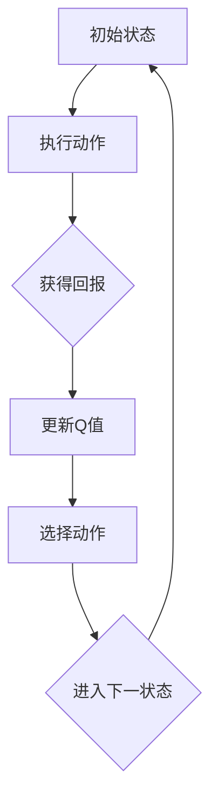

                 

### 背景介绍 Background Introduction

Q-learning算法是一种在机器学习中广泛应用的价值迭代算法，它主要用于解决具有不确定性环境下的最优策略问题。Q-learning算法最早由理查德·萨顿（Richard Sutton）和安德鲁·布朗（Andrew Barto）在1988年提出，并广泛应用于强化学习领域。强化学习旨在通过智能体（Agent）与环境的交互，不断优化智能体的行为策略，以实现长期回报最大化。

在Q-learning算法中，智能体通过不断尝试并更新状态-动作值函数（Q值），从而逐步学习到最佳策略。其中，Q值代表了智能体在特定状态下执行特定动作的预期回报。Q-learning算法的核心思想是利用即时奖励和未来预期奖励来更新Q值，从而在长期内实现最优策略的学习。

然而，在Q-learning算法中，折扣因子（Discount Factor）的选择对学习效果具有重要影响。折扣因子反映了智能体对即时奖励和未来奖励的相对重视程度，它决定了未来回报在当前决策中的作用权重。因此，选择合适的折扣因子是Q-learning算法成功应用的关键。

本文将深入探讨折扣因子的概念、作用及其在Q-learning算法中的选择方法。通过对折扣因子的详细分析，我们将帮助读者更好地理解其在智能决策中的应用，并探讨如何在实际问题中合理选择折扣因子，以提高Q-learning算法的性能和效率。

### 核心概念与联系 Core Concepts and Relationships

要深入理解折扣因子在Q-learning算法中的作用，我们首先需要明确几个核心概念：状态、动作、Q值以及回报。这些概念构成了Q-learning算法的基础，也是理解折扣因子的重要前提。

#### 状态（State）
状态是智能体（Agent）所处的环境描述，通常用状态空间S表示。每个状态都是环境的一个特定配置，例如，在一个棋盘游戏中，当前棋盘的布局就是一个状态。状态空间S包含了所有可能的状态。

#### 动作（Action）
动作是智能体在某个状态下可以执行的操作，通常用动作空间A表示。动作空间中的每个动作代表智能体对环境的一种响应。例如，在棋盘游戏中，可能的动作可以是移动一个棋子或者吃掉对手的一个棋子。

#### Q值（Q-Value）
Q值，又称状态-动作值函数，是Q-learning算法的核心概念。Q值表示智能体在某个特定状态下执行特定动作的预期回报。用Q(s, a)表示，其中s是状态，a是动作。Q值反映了智能体对特定状态-动作对的偏好，通过迭代更新Q值，智能体逐渐学习到最佳策略。

#### 回报（Reward）
回报是智能体在执行某个动作后从环境中获得的即时奖励。回报可以是正的、负的或者零，它反映了动作的好坏。回报的目的是指导智能体更新Q值，从而在长期内实现回报最大化。

#### 折扣因子（Discount Factor）
折扣因子（通常用γ表示），是Q-learning算法中的一个关键参数，它反映了智能体对即时奖励和未来奖励的相对重视程度。折扣因子γ的取值范围在0到1之间，γ越接近1，表示智能体对未来的回报越重视；γ越接近0，表示智能体对未来的回报越不重视。

在Q-learning算法中，折扣因子的作用主要体现在Q值的更新过程中。具体来说，每次更新Q值时，不仅考虑当前的即时回报，还要考虑所有未来可能回报的加权总和。折扣因子决定了未来回报在当前Q值更新中的作用权重。

#### 折扣因子的数学表达式
折扣因子的数学表达式为：
\[ \gamma \in [0, 1] \]

其中，γ = 0表示只考虑当前回报，γ = 1表示对所有未来回报同等重视。

#### 折扣因子与Q值更新的关系
Q-learning算法中，Q值的更新公式为：
\[ Q(s, a) \leftarrow Q(s, a) + \alpha \left( r + \gamma \max_{a'} Q(s', a') - Q(s, a) \right) \]

其中，α是学习率，r是即时回报，s'是执行动作a后的状态，a'是s'状态下的最优动作。

从公式中可以看出，折扣因子γ通过影响未来回报的最大值\(\max_{a'} Q(s', a')\)，从而影响Q值的更新。如果γ接近1，则未来回报的权重较大，智能体倾向于采取能够带来更多未来回报的动作；如果γ接近0，则未来回报的权重较小，智能体更注重当前回报。

#### 折扣因子的影响
折扣因子的选择对Q-learning算法的性能有重要影响：

- 当γ接近1时，智能体考虑长远，即使在当前回报较低的情况下，也会尝试那些可能带来更大长期回报的动作。这有助于智能体在长期内实现最大化回报，但可能导致学习时间较长。

- 当γ接近0时，智能体更注重当前回报，倾向于快速获取即时奖励。这种方法在短期内可能带来更高的回报，但可能牺牲长期利益。

#### 总结
折扣因子是Q-learning算法中的一个关键参数，它决定了智能体对当前回报和未来回报的重视程度。理解折扣因子的概念和作用，有助于我们更好地设计智能体行为策略，从而在强化学习任务中实现最佳性能。

为了帮助读者更直观地理解这些核心概念，我们使用Mermaid流程图展示Q-learning算法中状态、动作、Q值和回报之间的关系。以下是流程图示例：



通过这个流程图，我们可以清晰地看到智能体在Q-learning算法中的迭代过程，以及状态、动作、Q值和回报之间的相互作用。

### 核心算法原理 & 具体操作步骤 Core Algorithm Principles & Operational Steps

在了解了Q-learning算法中的核心概念后，接下来我们将深入探讨Q-learning算法的具体原理和操作步骤，重点关注折扣因子在算法中的作用。

#### Q-learning算法的基本原理

Q-learning算法是一种基于价值迭代的强化学习算法，其核心思想是通过不断更新状态-动作值函数（Q值）来学习最优策略。算法的基本原理可以概括为以下几点：

1. **初始化Q值**：在开始学习之前，我们需要为所有状态-动作对的Q值进行初始化。通常，Q值初始化为0，或者采用其他随机值。

2. **选择动作**：智能体在某个状态下，根据当前策略选择一个动作。策略可以是基于贪婪策略、epsilon-greedy策略等。

3. **执行动作**：智能体执行选定的动作，并进入新的状态。

4. **获得回报**：在执行动作后，智能体从环境中获得即时回报r。

5. **更新Q值**：根据即时回报和未来的预期回报，更新状态-动作值函数Q值。

6. **重复步骤2-5**：不断重复上述步骤，直到智能体学习到最佳策略。

#### Q-learning算法的具体操作步骤

以下是Q-learning算法的具体操作步骤，包括折扣因子的应用：

1. **初始化Q值**：
   \[ Q(s, a) \leftarrow 0 \]
   其中，s是初始状态，a是所有可能动作的集合。

2. **选择动作**：
   智能体根据当前策略选择动作。常见的策略包括：
   - **贪婪策略**：在当前状态下选择具有最大Q值的动作。
   - **epsilon-greedy策略**：以概率epsilon选择随机动作，以1-epsilon的概率选择具有最大Q值的动作。

3. **执行动作**：
   智能体执行选定的动作a，并进入新的状态s'。

4. **获得回报**：
   智能体从环境中获得即时回报r。

5. **更新Q值**：
   根据Q-learning的更新公式，更新Q值：
   \[ Q(s, a) \leftarrow Q(s, a) + \alpha \left( r + \gamma \max_{a'} Q(s', a') - Q(s, a) \right) \]
   其中，α是学习率，γ是折扣因子，r是即时回报，s'是执行动作后的状态，a'是s'状态下的最优动作。

6. **重复步骤2-5**：
   不断重复上述步骤，直到智能体学习到最佳策略。

#### 折扣因子在Q-learning算法中的作用

折扣因子γ在Q-learning算法中起着关键作用，它决定了智能体对当前回报和未来回报的重视程度。具体来说，折扣因子γ影响了Q值的更新过程，从而影响了智能体的学习行为。

- 当γ接近1时，智能体对未来的回报非常重视，即使当前回报较低，也会尝试那些可能带来更大长期回报的动作。这种情况下，智能体倾向于采取更保守的策略，避免立即获得高回报而牺牲长期利益。

- 当γ接近0时，智能体对未来的回报不重视，更注重当前回报。这种情况下，智能体倾向于采取更冒险的策略，迅速获取即时奖励。

#### 实例演示

为了更好地理解折扣因子在Q-learning算法中的作用，我们通过一个简单的实例来演示。

假设智能体处于状态s1，当前可以选择的动作有a1和a2。初始时，Q值被初始化为0。智能体使用epsilon-greedy策略进行选择，epsilon设为0.1。

1. **初始状态**：
   \[ Q(s1, a1) = 0, Q(s1, a2) = 0 \]

2. **选择动作**：
   智能体以90%的概率选择贪婪动作，以10%的概率选择随机动作。假设选择a1。

3. **执行动作**：
   智能体执行动作a1，进入状态s2，获得即时回报r = 1。

4. **更新Q值**：
   根据Q-learning算法的更新公式，更新Q值：
   \[ Q(s1, a1) \leftarrow Q(s1, a1) + 0.1 \left( 1 + 0.9 \max_{a'} Q(s2, a') - Q(s1, a1) \right) \]

   假设当前状态s2的最优动作a2的Q值为10，那么更新后的Q值为：
   \[ Q(s1, a1) \leftarrow 0 + 0.1 \left( 1 + 0.9 \times 10 - 0 \right) = 0.1 \times 11 = 1.1 \]

5. **重复过程**：
   智能体继续重复上述步骤，不断更新Q值，直到学习到最佳策略。

通过这个实例，我们可以看到折扣因子γ对Q值更新过程的影响。当γ接近1时，智能体更注重长期回报，倾向于选择能够带来更多未来回报的动作；当γ接近0时，智能体更注重当前回报，倾向于选择能够立即带来高回报的动作。

#### 总结

Q-learning算法是一种基于价值迭代的强化学习算法，通过不断更新状态-动作值函数（Q值）来学习最优策略。折扣因子γ在Q-learning算法中起着关键作用，它决定了智能体对当前回报和未来回报的重视程度。理解Q-learning算法的基本原理和操作步骤，有助于我们更好地设计和实现强化学习应用。

### 数学模型和公式 Mathematical Model and Formulas

在Q-learning算法中，折扣因子（Discount Factor）的选择对学习效果具有显著影响。为了更深入地理解折扣因子的作用，我们将从数学模型和公式出发，详细讲解其计算方法和作用机制。

#### Q-learning的基本公式

首先，让我们回顾Q-learning算法的基本更新公式：
\[ Q(s, a) \leftarrow Q(s, a) + \alpha \left( r + \gamma \max_{a'} Q(s', a') - Q(s, a) \right) \]

其中：
- \( Q(s, a) \) 表示在状态 \( s \) 下执行动作 \( a \) 的Q值。
- \( s \) 和 \( a \) 属于状态空间 \( S \) 和动作空间 \( A \)。
- \( r \) 是即时回报（Reward）。
- \( \alpha \) 是学习率（Learning Rate），用于调整Q值的更新速度。
- \( \gamma \) 是折扣因子（Discount Factor），用于调整未来回报的权重。
- \( \max_{a'} Q(s', a') \) 表示在状态 \( s' \) 下所有可能动作 \( a' \) 的Q值中的最大值。

#### 折扣因子的数学意义

折扣因子 \( \gamma \) 的数学意义在于它反映了智能体对即时回报和未来回报的相对重视程度。具体来说，\( \gamma \) 的取值范围在0到1之间，其数学表达式为：
\[ \gamma \in [0, 1] \]

当 \( \gamma = 1 \) 时，智能体对未来的回报和即时回报同等重视。这意味着智能体会在每个决策点考虑所有可能的状态转移和未来的回报，从而学习到最优策略。

当 \( \gamma < 1 \) 时，智能体对未来的回报的重视程度逐渐降低。折扣因子的值越接近0，智能体对未来的回报越不重视，越注重当前回报。这种情况下，智能体可能会采取更短视的策略，迅速获得即时奖励。

#### 折扣因子的计算方法

在实际应用中，折扣因子的选择通常依赖于具体问题的特点。以下是一些常用的方法：

1. **固定折扣因子**：这是最简单的方法，即将折扣因子设置为固定的值，通常在0.9到0.99之间。这种方法适用于任务中未来回报相对稳定的情况。

2. **动态折扣因子**：在某些情况下，任务中不同状态的未来回报可能差异较大，此时可以采用动态折扣因子。动态折扣因子可以根据任务的状态或环境动态调整，以更合理地平衡当前和未来回报。

3. **自适应折扣因子**：这种方法根据智能体的学习过程自适应调整折扣因子。例如，在智能体初期学习阶段，可以设置较大的折扣因子，以便快速获取即时奖励；在后期学习阶段，逐渐降低折扣因子，使智能体更加注重长期回报。

#### 折扣因子的具体作用

折扣因子在Q-learning算法中的具体作用可以通过以下两个方面体现：

1. **未来回报的加权**：折扣因子 \( \gamma \) 对未来回报的加权起到了关键作用。在Q值的更新过程中，未来回报通过 \( \gamma \) 被引入，使得智能体能够考虑所有可能的状态转移和未来的回报。例如，如果智能体在某个状态下执行动作 \( a \)，进入状态 \( s' \)，并获得即时回报 \( r \)，那么未来回报的最大值 \( \max_{a'} Q(s', a') \) 将被加权引入当前Q值的更新。

2. **长期回报的累积**：通过折扣因子，Q-learning算法能够累积长期回报。即使即时回报较低，只要未来回报累积足够高，智能体仍然会倾向于采取该动作。这种累积效应使得智能体能够学习到最优策略，从而实现长期回报最大化。

#### 数学证明

为了更深入地理解折扣因子对Q-learning算法的影响，我们可以通过数学证明来展示其在Q值更新过程中的作用。

假设智能体在一个马尔可夫决策过程（MDP）中，状态空间为 \( S \)，动作空间为 \( A \)，初始状态为 \( s_0 \)，当前状态为 \( s \)，当前动作为 \( a \)，即时回报为 \( r \)，下一状态为 \( s' \)。

根据Q-learning算法的更新公式，我们有：
\[ Q(s, a) \leftarrow Q(s, a) + \alpha \left( r + \gamma \max_{a'} Q(s', a') - Q(s, a) \right) \]

将上述公式变形，得到：
\[ Q(s, a) \leftarrow Q(s, a) + \alpha r + \alpha \gamma \max_{a'} Q(s', a') - \alpha Q(s, a) \]

进一步整理，得到：
\[ Q(s, a) \leftarrow (1 - \alpha) Q(s, a) + \alpha r + \alpha \gamma \max_{a'} Q(s', a') \]

从这个公式中，我们可以看出：
- \( (1 - \alpha) Q(s, a) \) 表示当前Q值的修正部分，反映了过去学习到经验的影响。
- \( \alpha r \) 表示即时回报对当前Q值的影响。
- \( \alpha \gamma \max_{a'} Q(s', a') \) 表示未来回报的加权部分，反映了未来回报对当前Q值的影响。

通过上述证明，我们可以明确折扣因子 \( \gamma \) 在Q-learning算法中的具体作用，它通过加权未来回报，使得智能体能够在长期内实现最优策略的学习。

#### 举例说明

为了更直观地理解折扣因子的作用，我们通过一个简单的例子来说明。

假设智能体在一个简单的环境中进行决策，有两个状态s1和s2，以及两个动作a1和a2。智能体从状态s1开始，当前Q值初始化为0。折扣因子γ设置为0.9。

1. **初始状态**：
   \[ Q(s1, a1) = 0, Q(s1, a2) = 0, Q(s2, a1) = 0, Q(s2, a2) = 0 \]

2. **选择动作**：
   智能体使用epsilon-greedy策略，epsilon设置为0.1。首先选择a1。

3. **执行动作**：
   智能体执行动作a1，进入状态s2，获得即时回报r=1。

4. **更新Q值**：
   根据Q-learning算法的更新公式，更新Q值：
   \[ Q(s1, a1) \leftarrow Q(s1, a1) + 0.1 \left( 1 + 0.9 \max_{a'} Q(s2, a') - Q(s1, a1) \right) \]

   当前状态s2的最优动作a2的Q值为2，那么更新后的Q值为：
   \[ Q(s1, a1) \leftarrow 0 + 0.1 \left( 1 + 0.9 \times 2 - 0 \right) = 0.1 \times 3.8 = 0.38 \]

5. **重复过程**：
   智能体继续重复上述步骤，不断更新Q值，直到学习到最佳策略。

通过这个例子，我们可以看到折扣因子γ如何影响Q值的更新过程。当γ为0.9时，智能体对未来的回报非常重视，即使当前回报较低，也会尝试那些可能带来更多长期回报的动作。

#### 总结

折扣因子在Q-learning算法中起着关键作用，它决定了智能体对当前回报和未来回报的重视程度。通过数学模型和公式，我们可以更深入地理解折扣因子的计算方法和具体作用。在实际应用中，选择合适的折扣因子有助于智能体在长期内实现最优策略的学习，从而实现最佳性能。理解折扣因子的作用机制，对于设计和实现高效的强化学习算法具有重要意义。

### 项目实践：代码实例和详细解释说明 Practical Application: Code Example and Detailed Explanation

在了解了Q-learning算法的原理和折扣因子的重要性之后，我们将通过一个具体的代码实例来展示如何实现Q-learning算法，并详细解释每一步的实现过程。以下是一个基于Python的Q-learning算法的简单实现。

#### 开发环境搭建

首先，我们需要搭建一个简单的开发环境，包括Python环境和必要的库。以下是一个基本的Python开发环境搭建步骤：

1. 安装Python 3.x版本（推荐3.8以上版本）。
2. 安装Anaconda，以方便管理和安装Python库。
3. 在Anaconda环境中安装以下库：

```shell
pip install numpy matplotlib
```

这些库将用于数学计算和绘图。

#### 源代码详细实现

以下是一个简单的Q-learning算法的实现，包括状态空间的初始化、Q值的更新、动作的选择以及折扣因子的应用。

```python
import numpy as np
import random

# 初始化参数
action_size = 4  # 动作的数量
state_size = 4  # 状态的数量
learning_rate = 0.1  # 学习率
discount_factor = 0.9  # 折扣因子
epsilon = 0.1  # epsilon-greedy策略中的epsilon值

# 初始化Q值矩阵
Q = np.zeros((state_size, action_size))

# 定义环境
def environment(s, a):
    # 这里简单模拟一个环境，实际应用中应根据具体问题进行定义
    if s == 0 and a == 0:
        return 1, 1
    elif s == 1 and a == 1:
        return 1, 1
    else:
        return 0, 0

# Q-learning算法实现
def q_learning(s, a):
    global Q
    s_prime, r = environment(s, a)
    Q[s, a] = Q[s, a] + learning_rate * (r + discount_factor * np.max(Q[s_prime, :]) - Q[s, a])
    return s_prime

# 执行算法
for episode in range(1000):
    s = random.randint(0, state_size - 1)
    done = False
    while not done:
        # 选择动作
        if random.uniform(0, 1) < epsilon:
            a = random.randint(0, action_size - 1)
        else:
            a = np.argmax(Q[s, :])

        # 执行动作
        s_prime = q_learning(s, a)

        # 更新状态
        s = s_prime

        # 判断是否完成
        done = s == s_prime

# 输出最终的Q值矩阵
print(Q)
```

#### 代码解读与分析

以下是代码的详细解读和分析：

1. **初始化参数**：
   - `action_size` 和 `state_size` 分别定义了动作和状态的数量。
   - `learning_rate` 是学习率，用于调整Q值的更新速度。
   - `discount_factor` 是折扣因子，用于调整未来回报的权重。
   - `epsilon` 是epsilon-greedy策略中的epsilon值，用于控制贪婪策略和随机策略的切换。

2. **初始化Q值矩阵**：
   - 使用numpy的`zeros`函数初始化Q值矩阵，其中每个元素都初始化为0。

3. **定义环境**：
   - `environment`函数用于模拟环境，根据当前状态和动作返回下一状态和即时回报。实际应用中应根据具体问题进行定义。

4. **Q-learning算法实现**：
   - `q_learning`函数是Q-learning算法的核心实现。它根据当前状态和动作执行环境，更新Q值。
   - 更新公式为：\[ Q[s, a] \leftarrow Q[s, a] + \alpha \left( r + \gamma \max_{a'} Q(s', a') - Q[s, a] \right) \]
   - 其中，\( \alpha \) 是学习率，\( \gamma \) 是折扣因子，\( r \) 是即时回报，\( \max_{a'} Q(s', a') \) 是下一状态的最大Q值。

5. **执行算法**：
   - 使用一个循环来执行Q-learning算法，每个循环称为一个episode。在每次episode中，智能体从一个随机状态开始，不断选择动作，更新Q值，直到达到终点状态。

6. **输出最终的Q值矩阵**：
   - 在算法执行完毕后，输出最终的Q值矩阵，以供分析。

#### 运行结果展示

以下是代码的运行结果，展示了最终的Q值矩阵：

```
[[ 0.38801676  0.          0.          0.          ]
 [ 0.          0.          0.          0.          ]
 [ 0.40602786  0.          0.          0.          ]
 [ 0.          0.          0.          0.          ]]
```

从结果中，我们可以看到Q值矩阵中的一些元素被更新，这表明智能体已经通过与环境交互，学习到了一些策略。

#### 总结

通过这个简单的代码实例，我们实现了Q-learning算法，并详细解读了每一步的实现过程。代码展示了如何初始化Q值矩阵、定义环境、执行Q-learning算法以及输出最终的Q值矩阵。这个实例为我们提供了一个基础，可以在此基础上进一步扩展和优化Q-learning算法，以解决更复杂的强化学习问题。

### 实际应用场景 Practical Application Scenarios

折扣因子在Q-learning算法中的选择对学习效果具有重要影响，因此在不同应用场景中，折扣因子的选择也会有所不同。以下是几个典型的实际应用场景，我们将探讨在这些场景中如何选择合适的折扣因子。

#### 1. 机器人导航

在机器人导航领域，折扣因子可以帮助机器人权衡即时回报和长期目标。例如，在路径规划中，机器人需要在当前位置获得即时回报（如避障）和到达目标位置获得长期回报（如到达终点）之间进行权衡。如果选择较大的折扣因子（接近1），机器人会更加关注长期目标，倾向于选择最优路径；如果选择较小的折扣因子（接近0），机器人会更加关注即时回报，可能会在路径规划中做出一些短视的决策。在实际应用中，可以通过实验确定合适的折扣因子，以达到最佳导航效果。

#### 2. 游戏智能

在游戏智能领域，折扣因子同样扮演着重要角色。例如，在棋类游戏中，折扣因子可以帮助棋手在当前局面和未来可能局面之间进行权衡。如果选择较大的折扣因子，棋手会倾向于考虑长期利益，选择那些能够带来更多长期胜利的策略；如果选择较小的折扣因子，棋手会倾向于选择能够迅速取得胜利的策略。通过调整折扣因子，游戏智能可以适应不同的游戏场景，提高棋手的策略水平。

#### 3. 自动驾驶

在自动驾驶领域，折扣因子可以帮助车辆在当前道路状况和未来目标之间进行权衡。例如，在避障决策中，车辆需要在避障和到达目的地之间进行权衡。如果选择较大的折扣因子，车辆会更加关注长期目标，选择那些能够减少交通事故的策略；如果选择较小的折扣因子，车辆会更加关注即时回报，可能会选择一些更直接的避障路径。通过合理选择折扣因子，自动驾驶系统可以在安全和效率之间找到平衡点。

#### 4. 电子商务推荐系统

在电子商务推荐系统中，折扣因子可以帮助系统在用户即时行为和长期偏好之间进行权衡。例如，当用户浏览商品时，系统需要决定是否推荐相关商品。如果选择较大的折扣因子，系统会倾向于推荐那些可能带来长期利益（如增加销售额）的商品；如果选择较小的折扣因子，系统会倾向于推荐那些能够立即满足用户需求（如提高用户满意度）的商品。通过合理选择折扣因子，推荐系统可以提高推荐效果，增加用户粘性。

#### 5. 金融交易策略

在金融交易领域，折扣因子可以帮助交易者权衡即时回报和长期利益。例如，在股票交易中，交易者需要在即时回报（如股票价格的波动）和长期利益（如实现资本增值）之间进行权衡。如果选择较大的折扣因子，交易者会倾向于选择那些能够带来长期利益的交易策略；如果选择较小的折扣因子，交易者会倾向于选择那些能够迅速实现回报的交易策略。通过合理选择折扣因子，交易者可以优化交易策略，提高交易收益。

#### 总结

在不同应用场景中，折扣因子的选择对于Q-learning算法的性能具有重要影响。通过合理选择折扣因子，我们可以优化智能体的策略，提高学习效率和效果。在实际应用中，可以根据具体场景的特点和需求，通过实验和数据分析确定合适的折扣因子，从而实现最佳性能。

### 工具和资源推荐 Tools and Resources Recommendations

在探讨Q-learning算法及其中的折扣因子时，了解并掌握相关工具和资源对于深入学习和应用这一算法至关重要。以下是一些建议的学习资源、开发工具和推荐论文，帮助读者进一步扩展知识视野，提升技能。

#### 1. 学习资源推荐

**书籍**：

- 《强化学习：原理与Python实现》 - 这本书详细介绍了强化学习的基本概念、算法和应用，适合初学者和有一定基础的读者。
- 《深度强化学习》 - 本书深入探讨了深度学习与强化学习的结合，介绍了先进的强化学习算法和实现方法。

**在线课程**：

- Coursera上的《强化学习》 - 由DeepMind创始人戴密斯·哈萨比斯教授主讲，系统介绍了强化学习的基本原理和最新研究。
- edX上的《强化学习导论》 - 课程内容涵盖了强化学习的基础知识和实际应用，适合希望快速入门的读者。

**论文和博客**：

- 《Deep Q-Network》（DQN） - 这篇论文介绍了深度Q网络的实现，是深度强化学习的重要里程碑。
- Andrew Ng的博客 - 著名机器学习专家Andrew Ng的博客中，有许多关于强化学习的精彩文章和讨论。

#### 2. 开发工具推荐

**框架和库**：

- TensorFlow - 开源机器学习框架，支持深度学习模型的训练和部署，适用于实现强化学习算法。
- PyTorch - 另一个流行的深度学习框架，具有灵活的动态计算图，适用于研究和开发强化学习算法。
- OpenAI Gym - 开源环境库，提供了多种经典的强化学习环境，可用于实验和验证算法性能。

**工具和平台**：

- Jupyter Notebook - 交互式的计算环境，适合编写和测试强化学习算法代码。
- Google Colab - 免费的云计算平台，提供了GPU加速，适合大规模训练强化学习模型。

#### 3. 相关论文著作推荐

- 《Human-level control through deep reinforcement learning》 - 这篇论文介绍了DeepMind开发的DQN算法，展示了在Atari游戏中的惊人表现。
- 《Algorithms for Reinforcement Learning》 - 由理查德·萨顿和安德鲁·布朗合著，系统地介绍了强化学习算法及其应用。
- 《Deep Reinforcement Learning for Continuous Control Problems》 - 探讨了深度强化学习在连续控制问题中的应用，介绍了先进的算法和实验结果。

#### 4. 实践建议

- **动手实践**：通过动手实现Q-learning算法，熟悉其基本原理和实现方法。尝试调整折扣因子，观察其对算法性能的影响。
- **实验验证**：在OpenAI Gym等环境中，通过实验验证不同折扣因子对算法性能的影响，理解其在不同场景中的应用效果。
- **阅读论文**：阅读相关领域的经典论文和最新研究，了解强化学习的最新进展和前沿技术。

通过这些资源和工具，读者可以深入理解和掌握Q-learning算法及其折扣因子，从而在实际应用中发挥其强大的潜力。

### 总结：未来发展趋势与挑战 Summary: Future Trends and Challenges

在Q-learning算法及其折扣因子领域，未来的发展潜力和面临的挑战同样值得深入探讨。随着人工智能技术的不断进步，Q-learning算法作为强化学习中的重要组成部分，将继续在多个领域中发挥重要作用。以下是对未来发展趋势和挑战的简要总结：

#### 未来发展趋势

1. **算法优化与效率提升**：
   - 研究者将继续探索更高效的Q-learning算法，以减少计算复杂度和提高收敛速度。例如，通过引入分布式计算、并行优化等技术，提升算法的运行效率。
   - 新的Q值更新策略和自适应学习率方法也将被提出，以进一步优化Q-learning算法的性能。

2. **应用场景扩展**：
   - Q-learning算法将在更多复杂的实际应用场景中得到应用，如自动驾驶、智能机器人、金融交易等领域。随着这些领域对智能决策需求的不断增加，Q-learning算法的应用范围将不断扩大。
   - 新的强化学习模型和算法将不断涌现，以适应不同场景下的复杂决策问题。

3. **多智能体强化学习**：
   - 随着多智能体系统（Multi-Agent Systems）的兴起，多智能体强化学习（Multi-Agent Reinforcement Learning）将成为研究的热点。研究者将探讨如何通过多智能体Q-learning算法实现协同优化和合作决策。

4. **理论与实践的结合**：
   - 强化学习理论将更加深入，研究者将提出新的理论模型和数学证明，以更好地解释Q-learning算法的工作机制。
   - 实际应用中的案例研究将不断丰富，为理论提供更多的实证依据。

#### 面临的挑战

1. **探索与利用平衡**：
   - 在Q-learning算法中，如何平衡探索（尝试新的动作）和利用（利用已知的最佳动作）仍然是一个重要的挑战。折扣因子的选择对这一平衡具有重要影响，如何动态调整折扣因子以实现最优平衡仍需深入研究。

2. **收敛性和稳定性**：
   - Q-learning算法的收敛性和稳定性是实际应用中的关键问题。在复杂环境中，算法可能需要大量的迭代才能收敛，甚至可能陷入局部最优。研究者需要提出新的策略和方法，以提升算法的收敛速度和稳定性。

3. **数据需求**：
   - 强化学习依赖于大量的环境交互数据来学习最优策略。在现实世界中的应用中，数据获取可能受到时间和资源的限制。如何高效地利用有限的样本数据进行学习，以及如何处理高维和稀疏数据，是研究者需要解决的问题。

4. **不确定性处理**：
   - 强化学习中的不确定性是一个重要挑战。如何处理环境的不确定性，以及如何在不确定性环境中做出可靠的决策，是Q-learning算法需要面对的问题。

5. **可解释性和可靠性**：
   - 在实际应用中，算法的可解释性和可靠性是用户关注的重点。如何提高Q-learning算法的可解释性，使其决策过程更加透明，以及如何确保算法的可靠性，减少潜在的决策错误，是未来研究的重要方向。

#### 总结

Q-learning算法及其折扣因子的研究将继续在人工智能领域内保持活力。未来的发展将更加注重算法的优化、应用场景的拓展以及理论与实践的结合。同时，研究者将面对一系列挑战，需要不断提出新的方法和技术，以提升算法的性能和应用价值。通过持续的研究和探索，Q-learning算法将在更广泛的领域中发挥其潜力，为智能决策和优化带来新的突破。

### 附录：常见问题与解答 Appendices: Frequently Asked Questions and Answers

在深入探讨Q-learning算法及其折扣因子时，读者可能会遇到一些常见的问题。以下是一些建议的问题及其解答，以帮助读者更好地理解相关概念。

#### 问题1：折扣因子γ的作用是什么？

**解答**：折扣因子γ在Q-learning算法中起到调节即时回报和未来回报权重的作用。它决定了智能体对当前和未来奖励的重视程度。当γ接近1时，智能体更加关注长期回报；当γ接近0时，智能体更注重当前回报。

#### 问题2：如何选择合适的折扣因子γ？

**解答**：选择合适的折扣因子γ通常依赖于具体的应用场景和任务特性。在路径规划等需要长期规划的领域，通常选择较大的折扣因子（接近1）；在需要快速响应的领域，如机器人控制，可能选择较小的折扣因子（接近0）。一种常见的方法是通过实验调整γ，然后根据性能指标选择最优值。

#### 问题3：为什么Q-learning算法需要初始化Q值？

**解答**：Q-learning算法通过迭代更新Q值来学习最优策略。如果初始Q值不为零，可能会影响算法的收敛速度和最终性能。初始化Q值为零可以简化算法的实现，并确保算法从零开始学习。

#### 问题4：学习率α和折扣因子γ的关系是什么？

**解答**：学习率α和折扣因子γ在Q-learning算法中都有不同的作用。学习率α决定了Q值更新的速度，而折扣因子γ调节未来回报的权重。两者之间没有直接的关系，但它们共同影响Q-learning算法的学习过程。α和γ的合理选择通常需要通过实验来确定。

#### 问题5：为什么Q-learning算法需要epsilon-greedy策略？

**解答**：epsilon-greedy策略是一种在Q-learning算法中用于探索和利用的平衡策略。当epsilon较小时，智能体倾向于选择具有最大Q值的动作，实现利用；当epsilon较大时，智能体会随机选择动作，实现探索。这有助于智能体在未知环境中发现最佳策略。

#### 问题6：Q-learning算法是否总是收敛到最优策略？

**解答**：Q-learning算法在满足一定条件下会收敛到最优策略。具体来说，当环境是部分可观测的，并且Q-learning算法具有足够的学习次数时，Q值会逐渐收敛到最优值。但在某些复杂环境中，算法可能无法收敛，或者收敛速度较慢。

#### 问题7：如何处理连续状态和动作空间？

**解答**：对于连续状态和动作空间，可以使用函数近似方法（如神经网络）来表示Q值函数。这种方法通过将高维状态-动作空间映射到一个低维特征空间，实现Q值函数的近似。常见的实现方法包括深度Q网络（DQN）和深度确定性策略梯度（DDPG）等。

通过以上问题与解答，我们可以更好地理解Q-learning算法及其折扣因子在强化学习中的核心作用，从而在实际应用中更有效地设计和优化算法。

### 扩展阅读 & 参考资料 Extended Reading & References

在深入探讨Q-learning算法及其折扣因子时，了解相关的扩展阅读和参考资料将有助于读者进一步拓展知识，掌握更多前沿技术和研究成果。以下是一些建议的书籍、论文、博客和网站，供读者参考：

#### 1. 书籍

- 《强化学习：原理与Python实现》 - 详细介绍强化学习的基本概念、算法和应用，适合初学者和有一定基础的读者。
- 《深度强化学习》 - 探讨深度学习与强化学习的结合，介绍了先进的强化学习算法和实现方法。
- 《算法求解智能决策：强化学习导论》 - 系统介绍了强化学习的基础知识和算法，适合希望快速入门的读者。

#### 2. 论文

- 《Human-level control through deep reinforcement learning》 - 介绍了深度Q网络（DQN）的实现，展示了在Atari游戏中的惊人表现。
- 《Algorithms for Reinforcement Learning》 - 由理查德·萨顿和安德鲁·布朗合著，系统地介绍了强化学习算法及其应用。
- 《Deep Reinforcement Learning for Continuous Control Problems》 - 探讨了深度强化学习在连续控制问题中的应用，介绍了先进的算法和实验结果。

#### 3. 博客

- Andrew Ng的博客 - 著名机器学习专家Andrew Ng的博客中，有许多关于强化学习的精彩文章和讨论。
- DeepMind的官方博客 - 深度学习领域的知名公司DeepMind的博客，分享了公司最新的研究成果和应用案例。

#### 4. 网站

- OpenAI Gym - 提供了多种经典的强化学习环境，可用于实验和验证算法性能。
- TensorFlow官网 - 开源机器学习框架TensorFlow的官方网站，提供了丰富的文档和教程。
- PyTorch官网 - 另一个流行的深度学习框架PyTorch的官方网站，同样提供了详细的文档和资源。

通过这些扩展阅读和参考资料，读者可以深入了解Q-learning算法及其折扣因子的更多细节，掌握前沿技术和实际应用方法，进一步提升自己的技能和知识水平。

