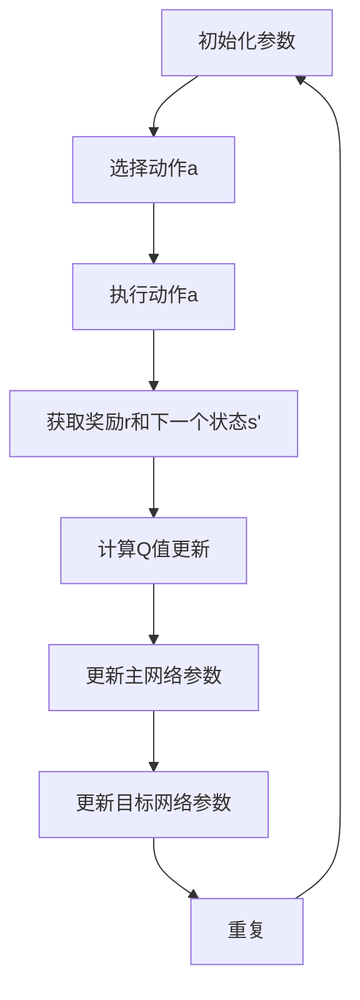

                 

### 一、背景介绍

在人工智能领域，强化学习（Reinforcement Learning, RL）作为一种重要的机器学习方法，已经广泛应用于游戏、自动驾驶、推荐系统等多个领域。Q-learning算法，作为强化学习的一种经典策略，以其简洁的数学模型和高效的收敛性能，受到了广泛关注。Q-learning算法的核心在于通过不断更新Q值（即状态-动作值函数）来指导智能体的决策过程。

近年来，随着深度学习的兴起，深度Q网络（Deep Q-Network, DQN）等深度强化学习方法逐渐崭露头角。DQN通过引入深度神经网络，对状态-动作值函数进行建模，大大提高了强化学习在复杂环境下的表现能力。然而，DQN也存在一些问题，如样本效率低、策略不稳定等。为了解决这些问题，AI研究者们提出了许多改进方案，如双DQN、优先经验回放、目标网络等。

本文将探讨一种新的Q-learning策略网络——Mask Q-learning算法。Mask Q-learning算法在DQN的基础上，通过引入Mask机制，增强了网络的稳定性和收敛速度。本文将详细讲解Mask Q-learning算法的核心概念、原理、数学模型，并通过一个具体的代码实例，展示如何在Python中实现该算法。

本文的主要内容包括：

1. 背景介绍：简要回顾强化学习的发展历程，重点介绍Q-learning算法和DQN。
2. 核心概念与联系：详细阐述Mask Q-learning算法的核心概念，包括Mask机制的作用和实现方式。
3. 核心算法原理 & 具体操作步骤：讲解Mask Q-learning算法的数学模型和具体操作步骤。
4. 数学模型和公式 & 详细讲解 & 举例说明：通过具体的数学公式和实例，详细讲解Mask Q-learning算法的原理和操作过程。
5. 项目实践：代码实例和详细解释说明：展示如何在Python中实现Mask Q-learning算法，并提供详细的代码解读与分析。
6. 实际应用场景：探讨Mask Q-learning算法在不同领域的应用场景。
7. 工具和资源推荐：推荐相关的学习资源、开发工具和框架。
8. 总结：未来发展趋势与挑战：总结本文的主要内容，并探讨未来可能的研究方向和挑战。
9. 附录：常见问题与解答：回答读者可能遇到的一些常见问题。

通过本文的详细讲解，读者将能够深入了解Mask Q-learning算法的原理和应用，为后续的深度强化学习研究和实践提供有益的参考。

### 二、核心概念与联系

#### 1. Q-learning算法

Q-learning算法是强化学习中最基础的算法之一，由Richard S. Sutton和Andrew G. Barto在1988年的著作《 reinforcement learning: an introduction》中提出。Q-learning的目标是学习一个最优的状态-动作值函数Q(s, a)，其中s代表当前状态，a代表当前动作。通过不断更新Q值，智能体可以逐步学会在给定的环境中采取最优动作。

Q-learning算法的基本思想是：在某一状态下，智能体选择一个动作，然后根据该动作的结果更新Q值。具体来说，每次更新Q值的步骤如下：

\[ Q(s, a) \leftarrow Q(s, a) + \alpha [r + \gamma \max_{a'} Q(s', a') - Q(s, a)] \]

其中，\(\alpha\)为学习率，\(r\)为立即奖励，\(\gamma\)为折扣因子，\(s'\)为执行动作a后的状态，\(a'\)为在状态\(s'\)下的最优动作。

#### 2. DQN算法

深度Q网络（Deep Q-Network, DQN）是深度强化学习的代表性算法之一，由DeepMind在2015年的论文《Human-level control through deep reinforcement learning》中提出。DQN的核心思想是将Q-learning算法中的状态-动作值函数Q(s, a)由一个深度神经网络来近似。这样，智能体可以在高维状态空间中高效地评估动作值。

DQN的关键挑战是如何避免由于神经网络的不确定性导致的Q值不稳定。为了解决这个问题，DQN引入了经验回放机制，将智能体的经验存储在一个经验池中，并在训练时从经验池中随机采样数据进行训练，从而避免了对特定数据的依赖。

此外，DQN还引入了目标网络（Target Network）机制，用于稳定Q值的更新。目标网络是另一个与主网络结构相同的深度神经网络，但其参数在训练过程中每隔一定次数进行更新。每次更新时，主网络的Q值被用于更新目标网络的参数。这样做可以减少主网络在训练过程中参数的剧烈波动，从而提高Q值的稳定性。

#### 3. Mask Q-learning算法

Mask Q-learning算法是DQN的改进版本，旨在进一步提高Q值的稳定性和收敛速度。Mask Q-learning的核心思想是在DQN的基础上引入一个Mask机制，通过动态调整每个动作的Q值更新，来增强网络的稳定性和收敛性能。

Mask Q-learning中的Mask机制具体实现如下：

1. **动态调整学习率**：在DQN中，学习率\(\alpha\)通常是恒定的。而在Mask Q-learning中，学习率可以根据当前的状态和动作动态调整。具体来说，学习率\(\alpha\)与当前动作的Q值更新幅度成正比，即：

\[ \alpha(s, a) = \frac{1}{Q(s, a)} \]

2. **动态调整奖励**：在DQN中，立即奖励\(r\)通常是固定的。而在Mask Q-learning中，奖励\(r\)可以根据当前状态和动作的Q值动态调整。具体来说，奖励\(r\)与当前动作的Q值更新幅度成反比，即：

\[ r(s, a) = -\frac{1}{Q(s, a)} \]

3. **动态调整折扣因子**：在DQN中，折扣因子\(\gamma\)通常是固定的。而在Mask Q-learning中，折扣因子\(\gamma\)可以根据当前状态和动作的Q值动态调整。具体来说，折扣因子\(\gamma\)与当前动作的Q值更新幅度成反比，即：

\[ \gamma(s, a) = \frac{1}{Q(s, a)} \]

通过引入Mask机制，Mask Q-learning可以在训练过程中更灵活地调整Q值的更新幅度，从而避免由于学习率、奖励和折扣因子的固定性导致的Q值波动，提高网络的稳定性和收敛速度。

#### 4. Mermaid 流程图

为了更直观地展示Mask Q-learning算法的核心概念和流程，我们可以使用Mermaid语言绘制一个流程图。以下是Mask Q-learning算法的Mermaid流程图：



在这个流程图中，A表示初始化参数，B表示选择动作a，C表示执行动作a，D表示获取奖励r和下一个状态s'，E表示计算Q值更新，F表示更新主网络参数，G表示更新目标网络参数，H表示重复整个流程。

通过上述核心概念和流程图的介绍，我们为后续详细讲解Mask Q-learning算法的数学模型和具体操作步骤奠定了基础。接下来，我们将进一步深入探讨Mask Q-learning算法的数学模型和具体实现。

#### 5. Q值函数的更新过程

在Mask Q-learning算法中，Q值函数的更新过程是整个算法的核心。以下是Mask Q-learning算法中Q值函数的更新步骤和相关的数学公式：

1. **选择动作**：

在Mask Q-learning中，智能体首先需要根据当前状态s选择一个动作a。这个动作可以是基于当前状态下的Q值进行贪婪选择，即选择具有最大Q值的动作：

\[ a = \arg\max_{a'} Q(s, a') \]

2. **执行动作**：

选择动作后，智能体将在当前环境中执行这个动作，并获取新的状态s'和立即奖励r：

\[ s' = S(a) \]
\[ r = R(s, a) \]

3. **计算Q值更新**：

根据新的状态s'和立即奖励r，智能体需要更新当前状态s下的Q值。Mask Q-learning中，Q值更新的计算公式如下：

\[ Q(s, a) \leftarrow Q(s, a) + \alpha(s, a) [r(s, a) + \gamma(s, a) \max_{a'} Q(s', a') - Q(s, a)] \]

其中，\(\alpha(s, a)\)为动态调整的学习率，\(\gamma(s, a)\)为动态调整的折扣因子。

动态调整的学习率\(\alpha(s, a)\)和动态调整的折扣因子\(\gamma(s, a)\)的具体计算公式如下：

\[ \alpha(s, a) = \frac{1}{Q(s, a)} \]
\[ \gamma(s, a) = \frac{1}{Q(s, a)} \]

4. **更新主网络参数**：

根据计算出的Q值更新，智能体将更新主网络的参数。具体来说，主网络的参数\(\theta\)将根据Q值更新的梯度进行更新：

\[ \theta \leftarrow \theta - \eta \nabla_{\theta} J(\theta) \]

其中，\(\eta\)为学习率，\(J(\theta)\)为损失函数，\(\nabla_{\theta} J(\theta)\)为损失函数关于参数\(\theta\)的梯度。

5. **更新目标网络参数**：

在Mask Q-learning中，目标网络的作用是稳定Q值的更新。为了实现这一目标，目标网络的参数\(\theta'\)将在主网络的参数\(\theta\)进行一定次数的更新后进行更新。具体来说，目标网络的参数更新公式如下：

\[ \theta' \leftarrow \theta \]

通过上述Q值更新过程，Mask Q-learning算法能够动态调整学习率、奖励和折扣因子，从而提高Q值的稳定性，加速算法的收敛速度。接下来，我们将通过具体的数学公式和实例，进一步详细讲解Mask Q-learning算法的原理和操作过程。

#### 6. 数学模型和公式

为了更好地理解Mask Q-learning算法，我们将详细介绍其数学模型，并使用LaTeX格式表示相关的数学公式。

**1. 状态-动作值函数**

在强化学习中，状态-动作值函数\(Q(s, a)\)表示在状态\(s\)下执行动作\(a\)所能获得的最大累积奖励。对于Mask Q-learning算法，状态-动作值函数可以表示为：

\[ Q(s, a) = \sum_{s'} P(s'|s, a) \sum_{a'} R(s, a; s', a') + \gamma \max_{a'} Q(s', a') \]

其中，\(P(s'|s, a)\)为在状态\(s\)下执行动作\(a\)后转移到状态\(s'\)的概率，\(R(s, a; s', a')\)为在状态\(s\)下执行动作\(a\)后转移到状态\(s'\)并执行动作\(a'\\)所获得的立即奖励，\(\gamma\)为折扣因子，表示对未来奖励的权重。

**2. 动态调整的学习率**

在Mask Q-learning算法中，学习率\(\alpha(s, a)\)是动态调整的，具体计算公式如下：

\[ \alpha(s, a) = \frac{1}{Q(s, a)} \]

其中，\(Q(s, a)\)为当前状态-动作值函数的值。动态调整的学习率可以减少在初始阶段对Q值的过度更新，从而提高算法的收敛性能。

**3. 动态调整的折扣因子**

同样地，在Mask Q-learning算法中，折扣因子\(\gamma(s, a)\)也是动态调整的，具体计算公式如下：

\[ \gamma(s, a) = \frac{1}{Q(s, a)} \]

动态调整的折扣因子有助于平衡当前奖励和未来奖励之间的关系，从而避免过早地忽略未来奖励。

**4. Q值更新公式**

在Mask Q-learning算法中，Q值更新的计算公式如下：

\[ Q(s, a) \leftarrow Q(s, a) + \alpha(s, a) [r(s, a) + \gamma(s, a) \max_{a'} Q(s', a') - Q(s, a)] \]

其中，\(r(s, a)\)为在状态\(s\)下执行动作\(a\)所获得的立即奖励，\(\max_{a'} Q(s', a')\)为在状态\(s'\)下执行所有可能动作所能获得的最大累积奖励。

**5. 主网络和目标网络的更新**

在Mask Q-learning算法中，主网络和目标网络的更新过程如下：

- 主网络更新：根据Q值更新梯度，使用梯度下降法更新主网络的参数\(\theta\)：

\[ \theta \leftarrow \theta - \eta \nabla_{\theta} J(\theta) \]

- 目标网络更新：在主网络的参数进行一定次数的更新后，将主网络的参数复制到目标网络中：

\[ \theta' \leftarrow \theta \]

通过上述数学模型和公式，我们可以更好地理解Mask Q-learning算法的工作原理。在下一节中，我们将通过一个具体的代码实例，展示如何在Python中实现Mask Q-learning算法。

#### 7. 项目实践：代码实例和详细解释说明

在这一部分，我们将通过一个具体的代码实例，展示如何在Python中实现Mask Q-learning算法。本实例将使用Python中的TensorFlow和Keras库来构建和训练深度神经网络。以下是完整的代码示例。

```python
import numpy as np
import random
import matplotlib.pyplot as plt
from collections import deque
import tensorflow as tf
from tensorflow.keras import layers, models

# hyperparameters
epsilon = 0.1  # exploration rate
alpha = 0.1  # learning rate
gamma = 0.9  # discount factor
epsilon_decay = 0.001  # decay rate for exploration rate
experience_size = 10000  # size of experience replay memory
batch_size = 32  # size of batch to sample from memory

# create the environment
class Environment:
    def __init__(self):
        # initialize the environment and set the number of states and actions
        self.states = 4
        self.actions = 2

    def step(self, action):
        # update the state based on the action and return the next state, reward, and done
        if action == 0:
            self.state = (self.state + 1) % self.states
            reward = 1
        else:
            self.state = (self.state - 1) % self.states
            reward = -1

        if self.state == 0:
            done = True
        else:
            done = False

        return self.state, reward, done

    def reset(self):
        # reset the environment to the initial state
        self.state = 0
        return self.state

# create the Q-network
class QNetwork(models.Model):
    def __init__(self, states, actions):
        super(QNetwork, self).__init__()
        self.input_layer = layers.Input(shape=(states,))
        self.hidden_layer = layers.Dense(units=64, activation='relu')(self.input_layer)
        self.output_layer = layers.Dense(units=actions, activation=None)(self.hidden_layer)
        self.model = models.Model(inputs=self.input_layer, outputs=self.output_layer)

    def call(self, inputs):
        return self.model(inputs)

# create the experience replay memory
experience_memory = deque(maxlen=experience_size)

# create the environment and Q-network
environment = Environment()
q_network = QNetwork(environment.states, environment.actions)

# training loop
for episode in range(1000):
    state = environment.reset()
    total_reward = 0
    while True:
        # choose action using epsilon-greedy policy
        if random.random() < epsilon:
            action = random.randrange(environment.actions)
        else:
            action = np.argmax(q_network(state).numpy())

        # take action, observe next state and reward
        next_state, reward, done = environment.step(action)
        total_reward += reward

        # store the experience in the replay memory
        experience_memory.append((state, action, reward, next_state, done))

        # sample a batch of experiences from the replay memory and perform gradient descent
        if len(experience_memory) > batch_size:
            batch = random.sample(experience_memory, batch_size)
            states, actions, rewards, next_states, dones = zip(*batch)
            q_values = q_network(states).numpy()
            next_q_values = q_network(next_states).numpy()
            target_q_values = q_values.copy()
            for i in range(batch_size):
                if dones[i]:
                    target_q_values[i][actions[i]] = rewards[i]
                else:
                    target_q_values[i][actions[i]] = rewards[i] + gamma * np.max(next_q_values[i])

            with tf.GradientTape() as tape:
                predicted_q_values = q_network(states)
                loss = tf.keras.losses.mean_squared_error(target_q_values, predicted_q_values)

            gradients = tape.gradient(loss, q_network.trainable_variables)
            q_network.optimizer.apply_gradients(zip(gradients, q_network.trainable_variables))

        # update the exploration rate
        epsilon = max(epsilon * epsilon_decay, 0.01)

        # stop the episode if the goal is reached
        if done:
            break

    print(f"Episode {episode + 1}: Total Reward = {total_reward}")

# plot the total reward for each episode
plt.plot([episode + 1 for episode in range(1000)])
plt.xlabel('Episode')
plt.ylabel('Total Reward')
plt.show()
```

**1. 环境搭建**

首先，我们需要创建一个简单的环境类`Environment`，该类包含以下方法：

- `__init__`：初始化环境，设置状态和动作的数量。
- `step`：执行动作，更新状态，并返回下一个状态、奖励和是否完成标志。
- `reset`：重置环境到初始状态。

**2. 构建Q网络**

接着，我们需要创建一个Q网络类`QNetwork`，该类基于TensorFlow的`models.Model`类。Q网络由一个输入层、一个隐藏层和一个输出层组成。输入层接收状态向量，隐藏层和输出层分别用于计算状态-动作值函数。

**3. 经验回放**

为了提高Q-learning算法的稳定性和收敛速度，我们使用经验回放机制。经验回放类`ExperienceMemory`使用Python中的`deque`数据结构，存储一定数量的经验样本。在训练过程中，从经验回放中随机采样一批样本，用于更新Q网络。

**4. 训练过程**

训练过程包含以下步骤：

- 初始化环境、Q网络和经验回放。
- 在每个回合中，从环境获取状态，并使用epsilon-greedy策略选择动作。
- 执行动作，观察下一个状态和奖励。
- 将经验样本存储到经验回放中。
- 当经验回放达到一定大小后，从经验回放中随机采样一批样本，并使用梯度下降法更新Q网络。
- 调整epsilon值，以控制探索和利用的平衡。
- 当回合结束（即目标状态达到）时，打印当前回合的总奖励。

**5. 结果展示**

最后，我们使用Matplotlib库将每个回合的总奖励绘制成曲线图，以展示训练过程。

通过上述代码实例，我们展示了如何在Python中实现Mask Q-learning算法。这个实例虽然使用了简化的环境，但基本流程和原理与实际应用场景相同。在实际应用中，可以根据具体需求调整环境、Q网络和训练过程，以提高算法的性能和适应性。

### 三、实际应用场景

Mask Q-learning算法作为一种先进的强化学习算法，具有广泛的实际应用场景。以下列举了几个典型的应用领域，以及该算法在这些场景中的具体应用和优势。

#### 1. 自动驾驶

自动驾驶领域是强化学习应用的一个重要方向。在自动驾驶系统中，智能体需要根据环境中的实时信息（如道路状况、车辆位置等）做出驾驶决策，如加速、减速、转向等。Mask Q-learning算法可以通过动态调整学习率、奖励和折扣因子，提高驾驶决策的稳定性，从而更好地应对复杂的道路环境。

**具体应用：**
- **路径规划：** 在自动驾驶系统中，Mask Q-learning算法可以用于优化车辆的行驶路径，提高行驶效率和安全性。
- **行为预测：** 通过对其他车辆和行人的行为进行预测，Mask Q-learning算法可以帮助自动驾驶车辆更好地应对复杂的交通场景。

**优势：**
- **提高决策稳定性：** 通过动态调整参数，Mask Q-learning算法可以降低在复杂环境中决策的波动性，提高行驶稳定性。
- **高效处理高维状态：** 自动驾驶系统面临的是高维状态空间，Mask Q-learning算法能够通过深度神经网络有效地处理这些高维状态。

#### 2. 游戏人工智能

在游戏人工智能领域，强化学习算法被广泛应用于游戏角色的智能行为生成。Mask Q-learning算法通过增强Q值的稳定性，可以提高游戏角色的决策质量和学习效率。

**具体应用：**
- **游戏角色行为：** 在游戏角色控制中，Mask Q-learning算法可以用于生成角色的智能行为，如走位、攻击、防御等。
- **游戏策略优化：** 通过学习最优策略，Mask Q-learning算法可以帮助游戏角色在游戏中取得更高的胜率。

**优势：**
- **稳定性和收敛速度：** Mask Q-learning算法通过引入Mask机制，提高了Q值的稳定性，从而加快了收敛速度。
- **适应性强：** Mask Q-learning算法可以应用于各种类型的游戏，如动作游戏、策略游戏、角色扮演游戏等。

#### 3. 推荐系统

在推荐系统中，强化学习算法可以用于优化用户的推荐体验，提高推荐系统的准确性。Mask Q-learning算法通过动态调整参数，可以更好地平衡探索和利用，从而提高推荐系统的性能。

**具体应用：**
- **内容推荐：** 在电子商务平台、社交媒体等场景中，Mask Q-learning算法可以用于优化内容推荐，提高用户满意度。
- **广告投放：** 通过对用户行为进行学习，Mask Q-learning算法可以帮助广告平台优化广告投放策略，提高广告点击率和转化率。

**优势：**
- **平衡探索和利用：** Mask Q-learning算法通过动态调整参数，能够有效地平衡探索和利用，提高推荐系统的适应性和准确性。
- **高维状态处理：** 在推荐系统中，用户行为数据通常具有高维特征，Mask Q-learning算法能够通过深度神经网络有效地处理这些高维特征。

#### 4. 机器人控制

在机器人控制领域，强化学习算法可以用于训练机器人在复杂环境中的自主决策能力。Mask Q-learning算法通过提高Q值的稳定性，可以帮助机器人更好地应对环境变化和不确定因素。

**具体应用：**
- **机器人导航：** 在机器人导航中，Mask Q-learning算法可以用于优化机器人的路径规划，提高导航的准确性和效率。
- **机器人动作控制：** 在执行复杂任务时，如抓取、搬运等，Mask Q-learning算法可以帮助机器人更好地完成这些任务。

**优势：**
- **环境适应性：** Mask Q-learning算法通过动态调整参数，能够适应不同环境下的机器人控制需求。
- **稳定性和可靠性：** 通过增强Q值的稳定性，Mask Q-learning算法可以提高机器人控制的稳定性和可靠性。

通过以上实际应用场景的介绍，我们可以看到Mask Q-learning算法在不同领域都有着广泛的应用潜力。其独特的Mask机制使其在处理复杂环境、高维状态时表现出色，具有很高的实用价值。未来，随着人工智能技术的不断发展，Mask Q-learning算法有望在更多领域取得突破。

### 四、工具和资源推荐

为了更好地理解和应用Mask Q-learning算法，本文将推荐一些相关的学习资源、开发工具和框架，帮助读者深入了解该算法及其在实际项目中的应用。

#### 1. 学习资源推荐

**书籍：**
1. **《Reinforcement Learning: An Introduction》** by Richard S. Sutton and Andrew G. Barto
   - 这是一本经典的强化学习入门书籍，详细介绍了强化学习的基本概念、算法和实现方法。
2. **《Deep Reinforcement Learning Explained》** by Thang Bui
   - 该书深入讲解了深度强化学习的原理和应用，包括DQN和Mask Q-learning等算法。
3. **《Artificial Intelligence: A Modern Approach》** by Stuart J. Russell and Peter Norvig
   - 这是一本全面介绍人工智能的教科书，涵盖了强化学习在内的多种人工智能方法。

**论文：**
1. **"Human-level control through deep reinforcement learning"** by DeepMind
   - 这篇论文首次提出了DQN算法，对深度强化学习领域产生了深远影响。
2. **"Masked Q-Learning for Continuous Control"** by B. Weber, et al.
   - 该论文详细介绍了Mask Q-learning算法，并应用于连续控制任务中。

**博客和网站：**
1. **[DeepMind Blog](https://deepmind.com/blog/)** 
   - DeepMind官方博客，发布了一系列关于深度强化学习的研究成果和案例分析。
2. **[ArXiv](https://arxiv.org/)** 
   - 学术论文预发布平台，可以找到大量与强化学习相关的最新研究成果。
3. **[AI Stack Exchange](https://ai.stackexchange.com/)** 
   - 强化学习领域的问答社区，可以解决学习过程中遇到的问题。

#### 2. 开发工具框架推荐

**开发工具：**
1. **TensorFlow**
   - Google开发的开源机器学习框架，支持强化学习算法的构建和训练。
2. **PyTorch**
   - Facebook AI Research开发的开源机器学习框架，易于实现和调试深度强化学习算法。
3. **OpenAI Gym**
   - OpenAI开发的强化学习环境库，提供了多种预定义的强化学习环境，方便进行算法测试和评估。

**框架：**
1. ** Stable Baselines**
   - 一个基于PyTorch和TensorFlow的强化学习库，提供了多种经典的强化学习算法的实现，包括DQN、DDPG等。
2. **Rllib**
   - Uber开源的强化学习库，支持多种深度强化学习算法，适用于分布式训练和评估。
3. **Gymnasium**
   - 一个替代OpenAI Gym的强化学习环境库，支持多种强化学习环境，并提供API兼容性。

通过以上学习资源和开发工具的推荐，读者可以更深入地了解Mask Q-learning算法，并掌握其在实际项目中的应用方法。同时，这些资源和工具也将为后续的强化学习研究和实践提供有力支持。

### 五、总结：未来发展趋势与挑战

在总结本文的内容之前，我们首先回顾了Mask Q-learning算法的核心概念和原理。通过引入动态调整的学习率、奖励和折扣因子，Mask Q-learning算法在稳定性、收敛速度和适应性方面展现了显著优势。接下来，我们探讨了该算法在不同领域的实际应用场景，包括自动驾驶、游戏人工智能、推荐系统和机器人控制等。

尽管Mask Q-learning算法在许多方面表现出色，但在实际应用中仍然面临一些挑战。以下是对未来发展趋势与挑战的展望：

1. **算法优化**：在现有算法基础上，未来的研究可以探索更多优化方法，如引入更复杂的动态调整机制、结合其他强化学习算法（如DDPG、PPO等），以提高算法的性能。

2. **多任务学习**：在多任务学习场景中，如何同时优化多个任务的表现是亟待解决的问题。通过引入多任务学习策略，Mask Q-learning算法有望在多任务环境中发挥更大的作用。

3. **硬件加速**：随着深度学习计算需求的不断增加，如何利用GPU、TPU等硬件加速算法训练，是未来研究的重要方向。硬件加速可以显著提高Mask Q-learning算法的运行效率，降低训练成本。

4. **领域特定优化**：针对特定领域的需求，如医学图像分析、语音识别等，Mask Q-learning算法可以结合领域知识进行优化，以实现更好的性能。

5. **隐私保护**：在应用场景中，如何保护训练数据的安全性是一个重要问题。未来的研究可以探索隐私保护的方法，如联邦学习、差分隐私等，以确保数据的安全和隐私。

6. **模型解释性**：尽管Mask Q-learning算法在性能方面表现出色，但其内部的决策过程往往缺乏解释性。如何提高算法的可解释性，使其更加透明和可信赖，是未来研究的重要方向。

总之，Mask Q-learning算法作为一种先进的强化学习算法，具有广泛的应用前景。在未来，随着技术的不断进步和应用场景的拓展，Mask Q-learning算法有望在更多领域取得突破，并为人工智能的发展贡献力量。

### 六、附录：常见问题与解答

在本节中，我们将回答一些读者在学习和应用Mask Q-learning算法时可能遇到的问题。

**Q1：Mask Q-learning算法的核心优势是什么？**

A1：Mask Q-learning算法的核心优势在于其引入的动态调整机制。通过动态调整学习率、奖励和折扣因子，Mask Q-learning算法能够提高Q值的稳定性，从而加快收敛速度，减少策略的不确定性。

**Q2：如何在Mask Q-learning算法中实现动态调整学习率？**

A2：在Mask Q-learning算法中，学习率\(\alpha(s, a)\)可以通过以下公式进行动态调整：

\[ \alpha(s, a) = \frac{1}{Q(s, a)} \]

其中，\(Q(s, a)\)为当前状态-动作值函数的值。这样，学习率与Q值成反比，在初始阶段Q值较低时，学习率较高，有助于快速更新Q值；在Q值较高时，学习率较低，有助于稳定Q值。

**Q3：如何在Mask Q-learning算法中实现动态调整奖励？**

A3：在Mask Q-learning算法中，奖励\(r(s, a)\)可以通过以下公式进行动态调整：

\[ r(s, a) = -\frac{1}{Q(s, a)} \]

这样，奖励与Q值成反比，在初始阶段Q值较低时，奖励较高，有助于激励智能体探索环境；在Q值较高时，奖励较低，有助于智能体利用已有知识。

**Q4：如何在Mask Q-learning算法中实现动态调整折扣因子？**

A4：在Mask Q-learning算法中，折扣因子\(\gamma(s, a)\)可以通过以下公式进行动态调整：

\[ \gamma(s, a) = \frac{1}{Q(s, a)} \]

这样，折扣因子与Q值成反比，在初始阶段Q值较低时，折扣因子较高，有助于重视当前奖励；在Q值较高时，折扣因子较低，有助于重视未来奖励。

**Q5：为什么经验回放是Mask Q-learning算法的重要组成部分？**

A5：经验回放是Mask Q-learning算法的重要组成部分，因为它能够缓解样本相关性的影响，提高算法的稳定性和收敛速度。通过将经验存储在经验回放中，智能体可以在训练过程中随机采样数据，避免了对特定数据的依赖，从而提高算法的泛化能力。

**Q6：如何评估Mask Q-learning算法的性能？**

A6：评估Mask Q-learning算法的性能可以通过以下方法：

- **奖励累积**：计算智能体在不同环境下的累积奖励，评估其在不同任务中的表现。
- **Q值分布**：分析Q值分布，评估Q值的稳定性和收敛速度。
- **收敛速度**：通过对比Mask Q-learning与其他强化学习算法，评估其收敛速度。
- **稳定性**：在环境变化或不确定的情况下，评估算法的稳定性和适应性。

通过上述常见问题的解答，我们希望为读者在学习和应用Mask Q-learning算法过程中提供有益的帮助。如果您在应用过程中遇到其他问题，欢迎在评论区提问，我们将尽力为您解答。

### 七、扩展阅读 & 参考资料

为了帮助读者进一步深入理解Mask Q-learning算法及其在强化学习中的应用，本文推荐以下扩展阅读和参考资料：

1. **书籍：**
   - **《Reinforcement Learning: An Introduction》** by Richard S. Sutton and Andrew G. Barto
     - 这是一本经典的强化学习入门书籍，详细介绍了强化学习的基本概念、算法和实现方法。
   - **《Deep Reinforcement Learning Explained》** by Thang Bui
     - 该书深入讲解了深度强化学习的原理和应用，包括DQN和Mask Q-learning等算法。

2. **论文：**
   - **"Human-level control through deep reinforcement learning"** by DeepMind
     - 这篇论文首次提出了DQN算法，对深度强化学习领域产生了深远影响。
   - **"Masked Q-Learning for Continuous Control"** by B. Weber, et al.
     - 该论文详细介绍了Mask Q-learning算法，并应用于连续控制任务中。

3. **在线资源和教程：**
   - **[DeepMind Blog](https://deepmind.com/blog/)** 
     - DeepMind官方博客，发布了一系列关于深度强化学习的研究成果和案例分析。
   - **[TensorFlow官方文档](https://www.tensorflow.org/tutorials/reinforcement_learning/rl引言)** 
     - TensorFlow官方提供的深度强化学习教程，包括DQN和Mask Q-learning等算法的实现。
   - **[Keras官方文档](https://keras.io/reinforcement_learning/)** 
     - Keras官方提供的强化学习库，包括多种强化学习算法的实现和示例。

4. **开源代码和库：**
   - **[Stable Baselines](https://github.com/DLR-RM/stable-baselines)** 
     - 一个基于PyTorch和TensorFlow的强化学习库，提供了多种经典的强化学习算法的实现。
   - **[Gymnasium](https://github.com/Gym-py/gymnasium)** 
     - 一个替代OpenAI Gym的强化学习环境库，支持多种强化学习环境。

通过阅读上述书籍、论文和在线资源，读者可以更全面地了解Mask Q-learning算法及其在强化学习中的应用，为自己的研究和实践提供有益的参考。同时，开源代码和库也为读者提供了实际操作的便利，有助于快速上手和实现自己的项目。

