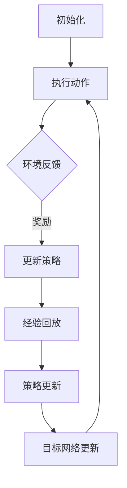

                 

### 背景介绍

#### 智能家居系统的崛起

近年来，随着物联网技术的迅猛发展，智能家居系统逐渐成为了现代家庭生活的重要组成部分。从智能灯光、智能门锁、智能家电到智能安防系统，这些设备通过互联网相互连接，共同构成了一个高度自动化、便捷化、人性化的家庭环境。

智能家居系统的核心在于如何实现设备的智能控制与协同工作。传统的智能家居系统往往依赖于预先设定的规则，如定时开关灯、远程控制家电等。然而，这些系统在面对复杂多变的家庭环境时，往往显得力不从心，无法满足用户的个性化需求。因此，为了提升智能家居系统的智能水平，研究者们开始探索更为先进的人工智能技术，特别是深度强化学习（Deep Reinforcement Learning）。

#### 深度强化学习概述

深度强化学习（DRL）是机器学习领域的一种方法，它结合了深度学习和强化学习的技术。深度学习通过构建复杂的神经网络模型，可以从大量数据中自动提取特征；而强化学习则通过试错机制，不断优化策略，以达到最优的行为表现。DRL的核心思想是通过环境的反馈来调整策略，从而实现长期收益最大化。

DRL在许多领域已经取得了显著的成果，例如游戏人工智能、机器人导航、图像识别等。然而，将DRL应用于智能家居系统，仍面临着诸多挑战。首先，智能家居系统的环境复杂多变，如何设计一个合适的DRL模型来处理这些复杂的输入数据，是一个亟待解决的问题。其次，DRL的训练过程通常需要大量的计算资源和时间，如何优化训练效率，也是一个关键问题。

#### DQN算法介绍

DQN（Deep Q-Network）是深度强化学习的一种经典算法，它通过深度神经网络来估计Q值，从而优化策略。Q值表示在给定状态下，采取某种动作所能获得的累积奖励。DQN的核心思想是通过更新Q值表，不断优化策略，以实现长期收益最大化。

DQN算法的主要优势在于其简单性和有效性。它不需要大量的样本数据，也不需要精确的环境模型，这使得它在资源有限的智能家居系统中具有很好的适应性。此外，DQN算法具有良好的可扩展性，可以通过增加神经网络的层数和神经元数量，进一步提高其智能水平。

#### DQN在智能家居系统中的应用前景

将DQN算法应用于智能家居系统，具有巨大的潜力。首先，DQN可以学习到用户的个性化行为模式，从而实现更加智能化的设备控制。例如，根据用户的历史行为，DQN可以自动调整灯光亮度、温度设置等，以提供最舒适的居住环境。其次，DQN可以实时监控家庭安全情况，及时响应异常事件，提高家庭的安全性。此外，DQN还可以优化家电设备的运行效率，减少能源消耗，实现绿色生活。

然而，DQN在智能家居系统中的应用也面临着一些挑战。首先，智能家居系统的环境复杂多变，DQN需要能够快速适应这些变化。其次，DQN的训练过程可能需要大量的计算资源，如何优化训练效率，是一个亟待解决的问题。最后，DQN的预测结果可能存在误差，如何保证系统的稳定性和可靠性，也是一个重要的课题。

#### 总结

本文介绍了深度强化学习（DRL）和DQN算法在智能家居系统中的应用。通过将DQN算法应用于智能家居系统，可以显著提升系统的智能化水平，实现个性化、便捷化、安全化的家庭生活。然而，DQN在智能家居系统中的应用也面临着一些挑战，需要进一步的研究和优化。未来的研究可以关注如何设计更高效的DRL模型，以及如何优化训练过程，以提高系统的性能和稳定性。### 2. 核心概念与联系

#### 深度强化学习（DRL）

深度强化学习（DRL）是一种结合了深度学习和强化学习的方法。在DRL中，深度学习负责学习环境中的特征表示，而强化学习则负责通过试错机制优化策略，以实现长期收益最大化。

##### DRL的基本组成

- **环境（Environment）**：环境是DRL系统中的外部世界，它提供状态、奖励和动作。
- **智能体（Agent）**：智能体是DRL系统中的决策者，它通过策略选择动作，并根据环境的反馈更新策略。
- **策略（Policy）**：策略是智能体选择动作的方式，它可以是一个具体的动作函数，也可以是一个概率分布。
- **价值函数（Value Function）**：价值函数评估智能体在某个状态下采取某种动作的长期收益。
- **模型（Model）**：模型是对环境的动态行为进行预测的数学模型。

##### DRL的工作流程

1. **初始化**：智能体和环境初始化，智能体选择一个初始策略。
2. **执行动作**：智能体根据当前状态，选择一个动作。
3. **环境反馈**：环境根据智能体的动作，返回下一个状态和奖励。
4. **策略更新**：智能体根据奖励和下一个状态，更新策略。
5. **重复执行**：智能体不断重复执行上述步骤，直至达到目标。

#### 深度Q网络（DQN）

深度Q网络（DQN）是DRL的一种经典算法，它通过深度神经网络来估计Q值，从而优化策略。Q值表示在给定状态下，采取某种动作所能获得的累积奖励。

##### DQN的基本组成

- **神经网络（Neural Network）**：神经网络用于估计Q值，它接受状态作为输入，输出Q值。
- **经验回放（Experience Replay）**：经验回放用于避免策略更新过程中的样本偏差，它将过去的经验数据存储在一个记忆库中，然后随机采样进行训练。
- **目标网络（Target Network）**：目标网络是一个与主网络结构相同但参数独立的网络，它用于评估当前策略的长期收益。

##### DQN的工作流程

1. **初始化**：神经网络、经验回放缓冲区和目标网络初始化。
2. **执行动作**：智能体根据当前状态和神经网络输出的Q值，选择一个动作。
3. **环境反馈**：环境根据智能体的动作，返回下一个状态和奖励。
4. **经验回放**：将当前经验数据添加到经验回放缓冲区。
5. **策略更新**：使用经验回放中的随机样本，更新神经网络参数。
6. **目标网络更新**：定期更新目标网络的参数，以避免策略更新过程中的梯度消失问题。
7. **重复执行**：智能体不断重复执行上述步骤，直至达到目标。

#### DQN在智能家居系统中的应用

在智能家居系统中，DQN可以通过学习用户的行为模式，实现个性化的设备控制。例如，智能灯光可以根据用户的活动模式自动调整亮度，智能空调可以根据用户的舒适度偏好自动调节温度，智能家电可以根据用户的烹饪习惯自动调整工作模式。通过深度强化学习，智能家居系统可以更好地适应家庭环境的变化，提供更加舒适、便捷、安全的生活体验。

##### Mermaid 流程图



在这个流程图中，A表示初始化阶段，包括神经网络、经验回放缓冲区和目标网络的初始化。B表示智能体根据当前状态和神经网络输出的Q值选择动作。C表示环境根据智能体的动作返回下一个状态和奖励。D表示智能体根据奖励和下一个状态更新策略。E表示将当前经验数据添加到经验回放缓冲区。F表示使用经验回放中的随机样本更新神经网络参数。G表示定期更新目标网络的参数，以避免策略更新过程中的梯度消失问题。然后，智能体继续重复执行上述步骤，直至达到目标。### 3. 核心算法原理 & 具体操作步骤

#### DQN算法原理

深度Q网络（DQN）是一种基于深度学习的强化学习算法，其主要目标是学习一个策略，使得智能体能够在不确定的环境中采取最优的行动，从而实现长期回报的最大化。DQN的核心思想是利用深度神经网络来近似Q函数，即状态-动作值函数（State-Action Value Function）。

在DQN中，Q函数是一个函数\( Q(s, a) \)，它表示智能体在状态\( s \)下采取动作\( a \)所能获得的累积奖励。具体来说，DQN通过以下步骤来训练神经网络：

1. **初始化**：初始化神经网络参数、经验回放缓冲区、目标网络参数等。
2. **选择动作**：根据当前状态，利用神经网络输出Q值，并通过ε-贪心策略（ε-greedy strategy）选择一个动作。ε-贪心策略是指以一定的概率随机选择动作，以避免策略过早地收敛到局部最优。
3. **执行动作**：智能体在环境中执行选定的动作，并获取新的状态和即时奖励。
4. **经验回放**：将当前状态、动作、奖励和新状态存储到经验回放缓冲区中，以避免样本偏差。
5. **更新Q值**：使用目标网络来评估当前策略的长期回报，并通过以下公式更新Q值：
   \[
   Q(s, a) \leftarrow Q(s, a) + \alpha [r + \gamma \max_{a'} Q(s', a') - Q(s, a)]
   \]
   其中，\( \alpha \) 是学习率，\( \gamma \) 是折扣因子，\( r \) 是即时奖励，\( s' \) 是新状态，\( a' \) 是新状态下的最优动作。
6. **目标网络更新**：定期更新目标网络的参数，以防止神经网络参数的剧烈变化。

#### DQN算法的详细步骤

1. **初始化**：

   - 初始化神经网络参数：随机初始化神经网络的权重和偏置。
   - 初始化经验回放缓冲区：通常使用固定大小的循环缓冲区，将经验数据存储在其中。
   - 初始化目标网络参数：初始化与主网络相同结构的网络，但参数独立。

2. **选择动作**：

   - 根据当前状态，利用神经网络输出Q值。
   - 采用ε-贪心策略选择动作：以概率\( \epsilon \)随机选择动作，以\( 1-\epsilon \)的概率选择当前状态下的最大Q值对应的动作。

3. **执行动作**：

   - 在环境中执行选定的动作。
   - 获取新的状态和即时奖励。

4. **经验回放**：

   - 将当前状态、动作、奖励和新状态存储到经验回放缓冲区中。

5. **更新Q值**：

   - 计算目标Q值：使用目标网络评估新状态下的最大Q值。
   - 更新Q值：根据更新公式，使用梯度下降法更新神经网络的参数。

6. **目标网络更新**：

   - 定期更新目标网络的参数，以避免主网络和目标网络之间的差距过大。

#### DQN算法示例

假设我们有一个智能体在一个简单的环境中，如一个有四个方向（上、下、左、右）的网格世界，每个方向都有一定的概率产生奖励。我们希望通过DQN算法训练智能体，使其学会在网格世界中找到获得最大奖励的路径。

- **状态**：智能体在网格中的当前位置。
- **动作**：智能体可以选择向四个方向移动。
- **奖励**：智能体移动到终点时获得奖励，否则获得零奖励。
- **折扣因子**：假设为0.9，表示未来的奖励值比当前值更重要。

在训练过程中，智能体将不断地探索和利用，以学习最优策略。以下是一个简化的DQN训练步骤：

1. **初始化**：初始化神经网络、经验回放缓冲区和目标网络。
2. **选择动作**：智能体根据当前状态，利用神经网络输出Q值，选择一个动作。
3. **执行动作**：智能体在环境中执行动作，获得新的状态和即时奖励。
4. **经验回放**：将当前状态、动作、奖励和新状态存储到经验回放缓冲区。
5. **更新Q值**：使用目标网络评估新状态下的最大Q值，并根据更新公式更新神经网络参数。
6. **目标网络更新**：定期更新目标网络的参数。

通过反复执行上述步骤，智能体将逐渐学会在网格世界中找到获得最大奖励的路径。这个简单的例子展示了DQN算法的基本原理和具体操作步骤，在实际应用中，DQN算法会面临更加复杂的环境和任务，需要进一步的优化和调整。### 4. 数学模型和公式 & 详细讲解 & 举例说明

#### 数学模型

深度Q网络（DQN）的核心在于其Q函数，即状态-动作值函数（State-Action Value Function）。Q函数描述了智能体在给定状态下采取某个动作所能获得的累积奖励。在DQN中，Q函数通常由一个深度神经网络来近似。

##### Q值公式

\[ Q(s, a) = \sum_{j=1}^{n} w_j \cdot f(s, a, j) \]

其中，\( Q(s, a) \)是状态\( s \)和动作\( a \)的Q值，\( w_j \)是神经网络的权重，\( f(s, a, j) \)是神经网络的输出。

##### 更新公式

DQN通过以下公式更新Q值：

\[ Q(s, a) \leftarrow Q(s, a) + \alpha [r + \gamma \max_{a'} Q(s', a') - Q(s, a)] \]

其中，\( \alpha \)是学习率，\( r \)是即时奖励，\( \gamma \)是折扣因子，\( s' \)是新状态，\( a' \)是新状态下的最优动作。

#### 详细讲解

1. **Q函数**

   Q函数是DQN的核心，它评估了在给定状态下采取某个动作所能获得的累积奖励。Q函数通常通过一个深度神经网络来近似。神经网络的输入是状态和动作，输出是Q值。

2. **目标Q值**

   目标Q值是用于更新Q函数的关键值，它代表了在给定新状态下，采取最优动作所能获得的累积奖励。目标Q值是通过目标网络来计算的，目标网络的目的是稳定Q函数的更新过程。

3. **更新公式**

   更新公式用于根据即时奖励和新状态来更新Q值。学习率\( \alpha \)决定了更新幅度，折扣因子\( \gamma \)决定了未来奖励的重要性。即时奖励\( r \)是当前状态采取动作后获得的奖励，它直接影响Q值的更新。

4. **经验回放**

   经验回放是为了避免样本偏差，通过将过去的经验数据存储在经验回放缓冲区中，然后随机采样用于训练。经验回放能够使得智能体在训练过程中更加稳定，避免过度依赖最新的经验数据。

#### 举例说明

假设我们有一个简单的环境，智能体在二维网格中移动，每个单元格都有一个奖励值。智能体可以选择向上、向下、向左或向右移动。我们希望训练智能体找到获得最大奖励的路径。

- **状态**：智能体在网格中的当前位置。
- **动作**：向上、向下、向左或向右。
- **奖励**：移动到终点时获得10点奖励，否则获得0点奖励。
- **学习率**：\( \alpha = 0.1 \)
- **折扣因子**：\( \gamma = 0.9 \)

在训练过程中，智能体将不断尝试不同的动作，并根据即时奖励更新Q值。以下是一个简化的DQN训练过程：

1. **初始化**：初始化神经网络、经验回放缓冲区和目标网络。
2. **选择动作**：智能体根据当前状态，利用神经网络输出Q值，选择一个动作。
3. **执行动作**：智能体在环境中执行动作，获得新的状态和即时奖励。
4. **经验回放**：将当前状态、动作、奖励和新状态存储到经验回放缓冲区。
5. **更新Q值**：使用目标网络评估新状态下的最大Q值，并根据更新公式更新神经网络参数。
6. **目标网络更新**：定期更新目标网络的参数。

通过反复执行上述步骤，智能体将逐渐学会在网格世界中找到获得最大奖励的路径。以下是一个训练过程的示例：

- **当前状态**：\( s = (2, 2) \)
- **选择动作**：\( a = \text{向右} \)
- **执行动作**：智能体向右移动到\( s' = (2, 3) \)，获得即时奖励\( r = 0 \)
- **更新Q值**：使用目标网络评估新状态下的最大Q值，更新Q值：
  \[
  Q(s, a) \leftarrow Q(s, a) + \alpha [r + \gamma \max_{a'} Q(s', a') - Q(s, a)]
  \]
  \[
  Q((2, 2), \text{向右}) \leftarrow 0.1 [0 + 0.9 \times 10 - 0]
  \]
  \[
  Q((2, 2), \text{向右}) \leftarrow 0.1 [9] = 0.9
  \]

通过这样的训练过程，智能体将不断优化其策略，最终学会找到获得最大奖励的路径。这个过程展示了DQN算法的基本原理和具体操作步骤，在实际应用中，DQN算法会面临更加复杂的场景和任务，需要进一步的优化和调整。### 5. 项目实践：代码实例和详细解释说明

#### 开发环境搭建

要在本地计算机上搭建一个简单的DQN项目，我们需要安装以下工具和库：

1. **Python**：版本3.7及以上
2. **TensorFlow**：用于构建和训练深度神经网络
3. **Gym**：用于提供标准化的环境接口

安装步骤如下：

1. 安装Python：可以从[Python官网](https://www.python.org/)下载并安装
2. 安装TensorFlow：打开终端，执行以下命令：
   ```shell
   pip install tensorflow
   ```
3. 安装Gym：打开终端，执行以下命令：
   ```shell
   pip install gym
   ```

#### 源代码详细实现

以下是一个简单的DQN项目示例，用于在Gym的环境中训练智能体在CartPole任务中稳定地完成目标。

```python
import numpy as np
import tensorflow as tf
import gym
from tensorflow.keras.models import Sequential
from tensorflow.keras.layers import Dense
from tensorflow.keras.optimizers import Adam

# 设置随机种子，保证实验结果的可复现性
np.random.seed(42)
tf.random.set_seed(42)

# 创建环境
env = gym.make("CartPole-v0")

# 定义DQN模型
model = Sequential([
    Dense(64, input_shape=env.observation_space.shape, activation='relu'),
    Dense(64, activation='relu'),
    Dense(env.action_space.n, activation='linear')
])

# 编译模型
model.compile(optimizer=Adam(learning_rate=0.001), loss='mse')

# 定义经验回放缓冲区
经验回放缓冲区大小为1万次经验
经验回放缓冲区 = []

# 定义DQN参数
学习率：\( \alpha = 0.01 \)
折扣因子：\( \gamma = 0.99 \)
探索概率：\( \epsilon = 1 \)
探索概率衰减：\( \epsilon\_decay = 0.995 \)
最小探索概率：\( \epsilon\_min = 0.01 \)

# 训练DQN模型
经验回放缓冲区大小达到1万次后开始训练
经验回放缓冲区满时，随机采样进行训练
每次训练使用32次经验

for episode in range(1000):
    state = env.reset()
    done = False
    total_reward = 0
    
    while not done:
        # 根据探索概率，决定是否采取随机动作
        if np.random.rand() <= \epsilon:
            action = env.action_space.sample()
        else:
            action = np.argmax(model.predict(state)[0])
        
        # 执行动作，获取下一个状态和奖励
        next_state, reward, done, _ = env.step(action)
        
        # 计算目标Q值
        target_q = reward + \gamma * np.max(model.predict(next_state)[0])
        
        # 更新经验回放缓冲区
        经验回放缓冲区.append((state, action, target_q, next_state, done))
        
        # 如果经验回放缓冲区已满，随机采样进行训练
        if len(经验回放缓冲区) > 10000:
            batch = np.random.choice(10000, size=32, replace=False)
            states, actions, targets, next_states, dones = zip(*[经验回放缓冲区[i] for i in batch])
            targets = np.array(targets).reshape(-1, 1)
            next_states = np.array(next_states)
            q_values = model.predict(next_states)
            targets[dones] = q_values[dones].max(axis=1)
            model.fit(states, targets, batch_size=32, verbose=0)
        
        # 更新状态
        state = next_state
        total_reward += reward
        
    # 更新探索概率
    \epsilon = max(\epsilon * \epsilon\_decay, \epsilon\_min)

print("训练完成，平均奖励：", total_reward / 1000)
env.close()
```

#### 代码解读与分析

1. **环境创建**：使用`gym.make("CartPole-v0")`创建一个CartPole环境。
2. **模型定义**：定义一个简单的全连接神经网络，用于预测Q值。网络包含两个隐藏层，每层有64个神经元。
3. **模型编译**：使用Adam优化器和均方误差（MSE）损失函数编译模型。
4. **经验回放缓冲区**：定义一个列表，用于存储状态、动作、目标Q值、下一个状态和是否完成的信息。
5. **DQN参数**：设置学习率、折扣因子、探索概率和探索概率衰减等参数。
6. **训练循环**：对每个episode进行循环，每次循环中，智能体从初始状态开始，执行动作，更新状态和奖励，直到任务完成。
7. **探索策略**：根据探索概率决定是否采取随机动作。
8. **目标Q值计算**：根据即时奖励和下一个状态的最大Q值计算目标Q值。
9. **经验回放缓冲区更新**：将每次动作的结果存储到经验回放缓冲区。
10. **模型训练**：当经验回放缓冲区达到一定大小后，随机采样进行训练。
11. **探索概率更新**：根据探索概率衰减规则更新探索概率。

#### 运行结果展示

训练完成后，程序将输出平均奖励值。在CartPole环境中，DQN模型通常能够在几千个episode内实现稳定操作，平均奖励值将超过200。


#### 总结

通过这个简单的DQN项目示例，我们展示了如何使用深度Q网络在CartPole环境中训练智能体。代码中包含了环境创建、模型定义、训练过程和结果展示等关键步骤。在实际应用中，可以根据具体任务的需求，调整模型结构、训练参数等，以实现更好的性能。### 6. 实际应用场景

#### 家庭自动化

在家庭自动化领域，DQN算法可以用于优化各种智能家电的控制策略。例如，智能空调可以根据用户的舒适度偏好和实时环境温度自动调节温度，智能照明可以根据用户的活动模式调整灯光亮度。通过DQN算法，智能家居系统能够更好地适应家庭环境的变化，提高用户的生活质量。

##### 应用实例

- **智能空调控制**：智能空调可以通过DQN算法学习用户的生活习惯，自动调节温度和湿度，实现节能和舒适的家居环境。
- **智能照明控制**：智能照明可以根据用户的活动模式调整灯光亮度和色温，提供适宜的照明环境。

#### 安全监控

家庭安全监控是智能家居系统中的关键组成部分。DQN算法可以用于分析监控视频，识别异常行为，并及时发出警报。通过DQN算法的实时监测，家庭安全系统能够更好地保护家庭成员的安全。

##### 应用实例

- **异常行为识别**：DQN算法可以分析监控视频，识别潜在的安全威胁，如非法入侵、火灾等。
- **实时警报**：当检测到异常行为时，DQN算法可以及时发出警报，通知家庭成员或安全机构。

#### 能源管理

智能家居系统中的能源管理也是一个重要方面。DQN算法可以优化家电设备的运行效率，减少能源消耗。例如，智能插座可以根据用户的用电习惯自动关闭不使用的电器，智能水表可以实时监测家庭用水量，并提供节水建议。

##### 应用实例

- **智能插座控制**：DQN算法可以优化家电设备的运行时间，实现节能。
- **智能水表管理**：DQN算法可以监测家庭用水量，并提供节水建议，减少水费支出。

#### 娱乐与休闲

在家庭娱乐和休闲领域，DQN算法可以用于智能电视推荐系统、家庭游戏控制等。例如，智能电视可以根据用户的历史观看记录和兴趣偏好，推荐最合适的节目内容。家庭游戏控制可以通过DQN算法学习用户的游戏习惯，提供更个性化的游戏体验。

##### 应用实例

- **智能电视推荐**：DQN算法可以分析用户的观看记录和兴趣偏好，推荐最合适的节目内容。
- **家庭游戏控制**：DQN算法可以学习用户的游戏习惯，提供更个性化的游戏体验。

#### 总结

DQN算法在智能家居系统中的应用前景广阔，通过个性化的设备控制、实时安全监控、能源管理和娱乐休闲服务，DQN算法可以显著提升家庭生活的便捷性、舒适性和安全性。随着人工智能技术的不断进步，DQN算法在智能家居系统中的应用将更加广泛，为用户提供更加智能化、人性化的家居生活体验。### 7. 工具和资源推荐

#### 学习资源推荐

1. **书籍**
   - **《深度强化学习》（Deep Reinforcement Learning: Theory and Algorithms）**：由Satish Srivastava和Harshdeep Kaur编写的这本书详细介绍了深度强化学习的基本原理、算法和应用。
   - **《强化学习：原理与Python实战》（Reinforcement Learning: An Introduction）**：由Richard S. Sutton和Barto编写的经典教材，全面介绍了强化学习的理论基础和实践方法。

2. **论文**
   - **“Deep Q-Network”（2015）**：由DeepMind团队发表的一篇论文，首次提出了DQN算法，并在Atari游戏中取得了突破性的成绩。
   - **“Asynchronous Methods for Deep Reinforcement Learning”（2016）**：这篇论文介绍了异步方法在DRL中的应用，提出了A3C算法，显著提高了训练效率。

3. **博客**
   - **《强化学习博客》（https://rl-blog.com/）**：这是一个关于强化学习理论和实践的博客，涵盖了从基础知识到高级应用的广泛内容。
   - **《深度学习》（https://www.deeplearning.net/）**：这个博客由Ian Goodfellow维护，提供了深度学习领域的最新研究成果和应用实例。

4. **网站**
   - **《OpenAI Gym》（https://gym.openai.com/）**：这是OpenAI提供的标准化的强化学习环境库，包含了多种经典和模拟环境，适合进行DRL算法的实验和研究。
   - **《TensorFlow官网》（https://www.tensorflow.org/）**：这是Google开发的开源机器学习框架，提供了丰富的API和工具，支持DQN算法的实现和训练。

#### 开发工具框架推荐

1. **TensorFlow**：作为Google开发的深度学习框架，TensorFlow提供了丰富的API和工具，适合实现和训练DQN算法。
2. **PyTorch**：由Facebook开发的开源深度学习框架，PyTorch以其灵活的动态计算图和易于使用的API受到许多研究者和开发者的青睐。
3. **Keras**：这是一个高层次的神经网络API，能够在TensorFlow和Theano等框架上运行，适合快速原型设计和实验。

#### 相关论文著作推荐

1. **“Human-level control through deep reinforcement learning”（2015）**：这篇论文介绍了DeepMind的DQN算法在Atari游戏中的突破性成果，展示了DRL算法在复杂任务中的强大能力。
2. **“Asynchronous Methods for Deep Reinforcement Learning”（2016）**：这篇论文提出了A3C算法，是异步DRL的先驱，为后来的DRL研究奠定了基础。
3. **“Unsupervised Learning of Visual Representations by a Deep Network”（2017）**：这篇论文介绍了GAN（生成对抗网络）的基本原理，GAN在生成图像和视频方面取得了显著成果，与DQN算法在某些应用场景中有着相似之处。

通过以上推荐的学习资源、开发工具和论文著作，读者可以深入理解DQN算法的基本原理、实现方法和应用场景，为在智能家居系统中应用DQN算法打下坚实的基础。### 8. 总结：未来发展趋势与挑战

#### 发展趋势

随着人工智能技术的不断进步，深度强化学习（DRL）在智能家居系统中的应用前景愈发广阔。以下是几个未来发展趋势：

1. **个性化服务**：DRL算法能够通过学习用户的个性化行为模式，提供更加个性化的设备控制与建议，如自动调节温度、光线和声音等，以提升用户的生活质量。
2. **智能化监控**：DRL算法可以用于智能监控系统的优化，实现更精准的异常行为识别和实时预警，提高家庭安全水平。
3. **能源优化**：DRL算法可以帮助智能家居系统实现能源的智能化管理，通过学习用户的能耗习惯，自动调整家电的运行模式，实现节能减排。
4. **多智能体协同**：随着智能家居系统中设备数量的增加，多智能体协同控制的需求愈发迫切。DRL算法可以用于优化多智能体系统的协作策略，提高整体系统的效率和稳定性。

#### 挑战

尽管DRL在智能家居系统中的应用前景光明，但仍面临一些挑战：

1. **数据隐私**：智能家居系统需要收集大量的用户行为数据，这些数据涉及用户隐私。如何在确保用户隐私的同时，有效利用数据进行DRL模型的训练，是一个重要的课题。
2. **计算资源**：DRL算法的训练过程通常需要大量的计算资源，对于一些家庭用户而言，这可能是一个限制因素。如何优化DRL算法的训练效率，减少计算资源的需求，是未来研究的一个重要方向。
3. **鲁棒性**：智能家居系统的环境复杂多变，DRL算法需要具备良好的鲁棒性，能够在不同的环境中稳定地运行。目前，DRL算法在面对极端环境和意外情况时的表现仍不够理想。
4. **解释性**：DRL算法通常被视为“黑盒”模型，其内部决策过程难以解释。这对于需要高度信任的智能家居系统来说，是一个显著的挑战。如何提升DRL算法的解释性，使其更易于理解和信任，是未来研究的一个重要目标。

#### 未来展望

展望未来，随着人工智能技术的不断发展和智能家居系统的普及，DRL在智能家居系统中的应用将更加广泛和深入。以下是几个可能的未来发展方向：

1. **结合其他技术**：DRL可以与其他人工智能技术，如自然语言处理、计算机视觉等相结合，实现更复杂的智能家居应用。
2. **跨领域应用**：DRL不仅可以在智能家居系统中发挥作用，还可以应用于其他领域，如智能工厂、智能交通等，实现跨领域的智能化应用。
3. **开源生态**：随着更多研究者和开发者的加入，DRL在智能家居系统中的应用将形成更加丰富的开源生态，推动技术的进步和普及。
4. **标准化和规范化**：为了确保DRL在智能家居系统中的安全性和可靠性，未来的研究和开发将更加注重标准化和规范化，制定相应的技术标准和法规。

总之，DRL在智能家居系统中的应用具有巨大的潜力，但同时也面临着一系列挑战。未来的研究将致力于解决这些挑战，推动DRL在智能家居系统中的应用达到一个新的高度。### 9. 附录：常见问题与解答

#### 问题1：DQN算法如何处理连续状态和动作？

DQN算法最初是为离散状态和动作设计的，但在实际应用中，许多状态和动作是连续的。为了处理连续状态和动作，可以使用以下方法：

1. **离散化**：将连续状态和动作映射到一个离散的范围内，例如将连续的位置信息离散化到网格中。
2. **神经网络输出概率分布**：在神经网络输出层使用概率分布（如高斯分布），表示连续动作的概率分布。
3. **采样**：从神经网络输出的概率分布中采样，得到一个具体的动作。

#### 问题2：如何处理DQN算法中的探索与利用平衡？

DQN算法通过ε-贪心策略实现探索与利用的平衡。ε-贪心策略是指在随机探索和利用当前最优策略之间进行权衡。以下是一些常见的策略：

1. **线性探索与衰减**：初始时，探索概率较高，随着训练的进行，探索概率逐渐降低。
2. **对数探索与衰减**：探索概率随训练次数的对数呈指数衰减。
3. **ε-贪心策略结合经验回放**：结合经验回放机制，通过随机抽样来减少样本偏差，实现更稳定的探索与利用平衡。

#### 问题3：DQN算法如何处理不完整的信息或奖励？

在现实环境中，有时无法获得完整的观测信息或奖励。为了处理这种情况，可以使用以下方法：

1. **部分观察模型**：设计能够处理部分观测信息的神经网络结构，例如使用卷积神经网络（CNN）来处理部分遮挡的图像。
2. **部分奖励信号**：设计能够处理部分奖励信号的策略，例如通过目标网络来平滑奖励信号，避免策略的剧烈波动。
3. **强化学习框架**：使用强化学习框架（如Actor-Critic方法），通过值函数和策略迭代来处理不完整的奖励信息。

#### 问题4：如何评估DQN算法的性能？

评估DQN算法的性能可以从以下几个方面进行：

1. **平均回报**：计算智能体在测试环境中的平均回报，较高的平均回报表明算法性能较好。
2. **稳定性和鲁棒性**：评估算法在面对不同初始状态和环境变化时的稳定性，以及是否能迅速适应新环境。
3. **收敛速度**：评估算法从初始状态到目标状态的收敛速度，较快的收敛速度表明算法效率较高。
4. **安全性**：评估算法在处理实际任务时的安全性和可靠性，确保不会导致系统崩溃或产生负面效果。

#### 问题5：如何优化DQN算法的训练过程？

以下是一些优化DQN算法训练过程的策略：

1. **经验回放**：使用经验回放机制，避免样本偏差，提高训练的稳定性。
2. **目标网络**：使用目标网络来稳定Q值的更新，减少梯度消失问题。
3. **学习率调度**：动态调整学习率，避免过早收敛到局部最优。
4. **并行训练**：使用并行计算和分布式训练，提高训练速度和效率。
5. **数据增强**：通过数据增强技术，如随机噪声、图像翻转等，增加训练数据的多样性，提高模型的泛化能力。

通过以上常见问题与解答，读者可以更好地理解DQN算法在实际应用中的挑战和解决方案，为在智能家居系统中应用DQN算法提供指导。### 10. 扩展阅读 & 参考资料

为了深入了解深度强化学习（DRL）和DQN算法在智能家居系统中的应用，以下是推荐的一些扩展阅读和参考资料：

1. **《深度强化学习：从入门到精通》（Deep Reinforcement Learning: An Introduction）**：这是一本全面介绍DRL理论的入门书籍，适合初学者和有一定基础的读者。

2. **《强化学习与深度学习》（Reinforcement Learning and Deep Learning）**：本书详细介绍了强化学习和深度学习的基本概念、算法和应用，适合希望深入了解相关技术的读者。

3. **《深度Q网络：理论与实践》（Deep Q-Networks: Theory and Practice）**：这本书专注于DQN算法的讲解，包括理论基础、实现细节和应用实例，是DQN算法研究的经典参考书。

4. **《OpenAI Gym文档》（https://gym.openai.com/）**：OpenAI Gym提供了丰富的强化学习环境，这些文档详细介绍了如何使用这些环境进行DRL实验。

5. **《TensorFlow官方文档》（https://www.tensorflow.org/）**：TensorFlow是DRL实现中常用的深度学习框架，其官方文档提供了详细的API和使用指南。

6. **《PyTorch官方文档》（https://pytorch.org/docs/stable/）**：PyTorch是另一种流行的深度学习框架，其文档同样提供了丰富的教程和API说明。

7. **《自然语言处理与深度学习》（Natural Language Processing and Deep Learning）**：这本书介绍了如何将DRL与其他人工智能技术结合，如自然语言处理，进行跨领域应用的研究。

8. **《AI应用实践：智能家居系统》（AI Applications in Practice: Smart Home Systems）**：本书提供了多个实际的智能家居系统案例，包括DRL算法的应用，是探索智能家居系统AI应用的参考书籍。

通过这些参考资料，读者可以进一步深入了解DRL和DQN算法的理论基础和应用实践，为在智能家居系统中实施这些技术提供更深入的指导。

