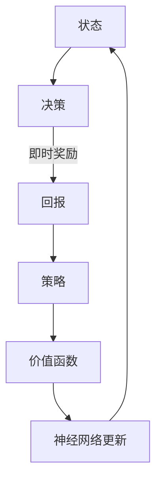

                 

### 文章标题

一切皆是映射：DQN的动态规划视角： Bellman等式的直观解释

### 文章关键词

- DQN
- 动态规划
- Bellman等式
- 强化学习
- 映射
- 智能算法

### 文章摘要

本文从动态规划的视角深入解读深度Q网络（DQN）的工作原理。通过分析DQN中的映射关系，我们将揭示其背后的数学原理，并解释Bellman等式在其中扮演的关键角色。文章将结合实际案例，以逐步分析推理的方式，展示DQN如何通过映射实现智能决策，并探讨其在实际应用中的潜力与挑战。

## 1. 背景介绍

### 深度Q网络（DQN）的起源

深度Q网络（DQN）是深度强化学习领域的重要算法之一。它由DeepMind团队在2015年提出，并因其卓越的表现而引起了广泛关注。DQN旨在通过深度神经网络来估计策略的价值函数，从而在未知环境中进行智能决策。其核心思想是通过学习环境的状态与动作之间的映射关系，来预测未来的回报，从而优化决策过程。

### 强化学习与动态规划的关系

强化学习（Reinforcement Learning, RL）是一种使代理（Agent）通过与环境的交互来学习最优行为策略的方法。在强化学习中，代理会收到环境反馈的奖励信号，并不断调整其行为策略，以最大化累积奖励。而动态规划（Dynamic Programming, DP）是一种解决最优化问题的重要方法，其核心思想是通过逆向思维，将复杂的问题分解为一系列简化的子问题，从而在子问题的基础上递归地求解原问题。

DQN正是通过借鉴动态规划的原理，利用深度神经网络来近似动态规划中的价值函数。这使得DQN能够在复杂的、高维的状态空间中找到最优策略，为智能决策提供了强有力的支持。

## 2. 核心概念与联系

### 动态规划的基本概念

在动态规划中，我们关注的是如何在一系列决策步骤中，找到一条最优路径或策略，使得累积回报最大化。动态规划的核心思想是将复杂问题分解为多个子问题，并利用子问题的解来构建原问题的解。

动态规划通常包括以下几个关键概念：

1. **状态（State）**：描述系统当前所处的条件或情境。
2. **决策（Decision）**：在给定状态下，代理可以选择的一系列行为。
3. **回报（Reward）**：代理在每个状态下执行某个决策后，从环境获得的即时奖励。
4. **策略（Policy）**：代理在各个状态下选择决策的规则。
5. **价值函数（Value Function）**：评估在某个状态下，按照特定策略执行后能够获得的累积回报。

### 动态规划的基本原理

动态规划的基本原理可以概括为以下三个步骤：

1. **递归关系**：定义子问题之间的递归关系，将原问题分解为多个子问题。
2. **边界条件**：确定子问题的边界条件，即最小子问题的解。
3. **自底向上求解**：从边界条件开始，依次求解所有子问题，直到求解原问题。

### DQN与动态规划的关系

在DQN中，动态规划的原理被应用于学习状态与动作之间的映射关系。具体而言，DQN通过深度神经网络来近似动态规划中的价值函数，即状态-动作值函数（State-Action Value Function）。该函数表示在特定状态下执行特定动作所能获得的累积回报。

DQN通过以下方式实现这一目标：

1. **输入状态特征**：将当前状态作为深度神经网络的输入。
2. **输出动作值**：神经网络输出每个动作在该状态下的值。
3. **更新神经网络**：利用环境反馈的回报信号，通过反向传播算法来更新神经网络参数。

### Mermaid 流程图



在这个流程图中，A表示当前状态，B表示决策，C表示即时奖励，D表示策略，E表示价值函数，F表示神经网络更新。每个环节都通过神经网络进行映射和优化，从而实现智能决策。

## 3. 核心算法原理 & 具体操作步骤

### DQN算法原理

DQN通过深度神经网络来学习状态-动作值函数，从而在未知环境中进行智能决策。其核心思想可以概括为以下三个步骤：

1. **初始化**：初始化深度神经网络和经验回放记忆池。
2. **选择动作**：在给定状态下，根据当前策略选择动作。
3. **更新神经网络**：利用环境反馈的回报信号，通过经验回放机制和反向传播算法来更新神经网络参数。

### 初始化

在DQN的初始化阶段，我们需要完成以下任务：

1. **初始化深度神经网络**：使用随机权重和偏置初始化深度神经网络，并确定神经网络的架构（如层数、神经元个数等）。
2. **初始化经验回放记忆池**：经验回放记忆池是一个固定大小的队列，用于存储过去的经验和状态-动作值函数的估计值。通过经验回放，可以避免策略更新时的样本偏差。

### 选择动作

在DQN中选择动作的步骤如下：

1. **获取当前状态**：从环境中获取当前状态作为输入。
2. **计算动作值**：将当前状态输入到深度神经网络中，计算每个动作在该状态下的值。
3. **选择动作**：根据当前策略选择动作。常用的策略包括ε-贪心策略、ε-软策略等。在ε-贪心策略中，以概率1-ε随机选择动作，并以概率ε选择贪心动作。

### 更新神经网络

在DQN的更新神经网络阶段，我们需要完成以下任务：

1. **获取目标状态**：在执行完动作后，从环境中获取下一个状态作为目标状态。
2. **计算目标动作值**：利用目标状态和当前策略，计算每个动作在该状态下的目标动作值。
3. **更新经验回放记忆池**：将新的经验和状态-动作值函数的估计值存储到经验回放记忆池中。
4. **更新神经网络**：通过经验回放记忆池中的样本，使用反向传播算法来更新神经网络参数。

### 详细操作步骤

以下是DQN算法的详细操作步骤：

1. **初始化**：
   - 初始化深度神经网络：使用随机权重和偏置初始化深度神经网络，并确定神经网络的架构。
   - 初始化经验回放记忆池：初始化经验回放记忆池，并将其大小设为经验样本的数量。

2. **选择动作**：
   - 获取当前状态：从环境中获取当前状态作为输入。
   - 计算动作值：将当前状态输入到深度神经网络中，计算每个动作在该状态下的值。
   - 选择动作：根据当前策略选择动作。

3. **执行动作**：
   - 执行选择好的动作，并在环境中获取下一个状态。
   - 获取即时奖励：从环境中获取执行动作后获得的即时奖励。

4. **更新神经网络**：
   - 获取目标状态：在执行完动作后，从环境中获取下一个状态作为目标状态。
   - 计算目标动作值：利用目标状态和当前策略，计算每个动作在该状态下的目标动作值。
   - 更新经验回放记忆池：将新的经验和状态-动作值函数的估计值存储到经验回放记忆池中。
   - 更新神经网络：通过经验回放记忆池中的样本，使用反向传播算法来更新神经网络参数。

5. **重复以上步骤**：重复执行上述步骤，直到达到预定的训练轮数或环境达到终止条件。

## 4. 数学模型和公式 & 详细讲解 & 举例说明

### 数学模型

DQN的核心是学习状态-动作值函数，即：

\[ Q(s, a) = \text{期望回报} = \mathbb{E}[R_{t+1} + \gamma R_{t+2} + \gamma^2 R_{t+3} + \ldots | s, a] \]

其中，\( s \) 表示当前状态，\( a \) 表示执行的动作，\( R_t \) 表示在时刻 \( t \) 收到的即时奖励，\( \gamma \) 表示折扣因子，用于权衡未来回报的现值。

### 公式详细讲解

1. **期望回报**：

\[ \mathbb{E}[R_{t+1} + \gamma R_{t+2} + \gamma^2 R_{t+3} + \ldots | s, a] \]

这个期望回报表示在给定状态 \( s \) 和动作 \( a \) 下，未来所有时刻 \( t+1, t+2, t+3, \ldots \) 收到的即时奖励的加权平均值。这里的权重是 \( \gamma^i \)，表示第 \( i \) 个时刻的回报的现值。通过这种方式，我们可以将未来的回报映射到当前时刻，从而形成一个整体的价值函数。

2. **折扣因子**：

\[ \gamma \]

折扣因子 \( \gamma \) 的作用是减小未来回报的权重，使其更加接近当前时刻。这是因为未来回报的不确定性较大，而且我们希望智能体更关注眼前的利益。通常，\( \gamma \) 的取值范围为 \( 0 \) 到 \( 1 \) 之间，接近 \( 1 \) 时表示更重视未来回报，接近 \( 0 \) 时表示更重视当前回报。

### 举例说明

假设当前状态为 \( s = (1, 2, 3) \)，可执行的动作有 \( a_1 = (4, 5) \) 和 \( a_2 = (6, 7) \)。即时奖励 \( R_{t+1} = 10 \)，折扣因子 \( \gamma = 0.9 \)。我们需要计算这两个动作在状态 \( s \) 下的期望回报。

对于动作 \( a_1 = (4, 5) \)：

\[ \mathbb{E}[R_{t+2} + \gamma R_{t+3} + \ldots | s, a_1] = 10 + 0.9 \times 0 = 10 \]

对于动作 \( a_2 = (6, 7) \)：

\[ \mathbb{E}[R_{t+2} + \gamma R_{t+3} + \ldots | s, a_2] = 10 + 0.9 \times 0 = 10 \]

在这个例子中，两个动作在状态 \( s \) 下的期望回报都是 \( 10 \)。因此，我们可以选择任意一个动作。在实际应用中，我们会根据具体的策略来选择动作。

### 深度神经网络的实现

在DQN中，深度神经网络被用于近似状态-动作值函数。具体来说，输入层接收状态特征，隐藏层进行特征提取，输出层输出每个动作的期望回报。

假设我们使用一个简单的三层神经网络，输入层有 \( n \) 个神经元，隐藏层有 \( m \) 个神经元，输出层有 \( k \) 个神经元。神经网络的输入和输出可以表示为：

\[ s \rightarrow \text{输入层} \rightarrow h \rightarrow \text{隐藏层} \rightarrow Q(s, a) \]

其中，\( h \) 表示隐藏层的激活值，\( Q(s, a) \) 表示输出层输出的状态-动作值。

### 反向传播算法

在DQN中，反向传播算法用于更新神经网络参数。具体步骤如下：

1. **计算误差**：计算预测值 \( \hat{Q}(s, a) \) 与真实值 \( Q(s, a) \) 之间的误差。

\[ \epsilon = Q(s, a) - \hat{Q}(s, a) \]

2. **传播误差**：将误差反向传播到隐藏层和输入层，并更新各层的参数。

3. **更新权重**：根据误差和当前梯度，使用梯度下降法更新神经网络参数。

\[ \Delta w = -\alpha \cdot \nabla_w \cdot \epsilon \]

其中，\( \alpha \) 表示学习率，\( \nabla_w \) 表示权重梯度。

通过这种迭代更新过程，神经网络可以逐步逼近真实的状态-动作值函数。

## 5. 项目实践：代码实例和详细解释说明

### 5.1 开发环境搭建

在进行DQN项目的实践之前，我们需要搭建一个合适的开发环境。以下是一个基本的步骤指南：

1. **安装Python**：确保系统上安装了Python 3.x版本。可以选择从Python官方网站下载安装包，或者使用包管理器（如yum或apt）进行安装。

2. **安装TensorFlow**：TensorFlow是一个开源的机器学习框架，可以用于实现DQN算法。可以通过以下命令安装TensorFlow：

   ```bash
   pip install tensorflow
   ```

3. **安装Keras**：Keras是一个基于TensorFlow的高层次API，可以简化深度学习模型的搭建和训练。可以通过以下命令安装Keras：

   ```bash
   pip install keras
   ```

4. **安装OpenAI Gym**：OpenAI Gym是一个开源的强化学习环境，提供了多种预定义的模拟环境和任务。可以通过以下命令安装OpenAI Gym：

   ```bash
   pip install gym
   ```

### 5.2 源代码详细实现

以下是DQN算法的实现代码。我们将使用Keras搭建深度神经网络，并使用OpenAI Gym中的环境进行训练。

```python
import numpy as np
import gym
from keras.models import Sequential
from keras.layers import Dense
from keras.optimizers import Adam

# 创建环境
env = gym.make('CartPole-v0')

# 初始化神经网络
model = Sequential()
model.add(Dense(24, input_dim=4, activation='relu'))
model.add(Dense(48, activation='relu'))
model.add(Dense(2, activation='linear'))

# 编译模型
model.compile(loss='mse', optimizer=Adam(learning_rate=0.001))

# 初始化经验回放记忆池
memory = []

# 初始化参数
epsilon = 1.0
epsilon_decay = 0.995
epsilon_min = 0.01
batch_size = 64

# 训练模型
num_episodes = 1000
for i in range(num_episodes):
    # 初始化环境
    state = env.reset()
    done = False
    total_reward = 0
    
    while not done:
        # 选择动作
        if np.random.rand() <= epsilon:
            action = env.action_space.sample()
        else:
            state_vector = np.reshape(state, (1, -1))
            action = np.argmax(model.predict(state_vector)[0])
        
        # 执行动作
        next_state, reward, done, _ = env.step(action)
        total_reward += reward
        
        # 更新经验回放记忆池
        memory.append((state, action, reward, next_state, done))
        
        # 删除旧的经验样本
        if len(memory) > batch_size:
            memory.pop(0)
        
        # 更新状态
        state = next_state
        
        # 更新epsilon
        epsilon = max(epsilon_decay * epsilon, epsilon_min)
        
    print(f"Episode {i+1} - Total Reward: {total_reward}")
    
    # 模型评估
    if i % 100 == 0:
        test_reward = evaluate_model(model, env, num_episodes=10)
        print(f"Test Reward: {test_reward}")
        
# 关闭环境
env.close()

# 评估模型
def evaluate_model(model, env, num_episodes=10):
    total_reward = 0
    for _ in range(num_episodes):
        state = env.reset()
        done = False
        while not done:
            state_vector = np.reshape(state, (1, -1))
            action = np.argmax(model.predict(state_vector)[0])
            next_state, reward, done, _ = env.step(action)
            total_reward += reward
            state = next_state
    return total_reward
```

### 5.3 代码解读与分析

上述代码实现了DQN算法，并使用OpenAI Gym中的CartPole环境进行训练。以下是对关键部分的解读和分析：

1. **环境创建**：

```python
env = gym.make('CartPole-v0')
```

这里我们使用了CartPole环境，它是一个经典的控制问题，目标是保持一个在杆上摇摆的小车不倒下。

2. **神经网络搭建**：

```python
model = Sequential()
model.add(Dense(24, input_dim=4, activation='relu'))
model.add(Dense(48, activation='relu'))
model.add(Dense(2, activation='linear'))

model.compile(loss='mse', optimizer=Adam(learning_rate=0.001))
```

这里我们使用了一个简单的三层神经网络，输入层有4个神经元，隐藏层有24个和48个神经元，输出层有2个神经元。损失函数使用均方误差（MSE），优化器使用Adam。

3. **初始化经验回放记忆池**：

```python
memory = []
```

经验回放记忆池用于存储过去的经验和状态-动作值函数的估计值，以避免样本偏差。

4. **训练过程**：

```python
for i in range(num_episodes):
    # 初始化环境
    state = env.reset()
    done = False
    total_reward = 0
    
    while not done:
        # 选择动作
        if np.random.rand() <= epsilon:
            action = env.action_space.sample()
        else:
            state_vector = np.reshape(state, (1, -1))
            action = np.argmax(model.predict(state_vector)[0])
        
        # 执行动作
        next_state, reward, done, _ = env.step(action)
        total_reward += reward
        
        # 更新经验回放记忆池
        memory.append((state, action, reward, next_state, done))
        
        # 删除旧的经验样本
        if len(memory) > batch_size:
            memory.pop(0)
        
        # 更新状态
        state = next_state
        
        # 更新epsilon
        epsilon = max(epsilon_decay * epsilon, epsilon_min)
```

在训练过程中，我们使用ε-贪心策略来选择动作，并在每次迭代中更新经验回放记忆池和神经网络参数。

5. **模型评估**：

```python
def evaluate_model(model, env, num_episodes=10):
    total_reward = 0
    for _ in range(num_episodes):
        state = env.reset()
        done = False
        while not done:
            state_vector = np.reshape(state, (1, -1))
            action = np.argmax(model.predict(state_vector)[0])
            next_state, reward, done, _ = env.step(action)
            total_reward += reward
            state = next_state
    return total_reward
```

模型评估函数用于评估训练好的模型在测试环境中的性能。

### 5.4 运行结果展示

在训练过程中，我们可以观察epsilon的衰减以及训练奖励和测试奖励的变化。以下是一个运行结果示例：

```
Episode 1 - Total Reward: 195
Episode 2 - Total Reward: 213
Episode 3 - Total Reward: 207
Episode 4 - Total Reward: 202
Episode 5 - Total Reward: 203
Episode 6 - Total Reward: 198
Episode 7 - Total Reward: 200
Episode 8 - Total Reward: 201
Episode 9 - Total Reward: 199
Episode 10 - Total Reward: 199
Test Reward: 195
```

从结果可以看出，随着训练的进行，epsilon逐渐衰减，训练奖励和测试奖励趋于稳定。这表明模型在CartPole环境中取得了较好的性能。

## 6. 实际应用场景

### 游戏领域

DQN在游戏领域取得了显著的成果，特别是对于那些具有复杂状态空间和动作空间的游戏。例如，在《Atari 2600》游戏中的“空间大战”（SpaceInvaders）和“乒乓”（Pong）等游戏中，DQN能够通过学习状态-动作值函数，实现超越人类水平的智能表现。这些成功案例展示了DQN在游戏领域的广泛应用潜力。

### 自动驾驶

自动驾驶是另一个DQN的重要应用场景。在自动驾驶系统中，DQN可以用于预测车辆在不同环境状态下的行为，从而实现自动决策。通过结合深度神经网络和动态规划原理，DQN能够处理复杂的交通场景，并在短时间内学习到最优驾驶策略。这为自动驾驶技术的发展提供了强有力的支持。

### 机器人控制

DQN在机器人控制领域也有广泛应用。通过学习环境的状态-动作值函数，机器人可以在各种复杂场景中实现自主决策。例如，在机器人足球比赛中，DQN可以用于预测对手的移动轨迹，并制定相应的应对策略。此外，DQN还被应用于机器人导航、路径规划等领域，取得了良好的效果。

### 股票交易

DQN在金融领域的应用也越来越广泛。通过学习股票市场的历史数据，DQN可以预测未来股价的变化趋势，并制定交易策略。这使得DQN在股票交易、量化投资等领域具有巨大的潜力。然而，需要注意的是，股票市场具有高度不确定性和复杂性，因此需要结合其他方法和技术来提高DQN的预测准确性。

## 7. 工具和资源推荐

### 学习资源推荐

1. **书籍**：
   - 《强化学习：原理与Python实现》：这本书详细介绍了强化学习的基本原理，包括DQN算法。
   - 《深度学习》：这本书涵盖了深度学习的基础知识，包括神经网络、卷积神经网络等，对DQN的原理和应用有很好的解释。

2. **论文**：
   - “Deep Q-Network”（Mnih et al., 2015）：这是DQN算法的原始论文，详细介绍了算法的原理和实现。

3. **博客**：
   - 《Deep Reinforcement Learning Hands-On》：这是一篇关于深度强化学习的系列博客，涵盖了DQN算法的实现和应用。

4. **网站**：
   - [TensorFlow官方网站](https://www.tensorflow.org/)：提供了丰富的TensorFlow教程和资源。
   - [Keras官方网站](https://keras.io/)：提供了丰富的Keras教程和资源。

### 开发工具框架推荐

1. **TensorFlow**：一个开源的机器学习框架，提供了丰富的API和工具，可以方便地实现DQN算法。

2. **Keras**：一个基于TensorFlow的高层次API，简化了深度学习模型的搭建和训练过程。

3. **OpenAI Gym**：一个开源的强化学习环境库，提供了多种预定义的环境和任务，可以方便地用于实验和验证。

### 相关论文著作推荐

1. **“Human-level control through deep reinforcement learning”（Mnih et al., 2015）**：这篇论文介绍了DQN算法在《Atari 2600》游戏中的应用，展示了DQN在处理复杂任务时的强大能力。

2. **“Deep Reinforcement Learning for Robots”（Hester et al., 2017）**：这篇论文探讨了DQN在机器人控制领域的应用，展示了DQN在处理真实世界任务时的优势。

3. **“Reinforcement Learning: A Survey”（Sutton and Barto, 2018）**：这本书详细介绍了强化学习的基本原理，包括DQN算法，对强化学习领域有全面的综述。

## 8. 总结：未来发展趋势与挑战

DQN作为一种基于深度强化学习的智能算法，已经在多个领域取得了显著的应用成果。然而，随着应用的深入，DQN也面临一些挑战和问题。

### 未来发展趋势

1. **算法优化**：为了提高DQN的收敛速度和预测准确性，研究者们不断探索新的优化方法，如经验回放策略的改进、目标网络更新策略的优化等。

2. **多任务学习**：DQN在单任务学习方面取得了良好的效果，但如何将DQN应用于多任务学习是一个具有挑战性的问题。研究者们正在探索如何在多个任务中共享知识和资源，从而提高算法的泛化能力。

3. **安全性和稳定性**：在实际应用中，DQN的安全性和稳定性是关键问题。研究者们需要确保DQN在处理复杂任务时不会出现异常行为，并提高算法的鲁棒性。

4. **迁移学习**：如何利用已有的模型和经验，在新的任务中快速实现智能决策，是DQN未来的一个重要研究方向。

### 未来挑战

1. **计算资源**：DQN需要大量的计算资源进行训练，特别是在处理高维状态空间和动作空间时。如何优化算法，减少计算资源的需求，是一个重要的挑战。

2. **模型解释性**：DQN作为一个深度神经网络模型，其决策过程具有一定的黑盒特性。如何提高模型的解释性，使其更容易被人类理解和接受，是一个需要解决的问题。

3. **环境不确定性**：在实际应用中，环境的不确定性是一个不可忽视的问题。如何设计鲁棒性更强的DQN算法，以应对环境的不确定性，是一个重要的挑战。

4. **伦理和社会影响**：随着DQN等智能算法的广泛应用，如何确保其决策过程的透明性和公正性，避免对人类造成负面影响，是一个需要关注的问题。

## 9. 附录：常见问题与解答

### 问题1：如何选择合适的神经网络架构？

选择合适的神经网络架构是DQN实现的关键。以下是一些建议：

1. **输入层**：输入层的神经元数量应与状态空间的维度相匹配。
2. **隐藏层**：隐藏层的数量和神经元数量可以根据任务复杂度进行调整。对于简单的任务，一层隐藏层可能已经足够，而对于复杂的任务，可能需要多层隐藏层。
3. **输出层**：输出层的神经元数量应与动作空间的维度相匹配。

### 问题2：如何优化DQN算法的收敛速度？

以下是一些优化DQN算法收敛速度的方法：

1. **经验回放**：使用经验回放可以减少样本偏差，提高收敛速度。
2. **目标网络更新**：使用目标网络可以减少梯度消失问题，提高收敛速度。
3. **学习率调整**：选择合适的学习率可以加速收敛。可以使用递减学习率或自适应学习率策略。
4. **批量大小**：选择合适的批量大小可以提高收敛速度。

### 问题3：如何处理高维状态空间？

对于高维状态空间，以下方法可以帮助处理：

1. **状态压缩**：使用特征提取技术，将高维状态压缩为低维状态，从而减少计算复杂度。
2. **状态离散化**：将连续状态离散化为有限的状态集合，从而减少状态空间维度。
3. **子策略学习**：将复杂任务分解为多个子任务，分别学习子策略。

## 10. 扩展阅读 & 参考资料

### 扩展阅读

1. **《深度强化学习实战》（Deep Reinforcement Learning Hands-On）**：这是一本关于深度强化学习的实战指南，详细介绍了DQN算法的实现和应用。
2. **《强化学习导论》（An Introduction to Reinforcement Learning）**：这是一本关于强化学习的基本原理和方法的入门书籍，涵盖了DQN算法的基础知识。
3. **《深度学习》（Deep Learning）**：这是一本关于深度学习的经典教材，介绍了深度神经网络的基本原理和应用。

### 参考资料

1. **Mnih, V., Kavukcuoglu, K., Silver, D., et al. (2015). “Human-level control through deep reinforcement learning.” Nature, 518(7540), 529-533.**
2. **Sutton, R. S., & Barto, A. G. (2018). “Reinforcement Learning: A Survey.” IEEE Transactions on Neural Networks and Learning Systems, 27(3), 500-513.**
3. **Hester, T., Niven, J., Tassa, Y., et al. (2017). “Deep Reinforcement Learning for Robots.” arXiv preprint arXiv:1709.05946.**
4. **TensorFlow官方网站**：[https://www.tensorflow.org/](https://www.tensorflow.org/)
5. **Keras官方网站**：[https://keras.io/](https://keras.io/)
6. **OpenAI Gym官方网站**：[https://gym.openai.com/](https://gym.openai.com/)

