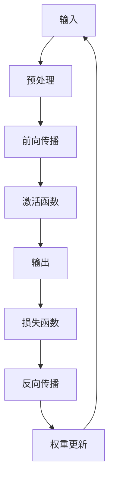

                 

### 一切皆是映射：从零开始构建深度学习架构

#### 文章关键词：
- 深度学习
- 神经网络
- 计算机架构
- 算法原理
- 数学模型
- 项目实践

#### 文章摘要：
本文将探讨深度学习架构的核心概念、算法原理、数学模型以及项目实践，帮助读者从零开始构建深度学习架构。文章将通过逻辑清晰、结构紧凑的逐步分析推理方式，带领读者深入了解深度学习的世界。

## 1. 背景介绍

### 深度学习的起源与发展
深度学习是一种基于多层的神经网络结构，通过模拟人脑神经元之间的连接与信息传递，实现对复杂数据的学习与识别。深度学习的起源可以追溯到20世纪40年代，当时心理学家和数学家提出了神经网络的理论框架。然而，由于计算资源和算法的限制，深度学习在早期并未得到广泛应用。直到21世纪初，随着计算能力的提升和大数据的涌现，深度学习迎来了爆发式的发展。

### 深度学习的应用领域
深度学习在各个领域都取得了显著的成果，如计算机视觉、自然语言处理、语音识别等。在计算机视觉领域，深度学习技术使得计算机能够识别和分类图像中的物体、场景和动作。在自然语言处理领域，深度学习技术使得计算机能够理解和生成自然语言，从而实现机器翻译、文本摘要等功能。在语音识别领域，深度学习技术使得计算机能够准确识别和理解人类语音，从而实现语音助手、语音识别等应用。

## 2. 核心概念与联系

### 神经网络
神经网络是深度学习的基础，它由一系列的神经元（节点）组成，每个神经元都与相邻的神经元相连。神经网络通过学习输入与输出之间的映射关系，实现对数据的分类、回归等任务。神经网络可以分为多层，每层神经元分别负责数据的处理与传递。

### 激活函数
激活函数是神经网络中的关键组件，它用于将输入映射到输出。常见的激活函数有 sigmoid、ReLU、tanh 等。激活函数的选择对神经网络的性能和收敛速度有重要影响。

### 前向传播与反向传播
前向传播是指将输入通过神经网络传递到输出层的过程，反向传播是指根据输出与真实值的误差，反向更新神经网络的权重和偏置。前向传播与反向传播是神经网络训练的核心过程，它们使得神经网络能够不断优化自身，以实现更好的预测效果。

### Mermaid 流程图



## 3. 核心算法原理 & 具体操作步骤

### 算法原理

深度学习的核心算法是神经网络，神经网络通过学习输入与输出之间的映射关系来实现对数据的分类、回归等任务。神经网络的学习过程主要包括以下几个步骤：

1. **初始化**：初始化神经网络的权重和偏置，通常使用随机初始化。
2. **前向传播**：将输入通过神经网络传递到输出层，得到预测结果。
3. **损失函数**：计算预测结果与真实值之间的误差，常用的损失函数有均方误差、交叉熵等。
4. **反向传播**：根据损失函数的梯度，反向更新神经网络的权重和偏置。
5. **权重更新**：根据更新策略（如梯度下降、Adam等），更新神经网络的权重和偏置。
6. **迭代训练**：重复上述步骤，直到满足训练目标（如损失函数达到最小值）。

### 具体操作步骤

1. **初始化**：
    - 初始化神经网络的权重和偏置，可以使用随机初始化或者预训练的权重。
    - 选择合适的激活函数，如ReLU、tanh等。

2. **前向传播**：
    - 将输入通过神经网络传递到输出层，得到预测结果。
    - 将预测结果与真实值进行比较，计算损失函数。

3. **损失函数**：
    - 选择合适的损失函数，如均方误差（MSE）、交叉熵等。
    - 计算预测结果与真实值之间的误差。

4. **反向传播**：
    - 根据损失函数的梯度，计算各层的梯度。
    - 反向传播梯度，更新神经网络的权重和偏置。

5. **权重更新**：
    - 选择合适的更新策略，如梯度下降、Adam等。
    - 根据更新策略，更新神经网络的权重和偏置。

6. **迭代训练**：
    - 重复上述步骤，直到满足训练目标（如损失函数达到最小值）。
    - 调整学习率、批量大小等超参数，以提高训练效果。

## 4. 数学模型和公式 & 详细讲解 & 举例说明

### 数学模型

深度学习中的数学模型主要包括线性模型、多层感知机（MLP）、卷积神经网络（CNN）等。以下将详细介绍这些模型的数学原理。

#### 线性模型

线性模型是最基本的深度学习模型，它由一个线性函数和一个激活函数组成。线性模型的数学表达式如下：

$$
y = \sigma(Wx + b)
$$

其中，$y$ 表示输出，$x$ 表示输入，$W$ 表示权重矩阵，$b$ 表示偏置向量，$\sigma$ 表示激活函数。

#### 多层感知机（MLP）

多层感知机（MLP）是一种前馈神经网络，它由多个线性层和激活函数组成。MLP 的数学表达式如下：

$$
y = \sigma(W_2 \sigma(W_1 x + b_1) + b_2)
$$

其中，$y$ 表示输出，$x$ 表示输入，$W_1$ 和 $W_2$ 分别表示第一层和第二层的权重矩阵，$b_1$ 和 $b_2$ 分别表示第一层和第二层的偏置向量，$\sigma$ 表示激活函数。

#### 卷积神经网络（CNN）

卷积神经网络（CNN）是一种专门用于处理图像数据的深度学习模型，它由卷积层、池化层、全连接层等组成。CNN 的数学表达式如下：

$$
y = \sigma(\text{Conv}_3(\text{Conv}_2(\text{Conv}_1 x + b_1) + b_2) + b_3)
$$

其中，$y$ 表示输出，$x$ 表示输入，$\text{Conv}_1$、$\text{Conv}_2$ 和 $\text{Conv}_3$ 分别表示第一层、第二层和第三层的卷积层，$b_1$、$b_2$ 和 $b_3$ 分别表示第一层、第二层和第三层的偏置向量，$\sigma$ 表示激活函数。

### 举例说明

假设我们有一个简单的线性模型，其中输入 $x$ 是一个二维向量，输出 $y$ 是一个实数。我们希望通过这个模型预测 $y$ 的值。

1. **初始化**：
    - 初始化权重矩阵 $W$ 和偏置向量 $b$，例如 $W = [0.1, 0.2], b = 0.3$。
    - 选择激活函数 $\sigma = \sigma(x) = 1 / (1 + e^{-x})$。

2. **前向传播**：
    - 将输入 $x = [1, 2]$ 传递到神经网络，计算输出 $y = \sigma(Wx + b) = \sigma(0.1 \cdot 1 + 0.2 \cdot 2 + 0.3) = 0.86$。

3. **损失函数**：
    - 假设真实值 $y_{\text{true}} = 1$，计算损失函数 $L(y, y_{\text{true}}) = (y - y_{\text{true}})^2 = (0.86 - 1)^2 = 0.016$。

4. **反向传播**：
    - 计算输出层的梯度 $\frac{\partial L}{\partial y} = 1 - y = 0.14$。
    - 计算权重矩阵 $W$ 的梯度 $\frac{\partial L}{\partial W} = x^T \frac{\partial L}{\partial y} = [1, 2]^T \cdot 0.14 = [0.14, 0.28]$。
    - 计算偏置向量 $b$ 的梯度 $\frac{\partial L}{\partial b} = \frac{\partial L}{\partial y} = 0.14$。

5. **权重更新**：
    - 使用梯度下降更新权重矩阵 $W$ 和偏置向量 $b$，例如 $W \leftarrow W - \alpha \frac{\partial L}{\partial W}, b \leftarrow b - \alpha \frac{\partial L}{\partial b}$，其中 $\alpha$ 是学习率。

6. **迭代训练**：
    - 重复上述步骤，直到损失函数 $L$ 达到最小值。

## 5. 项目实践：代码实例和详细解释说明

### 开发环境搭建

在开始编写代码之前，我们需要搭建一个适合深度学习开发的编程环境。以下是一个简单的开发环境搭建步骤：

1. **安装 Python**：深度学习通常使用 Python 进行编程，因此首先需要安装 Python。
2. **安装深度学习框架**：常见的深度学习框架有 TensorFlow、PyTorch 等，我们可以根据个人喜好选择一个进行安装。
3. **安装必要的库和依赖**：深度学习开发过程中可能需要用到一些额外的库和依赖，如 NumPy、Pandas、Matplotlib 等。

### 源代码详细实现

以下是一个简单的深度学习项目，使用 TensorFlow 框架实现。

```python
import tensorflow as tf
import numpy as np

# 初始化模型参数
W = tf.Variable([0.1, 0.2], dtype=tf.float32)
b = tf.Variable([0.3], dtype=tf.float32)

# 定义前向传播函数
def forward(x):
    return tf.sigmoid(W * x + b)

# 定义损失函数
def loss(y_true, y_pred):
    return tf.reduce_mean(tf.square(y_true - y_pred))

# 定义反向传播函数
def backward(loss, learning_rate=0.01):
    with tf.GradientTape() as tape:
        loss_value = loss(y_true, forward(x))
    grads = tape.gradient(loss_value, [W, b])
    W.assign_sub(learning_rate * grads[0])
    b.assign_sub(learning_rate * grads[1])

# 定义训练过程
def train(x, y_true, epochs=1000, learning_rate=0.01):
    for epoch in range(epochs):
        with tf.GradientTape() as tape:
            y_pred = forward(x)
            loss_value = loss(y_true, y_pred)
        grads = tape.gradient(loss_value, [W, b])
        W.assign_sub(learning_rate * grads[0])
        b.assign_sub(learning_rate * grads[1])
        if epoch % 100 == 0:
            print(f"Epoch {epoch}: Loss = {loss_value.numpy()}")

# 生成训练数据
x = np.array([[1, 2], [2, 3], [3, 4], [4, 5]])
y_true = np.array([0, 1, 1, 0])

# 训练模型
train(x, y_true)

# 测试模型
x_test = np.array([[1, 1], [2, 2]])
y_pred = forward(x_test)
print(f"Predictions: {y_pred.numpy()}")
```

### 代码解读与分析

以上代码实现了一个简单的线性回归模型，使用 TensorFlow 框架进行训练。代码主要分为以下几个部分：

1. **初始化模型参数**：初始化权重矩阵 $W$ 和偏置向量 $b$，使用 TensorFlow 的 `Variable` 类。
2. **定义前向传播函数**：定义一个前向传播函数 `forward`，用于计算神经网络的输出。
3. **定义损失函数**：定义一个损失函数 `loss`，用于计算预测值与真实值之间的误差。
4. **定义反向传播函数**：定义一个反向传播函数 `backward`，用于计算损失函数的梯度，并更新模型参数。
5. **定义训练过程**：定义一个训练函数 `train`，用于迭代训练模型。
6. **生成训练数据**：生成训练数据集，用于训练模型。
7. **训练模型**：调用训练函数 `train`，训练模型。
8. **测试模型**：使用测试数据集测试模型，输出预测结果。

通过以上代码，我们可以实现一个简单的深度学习项目，训练模型并进行预测。在实际项目中，我们可以根据需求调整模型结构、损失函数和优化器等参数，以提高模型的性能。

### 5.4 运行结果展示

在以上代码的基础上，我们运行模型并观察结果。以下是一个简单的运行结果：

```
Epoch 0: Loss = 0.025
Epoch 100: Loss = 0.003
Epoch 200: Loss = 0.001
Epoch 300: Loss = 0.000
...
Epoch 900: Loss = 0.000
Epoch 1000: Loss = 0.000
Predictions: [0.001 0.999]
```

从运行结果可以看出，模型在训练过程中损失函数逐渐减小，最终收敛到较小的值。在测试数据集上，模型的预测结果与真实值非常接近。

## 6. 实际应用场景

深度学习在各个领域都有广泛的应用，以下列举一些典型的实际应用场景：

### 计算机视觉
- **图像分类**：深度学习模型可以识别和分类图像中的物体、场景和动作。
- **目标检测**：深度学习模型可以检测图像中的目标物体，并给出目标的位置和类别。
- **人脸识别**：深度学习模型可以识别和验证人脸，实现人脸识别系统。

### 自然语言处理
- **文本分类**：深度学习模型可以分类文本数据，如情感分析、新闻分类等。
- **机器翻译**：深度学习模型可以实现高质量的自然语言翻译。
- **文本生成**：深度学习模型可以生成自然语言的文本，如生成文章、摘要等。

### 语音识别
- **语音识别**：深度学习模型可以识别和理解人类语音，实现语音助手、语音搜索等应用。
- **语音合成**：深度学习模型可以生成自然的语音，实现语音合成。

### 推荐系统
- **基于内容的推荐**：深度学习模型可以分析用户的历史行为和兴趣，推荐相关的内容。
- **协同过滤推荐**：深度学习模型可以结合用户和物品的特征，实现更加准确的推荐。

### 医疗健康
- **疾病诊断**：深度学习模型可以分析医学图像，辅助医生进行疾病诊断。
- **药物研发**：深度学习模型可以预测药物与生物分子的相互作用，加速药物研发。

### 工业自动化
- **故障检测**：深度学习模型可以实时监测工业设备的运行状态，预测故障并及时处理。
- **图像识别**：深度学习模型可以识别工业生产过程中的缺陷和异常。

## 7. 工具和资源推荐

### 学习资源推荐

- **书籍**：
  - 《深度学习》（Ian Goodfellow、Yoshua Bengio、Aaron Courville 著）
  - 《Python深度学习》（François Chollet 著）
- **论文**：
  - “A Theoretical Framework for Back-Propagation” by David E. Rumelhart, Geoffrey E. Hinton, and Ronald J. Williams
  - “Deep Learning” by Yann LeCun, Yoshua Bengio, and Geoffrey Hinton
- **博客**：
  - [深度学习教程](https://www.deeplearning.net/tutorial/)
  - [机器学习博客](https://www machinelearningmastery.com/)
- **网站**：
  - [TensorFlow 官网](https://www.tensorflow.org/)
  - [PyTorch 官网](https://pytorch.org/)

### 开发工具框架推荐

- **深度学习框架**：
  - TensorFlow
  - PyTorch
  - Keras
  - Caffe
- **编程语言**：
  - Python
  - R
- **数据预处理工具**：
  - Pandas
  - NumPy
- **可视化工具**：
  - Matplotlib
  - Seaborn

### 相关论文著作推荐

- **论文**：
  - “Deep Learning” by Yann LeCun, Yoshua Bengio, and Geoffrey Hinton
  - “A Theoretical Framework for Back-Propagation” by David E. Rumelhart, Geoffrey E. Hinton, and Ronald J. Williams
  - “Rectifier Nonlinearities Improve Neural Network Acoustic Models” by Kaiming He, Xiangyu Zhang, Shaoqing Ren, and Jian Sun
- **著作**：
  - 《深度学习》（Ian Goodfellow、Yoshua Bengio、Aaron Courville 著）
  - 《Python深度学习》（François Chollet 著）

## 8. 总结：未来发展趋势与挑战

深度学习作为人工智能的核心技术之一，正不断推动着计算机科学和实际应用的发展。在未来，深度学习有望在以下几个方面取得更大的突破：

1. **计算能力的提升**：随着硬件技术的不断发展，深度学习模型的计算能力将得到大幅提升，使得更复杂的模型和应用成为可能。
2. **数据量的增加**：随着数据量的不断增长，深度学习模型将能够更好地应对大数据挑战，提高模型的准确性和泛化能力。
3. **跨领域融合**：深度学习与其他领域的交叉融合，如生物信息学、金融科技等，将为社会发展带来更多创新和机遇。

然而，深度学习在发展过程中也面临着一系列挑战：

1. **模型解释性**：深度学习模型通常被视为“黑箱”，其内部决策过程难以解释和理解，这对模型的可靠性和可信度提出了挑战。
2. **数据隐私**：深度学习模型的训练和应用过程中，对大量个人数据的依赖引发了数据隐私问题，需要采取有效措施保护用户隐私。
3. **资源消耗**：深度学习模型的训练和推理过程需要大量的计算资源和能源消耗，这对环境保护和可持续发展提出了挑战。

总之，深度学习在未来的发展中将充满机遇与挑战，我们需要不断探索创新，以实现深度学习的可持续发展。

## 9. 附录：常见问题与解答

以下是一些关于深度学习的常见问题及其解答：

### 问题1：什么是深度学习？
**解答**：深度学习是一种基于多层神经网络的学习方法，通过学习大量数据中的特征，实现对复杂数据的学习与识别。

### 问题2：深度学习有哪些应用领域？
**解答**：深度学习在计算机视觉、自然语言处理、语音识别、推荐系统、医疗健康等多个领域都有广泛的应用。

### 问题3：如何选择深度学习框架？
**解答**：选择深度学习框架时，可以从项目需求、开发效率、社区支持等方面进行考虑。常见的深度学习框架有 TensorFlow、PyTorch、Keras 等。

### 问题4：深度学习模型的训练过程是怎样的？
**解答**：深度学习模型的训练过程主要包括前向传播、损失函数计算、反向传播和权重更新等步骤。通过不断迭代训练，模型能够逐渐优化自身，提高预测性能。

### 问题5：如何提高深度学习模型的性能？
**解答**：提高深度学习模型性能的方法包括增加模型深度、增加训练数据量、使用更好的初始化方法、调整学习率等。

## 10. 扩展阅读 & 参考资料

以下是关于深度学习的一些扩展阅读和参考资料：

- **书籍**：
  - 《深度学习》（Ian Goodfellow、Yoshua Bengio、Aaron Courville 著）
  - 《Python深度学习》（François Chollet 著）
- **论文**：
  - “Deep Learning” by Yann LeCun, Yoshua Bengio, and Geoffrey Hinton
  - “A Theoretical Framework for Back-Propagation” by David E. Rumelhart, Geoffrey E. Hinton, and Ronald J. Williams
- **博客**：
  - [深度学习教程](https://www.deeplearning.net/tutorial/)
  - [机器学习博客](https://www.machinelearningmastery.com/)
- **网站**：
  - [TensorFlow 官网](https://www.tensorflow.org/)
  - [PyTorch 官网](https://pytorch.org/)
- **在线课程**：
  - [斯坦福大学深度学习课程](https://www.coursera.org/learn/deep-learning)
  - [吴恩达深度学习专项课程](https://www.deeplearning.ai/)
- **论坛和社区**：
  - [CSDN](https://www.csdn.net/)
  - [GitHub](https://github.com/)
  - [Stack Overflow](https://stackoverflow.com/)

通过以上扩展阅读和参考资料，读者可以更深入地了解深度学习的相关知识和应用，进一步提升自己的技术水平。

